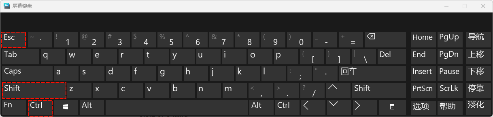
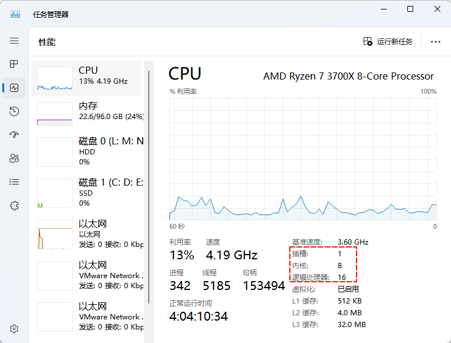

# 第一章：vi 和 vim 编辑器

## 1.1 概述

### 1.1.1  vi 和 vim 是什么？

* vi 和 vim 是两个流行的`文本编辑器`，它们在 Unix 和 Linux 系统中广泛使用。
* 它们都是基于`命令行`的`编辑器`，这意味着用户需要使用`键盘命令`来`编辑文本`。

### 1.1.2 历史

* vi 是一个古老的编辑器，它于 `1976` 年首次发布。vi 是一个非常强大的编辑器，它提供了许多高级功能，但它也以其陡峭的学习曲线而闻名。
* vim 是 vi 的一个改进版本，它于 `1991` 年首次发布。vim 比 vi 更强大，它提供了更多的功能和更好的用户界面。vim 也是一个非常流行的编辑器，它在许多 Unix 和 Linux 系统中都是默认的编辑器。

### 1.1.3 区别

* vi 和 vim 的主要区别：

| 类别 | 备注                                                        |
| ---- | ----------------------------------------------------------- |
| vi   | 系统自带，不需要额外安装，但是没有 vim 功能强。             |
| vim  | 可能需要额外安装，是 vi 的升级版，实际工作中大多使用 vim 。 |

## 1.2 基本使用（⭐）

* 步骤 ① ：打开文件

```shell
vim 文件
```

> [!WARNING]
>
> * ① 如果文件`不存在`，则会`自动创建`；如果文件`存在`，则是`编辑文件`。
> * ② 如果文件`所在路径`中的`目录`不存在，则会在保存并退出的时候`报错`。

  * 步骤 ② ： 通过字母 `i` ，`进入编辑模式`，即可以编辑（修改）文件；其中，`i` 是 `insert` 的缩写


* 步骤 ③ ：通过 `esc` 键，`退出编辑模式`


* 步骤 ④ ：通过 `:wq` 进行`保存并退出`；其中，`w` 是 `write` 的缩写，`q` 是 `quit` 的缩写


* 步骤 ⑤ ：通过 `:q!` 进行强制退出不保存：


> [!NOTE]
>
> * 步骤 ④ 和 步骤 ⑤ 任选其一即可。
> * 步骤 ④ 和 步骤 ⑤ 可以使用 `:x`快捷键来代替，并且 `:x` 快捷键的作用是：如果文件内容修改，则编辑并退出；如果文件内容没有修改，则强制退出。


* 示例：

```shell
vim a.txt
```


## 1.3 vim 模式转换（⭐）

* vim 的模式有如下的几种：
  * ① 命令模式：通过 vi 或 vim 命令打开文件后进入的模式（默认，可以输入各种 vi 或 vim 命令，即快捷键）。
  * ② 编辑模式（插入模式）：用于编辑（修改）文件内容（需要输入对应的`字母`，如：i、a、o 等）。
  * ③ 底行模式：保存、退出、搜索、替换等。
  * ④ 可视化模式：用于批量编辑。

* 其对应的图示如下：


## 1.4 vim 快捷键（⭐）

### 1.4.1 前提

* 创建测试文件：

```shell
cat /etc/services /etc/NetworkManager/system-connections/eth0.nmconnection > /tmp/vim.log
```


### 1.4.2 移动光标类快捷键

* 移动到第一行的快捷键：

```shell
gg
```


* 移动到第 100 行的快捷键：

```shell
100gg
```


* 移动到最后一行的快捷键：

```shell
G（shift + g）
```


### 1.4.3 复制、删除(剪切)、粘贴快捷键

* 复制当前行的快捷键：

```shell 
yy
```


* 删除当前行的快捷键：

```shell
dd
```


* 粘贴到当前行的快捷键：

```shell
p
```


* 重复粘贴的快捷键：

```shell
5p
```


### 1.4.4 其它快捷键

* 撤销：

```shell
# u 是 undo 的缩写
u 
```


* 显示行号：

```shell
# nu 是 number 的缩写
:set nu
```


* 取消行号：

```shell
# nonu 是 no number 的缩写
:set nonu
```


* 搜索：

```shell
# n (next)继续向下搜索，N 继续向上搜索
/搜索内容
```


* 临时取消搜索语法高亮：

```shell
# noh 是 no highlight 的缩写
:noh
```


### 1.4.5 批量操作快捷键

* 批量删除文件开头的 `#` ：

```shell
① 定位到某列，通过 ctrl + v ，进入批量操作模式
```

```shell
② 选择要操作的区域(通过 ↑ 、↓ 、← 、→ 键)
```

```shell
③ 按 d ，进行删除
```


* 批量给文件开头添加 `#`：

```shell
① 定位到某列，通过 ctrl + v ，进入批量操作模式
```

```shell
② 选择要操作的区域(通过 ↑ 、↓ 、← 、→ 键)
```

```shell
③ 通过 shift + i （I），进入编辑模式
```

```shell
④ 写入内容
```

```shell
⑤ 按 esc 等待 ...
```


## 1.5 故障案例

* vim 编辑文件的时候提示：


* 故障演示：


* 原因：
  * ① vi/vim 在编辑文件的时候，会生成临时文件（以`.`开头的文件，即隐藏文件）。
  * ② 通过保存退出之后，隐藏文件会消失。
  * ③ 如果出现异常断电等情况，之后再次编辑该文件的时候，就会有上述的提示。

* 解决：根据提示，删除临时文件或恢复没有保存的数据！


# 第二章：服务器

## 2.1 概述

* 服务器的定义：
  * `服务器`是一种`计算机程序`或`设备`，它提供某种服务。
  * 服务器可以提供多种服务，例如：文件服务、打印服务、网络服务、数据库服务和应用程序服务。
  * 服务器通常安装在数据中心或其他安全的位置。
* 服务器的操作系统：
  * 服务器操作系统通常比桌面操作系统更强大，并且具有更多的安全功能。
  * 常见的服务器操作系统，包括：`Windows Server`、`Linux` 。
* 服务器的优缺点：
  * 优点：
    * 服务器可以集中存储和管理数据，从而提高数据安全性。
    * 服务器可以共享资源，例如：文件、打印机和应用程序，从而提高资源利用率。
    * 服务器可以提供集中管理，从而简化 IT 管理。
    * 服务器可以提高应用程序的性能和可靠性。
  * 缺点：
    * 服务器的成本可能很高。
    * 服务器需要专业的 IT 人员进行管理。
    * 服务器可能成为黑客攻击的目标。
* 总体而言，服务器对于现代计算非常重要。它们允许企业共享资源、提高效率和安全性。

## 2.2 服务器分类

* 按照`服务器`的`部署方式`分类：

| 服务器分类 | 特点                                                         | 选型建议       | 品牌厂商                                           |
| ---------- | ------------------------------------------------------------ | -------------- | -------------------------------------------------- |
| 物理服务器 | ① 物理服务器是指独立的服务器硬件，它可以安装在机架、塔式机箱或刀片机箱中。<br>② 物理服务器通常由企业或组织自行购买和管理。<br/>③ 物理服务器可以提供`更高的性能`和`安全性`，但`成本也更高`。 |                | 国外：戴尔 <br>国内：华为，浪潮...                 |
| 公有云     | ① 公有云是指由云服务提供商（CSP）管理的服务器和存储资源。<br/>② 公有云可以`按需使用`，企业或组织可以根据需要购买云服务。<br/>③ 公有云通常具有`较高的可靠性`和`可用性`，但`安全性可能较低`。 | 中小型初创公司 | 国外：亚马逊、微软云...<br>国内：阿里云、腾讯云... |
| 私有云     | ① 私有云是指由企业或组织自行管理的服务器和存储资源。<br/>② 私有云可以提供`更高的安全性`，但`成本也更高`。<br>③ 私有云通常部署在企业或组织自己的数据中心。 | 安全性要求较高 |                                                    |
| 混合云     | ① 混合云是指同时使用`物理服务器`、`公有云`和`私有云`的云计算模型。<br/>② 混合云可以提供更高的灵活性和可扩展性。 |                |                                                    |

* 物理服务器的分类：机架式服务器、塔式服务器、刀片式服务器。


# 第三章：目录结构深入（文件）

## 3.1 /etc 目录

### 3.1.1 概述

* 回顾 `/etc` 目录的作用，如下：

| 核心目录 | 备注                                                   |
| :------- | :----------------------------------------------------- |
| `/etc/`  | 系统服务`配置文件`的目录，存放系统、服务、命令的配置。 |

* `/etc` 目录下重要的`配置文件`，如下：

| /etc/文件                                                  | 备注                                                         | 企业应用                                                    |
| ---------------------------------------------------------- | ------------------------------------------------------------ | ----------------------------------------------------------- |
| `/etc/hostname`                                            | 主机名配置文件                                               | 每个 Linux 主机都需要配置主机名，根据主机名区分不同的功能。 |
| `/etc/hosts`                                               | 将主机名映射到 IP地址，以便在计算机本地进行本地域名解析，该文件允许系统在没有 DNS 服务器的情况下解析主机名 | 在网站中做访问使用。                                        |
| `/etc/NetworkManager/system-connections/eth0.nmconnection` | 网卡配置文件（CentOS 7 是 `/etc/sysconfig/network-scripts/ifcfg-eth0`） | 物理服务器通过修改此文件，云服务器无需修改                  |
| /etc/rc.local（rc 是 run command 的缩写）                  | ~~开机自启动的文件~~（即将废弃，推荐使用 systemd 服务或 udev 规则 ） | ~~将需要开机的时候自动运行的命令，服务放到该文件中~~        |
| /etc/fstab                                                 | 开机自动挂载的配置文件                                       | 配置磁盘挂载使用，后面讲解                                  |
| /etc/motd（motd 是 message of the day 的缩写）             | `用户系统登录时`显示的欢迎信息或公告                         | 一些云服务会显示自己的信息，如：AliCloud ECS ...            |
| /etc/issue <br>/etc/issue.net                              | 用于在`系统启动时`显示欢迎信息或登录提示。当用户尝试登录时，系统会显示该文件中的内容。 |                                                             |

### 3.1.2 主机名相关（⭐）

#### 3.1.2.1 概述
* `Linux 主机名`用于标识网络中的`计算机`。它在`局域网中唯一标识一台计算机`，也用于`识别计算机在网络上的位置`。

> [!NOTE]
>
> 主机名通常与 IP 地址相关联，使得其他计算机可以通过`主机名`找到并与之通信。

* Linux 主机名的`命名规则`包括以下几点：
  * ① 只能包含字母（a-z，A-Z）、数字（0-9）和连字符（-）。
  * ② 必须以字母或数字开头，不能以连字符开头或结尾。
  * ③ 主机名长度通常不超过 64 个字符。
  * ④ 主机名区分大小写。
  * ⑤ 最好避免使用下划线（_），因为某些软件可能无法正确处理带有下划线的主机名。
* 查看主机名命令：

```shell
hostname
```

```shell
cat /etc/hostname
```

* 修改主机名命令：

```shell
hostnamectl set-hostname xxx
```

> [!WARNING]
>
> * ① 通过 `hostnamectl` 修改主机名之后会立即生效，但是当前会话可能不会立即更新，可以输入 `bash` 刷新当前会话。
> * ② 通过 `hostnamectl` 修改主机名，就是通过修改 `/etc/hostname` 文件实现的。不过，通常情况下，我们都是使用 `hostnamectl` 命令修改主机名。

#### 3.1.2.2 案例

* 示例：查看主机名

```shell
hostname
```


* 示例：查看主机名：

```shell
cat /etc/hostname
```


* 修改主机名：

```shell
# 修改主机名
hostnamectl set-hostname redhat9
# 刷新当前会话
bash
```


### 3.1.3 网卡配置文件（⭐）

* 在 CentOS 7 及其之前，网卡配置文件是 `/etc/sysconfig/network-scripts/ifcfg-eth0` 文件。但是，在 AlmaLinux9 的时候已经废弃，我们可以通过如下命令来证明：

```shell
cd /etc/sysconfig/network-scripts/
```

```shell
cat readme-ifcfg-rh.txt
```


* 文件内容如下所示：

```
NetworkManager stores new network profiles in keyfile format in the
/etc/NetworkManager/system-connections/ directory.

Previously, NetworkManager stored network profiles in ifcfg format
in this directory (/etc/sysconfig/network-scripts/). However, the ifcfg
format is deprecated. By default, NetworkManager no longer creates
new profiles in this format.

Connection profiles in keyfile format have many benefits. For example,
this format is INI file-based and can easily be parsed and generated.

Each section in NetworkManager keyfiles corresponds to a NetworkManager
setting name as described in the nm-settings(5) and nm-settings-keyfile(5)
man pages. Each key-value-pair in a section is one of the properties
listed in the settings specification of the man page.

If you still use network profiles in ifcfg format, consider migrating
them to keyfile format. To migrate all profiles at once, enter:

# nmcli connection migrate

This command migrates all profiles from ifcfg format to keyfile
format and stores them in /etc/NetworkManager/system-connections/.

Alternatively, to migrate only a specific profile, enter:

# nmcli connection migrate <profile_name|UUID|D-Bus_path>

For further details, see:
* nm-settings-keyfile(5)
* nmcli(1)
```

* 翻译为中文大概就是：`/etc/sysconfig/network-scripts/ifcfg-eth0` 这类 `ifcfg` 格式的网卡配置文件已经废弃，现在已经迁移到 `/etc/NetworkManager/system-connections/`目录中，并使用 ini 格式，即：

```shell
cd /etc/NetworkManager/system-connections/
```

```shell
cat eth0.nmconnection
```


* 该配置文件的内容如下：

```
[connection]
id=eth0
uuid=c82b408c-e5da-34fb-b2da-634e0d6079ed
type=ethernet
autoconnect-priority=-999
interface-name=eth0
timestamp=1706311914

[ethernet]

[ipv4]
address1=192.168.10.100/24,192.168.10.2  # IP 地址
dns=192.168.10.2; # DNS 地址
method=manual # 手动

[ipv6]
addr-gen-mode=eui64
method=auto

[proxy]
```

> [!NOTE]
>
> * ① 在 AlmaLinux 9 中是使用 `NetworkManager` 软件来管理网络连接。
> * ② 并且，提供了 `nmcli` （命令行工具）和 `nmtui`（基于 nmcli 的文本网络管理器用户界面）来简化配置，后续讲解！！！

### 3.1.4 开机自启动配置文件（/etc/rc.local 文件）

* 我们可以将一些需要`开机的时候自动运行`的`命令、服务`放到该文件中 ，可以通过如下命令查询其作用：

```shell
# rc 是 run command 的缩写，即运行命令
cat /etc/rc.local
```


* 该文件的内容如下：

```
#!/bin/bash
# THIS FILE IS ADDED FOR COMPATIBILITY PURPOSES
#
# It is highly advisable to create own systemd services or udev rules
# to run scripts during boot instead of using this file.
#
# In contrast to previous versions due to parallel execution during boot
# this script will NOT be run after all other services.
#
# Please note that you must run 'chmod +x /etc/rc.d/rc.local' to ensure
# that this script will be executed during boot.

touch /var/lock/subsys/local
```

* 翻译为中文大概就是：`这个文件已经不推荐使用了，推荐使用 sytemd 服务或 udev 规则`；当然，如果使用，需要执行如下的命令：

```shell
# 增加权限
chmod +x /etc/rc.d/rc.local
```

> [!NOTE]
>
> `/etc/rc.local` 本质上就是软链接（类似于 win 系统上的快捷方式），源文件是 `/etc/rc.d/rc.local`。

### 3.1.5 /etc/motd

* 该文件是`用户系统登录时`显示的欢迎信息或公告，可以通过执行如下命令查看：

```shell
# motd 是 message of today 的缩写，默认无内容
cat /etc/motd
```


* 通过 vim 将信息写入到该文件中：

```shell
vim /etc/motd
```

```
/*
 *                        _oo0oo_
 *                       o8888888o
 *                       88" . "88
 *                       (| -_- |)
 *                       0\  =  /0
 *                     ___/`---'\___
 *                   .' \\|     |// '.
 *                  / \\|||  :  |||// \
 *                 / _||||| -:- |||||- \
 *                |   | \\\  - /// |   |
 *                | \_|  ''\---/''  |_/ |
 *                \  .-\__  '-'  ___/-. /
 *              ___'. .'  /--.--\  `. .'___
 *           ."" '<  `.___\_<|>_/___.' >' "".
 *          | | :  `- \`.;`\ _ /`;.`/ - ` : | |
 *          \  \ `_.   \_ __\ /__ _/   .-` /  /
 *      =====`-.____`.___ \_____/___.-`___.-'=====
 *                        `=---='
 * 
 * 
 *      ~~~~~~~~~~~~~~~~~~~~~~~~~~~~~~~~~~~~~~~~~~~
 * 
 *            佛祖保佑       永不宕机     永无BUG
 */
```


* 通过 xshell 退出，再登录，查看信息：

```shell
# 退出当前会话
exit
```


### 3.1.6 /etc/issue

* `/etc/issue` 和 `/etc/issue.net` 文件，用于在`系统启动时`显示欢迎信息或登录提示。
* 当用户尝试登录时，系统会显示该文件中的内容。


> [!WARNING]
>
> 通过远程连接工具，如：xshell 等，可不会显示该信息！！！

## 3.2 /var 目录

### 3.2.1 概述

* 回顾 `/var` 目录的作用，如下：

| 核心目录 | 备注                                                         |
| -------- | ------------------------------------------------------------ |
| `/var/`  | var 是 variable 的缩写，用来存放经常变化的数据，经常用来保存应用程序的日志。 |

* `/var` 目录下重要的`目录`和`配置文件`，如下：

| /var/目录和配置文件 | 备注                               | 建议                                 |
| ------------------- | ---------------------------------- | ------------------------------------ |
| /var/log            | 系统和服务的各种`日志目录`         |                                      |
| `/var/log/secure`   | 用户登录日志                       | 可以用来分析是否有恶意破解登录情况。 |
| /var/log/messages   | 通用的各种服务的日志，日志文件很大 | 分析服务，系统异常                   |

> [!NOTE]
>
> 上述日志是 Linux 系统日志，对于 Linux 服务日志，后面讲解！！！

### 3.2.2 查看用户登录日志（⭐）

* 命令：

```shell
cat -n /var/log/secure
```


* 目前，文件内容如下（每个人不一样）：

```shell
Jan 28 18:43:27 almalinux9 polkitd[965]: Loading rules from directory /etc/polkit-1/rules.d
Jan 28 18:43:27 almalinux9 polkitd[965]: Loading rules from directory /usr/share/polkit-1/rules.d
Jan 28 18:43:27 almalinux9 polkitd[965]: Finished loading, compiling and executing 14 rules
Jan 28 18:43:28 almalinux9 polkitd[965]: Acquired the name org.freedesktop.PolicyKit1 on the system bus
Jan 28 18:43:29 almalinux9 sshd[1191]: Server listening on 0.0.0.0 port 22.
Jan 28 18:43:29 almalinux9 sshd[1191]: Server listening on :: port 22.
Jan 28 18:43:30 almalinux9 systemd[1397]: pam_unix(systemd-user:session): session opened for user gdm(uid=42) by (uid=0)
Jan 28 18:43:30 almalinux9 gdm-launch-environment][1348]: pam_unix(gdm-launch-environment:session): session opened for user gdm(uid=42) by (uid=0)
Jan 28 18:43:35 almalinux9 polkitd[965]: Registered Authentication Agent for unix-session:c1 (system bus name :1.27 [/usr/bin/gnome-shell], object path /org/freedesktop/PolicyKit1/AuthenticationAgent, locale zh_CN.UTF-8)
Jan 28 18:49:31 almalinux9 sshd[5894]: Accepted password for root from 192.168.10.1 port 11870 ssh2
Jan 28 18:49:31 almalinux9 systemd[5901]: pam_unix(systemd-user:session): session opened for user root(uid=0) by (uid=0)
Jan 28 18:49:31 almalinux9 sshd[5894]: pam_unix(sshd:session): session opened for user root(uid=0) by (uid=0)
Jan 28 18:53:55 almalinux9 sshd[5894]: pam_unix(sshd:session): session closed for user root
Jan 28 18:55:07 almalinux9 sshd[6120]: Accepted password for root from 192.168.10.1 port 11914 ssh2
Jan 28 18:55:07 almalinux9 systemd[6139]: pam_unix(systemd-user:session): session opened for user root(uid=0) by (uid=0)
Jan 28 18:55:07 almalinux9 sshd[6120]: pam_unix(sshd:session): session opened for user root(uid=0) by (uid=0)
Jan 28 19:37:29 almalinux9 sshd[6120]: pam_unix(sshd:session): session closed for user root
Jan 28 20:03:14 almalinux9 sshd[9512]: Accepted password for root from 192.168.10.1 port 13041 ssh2
Jan 28 20:03:14 almalinux9 systemd[9519]: pam_unix(systemd-user:session): session opened for user root(uid=0) by (uid=0)
Jan 28 20:03:14 almalinux9 sshd[9512]: pam_unix(sshd:session): session opened for user root(uid=0) by (uid=0)
Jan 28 20:05:28 almalinux9 sshd[9512]: pam_unix(sshd:session): session closed for user root
Jan 28 20:11:55 almalinux9 sshd[9720]: Accepted password for root from 192.168.10.1 port 13410 ssh2
Jan 28 20:11:55 almalinux9 systemd[9728]: pam_unix(systemd-user:session): session opened for user root(uid=0) by (uid=0)
Jan 28 20:11:56 almalinux9 sshd[9720]: pam_unix(sshd:session): session opened for user root(uid=0) by (uid=0)
Jan 28 20:54:11 almalinux9 sshd[9720]: pam_unix(sshd:session): session closed for user root
Jan 29 21:11:46 almalinux9 sshd[11186]: Accepted password for root from 192.168.10.1 port 6184 ssh2
Jan 29 21:11:49 almalinux9 sshd[12114]: Accepted password for root from 192.168.10.1 port 6206 ssh2
Jan 29 21:11:49 almalinux9 systemd[12395]: pam_unix(systemd-user:session): session opened for user root(uid=0) by (uid=0)
Jan 29 21:11:52 almalinux9 sshd[11186]: pam_unix(sshd:session): session opened for user root(uid=0) by (uid=0)
Jan 29 21:11:52 almalinux9 sshd[12114]: pam_unix(sshd:session): session opened for user root(uid=0) by (uid=0)
Jan 29 21:11:52 almalinux9 sshd[11186]: pam_unix(sshd:session): session closed for user root
Jan 29 21:49:26 almalinux9 sshd[19272]: error: Received disconnect from 192.168.10.1 port 7472:0:  [preauth]
Jan 29 21:49:26 almalinux9 sshd[19272]: Disconnected from authenticating user root 192.168.10.1 port 7472 [preauth]
Jan 29 21:49:34 almalinux9 sshd[12114]: pam_unix(sshd:session): session closed for user root
Jan 29 21:54:39 almalinux9 sshd[19352]: Accepted password for root from 192.168.10.1 port 7611 ssh2
Jan 29 21:54:40 almalinux9 systemd[19362]: pam_unix(systemd-user:session): session opened for user root(uid=0) by (uid=0)
Jan 29 21:54:41 almalinux9 sshd[19352]: pam_unix(sshd:session): session opened for user root(uid=0) by (uid=0)
Jan 29 22:31:20 almalinux9 sshd[19352]: pam_unix(sshd:session): session closed for user root
Jan 29 22:31:24 almalinux9 sshd[21600]: Accepted password for root from 192.168.10.1 port 8632 ssh2
Jan 29 22:31:24 almalinux9 sshd[21600]: pam_unix(sshd:session): session opened for user root(uid=0) by (uid=0)
```

### 3.2.3 补充（⭐）

* 通过 ssh 命令连接远程 Linux ：

```shell
ssh -p 端口 用户名@IP地址
```

> [!NOTE]
>
> * ① 默认情况下，`ssh` 远程服务的端口是 `22`。如果是其它端口，可以通过 `-p` 选项来指定。
> * ② 可以通过 IP 地址或主机名登录远程 Linux ，如果想通过主机名登录，需要在 /etc/hosts 文件中配置远程 Linux 的 host和 IP 映射关系。


* 示例：

```shell
ssh root@192.168.10.100
```


## 3.3 /proc 目录

### 3.3.1 概述

* 回顾 `/proc ` 目录的作用，如下：

| 核心目录 | 备注                                                         |
| -------- | ------------------------------------------------------------ |
| `/proc/` | proc 是 process（进程）的缩写，表示虚拟的目录（不占硬盘空间），它是系统内存的映射，存放的是内存中的信息、进程、服务信息以及内核信息等。 |

* `/proc` 目录下重要的`配置文件`，如下：

| /proc/配置文件  | 备注                                 | 建议                                  |
| --------------- | ------------------------------------ | ------------------------------------- |
| `/proc/cpuinfo` | cpu 信息                             | 未来监控使用，可以获取 CPU 指标信息。 |
| `/proc/meminfo` | 内存信息                             | 未来监控使用，可以获取内存指标信息。  |
| /proc/loadavg   | 系统负载信息，用于衡量系统的繁忙程度 | 进程部分会讲解。                      |
| /proc/mounts    | 系统挂载信息                         | nfs 服务部分会讲解。                  |

### 3.3.2 CPU 信息（⭐）

* 常见的 CPU 硬件厂商有：Intel 和 AMD，近几年还有苹果，如下所示：


* 在 win 系统中，可以通过 `ctrl + shift + esc` 快捷键，即：



* 查看系统中 CPU  的信息，如下所示：



> [!NOTE]
>
> * ① 通常而言，个人台式机的 CPU 插槽只有 1 个，也就意味着个人台式机只能安装一颗 CPU ，所以我们也可以称 CPU 的颗数是 1 。
> * ② 上图中的内核是 CPU 的核心，和 Linux 中的内核没有任何关系，是硬件层面上的概念；通常而言，CPU 核心数是指每颗 CPU 中包含的物理核心数量。
> * ③ 逻辑处理器是指超线程技术，CPU 显示 8 核 16 逻辑处理器表示该 CPU 具有 8 个物理核心和每个核心上的超线程技术，因此每个物理核心可以同时处理两个线程。这意味着在操作系统中，每个物理核心会被视为两个逻辑处理器，因此 8 个物理核心会被操作系统视为 16 个逻辑处理器。这种配置可以提高 CPU 的并行处理能力，使其能够更有效地处理多任务和多线程工作负载。

* 在 Linux 中，查看 CPU 信息命令：

```shell
lscpu
```


* 上图中的`CPU`是表示 CPU 的`颗数`，而 `每个座的核数` 表示的是每颗 CPU 的`核心数`，可以通过 VMWare 来验证，即：


* 对应的图示如下：


### 3.3.3 内存和硬盘

* `内存`和`磁盘`是计算机系统中两种不同类型的存储设备，它们在计算机系统中扮演着不同的角色。
  * 内存（RAM）通常用于`临时`存储正在运行的程序和数据，以便 CPU 可以快速访问和处理。内存的`读写速度非常快`，但容量有限，且属于易失性存储，即在`断电后数据会丢失`。
  * 磁盘（硬盘、固态硬盘等）用于`长期`存储数据和程序，它的容量通常比内存大得多，但`读写速度相对较慢`。磁盘是非易失性存储，即数据在`断电后仍然可以保持`。
* 常见的内存厂商有：三星（Samsung）、海力士（Hynix）、美光科技（Micron Technology）、英特尔（Intel）、威刚科技（ADATA）、金士顿科技（Kingston Technology）、美商海盗船（Corsair）等，生产的内存条类型有：DDR5（趋势）、DDR4（主流） 等。


* 常见的硬盘厂商有：西部数据（Western Digital）、希捷科技（Seagate Technology）、三星（Samsung）、金士顿科技（Kingston Technology）、英特尔（Intel）等，生产的硬盘类型有：机械硬盘（HDD）、固态硬盘（SSD）、混合硬盘（SSHD）、M.2 固态硬盘（主流）、NVMe 固态硬盘（趋势）。


* 之所以出现内存的原因就在于内存的`读写速度非常快`，可以满足 CPU 对数据的快速访问需求，从而加快计算机的运行速度。内存的出现使得计算机可以更高效地处理数据和程序，提高了计算机的性能和响应速度。
