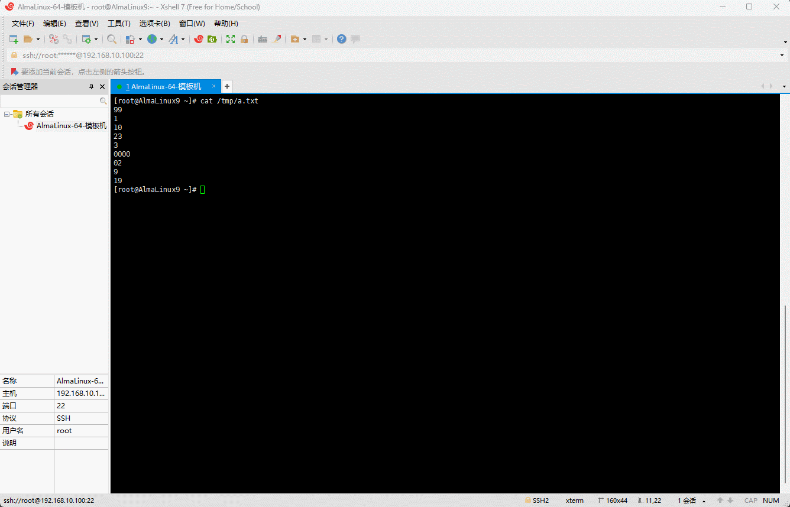

# 第一章：日志查询（⭐）

## 1.1 概述

* Linux 中`查询日志`的时候，推荐使用`占用系统资源少`的命令，如：`head`、`tail`、`less`、`more` 命令。

> [!WARNING]
>
> 不推荐使用 `vi`、`vim` 或 `cat` 查询日志，如果使用这些命令，可能会造成系统卡死、内存不足，尤其在日志文件内容较大的情况下。

## 1.2 head 命令

* 命令：

```shell
head [-n 数字] [文件]
```

> [!NOTE]
>
> * 功能：显示文件的前几行，默认是前 10 行。
> * 选项：
>   * `-n 数字`，`--lines 数字`：指定要显示行的数量，`-n 5` 就表示前 5 行。

> [!IMPORTANT]
>
> * ① 如果没有指定文件，则从标准输入中读取。
> * ② 可以使用 `tr -dc "[:alnum:]" < /dev/urandom | head -c 12` 获取随机密码，了解即可。


* 示例：显示 `/etc/passwd`文件的前 10 行内容

```shell
head /etc/passwd
```


* 示例：显示`/etc/passwd`文件的前 5 行内容

```shell
head -n 5 /etc/passwd
```


## 1.3 tail 命令

* 命令

```shell
tail [-n 数字] [-f] [文件]
```

> [!NOTE]
>
> * 功能：显示文件的最后几行，默认是最后 10 行。
> * 选项：
>   * `-n 数字`，`--lines 数字`：指定要显示行的数量，`-n 5` 就表示最后 5 行。
>   * `-f`，`--follow[={name|descriptor}]`：显示文件末尾的实时更新，`一般用于实时查看日志`，默认是跟踪`文件描述符`。

> [!IMPORTANT]
>
> * ① 如果没有指定文件，则从标准输入中读取。
> * ② `-f` 选项，默认情况下，是跟踪的`文件描述符`；换言之，如果文件被删除了，就跟踪不了；否则，使用 `--follow=name`。
> * ③ `-F` 选项就是跟踪`文件名`，如果文件被删除，系统会提醒文件被删除；换言之，`-F` 选项等价于 `--follow=name`。


* 示例：显示  `/etc/passwd` 的最后 10 行内容

```shell
tail /etc/passwd
```


* 示例：显示  `/etc/passwd` 的最后 5 行内容

```shell
tail -n 5 /etc/passwd
```


* 示例：实时查看文件末尾的更新

```shell
tail -f /var/log/secure
```


## 1.4 less 命令

* 命令：

```shell
less [-N] [文件]
```

> [!NOTE]
>
> * 功能：分屏上下翻页查看文件内容，即一页一页的查看文件内容。
> * 选项：
>   * `-N`：每行显示行号。
> * 快捷键：
>
> | 快捷键      | 备注                                               |
> | ----------- | -------------------------------------------------- |
> | `q`         | `退出`                                             |
> | y           | 上一行                                             |
> | Enter       | 下一行                                             |
> | `空格`      | 下一页                                             |
> | `b`         | `上一页`，back 的缩写                              |
> | g           | 移动到首行                                         |
> | 100g        | 移动到第 100 行                                    |
> | G           | 移动到最后一行                                     |
> | `/搜索内容` | `向下搜索，n (next)继续向下搜索，N 继续向上搜索。` |

> [!IMPORTANT]
>
> 如果没有指定文件，则从标准输入中读取。


* 示例：显示 `/etc/services` 文件的内容

```shell
less -N /etc/services
```


## 1.5 more 命令（了解）

* 命令：

```shell
more [-d][-c] [文件]
```

> [!NOTE]
>
> * 功能：more 命令和 less 命令类似，都是按页显示文件内容的。
> * 选项：
>   * `-d`：`显示"[press space to continue,'q' to quit.]"和"[Press 'h' for instructions]"`。
>   * `-c`：`不进行滚屏操作。每次刷新这个屏幕`。
> * 快捷键：
>
> | 快捷键 | 备注     |
> | ------ | -------- |
> | `q`    | `退出`   |
> | Enter  | 下一行   |
> | `空格` | 下一页   |
> | `b`    | `上一页` |
> | `h`    | 帮助     |

> [!IMPORTANT]
>
> * ① more 是一个基于 vi 编辑器的文本过滤器；所以实际中，针对日志查询，通常使用 less 命令。
> * ② more 命令到达最后一行就会退出。
> * ③ 如果没有指定文件，则从标准输入中读取。


* 示例：

```shell
more -dc /etc/services
```


# 第二章：wc 统计命令（⭐）

## 2.1 概述

* 命令：

```shell
wc [-l] [文件]
```

> [!NOTE]
>
> * 对应的英文单词：word count，单词数。
> * 功能：统计文件的`行数`、`单词数`、`字节数`。
> * 选项：
>   * `-l`，`--line`：统计行数。

> [!IMPORTANT]
>
> * ① 未来主要用于`统计行数`，包括：文件的`行数`或命令过滤结果的`行数`。
> * ② 如果没有指定文件，则从标准输入中读取。

## 2.2 案例

* 示例：统计 `/etc/services` 文件的行数、单词数、字节数

```shell
wc /etc/services
```


* 示例：统计 `/etc/services` 文件的行数

```shell
wc -l /etc/services
```


* 示例：显示系统用户登录的错误信息

```shell
# grep 是一种强大的文件搜索工具，可以将匹配的行打印出来
grep 'Failed password' /var/log/secure
```


* 示例：统计系统用户登录的错误次数

```shell

grep 'Failed password' /var/log/secure | wc -l
```


# 第三章：查询命令位置

## 3.1 概述

* 在实际工作中，我们通常会使用 `which` 命令或 `whereis` 命令来`显示命令所在位置的绝对路径`。

## 3.2 which

* 命令：

```shell
which xxx ...
```

> [!NOTE]
>
> 功能：查询`命令`所在`位置`的`绝对路径`。


* 示例：查询 `cd` 命令的绝对路径

```shell
which cd
```


* 示例：查询 `pwd` 命令的绝对路径

```shell
which pwd
```


* 示例：查询 `mkdir`、`touch`、`ls`、`mv` 命令的绝对路径

```shell
which mkdir touch ls mv
```


* 示例：查询 `ssh` 命令的绝对路径

```shell
which ssh
```


* 示例：查询 `java` 命令的绝对路径

```shell
which java
```


## 3.3 whereis 

* 命令：

```shell
whereis xxx ...
```

> [!NOTE]
>
> 功能：查询`命令`及其`相关帮助文件`的`所在位置`的`绝对路径`。


* 示例：查询 `ssh` 命令及其`相关帮助文件`的绝对路径

```shell
whereis ssh
```


* 示例：查询 `java` 命令及其`相关帮助文件`的绝对路径

```shell
whereis java
```


* 示例：查询 `cd`、`head`、`tail`、`less`、`more` 命令及其`相关帮助文件`的绝对路径

```shell
whereis cd head tail less more
```


# 第四章：文件比较命令

## 4.1 概述

* 在一些程序（服务）的配置中，我们需要`对比新旧配置文件`，`查看修改了哪些内容，发生了什么变化`；此时，我们需要进行文件的比对，就可以使用 `diff` 命令或 `vimdiff` 命令。

## 4.2 准备工作

* 既然需要进行文件的对比，就需要准备两个文件，即：

```shell
echo "1 2 3 4 5" | tr ' ' '\n' > /tmp/a.txt
```

```shell
echo "1 2 3 3 5" | tr ' ' '\n' > /tmp/b.txt
```


## 4.3 diff 命令

* 命令：

```shell
diff 文件1 文件2 ...
```

> [!IMPORTANT]
>
> 其实更推荐使用 `vimdiff` 命令，因为更为直观！！！


* 示例：

```shell
diff /tmp/a.txt /tmp/b.txt
```


## 4.3 vimdiff 命令

* 命令：

```shell
vimdiff 文件1 文件2 ...
```


* 示例：

```shell
vimdiff /tmp/a.txt /tmp/b.txt
```


# 第五章：排序去重组合（⭐）

## 5.1 概述

* `sort` 命令和 `uniq` 命令是未来`在生产环境中`，对`日志`和`系统信息`进行`统计`、`分析`必备的命令。

> [!NOTE]
>
> * ① `sort` 在英文中是`排序`的意思。
> * ② `uniq` 是 `unique` 的缩写，在英文是`独特的`、`唯一的`意思，即`去重（去除重复）`。

## 5.2 sort

### 5.2.1 概述

* 命令：

```shell
sort [-n][-r][-k][-t] [文件] ...
```

> [!NOTE]
>
> * 功能：对文件中所有行进行排序，默认是`升序`（由小到大，即 `↑` ）。
> * 选项：
>   * `-n` , `--numeric-sort`：按照数字进行排序，默认是升序。
>   * `-r`，`--reverse`：降序排序。
>   * `-k`，`--key=KEYDEF`：通过一个 key 排序；KEYDEF 给出`位置`和`类型`，通常是`指定某一列，根据某一列进行排序`。
>   * `-t`，`--field-separator`：指定分隔符，只能指定一个字符，如：`:`、`,`，默认是`空格`。

> [!IMPORTANT]
>
> * ① sort 是将`文件中的每一行`作为`一个单位`相互比较，其比较原则是按照`字母`进行排序，并按照 `ASCII` 码表从`首字符`开始`依次向后比较`，最后进行升序排序。
> * ② 默认情况下，即使文件中都是数字，也会转换为字母继续排序，除非使用 `-n` 选项。
> * ③ 如果没有指定文件，则从标准输入中读取。

### 5.2.2 默认排序（基于字母进行排序）

* 准备数据：

```shell
cat > /tmp/a.txt <<EOF
aaa:10:1.1
ccc:30:3.3
ddd:40:4.4
bbb:20:2.2
eee:50:5.5
eee:50:5.5
EOF
```


* 对文件进行排序（默认按照字母进行排序）：

```shell
sort /tmp/a.txt
```


* 其对应的原理如下（类似于`冒泡排序`）：


* 当然，如果需要`降序`排序，就需要增加参数 `-r` ，即：

```shell
sort -r /tmp/a.txt
```


### 5.2.3 基于数字排序

* 准备数据：

```shell
cat > /tmp/a.txt <<EOF
99
1
10
23
3
0000
02
9
19
EOF
```


* 对该文件进行排序：

```shell
sort /tmp/a.txt
```


* 排完序的结果如下：

```
0000
02
1
10
19
23
3
9
99
```

* 我们可以发现，`02` 竟然比 `1` 要小，我们可以将对应的 ASCII 码输出对比下：

```shell
echo -n 02 | od -An -t x1
```

```shell
echo -n 1 | od -An -t x1
```


* 显而易见，`02` 的 ASCII 码是 `30 32`，而 `1` 的 ASCII 码是 `31`，默认从小到大升序，这样也就解释得了，为什么 `02` 比 `1` 小了，并且通常的 ASCII 码表如下所示：

 

* 顺便再补充一下计算机中的`编码`和`解码`的概念：
  * 编码：计算机只能理解二进制数据，即 0 和 1 。因此，在计算机中存储和处理信息之前，必须先将信息编码成二进制数据。编码有许多不同的方法，最常见的方法是 ASCII 码和 Unicode 码。
  * 解码：计算机处理完信息之后，需要将信息解码成人类可以理解的形式。解码的过程与编码的过程相反，即把二进制数据转换为人类可以理解的信息。
* 其原理如下：


* 此时，为了结果的准确性，就可以使用 `-n` 参数，来告诉 sort 命令，我们要`排序的是数字而不是字母`，即：

```shell
sort -n /tmp/a.txt
```


* 当然，要`降序`排序，还需要添加 `-r` 参数，即：

```shell
sort -nr /tmp/a.txt
```



### 5.2.4 基于列排序

* 严格意义上讲，并不是基于列来排序，我们再来看下 sort 命令的选项 `-key` 定义如下：

```shell
sort [-key=KEYDEF] 文件...
```

* 我们可以通过 `sort --help` 来查看官方文档对其的解释：

```shell
sort --help
```


* 翻译为中文就是：通过一个 `key` 排序；`KEYDEF` 给出`位置`和`类型`；此时，`KEYDEF` 又是什么?


* 官方文档这边也有解释，本人提取了对应的内容，如下所示：

```
KEYDEF is F[.C][OPTS][,F[.C][OPTS]] for start and stop position, where F is a
field number and C a character position in the field; both are origin 1, and
the stop position defaults to the line's end.  If neither -t nor -b is in
effect, characters in a field are counted from the beginning of the preceding
whitespace.  OPTS is one or more single-letter ordering options [bdfgiMhnRrV],
which override global ordering options for that key.  If no key is given, use
the entire line as the key.  Use --debug to diagnose incorrect key usage.
```

* 翻译为中文就是：

```
KEYDEF 是 F[.C][OPTS][,F[.C][OPTS]]，用于起始位置和停止位置。
其中，F 是字段编号，C 是字段中的字符位置；两者都是从 1 开始，停止位置默认为行的结尾。
如果 -t 和 -b 均未生效，则从前一个空格开始计算字段中的字符。
OPTS 是一个或多个单字母排序选项 [bdfgiMhnRrv]，这些选项会覆盖该键的全局排序选项。
如果未给出键，则使用整行作为键。使用 --debug 来诊断不正确的键用法。
```

* 其图示如下：


* 准备数据：

```shell
cat > /tmp/a.txt <<EOF
baidu 100 5000
sohu 100 4500
google 110 5000
guge 50 3000
EOF
```


* 根据指定的 key 排序：

```shell
sort -k 1.2 /tmp/a.txt
```


* 其排序的规则如下：


* 根据指定的 key 排序：

```shell
sort -k 1.2,1.2 /tmp/a.txt
```


* 其排序的规则如下：


* 当然，通常不会针对到具体的列中的某个字符，一旦都是针对某一列进行排序，即：

```shell
sort -k 1 /tmp/a.txt
```


* 其排序的规则如下：


* 当然，也可以对数字那一列进行排序，但是需要加上 `-n` 选项，即：

```shell
sort -nk 2 /tmp/a.txt 
```


* 其排序的规则如下：


### 5.2.5 指定分隔符进行排序

* 默认情况下，sort 是针对`空格`进行排序的；但是，有些文件不是以`空格`作为分隔符的，如：

```shell
head /etc/passwd
```


* 针对这种情况，就需要使用 `-t` 选项来指定`分隔符`，即：

```shell
sort -t ':' -nrk3 /etc/passwd
```


### 5.2.6 多列排序

* 其实，sort 命令也可以对多列进行排序：

```shell
sort -n -k2 -k3 /tmp/a.txt
```


### 5.2.7 加餐题

* 需求： `ll /etc` 取出最大的前 5 个。


* 示例：

```shell
ll /etc | sort -nrk5 | head -n 5
```


### 5.2.8 加餐题

* 需求：以 `.`为分隔符对第 3 列和第 4 列进行排序。

```shell
cat > sort.txt <<EOF
192.168.3.1 00:0F:AF:81:19:1F
192.168.3.2 00:0F:AF:85:6C:25
192.168.3.3 00:0F:AF:85:70:42
192.168.2.20 00:0F:AF:85:55:DE
192.168.2.21 00:0F:AF:85:6C:09
192.168.2.22 00:0F:AF:85:5C:41
192.168.0.151 00:0F:AF:85:6C:F6
192.168.0.152 00:0F:AF:83:1F:65
192.168.0.153 00:0F:AF:85:70:03
192.168.1.10 00:30:15:A2:3B:B6
192.168.1.11 00:30:15:A3:23:B7
192.168.1.12 00:30:15:A2:3A:A1
192.168.1.1 00:0F:AF:81:19:1F
192.168.2.2 00:0F:AF:85:6C:25
192.168.3.3 00:0F:AF:85:70:42
192.168.2.20 00:0F:AF:85:55:DE
192.168.1.21 00:0F:AF:85:6C:09
192.168.2.22 00:0F:AF:85:5C:41
192.168.0.151 00:0F:AF:85:6C:F6
192.168.1.152 00:0F:AF:83:1F:65
192.168.0.153 00:0F:AF:85:70:03
192.168.3.10 00:30:15:A2:3B:B6
192.168.1.11 00:30:15:A3:23:B7
192.168.3.12 00:30:15:A2:3A:A1
EOF
```


* 示例：

```shell
sort -t '.' -rn -k3,3 -k4,4 sort.txt
```


## 5.3 uniq

### 5.3.1 概述

* 命令：

```shell
uniq [-c] [文件]
```

* 功能：`uniq` 是 `unique` 的缩写，在英文是`独特的`、`唯一的`意思，即`去重`。
* 选项：
  * `-c`, `--count`：在每行开头增加`重复次数`。

> [!NOTE]
>
> * ① uniq 只能对`相邻的行`进行`合并（去重）`，这是 uniq 的算法决定的；如果不相邻，还需要通过 sort 命令调整为相邻；即`先 sort 后 uniq` 。
> * ② 如果没有指定文件，则从标准输入中读取。

### 5.3.2 案例

* 准备数据：

```shell
cat > ip.txt <<EOF
192.168.10.204
192.168.10.17
192.168.10.238
192.168.10.161
192.168.10.94
192.168.10.192
192.168.10.94
192.168.10.113
192.168.10.161
192.168.10.158
192.168.10.94
192.168.10.158
192.168.10.210
192.168.10.161
EOF
```


* 数据排序并去重：

```shell
sort ip.txt | uniq -c | sort -rn 
```


## 5.4 企业案例实战

### 5.4.1 准备工作

* 生成重复的 IP 数据：

```shell
for i in {1..500000}; do echo "192.168.10.$((RANDOM%256))"; done > ip.txt
```


### 5.4.2 案例

* 需求：统计 `ip.txt` 文件中，每个 IP 出现的次数，并取前 5 个。


* 示例：

```shell
sort ip.txt | uniq -c | sort -rn | head -n 5
```


## 5.5 技巧（Linux 中文件的上传和下载）

* 安装 lrzsz ：

```shell
dnf -y install lrzsz 
```


* 上传（win上传到 Linux 中）：

```shell
# 全称是 Receive via ZMODEM，即在 Linux 中通过 ZMODEM 协议获取文件
rz
```


* 下载（Linux 下载到 win 中）：

```shell
# 全称是 Send via ZMODEM ，即在 Linux 中通过 ZMODEM 协议发送文件
sz xxx
```


# 第六章：日期组合（⭐）

## 6.1 概述

* 在 Linux 中，我们经常需要`查看系统的时间`，目的是`保证网站所有机器（服务器）`的`系统时间`是`一致`的。

> [!IMPORTANT]
>
> 在实际工作中，一个网站不太可能由一台机器（服务器）来提供服务，一般都会组成`集群（多台机器）`来提供服务。

## 6.2 date

### 6.2.1 概述

* 命令：

```shell
date [-d][-s] [+格式]
```

> [!NOTE]
>
> * 功能：用于`查看`或`设置`系统的时间。
> * 选项：
>   * `-d`，`--date=字符串`：解析`字符串`并按照指定格式`显示`日期或时间，不能是 `now`。
>   * `-s，--set=字符串`：根据`指定的字符串`设置日期或时间。
>
> * 格式：
>
> | 格式 | 备注                                                    |
> | ---- | ------------------------------------------------------- |
> | `%Y` | `Year` 的缩写，表示：年份 。                            |
> | `%m` | `Month` 的缩写，表示：月份 （01..12）。                 |
> | `%d` | `Day` 的缩写，表示：日（01、02、...）。                 |
> | `%F` | `Full` 的缩写，完整日期格式，等价于 `%+4Y-%m-%d` 。     |
> | `%H` | `Hour` 的缩写，表示：小时 (00-23)。                     |
> | `%M` | `Minutes` 的缩写，表示：分钟（00..59）。                |
> | `%S` | `Second` 的缩写，表示：秒(00-60)。                      |
> | `%T` | `Time` 的缩写，时间，等于 `%H:%M:%S`。                  |
> | `%w` | `weekday` 的缩写，一星期中的第几日（0-6），0 代表周一。 |

> [!IMPORTANT]
>
> 实际工作中，通常用来`查看`系统的时间；很少去主动修改系统时间。

### 6.2.2 案例（根据指定格式显示日期或时间）

* 示例：显示当前系统的时间

```shell
date
```


* 示例：显示当前的日期

```shell
date +%F
```


* 示例：显示`年-月-日`

```shell
date +%Y-%m-%d
```


* 示例：显示当前的时间

```shell
date +%T
```


* 示例：显示`时:分:秒`

```shell
date +%H:%M:%S
```


### 6.2.3 案例（根据指定字符串显示指定日期或时间）

* 示例：显示昨天的日期

```shell
date -d '-1 day'
```


* 示例：显示后天的日期

```shell
date -d '+1 day'
```


* 示例：显示上个月的日期

```shell
date -d '-1 month'
```


* 示例：显示下个月的日期

```shell
date -d '+1 month'
```


* 示例：显示上一年的日期

```shell
date -d '-1 year'
```


* 示例：显示下一年的日期

```shell
date -d '+1 year'
```


### 6.2.4 案例（手动设置日期或时间）

* 示例：手动设置系统的日期

```shell
date -s "2011-11-11"
```


* 示例：手动设置系统的日期和时间

```shell
date -s '2011-11-11 11:11:11'
```


## 6.3 chrony

* 安装 ntpdate 命令：

```shell
dnf -y install ntpdate 
```


> [!NOTE]
>
> * ① `ntp` 是 `Network Time Protocol` 的缩写，中文译为`网络时间协议`；`ntp` 是一种用于在计算机网络上同步时钟的协议。
> * ② 它使用一种称为 `Stratum` 的分层系统来确保所有计算机的时钟都与一个权威时间源（称为 `Stratum 1` 服务器）保持同步。
> * ③ `ntpdate` 命令用于与 NTP 服务器同步计算机的时间。它通过向 NTP 服务器发送请求来获取当前时间，然后将计算机的时间调整为与 NTP 服务器的时间一致。

* 之所以安装失败的原因在于：ntpdate 已经被废弃了，建议使用 `chrony` ，即：

```shell
dnf -y install chrony
```


* 手动设置时间：

```shell
date -d '-1 year'
```


* 修改配置文件，以便设置同步时间服务器：

```shell
vim /etc/chrony.conf
```

```txt {3-4}
# Use public servers from the pool.ntp.org project.
# Please consider joining the pool (https://www.pool.ntp.org/join.html).
# pool 2.almalinux.pool.ntp.org iburst 注释掉
server ntp1.aliyun.com iburst # 增加

# Use NTP servers from DHCP.
sourcedir /run/chrony-dhcp

# Record the rate at which the system clock gains/losses time.
driftfile /var/lib/chrony/drift

# Allow the system clock to be stepped in the first three updates
# if its offset is larger than 1 second.
makestep 1.0 3

# Enable kernel synchronization of the real-time clock (RTC).
rtcsync

# Enable hardware timestamping on all interfaces that support it.
#hwtimestamp *

# Increase the minimum number of selectable sources required to adjust
# the system clock.
#minsources 2

# Allow NTP client access from local network.
#allow 192.168.0.0/16

# Serve time even if not synchronized to a time source.
#local stratum 10

# Require authentication (nts or key option) for all NTP sources.
#authselectmode require

# Specify file containing keys for NTP authentication.
keyfile /etc/chrony.keys

# Save NTS keys and cookies.
ntsdumpdir /var/lib/chrony

# Insert/delete leap seconds by slewing instead of stepping.
#leapsecmode slew

# Get TAI-UTC offset and leap seconds from the system tz database.
leapsectz right/UTC

# Specify directory for log files.
logdir /var/log/chrony

# Select which information is logged.
#log measurements statistics tracking
```


* 此时，就可以将 `chrony` 启动（服务名是 `chronyd`），即：

```shell
systemctl enable --now chronyd
```


* 查询 `chrony` 服务状态：

```shell
systemctl status chronyd
```


* 验证 NTP 服务器源：

```shell
chronyc sources -v
```


* 查看当前系统时间：

```shell
date
```


## 6.4 修改时区

* 有的时候，会发现即使使用了 `chrony` ，还是会发现时间不对，有可能就是`时区`问题，可以使用如下命令来帮助解决问题，即：

* ① 查看时区：

```shell
timedatectl status
```


* ② 修改时区：

```shell
timedatectl set-timezone Asia/Shanghai
```


> [!NOTE]
>
> * ① `timedatectl set-timezone Asia/Shanghai` 命令会修改 `/etc/localtime` 文件，并将其设置为指向亚洲/上海时区。
> * ② `/etc/localtime` 文件是一个符号链接，指向系统当前使用的时区文件。该文件通常位于 `/usr/share/zoneinfo` 目录中。
> * ③ 当我们使用 `timedatectl set-timezone Asia/Shanghai` 命令时，系统会执行以下操作：
>   * 检查 `/usr/share/zoneinfo/Asia/Shanghai` 文件是否存在。
>   * 如果该文件存在，则将 `/etc/localtime` 符号链接指向该文件。
>   * 如果该文件不存在，则会显示错误消息。
> * ④ 我们可以手动修改 `/etc/localtime` 文件，但这样做可能会导致系统出现问题。因此，建议使用 `timedatectl set-timezone` 命令来修改系统时区。

## 6.5 补充

* 特殊符号：

```
``
```

> [!NOTE]
>
> * 作用：`反引号`中的的`命令`将会`优先执行`。
> * 反引号，其实相当于 `$(命令)` ，作用类似。


* 示例：输出 `find` 命令的详细信息

```shell
which find
```

```shell
ls -lah /usr/bin/find
```


* 示例：输出 `find` 命令的详细信息

```shell
ls -lah `which find`
```


## 6.6 加餐题

* 需求：企业备份的时候，给压缩包加上时间。

> [!NOTE]
>
> 分析：需要使用 `date` 命令。


* 示例：

```shell
# 创建多个文件
touch {1..10}.txt
```

```shell
# 给压缩包加上时间
tar -czvf backup-`date +%F`.tar.gz {1..10}.txt
```


# 第七章：文件内容查看补充

## 7.1 查看文本文件内容

### 7.1.1 cat（⭐）

* 格式：

```shell
cat [-E][-A][-n][-b][-s] 文件1 文件2 ...
```

> [!NOTE]
>
> * 功能：查看文本内容。
> * 选项：
>   * `-E`，`--show-ends`：显示行结束符 `$` 。
>   * `-A`，`--show-all`：显示所有的控制符，如：Tab 、换行符等。
>   * `-n`，`--number`：对显示出的每一行进行编号，`常用`。
>   * `-b`，`--number-nonblank`：对显示的非空行进行编号。
>   * `-s`，`--squeeze-blank`：压缩空行。


* 准备工作：

```shell
cat > test.txt <<EOF
aaa aaa		aaaaa   
bbb
ccc

ddd


eee


fff


ggg


hhh
EOF
```


* 示例：显示行结束符 `$`

```shell
cat -E test.txt
```


* 示例：显示所有的控制符，如：Tab 、换行符等

```shell
cat -A test.txt
```


* 示例：对显示出的每一行进行编号

```shell
cat -n test.txt
```


* 示例：对显示的非空行进行编号

```shell
cat -b test.txt
```


* 示例：压缩空行

```shell
cat -s test.txt
```


### 7.1.2 nl

* 格式：

```shell
nl 文件1 文件2 ...
```

> [!NOTE]
>
> 功能：对显示的非空行进行编号，相当于 `cat -b xxx` 。


* 示例：对显示的非空行进行编号

```shell
nl test.txt
```


### 7.1.3 tac

* 格式：

```shell
tac 文件1 文件2 ...
```

> [!NOTE]
>
> * 功能：按行为单位反向显示文件内容。
>
> * 其对应的原理，如下所示：
>
> 


* 示例：

```shell
tac test.txt
```


* 示例：

```shell
seq 1 2 20 | tac
```


### 7.1.4 rev

* 格式：

```shell
rev 文件1 文件2 ...
```

> [!NOTE]
>
> * 功能：将文件内容中的同一行内容以字符为单位逆序输出。
> * 其对应的原理，如下所示：
>
> 


* 示例：

```shell
rev test.txt
```


* 示例：

```shell
seq 1 2 20 | tr '\n' ' ' | rev
```


* 示例：

```shell
echo {1..10} | rev
```


## 7.2 查看非文本文件内容

### 7.2.1 hexdump（⭐）

* 格式：

```shell
hexdump [-C][-n] 文件1 文件2 ...
```

> [!NOTE]
>
> * 功能：一般用来查看`“二进制”`文件的十六进制编码，但实际上它能查看任何文件，而不只限于二进制文件。
> * 选项：
>   * `-C`，`--canonical`：输出规范的十六进制和 ASCII 码，`常用`。
>   * `-n <length>`， `--length <length>`：只格式化输入文件的前 `length` 个字节。

> [!IMPORTANT]
>
> * ① 在计算机中，16 进制是 4 位二进制的一种表示，即 `2^4 = 16`。
> * ② 但是，一个 B（字节，计算机存储的基本单位）是 8 bit（位），所以需要 2 个 16 进制数来表示。
> * ③ `hexdump -C` 就是通过 2 个 16 进制数来表示一个字节的。


* 示例：

```shell
echo "Hello World!" | hexdump -C
```


* 示例：

```shell
hexdump -C -n 512 /dev/sda
```


* 示例：

```shell
echo {a..z} | tr -d " " | hexdump -C
```


### 7.2.2 xxd

* 格式：

```shell
xxd [-r] 文件
```

> [!NOTE]
>
> 功能：用于生成二进制文件的十六进制表示的工具，它可以创建十六进制转储，还可以将十六进制表示重新转换回二进制格式。


* 示例： 查看十六进制，类似于 `hexdump -C`

```shell
echo {a..z} | tr -d " " | xxd 
```


* 示例：将十六进制转换为二进制

```shell
echo {a..z} | tr -d " " | xxd | xxd -r
```


