# 第一章：扫清概念（⭐）

## 1.1 硬盘（磁盘）类型

### 1.1.1 概述

* 之前，我们在 `VMWare 虚拟机软件`中创建`虚拟机`的时候，会发现`磁盘类型`的选项：


> [!NOTE]
>
> 从图中，我们知道，`磁盘`的`类型`有：`IDE`、`SCSI`、`SATA` 、`NVME` 。

### 1.1.2 IDE 接口

* `IDE` （Integrated Drive Electronics，电子集成驱动器）早已被淘汰，毕竟是 `1986` 年由`康铂`、`西部数据`等几家公司共同开发的，如下所示：


* `IDE` 接口，又叫 `ATA` 接口、`PATA` 接口、`并口`，`IDE` 接口本身可以支持`串行`或`并行`。`IDE` 接口的硬盘最高所能达到 `133 MB/s`。
* 虽然 `IDE` 接口的硬盘价格低廉、兼容性强、性价比高。但是，有这样的缺点：数据传输速度慢、线缆长度过短、连接设备少、不支持热插拔、接口速度以及可升级性差。

> [!NOTE]
>
> 目前市面上已经几乎没有这种 IDE 接口的硬盘了。

### 1.1.3 SCSI 接口

*  SCSI（Small Computer System Interface，小型计算机系统接口），是一种应用于`小型机`上的高速数据传输技术，最早于1986年提出的 `SCSI Ⅰ`最大传输速率为 `5MB/s`，支持 7 个设备。

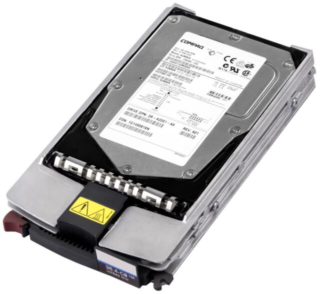

* `1995` 年左右出现了第三代 `SCSI`，差不多达到了 `40MB/s`，但没有统一标准：
  * 最大同步传输速度达到 `20MB/s` 的 Ultra SCSI（又称为 Fast-20 SCSI，时钟频率为 20 MHz）
  * 最大同步传输速度达到 `40MB/s` 的 Ultra Wide SCSI
  * 最大同步传输速度达到 `40MB/s` 的 Ultra2 SCSI（又称为 Fast-40 SCSI，时钟频率为 40 MHz，1997 年）
  * ...
  * 最大同步传输速度达到 `640MB/s` 的 Ultra 640 SCSI（时钟频率为 160 MHz 加双倍数据速率，2003 年）

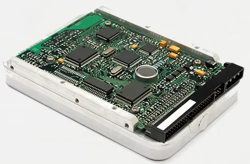

* SCSI 接口具有应用范围广、多任务、带宽大、CPU占用率低，以及热插拔等优点；

> [!NOTE]
>
> 由于成本问题，SCSI 接口的硬盘主要用于`服务器`和`工作站`上。

### 1.1.3 SATA 接口

* `SATA`（Serial ATA，串行 ATA，Serial Advanced Technology Attachment），大概是在 `2003` 年出现的，速度比 IDE 接口更快，SATA 不依赖系统总线的带宽，而是内置时钟频率，支持热插拔。

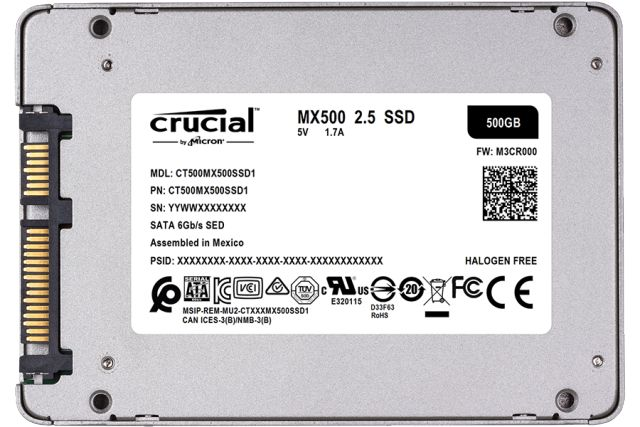

* `SATA 3.0` 最大的改进之处，就是将总线最大传输带宽提升到 `6Gb/s`，实际传输速度大约 `600MB/S`。

### 1.1.4 M.2 接口

* `M.2` 接口内部又可以简单划分为走传统的 `SATA AHCI` 协议的接口和走 `PCIe` 通道 `NVMe` 协议的接口。


> [!NOTE]
>
> * ① **NVMe**（基于非易失性存储器的传输规范）是一种较新的协议，可以直接连接到主板的 PCIe 通道，从而提供更高的吞吐量和更低的延迟。PCIe 3.0 和 4.0 驱动器可以每秒数千兆的速度传输数据，这比 SATA III 更快，而 PCIe 4.0 驱动器的带宽大约是 3.0 的两倍。
> * ② M.2 驱动器被打造成又小又薄的矩形，经常被比作口香糖。它们直接插入主板上的 M.2 插槽。它们通常使用 NVMe 传输协议，不过某些较旧的设备可能使用 SATA。
> * ③ 购买 M.2 接口的 SSD 的时候，要注意它的是 SATA 通道，还是 NVMe 通道；如果是 SATA  通道，可能最高也就是 `600MB/S` ，在主板支持的情况下，尽量购买 M.2 接口走 NVMe 通道的。

### 1.1.5 总结

* 其实，现在市面上主流的`硬盘接口类型`就是：`STAT` 接口和 `M.2` 接口。

## 1.2 机械硬盘 VS 固态硬盘

### 1.2.1 概述

* 机械硬盘（HDD）和固态硬盘（SSD）最主要的区别就是`内部结构不一样`，和`硬盘接口类型没有关系`，比如：`STAT 接口类型`的硬盘有`机械硬盘`，也有`固态硬盘`；当然，`M.2 接口类型`的硬盘一般都是`固态硬盘`。

> [!NOTE]
>
> * ① `硬盘接口类型`就是`一种标准`、`一种协议`，只是规范了硬盘和计算机主板之间的数据传输接口，如：STAT 硬盘接口类型。
> * ② `机械硬盘`和`固态硬盘`都只是`硬盘接口类型的实现`而已，如：STAT 硬盘接口类型的机械硬盘和 STAT 硬盘接口类型的固态硬盘。
> * ③ 对于`固态硬盘`来说，其实也有划分，如：M.2 STAT 的固态硬盘（走的是 STAT 协议）和 M.2 NVMe （走的是 NVMe 协议）的固态硬盘。

* `STAT 接口类型的机械硬盘`，如下所示：

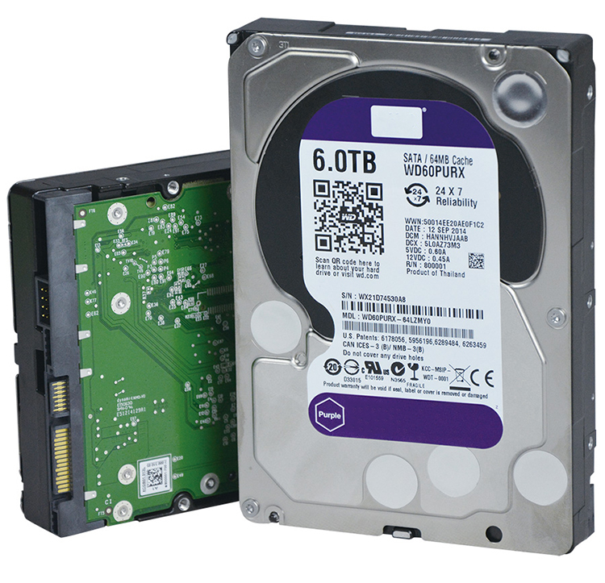

* `STAT 接口类型的固态硬盘`，如下所示：

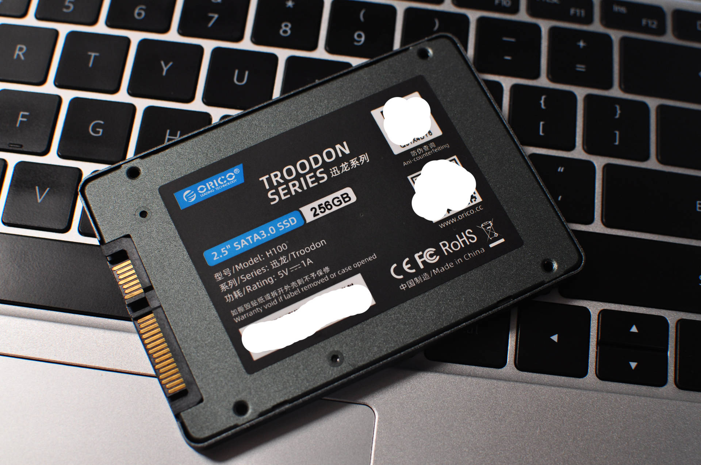

* `M.2 接口类型的固态硬盘`，如下所示：


### 1.2.2 机械硬盘

* 定义：机械硬盘（HDD）是一种带有机械马达结构的存储装置，主要带有马达、盘片、磁头、缓存。
* 内部构造：


* 防震抗摔性：机械硬盘都是磁碟型的，数据储存在磁碟扇区里。防震抗摔性相较固态硬盘较差。
* 数据存储速度： 机械硬盘的最大传输速度约为 600 MB/S。
* 功耗：功耗相对固态硬盘较高。
* 重量：重量相对固态硬盘较高。
* 噪音： 机械硬盘工作时需要高速转动磁盘，马达的高速转动不可避免地带来噪音和发热。
* 价格：大容量的机械硬盘价格经济实惠。
* 数据保存：在机械硬盘发生损坏时，通过数据恢复可能挽救一部分数据。
* 寿命：机械硬盘没有读写次数的限制，机械结构一般寿命都在 15 年以上。

### 1.2.3 固态硬盘

* 定义：固态硬盘（SSD）是一种不带有机械马达结构的存储装置，主要带有闪存、主控芯片、缓存。
* 内部构造：


* 防震抗摔性：固态硬盘是使用闪存颗粒（即：内存、MP3、U盘 等存储介质）制作而成，所以 SSD 固态硬盘内部不存在任何机械部件，这样即使在高速移动甚至伴随翻转倾斜的情况下也不会影响到正常使用，而且在发生碰撞和震荡时能够将数据丢失的可能性降到最小。
*  数据存储速度：SATA 协议的固态硬盘速度约为 500 MB/S；NVMe 协议 (PCIe 3.0×2) 的固态硬盘速度约为 1800 MB/S；NVMe 协议(PCIe 3.0×4) 的固态硬盘速度约为 3500 MB/S。
* 功耗：功耗相对机械硬盘较低。
* 重量：固态硬盘在重量方面更轻，与常规 1.8 英寸硬盘相比，重量轻 20-30 克。
* 噪音：固态硬盘属于无机械部件及闪存芯片，所以具有了发热量小、散热快等特点，而且没有机械马达和风扇，噪音值为 0 分贝。
* 价格：价格较高（`都 2024 年了，固态硬盘的价格早就降了，如果主板支持，无脑选择固态硬盘`）。
* 数据保存：固态硬盘一旦闪存、主控芯片发生损坏，几乎不可能找回数据。
* 寿命：固态硬盘闪存具有擦写次数限制的问题，是其寿命短的原因所在。固态硬盘的寿命，要比理论值少，正常寿命 10 年左右。

## 1.3 Linux 对硬盘的支持

* 在 Linux 系统中，对于`各种硬盘接口类型`的`硬盘`在接入到操作系统后都是以`文件`的形式存在的，并且`不同类别的硬盘`将被`识别`为`不同的文件类型`，如：

| 硬盘类型（硬盘接口类型）                  | 物理识别文件名称                                             |
| ----------------------------------------- | ------------------------------------------------------------ |
| ~~IDE（老式并口硬盘，如今已经被淘汰了）~~ | ~~/dev/hd0、/dev/hd1（h 是 hard 的缩写，d 是 Disk 的缩写，0 表示第一块硬盘）~~ |
| SCSI、STAT、SAS、USB（串口硬盘）          | /dev/sda、/dev/sdb（s = STAT\|SCSI\|SAS 的缩写，d 是 Disk 的缩写，a 表示第一块硬盘） |
| M.2 接口（M.2 接口的 NVMe 硬盘）          | /dev/nvme0、/dev/nvme1（nvme 是 NVMe 协议，0 表示第一块硬盘） |
| ~~光驱或光盘~~                            | ~~/dev/sr0、/dev/sr1（sr 是 SCSI CD-ROM，即可移动的 SCSI 设备，通常指的是光盘，0 表示第一个光盘）~~ |

* 其实，对于目前的计算机（台式机、笔记本、服务器）而言，~~光驱或光盘~~已经被淘汰了；但是，因为我们在安装虚拟机的时候，选择了[设置 CD/DVD](https://aexiar.github.io/linux/notes/01_linux_basic/01_xdx/#_2-4-4-%E8%AE%BE%E7%BD%AE-cd-dvd)，以便引导 Linux 操作系统的安装，如下：


* 这样，在 Linux 中，查看系统中的所有块设备（包括：硬盘、分区、光驱、U 盘等），不至于疑惑😖，如下所示：

```shell
lsblk -f
```

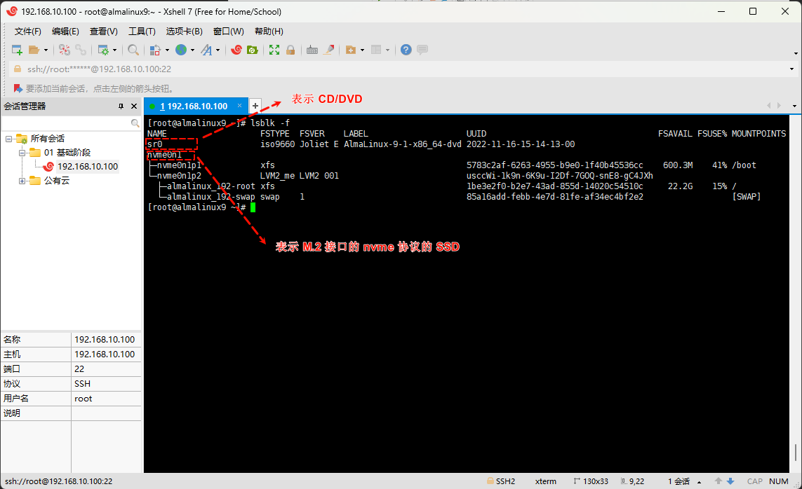

## 1.4 分区和格式化

### 1.4.1 分区

* 在一块`硬盘`在`被系统使用前`，都需要进行`分区`，所谓的`分区`就是`将硬盘划分为一个个逻辑的区域`，`每一个分区都有确定的起始和结束位置`。

* `磁盘分区`是为了更有效地`管理`和`使用`磁盘空间，以及满足不同的`操作系统`和`数据`的`组织需求`。以下是分区的几个主要原因：
  * **组织数据**：分区可以帮助用户将不同类型的数据存储在不同的区域，例如：一个分区用于操作系统，另一个用于个人文件，再另一个用于备份，这样可以提高数据管理的效率。
  * **多操作系统**：如果用户需要在同一台计算机上运行多个操作系统（如：Windows、Linux 或 MacOS），分区可以为每个操作系统提供一个独立的安装空间，避免系统间的冲突。
  * **性能优化**：某些文件系统在特定的分区大小和对齐方式下表现更好。通过分区，可以优化这些文件系统的性能。
  * **安全性**：分区可以作为数据保护的一种手段。例如：可以将敏感数据放在一个单独的分区，并对该分区进行加密或限制访问，以提高数据安全性。
  * **故障隔离**：当一个分区出现问题时，通常不会影响到其他分区。这意味着即使某个分区损坏，其他分区的数据仍然可以安全地访问。
  * **灵活的磁盘空间分配**：随着时间的推移，用户对磁盘空间的需求可能会变化。通过分区，可以更灵活地调整各个分区的大小，以适应不同的存储需求。
  * **备份和恢复**：分区使得备份和恢复数据更加方便。可以针对特定分区进行备份，而不是整个磁盘，这样可以节省备份时间并减少所需的存储空间。
  * **兼容性**：不同的操作系统可能需要不同的分区格式。例如：Windows 通常使用 MBR 或 GPT 分区，而 Linux 则更倾向于使用 GPT 。分区可以确保操作系统能够正确识别和使用磁盘空间。

> [!NOTE]
>
> 在虚拟机中安装 Linux 操作系统的时候，我们选择的是[自动分区](https://aexiar.github.io/linux/notes/01_linux_basic/01_xdx/#_2-5-%E5%AE%89%E8%A3%85-linux)。

* 如果自己手动安装过 Win 操作系统的，也会接触到`分区`的概念，以 [diskgenius](https://www.diskgenius.cn/) 为例，来查看`分区`的`类型`，如下所示：

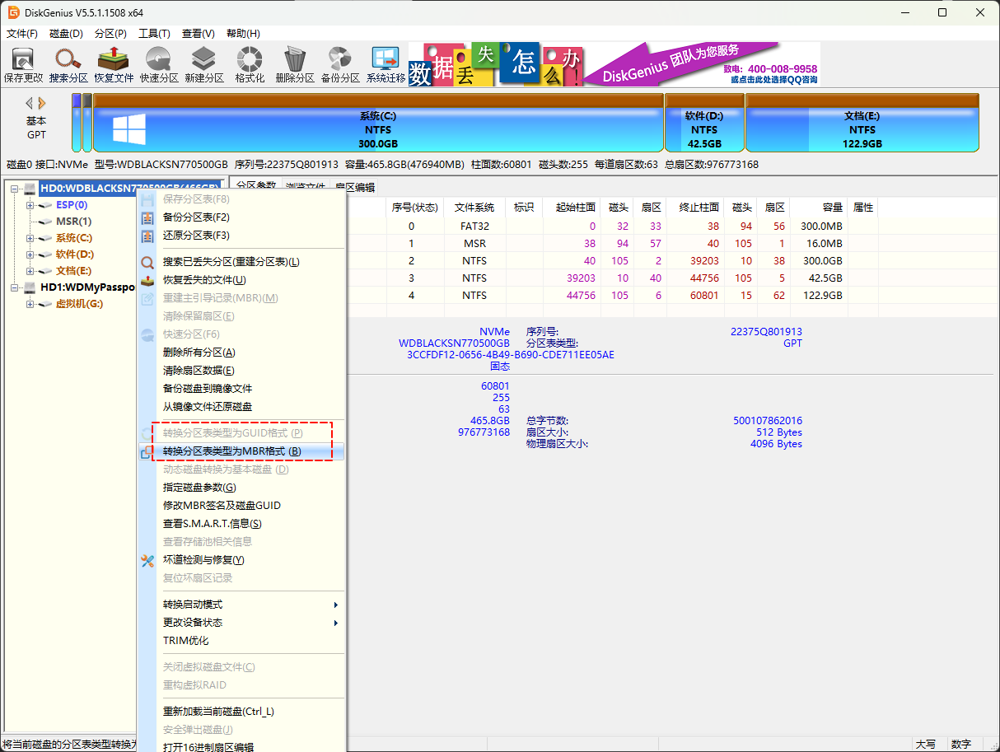

* 从上图中，我们知道分区有两种：MBR 和 GUID 格式；当然，在 Linux 系统中也支持`分区格式`，如下：

| 分区格式                       | 支持的位数    | 支持分区个数                             | 最大硬盘容器                  | 引导方式       |
| ------------------------------ | ------------- | ---------------------------------------- | ----------------------------- | -------------- |
| legacy（MBR，主引导记录分区表) | 32 位和 64 位 | 4  个主分区 或 3 个主分区和 1 个扩展分区 | 2 TB                          | 传统 BIOS 引导 |
| UEFI（GPT，GUID 分区表）       | 32 位和 64 位 | 理论上无限（win 限制为 128 个）          | 18 EiB（1 EiB = 1048576 TiB） | UEFI 引导      |

* MBR 支持 4 个主分区 或 3 个主分区和 1 个扩展分区。
  * MBR 分区包含`主分区`和`扩展分区`，其中`扩展分区`里面可以`包含`若干个`逻辑分区`。
  * MBR 分区中`扩展分区`不可以直接使用，`需要划分为多个逻辑分区`才可以使用。
  * MBR 分区中的`主分区`只有一个是`活动分区`（激活分区），通常用来`安装操作系统`。

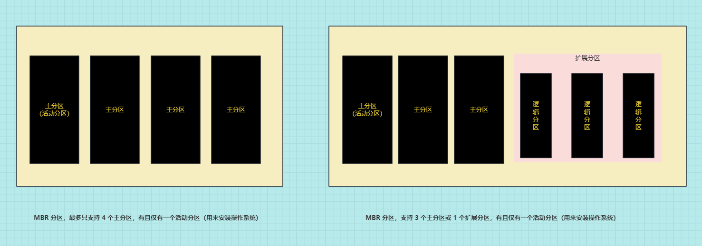

* MBR 分区中的`主分区`和`扩展分区`都是使用 `1-4` 来表示，`扩展分区`是系统`自动分配`的，都是从 `5` 开始；在 Linux 中，如果硬盘类型是 SATA 类型，并且只有一块硬盘，对应的表示就是 `/dev/sda`，那么 MBR 的主分区或扩展分区的表示如下：

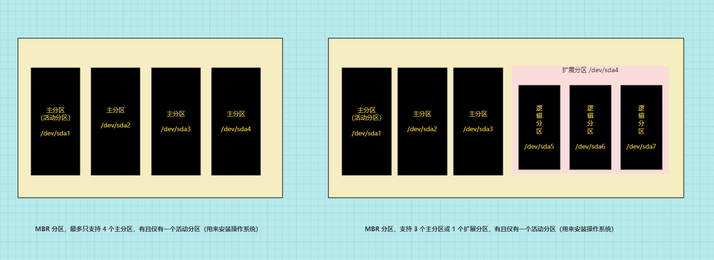

* 所以，对于 MBR 分区而言，如果要创建 6 个分区，它们可以是：
  * 3 个主分区和 1 个扩展分区（其中扩展分区包含 3 个逻辑分区）。
  * 2 个主分区和 1 个扩展分区（其中扩展分区包含 4 个逻辑分区）。
  * 1 个主分区和 1 个扩展分区（其中扩展分区包含 5 个逻辑分区）

* MBR（Master Boot Record，主引导记录）是一种磁盘分区表格式，它位于硬盘或其他可启动存储设备的最开始部分。
  * MBR 的具体位置是在硬盘的 `0` 磁道 `0` 柱面 `1` 扇区，这个扇区总共有 `512` 字节。
  * 在这 `512` 字节中，MBR 占用了前 `446` 字节，用于存储引导程序代码。
  * 接下来的 `64` 字节是磁盘分区表（Disk Partition Table，DPT），它定义了硬盘上的分区布局，包括每个分区的起始和结束位置。
  * 最后两个字节（55AA）是分区表的结束标志。
  * MBR 的主要作用是在计算机启动时，由 BIOS（基本输入输出系统）读取并执行其中的引导程序，以加载操作系统。
* MBR（主引导记录）中的`引导程序`的`工作流程`如下：
  * **硬件自检**：计算机开机后，BIOS 执行自检（POST，Power-On Self-Test），检查硬件设备。
  * **寻找 MBR**：BIOS 在指定的启动设备（通常是硬盘）上寻找 MBR。这通常发生在硬盘的 0 磁道、0 柱面、1 扇区。
  * **执行引导程序**：BIOS 读取 MBR 中的引导程序代码，并执行它。这段代码会检查分区表，寻找标记为活动的分区。
  * **加载引导加载程序**：引导程序会根据活动分区的信息，定位到该分区的引导扇区（通常是分区的起始位置），并从那里加载更复杂的引导加载程序。这个引导加载程序可能是 Windows 的 NTLDR、BOOTMGR，Linux 的 GRUB 或其他操作系统的相应程序。
  * **启动操作系统**：引导加载程序接管控制权，继续加载操作系统内核和必要的驱动程序，最终启动操作系统。

> [!NOTE]
>
> * ① MBR 中的引导程序代码不直接包含操作系统，而是负责启动过程的最初阶段，确保计算机能够找到并加载操作系统的引导加载程序。这个过程中，MBR 扮演了至关重要的角色，因为它是计算机启动序列的起点。
> * ② MBR 分区格式的限制之一是它只能支持最大 `2TB` 的硬盘容量，并且在分区数量上也有限制。
> * ③ 随着技术的发展，GPT（GUID Partition Table，GUID 分区表）作为 MBR 的替代者，提供了更多的分区数量、更大的磁盘支持以及更好的数据完整性检查等优点；换言之， GPT 分区不限制分区数量，即 GPT 分区没有主分区、扩展分区和逻辑分区之分。
> * ④ 目前，在安装操作系统的时候，大部分情况下都是选择 GPT 分区；目前的 Win11 操作系统，已经强制使用 GPT 分区了，即强制使用 UEFI 来引导操作系统。

### 1.4.2 格式化

* `分区`是将`磁盘`划分成`若干个`的`逻辑部分`，以便可以分别使用这些部分，即：


* 而`格式化`是将`磁盘`或`分区的存储空间`组织成`文件系统`以便存储数据，即：

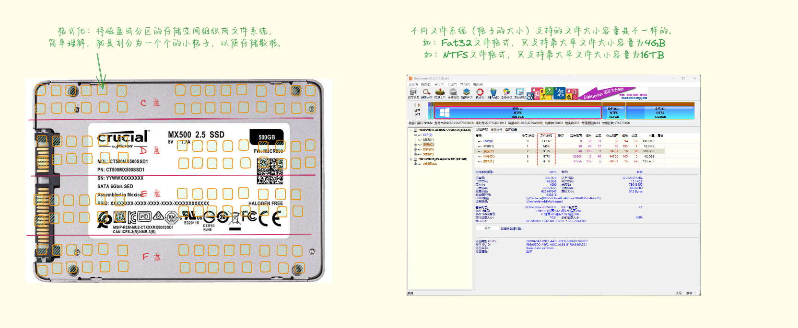

> [!NOTE]
>
> * ① 很多人对格式化有误区，认为格式化就是清空数据。
> * ② 其实，格式化只是写入文件系统而已，清空数据不是首要目的，是附带效果！！！


# 第二章：文件相关命令细节补充（⭐）

## 2.1 echo 命令

* 命令：

```shell
echo [-n][-e][-E] 字符串|变量
```

> [!NOTE]
>
> * 功能：输出字符串或变量到屏幕，如果是字符串就会以空白字符隔开，并在最后加上换行符（转义字符，`\n`）。
> * 选项：
>   * -n：不自动换行。
>   * -E：不支持 `\x` 等转义字符（默认）。
>   * -e：支持 `\x` 等转义字符。
>
> * 如果启用选择 `-e` ，如果字符串中出现如下的转义字符，将会特殊处理，而不会将其当做一般文字进行输出，如下所示：
>
> | 转义字符 | 说明                                | 是否常用 |
> | -------- | ----------------------------------- | -------- |
> | `\a`     | 发出警告声                          |          |
> | `\b`     | 退格键                              |          |
> | `\c`     | 最后不加上换行符号                  |          |
> | `\e`     | escape，相当于\033                  |          |
> | `\n`     | 换行且光标移至行首                  | √        |
> | `\r`     | 回车，即光标移至行首，但不换行      | √        |
> | `\t`     | 插入tab                             | √        |
> | `\\`     | 插入 \ 字符                         |          |
> | `\0nnn`  | 插入nnn（八进制）所代表的ASCII字符  |          |
> | `\xHH`   | 插入HH（十六进制）所代表的ASCII数字 |          |
>
> * 显示变量：
>
> ```shell
> echo "$VAR_NAME" # 用变量值替换，强引用
> ```
>
> ```shell
> echo '$VAR_NAME' # 变量不会替换，弱引用
> ```


* 示例：

```shell
echo "abc"
```

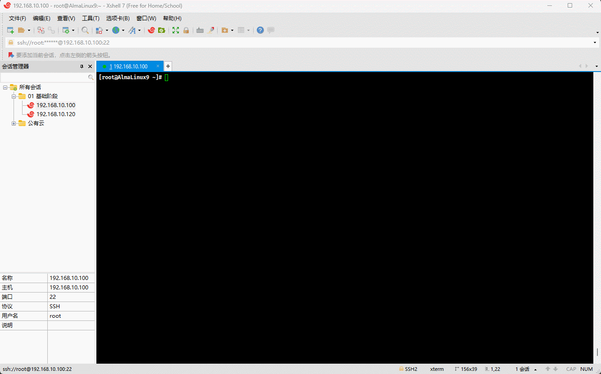


* 示例：

```shell
echo -e "a\nb\nc"
```


* 示例：单引号，变量和命令都不识别，都当成普通的字符串

```shell
echo 'ifconfig' # ifconfig 是命令
```


* 示例：单引号，变量和命令都不识别，都当成普通的字符串

```shell
echo '$PATH' # PATH 是环境变量，可以使用 $PATH 或 ${PATH} 输出
```


* 示例：双引号，不识别命令，但可以识别变量

```shell
echo "ifconfig" # ifconfig 是命令
```

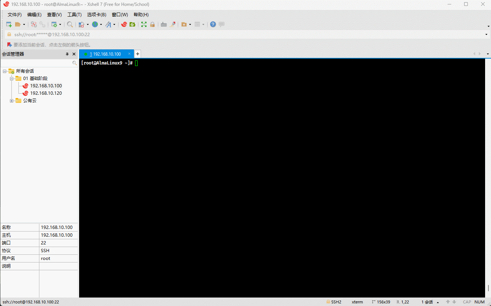


* 示例：

```shell
echo "$PATH" # PATH 是环境变量，可以使用 $PATH 或 ${PATH} 输出
```


## 2.2 命令行扩展

* 命令行扩展符号：

```shell
`command` 或 $(command)
```

> [!NOTE]
>
> * 功能：将一个命令的输出作为另一个命令的参数，即 `$(command)`命令行扩展符号会优先执行。
>
> 
>
> * 单引号、双引号和反引号的区别：
>
> | 类型                | 特点                                                         |
> | ------------------- | ------------------------------------------------------------ |
> | 单引号（''）        | 变量和命令都不识别，都当成了普通的字符串。                   |
> | 双引号（"" ）       | 可以识别变量，但是不能识别命令。                             |
> | 反引号（`` 或 $()） | 变量和命令都可以识别，并且将反引号的内容当成命令执行后，交给调用反引号的命令作为参数执行。 |


* 示例：单引号

```shell
echo 'echo $PATH'
```


* 示例：双引号

```shell
echo "echo $PATH"
```

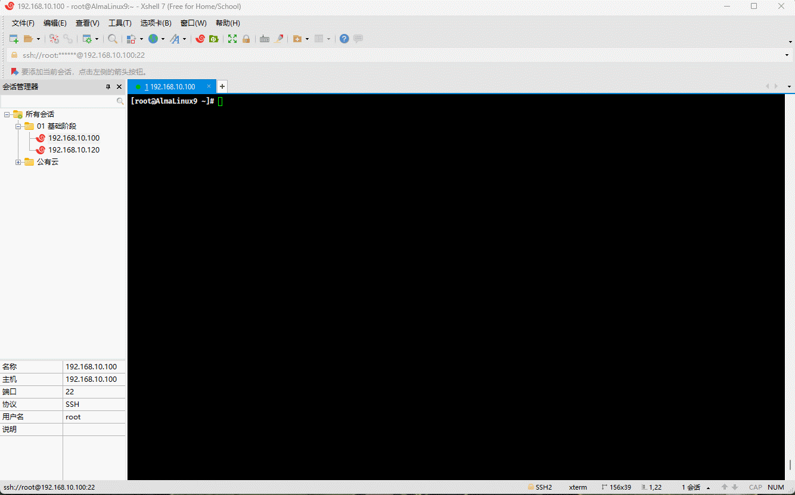


* 示例：反引号

```shell
echo `echo $PATH`
```


## 2.3 花括号扩展（可生成序列）

* 花括号 `{}` 扩展是一个强大的功能，用于生成任意的字符串列表，其用法如下：

```shell
# 基本数字序列，{开始..结束}，如果开始 > 结束，就是降序；反之，是升序
{1..5} # 1 2 3 4 5 
```

```shell
# 指定步长，{开始..结束..步长}
{1..5..2} # 1 3 5 ，2 是步长
```

```shell
# 字母序列
{a..e} # a b c d e
```

```shell
# 基本数字序列，{结束..开始}
{5..1} # 5 4 3 2 1
```

```shell
# 指定步长，{结束..开始..步长}
{5..1..2}
```

```shell
# 列出具体项
{1,3,5} # 1 3 5
```

* 也可以和字符串一起使用，可以用来对文件或目录进行批量操作（创建、删除、移动等）：

```shell
logs_{1..5} # logs_1、logs_2、logs_3、logs_4、logs_5
```


* 示例：

```shell
echo {1..5}
```


* 示例：

```shell
echo {1..5..2}
```


* 示例：

```shell
echo {01..05}
```


* 示例：

```shell
echo {01..05..2}
```


* 示例：

```shell
echo {a..e}
```


* 示例：

```shell
touch logs_{1..5}
```


* 示例：

```shell
cp anaconda-ks.cfg{,.bak}
```

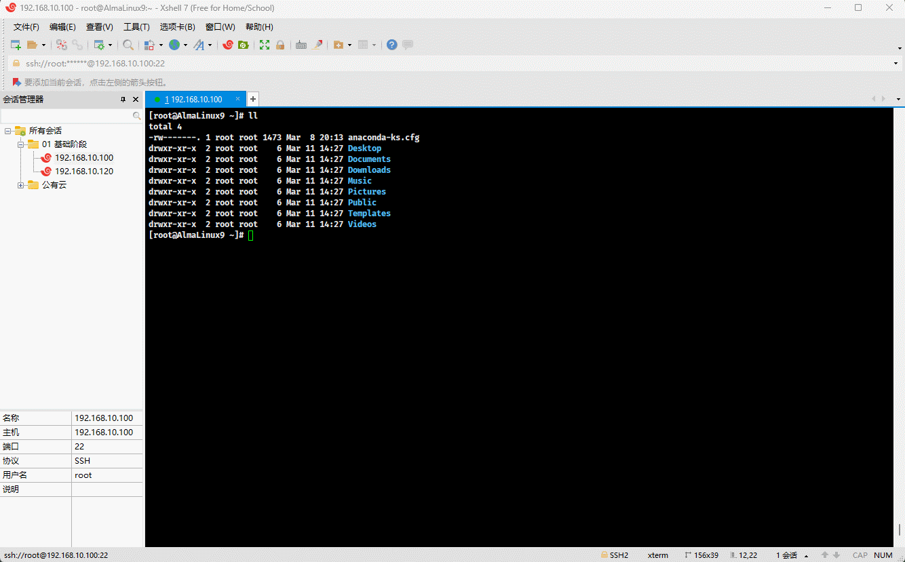

## 2.3 文件通配符（了解）

* 在 windows 中，我们需要查找某些文件，可能是这样搜索的，即：

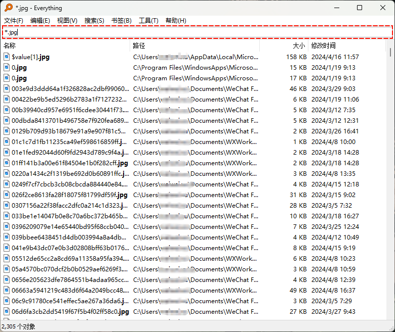

* 上图中的 `*.jpg` 就是文件通配符，可以帮助我们快速找到所想要的文件；当然，我们也可以通过 Everyting 的选项找到文件通配符的概念，即：

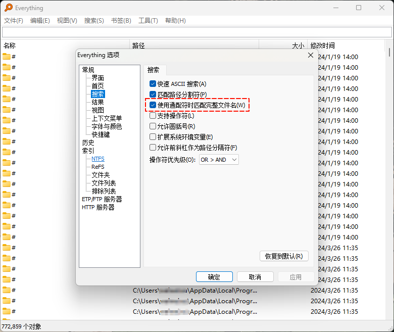

* 其实，文件通配符（globbing）是一种用于匹配文件和目录名称的模式，可以帮助我们高效的管理文件，如：执行复制（cp）、移动(mv)、删除（rm）或搜索（grep），正确使用通配符可以大大提高命令行的效率和灵活性。
* 常见的通配符（可以通过 `man 7 glob` 命令查看），如下所示：

```shell
*      # 匹配 0 或多个字符，但是不匹配以 . 开头的文件，即隐藏文件
?      # 匹配任何单个字符
~      # 当前的家目录
~abc   # abc 用户的家目录
.      # 当前工作目录
[0-9]  # 匹配 0-9 中的字符字符
[a-z]  # 匹配 a-z 中的任意字符
[A-Z]  # 匹配 A-Z 中的任意字符
[abc]  # 匹配 a、b、c 中的任意字符
[^abc] # 匹配 a、b、c 以外的任意字符
```

```shell
[:digit:]  # 任意数字，相当于0-9
[:lower:]  # 任意小写字母,表示 a-z
[:upper:]   # 任意大写字母,表示 A-Z 
[:alpha:]   # 任意大小写字母
[:alnum:]  # 任意数字或字母
[:blank:]  # 水平空白字符
[:space:]  # 水平或垂直空白字符
[:punct:]  # 标点符号
[:print:]  # 可打印字符
[:cntrl:]  # 控制（非打印）字符
[:graph:]  # 图形字符
[:xdigit:] # 十六进制字符
```

> [!NOTE]
>
> 之所以了解，是因为我们之后会学习正则表达式，其功能更加强大。


* 准备工作：

```shell
touch file{a..d}.txt file{A..D}.txt file{0..9}.txt abc.txt
```


* 示例：

```shell
ll *.txt
```


* 示例：

```shell
ll file[a-d].txt
```

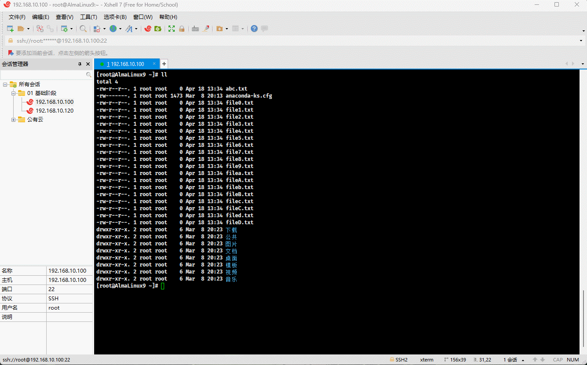


* 示例：

```shell
ll ???.txt
```


* 示例：

```shell
ll file[adef].txt
```


* 示例：

```shell
ll file[^abc].txt
```


* 示例：

```shell
ll file[[:lower:]].txt
```

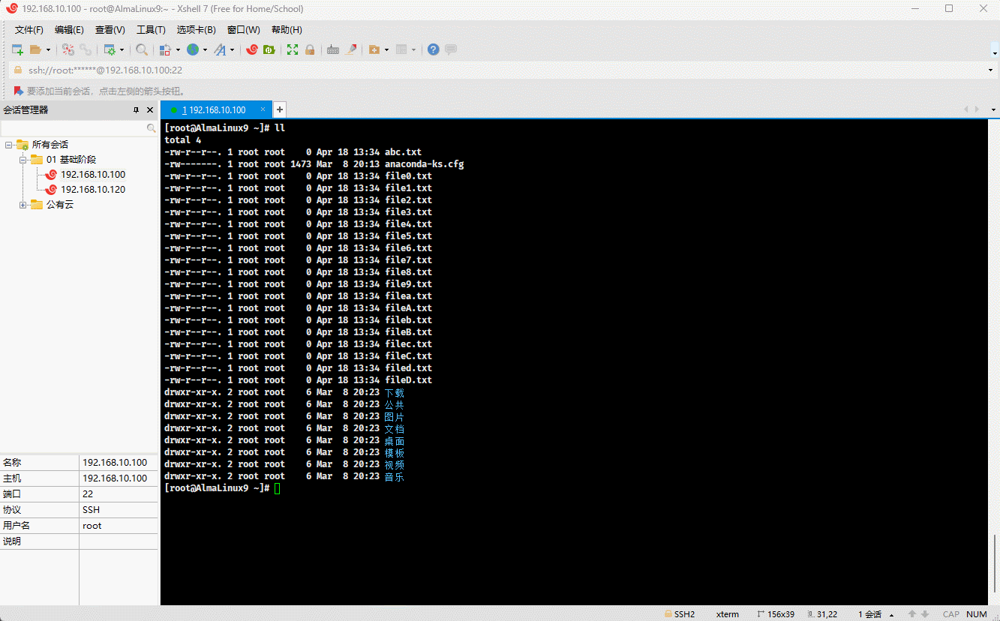


* 示例：

```shell
ll file[[:digit:]].txt
```

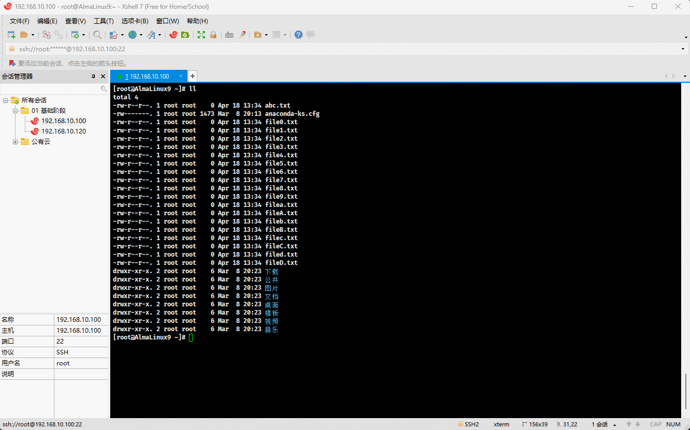

## 2.5 cp 命令

* 命令：

```shell
cp [-r|-R][-p][-d][-a] 源文件|目录 目标文件|目标目录
```

```shell
cp [-r|-R][-p][-d][-a] 源文件... 目标目录
```

```shell
cp [-r|-R][-p][-d][-a] -t 目标目录 源文件...
```

> [!NOTE]
>
> * 功能：复制文件或目录。
> * 选项：
>   * `-r|-R`，`--recursive`：递归赋值，复制目录及其目录中的内容。
>   * `-p`：复制的时候保留源文件或目录的属性（默认情况是：模式、所有权、时间戳）。
>   * `-d`：复制文件或目录的同时，复制软链接。
>   * `-a`：复制所有，相当于 `-dpr` ，常用。

> [!IMPORTANT]
>
> cp 默认是不能复制目录的，除非加上 `-R` 或 `-r` 选项。


* 示例：

```shell
cp /etc/issue . # 将指定文件复制到当前目录
```

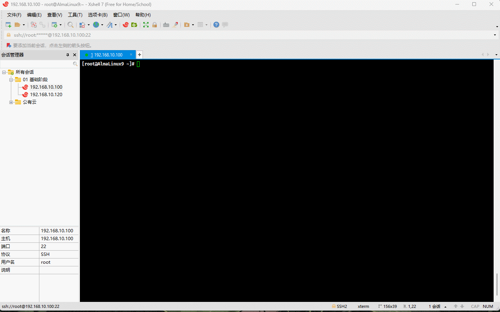


* 示例：

```shell
cp /etc/issue ./issue.bak # 将指定文件复制到当前目录，并重命名
```

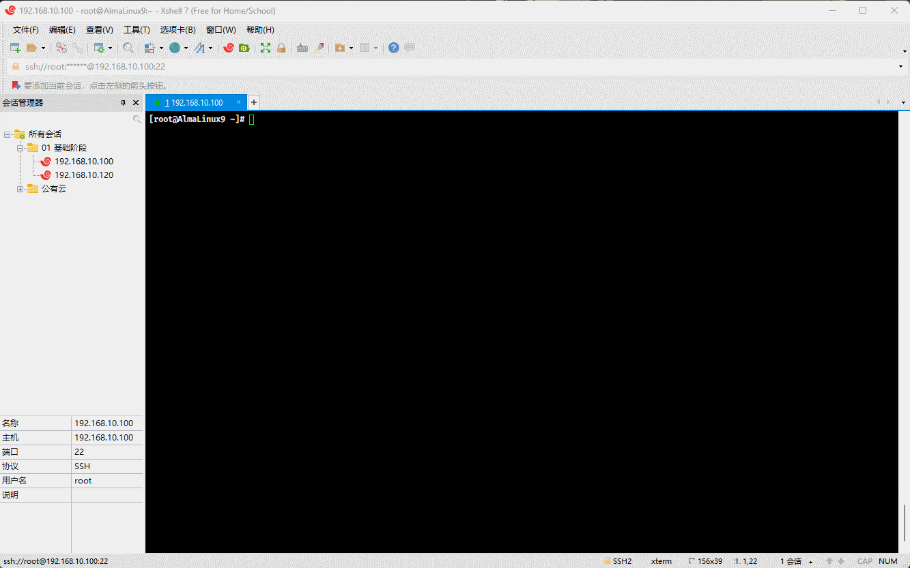


* 示例：

```shell
cp -R /etc . # 将指定的目录复制到当前目录
```


* 示例：

```shell
cp -R /etc ./etc.bak  # 将指定的目录复制到当前目录，并重命名
```


* 示例：

```shell
cp /etc/issue /etc/motd . # 将多个文件复制到当前目录
```


* 示例：

```shell
cp -R /etc /etc/motd . # 将文件和目录复制到当前目录
```


* 示例：

```shell
cp -t . /etc/issue /etc/motd # 将多个文件复制到当前目录
```


* 示例：

```shell
cp anaconda-ks.cfg{,.bak} # 备份
```

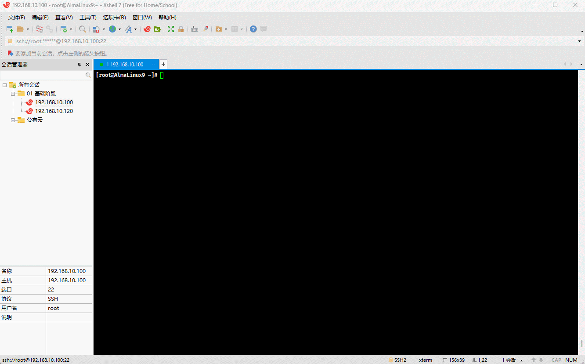


* 示例：

```shell
cp -a /etc ./etc-backup_`date +%F_%H-%M-%S` # 备份的时候，标注当前时间
```

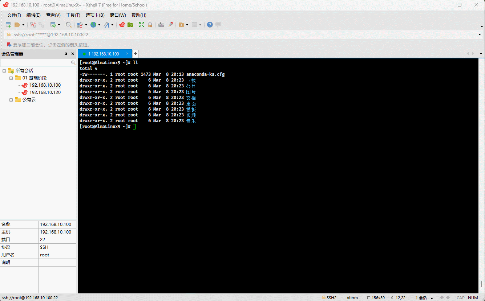

## 2.6 mv 命令

* 命令：

```shell
mv [-b][-f] 源文件|目录 目标文件|目标目录
```

```shell
mv [-b][-f] 源文件... 目标目录
```

```shell
mv [-b][-f] -t 目标目录 源文件...
```

> [!NOTE]
>
> * 功能：移动文件和目录、重命名文件和目录。
> * 选项：
>   - `-b`：如果需要覆盖文件，则覆盖前先备份。
>   - `-f`：如果目标文件和现有文件重名，则直接覆盖。

> [!IMPORTANT]
>
> - ① mv 命令类似于`剪切并粘贴`。
> - ② 如果`文件所在目录`和`目标目录`是`同一个目录`，就是`重命名`。
> - ③ 如果目标文件或目标目录不存在，则 mv 命令将创建它。如果目标文件或目标目录已经存在，则 mv 命令将覆盖它。


* 示例：

```shell
cp /etc/issue . # 复制指定文件到当前目录
```

```shell
mv issue /tmp # 移动文件到指定目录
```


* 示例：

```shell
cp /etc/issue . # 复制指定文件到当前目录
```

```shell
mv issue /tmp/issue.bak # 移动文件到指定目录，并重命名
```

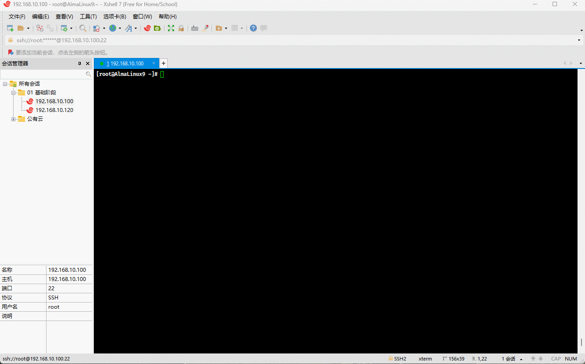


* 示例：

```shell
cp -a /etc . # 复制指定目录到当前目录
```

```shell
mv etc /tmp # 移动目录到指定目录
```


* 示例：

```shell
cp -a /etc . # 复制指定目录到当前目录
```

```shell
mv etc /tmp/etc2 # 移动目录到指定目录，并重命名
```


## 2.7 rm 命令

* 命令：

```shell
rm [-r][-f] 文件|目录 ...
```

> [!NOTE]
>
> * 功能：删除文件或目录。
> * 选项：
>   - `-f`，`--force`：强制删除不提示，非常危险⚠️。
>   - `-r|-R`，`--recursive`：递归删除目录及其内容，非常危险⚠️。

> [!IMPORTANT]
>
> - ① `rm` 命令非常危险，使用的时候要慎重！！！
> - ② `rm -rf xxx` 超级危险，使用的时候，没有需求就不要加上 `-r`或 `-f`。


* 示例：

```shell
mkdir test # 创建目录
```

```shell
touch test/.{a..e}.txt # 创建隐藏文件
```

```shell
rm -rf test/.[^.]* # 删除指定目录下的所有隐藏文件
```


* 示例：

```shell
mkdir test # 创建目录
```

```shell
touch test/file{1..10} # 批量创建文件
```

```shell
rm -rf test # 删除目录
```

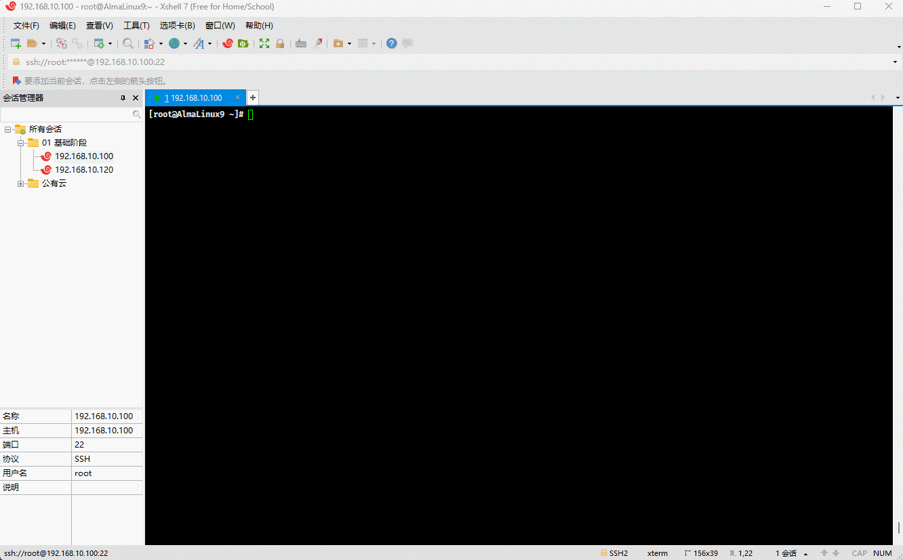


* 示例：

```shell
mkdir test # 创建目录
```

```shell
touch test/file{1..10} test/.{a..e}.txt # 批量创建文件
```

```shell
rm -rf test/* # 删除目录下的所有文件，不包括隐藏文件
```


## 2.8 rename 命令

* 命令：

```shell
rename '表达式' '替换值' 文件...
```

> [!NOTE]
>
> 功能：批量修改文件名称。


* 示例：

```shell
mkdir test # 创建目录
```

```shell
touch test/file{1..10}.txt # 创建文件
```

```shell
rename 'txt' 'conf.bak' test/* # 批量修改文件名称
```

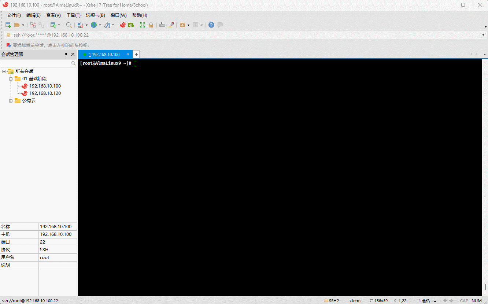


* 示例：

```shell
mkdir test # 创建目录
```

```shell
touch test/file{1..10}.conf.bak # 创建文件
```

```shell
rename '.bak' '' test/* # 批量修改文件名称
```


# 第三章：Linux 中的文件系统

## 3.1 回顾知识

* 之前，提过操作系统的功能，如下所示：
  * 硬件驱动。
  * 进程管理。
  * 内存管理。
  * 网络管理。
  * 安全管理。
  * 文件管理。
* Linux 既然也是操作系统，那就必须具有文件管理的功能，并且`文件管理`功能是由`文件系统`实现的。

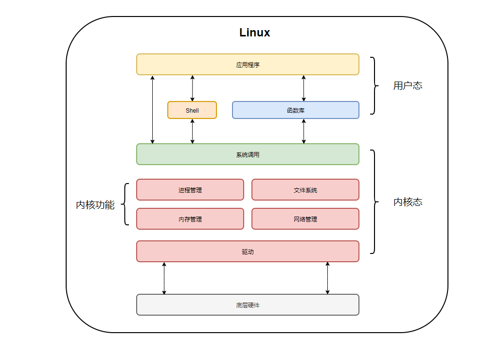

* 文件系统是操作系统用来管理存储在存储设备上的数据的一种方式。它负责数据的组织、存储、检索以及安全性。其主要的功能如下：
  * ① **数据组织**：文件系统提供了一种结构化的方式来存储信息，通常是以文件和文件夹的形式。这使得用户和程序能够容易地定位和组织数据。
  * ② **数据存储**：文件系统负责在硬盘或其他存储介质上物理存储文件。它管理磁盘空间的分配和回收，确保数据的有效存储。
  * ③ **数据检索**：文件系统允许用户和应用程序通过文件名、路径或其他属性快速访问存储的数据。
  * ④ **安全性与权限管理**：文件系统可以定义谁可以访问或修改文件和文件夹，帮助保护数据的安全性和隐私。
  * ⑤ **容错**：许多文件系统具有处理硬件故障、电力中断或系统崩溃等异常情况的机制，以防止数据丢失。

> [!IMPORTANT]
>
> * ① 文件系统的基本单位就是文件，其主要的目的就是为了对磁盘上的文件进行组织管理。
> * ② 根据底层实现的算法不同，文件系统也各不相同，如：Linux 中的 `ext2`、`ext3`、`ext4` 以及 `xfs` ，Windows 中的 `Fat32`、`NTFS` 等。

* 众所周知，Linux 系统是一个`单根`的操作系统，如下所示：


* 但是，Windows 却和 Linux 不同，Windows 某种意义上属于`多根`的操作系统，如下所示：

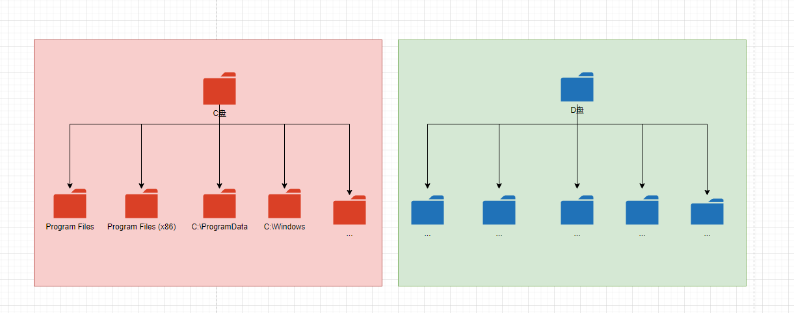

* 如果手动安装过 Windows 操作系统的，可能会知道，在 Windows 进行分区的时候，默认会将硬盘按照分区进行自动分配盘符，如：C 盘、D 盘、E 盘；如果如果购买了一块硬盘，格式化之后，系统会默认分配新的盘符，如：G 盘，如下所示：

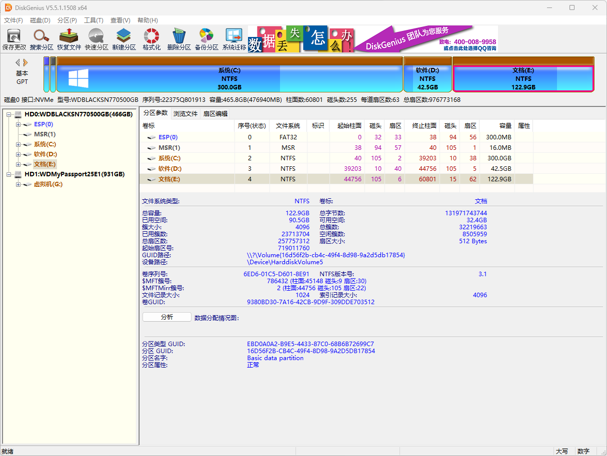

* 但是，Linux 是一个`单根`操作系统，是没有办法将 Windows 那种`多根`的操作系统，给每个分区增加一个盘符，Linux 是采用挂载的方式，如下：

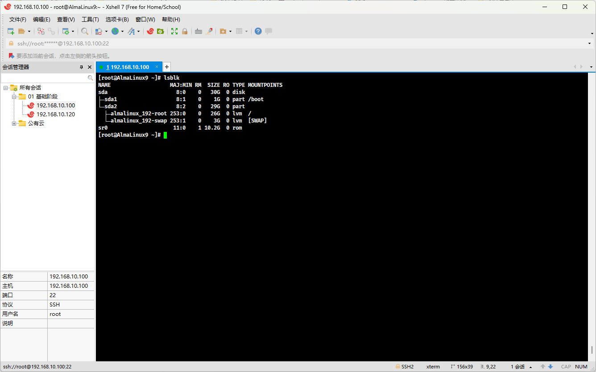

> [!NOTE]
>
> * ① 上图中的 Linux 有两块硬盘，其中 `sda1` 硬盘挂载到了 `/boot` 目录中，`sda2` 硬盘挂载到了 `/` 目录中。
> * ② 如果有第三块硬盘，我们只需要将其挂载到 Linux 中的任意一个目录，如：`/mnt` 目录，就可以保持 Linux 的单根系统的特点，同时也可以通过 `/mnt` 目录访问第三块硬盘上的文件了。

* 如果还是不理解，请看下图：

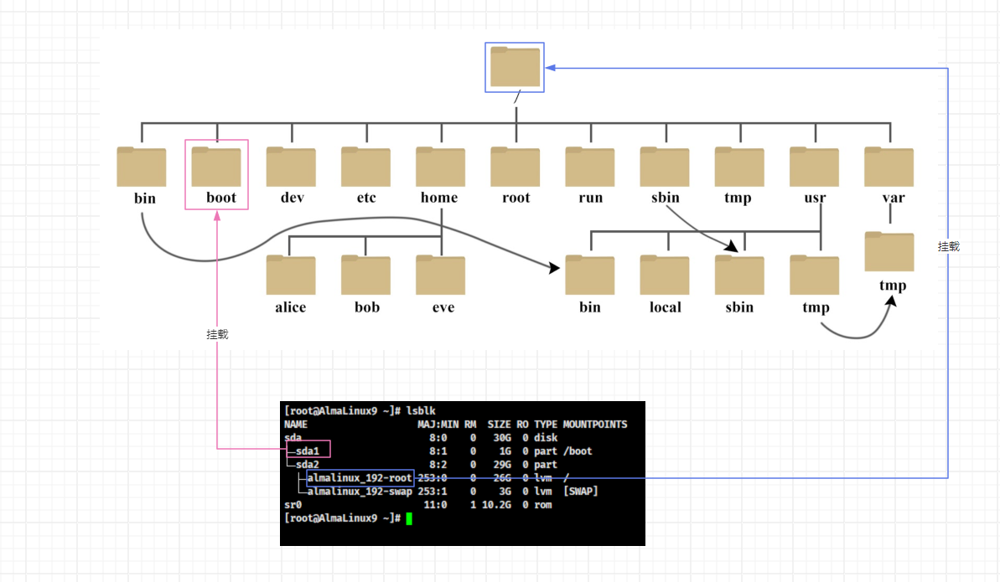

* 我们也知道，Linux 中一切皆文件，那么文本文件、目录、块设备、字符设备、管道、socket 等都是文件，我们甚至可以通过 vim （vim 是一个文件编辑工具）打开目录。

```shell
vim /
```

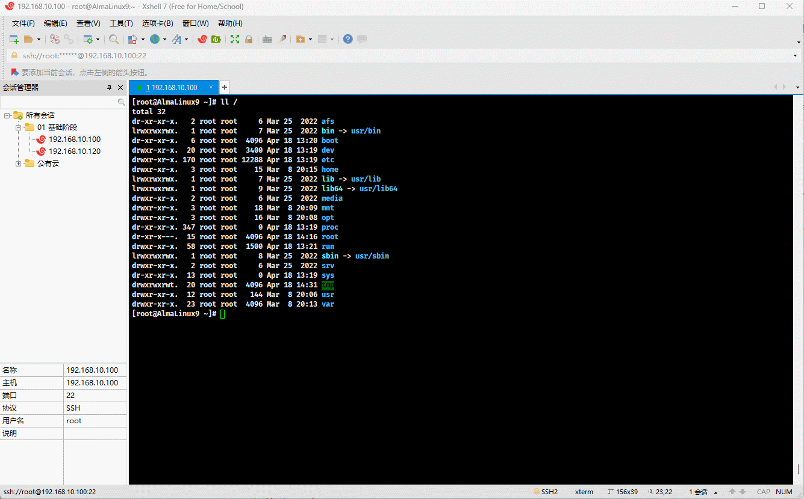

> [!NOTE]
>
> * ① `块设备`以固定大小的`数据块（block）`为单位进行数据的读写操作，通常用于`存储数据`，如：硬盘驱动器（HDD）、固态硬盘（SSD）、USB 闪存驱动器等。它们支持随机访问，即可以直接跳转到任意位置进行读写。`支持`文件系统，可以进行格式化、分区等操作。它们通常有较好的性能，因为它们可以缓存数据，提高数据传输效率。
> * ② `字符设备`以`字符`为单位进行数据的读写操作。它们不会将数据分块，而是以`连续的字符流`的形式进行传输。通常用于`输入输出设备`，如：键盘、鼠标、显示器、串口等。它们不支持随机访问，数据通常按照顺序进行处理。`不支持`文件系统，它们通常用于处理流式数据，如：文本和二进制数据。性能相对较低，因为它们不能像块设备那样进行数据缓存。

* Windows 中的文件，是通过`扩展名`来识别不同的文件类型的，如：

| 文件类型 | 说明                                   |
| -------- | -------------------------------------- |
| `*.exe`  | 可执行的二进制文件，如：`QQ.exe`  等。 |
| `*.txt`  | 普通的文本文件。                       |
| `*.dll`  | 动态链接库文件。                       |
| `*.jpg`  | 图片文件，如：`*.jpg`、`*.png` 等。    |

* 但是，Linux 中的`扩展名`仅仅用于展示而已，可以随意修改；但是，`推荐加上扩展名`，以便可以`见名识意`，如：

| 常用扩展名                | 备注           |
| ------------------------- | -------------- |
| `.txt`                    | 普通文本文件   |
| `.sh` 或 `.bash`          | Shell 脚本文件 |
| `.conf` 、`.cfg` 、`.ini` | 配置文件       |
| ...                       |                |

* 通常而言，我们都是通过 `ls -l` 来查看文件的类型的，如：

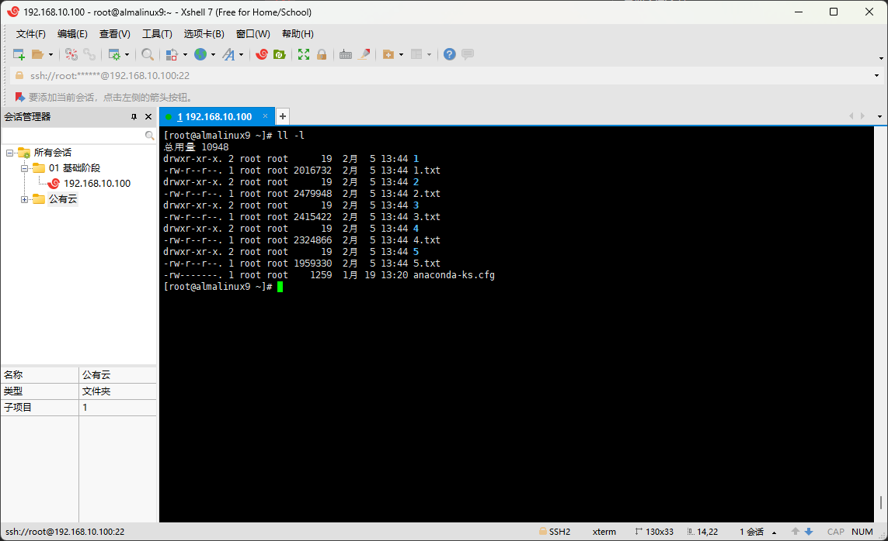

* 其中，Linux 常见的文件类型如下：

| Linux 常见的文件类型 | 解释说明 | 备注   |
| -------------------- | -------- | ------ |
| `-`rw-rw-r--         | 普通文件 | `常用` |
| `d`rwxrwxr-x         | 目录     | `常用` |
| `l`rwxrwxrwx         | 软链接   | `常用` |
| `b`rw-rw----         | 块设备   |        |
| `c`rw-rw----         | 字符设备 |        |
| `s`rwxrwxrwx         | 套接字   |        |
| `p`rw-rw----         | 管道     |        |

* 但是，有的时候，我们很难确定某些文件的类型到底是什么？

```shell
ll /etc/hostname /var/log/wtmp /bin/ls
```

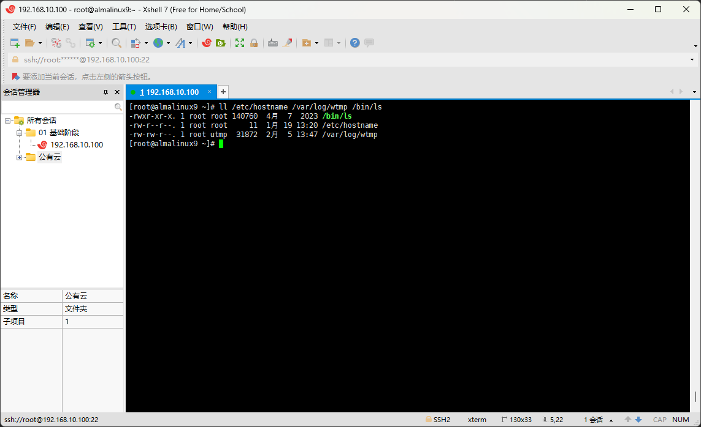

* 幸运的是，Linux 提供了 `file` 命令来帮助我们查看文件的具体类型，如：

```shell
file /etc/hostname /var/log/wtmp /bin/ls
```

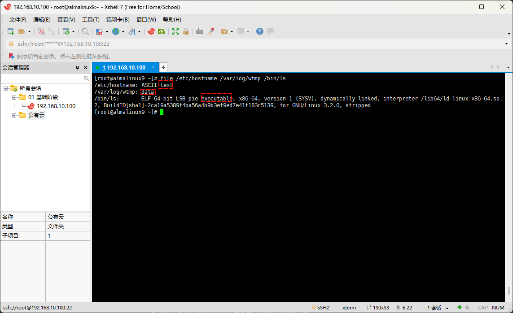

* file 命令结果的详细解释：

| 文件的类型 | 备注                                                         |
| ---------- | ------------------------------------------------------------ |
| text       | 文本文件；通常情况下，可以日常查看或修改的都是 text 类型的文件。 |
| data       | 数据文件，需要专门的命令查看，如：压缩包。                   |
| executable | 二进制文件，大部分都是文件。                                 |

> [!NOTE]
>
> `file` 命令还可以查看是否是软链接、设备文件、目录等。

## 3.2 虚拟文件系统

* Linux 中的文件系统繁多，为了简化开发，操作系统就提供了一个统一的接口，即在用户层和文件系统层引入了一个中间层 -- 虚拟文件系统，即：


> [!NOTE]
>
> 这样带来的好处就是解耦，即操作系统定义了所有文件系统都支持的数据接口和标准接口，而文件系统的实现者去实现这些接口就可以了，屏蔽了底层细节。

* 根据存储位置的不同，可以将文件系统分为三类：
  * 磁盘文件系统，直接把数据存储在磁盘中，如：ext2 、ext3、ext4、xfs 等都是这类文件系统。
  * 内存文件系统，这类文件系统的数据不是存储在硬盘的，而是占用内存空间，我们经常用到的 `/proc` 和 `/sys` 文件系统都属于这一类，读写这类文件，实际上是读写内核中相关的数据数据。
  * 网络文件系统，用来访问其他计算机数据的文件系统，如：NFS、CephFS。

> [!NOTE]
>
> * ① 文件系统需要先挂载到某个目录才可以正常启动，默认情况下，Linux 在启动的时候，会读取 `/etc/fstab` 文件，查看默认的挂载信息。
> * ② 当然，也可以通过 mount 命令手动挂载。

## 3.3 inode 、block 和目录项（⭐）

* 在现实生活中，我们是通过`身份证（身份证号码）`来定位到一个人的，即：


* 在 Linux 操作系统中，是通过 `inode`（index node ，索引节点）或`索引节点编号`（inode number）来`定位`一个具体的`文件`。

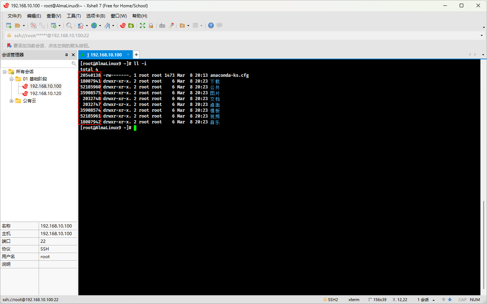

> [!NOTE]
>
> 上图中的显示的是文件的索引节点编号，即 inode number。

* 如上图所示，目录也是一种特殊的文件，它也有自己唯一的 inode，只不过和普通文件（普通文件中保存的是文件数据，我们可以通过 cat 等命令查看）不同的是，目录文件在磁盘中保存的是子目录或文件。

```shell
mkdir -pv test/a/b/c # 递归创建目录
```

```shell
touch test/{1..10}.txt # 批量创建文件
```

```shell
vim test # 通过 vim 打开目录文件
```


* 我们可以通过如下的命令，来证明 Linux 中的文件具有唯一的 inode：

```shell
# 从 / 根目录开始寻找，根据 inode number 来查找文件
find / -inum 20540138
```

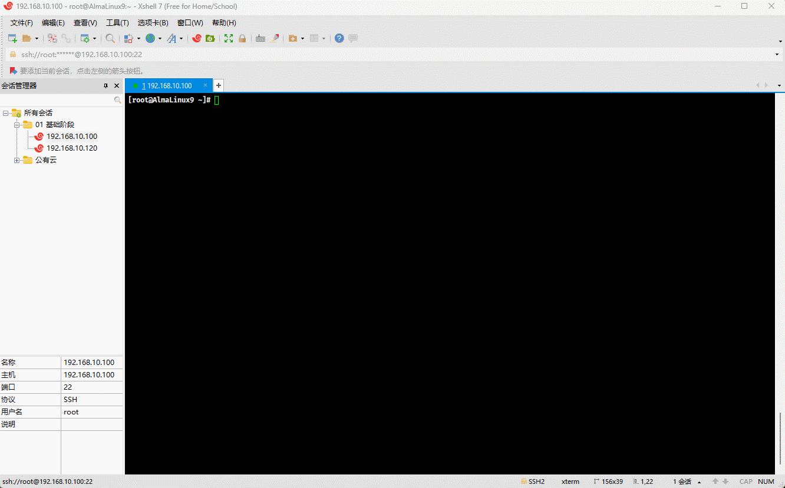

* 同理，对于目录文件，也是这样的道理，都有一个唯一的 inode 号：

```shell
# 从 / 根目录开始寻找，根据 inode number 来查找文件
find / -inum 33685633
```


* 在 Windows 中，对于一个文件而言，通常我们只关注它里面存放什么内容，我们可以通过对应的软件去查看或编辑它：


* 但是，我们有的时候，也会关心它的类型、位置、大小，创建时间、修改时间等信息，就可以通过查看属性来获取：


* 在 Linux 中，也是同样的道理，并且 inode 其实是一个数据结构，保存了文件的元信息，如：inode 编号、文件大小、访问权限、创建时间、修改时间、访问时间等，可以通过如下的命令来获取：

```shell
stat anaconda-ks.cfg 
```

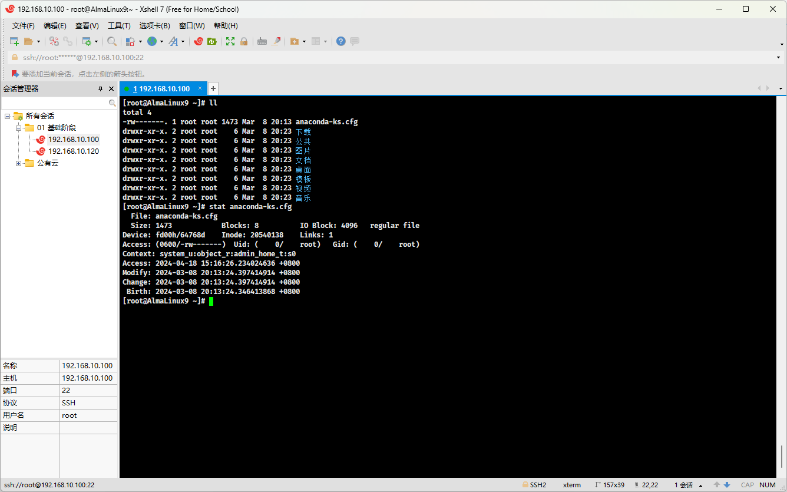

* 在上图中，我们还看到了 `IO Block：4096` 的字眼，其实数据就保存在这些 `block` 中了；在上文中，我们也了解过`分区`和`格式化`的概念：

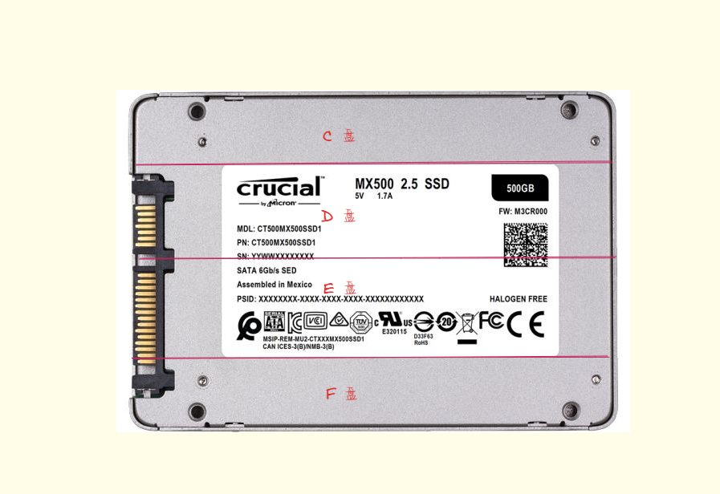

* 所谓的`分区`就是将硬盘划分为一个个的逻辑单元，由操作系统对每个分区划分一个个的 `inode` ，根据分区的大小不同，`inode` 的范围是不同的：

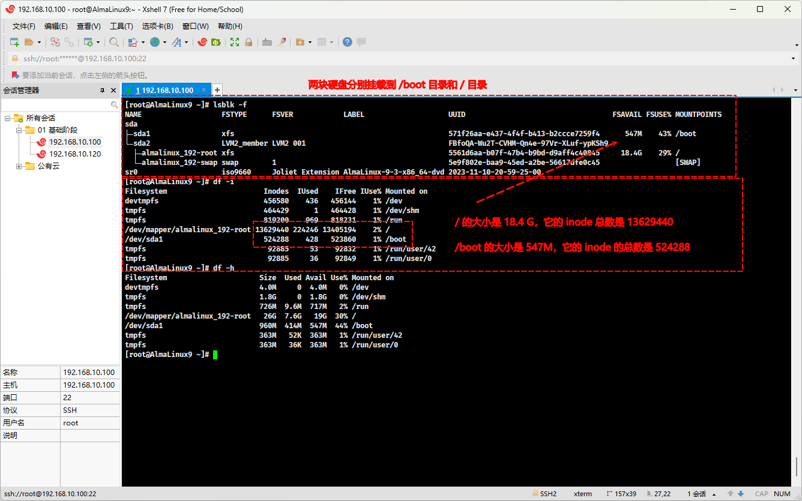

* 所谓的`格式化`是将`磁盘`或`分区的存储空间`组织成`文件系统`以便存储数据，简单理解就是划分为一个个的`小格子`以便存储数据，这些小格子通常的大小是 `4096B`，就是 block 。


> [!IMPORTANT]
>
> * ① 并非所有的 block 的容量都是 4096B ，即 4KB ，这是一个性能衡量的结果，如果文件系统不同，可能 block 的容量有所不同，例如：1KB、2KB、4KB 等。
> * ② 计算机的最基本的存储单位是 B （字节）；但是，对于文件系统而言，不管你有多大或多小，统一按照 4096B（4KB ）来存储，不足 4KB 的按照 4KB 来存储，即占用 1 个 block；相反，如果超过 4KB 的，假设是 7KB ，那么就需要需要占用 2 个 block 。

* 如果按照上述的说法，那么对于文件而言，其在磁盘中的存储结构（物理结构）就如下所示：

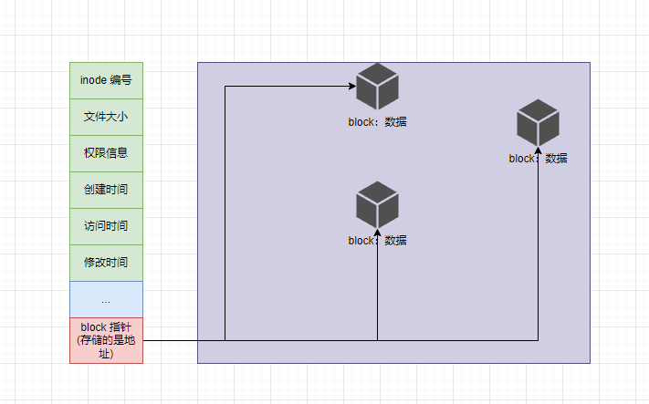

* 但是，现在一个视频可能都按 TB 来计算了，如果安装上图这么存储的话，实际操作系统读取文件的效率是非常低的。那么，真实的存储结构（物理结构）是这样的，即：

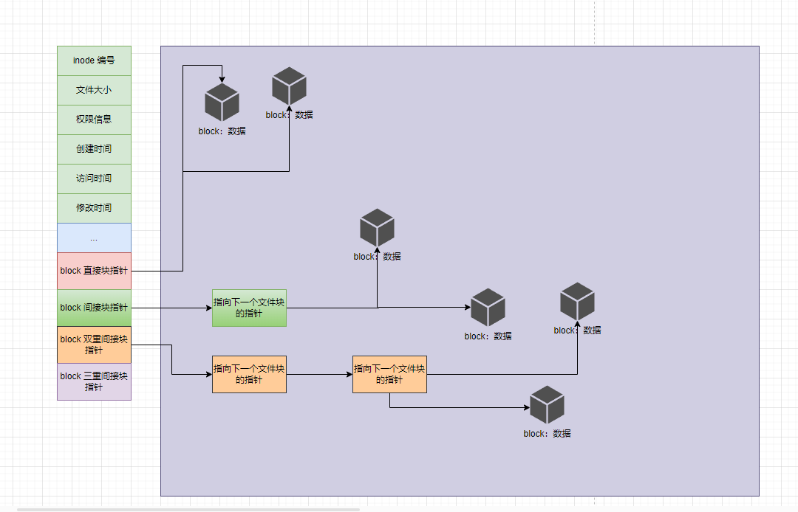

* 我们可以来推演一下：

```txt
假设 block 的容量大小是 4096B，即 4KB
```

```txt
① 直接块指针有 12 个，那么直接块指针可以存储 12 × 4KB = 48KB。
换言之，文件的大小 <= 48KB，使用直接块指针就可以了。
```

```txt
② 如果每个指针占用 4B ，那么间接块指针所指向下一个文件块的指针就是 4096B ÷ 4B = 1024 个，
则可以指向 1024 个 block ，即可以存储 1024 * 4KB = 4MB；
即文件的大小 <= 4MB，使用间接块指针就可以了。
```

```txt
③ 同样，每个指针占用 4B，那么双重间接指针可保存的 block 的数量就是：
(4096B ÷ 4B) × （4096B ÷ 4B）= 1024 × 1024 个，
则可以指向 1024 × 1024 个 block，即可以存储 1024 * 4KB * 1024 = 4GB；
即文件的大小 <= 4GB，使用双重间接块指针就可以了。
```

```txt
④ 同理，那么三重指针即可以存储 1024 * 4KB * 1024 * 1024 = 4TB；
即文件的大小 <= 4TB，使用三重间接块指针就可以了。
```

* 文件是按照上述的存储结构（物理结构）在磁盘存储的；但是，目录在 Linux 中也是文件，和普通文件不同的是，普通文件的 block 中保存是文件数据，但是目录文件的 block 中保存的是目录中的一项项（目录项）的文件信息，并且每个目录项将一个文件名映射到一个 inode 号；这样，当我们访问一个文件时，系统先查找目录中的文件名，获取相应的 inode 号，然后通过 inode 来访问文件的具体数据和元数据，如下所示：

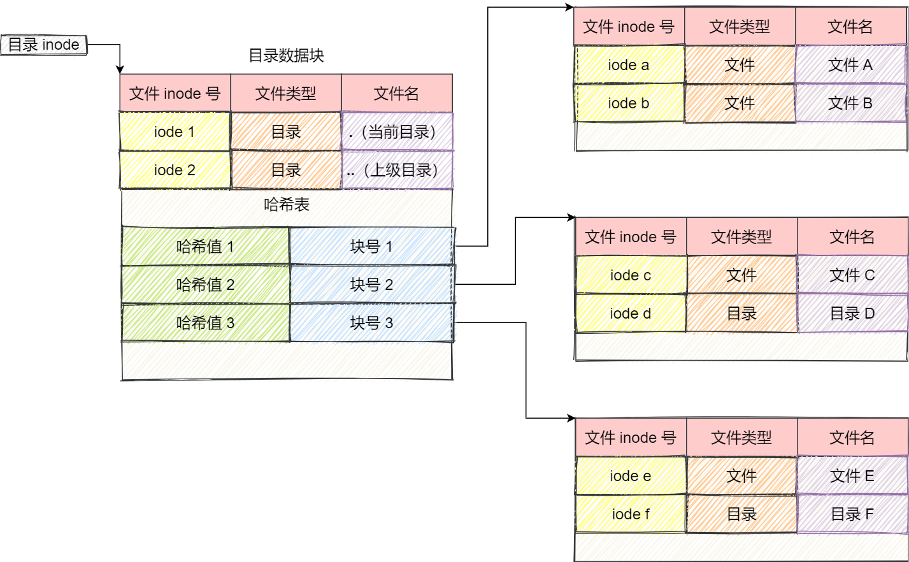

* 目录在磁盘上的存储结构（物理结构）就是上图这样的，但是目录在内存中的结构（逻辑结构）不是这样的，这是在内存中的结构，如下所示：

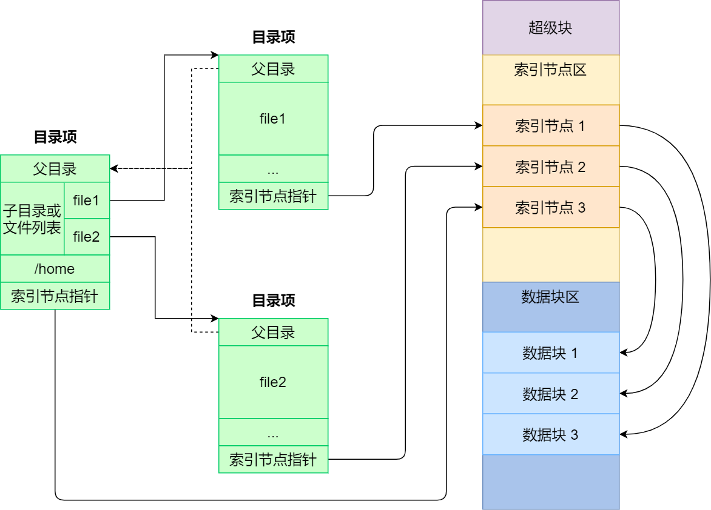

> [!NOTE]
>
> 目录是一个文件，持久化存储在磁盘上，而目录项是一个数据结构，缓存在内存中，毕竟如果查询目录频繁的从磁盘上读取，效率非常低下，所以操作系统就会将已经读过的目录使用目录项来缓存在内存中。

* 那么，索引节点（inode）、目录项、目录以及文件数据（block）的功能，如下所示：

| 类型                     | 描述                                             | 功能和用途                                                   |
| ------------------------ | ------------------------------------------------ | ------------------------------------------------------------ |
| 索引节点 (inode)         | 文件系统中的一个数据结构，存储关于文件的元数据。 | 存储文件属性（如权限、所有者）、文件大小和指向文件数据的指针。 |
| 目录项 (directory entry) | 将文件名与 inode 号链接的数据结构。              | 使文件系统可以通过文件名找到对应的 inode 。                  |
| 目录 (directory)         | 特殊类型的文件，包含多个目录项。                 | 组织和管理文件系统中的文件和子目录。                         |
| 文件数据 (block)         | 文件实际的内容，如：文本、图片、视频等。         | 存储用户数据，可通过 inode 中记录的位置访问。                |

* 此时，我们可以推理一下 `cp` 命令、`rm` 命令和 `mv` 命令背后的原理，如下所示：

> [!NOTE]
>
> `cp` 命令背后的原理：
>
> * ① 读取源文件的 inode，获取其所有元数据和数据块的位置。
> * ② 系统为新文件创建一个新的 inode，并分配数据块来存储文件内容的副本。
> * ③ 新文件的 inode 会有自己的独立元数据，例如：权限和修改时间。
> * ④ 从源文件读取的数据写入到新文件的数据块中。
> * ⑤ 目标目录中会添加一个新的目录项，这个目录项将包含新文件的名称和指向新 inode 的链接。

> [!NOTE]
>
> `rm` 命令背后的原理：
>
> * ① 首先找到该文件名对应的目录项，获取其 inode 号。
> * ② 系统会检查这个 inode 的链接数；如果链接数为 1（表示没有其他文件名链接到这个 inode），系统会释放所有分配给该文件的数据块（其实，不会释放数据块，而是标记为可释放；当其它文件也需要使用到这个数据块的时候，直接覆盖即可）和 inode 本身。
> * ③ 如果链接数大于 1，系统只减少 inode 的链接数，并更新 inode 的元数据。
> * ④ 无论哪种情况，对应的目录项都会被删除。

> [!NOTE]
>
> `mv` 命令背后的原理：
>
> * ① 如果 mv 命令的目标和源在相同的分区，流程如下：
>   * 只需要修改目录项的文件名或将目录项从一个目录移动到另一个目录。
>   * 不会影响 inode（索引节点）在磁盘上上的数据位置，即数据没有被移动，所以对于大容量的文件来说，会感觉很快！！！
> * ② 如果 mv 命令的目标和源不在相同的分区，就类似于 cp 和 rm ，所以对于大容量的文件来说，会感觉很慢！！！

* 查看分区的 inode ：

```shell
df -i
```

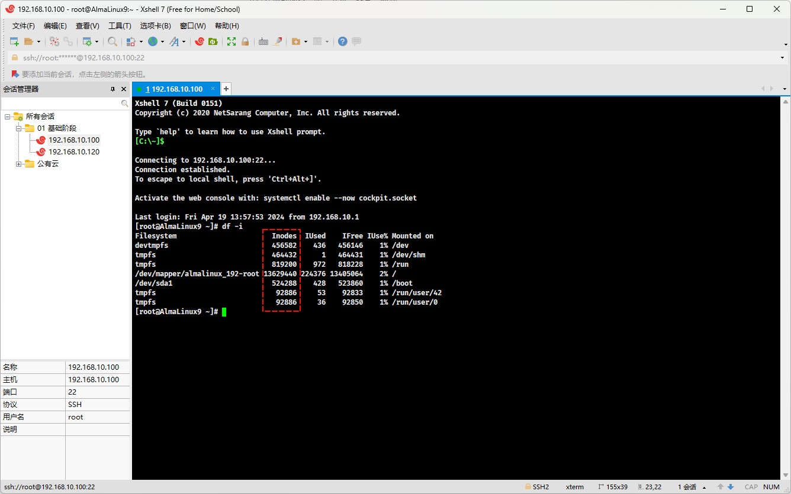

* 查看某个分区的 inode ：

```shell
df -i /boot
```

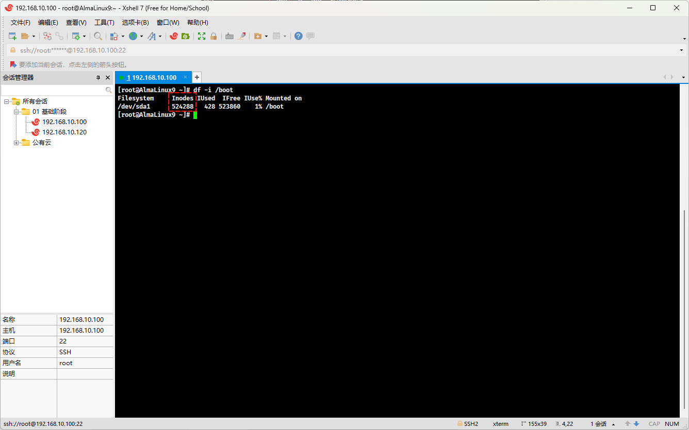

* 查看分区的磁盘空间：

```shell
df -h
```

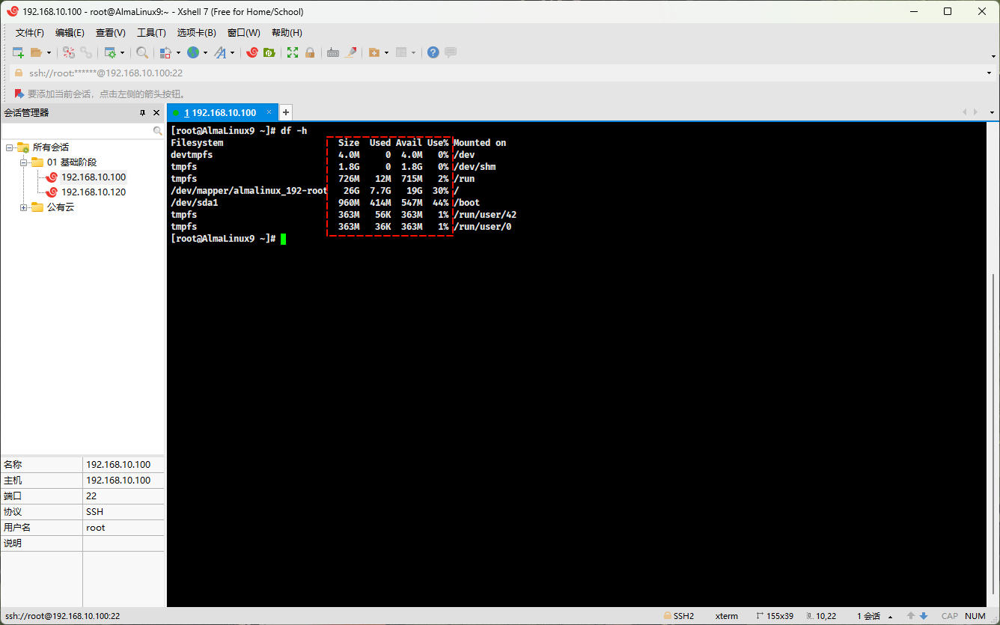

* 查看某个分区的磁盘空间 ：

```shell
df -h /boot
```

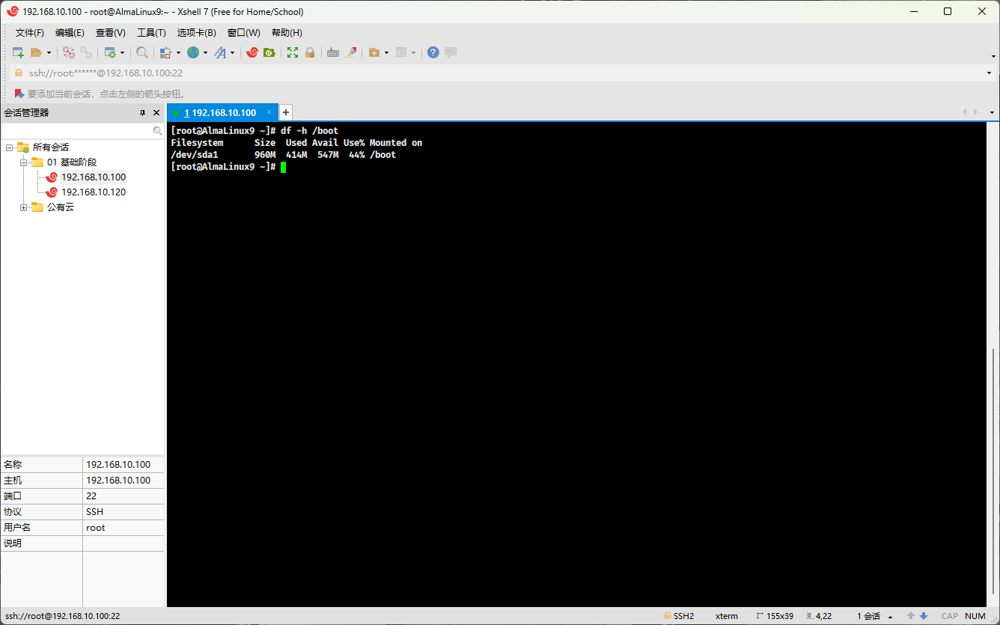

## 3.4 硬链接和软链接

### 3.4.1 硬链接

* 硬链接（hardlink）是指向文件系统中某个文件的物理位置的直接链接。它与原始文件共享相同的索引节点（inode），这意味着硬链接和原始文件实际上是文件系统中的同一个文件。

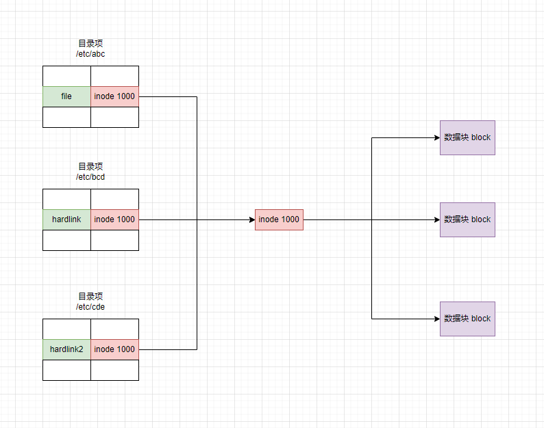

* 特点：
  * 创建硬链接会在对应的目录中增加额外的记录项以引用文件。
  * 对应于同一文件系统上同一个物理文件。
  * 每个目录引用相同的 inode 号。
  * 创建时链接数递增。
  * 删除文件时：rm命令递减计数的链接，文件要存在，至少有一个链接数，当链接数为零时，该文件被删除。
  * 不能跨越驱动器或分区。
  * 不支持对目录创建硬链接。
* 命令（创建硬链接）：

```shell
ln 源文件 硬链接
```

> [!NOTE]
>
> 如果源文件采用相对路径的方式，则是以当前目录为基准。


* 示例：

```shell
ln anaconda-ks.cfg anaconda-ks.cfg.hardlink # 创建硬链接
```

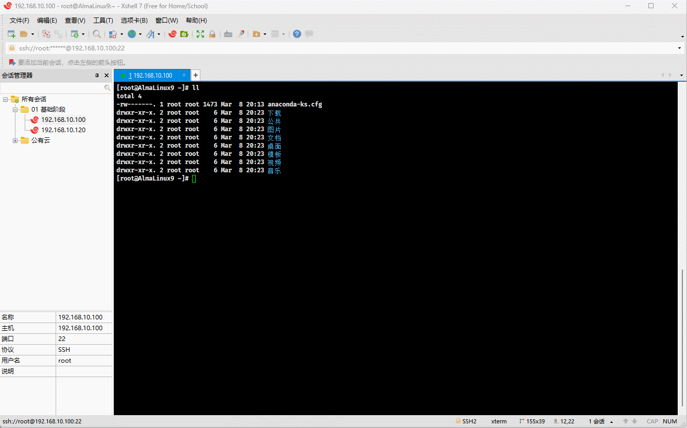

### 3.4.2 软链接（⭐）

* 软链接（softlink，symbolic 符号链接）类似于 Windows 中的快捷方式，它是一个指向另一个文件名的特殊文件，软链接包含的是目标文件的路径名。

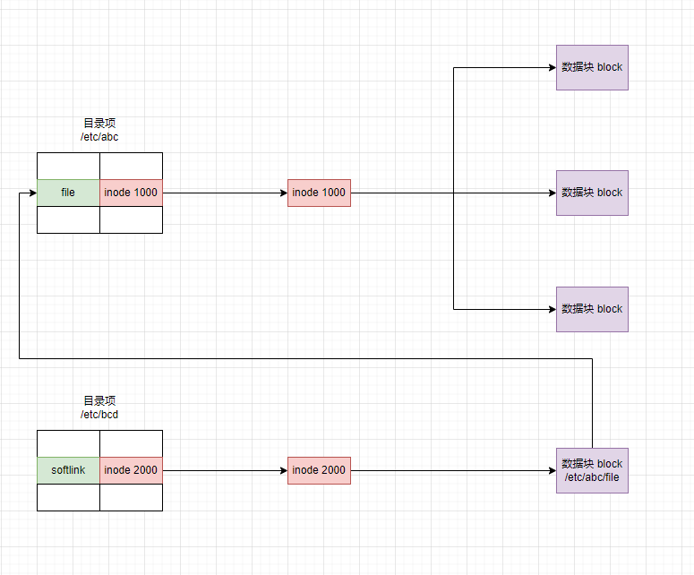

* 特点：
  * 一个符号链接的内容是它引用文件的名称。
  * 可以对目录创建软链接。
  * 可以跨分区的文件实现。
  * 指向的是另一个文件的路径；其大小为指向的路径字符串的长度；不增加或减少目标文件 inode的 引用计数。

* 命令（创建软链接）：

```shell
ln -s 源文件 软链接
```

> [!NOTE]
>
> * ① 如果源文件采用相对路径的方式，则是以软链接为基准。如果想规避这个问题，则可以先 `cd`到想创建软链接的目录，然后再使用 `ln -s` 创建软链接。  
> * ② 如果想删除软链接，但是软链接对应的是目录，那么使用 `rm -rf 软链接` 删除的是软链接本身；但是，如果使用 `rm -rf 软链接/`删除的是目录中的内容，非常危险，推荐使用 `unlink 软链接`来删除软链接。


* 示例：

```shell
cd /tmp
```

```shell
ln -s ../root/anaconda-ks.cfg  anaconda-ks.cfg.softlink
```

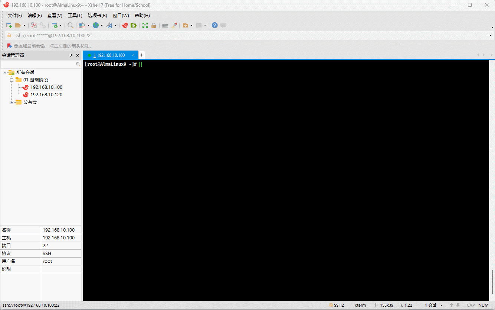

### 3.4.3 区别

* 硬链接和软链接的主要区别，如下所示：

| 特性       | 硬链接                                               | 软链接                                                   |
| ---------- | ---------------------------------------------------- | -------------------------------------------------------- |
| 定义       | 指向文件系统中某个文件的物理位置的直接链接           | 指向另一个文件名的特殊文件，类似于快捷方式               |
| Inode 共享 | 与原始文件共享同一 inode                             | 拥有自己的 inode，与原始文件不同                         |
| 属性共享   | 共享文件权限、所有权和修改时间                       | 拥有独立的权限、所有权和修改时间                         |
| 删除影响   | 删除任何链接，只要还有一个链接存在，文件数据不受影响 | 如果原始文件被删除，链接变成死链接，无法访问             |
| 使用限制   | 不能跨文件系统，不能链接到目录                       | 可以跨文件系统，可以链接到目录                           |
| 主要用途   | 创建文件的额外访问点，看起来与原文件无区别           | 提供对文件或目录的灵活引用，尤其是在需要跨文件系统时使用 |

## 3.5 实际生产案例

* 有的时候，会在生产环境中出现硬盘占满的现象，如下所示：


* 其实，原因无非如下两种：
  * ① 磁盘分区还有空间，但是提示没有空间创建文件，是因为 inode 编号耗尽的原因。
  * ② inode 编号资源还有，但是磁盘空间被耗尽，同样也不能创建文件。

> [!IMPORTANT]
>
> 对于情况 ② 而言，在实际生产中，可能出现某些程序一直在向某个日志文件中不断地写日志，以及程序配置不合理，造成日志文件越来越大，最终将磁盘空间耗尽（业内称为`巨页文件`），对于这种情况的临时解决方法就可以使用 `cat /dev/null > var/log/huge.log` 命令将日志文件的内容清空。


* 示例：演示情况 ①

```shell
cd /boot
```

```shell
mkdir test && cd test
```

```shell
for i in $(seq 1 523859); do touch "file${i}.txt"; done # 根据实际情况调整
```

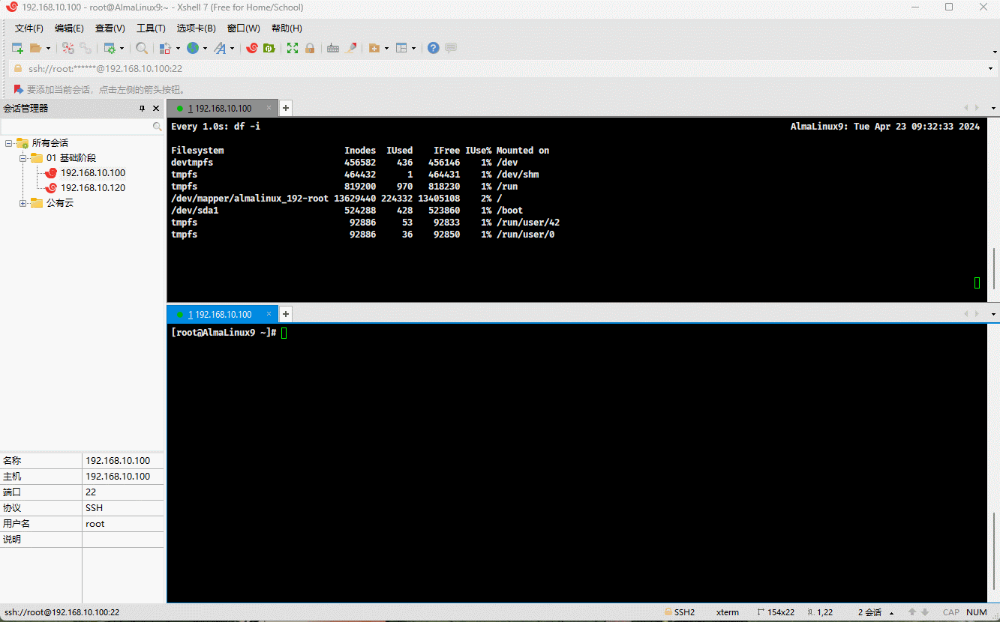


* 示例：演示情况 ②

```shell
cd /boot
```

```shell
mkdir test && cd test
```

```shell
cp /dev/zero .
```

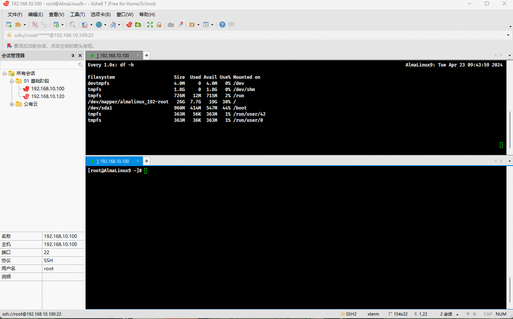


