# 第一章：行业知识

## 1.1 运维工程师的世界

### 1.1.1 IT 各个岗位及其工作内容

* 在 IT （软件）行业中，有许多不同类型的职位，每个职位都有其独特的责任和要求。
* 以下是一些常见的软件行业的职位及其工作内容：
  * **产品经理（Product Manager）**：
    * 负责制订产品愿景、策略和路线图，与开发团队合作推动产品开发。
    * 收集用户反馈和市场需求，定义产品功能和优先级。
    * 协调跨部门工作，确保产品按时交付，并在市场上取得成功。
  * **软件开发工程师（Software Development Engineer）**：
    * 负责设计、开发、测试和维护软件应用程序或系统。
    * 编写高质量的代码，解决技术问题，并根据需求进行改进和优化。
    * 参与团队协作，与其他开发人员、测试人员和产品经理合作，确保项目按时交付并满足客户需求。
  * **质量保证工程师（Quality Assurance Engineer）**：
    * 负责测试软件应用程序的功能（业务）、性能（压力）和安全性，确保软件质量符合标准。
    * 制定测试计划和策略，编写测试用例和自动化脚本。
    * 与开发团队合作，及时发现和解决问题，确保软件达到高质量标准。
  * **运维工程师（Operations Engineer）**：
    * 负责管理和维护软件系统的运行环境，包括：服务器、网络和存储等基础设施。
    * 配置、监控和优化系统性能，确保高可用性和稳定性。
    * 响应和解决系统故障和问题，执行紧急修复和预防措施。
    * 自动化运维流程，提高效率和可靠性。
  * ……

> [!NOTE]
>
> * ① 以上列举的职位只是 IT（软件）行业中的一部分而已，实际上还有许多其他的职位，如：运营、商务等，每个职位都有其独特的工作职责和技能要求。
> * ② 软件开发工程师，还可以根据`职位`进行细分，如：前端开发工程师、后端开发工程师、全栈开发工程师等。
> * ③ 软件开发工程师，还可以根据`编程语言`进行细分（通常都是针对后端的编程语言），如：Java 开发工程师、Go 开发工程师、Python 开发工程师等。

### 1.1.2 运维工程师的工作内容

* 运维工程师的基本职责就是`保证系统和服务的稳定性`，稳定压倒一切，确保服务一年 365 天，每天 24 小时不间断的为用户提供服务。
* 在此基础上运维工程师的工作内容还有：
  * ① 提升效率：使用自动化的平台或工具，来提升项目在研发生命周期内的效率。
  * ② 控制成本：通过技术手段对服务架构进行优化，或采用新的产品或技术，来达到降低成本，提升效益的作用。
  * ③ 发布管理：构建自动化运维平台，来确保每次发版都安全可控。
  * ④ 变更管理：通过技术手段，对每次变更进行同步记录，确保有迹可循。
  * ⑤ 备份恢复：对重要数据采用定时备份机制，以便能在发生问题的时候能及时恢复数据。
  * ⑥ 灾难演练：定期对预定义的方案进行演练，确保是可行的。
  * ⑦ 系统分析：通过采集并分析各类日志，定位并分析出系统可能存在的风险点，及时修正，以及做好预案。
  * ⑧ 技术选项：根据当前服务的业务情况，选用不同的产品和架构，以达到业务和经济的平衡。
  * ……

### 1.1.3 运维工程师的技能树

* 基础通用技能：
  * 深入理解 Linux 系统。
  * 熟悉 Shell 编程。
  * 掌握 Linux 中的用户体系、权限体系、文件体系。
  * 掌握 Linux 中的磁盘管理、进程管理、服务管理。
  * 掌握各种常见的文本编辑工具，如：vim 等。
  * 熟悉相关网络协议和各类工具。
  * 能熟练搭建 Web Server 服务。
  * 熟悉各类编程语言的运行环境。
  * 熟悉一两种主流的数据库。
  * 熟悉版本控制工具，如：Git 等。
  * 熟悉一两种主流的公有云。
  * ……
* 高级技能：
  * 熟悉各类自动化运维工具。
  * 熟悉各种开源监控平台。
  * 熟悉存储网络服务。
  * 熟悉 ELK 套件。
  * 熟悉虚拟化技术。
  * 熟悉容器技术。
  * 掌握一两种编程语言。
  * ……

## 1.2 IT 行业基础设施的发展史

### 1.2.1 Iass（青铜时代）

* Iass（Infrastructure as a Service，基础设施即服务），提供虚拟化的计算资源作为一项服务，这些资源，包括：虚拟机、存储、网络和服务器（裸金属服务器）等。
* 用户可以通过互联网获得这些资源，而不需要物理上购买或维护硬件。IaaS 提供了高度的灵活性和控制权，使用户能够以完全自定义的方式使用基础设施。
* 适用于需要完全控制其基础设施的企业和开发者，但又不希望投资于物理硬件。用户负责管理操作系统、数据库、应用程序等。

> [!NOTE]
>
> 典型的产品有：
>
> * ① **阿里云 ECS**：提供弹性虚拟服务器服务。用户可以快速部署和管理服务器实例，满足各种计算需求。
> * ② **腾讯云 CVM（Cloud Virtual Machine）**：提供可伸缩的虚拟云服务器，支持多种计算需求和应用场景。
> * ……


### 1.2.2 Pass（铁器时代）

* Pass（Platform as a Service，平台即服务），提供了比 IaaS 更高层次的服务，它在 IaaS 的基础上添加了一层，提供了用于开发、测试、交付和管理软件应用程序的平台，这包括操作系统、中间件、数据库、开发工具、管理工具等。
* 适用于开发者和企业，他们可以在 PaaS 提供的平台上直接开发和部署应用程序，而无需担心底层基础设施的建设和维护，用户只需关注应用的开发和运营。

> [!NOTE]
> 典型的产品有：
>
> * ① **阿里云 Web 应用服务（Web App Service）**：提供 Web 应用的全托管平台，支持 Java、Node.js、PHP、Python 等多种语言，帮助开发者快速构建、部署和管理应用。
> * ② **腾讯云云函数（Cloud Function Service，SCF）**：无服务器计算服务，允许用户无需管理服务器即可运行代码，适用于构建高度可扩展的事件驱动型应用程序。
> * ……


### 1.2.3 SaaS（黄金时代）

* SaaS（Software as a Service，软件即服务），是向最终用户提供通过互联网使用的完全功能的软件，用户不需要安装或运行软件的本地副本，而是直接通过网络访问，这种服务通常基于订阅模式，用户按使用付费。
* 适用于广泛的用户，包括个人和企业，用户只需关注软件的使用，而不需要关注软件的安装、运维、更新等，SaaS 提供了即开即用的便利。

> [!NOTE] 
>
> 典型的产品有：
>
> * ① **钉钉**：阿里巴巴推出的企业通讯和协作平台，集成了即时通讯、视频会议、办公自动化等多种功能。
> * ② **腾讯会议**：腾讯提供的在线视频会议服务，支持高清视频会议和远程协作，适用于各种规模的企业。
> * ……

## 1.3 云时代的环境部署和运行模式

* 我们经历了 IT 行业的基础设施建设从青铜时代到如今的黄金时代；在云时代的环境部署和运行模式有如下的特点：
  * ① **弹性和可扩展性**：云服务允许资源按需分配和释放，系统可以根据负载变化自动扩展或缩减资源，如计算能力、存储空间等，从而实现高度的弹性和可扩展性。
  * ② **即用即付的计费模式**：用户根据实际使用的资源量，如：CPU 核数、存储空间、网络流量等，去支付费用，这种计费模式使得成本更加透明，且能有效控制成本。
  * ③ **去中心化和全球化部署**：云服务提供商通常在全球范围内拥有多个数据中心，使得应用和服务可以部署在离用户最近的位置，从而降低延迟，提高访问速度和服务可靠性。
  * ④ **自动化和 DevOps 文化**：云时代强调使用自动化工具进行软件开发、测试、部署和运维，促进了 DevOps 文化的发展，实现了开发和运维的紧密合作，提高了效率和响应速度。
  * ⑤ **无服务器计算（Serverless）和容器化**：无服务器计算允许开发者专注于代码而无需管理服务器，而容器化技术，如：Docker、Kubernetes ，提供了轻量级、可移植的软件运行环境，两者都大大简化了应用的部署和运行。
  * ⑥ **多租户和资源共享**：云环境通常是多租户的，即多个用户或组织共享相同的物理资源，但系统通过逻辑隔离确保了安全性和隐私性。
  * ⑦ **集成化和服务化**：云服务提供商通常提供广泛的服务集合，包括：计算、存储、数据库、人工智能、物联网等，这些服务通过API集成，方便用户构建和扩展应用。
  * ⑧ **持续集成/持续部署（CI/CD）**：云环境支持 CI/CD 流程的实现，使得软件的更新和部署可以自动化进行，加快了软件交付的速度，并提高了软件质量。
  * ⑨ **灾难恢复和高可用性**：云服务通常提供灾难恢复能力和数据备份服务，确保在发生故障时能快速恢复服务，实现高可用性。
  * ⑩ **安全性和合规性**：云服务提供商投入大量资源以确保其平台的安全性，并帮助用户满足各种合规性要求，如：数据保护法规等。
  * ……
* 但是，虽然云计算给我们提供了很大的便利，但是也给我们带来了更多的挑战：
  * ① **数据安全和隐私**：在云平台上，数据安全和隐私成为了主要的担忧之一。由于数据存储在远端服务器上，企业需要确保数据传输和存储过程的加密，并依赖云服务提供商实施强有力的安全措施。
  * ② **合规性和法律问题**：不同地区和行业对数据处理和存储有着严格的合规要求。企业需要确保他们的云服务提供商能够遵守相关的法律法规，例如：GDPR（欧盟通用数据保护条例）。
  * ③ **成本管理**：虽然云计算按需付费的模式为企业节省了前期投资，但不恰当的资源配置和管理不善可能导致成本失控。因此，有效的成本管理和优化成为了企业使用云服务时必须考虑的重要因素。
  * ④ **技术依赖和供应商锁定**：过度依赖单一云服务提供商可能会导致供应商锁定，给未来的迁移和扩展带来困难。企业需要考虑多云策略或选择支持标准化和互操作性的服务。
  * ⑤ **技术复杂性和管理挑战**：随着云服务的不断扩展和演化，管理云环境的复杂性也在增加。企业需要有足够的技术能力和工具来管理云资源，保证系统的性能和稳定性。
  * ⑥ **性能和延迟**：对于某些高性能或实时性要求极高的应用，云计算可能面临网络延迟和带宽限制的问题。在这些情况下，企业可能需要考虑混合云或边缘计算解决方案。
  * ⑦ **数据迁移和集成**：将现有的系统和数据迁移到云环境可能是一项复杂和耗时的任务，特别是当涉及到大量数据和复杂的应用集成时。
  * ⑧ **人才和技能**：云计算需要专门的知识和技能，企业可能面临在云技术、安全和管理方面培训员工或招聘合适人才的挑战。
  * ⑨ **可靠性和服务中断**：尽管云服务提供商通常提供高可靠性的服务承诺，但服务中断的风险仍然存在。企业需要制定相应的灾难恢复和业务连续性计划以应对可能的中断。
  * ⑩ **文化和组织变革**：采用云计算不仅是技术变革，也是组织和文化变革。企业需要适应以云为中心的运营模式，这可能涉及到内部流程和团队结构的调整。
  * ……


# 第二章：计算机介绍

## 2.1 计算机系统

* 计算机（Computer），俗称`"电脑"`，是一种能够接收和存储信息，并按照存储在其内部的程序对海量的数据进行自动、高速的处理，然后将处理结果输出的现代化智能电子设备。
* 计算机有很多形式，如：台式电脑、笔记本电脑、智能手机、平板电脑等，还有生产环境中提供重要业务支撑的各种服务器（Server）。

* 一个完整的`计算机系统`由`硬件（Hardware）系统`和`软件（Software）系统`两大部分组成，如下所示：

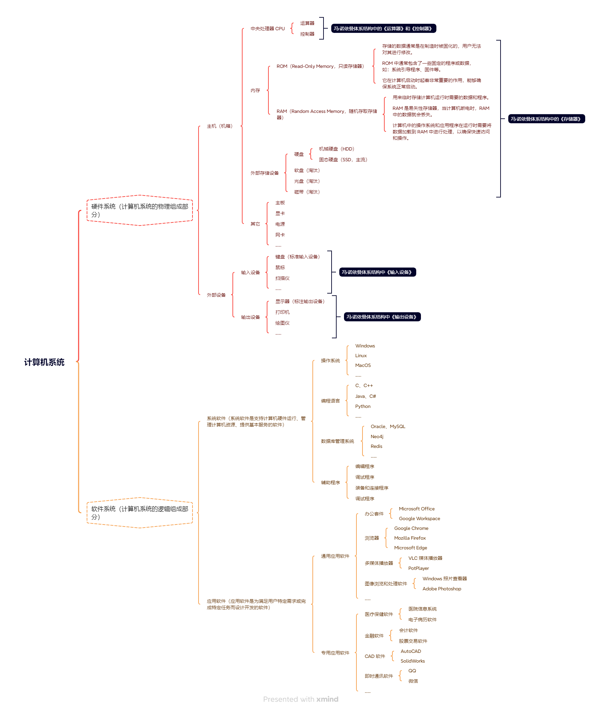

## 2.2 计算机硬件

### 2.2.1 概述

* 计算机硬件的发展历史：
  * 第一代计算机（1946 - 1957），电子管时代。
  * 第二代计算机（1958 - 1964），晶体管时代。
  * 第三代计算机（1965 - 1970），集成电路时代。
  * 第四代计算机（1971 - 至今），大规模集成电路时代。

### 2.2.2 世界上第一台计算机

* 1946 年，世界上第一台计算机 `ENIAC`（Electronic Numerical Integrator and Computer，电子数字积分计算机）在美国的宾州大学诞生，是美国奥伯丁武器试验厂为了满足计算弹道需要而研制的。

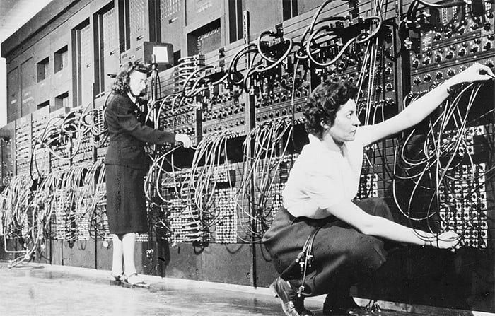

* 其内部使用了大约 18000 个电子管，占地约 170 平方米，重达 30 吨，并且耗电量巨大，每秒可进行 5000 次加法或 400 次乘法，它标志着计算机时代的开始，并为后续计算机技术的发展奠定了基础。

### 2.2.3 冯·诺依曼体系结构

* `冯·诺依曼`是一位多才多艺的科学家，他在数学、物理学、计算机科学、经济学等领域都有杰出的贡献。


* `冯·诺依曼`的主要成就：
  * 在计算机科学领域的最著名贡献是提出了`冯·诺依曼`体系结构（1946 年），这是现代计算机设计的基础。
  * 促进了计算机的可编程性和通用性，使得计算机能够执行各种复杂的任务。
  * 对核武器设计、自动化控制系统、人工智能等领域的发展产生了重要影响。
  * ……

* `冯·诺依曼`体系结构的理论要点如下：
  * ① **存储程序**：`程序指令`和`数据`都存储在计算机的内存中，这使得程序可以在运行时修改。
  * ② **二进制逻辑**：所有数据和指令都以`二进制`形式表示。
  * ③ **顺序执行**：指令按照它们在内存中的顺序执行，但可以有条件地改变执行顺序。
  * ④ **五大部件**：计算机由`运算器`、`控制器`、`存储器`、`输入设备`和`输出设备`组成。
  * ⑤ **指令结构**：指令由操作码和地址码组成，操作码指示要执行的操作，地址码指示操作数的位置。
  * ⑥ **中心化控制**：计算机的控制单元（CPU）负责解释和执行指令，控制数据流。

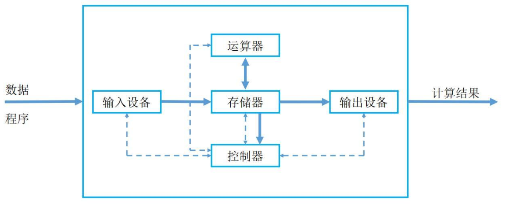

> [!IMPORTANT]
>
> `存储器`分为`主存储器（内存）`和`辅助存储器（硬盘）`。

### 2.2.4 计算机数据记录单位

* 计算机数据记录单位是根据数据大小和处理需求而定义的一系列标准化的度量单位。
* 以下是一些常见的计算机数据记录单位，从最小的位（bit）到较大的数据单位：
  * ① **位（bit）**：`位`是`计算机数据`的`最小单位`，代表一个二进制数字，即 `0` 或 `1` 。
  * ② **字节（byte）**：通常情况下，1 字节等于 8 位。`字节`是计算机`处理`和`存储`数据时`基本单位`。
  * ③ **千字节（KB）**：1 KB 等于 1024 B 。
  * ④ **兆字节（MB）**：1 MB 等于 1024 KB 。
  * ⑤ **吉字节（GB）**：1 GB 等于 1024 MB 。
  * ⑥ **太字节（TB）**：1 TB 等于 1024 GB 。
  * ⑦ **拍字节（PB）**：1 PB 等于 1024 TB 。
  * ⑧ **艾字节（EB）**：1 EB 等于 1024 PB 。

> [!NOTE]
>
> * ① 在实际使用中，尤其是在硬盘和存储设备的宣传中，有时会使用十进制换算，即 1 KB = 1000 B，1 MB = 1000 KB，1 GB = 1000 MB 等，这种换算方式与二进制换算不同，可能会导致实际存储容量与标称容量之间的差异；换言之，你买了一个 1 TB（标称容量）的 SSD 硬盘，那么实际存储容量就是 1 TB = 1 × 1000 GB = 1 × 1000 × 1000 MB = 1 × 1000 × 1000 ÷ 1024 GB = 976 GB 。
> * ② 在办理`网络带宽（宽带）`的时候，我们会经常听到 `百兆网（100M）` 或 `千兆网（1000M）`这样的字眼；实际上，在网络传输中是以 Mb/s 为单位，那么换算过来就是 100 Mb/s = 100 Mb/s ÷ 8 = 12.5 MB/s ，并且这只是理论下载速度的峰值，实际还会受传输设备、线路、服务器带宽影响，实际下载速度也就在 3 MB/s - 10 MB/s 。

## 2.3 家用计算机

### 2.3.1 家用台式电脑

* `家用台式电脑`（个人台式机）是专为`家庭用户`设计的计算机系统，通常包括：主机、显示器、键盘、鼠标等基本组件。

> [!NOTE]
>
> ::: details 点我查看 家用台式电脑
>
> 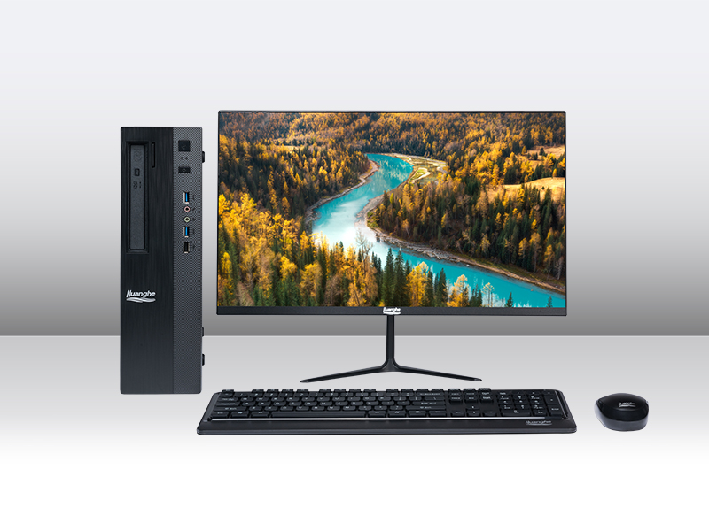
>
> :::

* 家用台式电脑的优点：
  * ① **性能稳定**：品牌台式机通常由专业技术人士配置，各个硬件搭配合理，经过多次专业检测，性能稳定，兼容性好。
  * ② **售后服务**：品牌台式机通常提供较好的售后服务，如：三年上门服务，这对于不熟悉电脑维修的用户来说是一个很大的优势。
  * ③ **定制化**：用户可以根据自己的需求和预算，选择不同的硬件配置，甚至在购买时进行定制，以满足特定的使用需求，如：游戏、视频编辑等。
  * ④ **升级方便**：台式机的主板通常预留有多个扩展插槽，方便用户日后升级硬件，如：增加内存、更换显卡等。
  * ⑤ **散热性能**：台式机由于体积较大，散热条件通常比笔记本电脑更好，有助于硬件长期稳定运行。
* 家用台式机电脑的缺点：
  * ① **价格**：品牌台式机由于品牌附加值和严格的品控，价格可能相对较高，尤其是国际知名品牌，如：联想、惠普、戴尔等。
  * ② **体积和便携性**：台式机体积较大，不便于搬运，缺乏笔记本电脑的便携性。
  * ③ **耗电量**：台式机尤其是高性能机型，耗电量可能较大，长时间使用会增加电费支出。
  * ④ **噪音问题**：由于散热需求，台式机可能需要使用风扇，这可能会产生一定的噪音，尤其是在高负载时。
  * ⑤ **组装成本**：如果用户选择自行组装台式机，虽然可以节省成本，但需要一定的电脑知识和组装技能，且可能面临兼容性和售后服务的问题。

> [!TIP]
>
> * ① 在选择家用台式电脑时，用户应根据自己的实际需求、预算以及对电脑知识的了解程度来决定购买品牌台式机还是自行组装。
> * ② 品牌台式机更适合对售后服务有较高要求、不太熟悉电脑硬件的用户，而自行组装则适合对电脑有一定了解、追求性价比和个性化配置的用户。

### 2.3.2 笔记本电脑

* `笔记本电脑`是一种`便携式计算机`，设计用于在不同地点使用。它们通常具有内置的显示屏、键盘和触摸板，以及可充电电池，使得用户可以在没有外部电源的情况下使用。

> [!NOTE]
>
> ::: details 点我查看 笔记本电脑
>
> 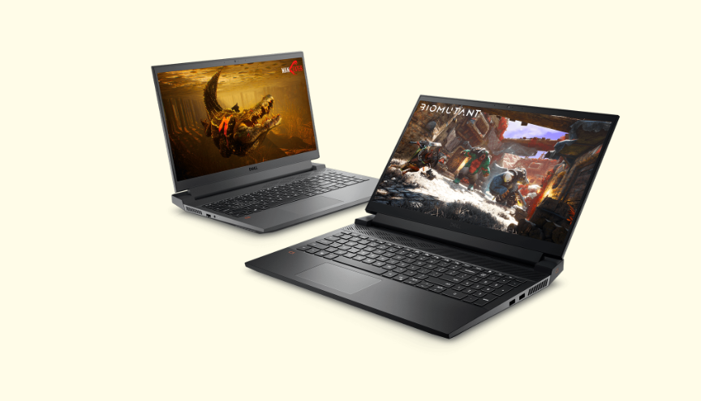
>
> :::

* 笔记本电脑的优点：
  * ① **便携性**：笔记本电脑的最大优点是便携，用户可以轻松地将其从一个地点移动到另一个地点，非常适合需要经常出差或在外工作的用户。
  * ② **一体化设计**：笔记本电脑集成了所有必要的硬件，如：CPU 、内存、硬盘、显示屏和电池，用户无需额外购买或连接外部设备即可使用。
  * ③ **低能耗**：由于设计紧凑，笔记本电脑通常具有较低的能耗，适合长时间使用而不必担心电池续航问题。
  * ④ **成套能力强**：笔记本电脑通常预装操作系统和必要的软件，用户开机即可使用，无需进行复杂的设置。
  * ⑤ **多样化选择**：市场上有各种品牌和型号的笔记本电脑，用户可以根据自己的需求选择不同的配置和设计。

* 笔记本电脑的缺点：
  * ① **性能限制**：由于体积和散热的限制，笔记本电脑的性能通常不如台式机，尤其是在高端游戏和专业级应用方面。
  * ② **升级困难**：笔记本电脑的硬件升级相对困难，许多组件如：CPU 和显卡，通常是焊接在主板上的，无法更换。
  * ③ **散热问题**：紧凑的设计可能导致散热不佳，长时间高负载运行可能会导致过热。
  * ④ **维修成本**：笔记本电脑的维修通常比台式机更昂贵，因为更换部件或修理可能需要专业工具和技术。
  * ⑤ **屏幕尺寸和分辨率**：虽然笔记本电脑的屏幕尺寸有多种选择，但通常无法与台式机的大屏幕和高分辨率显示器相比。

> [!TIP]
>
> * ① 在选择笔记本电脑时，用户应考虑自己的使用场景、性能需求、预算以及对便携性的需求。
> * ② 对于需要在外工作或学习的用户，笔记本电脑的便携性是一个重要的考虑因素；而对于追求高性能和大屏幕体验的用户，台式机可能是更好的选择。

## 2.4 服务器 

### 2.4.1 概述

* 服务器的概念：
  * 服务器是一种高性能的计算机系统，它被设计用来处理多个客户端的请求，提供数据、资源、服务和应用程序。
  * 服务器在网络环境中充当中心节点，支持各种业务流程和网络服务。
  * 与个人电脑（客户端）相比，服务器通常具有更高的性能、更强的稳定性和可靠性，以及更高级的网络连接能力。
  * 服务器在网络环境中扮演着核心角色，它们可以是物理服务器，也可以是虚拟服务器，运行在云计算环境中。

> [!NOTE]
>
> ::: details 点我查看 戴尔服务器
>
> 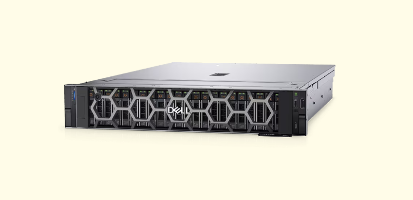
>
> :::

* 服务器的功能：
  * ① **数据管理**：存储、备份和恢复数据，确保数据的安全性和可靠性。
  * ② **网络服务**：提供网络连接、路由、防火墙、VPN 等网络相关服务。
  * ③ **应用托管**：运行各种应用程序，如：数据库、邮件服务器、Web服务器等，供客户端访问。
  * ④ **虚拟化**：通过虚拟化技术，可以在单个物理服务器上创建多个虚拟服务器（VM），每个 VM 都可以运行不同的操作系统和应用程序。
  * ⑤ **计算服务**：提供高性能计算资源，如：科学计算、数据分析、图形渲染等。
  * ⑥ **安全性**：提供安全服务，如：入侵检测、防病毒、访问控制等，保护网络和数据不受威胁。
  * ⑦ **远程访问**：允许用户通过远程桌面或其他远程访问工具，从任何地方连接到服务器。
  * ⑧ **负载均衡**：在多个服务器之间分配网络流量，提高系统的可用性和响应速度。
  * ……

> [!CAUTION]
>
> 服务器的配置和功能可以根据不同的业务需求进行定制，以满足特定的性能和可靠性要求。

### 2.4.2 服务器的尺寸

* `笔记本电脑`通常是按照`显示器屏的大小`来划分，如：14 英寸、16 英寸等。

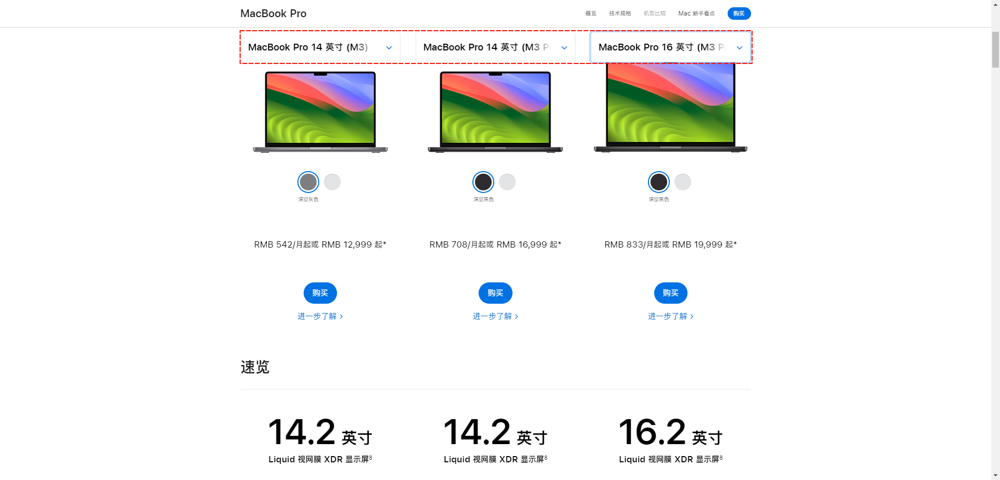

* 笔记本电脑的 `14` 英寸是按照`显示器屏`的`对角线长度`来计算的，并且 `1` 英寸是 `2.54` 厘米（cm），那么 14 英寸的笔记本电脑的`显示器屏`的`对角线长度`大约是 `14 * 2.54 cm = 35.56 cm`。

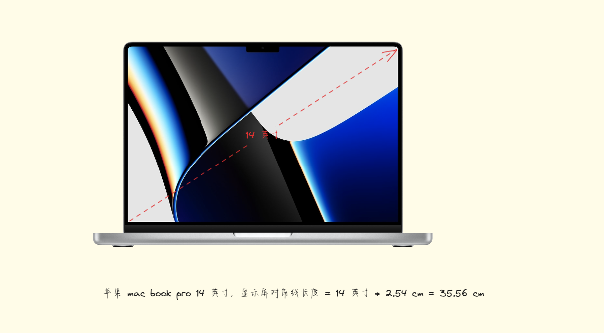

* 笔记本电脑的 `14 英寸`、`16 英寸`并不能直接反应实际屏幕的宽度和高度，因为屏幕的`宽高比`，如：`16:9` 、`16:10` 或 `4:3` 等，会`影响`实际的宽度和高度尺寸。

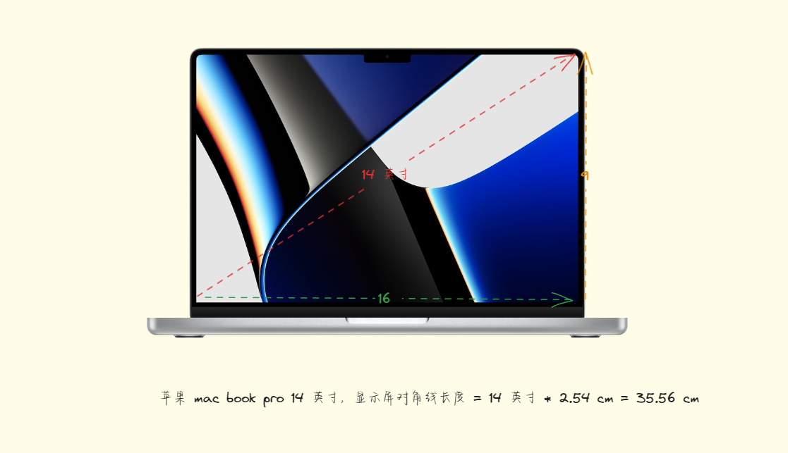

* 对于 `14` 英寸，宽高比是 `16:9` 的计算如下：

```
假设宽度使用 w 表示，高度使用 h 表示，对角线使用 d 表示，
根据勾股定理：
	w ^ 2 + h ^ 2 = d ^2
又因为对角线长度是 d = 14 * 2.54 cm = 35.56 cm，那么
	w ^ 2 + h ^ 2 = 35.56 ^2
又因为宽高比是 16:9 ，那么
   w : h = 16 : 9 => w = (16/9)h
那么，
  ((16/9)h) ^ 2 + h ^ 2 = 35.56 ^ 2
所以，h = 16.53 cm ，而 w = 25.41 cm  
```

* 对于 `14` 英寸，宽高比是 `4:3` 的计算如下：

```
假设宽度使用 w 表示，高度使用 h 表示，对角线使用 d 表示，
根据勾股定理：
	w ^ 2 + h ^ 2 = d ^2
又因为对角线长度是 d = 14 * 2.54 cm = 35.56 cm，那么
	w ^ 2 + h ^ 2 = 35.56 ^2
又因为宽高比是 4:3 ，那么
   w : h = 4 : 4 => w = (4/3)h
那么，
  ((4/3)h) ^ 2 + h ^ 2 = 35.56 ^ 2
所以，h = 15.65 cm ，而 w = 20.87 cm  
```

* 但是，对于`服务器`的`尺寸`，通常使用 `U` 来表示（1 U = 1.75 英寸 = 4.45 cm），这是根据美国电子工业协会（EIA）的标准来定义的，并且一般是用来`描述服务器的高度`，对于宽度则通常是 19 英寸（19 × 2.54 = 48.26 cm），这是机架式设备的通用宽度，也是机柜的标准尺寸。

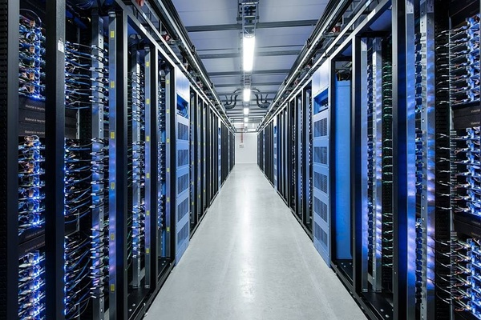

* 以下是一些常见的服务器尺寸：

  * **1U 服务器**：高度为 4.45 厘米（1.75 英寸），宽度为 19 英寸。1U 服务器体积较小，适合空间有限的环境，但扩展性有限。
  * **2U 服务器**：高度为 8.89 厘米（3.5 英寸），宽度为 19 英寸。2U 服务器提供了更多的空间来安装额外的硬件组件，如：更多的硬盘驱动器或扩展卡。
  * **4U 服务器**：高度为 17.78 厘米（7 英寸），宽度为 19 英寸。4U 服务器提供了大量的空间，适合需要大量存储或高性能计算的应用。

### 2.4.3 服务器的分类

#### 2.4.3.1 按照规模划分

* 计算机可以根据它们的大小、处理能力和存储容量被划分为不同的类别，主要的计算机类型包括：
  * ① 超级计算机（巨型计算机）：这是最强大的计算机类型，通常用于执行复杂的科学和工程计算，比如：天气预报、气候研究、分子建模等，它们能够处理大量的数据并执行高速计算，巨型计算机的运算速度可以达到每秒百万次以上。
  * ② 大型计算机：具有较高的运算速度，每秒可以执行几千万条指令，而且有较大的存储空间，主要用于大型企业的商业数据处理。它们能够处理大量的事务，如：银行系统、航空订票系统等。
  * ③ 小型计算机：采用精简指令集处理器，性能和价格介于大型计算机和微型计算机之间的一种高性能的 64 位的计算机。
  * ④ `微型计算机`（个人计算机，PC）：采用 x86 CPU 架构的计算机，中央处理器（CPU）采用微处理技术，体积小巧轻便，广泛用于商业、服务业、工厂的自动控制、办公自动化以及大众化的信息处理。
* 这些分类展示了计算机技术的广泛应用和多样化，不同类型的计算机根据其设计目的、性能需求和应用环境有着各自的特点。

> [!NOTE]
>
> 随着技术的发展，一些分类的界限可能变得模糊，比如：智能手机的计算能力已经超过了早期的个人电脑，而一些超级计算机的技术也被应用到了云计算领域，提供虚拟化的高性能计算资源。

#### 2.4.3.2 按照功能和角色划分

* 在`客户端-服务器模式`（Client-Server Model）中，计算机系统可以根据其承担的角色被划分为`客户端`和`服务器`两大类。

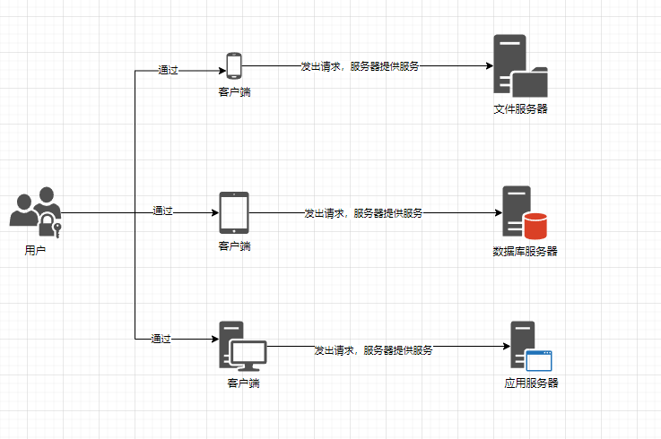

* 这种模式是网络计算中的一种基本架构，用于构建网络服务和应用程序。下面是客户端和服务器的特点和区别：

| 分类             | 特点                                                         | 用途                                                         |
| ---------------- | ------------------------------------------------------------ | ------------------------------------------------------------ |
| 服务器（Server） | ① 服务提供者：服务器是网络中提供各种服务的设备或软件，如：网页、数据、文件、邮件服务等。<br>② 强大的处理能力：服务器通常拥有较高的计算能力、大容量存储和高速的网络连接，以支持多用户或高并发访问。<br>③ 7×24 运行：服务器设计为长时间运行，以确保服务的持续可用。<br>④ 数据中心部署：为了保证可靠性和安全性，服务器通常部署在数据中心内，具有备份、冗余和故障转移等机制。 | ① 提供网页托管服务。<br>② 存储和管理数据库。<br>③ 执行应用程序服务。<br>④ 文件和打印服务。<br>⑤ 邮件服务。<br>⑥ 云计算资源提供。 |
| 客户端（Client） | ① 服务请求者：客户端是发起请求以接收服务器提供服务的设备或软件，如：浏览器、邮件客户端、数据库客户端软件等。<br>② 多样性和普及性：客户端设备既包括个人电脑、笔记本电脑，也包括移动设备，如：智能手机和平板电脑。<br>③ 用户交互：客户端软件通常提供图形用户界面，便于用户进行交云操作和获取服务。<br>④ 依赖网络连接：客户端设备需要通过网络连接到服务器，以请求和接收服务。 | ① 浏览互联网网页。<br>② 发送和接收电子邮件。<br>③ 访问云服务。<br>④ 数据输入和查询。<br>⑤ 媒体播放和娱乐。 |

> [!NOTE]
>
> * ① 在客户端-服务器模型中，客户端和服务器通过网络进行通信，客户端发送请求到服务器，服务器处理请求后将结果返回给客户端。这种模型支撑了绝大多数的网络应用，从简单的网页浏览到复杂的企业级应用系统。
> * ② 客户端和服务器的角色可以是物理上的不同设备，也可以是同一台设备上运行的不同软件进程。
> * ③ 服务器按照应用功能还可以划分为：WEB 服务器、数据库服务器、文件服务器、中间件服务器、日志服务器、监控服务器、程序代码版本控制服务器、虚拟机服务器、邮件服务器、打印服务器、域控制服务器、多媒体服务器、通讯服务器、ERP 服务器等。

#### 2.4.3.3 按照外形分类

* ① **塔式服务器**：外观类似于传统的台式电脑，但通常体积更大。适合小型企业或者那些对服务器数量需求不多的组织，因为它们不需要专门的机房环境。易于维护和升级，因为内部组件容易接触。
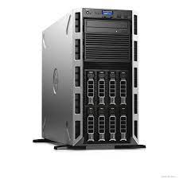
* ② **刀片式服务器**：更加紧凑的设计，将服务器压缩为插入机箱的薄片（刀片）。每个刀片可以包含一个或多个服务器，共享机箱内的电源、冷却等基础设施。高度密集的设计使得刀片服务器非常适合于需要大量计算能力但空间有限的环境。
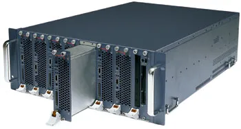
* ③ **机架式服务器（主流）**：设计为安装在标准尺寸的机架内，这些机架通常以单位高（U）来度量，1 U 等于 1.75 英寸的高度。可以有效地节省空间，通过将多台服务器垂直堆叠在一个机架中。适合需要集中管理和空间优化的数据中心或大型企业。
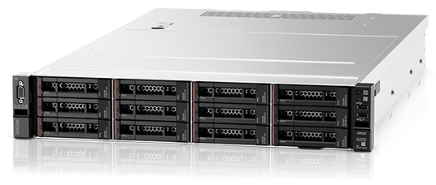

> [!IMPORTANT]
>
> 目前，还有一种服务器形式，就是**云服务器**。
>
> * ① 虽然云服务器不是一种物理形态的服务器，但它代表了一种重要的分类，即通过互联网提供的虚拟服务器资源。
> * ② 用户可以根据需要动态配置资源，包括：CPU、内存、存储空间等。
> * ③ 适合需要灵活性和可扩展性的应用，用户无需担心物理服务器的维护和升级。


# 第三章：计算机硬件介绍

## 3.1 个人计算机硬件

### 3.1.1 概述

* 个人计算机（Personal Computer，简称 PC）是为个人用户设计的计算机系统，它包括了一系列硬件组件，这些组件共同工作以执行各种计算任务。

### 3.1.2 个人计算机的主要硬件
* ① **中央处理器（CPU）**：CPU 是计算机的大脑，负责执行程序指令和处理数据。

> [!NOTE]
>
> ::: details 点我查看
>
> 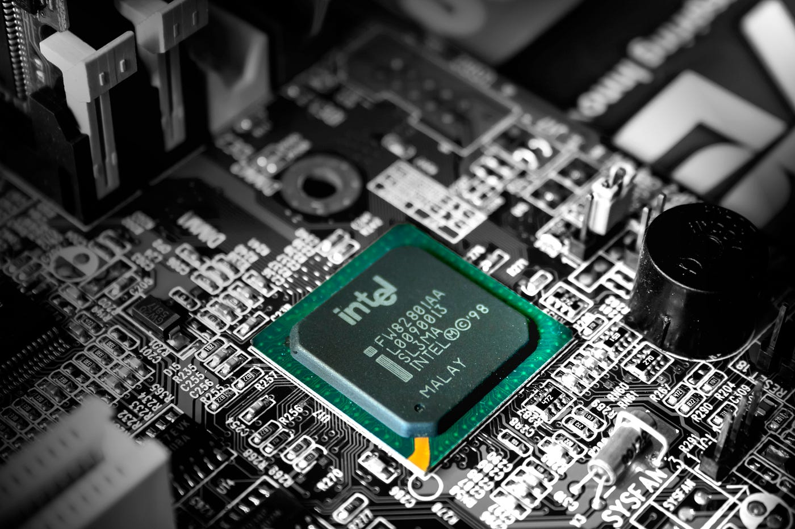
>
> :::

* ② **内存（RAM）**：内存是计算机的短期记忆，用于临时存储正在运行的程序和数据。

> [!NOTE]
>
> ::: details 点我查看
>
> 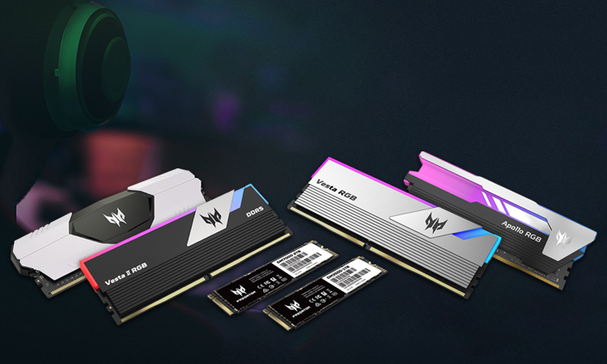
>
> :::

* ③ **硬盘驱动器（HDD）和固态驱动器（SSD）**：用于长期存储数据和程序。

> [!NOTE]
>
> ::: details 点我查看
>
> 
>
> :::

* ④ **主板（Mainboard）**：主板是连接和集成所有其他硬件组件的平台。

> [!NOTE]
>
> ::: details 点我查看
>
> 
>
> :::

* ⑤ **电源供应器（PSU）**：为计算机的各个组件提供稳定的电力。

> [!NOTE]
>
> ::: details 点我查看
>
> 
>
> :::

* ⑥ **显卡（GPU）**：处理视频输出，加速图形和图像处理。

> [!NOTE]
>
> ::: details 点我查看
>
> 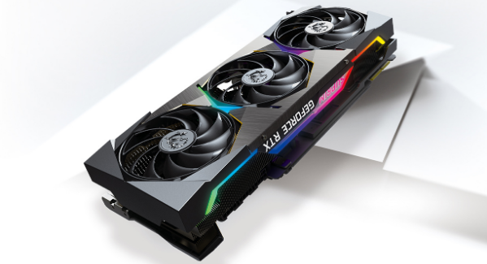
>
> :::

* ⑦ **外围设备**：显示器、键盘和鼠标、打印机以及外部存储设备等。

> [!NOTE]
>
> ::: details 点我查看
>
> * ① **显示器**：显示计算机生成的图像和视频。
>
> 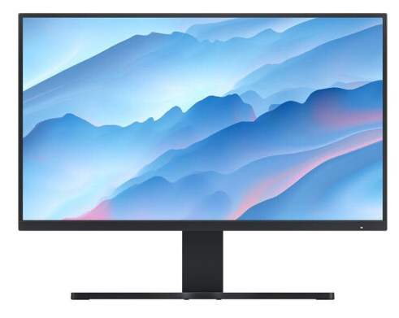
>
> * ② **键盘和鼠标**：用户输入设备。
>
> 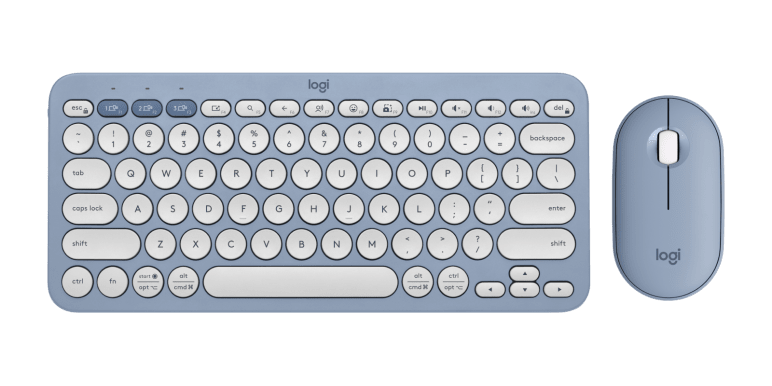
>
> * ③ **打印机**：打印文档和图像。
>
> 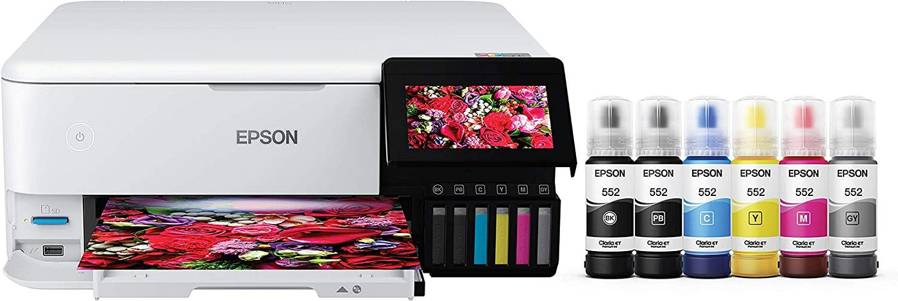
>
> * ④ **外部存储设备**：如：USB 闪存驱动器、外部硬盘（移动硬盘）等，用于数据传输和备份。
>
> 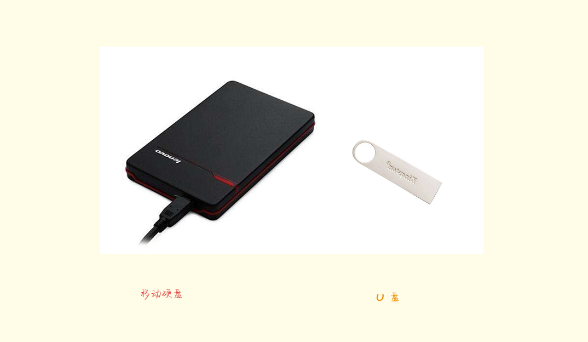
>
> * ⑤ **网络接口**：如：以太网卡、Wi-Fi 适配器，用于连接网络。
>
> 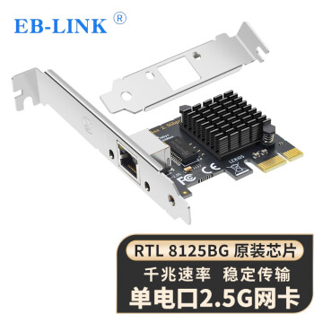
>
> :::

* ⑧ **散热系统**：保持硬件组件在适宜的温度下运行，防止过热。

> [!NOTE]
>
> ::: details 点我查看
> 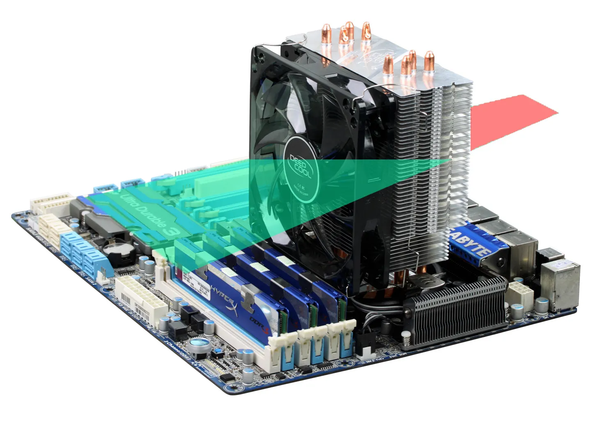
> :::

* ⑨ **声卡（Audio Card）**：处理音频信号，提供声音输出。

> [!NOTE]
>
> ::: details 点我查看
> 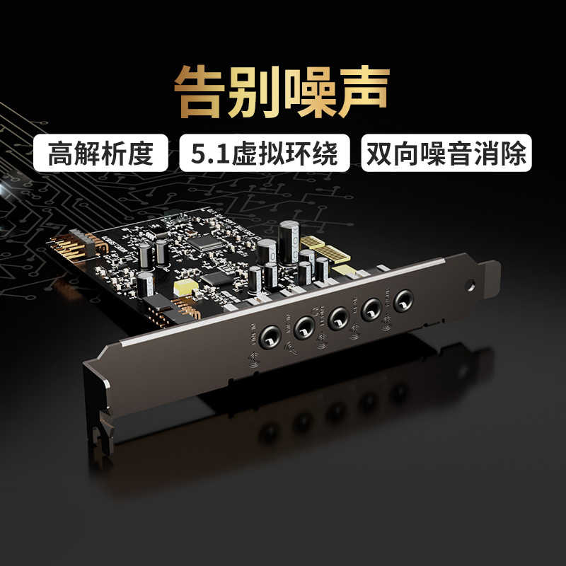
> :::

* ⑩ **外围接口**：通常都位于主板之上，如：USB（用于连接各种外部设备）、HDMI/DP（用于传输视频和音频信号到显示器）。

> [!IMPORTANT]
>
> * ① 这些硬件组件共同工作，使得计算机能够执行复杂的任务，从简单的文档编辑到复杂的图形渲染和数据处理。
> * ② 随着技术的发展，硬件的分类和功能也在不断演进。

## 3.2 服务器硬件

### 3.2.1 概述
* 服务器是设计用来处理大量数据和请求的高性能计算机，它们通常在网络环境中提供资源、服务和数据管理。

> [!NOTE]
>
> ::: details 点我查看 服务器的外观、内部结构以及产品参数
>
> * ① 服务器的外观：
>
> 
>
> * ② 服务器的内部结构：
>
> 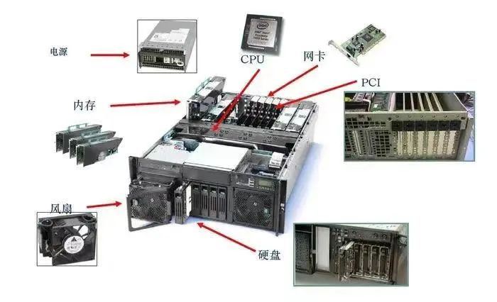
>
> * ③ 服务器的产品参数：
>
> 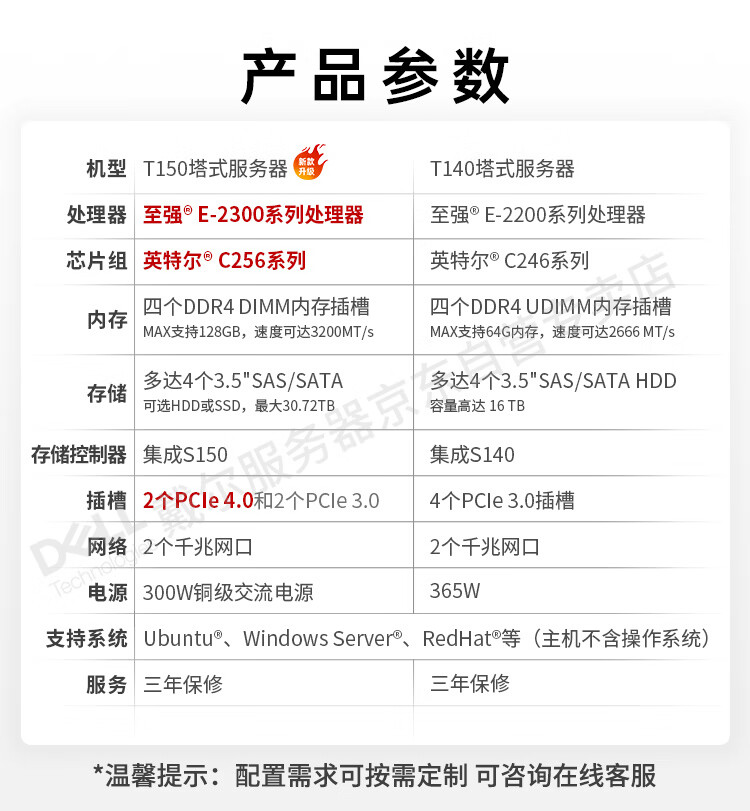
>
> :::


* 通常而言，服务器是没有鼠标、键盘、显示器等输入输出设备的，都是通过远程软件来控制服务器的。

### 3.2.2 服务器硬件（CPU）
#### 3.2.2.1 概述
* CPU（Central Processing Unit）：中央处理器，由控制器和运算器构成，是整个计算机系统中重要的组成部分。
  * 服务器的 CPU 通常比个人电脑的 CPU 更强大，能够处理更多的并发任务和更高的计算负载。
  * 它们可能包含多个核心，以支持多线程处理和更高的处理速度。
#### 3.2.2.2 按照指令集分类
* CISC（Complex Instruction Set Computer），复杂指令集。
  * **指令集的复杂性**：CISC 架构的 CPU 具有大量的指令，这些指令在功能上非常复杂，能够执行多步操作，如：内存访问、算术运算等，合并成单一的指令。
  * **硬件执行**：在 CISC 架构中，更多的逻辑被集成到硬件中，以减少程序执行所需的指令数。这意味着 CPU 可以直接执行更高级的操作，但这也使得 CPU 的设计变得更为复杂。
  * **优点**：由于指令能够完成更复杂的任务，因此在编写程序时可以使用更少的指令，减少了程序的大小并可能简化了软件开发。
  * **缺点**：复杂的指令集导致硬件设计复杂，指令的执行可能需要多个周期，影响了执行效率。
* RISC（Reduced Instruction Set Computer），精简指令集。
  * **指令集的简单性**：RISC架构的CPU指令集更小，指令功能简单，大多数指令在一个时钟周期内完成。这种设计注重于执行速度和效率。
  * **软件执行**：精简指令集要求更多的操作通过软件来实现，即编译器负责将高级操作转换为简单指令的序列。这要求更复杂的编译器设计。
  * **优点**：简单的指令集使得硬件设计更简单，指令的执行速度更快，提高了处理器的性能和能效比。
  * **缺点**：为了完成复杂的操作，可能需要更多的指令，这可能导致程序代码量增加。
> [!NOTE]
>
> * ① **CISC** 设计理念是通过复杂的指令集和硬件实现来简化软件开发，但以牺牲硬件设计的简单性和某些情况下的执行效率为代价。
> * ② **RISC** 通过简化指令集和优化硬件执行效率来提高性能和能效，但要求更复杂的软件（特别是编译器）设计来实现高级功能。
> * ③ 在实际应用中，现代 CPU 设计往往融合了 RISC 和 CISC 的特点，采用更灵活的设计理念来平衡性能、能效和编程的便利性。
#### 3.2.2.3 指令集的历史
* **CPU 的工作流程分为以下 5 个阶段：取指令、指令译码、执行指令、访存读取数据和结果写回。** 指令和数据统一存储在内存中，数据与指令需要从统一的存储空间中存取，经由共同的总线传输，无法并行读取数据和指令。这就是大名鼎鼎的冯·诺依曼体系结构。
> [!NOTE]
>
> CPU 运行程序会循环执行上述五个阶段，它既是程序指令的执行者，又被程序中相关的指令所驱动，最后实现了相关的计算功能，这些功能再组合成相应算法，然后由多种算法共同实现功能强大的软件。
* 如果 CPU 的指令集越丰富，每个指令完成的功能越多，为该 CPU 编写的程序就越容易，因为每一个简单或复杂的任务都有一条对应的指令，不需要软件开发人员编写大量的指令。所以，早期的计算机都是沿用 CISC 指令集的方式，是因为当时编写程序都是使用机器语言或编程语言，这些低级语言晦涩难懂，且容易出错。CISC 的典型代表就是 x86 体系架构，x86 CPU中包含大量复杂指令集，比如：串操作指令、循环控制指令、进程任务切换指令等，还有一些数据传输指令和数据运算指令，它们包含了丰富的内存寻址操作。有了这些指令，工程师们编写汇编程序的工作量大大降低。CISC的优势在于，用少量的指令就能实现非常多的功能，程序自身大小也会下降，减少内存空间的占用。但凡事有利就有弊，这些复杂指令集，包含的指令数量多而且功能复杂。而想实现这些复杂指令，离不开 CPU 运算单元和控制单元的电路，硬件工程师要想设计制造这样的电路，难度非常高。
> [!NOTE]
>
> * ① `CISC（复杂指令集计算）`主要应用于个人计算机领域和服务器领域，尤其是 x86体系（Intel、AMD、VIA等），沿用CISC架构。
> * ② x86 架构从 8 位发展到现在主流的 64 位，64 位技术最早由 AMD 公开，也有人称为 AMD64、x86-64 或 x64 。
* 到了 20 世纪 80 年代，各种高级编程语言的出现，大大简化了程序的开发难度。高级语言编写的代码所对应的语言编译器，很容易就能编译生成对应的 CPU 指令，而且它们生成的多条简单指令，跟原先 CICS 里复杂指令完成的功能等价。因此，那些功能多样的复杂指令光环逐渐黯淡，导致人们开始向 CISC 的反方向思考，由此产生了 RISC ——精简指令集计算机体系结构。
* RISC 设计方案非常简约，通常有 20 多条指令的简化指令集。每条指令长度固定，由专用的加载和储存指令用于访问内存，减少了内存寻址方式，大多数运算指令只能访问操作寄存器。并且，CPU 中配有大量的寄存器，这些指令选取的都是工程中使用频率最高的指令。由于指令长度一致，功能单一，操作依赖于寄存器，这些特性使得 CPU 指令预取、分支预测、指令流水线等部件的效能大大发挥，几乎一个时钟周期能执行多条指令。
* 这对 CPU 架构的设计和功能部件的实现也很友好。虽然完成某个功能要编写更多的指令，程序的大小也会适当增加，更占用内存。但是有了高级编程语言，再加上内存容量的扩充，这些已经不是问题。
> [!NOTE]
>
> * ① `RISC（精简指令集计算）`主要应用于智能手机和平板电脑。
> * ② `RISC（精简指令集计算）`的代表有 ARM、RISC-V、MIPS 等，ARM 架构特别流行，全世界超过 95% 的智能手机和平板电脑都采用 ARM 架构。
* 其实到了现在，RISC 与 CISC 早已没有明显界限，开始互相融合了，比如：ARM中加入越来越多的指令，x86 CPU 通过译码器把一条指令翻译成多条内部微码，相当于精简指令。x86 这种`外CISC内RISC` 的选择，正好说明了这一点。
> [!NOTE]
>
> * ① CISC 产生的背景是为了解决软件开发的难题：在当时普通使用机器语言或汇编语言，这些低级语言晦涩难懂，且容易出错，所以在设计 CPU 指令系统的时候为了方便开发人员，设计了大量功能复杂的指令。虽然减少了软件开发人员的工作量；但是，CPU 硬件电路设计非常复杂。
> * ② RISC 产生背景是因为编译器技术的成熟以及高级语言的诞生。RISC 简化了指令集，每条指令长度固定，功能这就是常说的芯片单一，用加载和储存指令访存，减少了内存寻减少软件开发人员的工作量 CPU：现代计算机的核址方式，运算指令只能访问寄存器。提升 CPU 效能，并有利于 CPU 架构设计和功能部件的实现。

#### 3.2.2.4 CPU 的类型
* 下面是当前市场上主流的 CPU 类型和代表产品，涉及从个人计算到服务器、嵌入式设备、高性能计算以及特定用途的处理器：

| 类型                            | 架构/品牌   | 代表产品或系列                                    |
| ------------------------------- | ----------- | ------------------------------------------------- |
| 通用桌面和服务器 CPU            | Intel (x86) | Core 系列、Xeon 系列                              |
|                                 | AMD (x86)   | Ryzen 系列、EPYC 系列                             |
| 移动和嵌入式 CPU                | ARM         | Apple A 系列、Samsung Exynos、Qualcomm Snapdragon |
| 高性能计算（HPC）和人工智能 CPU | IBM POWER   | POWER9、POWER10                                   |
|                                 | Nvidia      | Grace CPU                                         |
| 开源硬件指令集CPU               | RISC-V      | 各种基于 RISC-V 架构的实现                        |
> [!NOTE]
>
> * ① 随着技术的进步和市场的变化，新的产品和技术会不断出现。
> * ② 除了传统的 CPU 外，为了满足特定应用需求，如：人工智能、深度学习、大数据分析等，越来越多的专用加速器和协处理器被开发出来，这些设备往往在其专长领域内提供了比通用 CPU 更高的性能。

#### 3.2.2.5 CPU 的相关参数

* 在 win 系统中，我们可以查看 CPU 的相关参数：
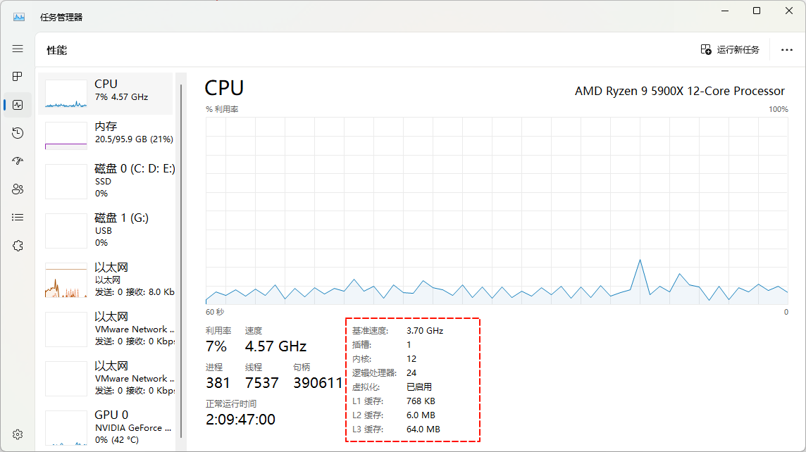
* 其实，对于 CPU 有如下的参数：
* ① `主频`（CPU Clock Speed）：主频是 CPU 内部逻辑电路运行的时钟频率，以 Hz（赫兹）为单位。主频越高，CPU 处理数据的速度通常越快。但由于不同 CPU 的效率（每个周期内能完成的工作量）不同，所以仅凭主频高低并不能完全判断 CPU 的性能。类似于工厂的工作速度，即一定时间内可以完成的工作量。
* ② `外频`（Base Clock）：外频是系统总线的工作频率，决定了 CPU 与主板上其它组件（如：内存）交换数据的基础速度。类似于原材料进厂的速度，即原材料到达工厂的频率。
* ③ `倍频`（Multiplier）：倍频是 CPU 的主频与外频之间的比值。CPU 的实际运行频率（主频）是通过将外部频率（外频）乘以一个固定的数字（倍频）来获得的。类似于将原材料进厂速度转化为实际生产速度的比例。
* ④ `高速缓存`（Cache）：高速缓存是 CPU 内部的小容量但非常快速的存储器，用于临时存储 CPU 即将使用的数据和指令。L1、L2、L3 表示不同级别的缓存，级别越低，速度越快、容量越小、距离 CPU 核心越近。类似于工厂内部的原材料仓库。
* ⑤ `内存总线速度`（Memory-Bus Speed）：内存总线速度通常等同于 CPU 的外频，指的是 CPU 与二级高速缓存（L2 Cache）和内存（RAM）之间的通信速度。类似于原材料输送带的速度。
* ⑥ `地址总线宽度`：地址总线宽度决定了 CPU 可以访问的物理地址空间的大小。地址总线宽度越大，CPU 可以直接访问的内存空间就越大。类似于工厂大门的宽度。
> [!TIP]
>
> * ① 对于普通用户来说，直接查看 CPU 的主频就足够了。
> * ② 如果需要更详细的 CPU 外频等高级参数，推荐使用专业的硬件检测工具，如：CPU-Z。

### 3.2.3 服务器硬件（主板）
* 主板（mainboard），安装在机箱内，是计算机最基本的也是最重要的部件之一。
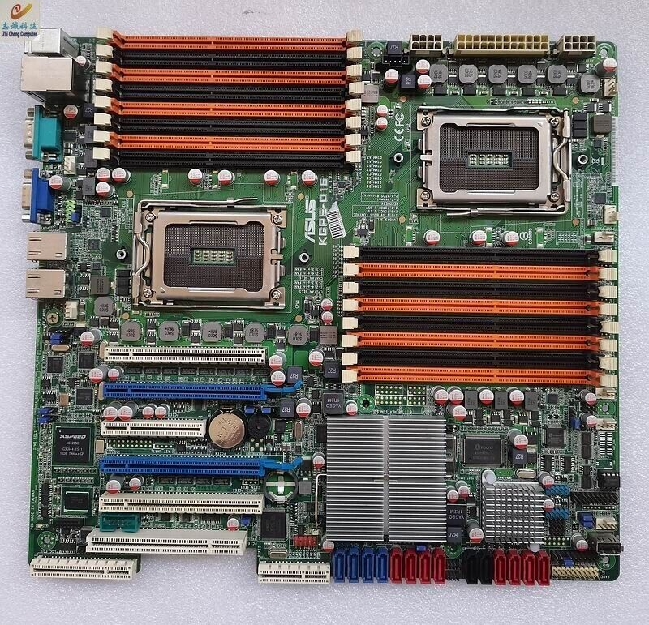
* 主板一般为矩形电路板，上面安装了组成计算机的主要电路系统，一般有 BIOS 芯片、I/O 控制芯片、键盘和面板控制开关接口、指示灯插接件、扩充插槽、主板及插卡的直流电源供电接插件等元件。
### 3.2.4 服务器硬件（内存）
#### 3.2.4.1 概述
* 冯·诺依曼体系结构中的`存储设备`，在现代计算机中分为`内部存储器`和`外部存储器`。通常而言，`内部存储器`我们会称为`内存`。而所谓的`外部存储器`，就是我们经常所使用到的硬盘、U 盘等，也有人称为`外存`。
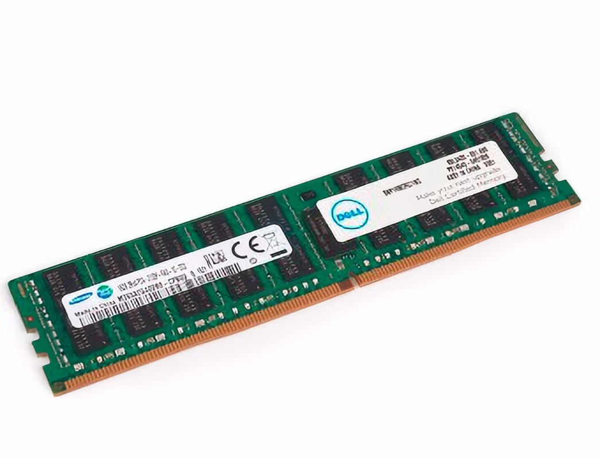
* 内存是介于 CPU 和外部存储之间，是 CPU 对外部存储中程序与数据进行高速运算时存放程序指令、数据和中间结果的临时场所，它的物理实质就是一组具备数据输入输出和数据存储功能的高速集成电路。
* 内存是 CPU 能直接寻址的存储空间，由半导体器件制成。
* 内存的特点是存取数据的速度快。计算机中所有程序的运行都是在内存中进行的，因此内存的性能对计算机的影响非常大。

> [!IMPORTANT]
>
> 内存和外部存储设备的区别：
>
> * ① 内存的取数据的速度快，而外部存储设备的取数据的速度慢。
> * ② 内存断电后数据会丢失，而外部存储设备断电后数据不会丢失。

#### 3.2.4.2 服务器常用内存管理技术

* `在线备用内存技术`（Online Spare Memory）和`内存镜像`（Memory Mirroring）是服务器内存管理中非常关键的高可用性技术，特别是在那些对数据准确性和系统稳定性有着严格要求的环境中。
* 这两种技术通过不同的方式提高了服务器在面对硬件故障时的容错能力：
  * `在线备用内存技术`（Online Spare Memory）：在线备用内存技术涉及保留一部分内存作为“备用”，不用于正常的数据存储或处理。当系统检测到主内存模块中的一个出现错误时，系统会自动将出错的内存模块中的数据转移到这些备用内存模块中，从而无缝地替换掉有问题的模块，保证系统的持续运行。这种方式特别适合那些不能承受任何计划外停机时间的关键任务应用。
  * `内存镜像`（Memory Mirroring）：内存镜像类似于硬盘的 RAID 1 技术。它将内存分成两个相等的部分，其中一个部分作为另一个部分的镜像。所有写入内存的数据都会同时写入这两个部分。如果其中一个部分发生故障，系统会自动切换到另一个部分继续运行，而不会影响系统的稳定性和数据的完整性。这种技术通过牺牲一半的内存容量来提高系统的可靠性。
* 在线备用内存技术和内存镜像的优缺点比较：

| 服务器内存管理技术 | 在线备用内存技术（Online Spare Memory）                      | 内存镜像（Memory Mirroring）                                 |
| ------------------ | ------------------------------------------------------------ | ------------------------------------------------------------ |
| 优点               | 不会牺牲可用内存的容量，因为只有在检测到错误时，备用内存才会被使用。 | 通过实时复制数据到两个内存模块来提供即时的数据保护，这意味着在任何一个内存模块出现问题时，都可以无缝切换到另一个模块，几乎没有数据丢失的风险。 |
| 缺点               | 一旦需要使用备用内存，原有出错的内存模块中的数据可能已经无法使用。 | 牺牲了一半的内存容量来实现冗余。                             |

> [!NOTE]
>
> * ① 上述两种技术各有优劣，通常会根据具体的应用需求和成本效益考虑来选择适合的内存管理策略。
> * ② 在高可用性和数据敏感性极高的场景下，这些技术提供了额外的安全网，以保障系统的连续运行和数据的完整性。

#### 3.2.4.3 内存的相关参数

* `内存带宽`是指内存系统在单位时间内传输数据的能力，它通常以每秒可以传输的数据量来衡量，如：GB/s（千兆字节每秒）。内存带宽是评估和比较不同内存和计算系统性能的一个重要指标。这个参数对于需要大量数据快速读写的应用程序来说尤为重要，比如：大规模数据处理、高性能计算（HPC）、视频编辑和游戏。

> [!NOTE]
>
> * ① 高的内存带宽意味着系统可以更快地处理和交换数据，这对于提高处理器的工作效率非常关键。如果内存带宽不足，即使 CPU 很强大，也可能因为等待数据而浪费处理能力，这种现象称为“内存瓶颈”。
> * ② 内存带宽的大小受多种因素影响，包括内存的类型（如：DDR4、DDR5）、内存总线宽度、时钟频率以及是否采用多通道内存配置等。

* 内存带宽的计算公式是：

```txt
内存带宽 = 内存总线频率 × 数据总线位数 ÷ 8
```

- 公式参数：
  - **内存总线频率**：这是指内存总线每秒钟能够进行数据传输的次数，通常以 MHz（兆赫兹）或 GHz（吉赫兹）为单位。总线频率越高，单位时间内能够进行的数据传输次数就越多。
  - **数据总线位数**：这指的是内存与 CPU 之间的数据总线的宽度，即每次数据传输能够并行传送的位数。通常，这个数值是 64 位或更高，这取决于内存模块和主板的设计。

- 现代计算机系统常使用`多通道`内存技术来提高内存带宽。在双通道配置中，有两条内存总线并行工作，这意味着系统可以同时访问两个内存模块。这种并行操作实际上使得每个时钟周期内的数据传输量加倍。

> [!NOTE]
>
> * ① 目前，家用级（消费级）主板基本只支持双通道，而服务器或工作站的主板才会支持四通道内存。
> * ② 如果是双通道内存的内存带宽就需要再 × 2 ，即 内存带宽 = 内存总线频率 × 数据总线位数 ÷ 8 × 2 。

* 对于家用级（消费级）主板而言，如果依次从左到右给它们编号，如下所示：


* 其中，`槽1` 和 `槽2` 是一个通道，`槽3` 和 `槽4` 是一个通道；所以，通常是这么建议的：
  * 如果只有 1 根内存条，就插到 `槽2` 中。
  * 如果有 2 根内存条，就分别插入到 `槽2` 和 `槽4` 中。
  * 如果有 4 根内存条，就全插满即可。

> [!NOTE]
>
> 组成双通道配置的内存条需要遵循一些基本要求来确保它们能够正常以双通道模式运行：
>
> * ① **相同容量**：理想情况下，组成双通道的内存条应该具有相同的容量。这样可以确保它们在处理数据时的一致性和兼容性。
> * ② **匹配的速度规格**：内存条应该具有相同的速度规格，即它们的频率（如：DDR4-2400、DDR4-3200等）应该相同。不同速度的内存条可以一起工作，但系统会以所有内存条中最慢的那个的速度运行。
> * ③ **相同的时序**：内存条的时序（如：CL16-18-18-38）应该匹配。时序参数影响内存的响应速度和稳定性，不匹配的时序可能会降低性能或导致系统不稳定。
> * ④ **相同的制造商和型号**（推荐）：虽然不是强制性要求，但选择相同制造商和型号的内存条可以最大限度地减少兼容性问题。不同制造商的内存条可能在微小的规格和性能上有差异，这有可能影响双通道配置的效能。

* 如果一个单通道的 DDR4-4000 的内存带宽，就是这么计算的：

```txt
DDR4-4000 的内存带宽 = 4000 MHz × 64 bit ÷ 8 = 32000 MB/s
```

* 如果一个单通道的 DDR4-4000 的内存带宽，就是这么计算的：

```txt
DDR4-3600 的内存带宽 = 4000 MHz × 64 bit ÷ 8 = 32000 MB/s
```

* 如果一个双通道的 DDR4-4000 的内存带宽，就是这么计算的：

```
DDR4-4000 的内存带宽 = 4000 MHz × 64 bit ÷ 8 × 2 = 64000 MB/s
```

### 3.2.5 服务器硬件（硬盘）

#### 3.2.5.1 概述

* 硬盘主要用于长期存储数据和程序

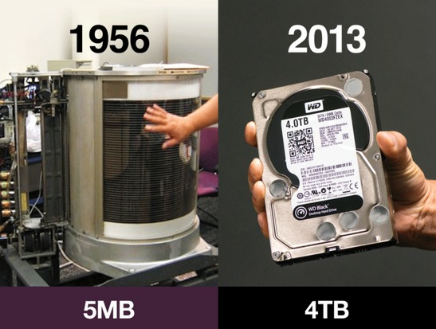

#### 3.2.5.2 常见的硬盘接口类型

* ① `IDE`：Integrated Drive Electronics，电子集成驱动器，早期家用电脑常用接口，已淘汰。
* ② `SCSI`：Small Computer System Interface，小型计算机系统接口，早期服务器接口。
* ③ `SATA`：Serial Advanced Technology Attachment，Serial ATA，串行 ATA，主要用于个人电脑和一些服务器上的 HDD（硬盘驱动器）和 SSD（固态驱动器）。
* ④ `SAS`：Serial Attached SCSI，SAS 是一种更高端的接口，常用于服务器和专业存储设备。它支持更高的数据传输速率和更多的硬盘连接，提供了比 SATA 更好的性能和可靠性。
* ⑤ `PCIe` ：PCIe 不是传统意义上专用于硬盘的接口，但它是连接现代 NVMe（Non-Volatile Memory Express）SSD 的标准。NVMe SSD 通过 PCIe 接口连接，提供比 SATA 和 SAS 更高的数据传输速率和更低的延迟。
* ⑥ `M.2` ：M.2 是一种小型化的接口规格，支持 SATA 和 PCIe/NVMe 连接。M.2 接口的硬盘通常用于笔记本电脑、小型电脑和一些高端台式机中，因其小尺寸和灵活性而受到青睐。

#### 3.2.5.3 硬盘结构

* 硬盘的结构主要有`机械硬盘（HDD）`和`固态硬盘（SSD）`两种。
* 其中，机械硬盘（HDD）是一种带有机械马达结构的存储装置，主要带有马达、盘片、磁头、缓存。


* 机械硬盘的基本参数如下：

| 参数           | 描述                                                         |
| -------------- | ------------------------------------------------------------ |
| 容量           | 硬盘最主要的参数。单位有 MB、GB、TB，常见容量：500GB，1TB，2TB，3TB，4TB，6TB |
| 转速           | 指硬盘盘片每分钟转动的圈数，单位为 rpm。常见：7200rpm，10000rpm，15000rpm |
| 传输速率       | 硬盘的数据传输率是指硬盘读写数据的速度，单位为兆字节每秒（MB/s），常见：6 Gb/s，12Gb/s |
| 缓存           | 硬盘缓存的目的是为了解决系统前后级读写速度不匹配的问题，以提高硬盘的读写速度 |
| 磁盘尺寸       | 3.5、2.5                                                     |
| 是否支持热插拔 | 是/否                                                        |

* 其中，固态硬盘（SSD）是一种不带有机械马达结构的存储装置，主要带有闪存、主控芯片、缓存。

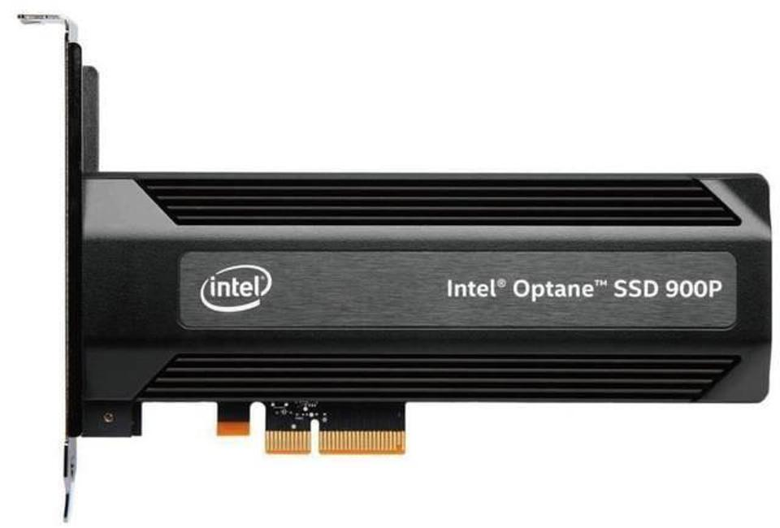

* 固态硬盘的基本参数如下：

| 参数名称     | 描述                                                         |
| ------------ | ------------------------------------------------------------ |
| 容量         | SSD 的存储容量，通常以 GB 或 TB 为单位，直接决定了可以存储多少数据。 |
| 读写速度     | SSD 读取和写入数据的速度，通常以 MB/s（兆字节每秒）或 GB/s（吉字节每秒）为单位，是衡量 SSD 性能的重要指标。读速度通常比写速度快。 |
| 接口类型     | SSD 与电脑或其他设备连接的接口类型，常见的有 SATA、PCIe、NVMe 等。其中，SATA 是较早的接口标准，速度较慢；PCIe 是较新的接口标准，提供更高的传输速度；NVMe 是在 PCIe 基础上的一种协议，进一步提高了速度。 |
| IOPS         | 输入/输出操作每秒（Input/Output Operations Per Second），这是衡量 SSD 性能的另一项重要指标，尤其是在高负载工作负载下。它表示 SSD 每秒可以完成多少个读写操作。 |
| NAND类型     | SSD 使用的存储技术类型，常见的有 TLC（三层单元）、MLC（多层单元）、SLC（单层单元）等，影响到 SSD 的耐用性、速度和成本。 |
| 耐用性/寿命  | 通常以 TBW（Total Bytes Written，总写入字节数）或 DWPD（Drive Writes Per Day，每日驱动器写入次数）表示，表示 SSD 可以写入数据的总量，是衡量 SSD 耐用性的一个重要指标。 |
| 缓存         | SSD 中的缓存可以暂时存储数据，以提高读写速度。有的 SSD 使用 DRAM 缓存，而有的使用更快的 NVRAM 或其他类型的缓存。 |
| 电源失效保护 | 一些高端 SSD 提供电源失效保护功能，以防在突然断电的情况下数据丢失。 |
| 尺寸和形状   | SSD 的物理尺寸和形状，常见的有 2.5 英寸、M.2、U.2 等，影响到 SSD 安装的兼容性。 |
| 温度控制     | 为了维持性能和延长寿命，一些 SSD 内置了温度控制功能，如散煤、温度监控和调节技术。 |

### 3.2.6 服务器硬件（网卡）

* 服务器都在主板上集成了网卡，传输速率为 1 Gbps，即千兆网卡。

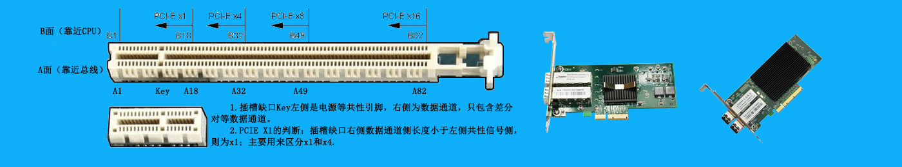

* 特殊应用需要高端网卡，如：光纤网卡，Infiniband 网卡等，传输速率能达到 10Gbps、20Gbps，即万兆网卡。

### 3.2.7 服务器硬件（其它）

#### 3.2.7.1 阵列卡

* 服务器硬件阵列卡，也称为 RAID 控制器卡，是一种用于管理多个硬盘驱动器（HDDs）或固态驱动器（SSDs）的设备，以提供数据冗余、性能提升或两者兼得。RAID（独立磁盘冗余阵列）通过将多个磁盘组合成单一的逻辑单元来工作，提高了数据的可靠性和访问速度。

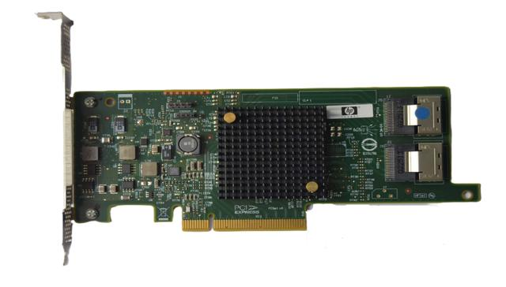

* 不同的 RAID 级别提供不同的性能和冗余水平。常见的 RAID 级别包括 RAID 0（条带化，提高性能）、RAID 1（镜像，提高数据安全）、RAID 5（条带化带奇偶校验，平衡性能和数据安全）、RAID 6（双奇偶校验，更高的数据安全）等。
* 硬件 RAID 依赖于阵列卡的物理组件来执行 RAID 操作，而软件 RAID 依靠服务器的 CPU 和操作系统来处理。硬件 RAID 通常提供更好的性能和更多的功能。
* 大多数阵列卡配备了管理软件，允许管理员配置 RAID 数组、监控阵列状态和执行维护任务。
* 阵列卡必须与服务器的操作系统兼容，以确保软件和硬件的正常交互。

#### 3.2.7.2 电源

* 服务器的电源是至关重要的硬件组件之一，它为服务器的所有部件提供稳定、可靠的电力支持。

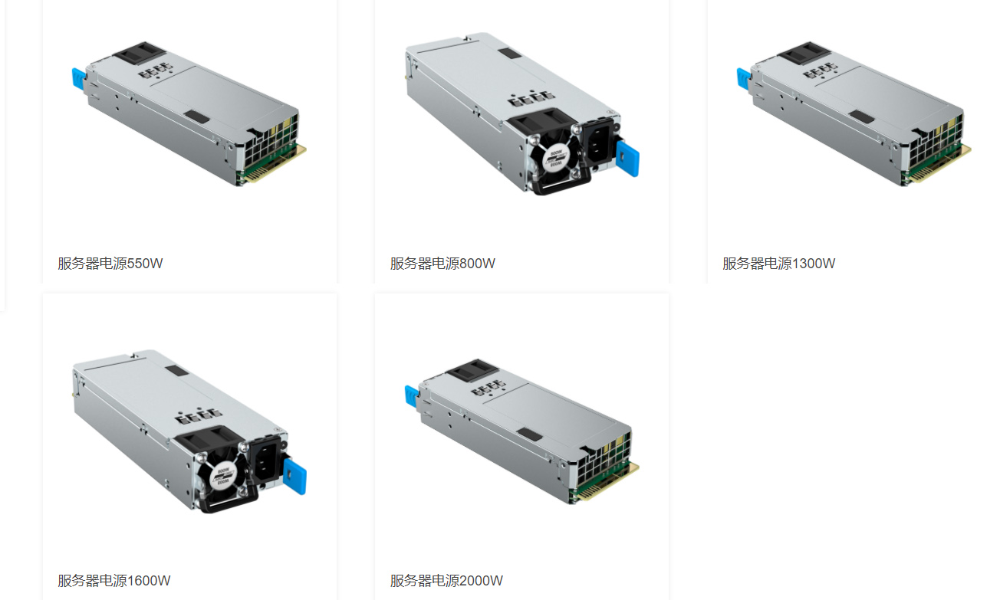

* 服务器电源不仅需要满足高效率的要求，还需具备足够的功率输出以支持服务器运行，同时在设计上考虑到冗余、可管理性等特点，以确保系统的高可用性和稳定性。

#### 3.2.7.3 显卡

* 服务器都在主板上集成了显卡，但是显存容量不高，一般为 16 M 或 32 M。

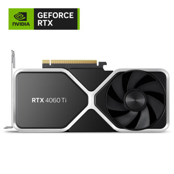

* 不同于用于游戏或图形设计的个人电脑显卡，服务器显卡更多地被设计用于专业计算、图形处理、视频渲染、虚拟化环境以及AI 和机器学习任务等高性能计算需求。

#### 3.2.7.4 热插拔技术

* 热插拔技术，称为热交换技术（Hot Swap），允许在不关机的状态下更换故障热插拔设备，常见的热插拔设备：硬盘，电源，PCI 设备，风扇等。
* 热插拔硬盘技术与 RAID 技术配合起来，可以使服务器在不关机的状态下恢复故障硬盘上的数据，同时并不影响网络用户对数据的使用。

#### 3.2.7.5 机柜

* 机架式服务器通常放置在机柜中，通常使用的机柜是 42 U（约 2 米高）机柜（ 1U=44.45mm）。

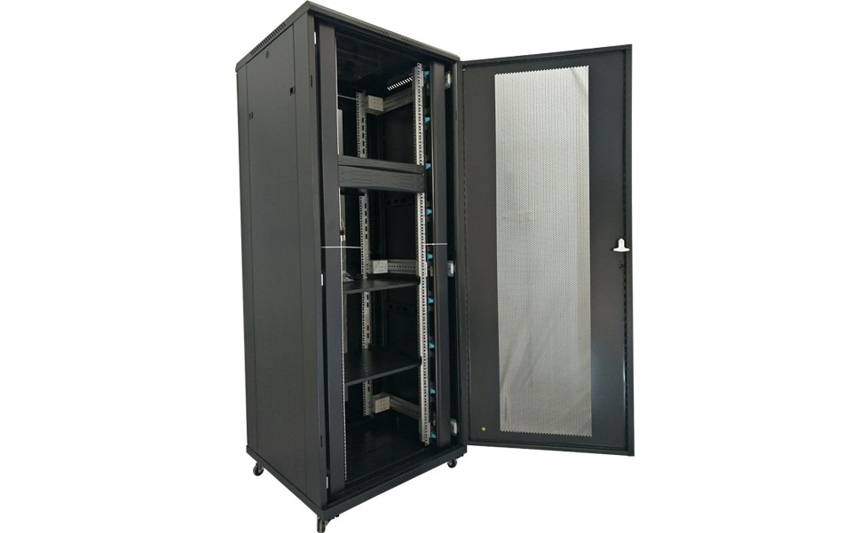

* 在一个机架上，累计设备 U 数一般不超过 26U，全 1U 设备部署数量一般不超过 16 台，全 2U 设备一般不超过 12 台，全 4U 设备一般 4 - 7 台。

### 3.2.8 各种硬件处理速度和性能优化

* 服务器的性能短板：如果 CPU 有每秒处理 1000 个服务请求的能力，各种总线的负载能力能达到 500 个， 但网卡只能接受 200个请求，而硬盘只能负担 150 个的话，那这台服务器得处理能力只能是 150 个请求/ 秒，有 85% 的处理器计算能力浪费了，在计算机系统当中，`硬盘`的读写速率已经成为影响系统性能进一 步提高的瓶颈。

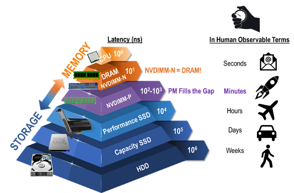

* 计算机的各个设备部件的延迟从高到低的排列，依次是机械硬盘（HDD）、固态硬盘（SSD）、内存、CPU 。

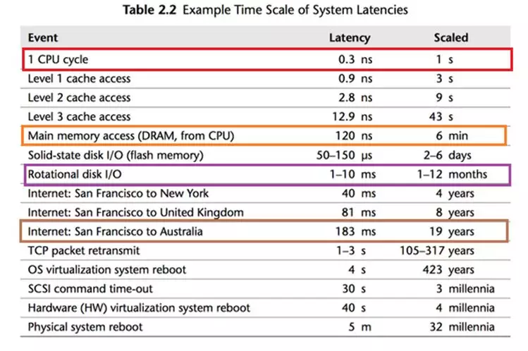

* 从上图中，我们可以知道，CPU 是最快的，一个时钟周期是 0.3 ns ，内存访问需要 120 ns ，固态硬盘访问需要 50-150 us，传统的硬盘访问需要 1-10 ms，而网络访问是最慢，需要 40 ms 以上。
* 时间的单位换算如下：

```txt
1 秒 = 1000 毫秒，即 1 s = 1000 ms。
1 毫秒 = 1000 微妙，即 1 ms = 1000 us 。
1 微妙 = 1000 纳秒，即 1 us = 1000 ns。
```

* 按照上图，将计算机世界的时间和人类世界的时间进行对比，即：

```txt
如果 CPU 的时钟周期按照 1 秒计算，
那么，内存访问就需要 6 分钟；
那么，固态硬盘就需要 2-6 天；
那么，传统硬盘就需要 1-12 个月；
那么，网络访问就需要 4 年以上。
```

* 所以，对于 CPU 来说，这个世界真的是太慢了！！！
* 其实，中国古代中的文人，通常以`蜉蝣`来表示时间的短暂（和其他生物的寿命比），也是类似的道理，即；

```txt
鹤寿千岁，以极其游，蜉蝣朝生而暮死，尽其乐，盖其旦暮为期，远不过三日尔。
	                                        --- 出自 西汉淮南王刘安《淮南子》
```

```txt
寄蜉蝣于天地，渺沧海之一粟。 哀吾生之须臾，羡长江之无穷。 
挟飞仙以遨游，抱明月而长终。 知不可乎骤得，托遗响于悲风。
	                                        --- 出自 苏轼《赤壁赋》
```

>  [!NOTE]
>
>  对于`蜉蝣`来说，从早到晚就是一生；而对于我们`人类`而言，却仅仅只是一天。

* 存储器的层次结构（CPU 中也有存储器，即：寄存器、高速缓存 L1、L2 和 L3），如下所示：

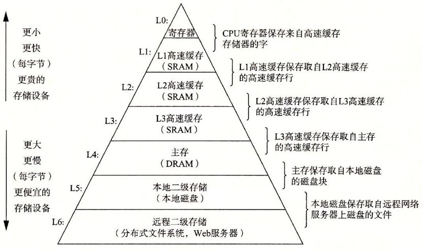

> [!NOTE]
>
> 上图以层次化的方式，展示了价格信息，揭示了一个真理，即：鱼和熊掌不可兼得。
>
> * ① 存储器越往上速度越快，但是价格越来越贵， 越往下速度越慢，但是价格越来越便宜。
> * ② 正是由于计算机各个部件的速度不同，容量不同，价格不同，导致了计算机系统/编程中的各种问题以及相应的解决方案。

### 3.2.9 并发和多线程

* 在现代计算机系统中，由于 CPU 的处理速度非常快，我们希望尽可能地利用这种处理能力，而不是让它处于空闲状态。为了实现这一目标，我们采取了一些关键策略：

  * ① **`并发执行`**：鉴于人们希望多个程序能够`“同时”`运行，操作系统通过将 CPU 时间分片并轮流分配给各个程序来实现这一目标。这种方法使得各个程序看似同时在 CPU 上执行，实际上是 CPU 在这些程序之间快速切换，创建了`并发执行`的`假象`。这种时间分片机制允许多个任务交替使用 CPU ，从宏观上提高了 CPU 的使用效率和系统的响应速度。

  

  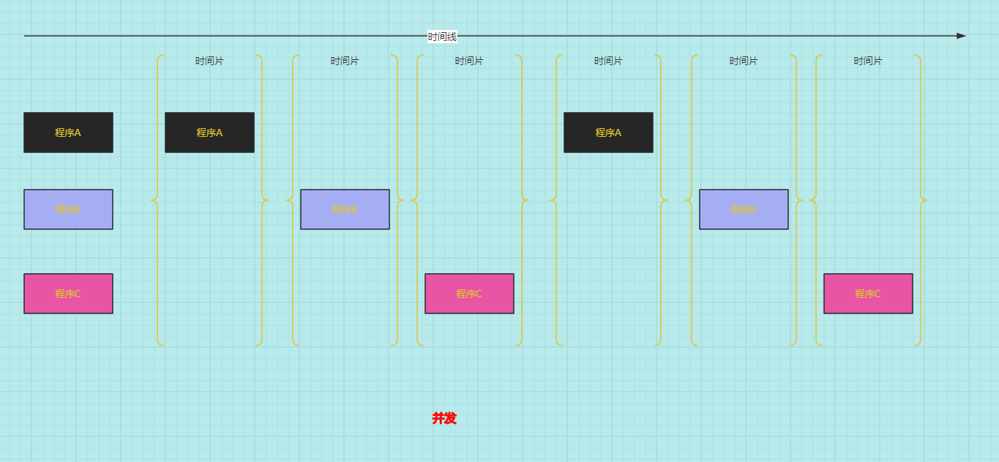

  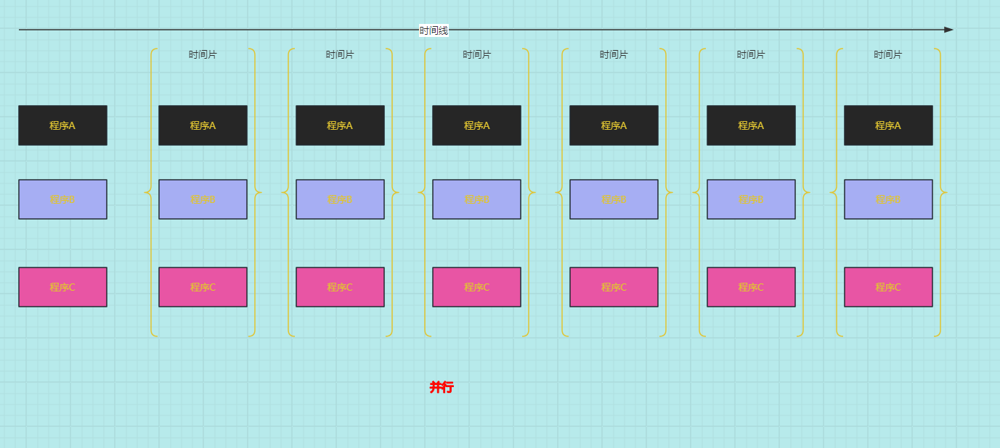

  * ② **`高效处理 I/O 操作`**：当 CPU 遇到 IO 操作（硬盘读写、网络数据传输）的时候，这些操作的响应时间远远超过CPU处理指令的速度，CPU 在此期间无需等待（不能坐在那里`干等“几个月”`，甚至`“几年”的时间`（从 CPU 的角度来看）），而是可以切换去执行其他程序。这种策略避免了 CPU 在 I/O 等待期间的空闲，进一步提升了系统的整体效率。

* 为了实现上述策略并管理复杂的任务，操作系统引入了 **`进程`** 和 **`线程`** 这两个关键概念：

  - **`进程`**：进程是程序执行和资源分配的基本单位，它为程序提供了必要的执行环境（包括代码、数据以及分配给它的系统资源）。当程序需要切换时，操作系统保存当前进程的状态（即执行现场），以便之后可以恢复执行。这个状态保存和恢复的过程需要通过一个定义良好的数据结构（即：进程控制块 PCB）来完成，这就是进程的数据结构表示。
  - **`线程`**：为了避免单一执行流（线程）的进程在等待 I/O 操作时整个进程被阻塞，无法响应其他任务（如：用户输入），操作系统允许进程内部拥有多个执行流，即`多线程`。线程共享进程的资源和环境，但每个线程可以独立执行不同的任务。这意味着，即使一个线程因为 I/O 操作而阻塞，其他线程仍然可以继续执行，从而提高了程序的响应性和效率。

* 总之，通过`并发执行`和`有效的 I/O 处理`策略，操作系统最大限度地利用了 CPU 的处理能力，同时通过进程和线程的引入，有效地管理了资源分配和任务执行，保证了系统的高效运行和良好的用户响应，这些机制共同构成了现代操作系统管理和调度任务的基础。

### 3.2.10 缓存

* 需要持久化的数据通常都需要保存到硬盘中；但是，硬盘的速度实在是太慢了，支持不了大规模的并发访问，咋办？

> [!NOTE]
>
> * ① 在软件开发中，对于持久化的数据，通常都是保存在关系型数据库（RDBMS）中。当然，关系型数据库中的数据还是保存在硬盘上。
> * ② 虽然，硬盘的读写速度较上古时期的硬盘来说，已经是天壤之别；但是，和 CPU 的速度相对，就是个小弟弟！！！

* 可以将经常访问的热点数据放到 CPU 的缓存中；其实，CPU 也是这么做的；但是，CPU 的 L1、L2、L3 级别的缓存的容量实在是太小了，压根满足不了需求。于是，只是退而求其次，将热点数据放到速度较慢的内存中，`应用程序级别的缓存`出现了，如：Memcached、Redis 等。

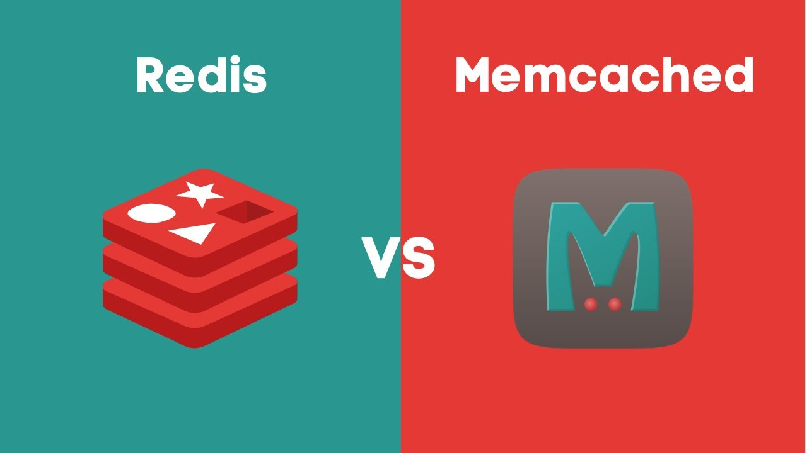

* 应用程序级别的缓存虽然解决许多与内存数据存储和缓存相关的问题；但是，也带来了更多新的问题：
  * ① **数据一致性问题**：缓存数据库（Redis）和关系型数据库（MySQL）中的数据如何保持一致？
  * ② **单点故障**：缓存数据库（Redis），如果崩溃了，数据该怎么处理？
  * ③ **分布式问题**：缓存数据库（Redis）中的数据在一台机器中的内存放不小，要分布到多个机器上，如何做成分布式？使用什么算法？
  * ④ ……

### 3.2.11 异步

* 对于像 Tomcat 这样的  WEB 应用服务器而言，如果每个请求都需要一个线程来处理，那么假设现在有 10000 个请求，那么 Tomcat 就需要建立 10000 个线程来处理？

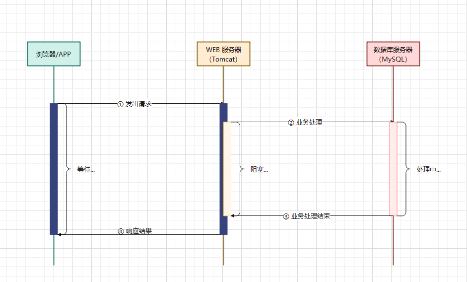

* 当然不可能，因为频繁的创建和销毁线程，会增大系统的开销，也会导致线程的上下文切换变得很慢，进而导致系统的性能和响应速度变得很慢；所以，Tomcat 提供了线程池来复用线程，这样可以更有效地利用系统资源，避免了为每个请求都创建和销毁线程的开销，提高了系统的性能和响应速度。

> [!NOTE]
>
> 所谓的线程池就是一个容器：
>
> * ① **线程池创建与管理**：Tomcat 在启动时会创建一个线程池，用于处理客户端请求。这个线程池由 Java 标准库中的 `java.util.concurrent` 包提供的 `ThreadPoolExecutor` 实现。管理员可以通过配置文件调整线程池的大小、最大连接数、线程空闲时间等参数，以满足服务器的性能和资源需求。
> * ② **请求分发**：当客户端发送请求到达 Tomcat 服务器时，服务器会从线程池中获取一个空闲的线程来处理该请求。如果所有线程都处于忙碌状态，而且线程数未达到最大限制，则服务器会创建新的线程来处理请求；如果线程池中的线程数已达到最大限制，则请求将被放入队列中等待处理。
> * ③ **请求处理**：线程池中的每个线程都会负责处理一个或多个客户端请求。处理过程包括接收请求、解析请求参数、执行相应的业务逻辑、生成响应数据等。处理完成后，线程会被释放并重新放回线程池中，以便处理下一个请求。
> * ④ **线程池调优**：管理员可以通过调整线程池的参数来优化服务器性能。例如：增加线程池的大小可以提高并发处理能力，但也会增加系统资源消耗；减小线程池的大小可以降低系统负载，但可能导致处理请求的延迟增加。因此，需要根据服务器的实际负载情况和性能需求进行适当的调优。

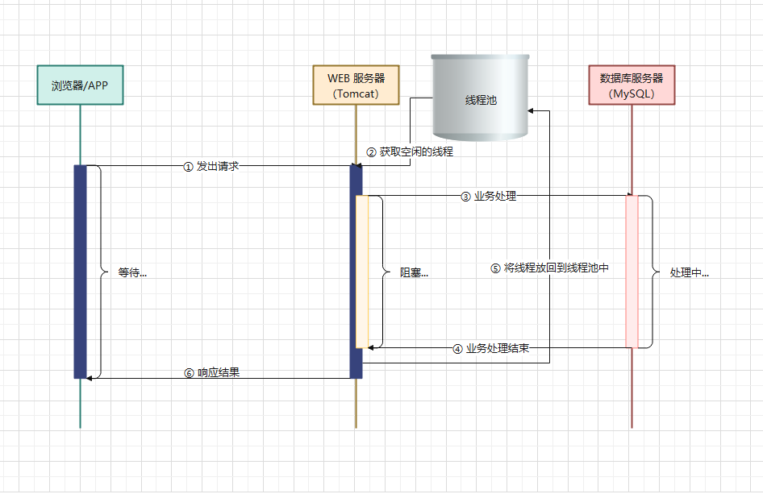

* 假设线程池中有 1000 个线程；此时，刚好有 1000 个人同时访问；并且，这些线程都在访问硬盘、数据库或发起网络调用等同步操作（很慢），那么第 1001 个人可能会被拒绝请求（主要由 Tomcat 的线程池配置决定）：

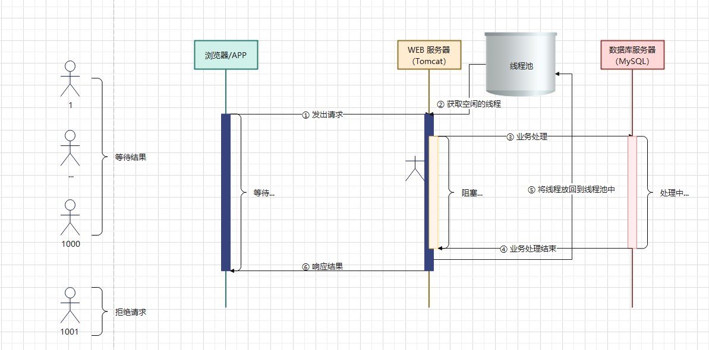

* 于是，Tomcat 采用了异步、非阻塞的方式来处理这个问题，即原理如下：
  * ① Tomcat 配置了一个线程池，其中线程数量通常设置为与 CPU 核心数量相近，以充分利用 CPU 资源。
  * ② 当有请求到达 Tomcat 时，Tomcat 从线程池中获取一个可用的线程来处理请求。
  * ③ 如果请求需要执行阻塞式的 I/O 操作（访问数据库、发起网络调用等），线程不会被阻塞，而是会注册一个钩子函数（回调函数），然后释放线程。
  * ④ 当 I/O 操作完成后，系统会发送一个事件通知相应的线程，线程回到事件循环中执行之前注册的钩子函数来处理完成的 I/O 操作。

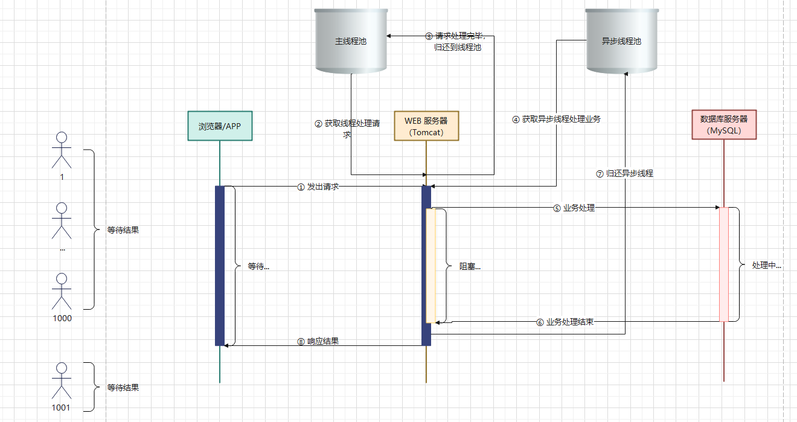

### 3.2.12 单线程

* 应用缓存数据库，如：Redis ，就是采用的`单线程`的方式来处理请求的（早期是这样的，后期改为了获取请求还是采用多线程，但是执行业务数据是使用单线程）。
* 为什么 Redis 不采用像 Tomcat 那样使用多线程或线程池？是因为 Redis 仅仅面对的是内存，在现代计算机体系中内存的速度仅次于 CPU，比哪些所谓的网络操作（IO、网络调用）要快很多，所以可以使用单线程来快速的在内存中进行读写操作，并完成很多网络过来的网络请求（早期这个是瓶颈，目前已经改为多线程了）。
* 单线程还有巨大的优势，就是没有竞争，不需要加锁。

> [!IMPORTANT]
>
> 多线程通常需要加锁来解决资源争抢的问题，如果没处理好，可能会演变为死锁。


# 第四章：操作系统

## 4.1 概述

* 操作系统（Operating System，简称 OS）是管理计算机硬件与软件资源的系统软件，它为用户和其他软件提供了一个与硬件交 互的界面，同时也是计算机系统的核心和基石。


* 在上古时期，硬件资源不够丰富，计算机设计的也非常简陋。那个时候，很多应用程序都是直接跑在硬件上的，即：一个计算机只能跑一个应用程序。

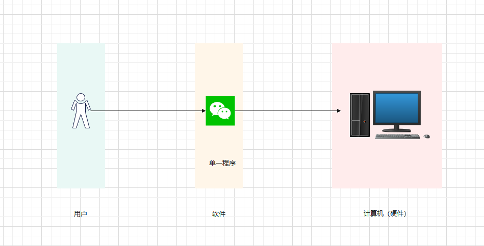

* 随着技术的发展，硬件越来越丰富，功能也越来越强大，性能也越来越好。这种情况下，如果一台计算机只能跑一个程序，实在是太浪费了。而且，底层硬件不断丰富，应用程序需要对接的硬件也将越来越多，如果每个应用程序都这么干，不显示工作很重复吗？于是，操作系统应运而生了。

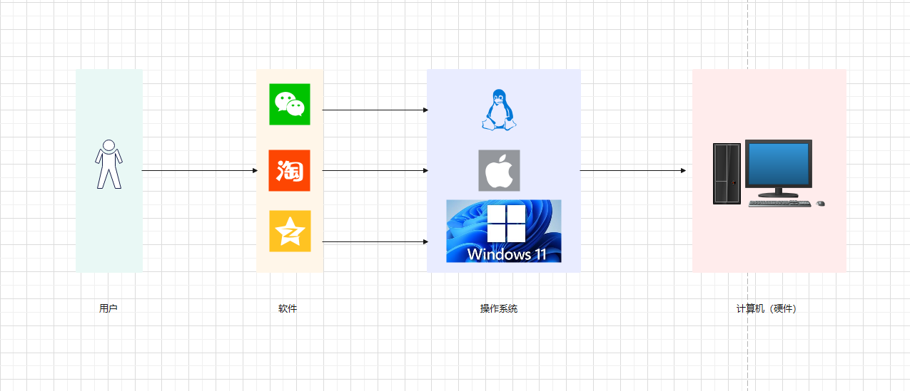

* 操作系统的功能：
  * 硬件驱动。
  * 进程管理。
  * 内存管理。
  * 网络管理。
  * 安全管理。
  * 文件管理。

## 4.2 操作系统相关概念

### 4.2.1 接口（interface）

* `接口`这一概念的起源可以追溯到`计算机科学`和`电子工程`的早期发展。最初，它主要用于描述物理连接设备的硬件接口。

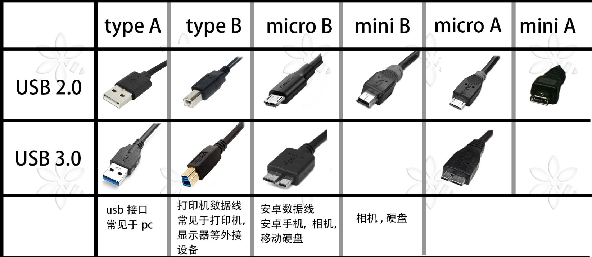

> [!NOTE]
>
> * ① 在现实生活中，我们会使用 USB 接口，就在于其通用性（几乎所有的计算机和电子设备都支持 USB 接口）、热插拔功能、高速数据传输、电力供应能力、设备多样性和简单的物理连接。
>
> * ② 当然，USB 接口也分版本的，每种版本的传输速度、物理连接形状以及功率传输能力等方面各有不同；在实际工作中，只要找到满足 USB 接口版本的设备，就可以直接使用。

* 随着计算机科学的发展，尤其是软件工程的兴起，`接口`的概念扩展到了软件组件之间的交互。在`软件工程`中，`接口`的概念在 1960 年代到 1970 年代逐渐形成，这个时期正是模块化和结构化编程思想开始流行的时候。接口作为一种明确界定模块职责和交互方式的手段，对于提高软件的可维护性和复用性起到了关键作用。
* 当然，`接口`这个术语有广泛的应用和不同的含义，根据不同的应用场景，它的意思也有所不同：
  * ① **硬件接口**：硬件接口指的是硬件设备之间为了相互连接和通信而遵守的物理规范和标准。例如：USB（通用串行总线）接口是一种允许电脑与其他设备（如鼠标、键盘、打印机等）连接的标准硬件接口。
  * ② **软件接口**：软件接口通常指软件组件之间交互的方法。它定义了软件组件之间如何互相通信，包括：数据的传输格式、通信规则等。API（应用程序编程接口）就是一种常见的软件接口，它允许不同的软件应用之间进行交互。
  * ③ **用户界面（UI）**：用户界面是人与计算机系统之间交互的接口。它包括了软件的图形界面、菜单、按钮等用户可以直接与之交互的元素，使用户能够与计算机系统进行交互和通信。
  * ④ **网络接口**：网络接口指的是不同计算机网络或网络设备之间进行数据交换的点。它可以是物理的，如：网卡；也可以是逻辑的，如：软件定义的网络接口。

* 操作系统通常会提供`命令行接口（CLI）`和`图形化用户界面（GUI）`两种主要的交互方式，让用户可以根据需要选择不同的方式与计算机系统进行交互。
  * **命令行接口（CLI）**：CLI 是一种基于文本的接口，通过键入命令来与计算机进行交互。用户可以输入特定的命令行指令，由操作系统解释并执行。CLI 允许用户直接命令操作系统进行各种任务，如管理文件、运行程序和调整系统设置等。CLI 的优点是占用资源少，执行效率高，特别适合进行复杂的操作和批处理任务。但它的缺点是有一定的学习曲线，需要用户记忆各种命令。
  * **图形化用户界面（GUI）**：GUI 提供了一种基于图形的交互方式，用户可以通过点击、拖拽等直观的操作来控制计算机。GUI 包括窗口、图标、按钮和菜单等元素，通过视觉元素来展示信息和接受用户操作。GUI 的优点是用户友好和易于上手，适合广大非专业用户。缺点是相比 CLI，GUI 一般会占用更多的系统资源。

> [!NOTE]
>
> * ① 不同的操作系统和应用场景可能对 CLI 和 GUI 的依赖程度不同。例如：服务器操作系统和一些专业的应用系统可能更倾向于使用 CLI，因为它更适合远程操作、自动化脚本和高效率的任务处理。而面向普通消费者的桌面操作系统，如：Windows、macOS 和各种 Linux 发行版，通常会提供丰富的 GUI，以满足日常的使用需求，使计算机更易于使用。
> * ② 随着技术的发展，一些操作系统还提供了 CLI 和 GUI 之间的集成环境，使用户可以根据自己的偏好和具体任务的需要灵活选择使用 CLI 还是 GUI 。

### 4.2.2 用户态和内核态

* 在现代操作系统中，`用户态（User Mode）`和`内核态（Kernel Mode）`是两种不同的执行模式，它们对系统资源的访问权限有着本质的区别。这种区分是为了提供一个稳定和安全的运行环境，防止用户程序直接操作硬件设备和关键的系统资源，从而可能引起系统的不稳定或安全问题。


* 内核态（Kernel Mode） VS 用户态（User Mode）：

| 类型   | 内核态（Kernel Mode）                                        | 用户态（User Mode）                                          |
| ------ | ------------------------------------------------------------ | ------------------------------------------------------------ |
| 权限   | 内核态是操作系统代码运行的模式，拥有访问系统全部资源和执行硬件操作的`最高权限`。在这种模式下，操作系统的核心部分可以直接访问内存、硬件设备控制、管理文件系统和网络通信等。 | 用户态是普通应用程序运行的模式，具有`较低`的系统资源访问权限。在用户态，程序不能直接执行硬件操作，必须通过操作系统提供的接口（即系统调用）来请求服务。 |
| 安全性 | 由于内核态具有如此高的权限，因此只有可信的、经过严格审查的操作系统核心组件才被允许在此模式下运行。这样可以保护系统不被恶意软件破坏。 | 用户态为系统提供了一层保护，确保用户程序不能直接访问关键的系统资源，防止系统崩溃和数据泄露。 |
| 功能   | 内核态提供了`系统调用`的接口，允许用户态程序安全地请求使用操作系统提供的服务，比如：文件操作、网络通信、内存管理等。 | 用户态保证了操作系统的稳定性和安全性，同时也使得多个程序可以在相互隔离的环境中同时运行，避免相互干扰。 |

> [!NOTE]
>
> * ① 操作系统通过用户态和内核态的分离，实现了对系统资源的保护和控制。
> * ② 当用户程序需要进行文件读写、网络通信或其他需要操作系统介入的操作时，会发生从用户态到内核态的切换。这通过系统调用（System Call）实现，系统调用是用户程序与操作系统内核通信的桥梁。
> * ③ 执行完毕后，系统从内核态返回用户态，继续执行用户程序。
> * ④ 用户态和内核态的这种分离设计是现代操作系统中实现安全、稳定运行的关键机制之一。


* 示例：

```java {23}
import java.io.IOException;
import java.nio.file.Files;
import java.nio.file.Path;
import java.nio.file.Paths;
import java.util.List;

public class Demo {
    public static void writeFile(String filePath, String content) {
        Path path = Paths.get(filePath);
        try {
            Files.write(path, content.getBytes());
        } catch (IOException e) {
            e.printStackTrace();
        }
    }
    public static void main(String[] args){
        int a = 10;                                 // 用户态
        int b = 20;                                 // 用户态
        int c = a + b;                              // 用户态
        string filePath = "c:/demo.txt";            // 用户态
        string txt = a + b + c;                     // 用户态
        
        // 从用户态切换到内核态完成文件写入
        writeFile(filePath, a);                     
        
        System.out.println(a);                      // 从内核态切换回用户态
        System.out.println(b);                      // 用户态
        System.out.println(c);                      // 用户态
    }
}
```

### 4.2.3 ISA、ABI 和 API

* ISA 、ABI 和 API 的参考模型如下：


* 在底层，硬件模型以指令集架构 （ISA） 表示，该架构定义了处理器、寄存器、存储器和中断管理的指令集。ISA 是硬件和软件之间的接口，对于操作系统 （OS） 开发人员 （System ISA） 和直接管理底层硬件的应用程序 （User ISA） 的开发人员来说非常重要。

> [!NOTE]
>
> * ① ISA 是计算机体系结构中定义的一组指令，它规定了处理器能够执行的操作。ISA 包括指令的编码、寄存器的使用、内存访问模式等。不同的处理器可能有不同的 ISA，例如：x86、ARM、MIPS 等。
> * ② 在设计一个新的操作系统时，开发者需要确保操作系统能够支持特定的 ISA ，以便在特定的硬件上运行。例如：如果操作系统旨在运行在 ARM 架构的处理器上，那么它必须能够理解和执行 ARM ISA 定义的指令集。

* 应用程序二进制接口 （ABI） 将`操作系统层`与由操作系统管理的`应用程序`和`库`分开。ABI 涵盖了低级数据类型、对齐方式和调用约定等详细信息，并定义了可执行程序的格式。系统调用在此级别定义。此接口允许应用程序和库在实现相同 ABI 的操作系统之间移植。

> [!NOTE]
>
> * ① ABI 是指在二进制级别上，应用程序与操作系统、库或应用程序的不同部分之间的接口。它定义了数据类型的大小、布局、对齐方式，以及函数调用的约定（如参数如何传递、返回值如何处理等）。ABI 确保了编译后的二进制文件能够在特定的操作系统和硬件平台上正确地运行。
> * ② 在 windows 上的应用程序的运行格式是：`PE`（portable executable）格式、`.dll` （dynamic link library）格式和 `.lib` 格式；而在 Linux 上的应用程序的运行格式是：`ELF`（executable and linking format）格式、`.so` （shared object）格式和 `.a` 格式。
> * ③ 在 Linux 中可以通过 `file /bin/ls` 命令查看指定可执行应用程序的 ABI 格式；从而也可以论证，在 Windows 上可以运行的程序，在 Linux 上运行不了。
> * ④ 当开发者在 Linux 系统上编写 C 语言程序，并使用特定的编译器（如：GCC）编译时，编译器会遵循 Linux 平台的 ABI 规范来生成二进制文件。这样，生成的可执行文件就可以在任何遵循相同 ABI 规范的 Linux 系统上运行。
> * ⑤ 如果一个应用程序需要跨平台（操作系统）运行，就需要使用`一套代码，多平台编译`的方式（针对 C 或 C++ 等），即：相同的源代码，在不同平台（操作系统）上使用特定平台的编译器（如：GCC）来分别编译成符合自己平台的 ABI 规范的二进制文件。

* 最高级别的抽象由应用程序编程接口 （API） 表示，它将`应用程序`连接到`库`或`底层操作系统`。

> [!NOTE]
>
> * ① API 是一组预定义的函数、协议和工具，用于构建软件和应用程序。API 允许不同的软件系统相互交互，它定义了软件组件之间如何相互通信。API 可以是库、框架、协议或服务。
> * ② 在 Web 开发中，开发者可能会使用 JavaScript 的 Fetch API 来与服务器进行通信，获取数据或提交表单。这个 API 提供了一种标准化的方式来发送 HTTP 请求和处理响应，而不需要开发者关心底层的网络协议细节。

### 4.2.4 系统调用（System Call）和函数库（Library Call）

* 在现代操作系统中，应用程序都不能直接作用于硬件，而是运行在操作系统之上。


* 并且，在上文的图示中，我们也会看到`系统调用（System Call）`和`函数库（Library Call）`的身影，如下：

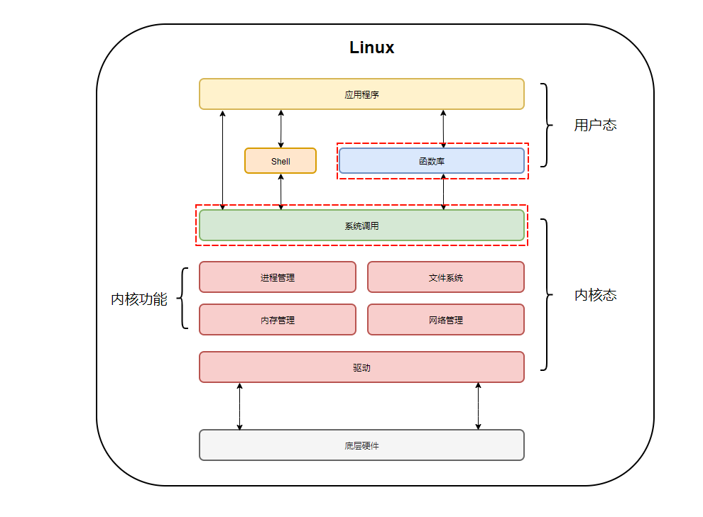


* 其实，`系统调用（System Call）`和`函数库（Library Call）`的区别如下：

| 类型     | 系统调用（System Call）                                      | 函数库（Library Call）                                       |
| -------- | ------------------------------------------------------------ | ------------------------------------------------------------ |
| 定义     | 系统调用是操作系统提供给程序员的一组接口，这些接口允许用户空间的程序请求操作系统内核提供的服务，比如文件操作、进程控制、通信和内存管理等。 | 函数库调用是指使用高级语言编写的一组预先编译好的函数，这些函数实现了一些常用的功能，比如：字符串处理、数学计算等。程序员可以在自己的程序中直接调用这些函数，而无需重新实现它们。 |
| 权限     | 执行系统调用时，会从用户态切换到内核态。这是因为系统调用涉及到访问受保护的系统资源，这些操作必须由操作系统控制以确保系统的稳定性和安全性。 | 函数库调用通常在用户态执行，不涉及到用户态与内核态之间的切换。它们直接使用操作系统通过系统调用提供的服务，或者完全在用户空间内完成计算，不需要操作系统介入。 |
| 性能开销 | 由于涉及到用户态与内核态之间的切换，系统调用的执行成本相对较高。因此，频繁的系统调用可能会影响程序的性能。 | 相对于系统调用，函数库调用的性能开销较小。因为它们通常不涉及到模式切换，且执行的操作多在用户空间完成。 |
| 示例     | open()，read()，write()，fork()，exec() 等 UNIX/Linux 系统调用。 | C 标准库中的 printf() 等函数；数学库中的 sin()，cos() 等函数。 |

> [!NOTE]
>
> * ① **执行层级**：系统调用直接与操作系统内核交互，执行更底层的操作；而函数库调用运行在用户空间，通常使用系统调用来实现其功能。
> * ② **性能开销**：系统调用由于涉及到用户态与内核态的切换，性能开销相对较大；函数库调用则因为主要在用户态执行，性能开销较小。
> * ③ **使用目的**：系统调用提供了访问操作系统资源和服务的能力；函数库调用则提供了方便、高效执行常见任务的手段。

### 4.2.5 编程语言

* 编程语言根据`其接近计算机硬件`的程度和易用性，可以大致分为`机器语言`、`汇编语言`和`高级语言`三类，其区别如下：
  * **机器语言**：是计算机硬件直接执行的语言，由一系列二进制代码组成。每一条指令执行一个非常具体的任务，如数据移动、算术运算等。机器语言指令直接对应于 CPU 的指令集。由于其与特定硬件架构紧密相关，机器语言程序几乎没有可移植性。
  * **汇编语言**：作为机器语言的一种符号表示，汇编语言使用助记符代替机器指令的二进制代码，使程序更易于人类编写和理解。尽管如此，汇编语言仍然要求程序员具有对计算机硬件和体系结构的深入理解。汇编语言与特定的硬件平台强相关，因此其程序通常不具备跨平台的可移植性。
  * **高级语言**：相对于汇编语言和机器语言，高级语言提供了更高层次的抽象，使得程序员可以使用接近自然语言的语法和结构来编写程序。高级语言隐藏了硬件的复杂性，使得程序员可以专注于解决问题而不是处理机器级的细节。高级语言编写的程序需要通过编译器（将源代码转换为机器语言）或解释器（逐行解释执行源代码）来执行。高级语言通常具有良好的可移植性，意味着同一程序在不同的硬件和操作系统上运行时，需要的修改很小或不需要修改。

* 编程语言之间的比较，如下所示：

| 类别         | 特征                               | 优点                                             | 缺点                                                         | 示例                |
| ------------ | ---------------------------------- | ------------------------------------------------ | ------------------------------------------------------------ | ------------------- |
| **机器语言** | 直接由计算机执行的二进制代码       | 执行速度快                                       | 编写困难，可读性差，与具体硬件强绑定                         | 二进制代码          |
| **汇编语言** | 用助记符代替二进制代码的低级语言   | 相对机器语言更易编写和理解，允许直接控制硬件资源 | 依然需要了解硬件，不够抽象，与具体硬件或平台相关             | MOV，ADD 等助记符   |
| **高级语言** | 接近人类语言，提供了更高层次的抽象 | 易于编写和维护，可移植性好，支持多种编程范式     | 需要通过编译器或解释器转换为机器语言，可能存在一定的性能损失 | C，Java， Python 等 |

> [!NOTE]
>
> * ① 这三种编程语言类型从低级到高级提供了不同层次的抽象，以满足不同的编程需求和场景。
> * ② 随着计算机科学的发展，高级语言因其强大的表达能力、良好的可移植性和易用性，成为了日常软件开发的主流选择。

