# 第一章：扫清概念（⭐）


## 1.1 IP 地址

### 1.1.1 概述

* 在早期，没有`即时通讯工具`的情况下，如：微信、QQ 等，人们都是使用`信件`来进行交流的，如下所示：

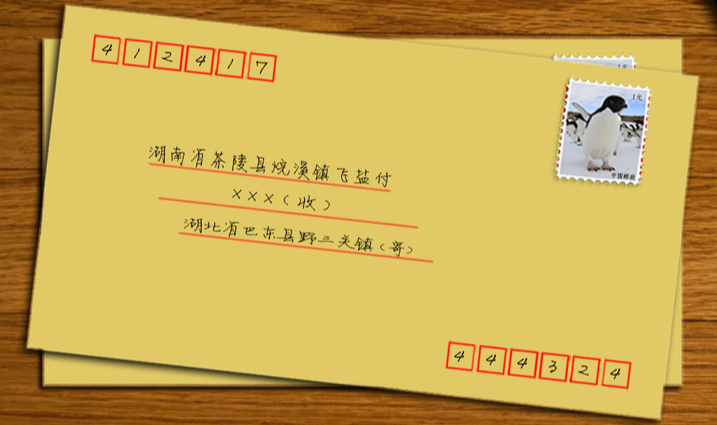

> [!NOTE]
>
> 从上图中，我们可以得知，如果要将信件发送到对方，至少需要知道对方的姓名和`家庭地址`等。

* 同理，在信息交流发达的今天，很多设备，如：手机、电脑、平板、手表等，都会接入到互联网上，如下所示：

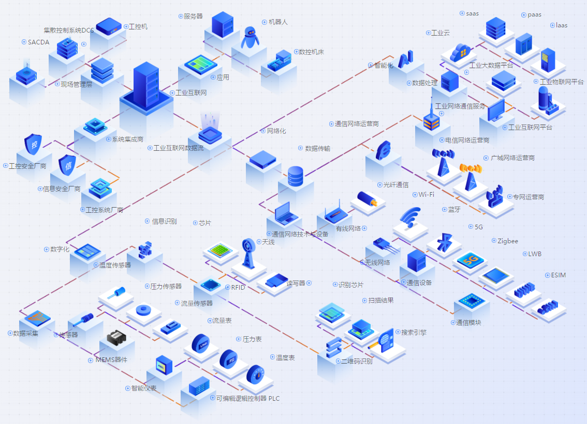

* 针对互联网上的各种设备，我们如何定位？就是给它们分配一个唯一的 `IP` 地址；类似于写信的时候，需要填写的`家庭地址`。

> [!NOTE]
>
> 维基百科：
>
> * **`IP地址`**（英语：IP Address，全称Internet Protocol Address），又译为**网际协议地址**、**互联网协议地址**。是 `互联网协议` 中用于标识`发送`或`接收`数据报的设备的`一串数字`。
> * 常见的 IP 地址分为 `IPV4` 和 `IPV6`：
>   * `IPV4` 为 `32` 位，通常使用`四`组`十`进制数字表示，以点（`.`）分隔，如：`172.16.254.1`。
>   * `IPV6` 为 `128` 位，通常使用`八`组`十六`进制数字表示，以冒号（`:`）分隔，如：`2001:db8:0:1234:0:567:8:1`。

### 1.1.2 IP 地址的分类

* IP 地址可以根据`其分配和使用的范围`来划分为：
  * ① `私网 IP（内网 IP）`
  * ② `公网 IP`。
* 它们之间的区别如下：

| IP 分类            | 特点                                                         | 备注                                                         |
| ------------------ | ------------------------------------------------------------ | ------------------------------------------------------------ |
| 私网 IP（内网 IP） | 私网 IP 地址是在私有网络内部使用的 IP 地址，用于内部通信和资源共享。 | 通常由网络设备分配，如：路由器等，一般不固定。               |
| 公网 IP            | 公网 IP 地址是可以在公共互联网上进行通信的 IP 地址。         | 公网 IP 地址是全球唯一的，可以被其他网络和设备访问到，并且需要购买！！！ |

> [!NOTE]
>
> 常见的私网 IP 有：`10.0.0.0 ~ 10.255.255.255`、`172.16.0.0 ~ 172.31.255.255`、`192.168.0.0 ~ 192.168.255.255`。

## 1.2 端口

* 端口（port）是计算机网络中用于`标识`不同`应用程序`或`服务`的`数字标识符`。在 `TCP/IP` 协议中，端口号是一个 16 位的数字，范围从 `0 ~ 65535` 。


> [!NOTE]
>
> 问：为什么说端口号是一个 16 位的数字？
>
> 答：因为计算机底层是 2 进制，而 2^16 = 65535 。

* 端口的作用：是在一个主机上`同时`运行`多个`网络应用程序时，通过`端口号`来`区分`和`定位`不同的`应用程序`或`服务`。每个应用程序或服务都可以`绑定`到一个`特定`的端口号上，以便其他计算机或设备可以通过该`端口`与该`应用程序`进行`通信`。

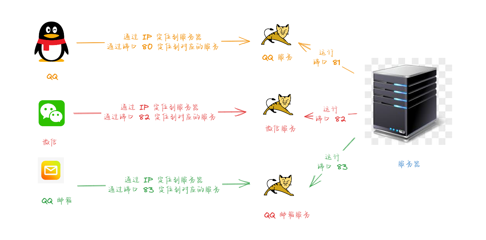

* 常见的端口号是一些预留的标准端口，如：`HTTP` 的端口是 `80` ，`HTTPS` 的端口是 `443`，`FTP` 的端口是 `21`，`SMTP` 的端口是 `25` 等。
* 当然，操作系统在启动之后，为了完成某些功能，也会启动一些应用程序，而这些应用程序会占用一部分端口，其范围是 `0 ~ 1023` ，如：
  * 20 和 21：用于FTP（文件传输协议）数据和控制连接。
  * `22`：用于 SSH（安全外壳协议）远程登录和安全文件传输。
  * 25：用于SMTP（简单邮件传输协议）发送电子邮件。
  * `80`：用于 HTTP（超文本传输协议）网页浏览。
  * `443`：用于 HTTPS（安全HTTP）加密的网页浏览。
  * 110：用于 POP3（邮局协议版本3）接收电子邮件。
  * 143：用于 IMAP（Internet邮件访问协议）接收电子邮件。

> [!NOTE]
>
> * ① 上述的端口是大家约定的，并非绝对的，可以根据自己的喜好更改！！！
> * ② 某些情况下，操作系统可能使用其他的端口号或动态分配端口号来满足特定的需求。

* 总而言之，通过`端口号`，计算机可以将传入的数据包或连接路由到正确的`应用程序`或`服务`，实现`网络通信`和`数据交换`。端口号在网络编程和网络安全中起着重要的作用，帮助实现应用程序之间的通信和数据传输。

## 1.3 协议

* 只有 `IP` 地址和`端口`还不行，`客户端`上的`应用程序`和`服务器`的`应用程序`还必须借助`通信协议`来进行`通信`。

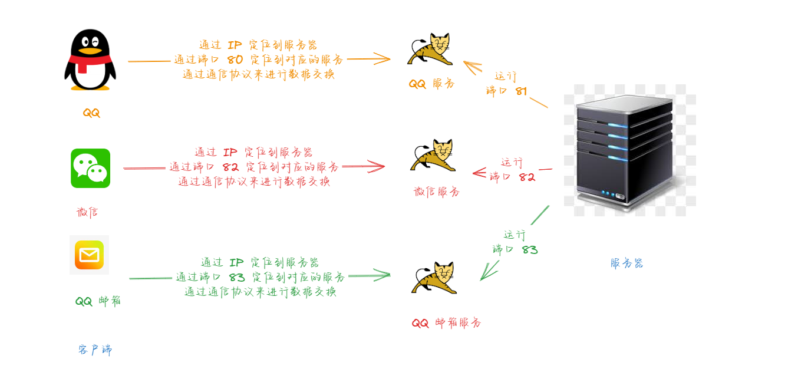

* 在现实生活中，人和人之间的交流必须借助于`某种语言`：

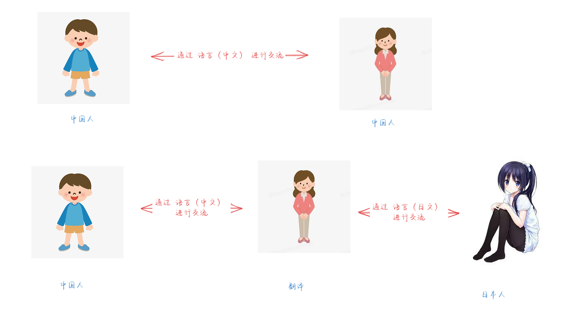

* 其实，语言就是一种协议，一种规定，一种标准，一种大家都必须遵守的规则；那么，通信协议是什么？

> [!NOTE]
>
> 维基百科：
>
> * `通信协议`是在任何物理介质中允许`两个`或`多个`在`传输系统`中的`终端`之间传播`信息`的系统`标准`，也是指计算机通信或网络设备的共同语言。
> * 通信协议定义了`通信` 中的`语法学`、`语义学`和`同步`规则以及可能存在的`错误检测与纠正`。
> * 通信协议在`硬件`、`软件`或`两者之间`皆可实现。


# 第二章：远程连接排错（⭐）

## 2.1 概述

* 远程连接排错，主要分为三步：
  * ① 确认网络是否通畅。
  * ② 确认防火墙、SELinux 等。
  * ③ 确认端口是否开放。

* 目前的架构是这样的：


* 所以，我们是在 `win` 系统中来进行`远程连接`排错的。

## 2.2 确认网络是否通畅

* 命令：

```shell
ping 域名|IP地址
```


* 示例：

```shell
ping www.baidu.com
```

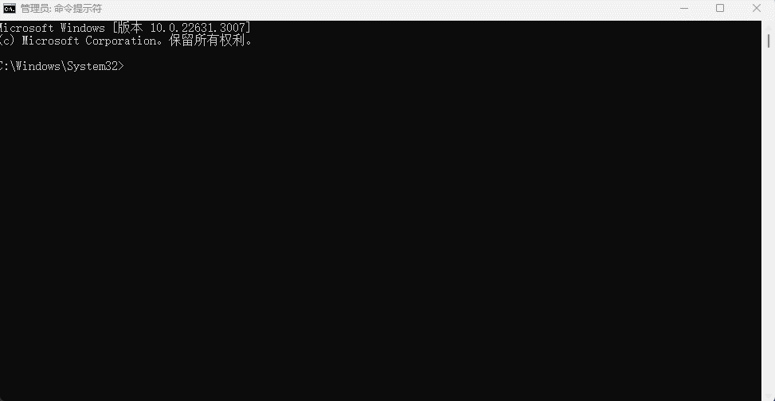


* 示例：

```shell
ping 192.168.10.100
```

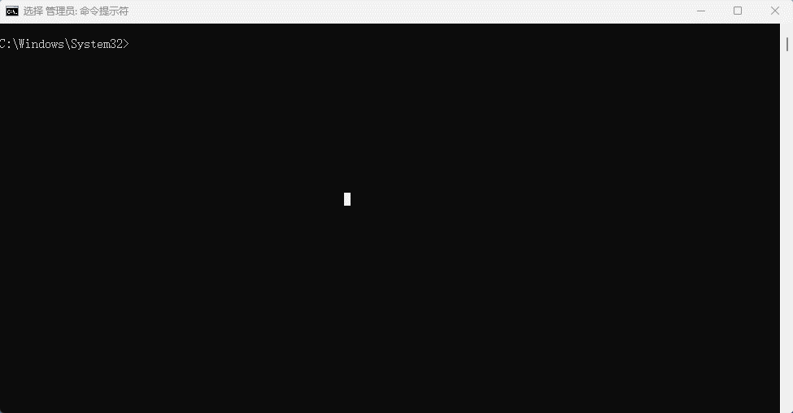

## 2.3 确认防火墙、SELinux

* 目前而言，防火墙和 SELinux 不是问题，所以暂时不演示。


* 示例：略。

## 2.4 确认端口是否开放

* 命令：

```shell
telnet 域名|IP地址 端口
```


* 示例：

```shell
telnet 192.168.68.10 22
```


* 示例：

```shell
telnet 192.168.68.10 12345
```

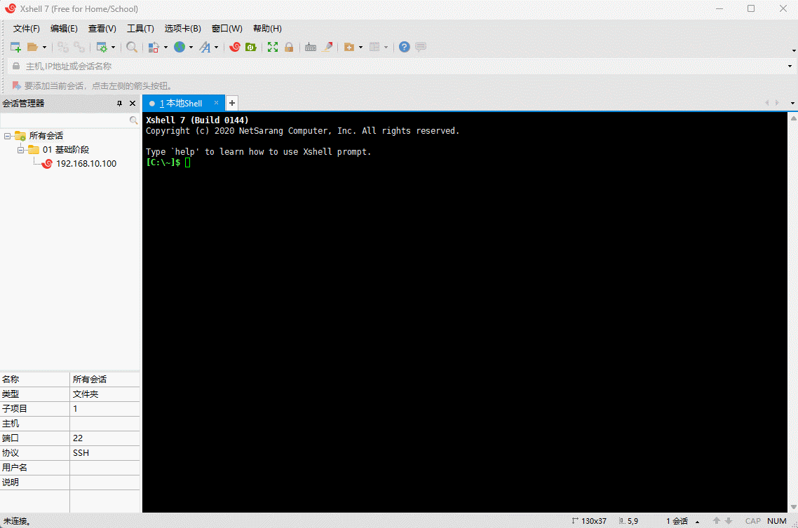


# 第三章：Linux 基础（⭐）

## 3.1 Linux 命令提示符

* 当通过远程工具（如：`Xshell` 等）连接到远程 Linux 的时候，就会出现`命令提示符`，如下所示：

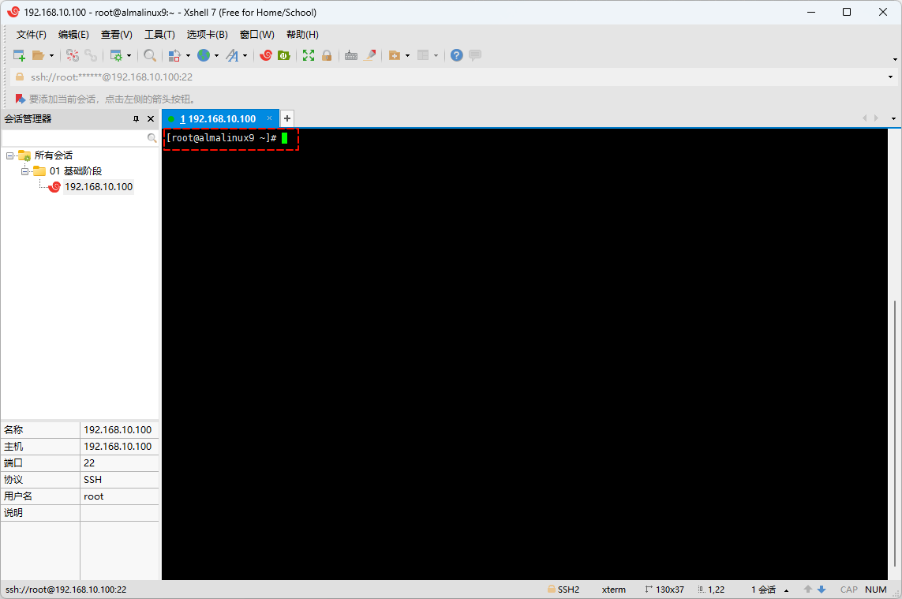

* 我们可以将其分解一下：

```shell
[root@almalinux9 ~]# 
```

* 解释：
  * `root` 表示`当前登录到 Linux 中的用户`，即`用户名`。
  * `@` 没有特殊含义，仅仅用来表示`分隔`的意思。
  * `almalinux9` 表示`主机的名称`，默认是 `localhost` 。
  * `~` 表示`当前所在路径（目录）`，其中 `~` 表示`家目录`。
  * `#` 表示`用户身份`；如果是`管理员`，就是 `#` ；如果是`普通用户`，就是 `$`。

* 其对应的图示如下：


## 3.2 Linux 命令格式

* Linux 命令格式：

```shell
命令（command） 选项(option) 参数(arguments/parameter)
```

* 其命令格式说明：

| 类别 | 说明                                       | 备注                                        |
| ---- | ------------------------------------------ | ------------------------------------------- |
| 命令 | Linux 中通过`命令`控制整个操作系统。       | 通常而言，命令是单词或单词缩写。            |
| 选项 | 就是`功能`，不同的`选项`对应不同的`功能`。 | 通常而言，选项会使用加上 `-` 或 `--` 前缀。 |
| 参数 | 命令处理的`目标`                           |                                             |

* 其理解如下：

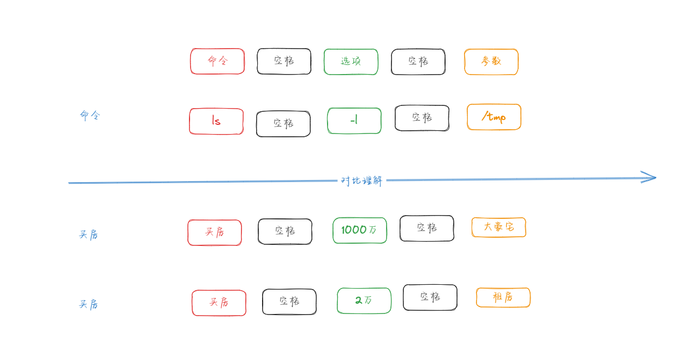

> [!NOTE]
>
> * 在实际交流的时候，我们有的时候，会模糊`选项`和`参数`的区别，统一使用`参数`来`代替`。
> * 并不是所有的命令`都遵循`上述的格式，有些命令就只有命令，而没有选项或参数，如：`pwd` 等。

## 3.3 Linux 目录 VS Windows 目录

* Linux 目录 和 Windows 目录有一些区别：

| 特性                | Linux                                                    | Windows                                                      |
| ------------------- | -------------------------------------------------------- | ------------------------------------------------------------ |
| **路径分隔符**      | `/`（正斜杠）                                            | `\`（反斜杠）                                                |
| **根目录**          | `/`，所有目录均位于根目录下                              | 每个驱动器有自己的根目录，如： `C:\`                         |
| **大小写敏感性**    | 大小写敏感，`file.txt` 与 `File.txt` 是不同文件          | 大小写不敏感，`file.txt` 和 `File.txt` 是同一文件            |
| **隐藏文件**        | 以 `.` 开头的文件或目录为隐藏文件                        | 文件或目录通过属性设置为隐藏                                 |
| **权限管理**        | 基于用户、用户组和其他人的权限（读、写、执行）           | 使用访问控制列表（ACL）                                      |
| **系统目录结构**    | 标准目录结构：`/bin`, `/etc`, `/home`, `/usr`, `/var` 等 | 系统目录包括：`C:\Windows`, `C:\Program Files`, `C:\Users` 等 |
| **软链接/快捷方式** | 使用符号链接（软链接）和硬链接                           | 使用快捷方式                                                 |

> [!NOTE]
>
> 总体而言，Linux 的目录结构`更加统一和规范`，而 Windows 的目录结构则`更加分散和多样化`。


# 第四章：Linux 入门

## 4.1 查询帮助

* 有的时候，我们不知道，一些命令的常规用法，此时就需要查询帮助了。
* 总体而言，Linux 提供了如下的两种常用方式，来帮助我们对命令进行查询：

| 命令帮助方式  | 备注                                  |
| ------------- | ------------------------------------- |
| `man 命令`    | 会显示命令的详细信息。使用 `q` 退出。 |
| `命令 --help` | 会显示命令的精简信息。                |

* 当然，也可以使用[命令行帮助网站](https://wangchujiang.com/linux-command/)。


* 示例：

```shell
man cd
```


* 示例：

```shell
cd --help
```

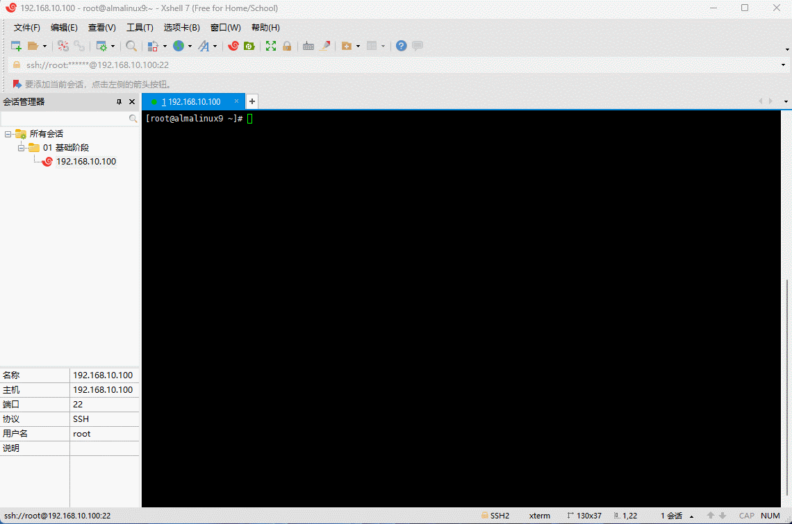

## 4.2 Linux 命令行快捷键（⭐）

### 4.2.1 概述

> [!NOTE]
>
> 使用`快捷键`的主要`目的`就是为了提高在命令行中`操作`的效率！！！

* 光标移动到`行首`：`ctrl + a` ；其中 `a` 是 `ahead` 的缩写。

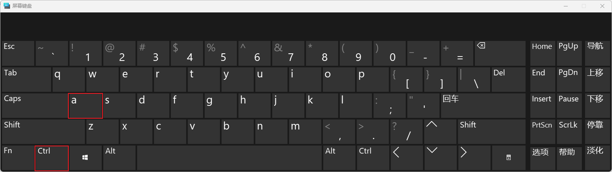

* 光标移动到`行尾`：`ctrl + e` ；其中，`e` 是 `end` 的缩写。

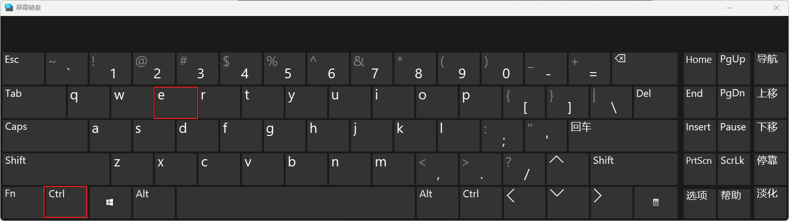

* 将`光标所在位置`到`行首`的内容`剪切（删除）`：`ctrl + u` ；其中，u 来源于 Unix，是 kill-line 的意思，即杀死整行。

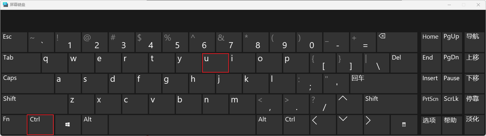

* 将`光标所在位置`到`行尾`的内容`剪切（删除）`：`ctrl + k` ；其中，k 来源于 Unix，是 kill-line 的意思，即杀死整行。

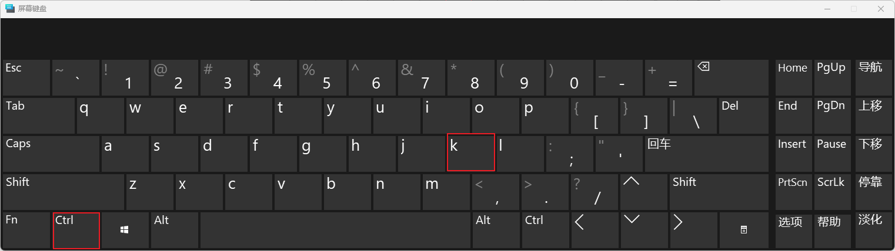

* 清屏：`ctrl + l`；相当于 `clear` 命令。

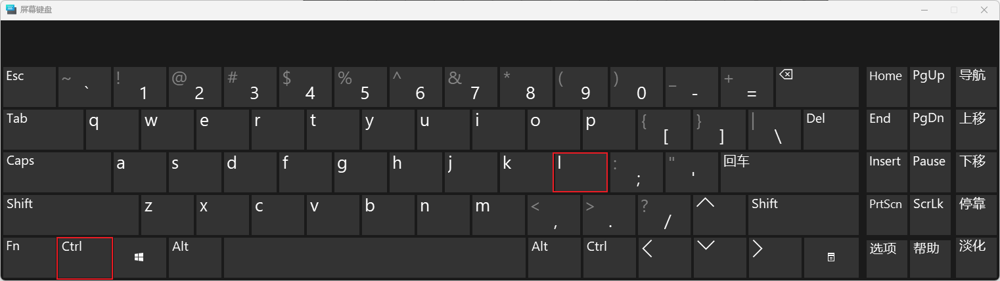

* `取消`当前的命令：`ctrl + c` ；其中，`c` 是 `cancel` 的缩写。

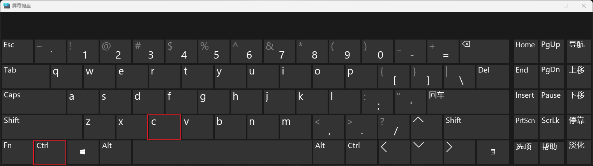

### 4.2.2 案例

* 示例：光标移动到`行首`

```shell
ctrl + a 
```

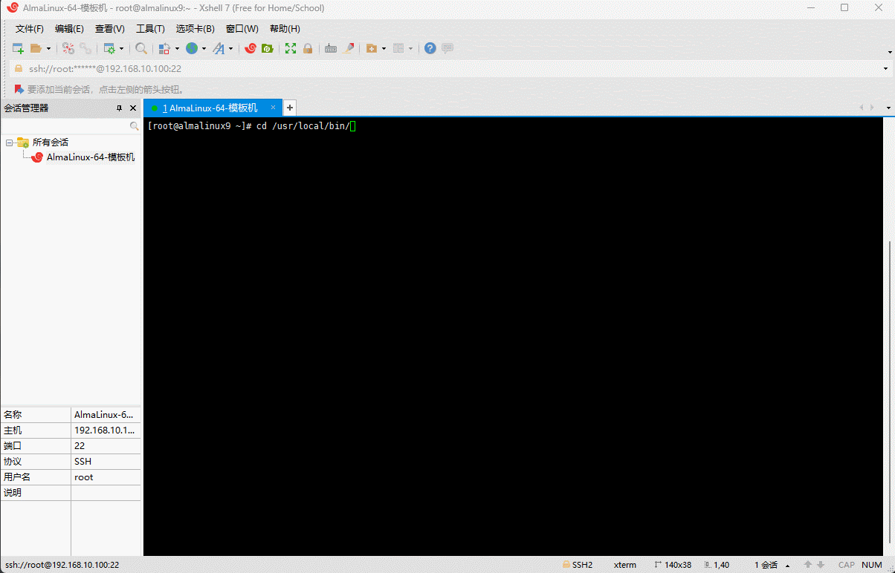


* 示例：光标移动到`行尾`

```shell
ctrl + e
```

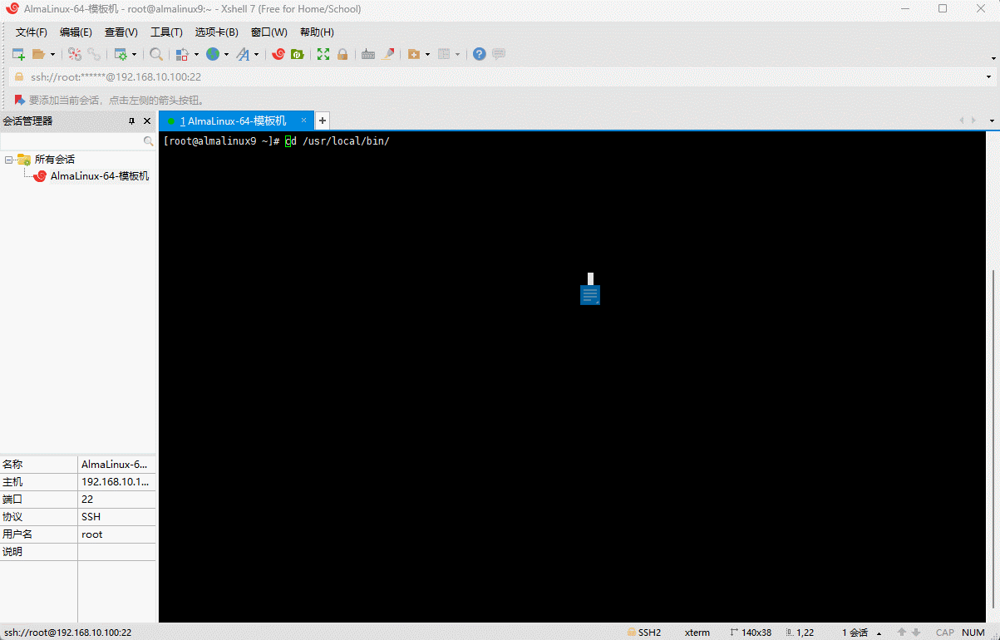


* 示例：将`光标所在位置`到`行首`的内容`剪切（删除）`

```shell
ctrl + u
```


* 示例：将`光标所在位置`到`行尾`的内容`剪切（删除）`

```shell
ctrl + k
```


* 示例：清屏

```shell
ctrl + l 
```

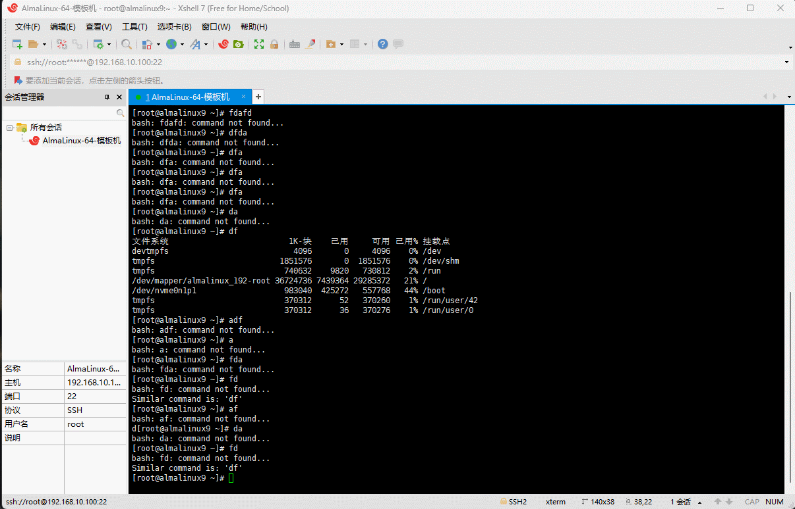


* 示例：`取消`当前的命令

```shell
ctrl + c
```


### 4.2.3 坑

* 有些快捷键，在 Linux 中和 Windows 中，不是很一样，需要特别小心：

| 快捷键     | Linux                            | Windows |
| ---------- | -------------------------------- | ------- |
| `ctrl + s` | 锁屏                             | 保存    |
| `ctrl + q` | 解锁（解除锁屏）                 |         |
| `ctrl + z` | 让当前正在运行的命令，在后台挂起 | 撤销    |

> [!NOTE]
>
> 这些`坑`快捷键并不需要记忆，只需要遇到的时候，能想起并解决即可！！！

## 4.3 Linux 关机和重启

### 4.3.1 概述

* Linux 并不总是需要关机和重启的，Linux 追求的是 `7 * 24` 小时不间断的服务。
* 但是，某些情况下，我们可能需要对 Linux 进行关机和重启，所以应该`知道`相应的命令。

### 4.3.2 关机

* 立刻关机：

```shell
shutdown -h now
```

* 延迟关机：单位是`分钟`

```shell
shutdown -h 10
```

* 取消关机：

```shell
shutdown -c
```


* 示例：

```shell
# 延迟关机
shutdown -h 10
# 取消关机
shutdown -c
# 立刻关机
shutdown -h now
```


### 4.3.3 重启

* 立刻重启：

```shell
shutdown -r now
```

```shell
reboot
```

* 延迟重启：单位是`分钟`

```shell
shutdown -r 10
```


* 示例：

```shell
# 延迟重启
shutdown -r 10
# 取消重启
shutdown -c
# 立刻重启
reboot
```


# 第五章：补充

## 5.1 LInux 中的用户类型

* 在 LInux 中，用户主要分为三种类型：`root 用户`、`虚拟用户（系统用户）`和`普通用户`，它们之间的区别如下：

| 类型                 | 定义                                         | 权限级别                               | UID 范围      | 示例                  | 主要用途                             |
| -------------------- | -------------------------------------------- | -------------------------------------- | ------------- | --------------------- | ------------------------------------ |
| root 用户            | 系统管理员账户，拥有最高权限。               | 完全访问权限，可以执行任何操作。       | 0             | root                  | 系统管理和维护。                     |
| 虚拟用户（系统用户） | 为系统服务和进程创建的账户，通常不用于登录。 | 受限制的权限，通常仅限于其服务的需要。 | 1-999（传统） | sys、mail             | 运行系统服务和进程。                 |
| 普通用户             | 给实际用户创建的账户，权限受限。             | 有限权限，通常不能更改系统关键部分。   | 1000+         | 用户创建的账号，如：x | 普通日常使用，如：文档编辑、开发等。 |

## 5.2 终端（terminal）

* 终端（terminal），是与计算机系统相连的一种输入输出设备，它用来`显示`主机运算的结果，并且`接收`主机要求的输入，通常离计算机较远。

* 在计算机发展的早期，计算机的主机（硬件）是比较昂贵的，为了充分压榨计算机的资源，人们通过`控制台（console）`或`终端（tty）`远程连接到计算机主机进行操作：


* 其操作类似于：

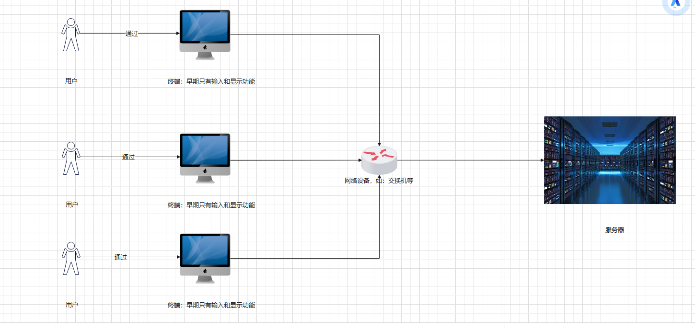

* 随着计算机技术的发展，特别是大规模集成电路的应用以及个人计算机的发展（计算机的价格变得很低，但是功能越来越强大），终端已经不再是单独的物理设备了，而是被键盘和显示器代替。


* 现代计算机中的`控制台（console）`和`终端（tty）`都是虚拟出来的概念，即`键盘`和`显示器`既是控制台（console）也是终端（tty）。

> [!NOTE]
>
> * ① tty 一词来源于 Teletypes，原来指的是电传打字机，因为早期的计算机的发展过程中，有一段时期是使用打字机作为计算机的输入设备。
> * ② 但是，随着时间的推移，打字机已经被键盘所取代，并且现代称为终端较为合适！！！

* 所谓的虚拟，指的是，在 LInux 中，以一种`设备文件`的方式保留 tty 和 console（LInux 的哲学思想：一切皆文件）。当使用特点的远程连接软件（如：xshell 等）连接到 LInux 的时候，就可以看到当前连接所占用的终端设备文件，就表示该机器的几个终端被激活。
* 可以通过如下的命令，查看当前所在终端的类型：

```shell
tty
```

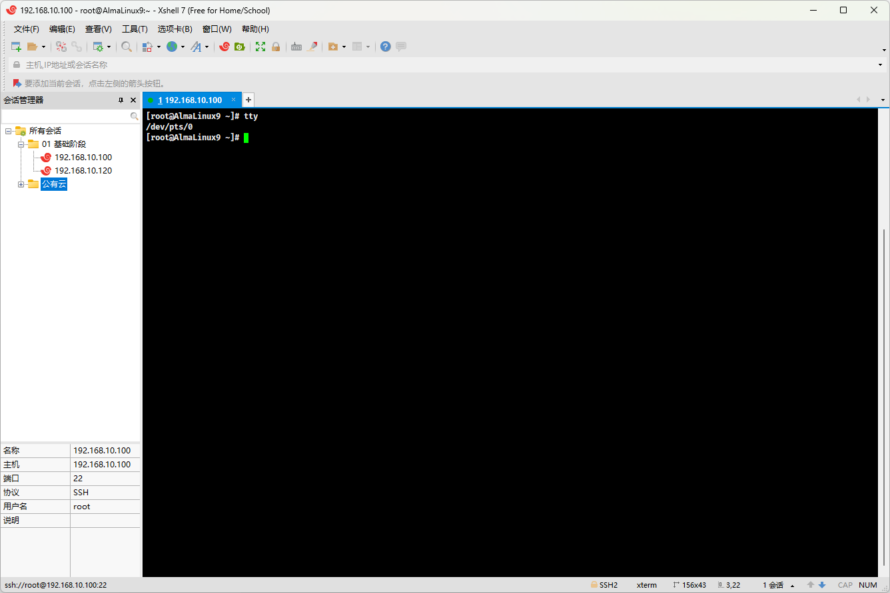

* Linux 中的终端类型有：
  * 控制台终端：/dev/console。
  * ~~串行终端：/dev/ttyS1、/dev/ttyS2 等（几乎被淘汰）~~。
  * 虚拟终端：/dev/tty1、/dev/tty2 等，可以通过 Ctrl+Alt+F1 至 F6 切换。
  * 伪终端：/dev/pts1、/dev/pts2 等，如：通过 xshell 进行远程连接。
  * 图形终端：图形化界面，如：GNOME 终端、Konsole、xterm。
* 它们之间的区别如下：

| 终端类型   | 物理终端（控制台终端）       | 虚拟终端                       | 伪终端                                     | 图形终端                             |
| :--------- | :--------------------------- | :----------------------------- | :----------------------------------------- | :----------------------------------- |
| 定义       | 通过物理设备直接访问的接口。 | 软件实现的多个独立的终端界面。 | 软件实现，模拟终端的功能，用于程序间通信。 | 在图形用户界面下模拟终端的应用程序。 |
| 接口       | 显示器和键盘                 | 显示器和键盘（通过软件访问）   | 虚拟文件接口                               | 通过图形用户界面启动和使用           |
| 访问方式   | 直接访问硬件                 | 通过快捷键切换                 | 通常通过终端仿真器或远程登录访问           | 通过图形用户界面启动和使用           |
| 典型用途   | 系统引导和故障恢复           | 多任务处理、后台任务运行       | 远程终端会话（如：SSH）、终端仿真器内部    | 日常使用、开发工作、系统管理         |
| 多实例支持 | ×                            | √                              | √                                          | √                                    |
| 用户交互   | 低级                         | 文本界面                       | 由使用伪终端的应用定义                     | 图形界面                             |
| 备注       | 服务器的直接控制台访问       | Ctrl+Alt+F1 至 F6 切换         | SSH 远程登录、屏幕、tmux                   | GNOME 终端、Konsole、xterm           |

* 这些终端类型使 Linux 系统具有极高的灵活性和强大的功能，满足不同场景下用户的需求。

## 5.3 字符集和字符集编码

### 5.3.1 概述

* 字符集和字符集编码（简称编码）计算机系统中处理文本数据的两个基本概念，它们密切相关但又有区别。
* 字符集（Character Set）是一组字符的集合，其中每个字符都被分配了一个`唯一的编号`（通常是数字）。字符可以是字母、数字、符号、控制代码（如换行符）等。`字符集定义了可以表示的字符的范围`，但它并不直接定义如何将这些字符存储在计算机中。

> [!NOTE]
>
> ASCII（美国信息交换标准代码）是最早期和最简单的字符集之一，它只包括了英文字母、数字和一些特殊字符，共 128 个字符。每个字符都分配给了一个从 0 到 127 的数字。

* 字符集编码（Character Encoding，简称编码）是一种方案或方法，`它定义了如何将字符集中的字符转换为计算机存储和传输的数据（通常是一串二进制数字）`。简而言之，编码是字符到二进制数据之间的映射规则。

> [!NOTE]
>
> ASCII编码方案定义了如何将 ASCII 字符集中的每个字符表示为 7 位的二进制数字。例如：大写字母`"A"`在ASCII 编码中表示为二进制的`1000001`，十进制的 `65` 。

* `字符集`和`字符集编码`之间的关系如下：

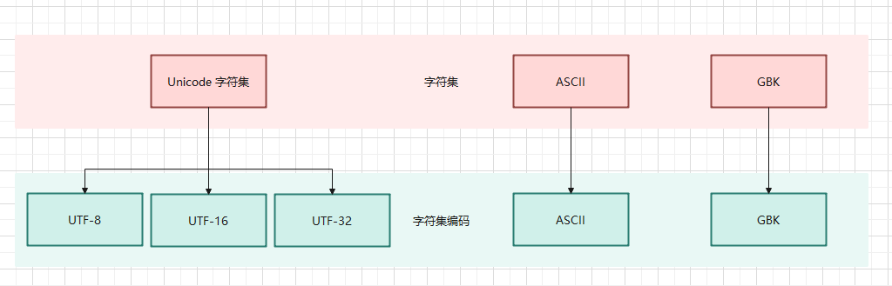

* Linux 中安装帮助手册：

```shell
dnf -y install man-pages
```


### 5.3.2 ASCII 编码

* 从`冯·诺依曼`体系结构中，我们知道，计算机中所有的`数据`和`指令`都是以`二进制`的形式表示的；所以，计算机中对于文本数据的数据也是以二进制来存储的，那么对应的流程如下：

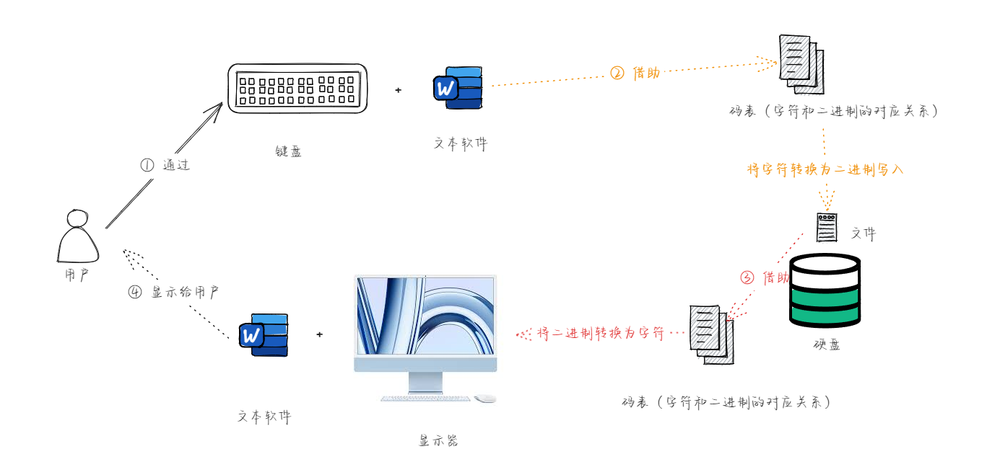

* 我们知道，计算机是上个实际 60 年代在美国研制成功的，为了实现字符和二进制的转换，美国就制定了一套字符编码，即英语字符和二进制位之间的关系，即 ASCII （American Standard Code for Information Interchange）编码：
  * ASCII 编码只包括了英文字符、数字和一些特殊字符，一共 128 个字符，并且每个字符都分配了唯一的数字，范围是 0 - 127。
  * ASCII 编码中的每个字符都使用 7 位的二进制数字表示；但是，计算机中的存储的最小单位是 1 B = 8 位，那么最高位统一规定为 0 。

> [!NOTE]
>
> * ① 其实，早期是没有字符集的概念的，只是后来为了解决乱码问题，而产生了字符集的概念。
> * ② 对于英文体系来说，`a-zA-Z0-9`以及一些`特殊字符`一共 `128` 就可以满足实际存储需求；所以，在也是为什么 ASCII 码使用 7 位二进制（2^7 = 128 ）来存储的。

* 在操作系统中，就内置了对应的编码表，Linux 也不例外；可以使用如下的命令查看：

```shell
man ascii
```


* 其对应的 ASCII 编码表，如下所示：


* 但是，随着计算机的发展，计算机开始了东征之路，由美国传播到东方：


* 先是传播到了欧洲，欧洲在兼容 ASCII 编码的基础上，推出了 ISO8859-1 编码，即：
  * ISO8859-1 编码包括基本的拉丁字母表、数字、标点符号，以及西欧语言中特有的一些字符，如：法语中的 `è`、德语中的 `ü` 等。
  * ISO 8859-1 为每个字符分配一个单字节（8 位）编码，意味着它可以表示最多 256 （2^8）个不同的字符（编号从 0 到 255）。
  * ISO 8859-1 的前 128 个字符与 ASCII 编码完全一致，这使得 ASCII 编码的文本可以无缝转换为 ISO 8859-1 编码。


* 计算机继续传播到了亚洲，亚洲（双字节）各个国家分别给出了自己国家对应的字符集编码，如：
  * 日本推出了 Shift-JIS 编码：
    * 单字节 ASCII 范围：0 - 127。
    * 双字节范围：
      * 第一个字节：129 - 159 和 224 - 239 。
      * 第二个字节：64 - 126 和 128 - 252 。
  * 韩国推出了 EUC-KR 编码：
    * 单字节 ASCII 范围：0 - 127。
    * 双字节范围：从 41281 - 65278。
  * 中国推出了 GBK 编码：
    * 单字节 ASCII 范围：0 - 127。
    * 双字节范围：33088 - 65278 。

> [!NOTE]
>
> * ① 通过上面日本、韩国、中国的编码十进制范围，我们可以看到，虽然这些编码系统在技术上的编码范围存在重叠（特别是在高位字节区域），但因为它们各自支持的字符集完全不同，所以实际上它们并不直接冲突。
> * ② 但是，如果一个中国人通过 GBK  编码写的文章，通过邮件发送给韩国人，因为韩国和中国在字符集编码上的高位字节有重叠部分，必然会造成歧义。

### 5.3.3 Unicode 编码

* 在 Unicode 之前，世界上存在着数百种不同的编码系统，每一种编码系统都是为了支持特定语言或一组语言的字符集。这些编码系统，包括：ASCII、ISO 8859 系列、GBK、Shift-JIS、EUC-KR 等，它们各自有不同的字符范围和编码方式。这种多样性虽然在局部范围内解决了字符表示的问题，但也带来了以下几个方面的挑战：
  * `编码冲突`：由于不同的编码系统可以为相同的字节值分配不同的字符，因此在不同编码之间转换文本时，如果没有正确处理编码信息，就很容易产生乱码。这种编码冲突在尝试处理多种语言的文本时尤为突出。
  * `编码的复杂性`：随着全球化的发展，软件和系统需要支持越来越多的语言，这就要求开发者和系统同时处理多种不同的编码系统。这不仅增加了开发和维护的复杂性，而且也增加了出错的风险。
  * `资源限制`：在早期计算机技术中，内存和存储资源相对有限。不同的编码标准要求系统存储多套字符集数据，这无疑增加了对有限资源的消耗。
  * ……
* 针对上述的种种问题，为了推行全球化，Unicode 应运而生，Unicode 的核心规则和设计原则是建立一个全球统一的字符集，使得世界上所有的文字和符号都能被唯一地识别和使用，无论使用者位于何地或使用何种语言。这套规则包括了字符的编码、表示、处理和转换机制，旨在确保不同系统和软件间能够无缝交换和处理文本数据。
  *  `通用字符集 (UCS)`：Unicode 为每一个字符分配一个唯一的编号（称为`“码点”`）。这些码点被组织在一个统一的字符集中，官方称之为 “通用字符集”（Universal Character Set，UCS）。码点通常表示为 `U+` 后跟一个十六进制数，例如：`U+0041` 代表大写的英文字母 `“A”`。
  * `编码平面和区段`：Unicode 码点被划分为多个 “平面（Planes）”，每个平面包含 65536（16^4）个码点。目前，Unicode定义了 17 个平面（从 0 到16），每个平面被分配了一个编号，从 “基本多文种平面（BMP）” 的 0 开始，到 16 号平面结束。这意味着 Unicode 理论上可以支持超过 110万（17*65536）个码点。
* Unicode 仅仅只是字符集，给每个字符设置了唯一的数字编号而已，却没有给出这些数字编号实际如何存储，可以通过如下命令查看：

```shell
man unicode
```


* 为了在计算机系统中表示 Unicode 字符，定义了几种编码方案，这些方案包括 UTF-8、UTF-16 和 UTF-32 等。
  * **UTF-8**：使用 1 - 4 个字节表示每个 Unicode 字符，兼容 ASCII，是网络上最常用的编码。
  * **UTF-16**：使用 2 - 4 个字节表示每个 Unicode 字符，适合于需要经常处理基本多文种平面之外字符的应用。
  * **UTF-32**：使用固定的 4 个字节表示每个 Unicode 字符，简化了字符处理，但增加了存储空间的需求。
* `Unicode 字符集`和对应的`UTF-8 字符编码`之间的关系，如下所示：


### 5.3.4 语言环境

* 我们当前的语言环境是中文，可以通过如下的命令查看：

```shell
localectl status
```

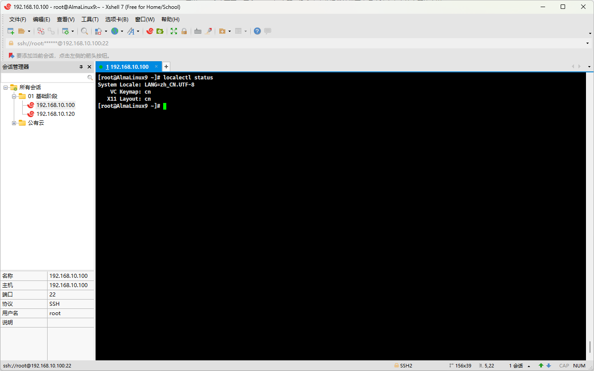

* 也可以通过如下的命令查看：

```shell
echo $LANG
```


* 我们可以通过如下的命令，查看当前系统默认 locale 的详细信息：

```shell
locale
```

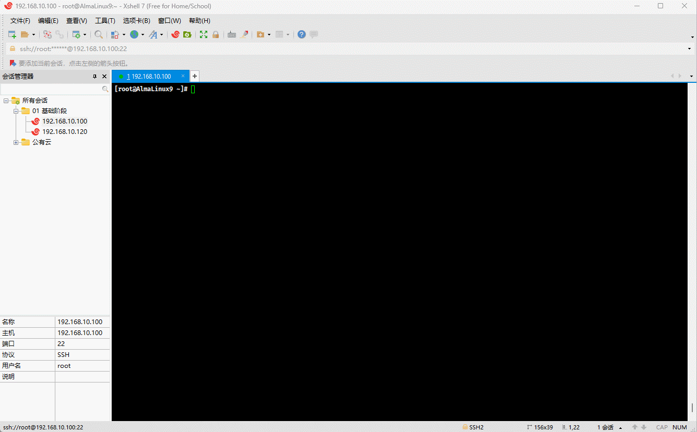

* 其对应的内容如下：

```txt
LANG=zh_CN.UTF-8 # 语言，其中 zh_CN.UTF-8 表示 语言_地区.字符集编码
LC_CTYPE="zh_CN.UTF-8"  # 语言符号及其分类
LC_NUMERIC="zh_CN.UTF-8" # 数字
LC_TIME="zh_CN.UTF-8" # 时间显示格式
LC_COLLATE="zh_CN.UTF-8" # 比较和排序习惯
LC_MONETARY="zh_CN.UTF-8" # 货币单位
LC_MESSAGES="zh_CN.UTF-8" # 信息，主要是提示信息、错误信息、菜单等
LC_PAPER="zh_CN.UTF-8" # 默认纸张的尺寸大小
LC_NAME="zh_CN.UTF-8" # 姓名
LC_ADDRESS="zh_CN.UTF-8" # 地址
LC_TELEPHONE="zh_CN.UTF-8" # 电话号码
LC_MEASUREMENT="zh_CN.UTF-8" # 度量衡表达方式
LC_IDENTIFICATION="zh_CN.UTF-8" # 对 locale 自身包含信息的概述
LC_ALL=
```

* 我们可以通过如下的命令，查看当前系统所有英文的 locale ：

```shell
localectl list-locales | grep en
```

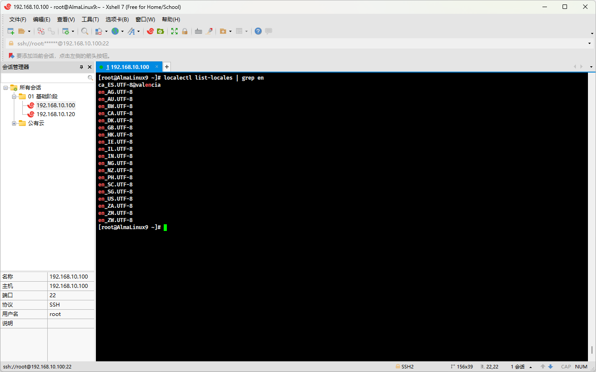

* 搜索英文语言包：

```shell
dnf search locale en
```

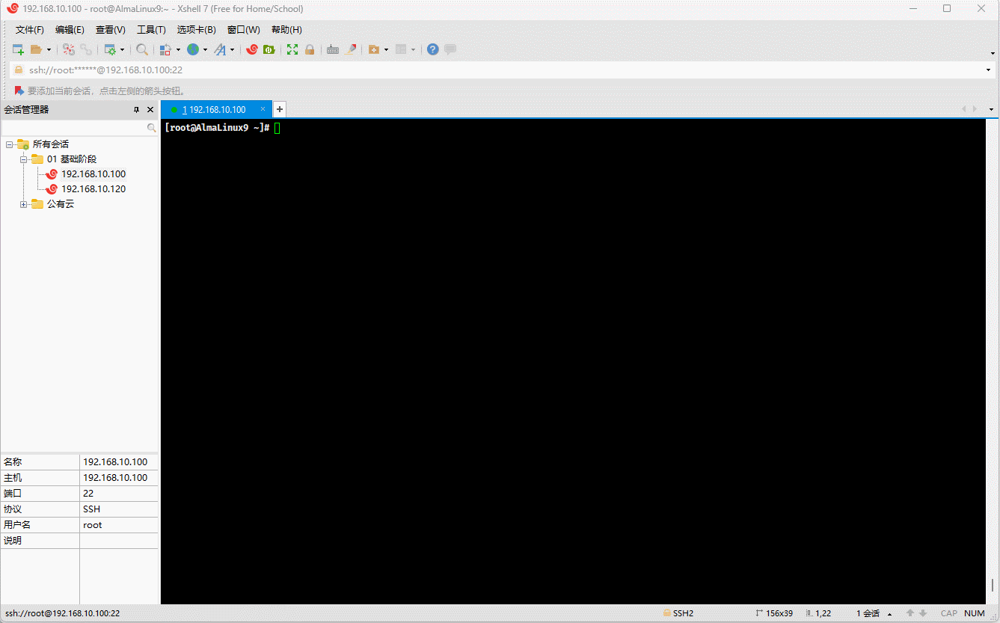

* 安装英文语言包：

```shell
dnf -y install glibc-langpack-en
```

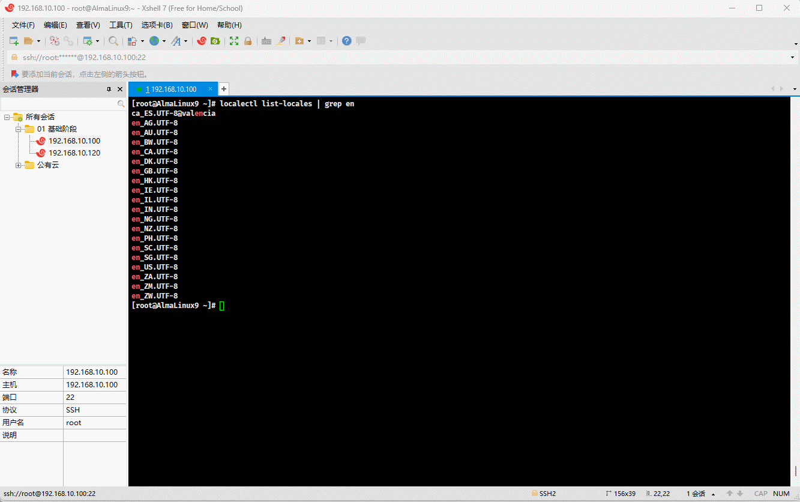

* 切换 locale 为英文：

```shell
localectl set-locale LANG=en_US.UTF-8
```


* 手动加载配置文件，使其生效：

```shell
source /etc/locale.conf
```


