# 第一章：提问的艺术

## 1.1 提问的艺术

* 提问的艺术是指能够提出恰当的问题，以获得所需的信息、启发他人思考或促进对话。提问的艺术不仅在人际沟通中很重要，在学习、工作和研究等领域也发挥着重要作用。
* 以下是一些提问的艺术技巧：
  - **明确你的目的。** 在提问之前，先想清楚你想要获得什么信息或达到什么目的。这将帮助你提出更具体和有针对性的问题。
  - **使用开放式问题。** 开放式问题以“什么”、“为什么”、“如何”等词语开头，可以鼓励对方提供更详细和深入的回答。
  - **避免使用封闭式问题。** 封闭式问题以“是”或“否”回答，限制了对方的回答范围，也可能让对方感到被审问。
  - **关注细节。** 提出具体和详细的问题，以获得更准确和有用的信息。
  - **使用积极的措辞。** 避免使用负面或带有攻击性的措辞，以免引起对方的反感或抵触情绪。
  - **注意你的语气和态度。** 提问时要保持礼貌和尊重，并注意你的语气和态度。
  - **学会倾听。** 在对方回答问题时，要认真倾听并给予反馈。这将表明你在乎他们的回答，并鼓励他们继续分享信息。
  - **不要害怕提问。** 提问是获取信息和学习新知识的重要方式。不要害怕提问，即使你认为你的问题很愚蠢或很基本。

* 其实，总结起来就下面的 4 个步骤（:star:）：

| 提问的艺术                                         | 备注                                                 |
| -------------------------------------------------- | ---------------------------------------------------- |
| ① `简单客气下，同时直奔主题。`                     | 直接描述自己遇到的问题是什么？                       |
| ② `如果着急，可以多找几个人，或者多找几个交流群。` | 广撒网捕鱼。                                         |
| ③ `如何让高手愿意帮助我们？`                       | 每次在问题解决后，总结并发给对方，无论对方是否回应。 |
| ④ `如何总结和描述问题？`                           | 使用 STAR 法则。                                     |

## 1.2 STAR 法则

* STAR 法则是一种用于描述工作经历或技能的常用方法，它可以帮助我们清晰、简洁地向面试官或其他人展示我们的能力和成就。
* `换言之，STAR 法则可以增强我们表达问题的能力，以及描述问题的逻辑性`。
* STAR 法则的四个字母分别代表：

| STAR 法则            | 备注                                                       |
| -------------------- | ---------------------------------------------------------- |
| **S**ituation (情境) | 描述我们所面临的情况或挑战。                               |
| **T**ask (任务)      | 解释我们所需要完成的任务或目标。                           |
| **A**ction (行动)    | 详细说明我们采取的具体行动或步骤来完成任务。               |
| **R**esult (结果)    | 描述我们所取得的成果或成就，以及我们从中学到的经验和教训。 |


* 示例：

```
情境：我正在使用 xshell7 远程连接 VMware 中的 Linux 系统，但是遇到了连接不上的问题。
```

```
任务：诊断并解决连接问题，以便能够成功远程连接到 Linux 系统。
```

```
行动（步骤）：
  ① 我首先检查了我的网络连接，确保我的电脑和 VMware 都连接到了同一个网络。
  ② 然后，我检查了 xshell7 的配置，确保我输入了正确的连接信息，包括主机名或 IP 地址、端口号和用户名/密码。
  ③ 我还检查了 VMware 的防火墙设置，确保它允许来自 xshell7 的连接。
  ④ 此外，我尝试使用不同的连接协议，例如：SSH 和 Telnet，以排除连接协议的问题。
  ⑤ 我还尝试使用不同的端口号，以排除端口号冲突的问题。
```

```
结果：还是连接不上，问题到底在哪里？
```


# 第二章：Linux 核心目录

## 2.1 扫清概念

* `文件夹`和`目录`本质上是`相同`的，它们都是用于组织和存储文件的`容器`。

> [!NOTE]
>
> 通常而言，`/` 被称为`斜线`，而 `\` 被称为`反斜线`，如下所示：
>
> 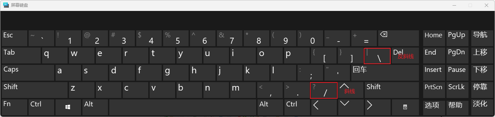

## 2.2 概述

* 在 Linux 中的目录都是从根目录（`/`）开始的，Linux 的目录类似于一颗`倒挂`的树，如：

```shell
tree -L 1 /
```


* 其对应的`目录树状结构`，类似于：


> [!IMPORTANT]
>
> * ① `/` 是根目录。
> * ② `/etc/` 中的第一个 `/` 是根目录，`etc` 是目录名，第二个 `/` 表示是目录；并且，第二个 `/` 可以省略。
> * ③ 在实际交流的时候，我们可能会模糊这些概念，直接说 `/etc` 目录。


## 2.3 Linux 核心目录（:star:）

* Linux 的核心目录如下：

| 核心目录 | 备注                                                         |
| -------- | ------------------------------------------------------------ |
| `/etc/`  | 系统服务`配置文件`的目录，存放系统、服务、命令的配置；通常，yum 或 rpm 安装的软件的配置都在该目录中。 |
| `/home/` | 普通用户的家目录，如：`x` 用户的家目录就是 `/home/x/`。      |
| `/root/` | root 用户的家目录，如：`root` 用户的家目录就是 `/root/`。    |
| `/dev/`  | dev 是 device 的缩写，是设备文件目录，如：硬盘等。           |
| `/tmp/`  | tmp 是 temp 的缩写，表示临时目录，用来存储程序运行中的临时文件等。 |
| `/proc/` | proc 是 process（进程）的缩写，表示虚拟的目录，它是系统内存的映射，存放的是内存中的信息、进程、服务信息以及内核信息等。 |

> [!NOTE]
>
> * ① 对于 Linux 中的目录，官方是有[标准](https://www.pathname.com/fhs/)（文件系统分层结构，LSB（Linux Standard Base））的。
> * ② 在实际工作中，通常所说的`文件名或目录大小写敏感`指的是`文件名或目录区分大小写`。
> * ③ 在实际工作中，可能会有人说：Linux 系统是区分大小写的，而 Win 系统是不区分大小写的；这种说法，某种意义上是错误的，因为不是操作系统区分大小写，而是操作系统下的`某些文件系统区分大小写`，比如：Linux 系统就可以挂载 NTFS 文件系统，而 NTFS 文件系统就是不区分大小写的（win 默认的文件系统）。

## 2.4 Linux 中的目录

* 可以通过如下的命令，查看 Linux 中根目录下的一级子目录：

```shell
tree -L 1 /
```

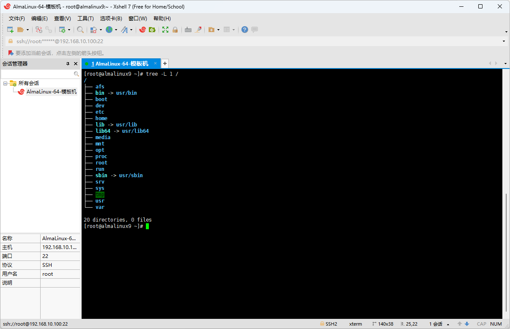

* 其内容的简要解释，如下所示：

```shell
afs # 通常用于存放 Andrew 文件系统（AFS）相关的文件和数据。
bin -> usr/bin # 存放系统必需的二进制可执行文件，例如：常用的命令（ls, cp, mv 等）。这个目录通常是一个符号链接，指向 /usr/bin。
boot # 包含启动加载程序和内核文件，例如：GRUB 配置文件和启动镜像。
dev # 包含设备文件，这些文件表示系统中的设备，如：硬盘、CD-ROM、打印机等。
etc # 存放系统配置文件和脚本。例如：网络配置文件，用户密码文件等。
home # 用户的家目录。通常每个用户都会在这里有一个以其用户名命名的目录。
lib -> usr/lib # 存放系统和应用程序的共享库文件。这个目录通常是一个符号链接，指向 /usr/lib。
lib64 -> usr/lib64 # 存放 64 位系统和应用程序的共享库文件。这个目录通常是一个符号链接，指向 /usr/lib64。
media # 通常用于挂载可移动媒体，如：USB 驱动器、CD-ROM 等。
mnt # 通常用于临时挂载文件系统，如：挂载硬盘分区或网络文件系统。
opt # 用于安装附加的可选软件包，通常是一些第三方软件或自定义应用程序的安装位置。
proc # 一个虚拟文件系统，提供系统运行时信息，例如：系统内存、硬件配置、进程信息等。
root # 超级用户（root 用户）的家目录。
run # 存放应用程序运行时的文件，例如：进程 ID 文件（PID文件）和套接字文件。这个目录是系统引导时临时文件存储的地方。
sbin -> usr/sbin # 这是一个符号链接，指向 usr/sbin 目录。sbin 目录包含系统管理命令，通常仅由 root 用户使用。
srv # 存放服务数据。这个目录用来存放一些特定的服务，如：Web 服务器、FTP 服务器的数据文件。
sys # 一个虚拟文件系统，提供有关内核、设备和文件系统的信息，类似于 /proc。
tmp # 用于存储临时文件，系统和用户程序可以在这里创建临时文件。
usr # 包含用户级的应用程序和文件，包括：二进制文件、库文件、文档等。这个目录是许多子目录（如：/usr/bin，/usr/lib 等）的根目录。
var # 存放经常变化的文件，如：日志文件、缓存文件、锁文件、邮件队列等。
```

* 其内容的详细解释，如下所示：

| Linux 中的目录          | 备注                                                         |
| ----------------------- | ------------------------------------------------------------ |
| `/bin` -> `/usr/bin/`   | bin 表示 binary ，即二进制文件命令，普通用户经常使用的命令，如：`ping` 命令。 |
| `/sbin`-> `/usr/sbin/`  | s 是 super（超级）的缩写，即 root 用户才可以使用的命令，如：`shutdown` 命令和 `reboot` 命令。 |
| `/boot/`                | 存放的是 Linux 系统启动和引导相关文件的目录，如：引导系统启动程序、系统内核镜像等。 |
| `/dev/`                 | dev 是 device 的缩写，是设备文件目录，如：`/dev/cpu`、`/dev/mem` 等。 |
| `/etc/`                 | 系统服务`配置文件`的目录，存放系统、服务、命令的配置。       |
| `/home/`                | 普通用户的家目录，如：`x` 用户的家目录就是 `/home/x/`。      |
| `/root/`                | root 用户的家目录，如：`root` 用户的家目录就是 `/root/`。    |
| `/lib` -> `/usr/lib/`   | lib 是 library 的缩写，即库文件（服务软件的依赖），其作用类似于 Windows 里的 DLL 文件；其中 `.so` 是软件运行需要的环境。 |
| `/sbin` -> `/usr/sbin/` | 作用和 lib 目录一样，只不过存放的是 64 位库文件（服务软件的依赖）。 |
| `/mnt/`                 | `mnt` 是 `mount tempoary` 的缩写，临时挂载点，临时的入口。   |
| `/opt/`                 | opt 是 optional(可选) 的缩写，第三方软件的安装位置，如：MySQL 等。 |
| `/proc/`                | proc 是 process（进程）的缩写，表示虚拟的目录（不占硬盘空间），它是系统内存的映射，存放的是内存中的信息、进程、服务信息以及内核信息等。 |
| `/sys/`                 | 和 /proc 类似，表示虚拟的目录（不占硬盘空间），用于展示系统硬件信息、管理硬件设备、调整内核参数、控制设备驱动程序以及进行电源管理等。它是内核对象的映射，允许用户和程序以文件系统的方式访问和控制这些内核对象。 |
| `/tmp/`                 | tmp 是 temp 的缩写，表示临时目录，用来存储程序运行中的临时文件等。 |
| `/usr/`                 | usr 是 unix shared resources(共享资源) 的缩写，存放的是用户软件安装的位置，类似于 windows 下的 program files 目录。 |
| `/var/`                 | var 是 variable 的缩写，用来存放经常变化的数据，经常用来保存应用程序的日志。 |

## 2.5 路径表现形式（⭐）

* Linux 下的路径表示形式有如下的两种：

| Linux 路径表现形式 | 说明                                                         | 建议                             |
| ------------------ | ------------------------------------------------------------ | -------------------------------- |
| 绝对路径           | 从`根目录`开始的路径都是绝对路径，如：`/usr/local`、`/etc/hostname` 等。 | 初步学习阶段，推荐使用绝对路径。 |
| 相对路径           | 不是从根目录开始的路径就是相对路径，如：`etc/`、`etc/hostname`。 | 熟练以后，可以使用相对路径。     |

> [!IMPORTANT]
>
> 路径中的 `.` 或 `./` 表示的是`当前目录`，而 `..` 和`../` 表示的是`上一层目录`。

> [!NOTE]
>
> `相对路径`和`绝对路径`的理解：
>
> * 我目前所在的位置在`中国江苏省南京市六合区钟秀嘉园xxx栋xxx室`，其中`中国江苏省南京市六合区钟秀嘉园xxx栋xxx室`就是绝对路径。
> * 我目前所在的位置在`盛和家园`（中国江苏省南京市六合区盛和家园）附近的``钟秀嘉园xxx栋xxx室``，其中`盛和家园附近的钟秀嘉园xxx栋xxx室`就是相对路径。


* 示例：绝对路径

```shell
# /etc/NetworkManager/system-connections/eth0.nmconnection 就是绝对路径
cat /etc/NetworkManager/system-connections/eth0.nmconnection
```


* 示例：相对路径

```shell
cd /etc/NetworkManager/system-connections/
# eth0.nmconnection 就是相对路径
cat eth0.nmconnection
```


# 第三章：Linux 必会命令

## 3.1 cd 命令（⭐）

* 命令：

```shell
cd [目录]
```

> [!NOTE]
>
> * 对应的英文：change directory 。
> * 作用：进入（切换）到指定的目录（可以是绝对路径或相对路径）中。

> [!IMPORTANT]
>
> * 如果目录省略，即 `cd` ，就是默认进入当前用户的 shell 变量 HOME 所在目录，即家目录。
> * 如果目录为 `~`，即 `cd ~`，也是 默认进入当前用户的 shell 变量 HOME 所在目录，即家目录。
> * 如果目录为 `-`，即 `cd -`，是切换到上次所在位置（了解）。


* 示例：切换到用户的家目录

```shell
cd
```


* 示例：切换到用户的家目录

```shell
cd ~
```


* 示例：切换根目录

```shell
cd /
```

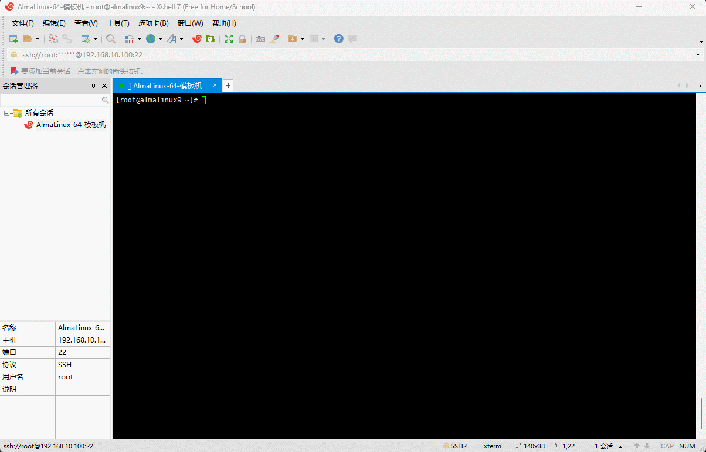


* 示例：切换上一级目录

```shell
# 等价于 cd ..
cd ../
```


* 示例：切换上一级目录的上一级目录

```shell
cd ../../
```


* 示例：切换到指定的目录

```shell
cd /etc/NetworkManager/system-connections/
```


## 3.2 pwd 命令（⭐）

* 命令：

```shell
pwd
```

> [!NOTE]
>
> * 对应的英文：print working directory。
> * 功能：显示当前所在位置（以绝对路径方式显示）。


* 示例：

```shell
pwd
```

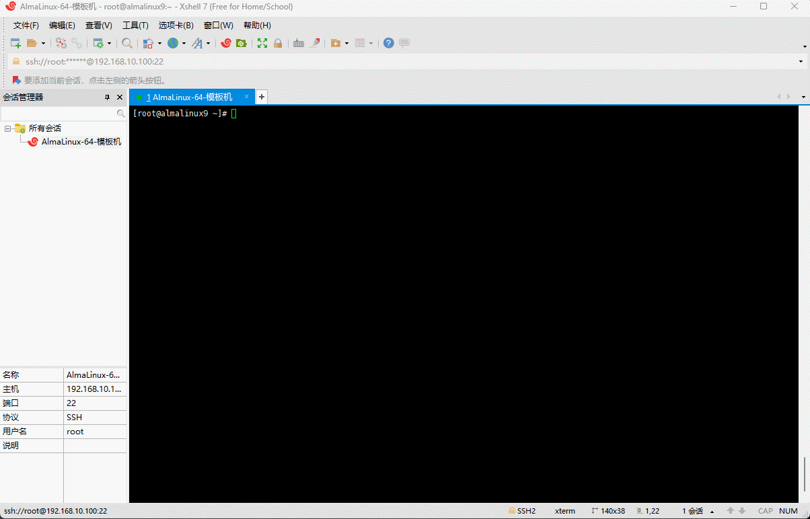

## 3.3 mkdir 命令（⭐）

* 命令：

```shell
mkdir [-p][-v] 目录 ...
```

> [!NOTE]
>
> * 功能：创建目录。
>
> * 对应的英文：make directory 。
>
> * 选项：
>
>   * `-p`，`--parents`：创建多级目录。
>   * `-v`，`--verbose`：每次创建新目录都显示信息。


* 示例：创建一级目录

```shell
mkdir demo
```

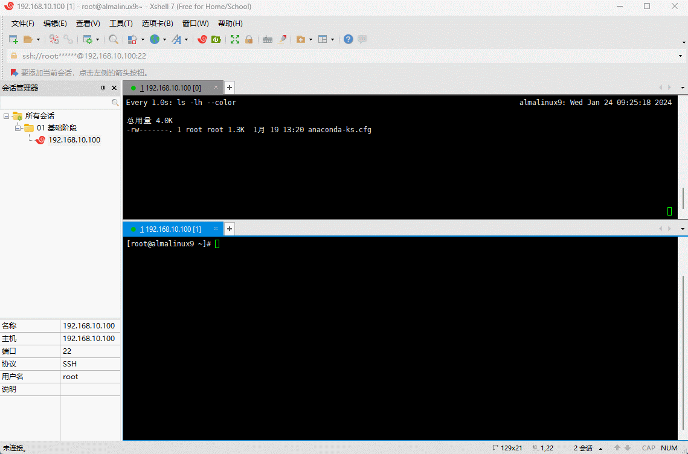


* 示例：创建多级目录

```shell
mkdir -pv demo/a/b
```

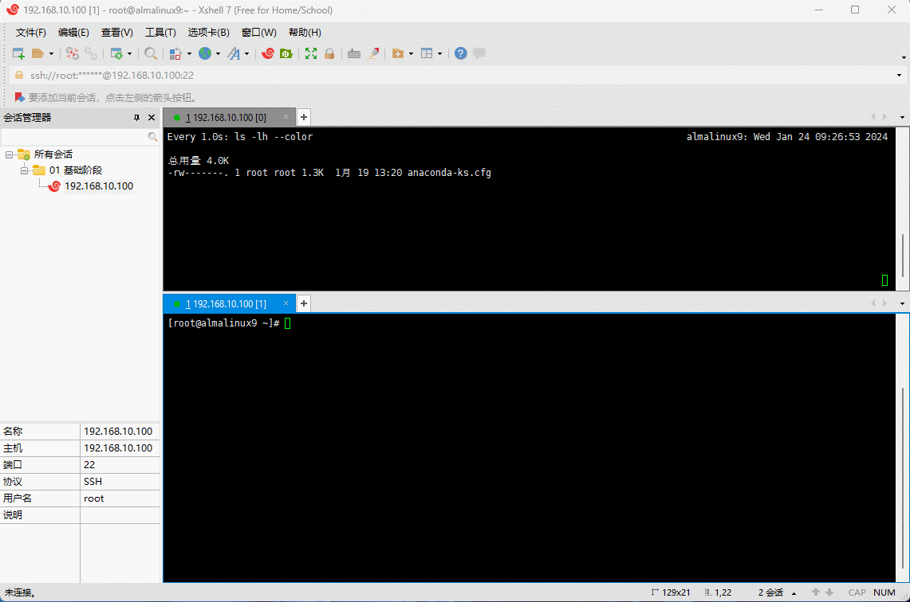

## 3.4 touch 命令（⭐）

* 命令：

```shell
touch 文件 ...
```

> [!NOTE]
>
> 功能：创建空文件。

> [!IMPORTANT]
>
> * ① 如果文件中包含路径，必须存在父目录；否则，将会报错。
> * ② touch 除了创建空文件之外，还有刷新文件的时间的功能，如：atime（access time）、mtime（modify time） 和 ctime（change time） 。


* 示例：创建单个文件

```shell
cd /tmp/
```

```shell
touch a.txt
```


* 示例：创建多个文件

```shell
touch /tmp/a.txt /tmp/b.txt
```

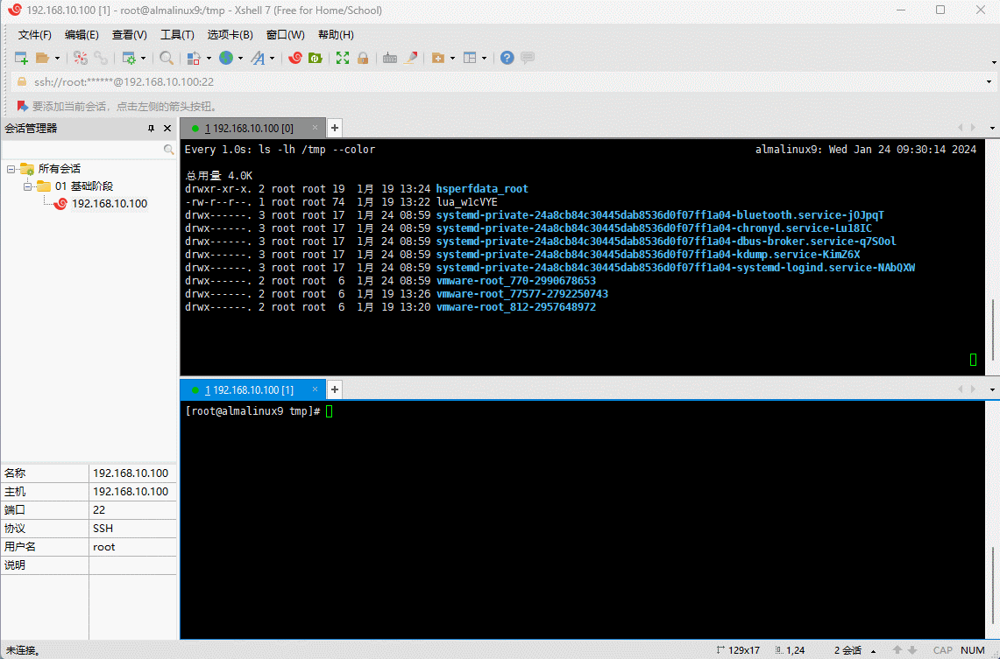

## 3.5 ls 命令（⭐）

* 命令：

```shell
ls [-l][-a][-h][-r][-t] [目录|具体的文件]
```

> [!NOTE]
>
> * 功能：显示文件列表。
> * 对应的英文：list 。
> * 选项：
>   * `-l` ：以 long（长格式）显示，即显示详细信息，如：文件时间、大小、所有者。
>   * `-a`，`--all`：显示所有文件和目录，包括隐藏文件或目录。
>   * `-h`，`--human-readable`：以人类可读形式显示大小，如：1.5K、4.0K 。
>   * `-t`，`--time`：按照修改时间排序。
>   * `-r`，`--reverse`：逆序排序，通常和`-t` 配合使用，默认按照字母大小排序。

* 类似于 windows 中的`文件资源管理器`：

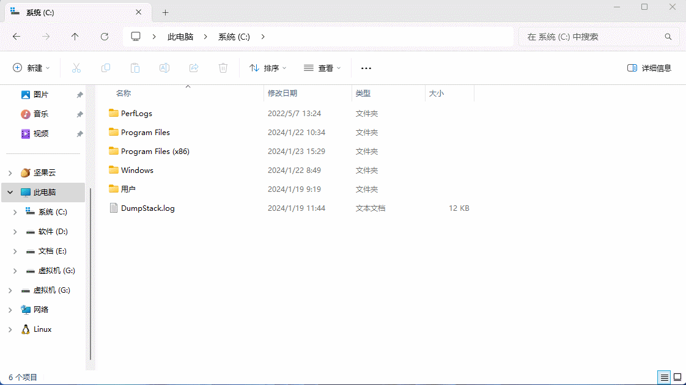

> [!NOTE]
>
> * ① `ls -l` 的别名是 `ll` ；所以，某种意义上讲，`ls -l` 和 `ll` 是等价的；但是，不是所有 Linux 都是这样。
> * ② 如果没有指定参数`[目录|具体的文件]`，那么就是列出当前目录的文件列表；换言之，就是 `.` 或 `./`。


* 示例：

```shell
ls /
```


* 示例：以 long（长格式）显示（常用）

```shell
# 等价于 ll /
ls -l /
```


* 示例：按照文件的修改时间排序，最新的文件和目录在最上面（默认是按照字母顺序从 a ~ z 排序）

```shell
ll -t /
```


* 示例：根据文件的修改时间逆序排序（常用）

```shell
ll -lt /
```


* 示例：以人类可读形式显示大小

```shell
ll -h /
```

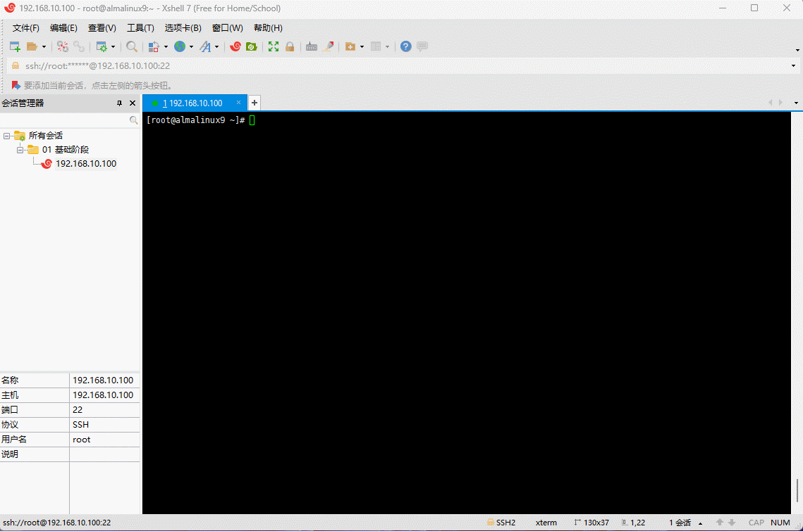


* 示例：显示所有文件和目录

```shell
ll -ah /
```


## 3.6 mv 命令（⭐）

* 命令：

```shell
mv [-b][-f] 源文件|目录 目标文件|目标目录
```

> [!NOTE]
>
> * 功能：移动文件和目录、重命名文件和目录。
> * 对应的英文：move 。
> * 选项：
>   * `-b`：如果需要覆盖文件，则覆盖前先备份。
>   * `-f`：如果目标文件和现有文件重名，则直接覆盖。

> [!IMPORTANT]
>
> * ① mv 命令类似于`剪切并粘贴`。
>
> * ② 如果`文件所在目录`和`目标目录`是`同一个目录`，就是`重命名`。
> * ③ 如果目标文件或目标目录不存在，则 mv 命令将创建它。如果目标文件或目标目录已经存在，则 mv 命令将覆盖它。


* 示例：移动文件

```shell
mkdir -pv /tmp/back
```

```shell
mv /tmp/a.txt /tmp/back/
```

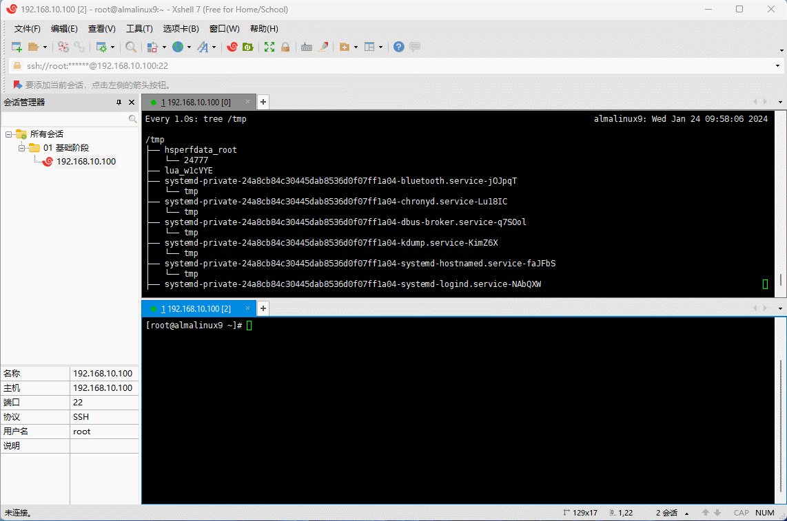


* 示例：重命名文件

```shell
mv /tmp/a.txt /tmp/b.txt
```

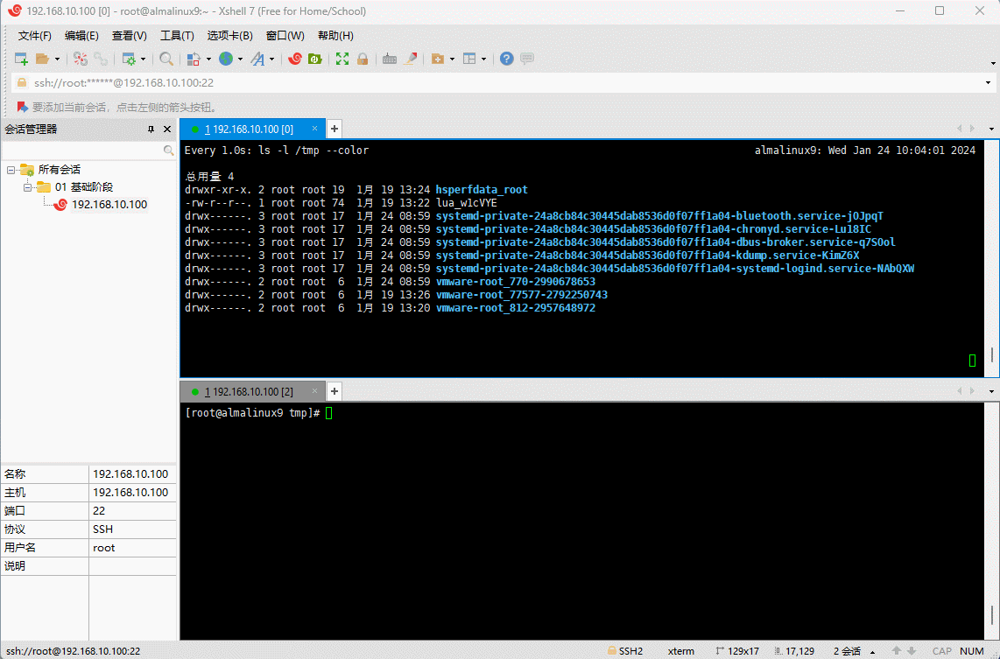


* 示例：移动目录

```shell
mkdir -pv /tmp/a /tmp/back
```

```shell
mv /tmp/a /tmp/back
```


* 示例：移动目录下的所有文件到指定目录

```shell
mkdir -pv /tmp/a/b/c /tmp/back
```

```shell
touch /tmp/a/{1..10}.txt 
```

```shell
mv /tmp/a/* /tmp/back
```


* 示例：强制覆盖指定文件（慎用！！！）

```shell
mkdir -pv /tmp/back
```

```shell
touch /tmp/a.txt /tmp/back/a.txt
```

```shell
mv -f /tmp/a.txt /tmp/back/a.txt
```

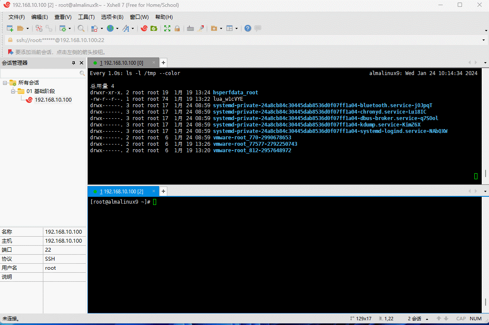


* 示例：覆盖前备份（推荐！！！）

```shell
mkdir -pv /tmp/back
```

```shell
touch /tmp/a.txt /tmp/back/a.txt
```

```shell
mv -bf /tmp/a.txt /tmp/back/a.txt
```

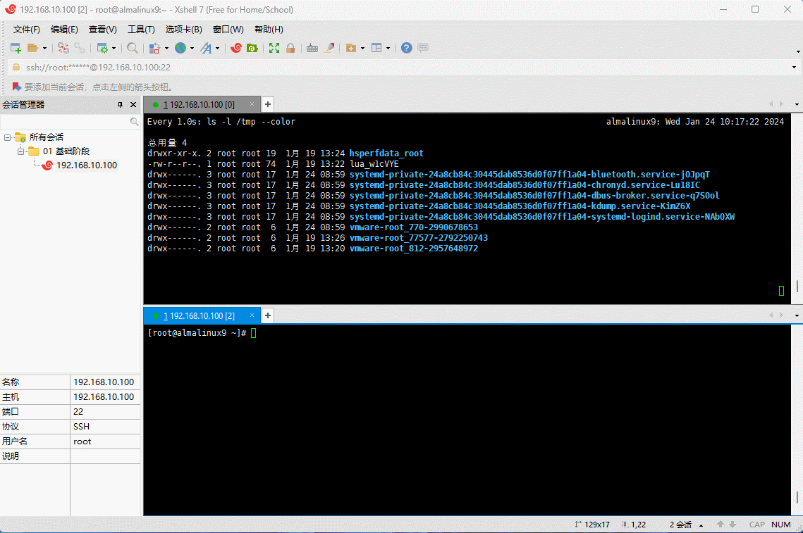

## 3.7 cp 命令（⭐）

* 命令：

```shell
cp [-r|-R][-p][-d][-a] 源文件|目录 目标文件|目标目录
```

> [!NOTE]
>
> * 功能：复制文件或目录。
> * 对应的英文：copy 。
> * 选项：
>   * `-r|-R`，`--recursive`：递归赋值，复制目录及其目录中的内容。
>   * `-p`：复制的时候保留源文件或目录的属性（默认情况是：模式、所有权、时间戳）。
>   * `-d`：复制文件或目录的同时，复制软链接。
>   * `-a`：复制所有，相当于 `-dpr` 。

> [!IMPORTANT]
>
> cp 默认是不能复制目录的，除非加上 `-R` 或 `-r` 选项。


* 示例：

```shell
cp /etc/hostname /tmp/
```


* 示例：

```shell
cp -R /etc/ /tmp/
```


## 3.8 rm 命令（⭐）

* 命令：

```shell
rm [-r][-f] 文件|目录 ...
```

> [!NOTE]
>
> * 功能：删除文件或目录。
> * 对应的英文：remove 。
> * 选项：
>   * `-f`，`--force`：强制删除不提示，非常危险⚠️。
>   * `-r|-R`，`--recursive`：递归删除目录及其内容，非常危险⚠️。

> [!CAUTION]
>
> * ① `rm` 命令非常危险，使用的时候要慎重！！！
> * ② `rm -rf xxx` 超级危险，使用的时候，没有需求就不要加上 `-r`或 `-f`。


* 示例：删除文件（强制删除不提示）

```shell
touch /tmp/a.txt
```

```shell
rm -f /tmp/a.txt
```


* 示例：删除目录（超级危险，使用的时候慎重！！！）

```shell
cp -R /etc /tmp/
```

```shell
rm -rf /tmp/etc
```


## 3.9 echo 命令（⭐）

* 命令：

```shell
echo 字符串|变量 ...
```

> [!NOTE]
>
> 功能：输出字符串或变量到屏幕。

> [!IMPORTANT]
>
> `echo` 可以和 `>` 或 `>>` 符号一起使用。
>
> * ① `>` 被称为`重定向`符号，即先清空文件内容，再写入。
> * ② `>>` 被称为`追加重定向`符号，即将信息写入到文件的末尾。 
> * ③ `重定向`就是`改变数据输出的方向`；在默认情况下，都是输出到屏幕上的。
> * ④ `重定向`不仅仅有 `>` 、`>>` ，其实还有 `|（管道）` 等。
>
> `echo` 可以和 `{}` 一起简单使用，如：`echo {1..10}` ，此时的 `{} `被称为生成序列。
>
> `{}` 也可以用来和 `touch` 或 `mkdir` 一起配合使用，用来批量生成文件或目录。


* 示例：输出字符串

```shell
echo "HelloWorld"
```

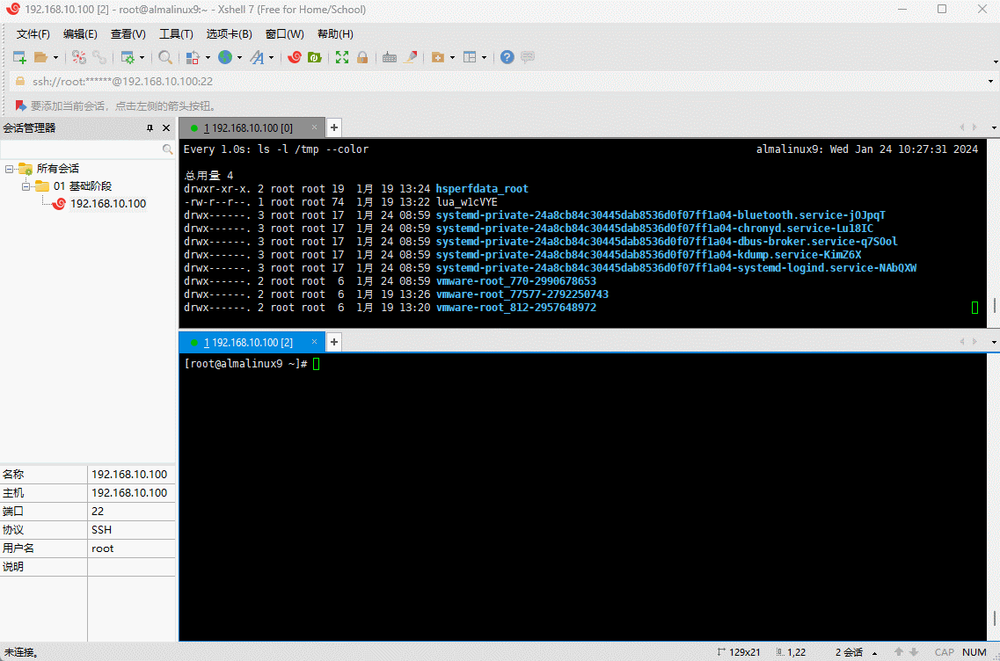


* 示例：输出内容到文件中

```shell
echo "HelloWorld" > /tmp/a.txt
```


* 示例：批量输出数字

```shell
echo {1..10}
```

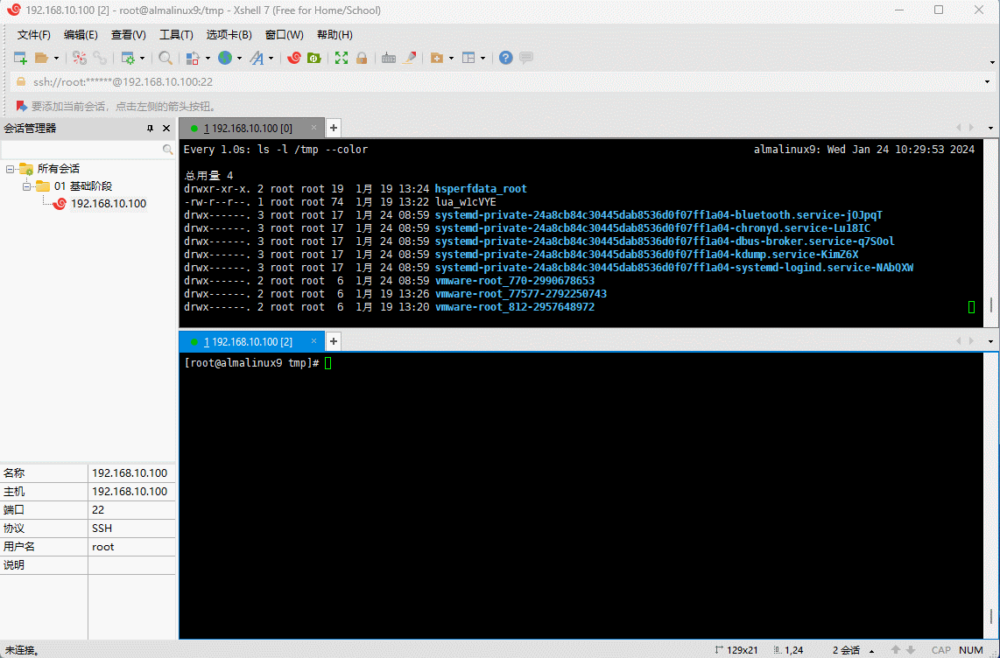


* 示例：批量输出数字

```shell
echo xudaxian{01..10}
```


* 示例：批量输出字符

```shell
echo {a..z}
```

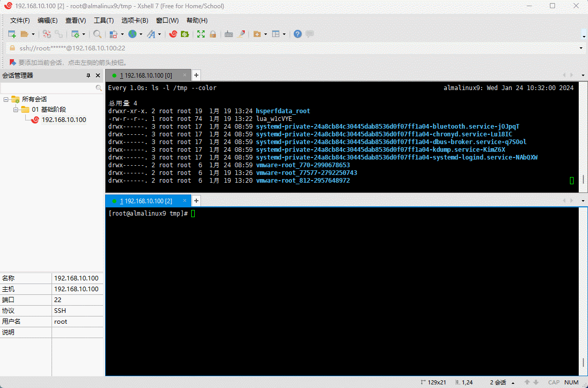


* 示例：批量输出字符

```shell
echo {A..Z}
```


* 示例：批量生成文件

```shell
touch /tmp/{01..10}.txt
```

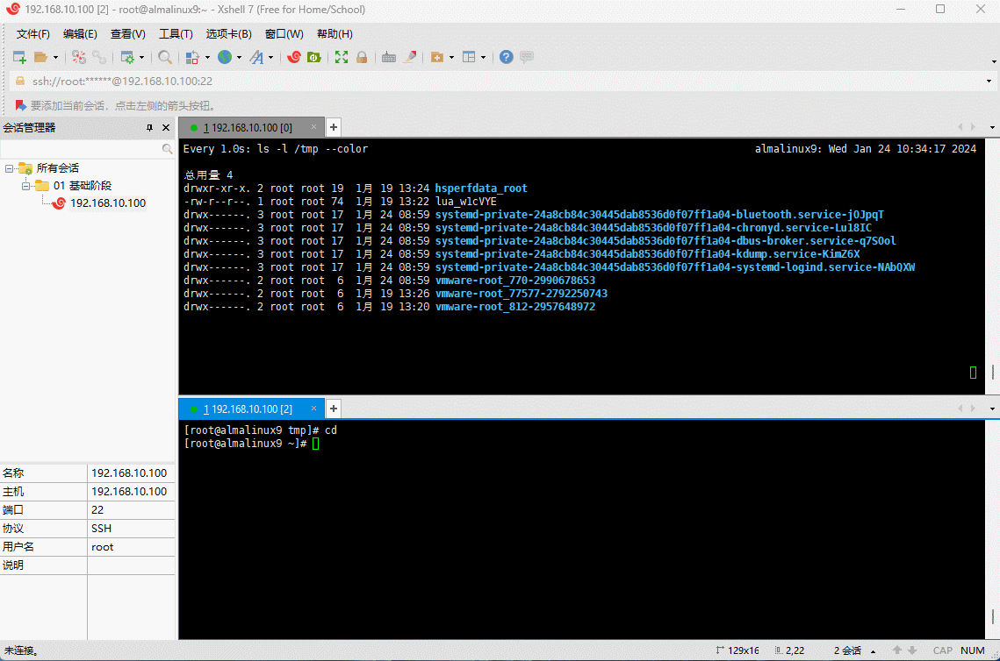


* 示例：批量生成文件夹

```shell
mkdir -pv /tmp/{01..10}
```

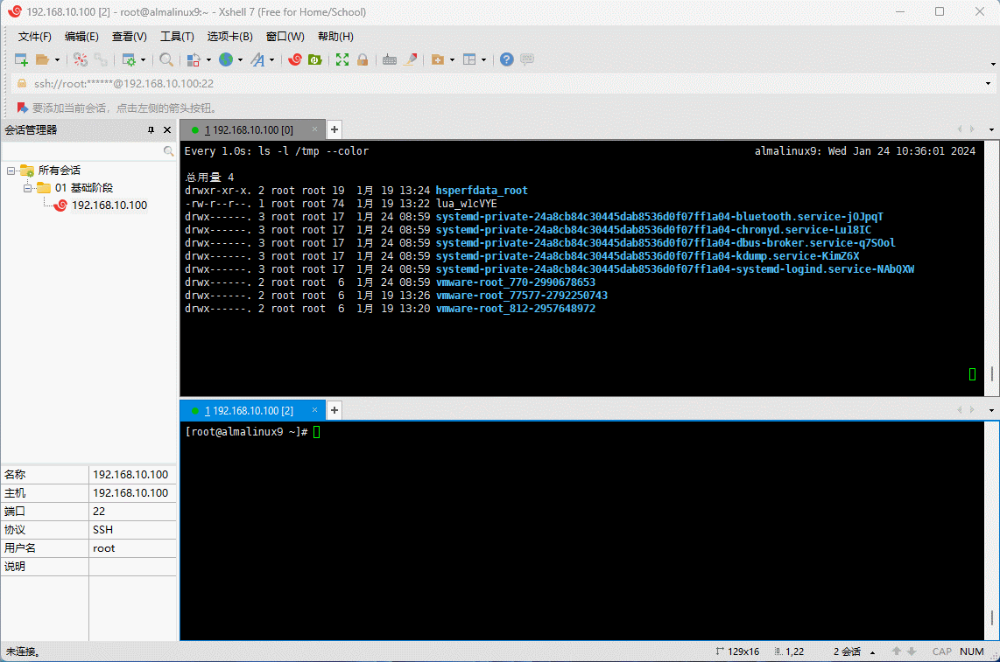

## 3.10 cat 命令（⭐）

* 命令：

```shell
cat [-n] [文件]...
```

> [!NOTE]
>
> * 功能：显示文件内容。
> * 对应的英文：concatenate（合并文件并输出到屏幕）。
> * 选项：
>   * `-n`，`--number`：显示行号。

> [!IMPORTANT]
>
> * ① 所谓的合并文件，就类似于 `SQL` 中的 `UNION ALL`（并集）。
> * ② 如果没有指定文件，则从标准输入中读取。


* 示例：显示文件内容

```shell
cat /etc/hostname
```


* 示例：显示文件内容及其行号

```shell
cat -n /etc/passwd
```


* 示例：合并文件内容

```shell
cat -n /etc/hostname /etc/passwd 
```

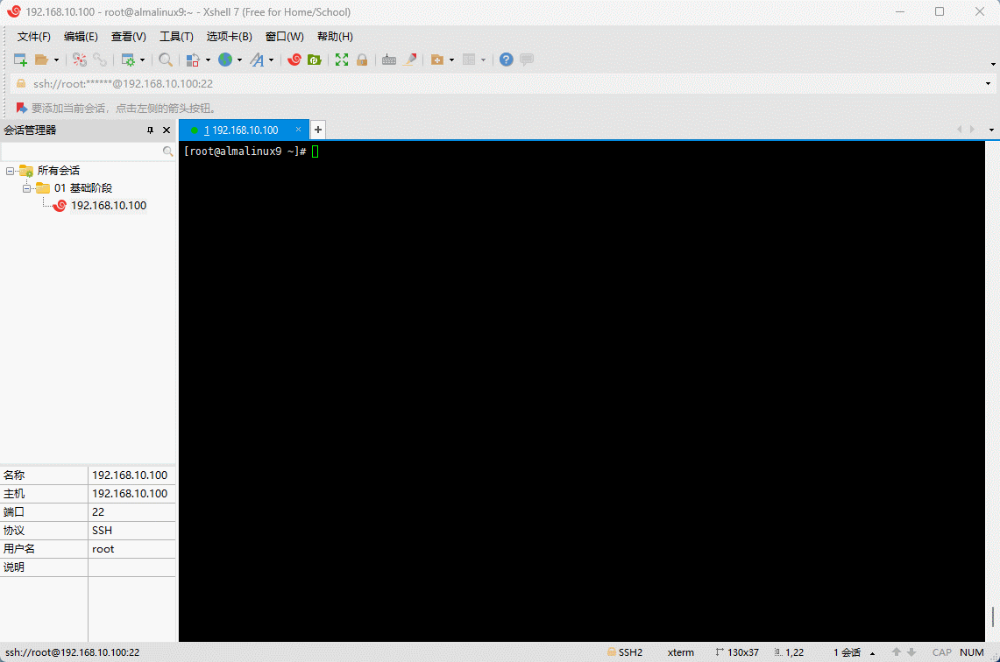


# 第四章：补充

## 4.1 Linux 的组成（⭐）

### 4.1.1 概述

* Linux 主要由以下几个组成部分构成：
  - ① `Linux 内核`：Linux 内核是整个操作系统的核心，负责管理硬件设备、内存管理、进程调度等核心功能。它是由林纳斯·托瓦兹及其他开发者编写和维护的。
  - ② `Shell 解释器`：Shell 解释器是用户与操作系统交互的接口，它接收用户输入的命令并将其解释执行。常见的 Shell 解释器有 Bash、Zsh 等，它们提供了命令行界面和脚本编程功能。
  - ③ `外围的应用程序`：命令、应用程序、图形化界面……

* 其图示如下：


* 上述的组成部分共同构成了一个完整的 Linux 操作系统，为用户提供了丰富的功能和灵活性。

### 4.1.2 查看 Linux 内核命令

* 命令：

```shell
uname [-a][-s][-r]
```

> [!NOTE]
>
> * 功能：显示 Linux 内核信息。
> * 选项：
>   * `-a`，`--all` ：按顺序打印全部信息。
>   * `-s`，`--kernel-name`：打印内核名称，相当于 `uname`。
>   * `-r`，`--kernel-release`：打印内核 release 。


* 示例：查看全部信息

```shell
uname -a
```


* 示例：查看内核版本

```shell
uname -sr
```


### 4.1.3 查看默认 SHELL 解释器命令

* 命令：

```shell
echo $SHELL
```

> [!NOTE]
>
> * 功能：显示默认的 SHELL 解释器。
>
> * 可以通 `cat /etc/shells`命令查看当前 Linux 系统支持的所有 SHELL 类型。


* 示例：

```shell
echo $SHELL
```

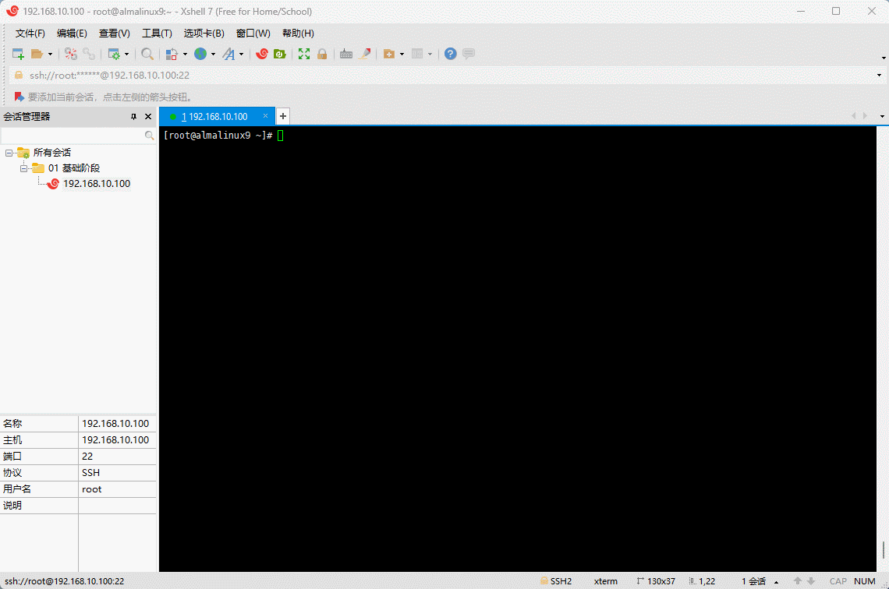

### 4.1.4 查看 Linux 发行版本

* 命令：

```shell
cat /etc/os-release
```

> [!NOTE]
>
> 功能：显示 Linux 发行版本信息。


* 示例：

```shell
cat /etc/os-release
```

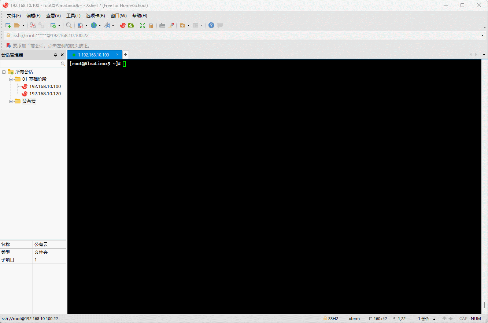


* 示例：

```shell
cat /etc/*-release
```

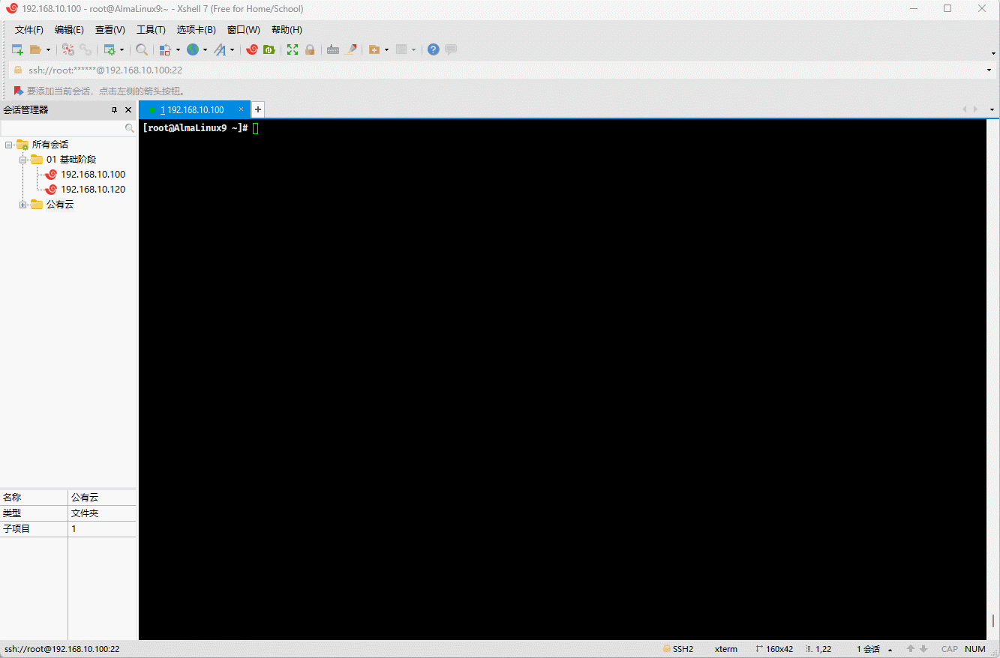

## 4.2 Linux 环境的初步优化（⭐）

* 安装 epel-release ：

```shell
dnf config-manager --set-enabled crb
dnf -y install epel-release
```


* 安装 Linux 常用的工具：

```shell
dnf -y install gcc make autoconf gcc-c++ glibc glibc-devel pcre \
    pcre-devel openssl openssl-devel systemd-devel zlib-devel \
    tree vim tmux lsof tcpdump bc bzip2 nfs-utils man-pages \
    wget bash-completion \
    lrzsz net-tools sysstat iotop iftop htop zip unzip nc \
    nmap telnet bc psmisc httpd-tools bind-utils nethogs expect
```


* 安装 Linux 娱乐命令（可选）：

```shell
dnf -y install sl cowsay
```

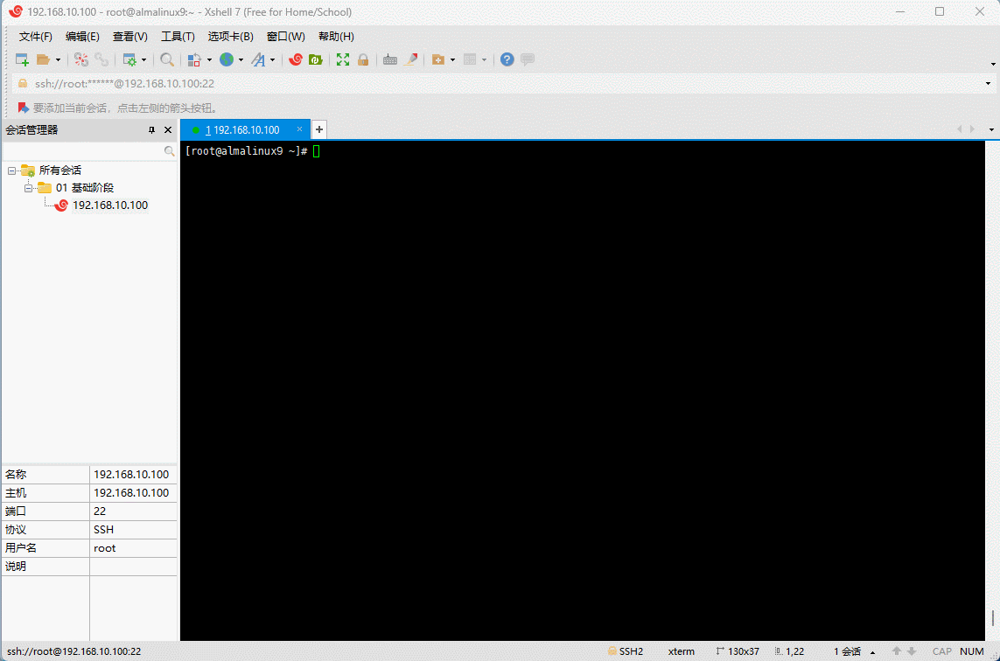

* 安装开发工具软件包组：

```shell
dnf -y groupinstall "Development Tools" 
```

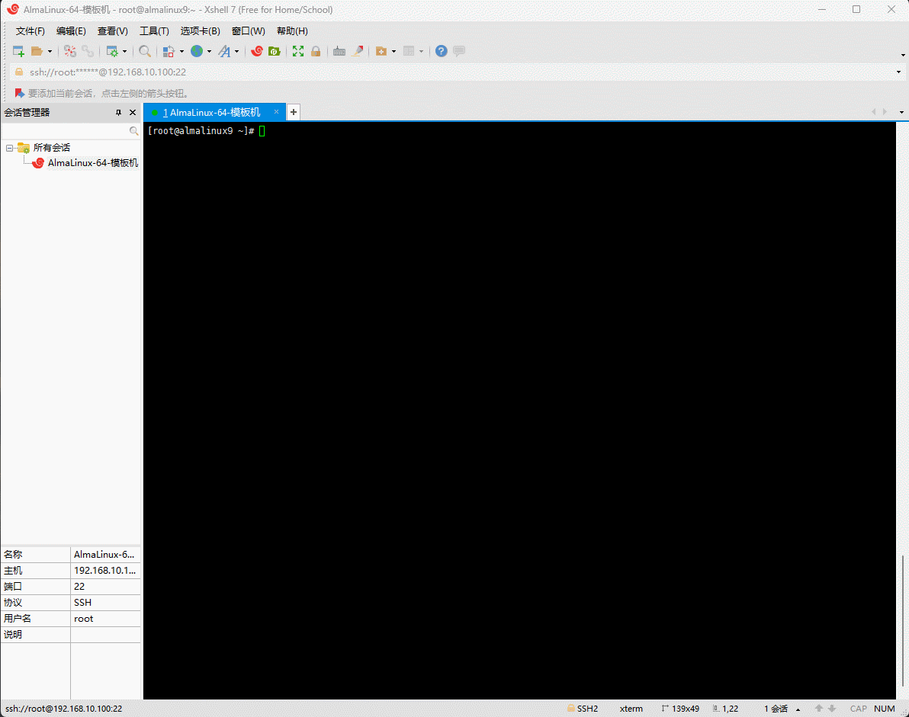

## 4.3 Linux 中的命令

### 4.3.1 概述

* 当我们在 Linux 中的终端输入一条命令，将会涉及到以下过程：
  * ① `输入命令`：当我们在终端输入一个命令并按下回车键时，这个命令就会被送到 shell。
  * ② `Shell 判断`：当收到命令后，Shell 首先会判断该命令是内部命令还是外部命令，如果是 Shell 的内部命令（如：cd 命令），将由 Shell 直接处理；否则，将由 Shell 进行解析。
  * ③ `Shell 解析`：如果是外部命令，Shell 将解析这个命令，并将其分解成命令名和参数、处理特殊字符（如：引号和反斜杠）、替换环境变量、处理重定向符号（如 `>` 和 `|`）等。
  * ④ `查找命令`：Shell 会在环境变量 `PATH` 指定的目录中查找匹配该命令名的可执行文件。
  * ⑤ `权限检查`：一旦找到命令，Shell 将检查当前用户是否有权限执行这个命令。
  * ⑥ `执行命令`：如果用户有权限，Shell 则通过创建一个新的进程来执行命令。通常，这是通过调用系统调用 `fork()` 来创建一个新进程，然后使用 `exec()` 系列函数来运行命令。
  * ⑦ `命令执行和输出`：命令执行后，其输出（如果有的话）将被返回到 Shell，通常会显示在终端上。如果涉及到重定向，输出可能会被发送到命令或其他命令中。
  * ⑧ `结束进程`：执行完毕后，命令进程结束，并将退出状态返回给 Shell。Shell 接着返回到等待状态，等待下一个命令的输入。

> [!NOTE]
>
> `PATH` 是一个包含多个目录路径的环境变量，Shell 会按照这些路径的顺序来搜索命令。

* 其对应的流程图，如下所示：

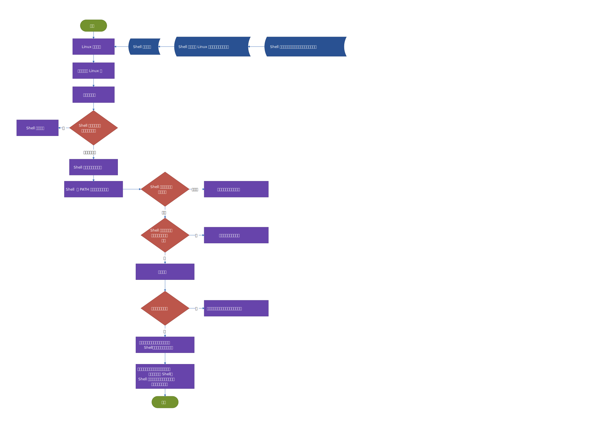

### 4.3.2 内部命令和外部命令

* Linux 中的`内部命令`（**Built-in Commands**）：
  * 内部命令是直接内置在 Shell 解析器（如：Bash、Zsh 等）中的命令，它们不是独立的可执行文件，用户登录后自动加载并常驻到内存中。
  * 这些命令的执行速度比较快，因为它们无需创建新的进程，而是在当前 Shell 的上下文中直接执行。

* 可以通过如下的命令，查看 Linux 中的所有内部命令：

```shell
help
```

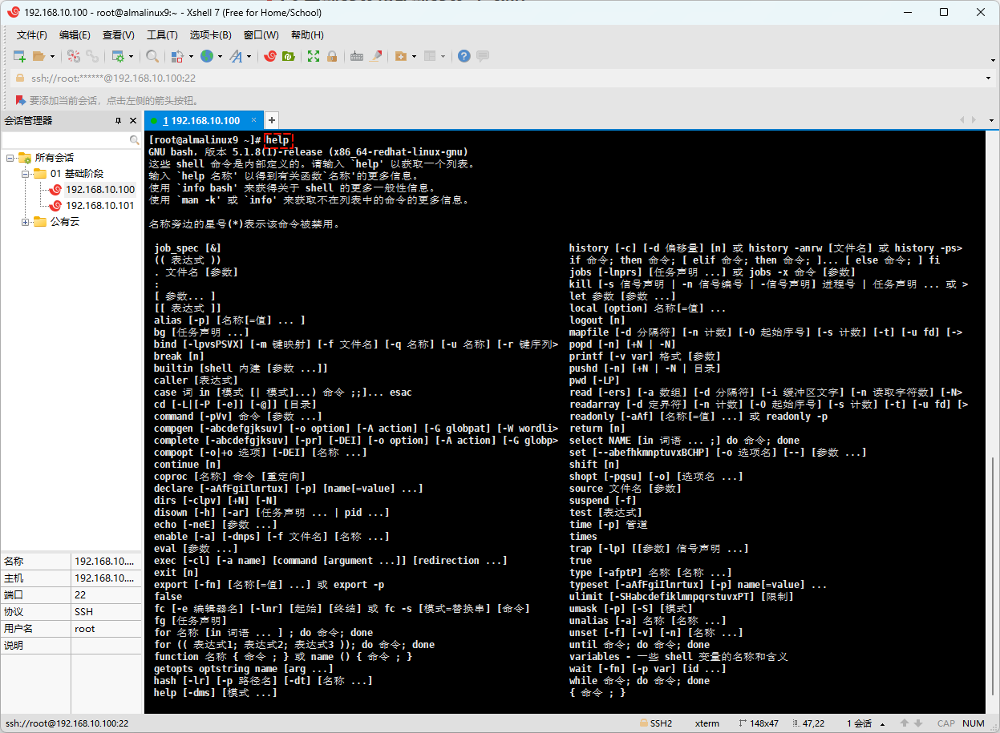

* 当然，也可以通过如下的命令，查看某个命令是否是 Linux 中的内部命令：

```shell
type cd
```

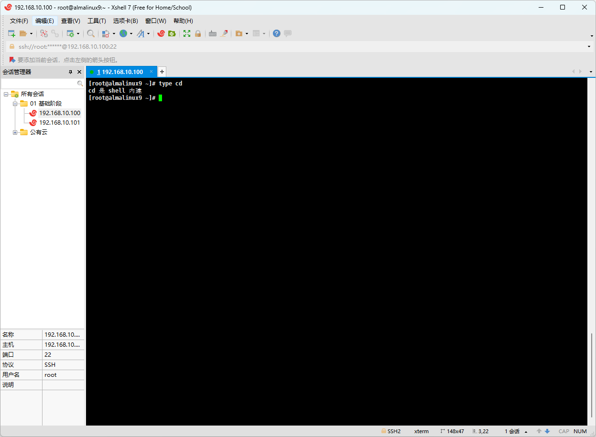

* Linux 中的`外部命令`**（External Commands）**：
  * 外部命令是独立的可执行文件，它们存在于系统的文件系统中，通常位于`/bin`、`/usr/bin` 等目录下。
  * 这些命令的执行需要创建新的进程，通过调用相应的可执行文件来完成任务。

* 可以通过如下的命令，查看 Linux 中的所有外部命令对应的目录：

```shell
echo $PATH
```

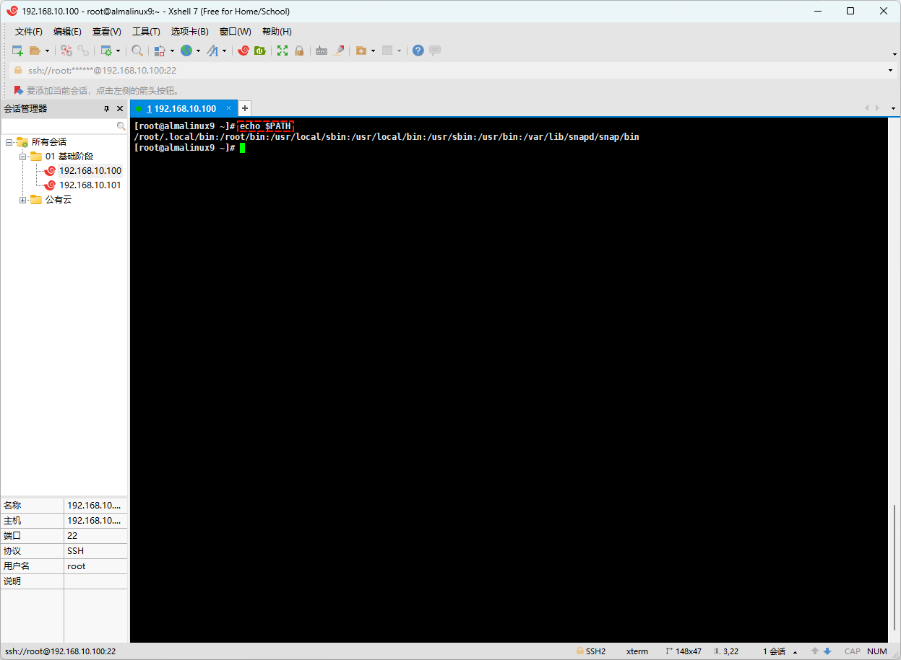

* 当然，也可以通过如下的命令，查看某个命令是否是 Linux 中的外部命令：

```shell
type cat
```

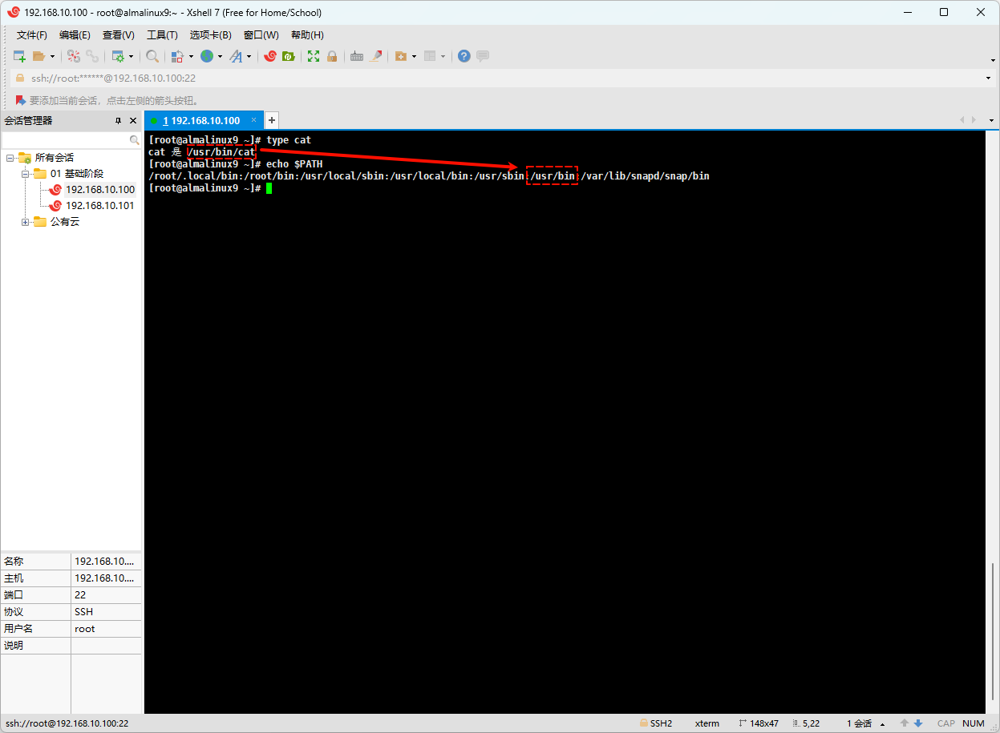

* 如果对于 Linux 中的外部命令，每次都要去`环境变量 $PATH` 对应的目录中去寻找指定的可执行文件，那效率也太慢了；Linux 采用了 hash 算法来加快访问，其原理如下所示：

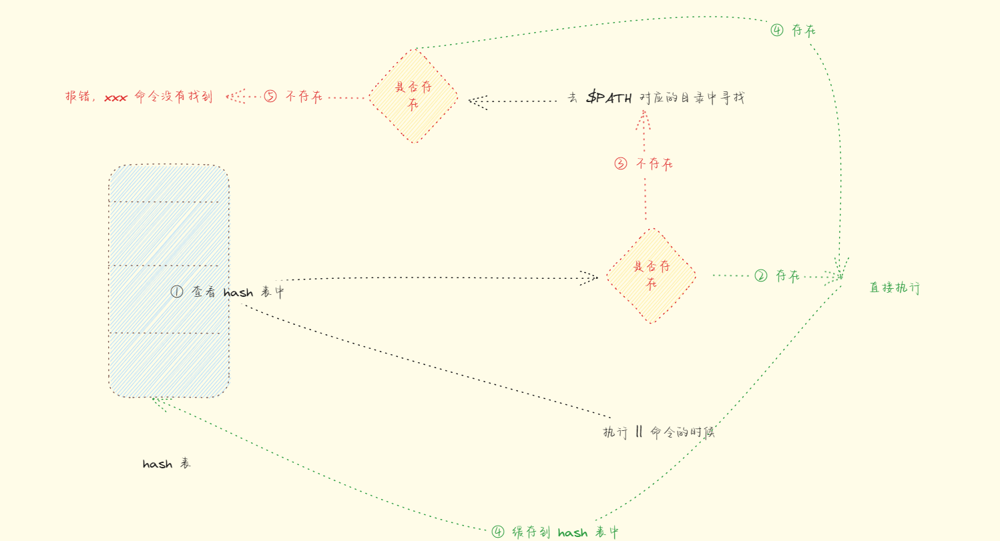

* 可以通过如下的命令，查看 hash 表中缓存的命令：

```shell
hash
```

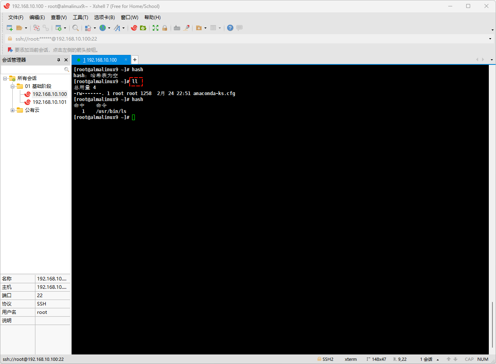

> [!NOTE]
>
> 如果有的时候，移动了 Linux 外部命令的位置，可以使用 `hash -r` 清除 hash 表记录，以防止 Linux 报错：`xxx 命令找不到`。

* 有的时候，我们会发现有些命令是内部命令，但是在 PATH 环境变量所指向的路径目录中也存在，为什么？

```shell
type cd
```

```shell
ll /usr/bin/cd
```

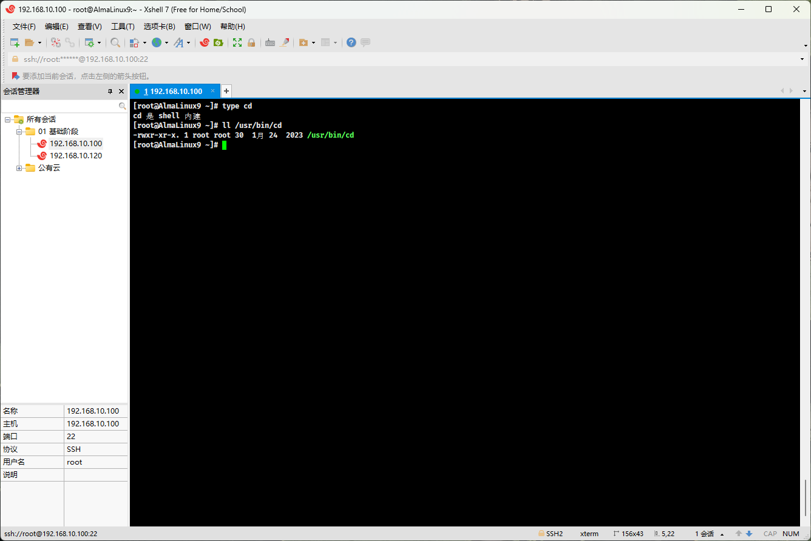

> [!NOTE]
>
> 也可以使用 `type -a cd` 命令显示系统中某个命令的所有可能的位置，即：是否是内部命令、如果是外部命令，命令的位置在哪里、以及该命令是否是别名。

* 其实，是因为并不是所有的 Linux 的内置 Shell 解析器都是 `/bin/bash`，如果是别的 Shell 解析器，可能内部命令就没有 cd 命令，为了防止编写的 Shell 脚本在不同的 Linux 版本中出现错误（移植问题），就出现了有些命令即是内部命令也是外部命令的现象。

## 4.4 Linux 命令帮助手册

### 4.4.1 概述

* 对于 Linux 的内部命令，我们可以通过如下的命令，来查看命令的使用方法：

```shell
man command
```

```shell
# 通常用来查看常用的选项和参数
help command
```

* 对于 Linux 的外部命令，我们可以通过如下的命令，来查看命令的使用方法：

```shell
man command
```

```shell
# 通常用来查看常用的选项和参数
command --help
```

```shell
# 通常用来查看常用的选项和参数，并不是所有的命令都有 -h 选项
command -h
```

> [!NOTE]
>
> * ① man 命令来查看帮助，其实是查看指定命令的帮助手册，在 `/usr/share/man` 下。
> * ② 可以通过 `whereis 命令`或 `whatis 命令`查看其对应命令的帮助手册的位置。
> * ③ 实际工作中，并不会严格区分 Linux 内部命令或 Linux 外部命令，如果查询 Linux 内部命令的方法不行，就根据提示换为查看 Linux 外部命令的方法。


* 其使用步骤，如下所示：

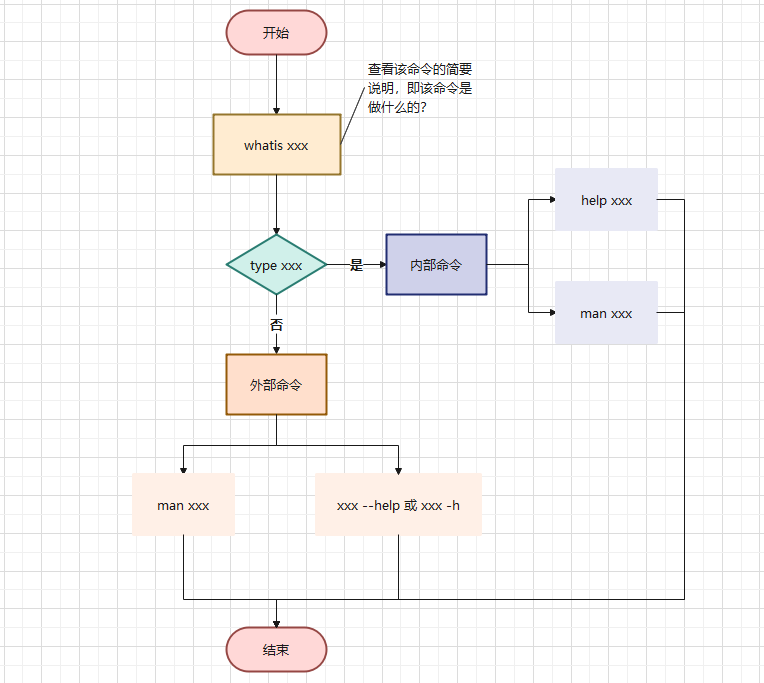

> [!NOTE]
>
> * ① 上述的步骤，仅仅只是当我们`接触到一个新命令`时的使用步骤（帮助）。
> * ② 我们也知道，Linux 的哲学是：一切皆文件，即：命令（可执行程序）是文件，命令所对应的配置文件也是文件。所以，如果需要了解命令所对应配置文件的帮助信息，上述的步骤显然是不够的。


* 示例：查看 Linux 内部命令的使用方法

```shell
man cd
```


* 示例：查看 Linux 内部命令的使用方法

```shell
help cd
```


* 示例：查看 Linux 外部命令的使用方法

```shell
man cat
```

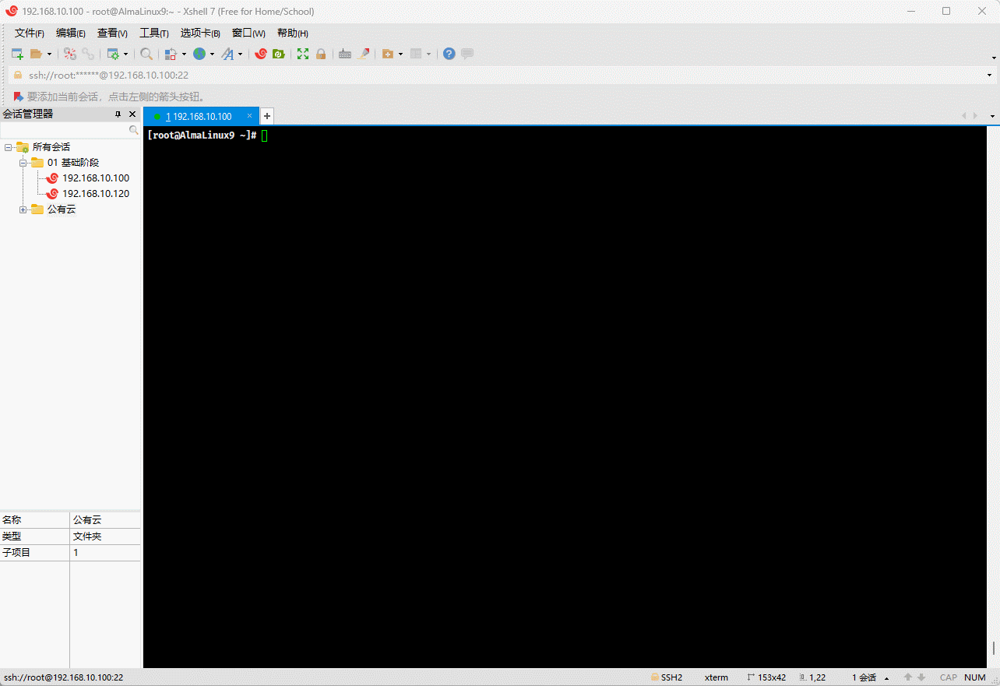


* 示例：查看 Linux 外部命令的使用方法

```shell
cat --help
```


* 示例：查看 Linux 外部命令的使用方法

```shell
cat -h
```

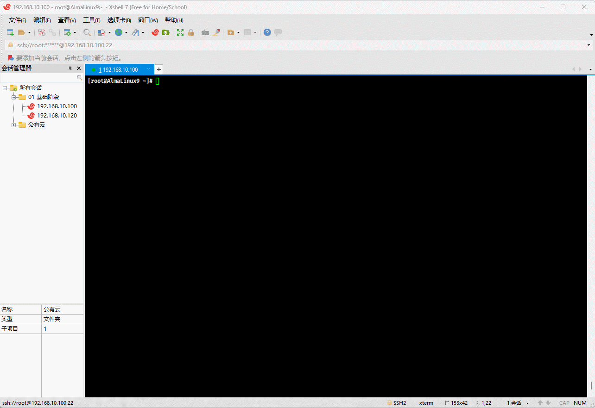

### 4.4.2 查看 Linux 命令位置及其帮助手册位置

* 可以通过如下的命令，查看 Linux 命令的位置及其帮助手册的位置：

```shell
whereis command
```

```shell
whatis command
```

> [!NOTE]
>
> * ① 在安装完操作系统之后，立刻就使用 `whatis command` ，可能不会出现对应 `command` 命令的简短信息，是因为`whatis` 命令依赖于底层的数据库，可以使用 `mandb` 命令让其立刻生成数据库；也可以等待一段时间，让操作系统自动为其生成数据库。
> * ② `whatis` 命令主要用于查找和显示给定命令、系统调用、库函数等的一行手册页描述；换言之，`帮助我们了解命令是做什么的`。
> * ③ `whereis`命令主要用于定位二进制文件、源代码文件、帮助文件的位置，它搜索特定的目录来找到与给定程序名相关的文件；换言之，`帮助我们查找命令的相关文件的位置`。


* 示例：

```shell
whereis cd
```

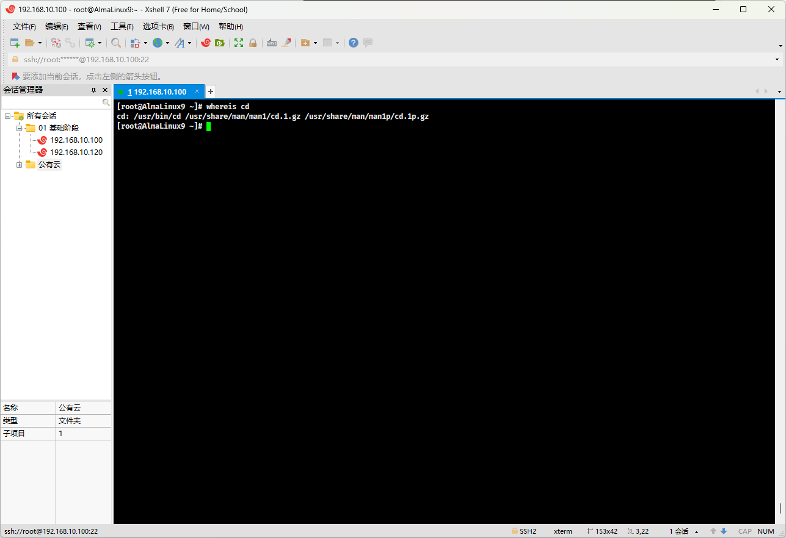


* 示例：

```shell
whatis passwd
```

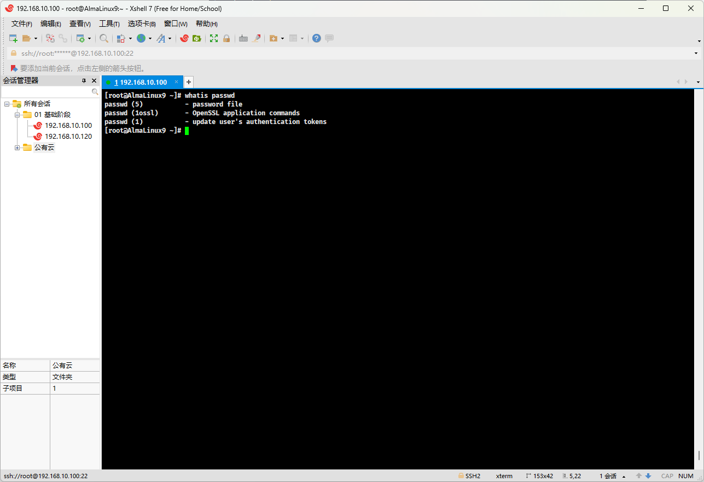

### 4.4.3 Linux 帮助手册详解

* 我们可以通过如下的命令，来查看 Linux 的帮助手册：

```shell
ll /usr/share/man
```

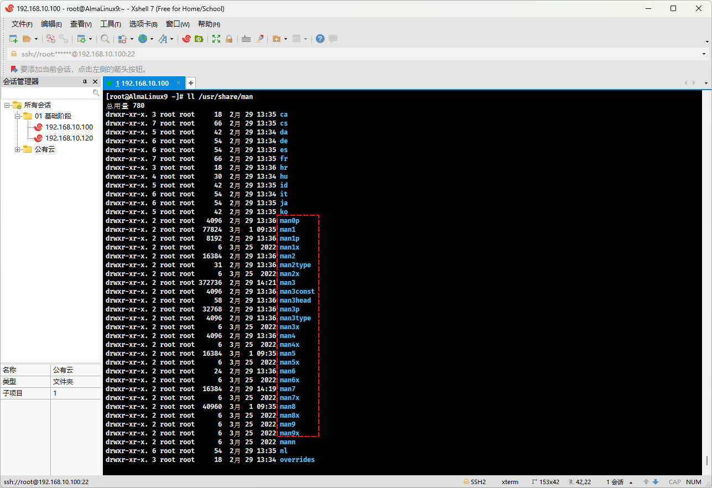

> [!NOTE]
>
> * ① Linux 中的大部分命令，都有 man 帮助手册。
> * ② 可以通过 `manpath`命令查看 man 帮助手册的位置。

* 内容如下，只显示有用的信息，即：

```shell {1,4,7,13,15,17,19,21,23}
drwxr-xr-x. 2 root root  77824  3月  1 09:35 man1 # 1 章节，用户命令
drwxr-xr-x. 2 root root   8192  2月 29 13:36 man1p
drwxr-xr-x. 2 root root      6  3月 25  2022 man1x
drwxr-xr-x. 2 root root  16384  2月 29 13:36 man2 # 2 章节，系统调用
drwxr-xr-x. 2 root root     31  2月 29 13:36 man2type
drwxr-xr-x. 2 root root      6  3月 25  2022 man2x
drwxr-xr-x. 2 root root 372736  2月 29 14:21 man3 # 3 章节，C 库调用
drwxr-xr-x. 2 root root   4096  2月 29 13:36 man3const
drwxr-xr-x. 2 root root     58  2月 29 13:36 man3head
drwxr-xr-x. 2 root root  32768  2月 29 13:36 man3p
drwxr-xr-x. 2 root root   4096  2月 29 13:36 man3type
drwxr-xr-x. 2 root root      6  3月 25  2022 man3x
drwxr-xr-x. 2 root root   4096  2月 29 13:36 man4 # 4 章节，设备文件和特殊文件
drwxr-xr-x. 2 root root      6  3月 25  2022 man4x
drwxr-xr-x. 2 root root  16384  3月  1 09:35 man5 # 5 章节，配置文件格式
drwxr-xr-x. 2 root root      6  3月 25  2022 man5x
drwxr-xr-x. 2 root root     24  2月 29 13:36 man6 # 6 章节，游戏
drwxr-xr-x. 2 root root      6  3月 25  2022 man6x
drwxr-xr-x. 2 root root  16384  2月 29 14:19 man7 # 7 章节，杂项
drwxr-xr-x. 2 root root      6  3月 25  2022 man7x
drwxr-xr-x. 2 root root  40960  3月  1 09:35 man8 # 8 章节，管理类的命令
drwxr-xr-x. 2 root root      6  3月 25  2022 man8x
drwxr-xr-x. 2 root root      6  3月 25  2022 man9 # 9 章节，Linux 内核 API
drwxr-xr-x. 2 root root      6  3月 25  2022 man9x
```

> [!NOTE]
>
> * ① 手册中含有 p 的一般都是程序员专用的，因为 p 是 programmer 的缩写。
> * ② 在实际工作中，对于含有 p 的手册，我们一般不关心！！！

* 我们知道，`passwd` 命令对应的配置文件是 `/etc/passwd`：

```shell 
whereis passwd
```

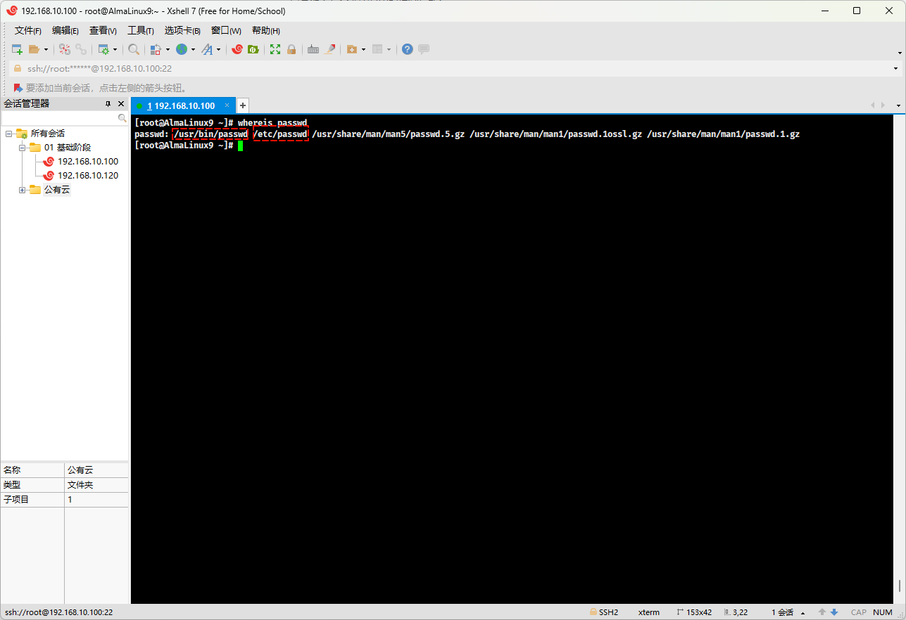

* 通过，如下的命令去查看 `/etc/passwd` 文件的内容：

```shell
cat /etc/passwd
```

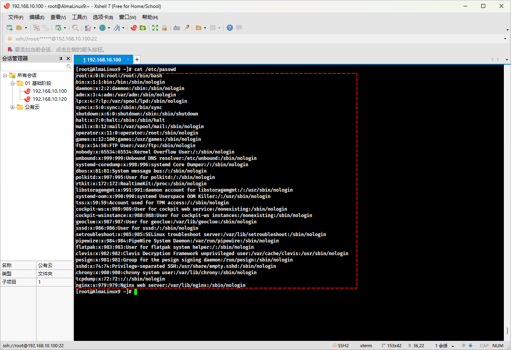

> [!NOTE]
>
> 该配置文件中的每一列的含义是什么？

* 我们可以去看下，man 命令如何使用：

```shell
man --help
```

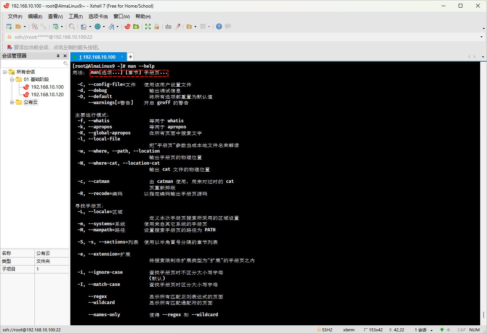

* 我们可以通过 `whereis` 或 `whatis` 去，查看该命令对应的配置文件是那个章节的帮助手册：

```shell
whereis passwd
```

```shell
whatis passwd
```

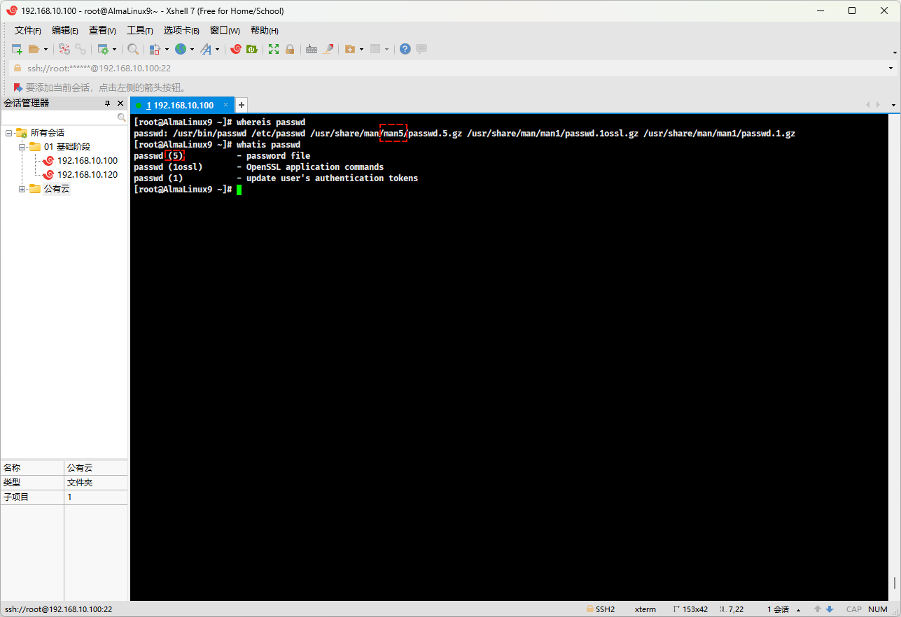

* 此时，我们就可以通过 `man` 命令，来查看 `passwd` 命令对应配置文件 `/etc/passwd` 中每一列的含义：

```shell
man 5 passwd
```

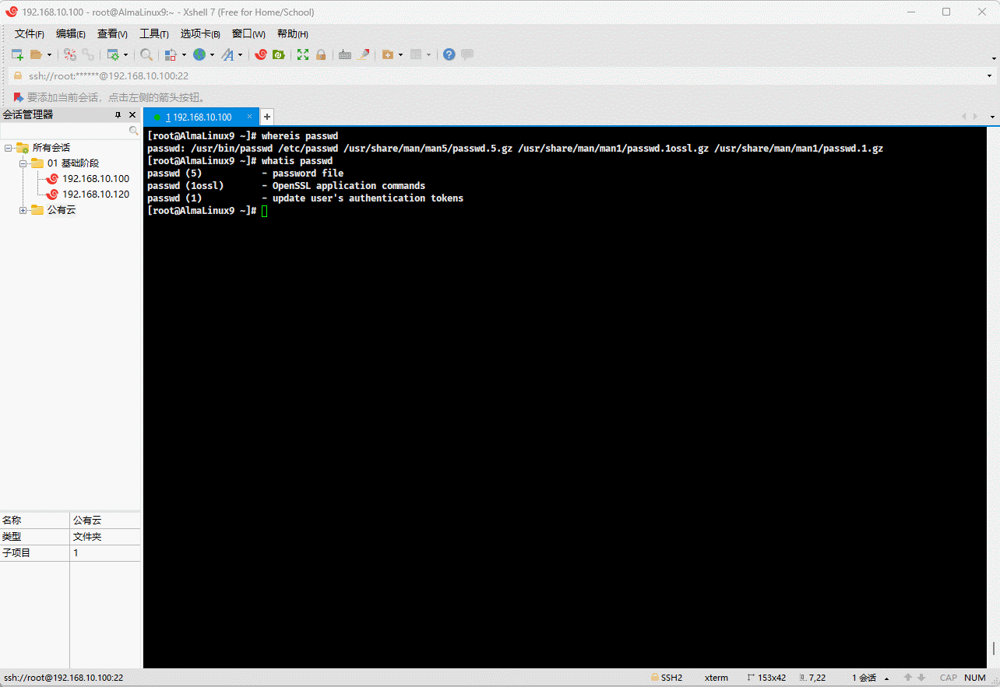

* 如果不写帮助手册的章节，默认就是查看命令的使用方法：

```shell
man passwd # 等价于 man 1 passwd 
```


* 其实，在使用 man 查看命令的时候，会显示帮助手册的章节：

```shell
man passwd
```

```shell
man 5 passwd
```


## 4.5 命令的历史记录（⭐）

### 4.5.1 概述

* 在 Linux 中，当用户登录的时候，系统会读取 `/etc/profile` 文件，我们可以通过如下的命令，来查看该文件的内容：

```shell
cat /etc/profile | head -n 20
```

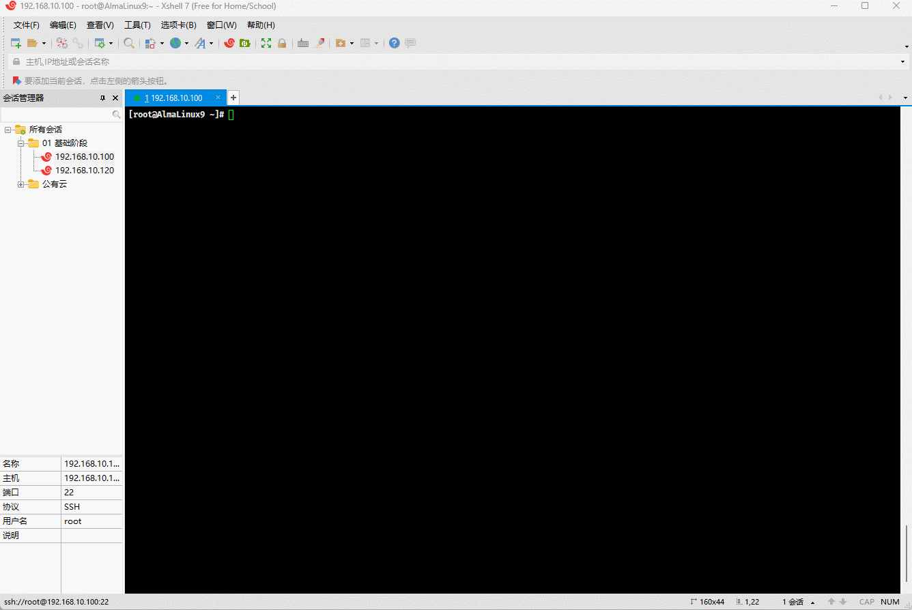

* 其内容如下：

```txt
# /etc/profile

# System wide environment and startup programs, for login setup
# Functions and aliases go in /etc/bashrc

# 系统范围的环境和启动程序，对于登录设置的函数和别名可以设置到 /etc/bashrc 文件中

# It's NOT a good idea to change this file unless you know what you
# are doing. It's much better to create a custom.sh shell script in
# /etc/profile.d/ to make custom changes to your environment, as this
# will prevent the need for merging in future updates.

# 除非你明确知道你自己在做什么，否则修改这个文件不是很好的注意。最好的方式就是你在 /etc/profile.d/ 目录中
# 创建一个 custom.sh 的 shell 文件来对环境进行自定义更改，以避免将来更新的时候需要合并的问题。

pathmunge () {
    case ":${PATH}:" in
        *:"$1":*)
            ;;
        *)
            if [ "$2" = "after" ] ; then
                PATH=$PATH:$1
            else
                PATH=$1:$PATH
            fi
# 其余略
```

* 从上述的翻译中，我们可以得知：`/etc/profile` 文件是系统范围内的全局配置文件，会在用户登录的时候被读取和执行，并且通常用于`设置环境变量`和`执行系统级别的配置`；但是，一般不建议，修改这个文件。
* 其次，上述的翻译中，也提到了对于`登录设置的函数`和`别名`可以设置到 `/etc/bashrc` 文件中，我们可以通过如下的命令，来查看该文件的内容：

```shell
cat /etc/bashrc | head -n 20
```

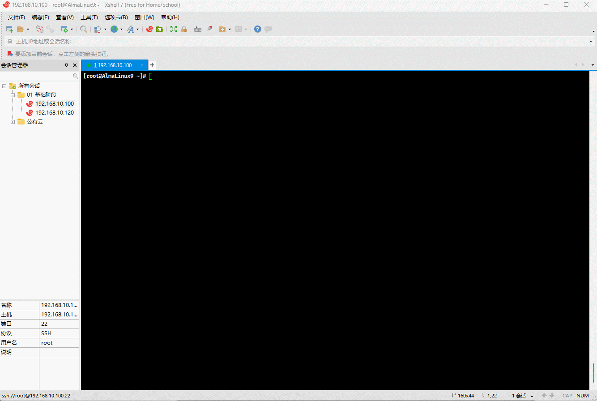

* 其内容如下：

```txt
# /etc/bashrc

# System wide functions and aliases
# Environment stuff goes in /etc/profile

# 系统范围的函数和别名
# 环境相关的配置放在 /etc/profile 中

# It's NOT a good idea to change this file unless you know what you
# are doing. It's much better to create a custom.sh shell script in
# /etc/profile.d/ to make custom changes to your environment, as this
# will prevent the need for merging in future updates.

# 除非你明确知道你自己在做什么，否则修改这个文件不是很好的注意。最好的方式就是你在 /etc/profile.d/ 目录中
# 创建一个 custom.sh 的 shell 文件来对环境进行自定义更改，以避免将来更新的时候需要合并的问题。

# Prevent doublesourcing
if [ -z "$BASHRCSOURCED" ]; then
  BASHRCSOURCED="Y"

  # are we an interactive shell?
  if [ "$PS1" ]; then
    # 其余略
    # Turn on parallel history
    shopt -s histappend
    # 将命令历史记录加载到内存中
    history -a
    
    # 其余略
  fi

  if ! shopt -q login_shell ; then # We're not a login shell
    # 其余略
    # Set default umask for non-login shell only if it is set to 0
    [ `umask` -eq 0 ] && umask 022
	# 设置环境变量 SHELL 为 bash
    SHELL=/bin/bash 
    # 遍历 /etc/etc/profile.d/ 中以 *.sh 为结尾的配置文件，并进行设置
    for i in /etc/profile.d/*.sh; do
        if [ -r "$i" ]; then
            if [ "$PS1" ]; then
                . "$i"
            else
                . "$i" >/dev/null
            fi
        fi
    done
    unset i
    unset -f pathmunge
  fi

fi

```

* 我们可以得知，在 `/etc/profile.d/`目录中创建 `custom.sh` 的 shell 文件，来`执行系统级别的配置`是好的方式，我们可以通过如下的命令，来查看 `/etc/profile.d/` 目录：

```shell
ll /etc/profile.d/
```

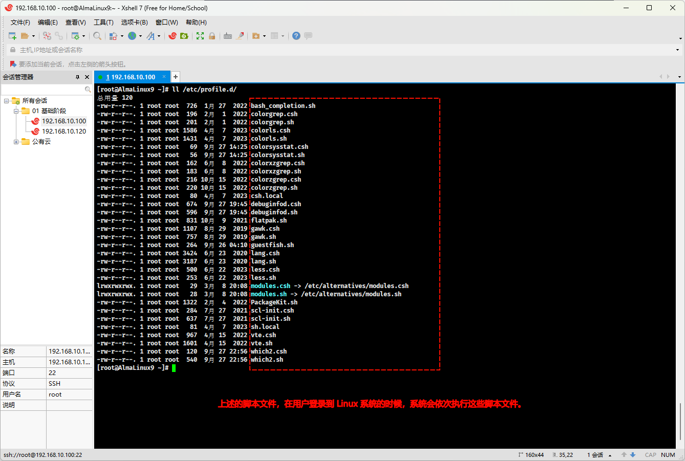

* 其实，在`创建用户`的时候，就会有一些`默认设置`，可以通过如下的命令查看：

```shell
useradd -D # 等同于 cat /etc/default/useradd
```

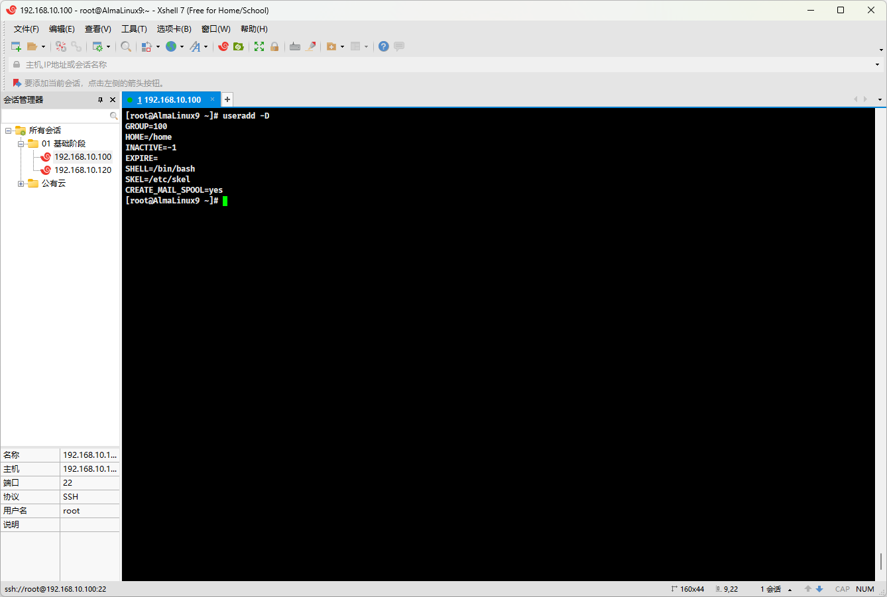

* 其内容如下：

```txt
GROUP=100 # 用户组，root 用户默认是 0 
HOME=/home # 用户的家目录，
INACTIVE=-1
EXPIRE=
SHELL=/bin/bash # 用户的默认 SHELL 解释器
SKEL=/etc/skel # SKEL 是骨架、模板的意思
CREATE_MAIL_SPOOL=yes
```

> [!NOTE]
>
> * ① 在 Linux 系统中，`/etc/skel` 目录包含了新建用户账号时所复制的默认配置文件和目录结构，相当于一个用户家目录的模板或骨架。
> * ② 当管理员创建新用户账号时，系统会复制 `/etc/skel` 目录中的文件和目录到新用户的家目录 (`/home/new_user`) 下，作为新用户的初始配置。这样可以确保新用户拥有一套基本的配置文件，比如 `.bashrc`、`.bash_logout` 、`bash_profile`等，以及一些默认的目录结构。

* 我们可以如下的命令，查看 `/etc/skel` 目录来验证下：

```shell
ll -lah /etc/skel
```

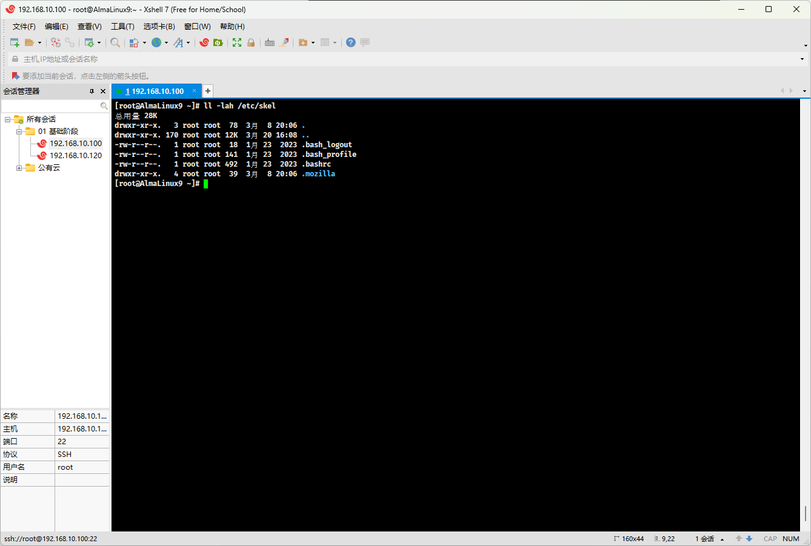

* 其实，`root` 用户是我们在`安装操作系统`的时候`创建`的，并且 `root` 用户的家目录是 `/root` ；所以，`root` 用户在家目录下也有这些文件：

```shell 
ll -lah ~/
```

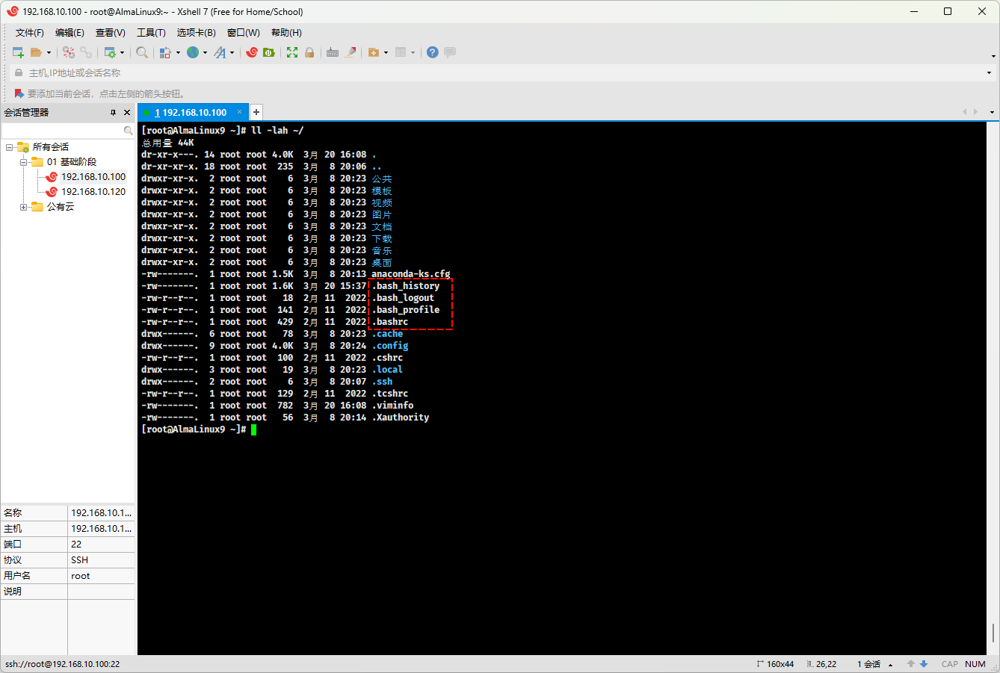

* 当用户登录的时候，Linux 操作系统会加载 `~/.bash_profile` ，我们可以查看该文件的内容：

```shell
cat ~/.bash_profile
```

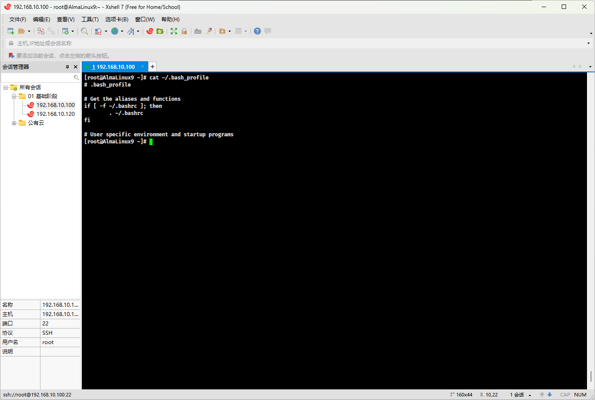

* 内容如下：

```txt
# .bash_profile

# Get the aliases and functions

# 通过执行 ~/.bashrc 来获取别名和登录设置的函数

if [ -f ~/.bashrc ]; then
	. ~/.bashrc
fi

# User specific environment and startup programs
```

* 此时，我们可以查看下 `~/.bashrc` 文件的内容：

```shell
cat ~/.bashrc
```

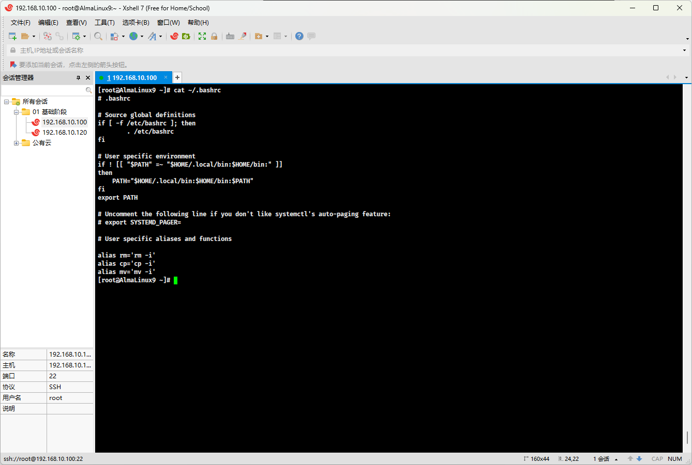

* 其内容如下：

```txt
# .bashrc

# Source global definitions

# 加载 /etc/bashrc 中定义的系统范围的函数和别名
if [ -f /etc/bashrc ]; then
	. /etc/bashrc
fi

# User specific environment
if ! [[ "$PATH" =~ "$HOME/.local/bin:$HOME/bin:" ]]
then
    PATH="$HOME/.local/bin:$HOME/bin:$PATH"
fi

# 导出 PATH 环境变量，以便执行应用程序
export PATH

# Uncomment the following line if you don't like systemctl's auto-paging feature:
# export SYSTEMD_PAGER=

# User specific aliases and functions

# 用户自定义的别名和函数 

alias rm='rm -i'
alias cp='cp -i'
alias mv='mv -i'
```

> [!IMPORTANT]
>
> 如果修改了 `.bashrc` 文件，可以使用 `source ~/.bashrc` 使其生效。

* 其实，还有一个 `.bash_history` 文件，该命令是用来记录用户每一次执行的命令情况，即命令的历史记录：

```shell
cat ~/.bash_history | head 
```

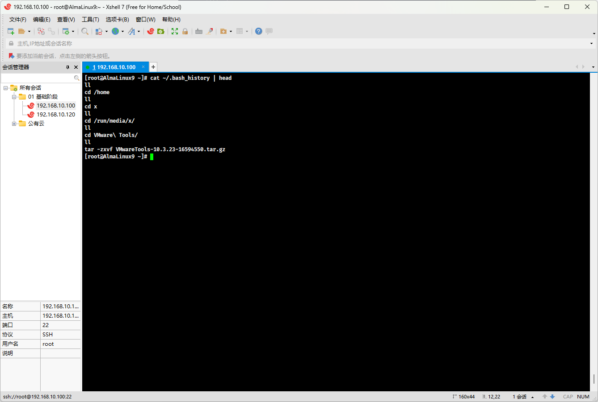

* 那么，`.bash_history` 是 `history` 命令用来`记录`我们`执行过的命令`，以便我们可以`查看`和`回顾`之前执行过的命令，其执行流程如下：

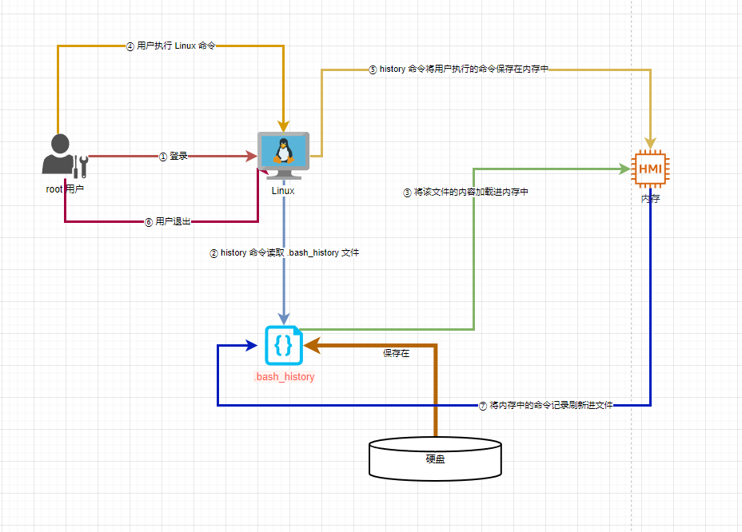

### 4.5.2 history 命令使用

* 命令：

```shell
history [-c] [n]
```

> [!NOTE]
>
> * 功能：查看已经执行过的历史命令。
> * 选项：
>   * `-c`：清空历史记录。
> * 参数：
>   * `n`：最近 n 条历史命令记录。

> [!IMPORTANT]
>
> * ① 可以使用 `!历史记录数` 执行命令历史记录中的命令。
> * ② 可以使用 `ctrl + r` 进行历史命令搜索（ `reverse-i-search`），使用 `ctrl + g` 退出搜索。


* 示例：显示所有的命令历史记录

```shell
history 
```

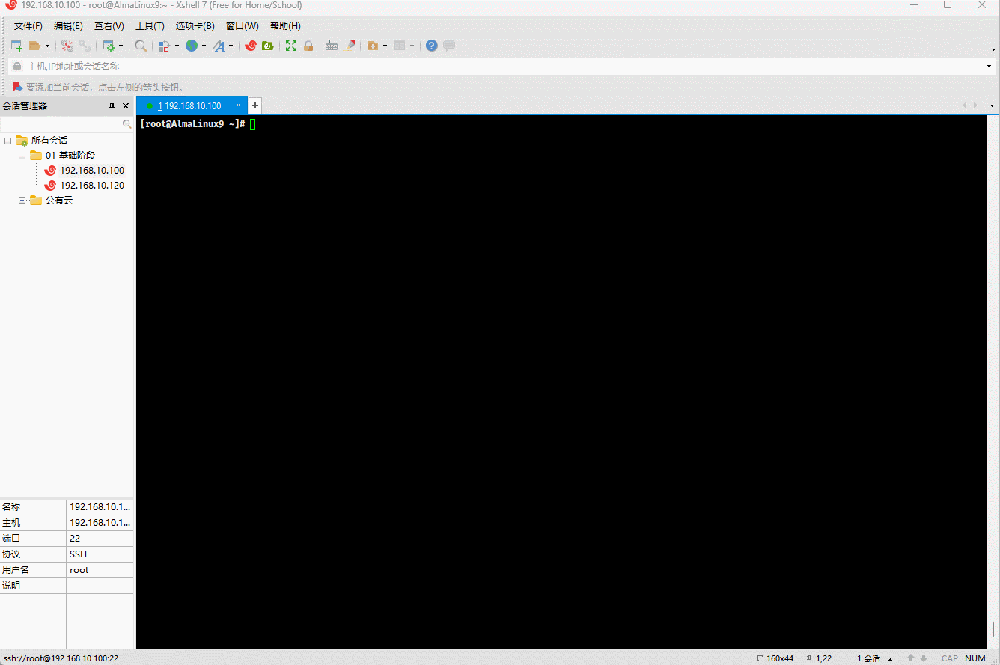


* 示例：显示最近 10 条命令历史记录

```shell
history 10
```

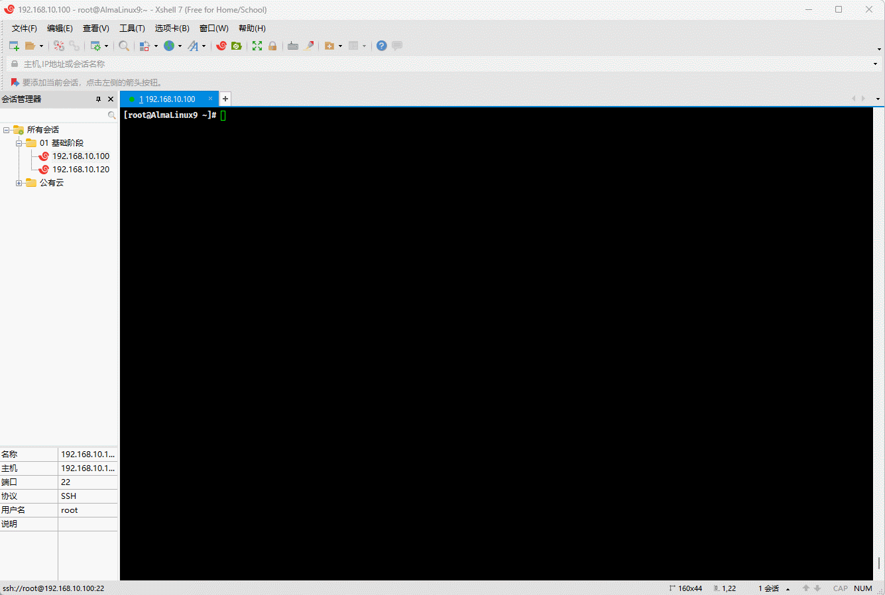


* 示例：执行历史命令

```shell
!87
```

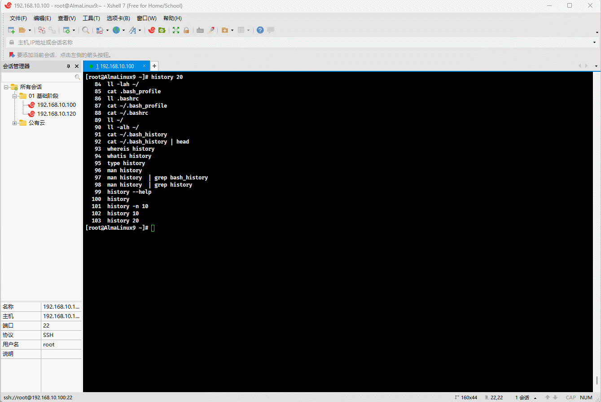


* 示例：搜索历史命令，并执行

```shell
# 如果有多个，可以一直按 ctrl + r
ctrl + r
```

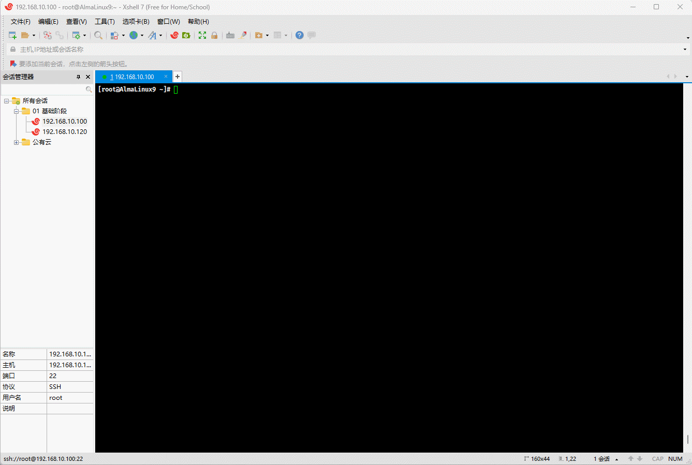

## 4.6 tldr 命令（⭐）

### 4.6.1 概述

* 当我们在使用一个不熟悉的命令的时候，可以使用 `--help`  或 `-h` 选项来查看常见的用法；当然，也可以通过 `man xxx`命令查看更详细的用法。
* 但是，根据`二八法则`，其实只有`一小部分`命令的选项是我们经常使用的。基于此原理，社区开发了 [TLDR](https://tldr.sh/)（Too Long; Didn't Read，`太长不看`，也被人翻译为 `"偷懒的人"` ）项目，旨在为命令行工具提供简洁易懂的帮助页面，以帮助用户快速了解基本的使用方法和选项，而不必深入阅读复杂的手册页。

> [!NOTE]
>
> * ① 二八法则，也被称为帕累托原则（Pareto Principle），是一个经济学原则，由意大利经济学家维尔弗雷多·帕累托（Vilfredo Pareto）在 19 世纪末首次提出。帕累托注意到在他的时代，意大利大约 80% 的土地由大约 20% 的人口拥有。他进一步调查其他国家，发现这种不平等分布的现象普遍存在，从而提出了这个原则。
> * ② 二八法则指出，在许多情况下，大约 80% 的效果来自 20% 的原因。换言之，少数（20%）的因素往往对结果有决定性的影响。这个原则不仅适用于经济领域，还广泛适用于管理、科学研究、软件工程等多个领域。
> * ③ 例如：在商业管理中，二八法则可以解释为大约 80% 的销售额来自 20% 的客户；在软件开发中，80% 的错误和崩溃可能仅由 20% 的缺陷引起；在个人时间管理中，通常 20% 的工作投入产生 80% 的成果。
> * ④ 需要注意的是，二八法则是一个经验规则，表明两组事物之间存在不均等的关系，但这个比例并不是固定的80:20。实际的比例可能是70:30、90:10或其他，关键在于大部分效果通常由少数原因产生。此外，这个原则强调了优先级和重点管理的重要性，即通过识别和专注于那些“关键的20%”，可以有效地提高效率和成效。

### 4.6.2 安装

* 安装 node.js ：

```shell
dnf -y install nodejs
```

> [!NOTE]
>
> * ① tldr 依赖于 nodejs 。
> * ② tldr 不仅仅可以查看 Linux 上命令的常见使用，还可以查看 android、darwin、freebsd、macos、windows 等操作系统上的命令的常见使用。

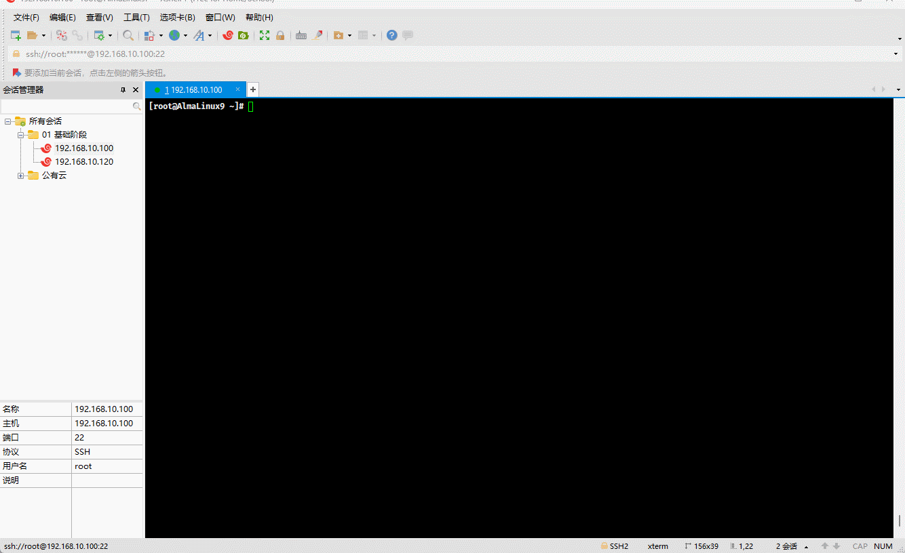

* 安装 tldr ：

```shell
npm -g install tldr
```

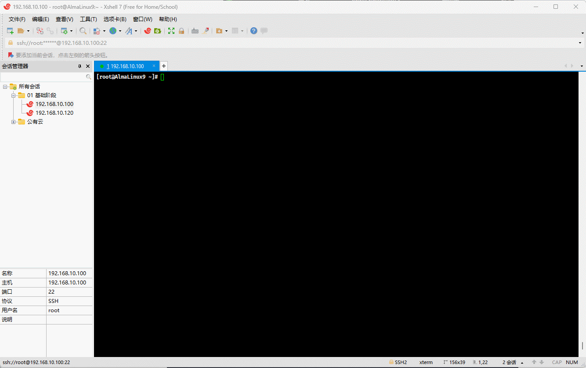

* 更新缓存：

```shell
tldr --update
```

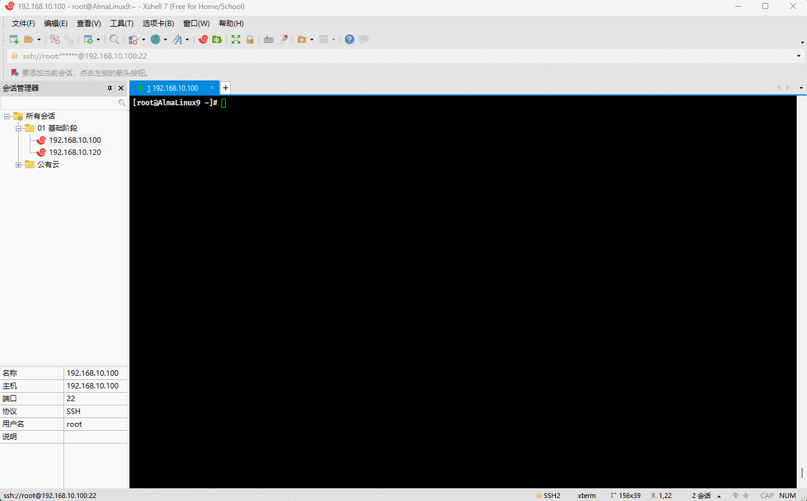

### 4.6.3 使用

* 查看 ls 的用法：

```shell
tldr ls
```

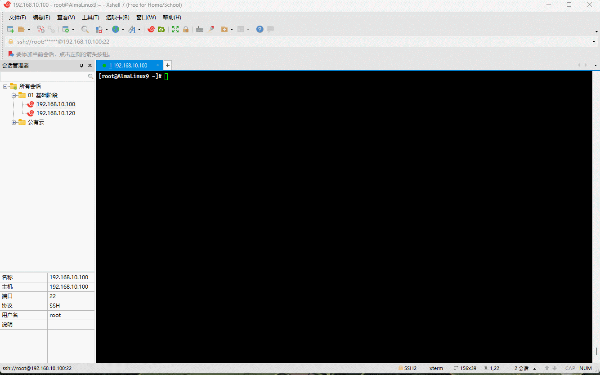


* 查看 tar 的用法：

```shell
tldr tar
```


