# 第一章：Linux 标准 IO（⭐）

* 我们知道，目前主流的人机交互方式有如下两种：
  * `命令行方式`：需要有一个控制台（终端），输入特定的指令，让计算机完成一些操作；较为麻烦，需要记住一些命令。
  * `图形化界面`：这种方式简单直观，使用者易于接受，容易上手操作。

> [!NOTE]
>
> 通常情况下，Linux 选择的是命令行方式，因为其简单和高效！！！

* 根据`冯·诺依曼`体系结构，我们知道，一个计算机是由如下的五大部件（`运算器`、`控制器`、`存储器`、`输入设备`和`输出设备`）组成。


> [!NOTE]
>
> * ① **输入设备**是指那些能够将外部信息（如数据、指令等）输入到计算机中的设备。这些信息通常以电子形式传输，供计算机处理。常见的输入设备包括：
>   * **键盘**：用于输入文字和命令。
>   * **鼠标**：用于控制屏幕上的指针，实现点选、拖拽等操作。
>   * **扫描仪**：将纸质文件转换成电子文档。
>   * **摄像头**：捕捉视频和静态图像。
>   * **麦克风**：输入声音，通常用于语音识别或通信。
>   * **触控屏**：通过触摸屏幕来直接输入数据和指令。
> * ② **输出设备** 是指那些能够将计算机处理后的信息展示出来或传递给用户的设备。输出的信息可以是视觉的、听觉的或其他形式。常见的输出设备包括：
>   * **显示器**：将计算机生成的图像和文字显示给用户。
>   * **打印机**：将电子文档输出成纸质文档。
>   * **扬声器**：输出声音，如音乐、电影的音轨等。
>   * **投影仪**：将计算机的视频输出到更大的屏幕上，常用于会议和教育。
>   * **耳机**：私密听取计算机输出的音频。
> * ③ 对于现代化操作系统（Linux、Macos、Windows）而言，标准的输入设备是键盘，标准的输出设备是显示器。

* 在 Linux 中，有三个基本的 IO （Input Output、输入输出）设备，即：

```shell
ll /dev/std*
```

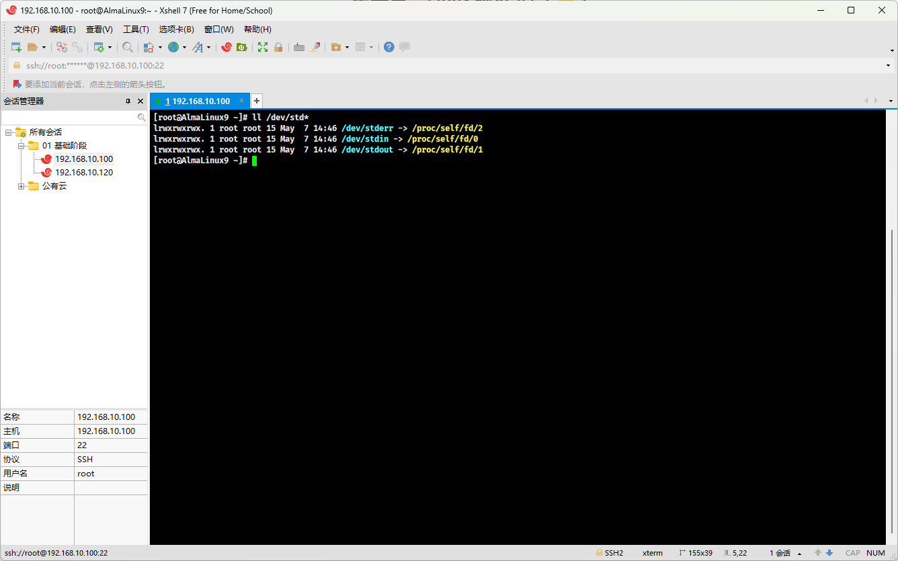

* 由上图，我们可以得知，Linux 中的标准 IO 设备是这样的，即：
  * `标准输入设备`（stdin）：使用文件描述符 `0` 来表示，对应的是终端键盘。
  * `标准输出设备`（stdout）：使用文件描述符 `1` 来表示，对应的是终端显示器。
  * `标准错误设备`（stderr）：使用文件描述符 `2` 来表示，对应的是终端显示器。

> [!NOTE]
>
> * ① 在 Linux 中，一切皆文件。
> * ② 所以，这些标准设备也都是以文件的形式保存在系统中的。

* 需要说明的是，Linux 是将这些标准设备通过软链接的方式链接到当前的终端；所以，如果我们在终端上输入各种指令，其对应的结果（正确、错误）都会显示在当前的终端上，即：

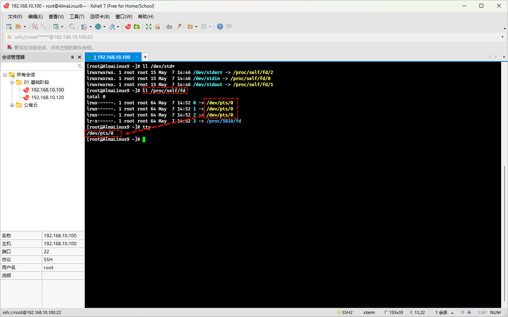

* 那么，程序的运行流程就是这样的，即：
  * ① 程序从标准输入中获取数据。
  * ② 将运行结果（或错误信息）输出到标准输出设备（或标准错误设备）。

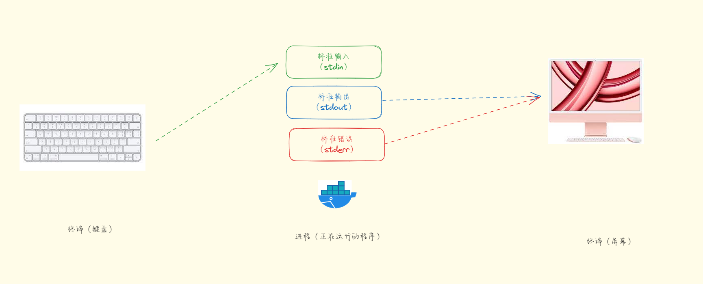

* 回顾一下，Linux 操作系统的知识，即：

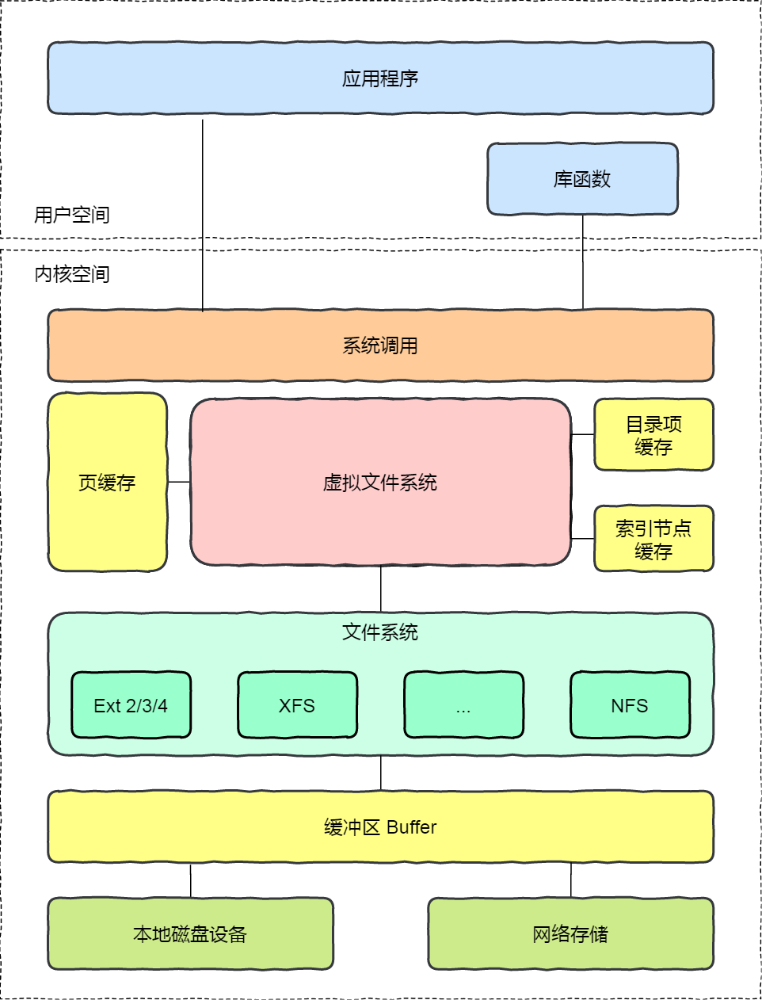

* 从上图中，我们应该知道，如果打开一个文件（读取一个文件），我们必须借助系统调用来实现，即：

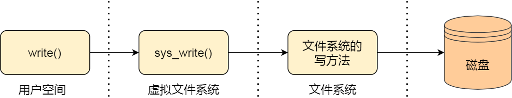

* 类似的伪代码，如下所示：

```c
// 打开文件
fd = open(const char *pathname, int flags); 
// 写数据
write(fd,...);         
// 关闭文件
close(fd);             
```

* 步骤如下：
  * ① 首先用 `open` 系统调用打开文件，`open` 的参数中 pathname 就是要打开的文件的路径，而 flags 表示模式，如：只读模式、只写模式、读写模式等。
  * ② 使用 `write` 写数据，其中 `write` 使用 `open` 所返回的`文件描述符`，并不使用文件名作为参数。
  * ③ 使用完文件后，要用 `close` 系统调用关闭文件，避免资源的泄露。

* 所以，如果打开一个文件，那么系统必定会分配一个新的文件描述符（除了 0、1、2 之外的数字），如下所示：

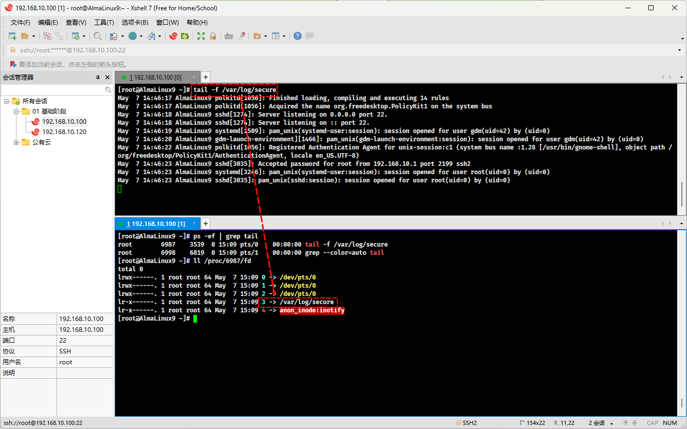


# 第二章：IO 重定向（⭐）

## 2.1 概述

* 所谓的 IO 重定向就是将默认的标准输入、标准输出、标准错误对应的设备改变，指向到新的目标。

> [!NOTE]
>
> Linux 中的标准输入设备默认是键盘，标准输出设备默认是终端，标准错误设备默认是终端，我们可以通过重定向技术将其改为文件等。

## 2.2 标准输出重定向和标准错误重定向

* 格式：

```shell
命令 操作符号 文件
```

> [!NOTE]
>
> 功能：可以将标准输出和标准错误重定向到文件，而不是默认的终端。

> [!NOTE]
>
> 支持的覆盖操作符号：
>
> ```shell
> 1> 或 > # 将标准输出重定向到文件
> ```
>
> ```shell
> 2> # 将标准错误重定向到文件
> ```
>
> ```shell
> &> # 将标准输出或标准错误重定向到文件
> ```
>

> [!IMPORTANT]
>
> 如果文件已经存在，使用覆盖操作符，内容将会被覆盖！！！

> [!NOTE]
>
> 支持的追加操作符号：
>
> ```shell
> 1>> 或 >> # 追加标准输出重定向到文件
> ```
>
> ```shell
> 2>> # 追加标准错误重定向到文件
> ```
>
> ```shell
> &>> # 追加标准输出或标准错误重定向到文件
> ```
>

> [!IMPORTANT]
>
> 如果文件已经存在，使用追加操作符，内容将不会被覆盖，只会一直追加！！！


* 示例：标准输出重定向到其它终端

```shell
ls -lah > /dev/pts/1
```

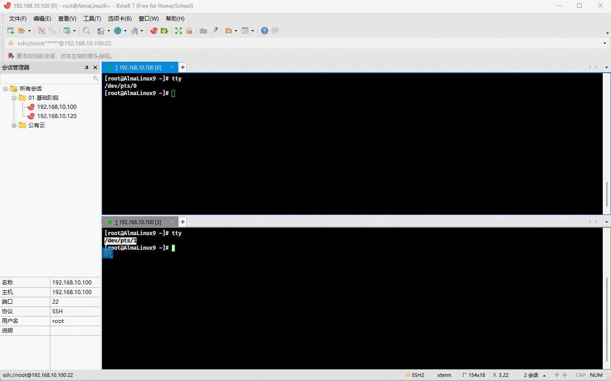


* 示例：标准错误重定向到其它终端

```shell
lss 2> /dev/pts/1
```

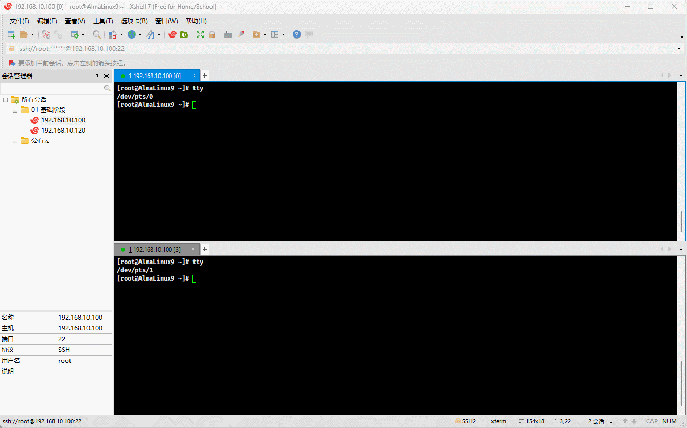


* 示例：标准输出重定向到文件（覆盖）

```shell
cat /etc/fstab > a.log
```

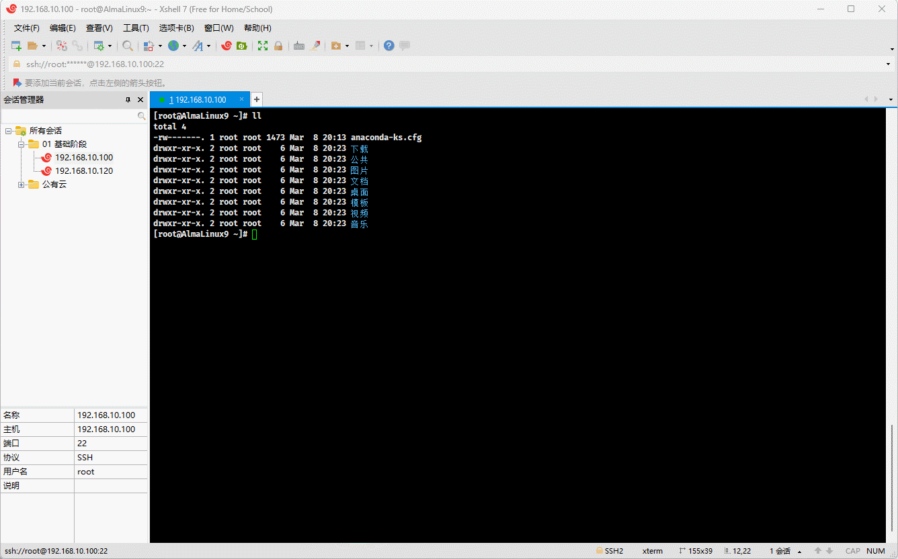


* 示例：标准输出重定向到文件（追加）

```shell
cat /etc/fstab >> a.log
```

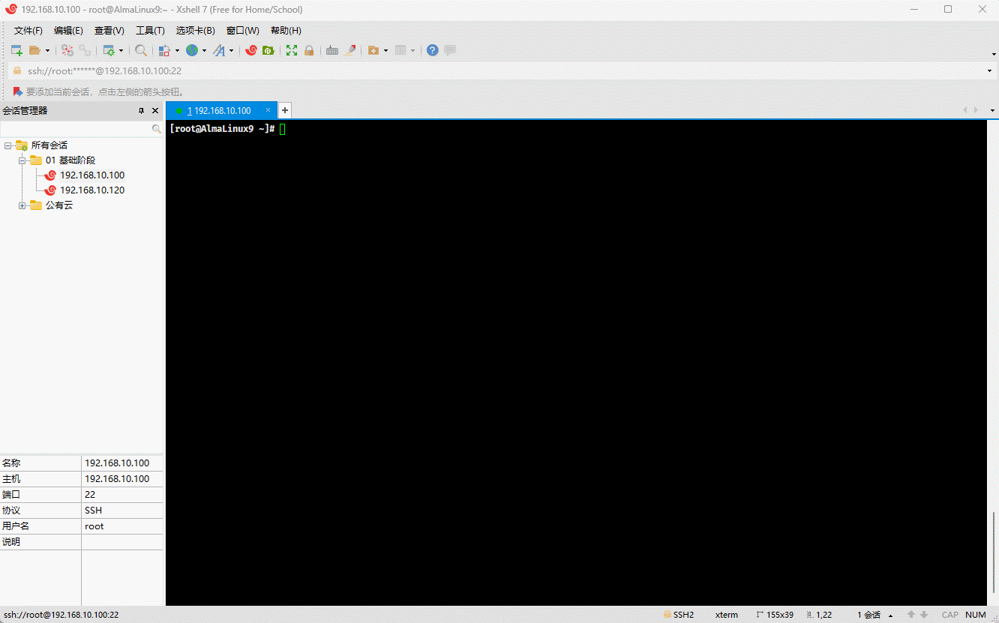


* 示例：标准错误重定向到文件（覆盖）

```shell
cat /dev/abc 2> err.log
```


* 示例：标准错误重定向到文件（追加）

```shell
cat /dev/abc 2>> err.log
```


* 示例：标准输出和标准错误重定向到不同的文件

```shell
cat /dev/abc > out.log 2> err.log
```


* 示例：标准输出和标准错误重定向到同一个文件（覆盖）

```shell
cat /etc/fstab &> out.log
```

```shell
cat /dev/abc &> out.log
```

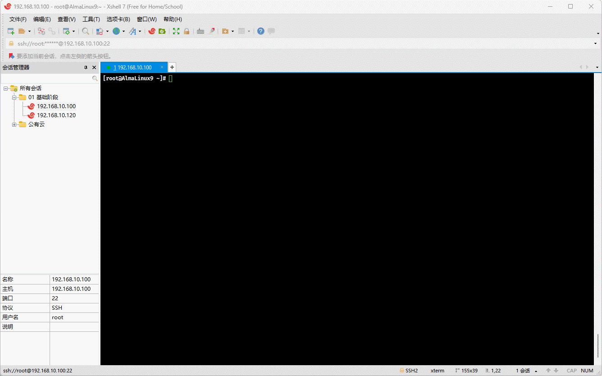


* 示例：标准输出和标准错误重定向到同一个文件（追加）

```shell
cat /etc/fstab &>> out.log
```

```shell
cat /dev/abc &>> out.log
```

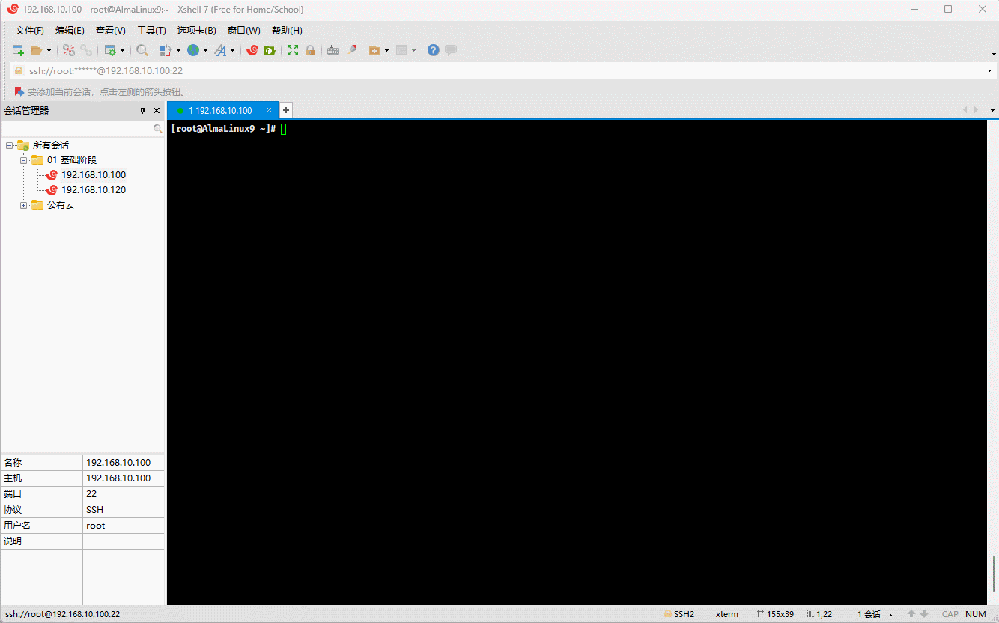


* 示例：清除大文件

```shell
cat /dev/null > out.log # 通用写法
```

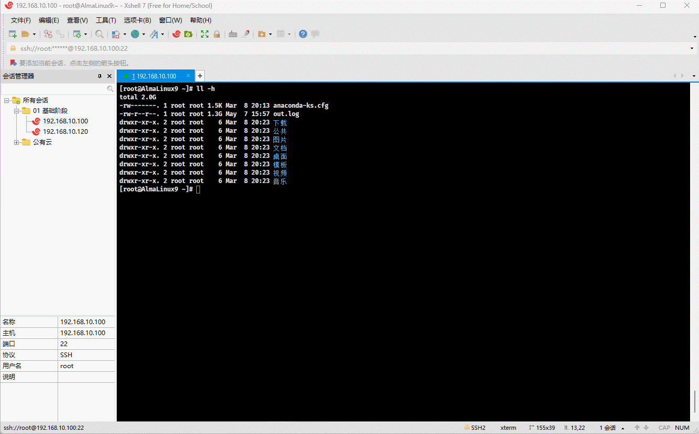

## 2.3 标准输入重定向

### 2.3.1 概述

* 通常而言，在 Linux 中的标准输入都是来自键盘的输入；但是，有的时候，我们却希望命令的标准输入能够从文件中读取，此时就需要使用标准输入重定向了。
* Linux 中有些命令只支持标准输入，判断方法就是：不跟任何选项和参数，直接回车，看是否等待标准输入，如果等待，就表明该命令可以使用标准输入重定向，即：

```shell
cat
```


### 2.3.2 tr 命令

* 命令：

```shell
tr [-c][-d][-s] SET1 [SET2]
```

> [!NOTE]
>
> * 功能：对来自标准输入的字符进行替换、压缩和删除。
> * 选项：
>   * -c, -C, --complement：使用 SET2 替换 SET1 中没有包含的字符。
>   * -d, --delete：删除 SET1 中的所有字符，不转换。
>   * -s, --squeeze-repeats：压缩 SET1 中的重复的字符，即删除重复字符。
>   * -t, --truncate-set1：将 SET1 用 SET2 替换，SET2 不够的，就不处理。
> * 常用的通配符：
>
> ```shell
> \NNN            # 八进制值为 NNN 的字符（1到3位八进制数字）
> \\              # 反斜杠
> \a              # 听得见的警告声（铃声）
> \b              # 退格
> \f              # 换页
> \n              # 换行
> \r              # 回车
> \t              # 水平制表符
> \v              # 垂直制表符
> CHAR1-CHAR2     # 从 CHAR1 到 CHAR2 的所有字符，按升序排列
> [CHAR*]         # 在集合 SET2 中，根据 SET1 的长度复制 CHAR 字符
> [CHAR*REPEAT]   # REPEAT 次数的 CHAR字符，如果 REPEAT 以 0 开头，则表示八进制数
> [:alnum:]       # 所有字母和数字
> [:alpha:]       # 所有字母
> [:blank:]       # 所有水平空白
> [:cntrl:]       # 所有控制字符
> [:digit:]       # 所有数字
> [:graph:]       # 所有可打印字符，不包括空格
> [:lower:]       # 所有小写字母
> [:print:]       # 所有可打印字符，包括空格
> [:punct:]       # 所有标点符号
> [:space:]       # 所有水平或垂直的空白字符
> [:upper:]       # 所有大写字母
> [:xdigit:]      # 所有十六进制数字
> [=CHAR=]        # 所有与 CHAR 等价的字符
> ```
>


* 示例：将包含 1 2 3 的字符，使用 a b c 来替换

```shell
tr 123 abc
```


* 示例：小写字母转为大写字母

```shell
tr a-z A-Z
```


* 示例：删除 0-9 的所有数字

```shell
tr -d 0-9
```


* 示例：压缩重复的字符

```shell
tr -s 'sn'
```


### 2.3.3 单行标准输入重定向

* 格式：

```shell
命令 0< 文件
```

```shell
命令 < 文件
```


* 示例：

```shell
seq -s + 10 > a.txt # 先输出重定向
```

```shell
bc < a.txt # 再输入重定向
```

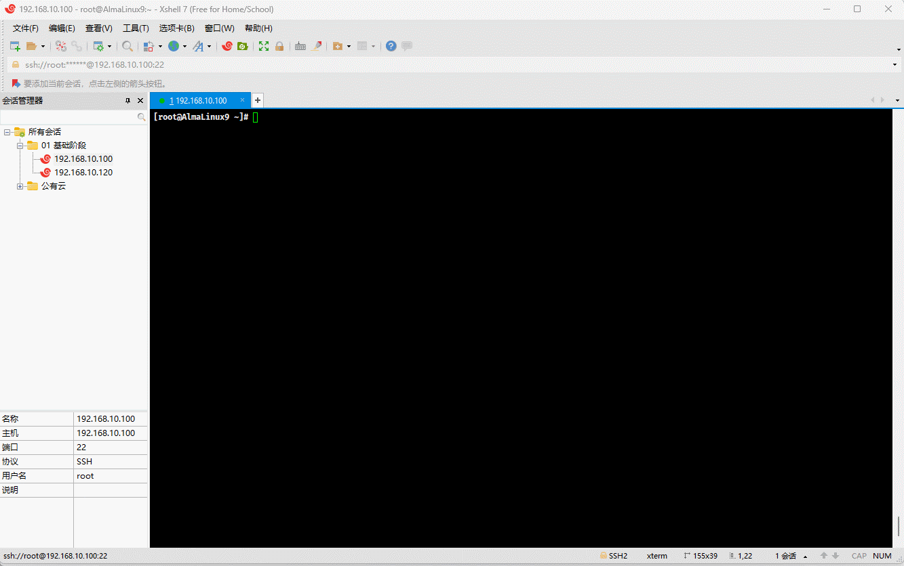

### 2.3.4 多行标准输入重定向

* 格式：

```shell
cat > 文件 <<EOF 
...
...
EOF
```

> [!NOTE]
>
> `<<EOF` 表示多行重定向，表示从键盘将多行重定向到 stdin ，直到 EOF 位置的所有文本都发送给 stdin ，专业称为“就地文本”。


* 示例：

```shell
cat > test.txt <<EOF
1
2
3
4
5
EOF
```


# 第三章：管道（⭐）

## 3.1 概述

* 在 Shell 中，可以将两个命令或多个命令通过 `|` 连接起来，将前一个命令的输出作为后一个命令的输入，就像水管将两个命令连接起来一样。 


* 格式：

```shell
COMMAND1 | COMMAND2 | COMMAND3 ...
```

> [!NOTE]
>
> 功能：将 `命令1` 的 `stdout` 通过`管道`作为 `命令2` 的 `stdin` ，将`命令2` 的 `stdout` 通过`管道`作为`命令3` 的 `stdin` 。

> [!IMPORTANT]
>
> * ① 所有的命令会在当前 shell 进程的子 shell 进程中执行。
> * ② 默认情况下，`stderr` 是不能通过管道转发的，可以通过 `2>&1` 或 `|&` 实现，即 `COMMAND1 2> &1 | COMMAND2` 或 `COMMAND1 1& COMMAND2`。


* 示例：

```shell
seq -s + 10 | bc
```


* 示例：

```shell
echo $PATH | tr ':' '\n'
```


* 示例：

```shell
 ifconfig| head -n 2 | tail -n 1 | tr -s ' ' | cut -d " " -f 3
```


## 3.2 tee 命令

* 格式：

```shell
命令1 | tee [-a] 文件名 | 命令2
```

> [!NOTE]
>
> * 功能：将 `命令1` 的 `stdout` 保存到文件中，并作为 `命令2` 的 `stdin`。
> * 其原理如下：
>
> 


* 示例：

```shell
tee abc.log
```


* 示例：

```shell
echo "helloworld" | tee abc.log
```


* 示例：

```shell
echo "helloworld" | tee abc.log | tr 'a-z' 'A-Z'
```

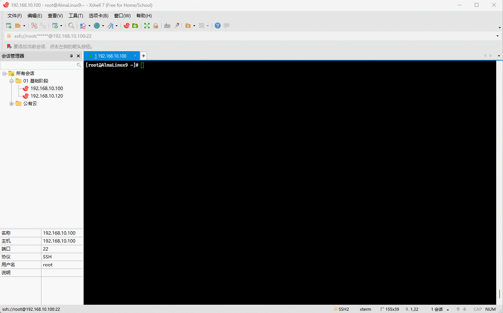


* 示例：

```shell
echo "helloworld" | tr 'a-z' 'A-Z'| tee abc.log 
```


* 示例：

```shell
mkdir -pv /etc/docker
```

```shell
cat <<EOF | tee /etc/docker/daemon.json
{
  "exec-opts": ["native.cgroupdriver=systemd"],	
  "registry-mirrors": [
    "https://du3ia00u.mirror.aliyuncs.com",
    "https://docker.m.daocloud.io",
    "https://hub-mirror.c.163.com",
    "https://mirror.baidubce.com",
    "https://docker.nju.edu.cn",
    "https://docker.mirrors.sjtug.sjtu.edu.cn"
  ],
  "live-restore": true,
  "log-driver":"json-file",
  "log-opts": {"max-size":"500m", "max-file":"3"},
  "max-concurrent-downloads": 10,
  "max-concurrent-uploads": 5,
  "storage-driver": "overlay2"
}
EOF
```


* 示例：

```shell
mkdir -pv /etc/docker
```

```shell
tee /etc/docker/daemon.json <<-'EOF'
{
  "exec-opts": ["native.cgroupdriver=systemd"],	
  "registry-mirrors": [
    "https://du3ia00u.mirror.aliyuncs.com",
    "https://docker.m.daocloud.io",
    "https://hub-mirror.c.163.com",
    "https://mirror.baidubce.com",
    "https://docker.nju.edu.cn",
    "https://docker.mirrors.sjtug.sjtu.edu.cn"
  ],
  "live-restore": true,
  "log-driver":"json-file",
  "log-opts": {"max-size":"500m", "max-file":"3"},
  "max-concurrent-downloads": 10,
  "max-concurrent-uploads": 5,
  "storage-driver": "overlay2"
}
EOF
```

