> [!IMPORTANT]
>
> 没有必要死磕 vi 和 vim ，能熟练使用 vi 或 vim 打开文件、修改文件、保存文件即可！！！


# 第一章：回顾 vi 和 vim

## 1.1 vi 和 vim 简介

* vi 和 vim 是两个流行的`文本编辑器`，它们在 Unix 和 Linux 系统中广泛使用。
* 它们都是基于`命令行`的`编辑器`，这意味着用户需要使用`键盘命令`来`编辑文本`。

> [!NOTE]
>
> * ① vi 是一个古老的编辑器，它于 `1976` 年首次发布。vi 是一个非常强大的编辑器，它提供了许多高级功能，但它也以其陡峭的学习曲线而闻名。
> * ② vim 是 vi 的一个改进版本，它于 `1991` 年首次发布。vim 比 vi 更强大，它提供了更多的功能和更好的用户界面。vim 也是一个非常流行的编辑器，它在许多 Unix 和 Linux 系统中都是默认的编辑器。
> * ③ vi 是 Linux 系统自带的，不需要额外安装，但是功能没有 vim 强；vim 可能需要额外安装，是 vi 的升级版，`在实际工作中大多使用 vim` 。

## 1.2 vim 的基本使用（⭐）

### 1.2.1 vim 命令格式

* 命令格式：

```shell
vim [OPTION] 文件...
```

* 常用选项：

```shell
# 打开文件后，让光标处于第 10 行的行首，如果只是 + ，则为行尾
+10 file 
```

```shell
# 让光标处于第一个被 PATTERN 匹配的行首，PATTERN 可以简单理解为字符串，其实是正则表达式
+/PATTERN  file 
```

```shell
# 以二进制的方式打开文件
-b file 
```

```shell
# 比较多个文件，相当于 vimdiff file1 file2 ...
-d file1 file2 ... 
```

> [!NOTE]
>
> - ① 如果文件`不存在`，则会`自动创建`；如果文件`存在`，则是`编辑文件`。
> - ② 如果文件`所在路径`中的`目录`不存在，则会在保存并退出的时候`报错`。

### 1.2.2 基本使用

* 基本使用步骤：
  * ① 打开文件，即：`vim 文件名`。
  * ② 通过字母 `i` ，`进入编辑模式`，该模式可以编辑（修改）文件。
  * ③ 通过 `esc` ，`退出编辑模式`。
  * ④ 通过 `:wq!` ，进行`保存并退出`。
  * ⑤ 通过 `:q!` ，进行`强制退出不保存`。


* 示例：

```shell
vim abc.log
```

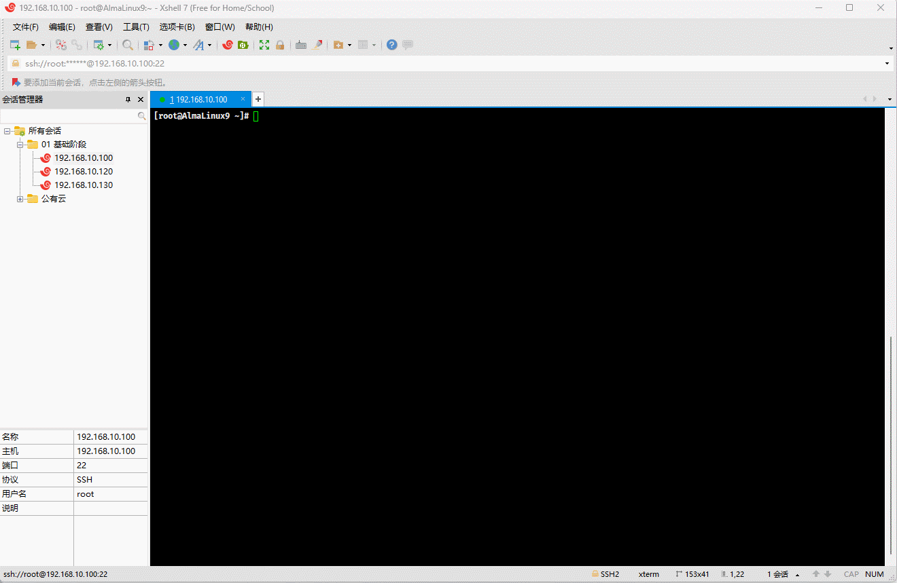


# 第二章：vim 工作模式

## 2.1 概述

* vim 常用的工作模式有 4 种，即：

| 模式                               | 功能                                                         | 备注                                                         |
| ---------------------------------- | ------------------------------------------------------------ | ------------------------------------------------------------ |
| 普通模式（命令模式）               | 通过 vi 或 vim 命令打开文件后进入的模式。<br>主要用于浏览和操作文本。<br> | 在这个模式下，用户可以通过按键来执行各种命令（如：移动光标、删除行、复制粘贴等），而不是直接编辑文本。 |
| 插入模式（编辑模式）               | 用于编辑（修改）文件内容。                                   | 可以通过按 `i`（在光标前插入），`I`（在行首插入），`a`（在光标后插入），`A`（在行尾插入）进入插入模式。<br/>在插入模式下，按 `Esc` 返回普通模式。 |
| 底行模式(扩展命令模式，命令行模式) | 用于执行命令，如：保存文件、退出 Vim、搜索等。               | 在普通模式下按 `:` 进入命令模式。<br/>常用命令有：`:w`（保存文件），`:q`（退出），`:wq`（保存并退出），`:q!`（不保存退出），`:/pattern`（搜索 pattern）。 |
| 可视化模式                         | 用于选择文本块。                                             | 可以通过按 `v`（字符模式），`V`（行模式），`Ctrl+v`（块模式）进入可视模式。<br/>在可视模式下，可以对选择的文本进行操作，如：复制、删除等。 |

> [!NOTE]
>
> 因为在`普通模式`下，用户输入的`字符`会被解释为命令，而不是插入到文本中，所以一些用户习惯称其`普通模式`为`命令模式`。

* 其对应的流程，如下所示：

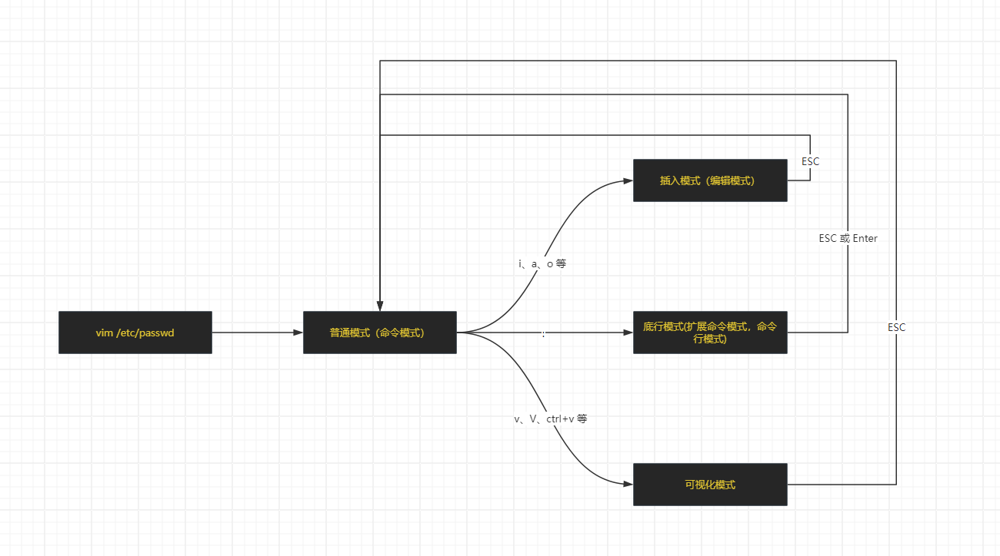

## 2.2 准备工作

* 准备测试数据：

```shell
cp /etc/passwd test.log
```


* 定制 vim ：

```shell
vim ~/.vimrc
```

```shell
" 设置光标所在行的标识线
set cursorline
" 在命令模式中，底部显示，当前输入的指令
set showcmd
" 开启行号
set nu
" 启用状态行
set laststatus=2
" 创建一个函数返回模式的简写
function! MyMode()
  let l:mode = mode()
  return l:mode ==# 'n' ? 'NORMAL' :
        \ l:mode ==# 'i' ? 'INSERT' :
        \ l:mode ==# 'R' ? 'REPLACE' :
        \ l:mode ==# 'v' ? 'VISUAL' :
        \ l:mode ==# 'V' ? 'V-LINE' :
        \ l:mode ==# '^V' ? 'V-BLOCK' :
        \ l:mode ==# 'c' ? 'COMMAND' :
        \ 'OTHER'
endfunction
" 自定义状态行显示
set statusline=%f                           " 文件名
set statusline+=%h                          " 帮助文件标志
set statusline+=%m                          " 修改标志
set statusline+=%r                          " 只读标志
set statusline+=%w                          " 预览窗口标志
set statusline+=\ [%{MyMode()}]             " 当前模式
set statusline+=\ %y                        " 文件类型
set statusline+=\ %p%%                      " 文件位置百分比
set statusline+=\ %l:%c                     " 行号和列号
```

```shell
bash
```


## 2.3 普通模式 --> 插入模式

* 普通模式（命令模式）--> 插入模式（编辑模式）：

```shell
i # insert ，在光标所在位置输入
```

```shell
I # 在当前光标所在行的行首输入
```

```shell
a # append，在光标所在位置的后面输入
```

```shell
A # 在当前光标所在行的行尾输入
```

```shell
o # 在当前光标所在行的下方打开一个新行
```

```shell
O # 在当前光标所在行的上方打开一个新行
```


* 示例：`i`

```shell
vim abc.log
```

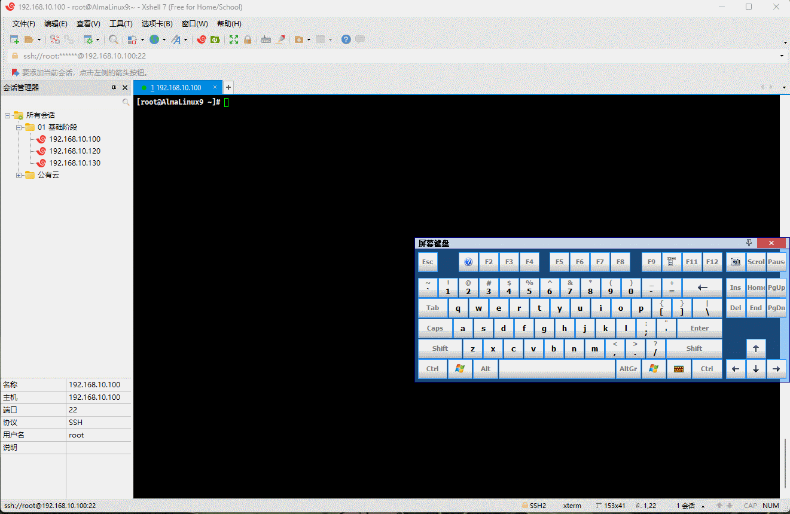


* 示例：`I`

```shell
vim abc.log
```


* 示例：`a`

```shell
vim abc.log
```


* 示例：`A`

```shell
vim abc.log
```

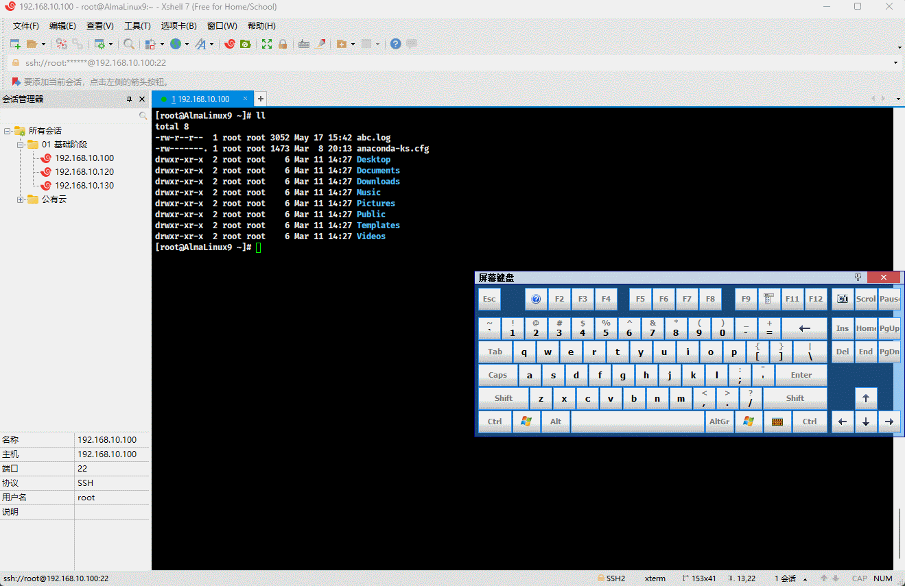


* 示例：`o`

```shell
vim abc.log
```


* 示例：`O`

```shell
vim abc.log
```


## 2.4 插入模式 --> 普通模式

* 插入模式（编辑模式）--> 普通模式（命令模式）：

```shell
ESC
```


* 示例：

```shell
vim abc.log
```


## 2.5 普通模式 -->  底行模式

* 普通模式（命令模式）-->  底行模式(扩展命令模式，命令行模式)

```shell
:
```


* 示例：

```shell
vim abc.log
```


## 2.6 底行模式 --> 普通模式

* 底行模式(扩展命令模式，命令行模式) --> 普通模式（命令模式）

```shell
ESC
```

```shell
Enter
```


* 示例：

```shell
vim abc.log
```


# 第三章：底行模式

## 3.1 定制 vim 

### 3.1.1 概述

* 有的时候，我们需要对 vim 进行定制，以便符合我们的需求，如：默认情况下，不能显示行号，我们希望在通过 vim 打开文件的时候就显示行号，可以通过修改下面的配置文件实现，即：

```shell
/etc/vimrc # 全局
```

```shell
~/.vimrc # 个人
```

* 在 `/etc/vimrc` 和 `~/.vimrc` 中配置的功能如下：

  * 行号：

  ```shell
  set number # 显示行号，简写 set nu
  ```

  ```shell
  set nonumber # 取消显示行号，简写 set nonu
  ```

  * 忽略字符的大小写：

  ```shell
  set ignorecase # 启用忽略字符的大小写，简写 set ic
  ```

  ```shell
  set noignorecase # 禁用忽略字符的大小写，简写 set noic
  ```

  * 自动缩进：

  ```shell
  set autoindent # 开启自动缩进，简写  set ai
  ```

  ```shell
  set noautoindent # 禁用自动缩进，简写  set noai
  ```

  * 复制保留格式：

  ```shell
  set paste # 开启复制保留格式
  ```

  ```shell
  set nopaste # 禁用复制保留格式
  ```

  * 显示 Tab 和换行符 `^I` 和 `$` 显示：

  ```shell
  set list # 开启显示 Tab 和换行符 `^I` 和 `$` 显示
  ```

  ```shell
  set nolist # 禁用显示 Tab 和换行符 `^I` 和 `$` 显示
  ```

  * 高亮搜索：

  ```shell
  set hlsearch # 开启高亮搜索
  ```

  ```shell
  set nohlsearch # 禁用高亮搜索
  ```

  * 语法高亮：

  ```shell
  syntax on # 开启语法高亮
  ```

  ```shell
  syntax of # 禁用语法高亮
  ```

  *  文件格式：

  ```shell
  set fileformat=dos # 启用 window 格式，简写 set ff=dos
  ```

  ```shell
  set fileformat=unix # 禁用 unix 格式，简写 set ff=unix
  ```

  * Tab 用空格代替：

  ```shell
  set expandtab # 启用 Tab 用空格代替，默认为8个空格代替 Tab，简写 set et
  ```

  ```shell
  set noexpandtab # 禁用 Tab 用空格代替
  ```

  * Tab 用指定空格的个数代替：

  ```shell
  set tabstop=4 # 指定 4 个空格代替 Tab，简写 set ts=4
  ```

  * 设置文本宽度：

  ```shell
  set textwidth=65 # vim 独有
  ```

  ```shell
  set wrapmargin=15
  ```

  * 设置光标所在行的标识线：

  ```shell
  set cursorline # 启用，简写 set cul
  ```

  ```shell
  set nocursorline # 禁用
  ```

* 我们也可以在 vim 中，通过 `:set` 或 `:set all` 查看帮助，即：

```shell 
:set all
```


### 3.1.2 手动定制 vim

* 我们可以手动修改 `/etc/vimrc` 或 `~/.vimrc`，将上述的 vim 功能配置写入到该文件中，就可以实现手动定制 vim 。


* 示例：

```shell
vim ~/.vimrc
```

```shell
" 设置光标所在行的标识线
set cursorline

" 自动折行
set wrap

" 只有遇到指定的符号（空格、连词号等），才发生折行，即不会在单词内部折行
set linebreak

" 显示行号
set number

" 在命令模式中，底部显示，当前输入的指令
set showcmd

" 使用 utf-8 编码
set encoding=utf-8  

" 启用自动缩进
set autoindent

" 按下 Tab 键，显示空格数
set tabstop=2

" 开启文件类型检查，加载和该类型对应的缩进规则
filetype indent on

" 在进入插入模式时禁用 paste 模式
autocmd InsertEnter * set nopaste

" 在离开插入模式时启用 paste 模式
autocmd InsertLeave * set paste
```

```shell
bash
```

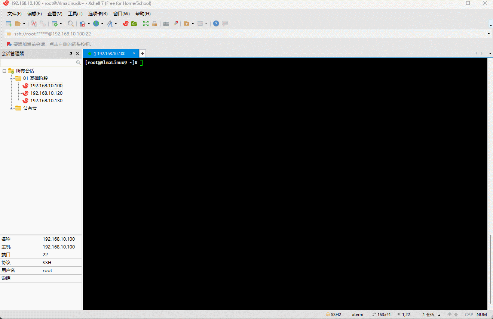

### 3.1.3 自动化定制 vim 

* 所谓的自动化定制 vim ，就是有大神已经做了大量实践，并为我们写好了脚本，形成了[代码库](https://github.com/amix/vimrc.git)，我们只需要下载安装即可。

> [!IMPORTANT]
>
> 需要删除自己的个性化 vim 配置，即 `rm -f ~/.vimrc` 。


* 示例：只针对 root 用户

```shell
git clone --depth=1 https://github.com/amix/vimrc.git ~/.vim_runtime
```

```shell
sh ~/.vim_runtime/install_awesome_vimrc.sh
```

```shell
# 自定义配置
tee ~/.vim_runtime/my_configs.vim <<'EOF'
" 显示行号
set number
" 设置光标所在行的标识线
set cursorline
" 在命令模式中，底部显示，当前输入的指令
set showcmd
EOF
```

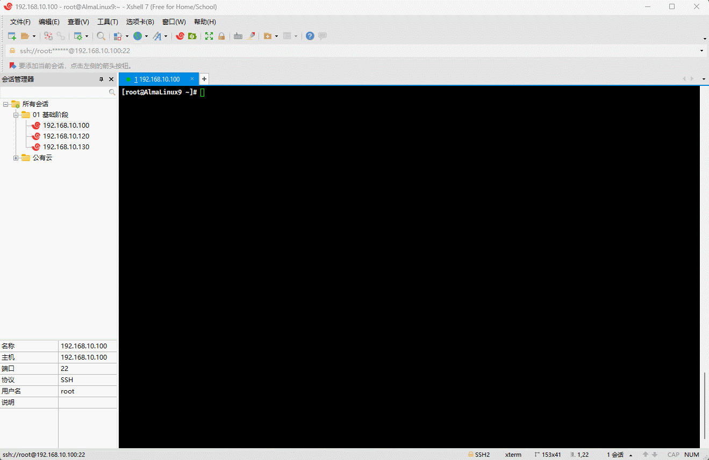


* 示例：为多个用户安装：

```shell
git clone --depth=1 https://github.com/amix/vimrc.git /opt/vim_runtime
```

```shell
# 其中 x 是用户名，可以指定多个用户，如：x y z
sh /opt/vim_runtime/install_awesome_parameterized.sh /opt/vim_runtime x
```

```shell
# 所有用户
sh /opt/vim_runtime/install_awesome_parameterized.sh /opt/vim_runtime --all 
```


## 3.2 基本使用

* 写入磁盘文件，类似于 win 中的 ctrl + s：

```shell
:w 
```


* 示例：

```shell
:w
```


* 写入并退出，即 write quit：

```shell
:wq 
```


* 示例：

```shell
:wq
```


* 写入并退出，相当于 `:wq`：

```shell
:x # 注意，:X 是加密，只不过很少使用
```

> [!IMPORTANT]
>
> * ① `:X` 是将文件的内容加密，在实际工作中，很长使用。
> * ② 在实际工作中，非常容易将 `:x` 误操作为 `:X` ，导致文件内容加密；如果坚持使用 `:x`，可以先将文件的内容`备份`，即 `cp -a passwd{,.bak}`。


* 示例：

```shell
:x
```


* 退出：

```shell
:q
```

> [!NOTE]
>
> `:q` 只适合没有修改文件内容，如果修改了文件内容，vim 会提示你输入 `:wq` 或`:q!`。


* 示例：

```shell
:q
```


* 强制退出，即使文件内容修改，即将会丢失修改的文件内容 ：

```shell
:q!
```


* 示例：

```shell
:q!
```


* 读取文件内容到当前的文件中：

```shell
:r filename 
```


* 示例：

```shell
:r /etc/hosts
```


* 将当前文件的内容写入到另一个文件中：

```shell
:w filename 
```


* 示例：

```shell
:w passwd.bak
```

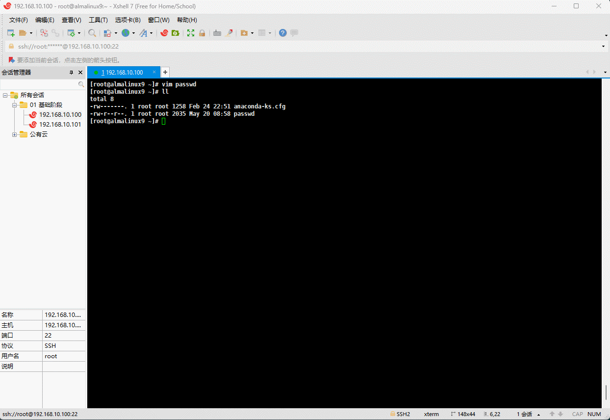


* 执行命令：

```shell
:!command 
```


* 示例：

```shell
:! dnf -y install nginx
```

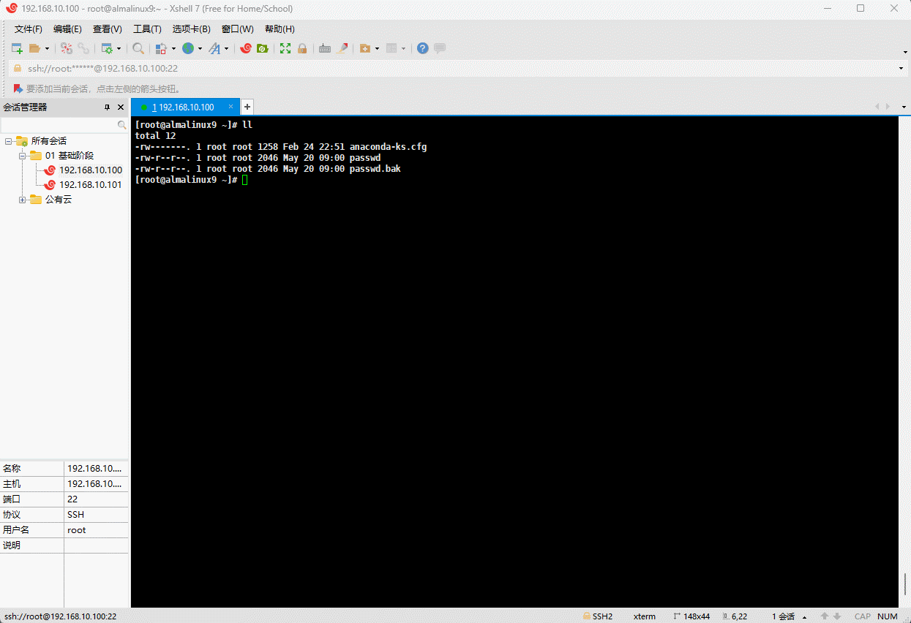


* 读入命令的输出：

```shell
:r!command # 输入 Enter 执行命令
```


## 3.3 地址定界

* 格式：

```shell
:start_position,end_position COMMAND
```

* 其中，`start_position,end_position` 的格式，如下所示：

```shell
n # 表示第 n 行，如果是 2 ，就表示第 2 行
```

```shell
n,m # 表示从 n 行开始，到 m 行结束
```

```shell
. # 当前行
```

```shell
$ # 最后一行
```

```shell
.,$-1 # 从当前行到倒数第 2 行
```

```shell
% # 全文，相当于 1,$
```

```shell
# 从当前行向下查找，直接匹配到 pattern 的第一行，即正则表达式
/pattern/ 
```

```shell
# 从第一次被 pattern1 模式匹配到的行开始，一直到第一次被 pattern2 匹配到的行结束
/pattern1/,/pattern2/ 
```

```shell
# 从指定的行开始，一直站到第一个匹配的 pattern 行结束
n,/pattern/ 
```

```shell
# 向下找到第一个匹配 patttern 的行到整个文件的结尾的所有行
/pattern/,$ 
```

* 其中，`COMMAND` 如下所示：

```shell
d # 删除
```

```shell
y # 复制
```

```shell
w file # 将指定范围的行写入到指定文件中
```

```shell
r file # 在指定位置插入指定文件中的所有内容
```


* 示例：复制第 2 行

```shell
:2y # 粘贴是 p
```

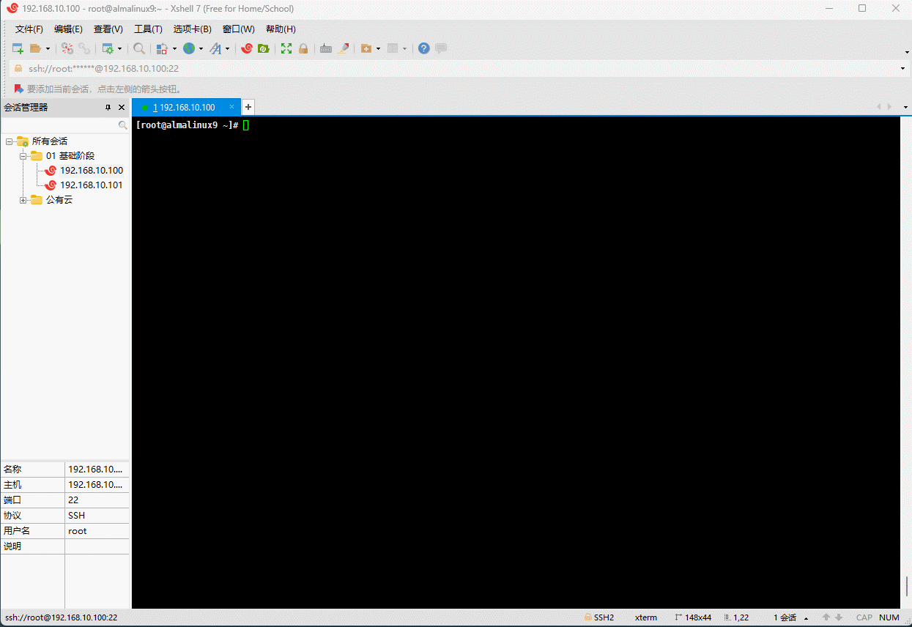


* 示例：复制第 2 行到最后一行

```shell
:2,$y # 粘贴是 p
```


* 示例：复制当前行到最后一行

```shell
:.,$y # 粘贴是 p
```

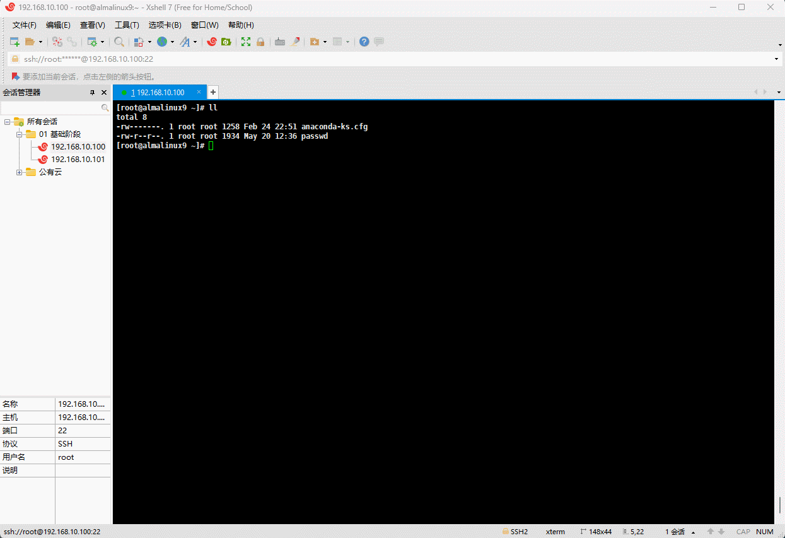


* 示例：删除第 2 行

```shell
:2d
```


* 示例：删除第 2 行到最后一行

```shell
:2,$d 
```

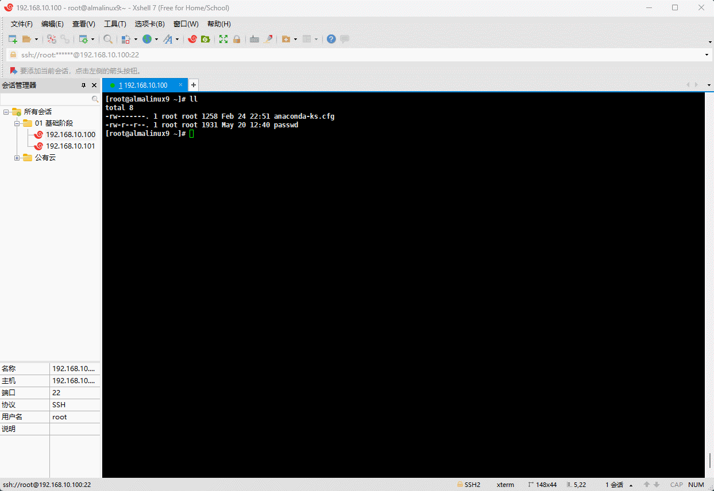


* 示例：删除当前行到最后一行

```shell
:.,$d
```


* 示例：删除全部内容

```shell
:%d
```


## 3.4 查找并替换

* 格式：

```shell
:s/要查找的内容/替换的内容/修饰符
```

* 说明：

```shell
要查找的内容，可以使用基本正则表达式模板
```

```shell
替换的内容，不能使用基本正则表达式模板，但可以使用\1, \2, ...等后向引用符号；
还可以使用“&”引用前面查找时查找到的整个内
```

* 修饰符：

```shell
i # 忽略大小写，ignore
```

```shell
g # 全局替换，默认情况下，替换第一行中所有匹配的内容，global
```

```shell
# 全局替换，默认情况下，替换第一行中所有匹配的内容，
# 但是每次替换前询问，global confirm ，推荐！！！
gc 
```

> [!NOTE]
>
> 查找并替换的分隔符 `/` 可以使用其它字符替换，如：`#` 或 `@` 。


* 示例：查找到 root 并替换为 abc，只替换一个

```shell
:s/root/abc/i
```


* 示例：替换第一行中所匹配的所有内容

```shell
:s/root/abc/gc
```


* 示例：全局替换

```shell
:%s/root/abc/gc
```


# 第四章：普通模式

## 4.1 概述

* vim 中的普通模式（命令模式），主要用于浏览和操作文本。但是，用户可以通过按键来执行各种命令（如：移动光标、删除行、复制粘贴等），而不是直接编辑文本。

## 4.2 保存或退出

* 格式：

```shell
ZZ # 保存退出
```

```shell
ZQ # 不保存退出
```


* 示例：保存退出

```shell
ZZ
```

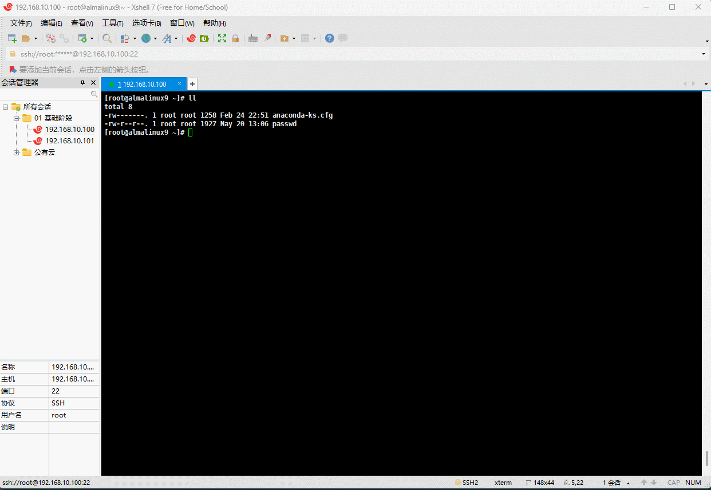


* 示例：不保存退出

```shell
ZQ
```


## 4.3 行间移动

* 跳转到首行：

```shell
gg
```

* 跳转到行尾：

```shell
G # shift + g
```

* 跳转到指定的行：

```shell
n + gg
```


* 示例：跳转到首行

```shell
gg
```


* 示例：跳转到行尾

```shell
G
```

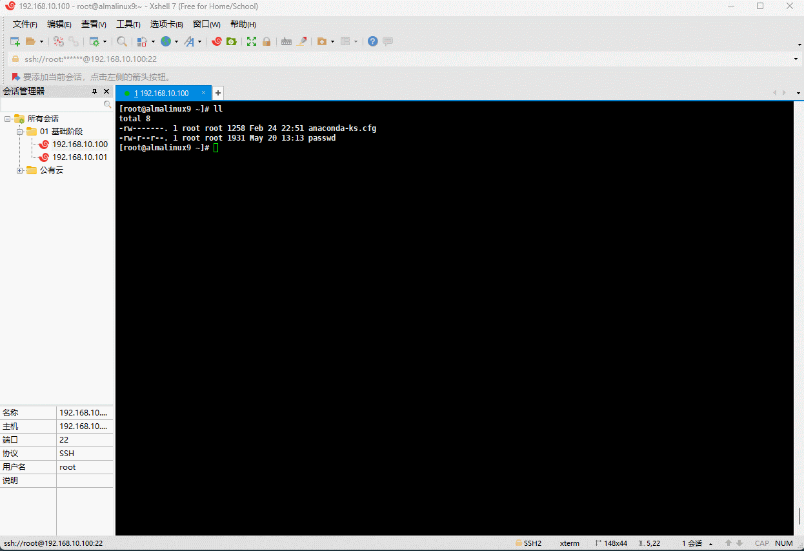


* 示例：跳转到指定的行

```shell
20 + gg
```

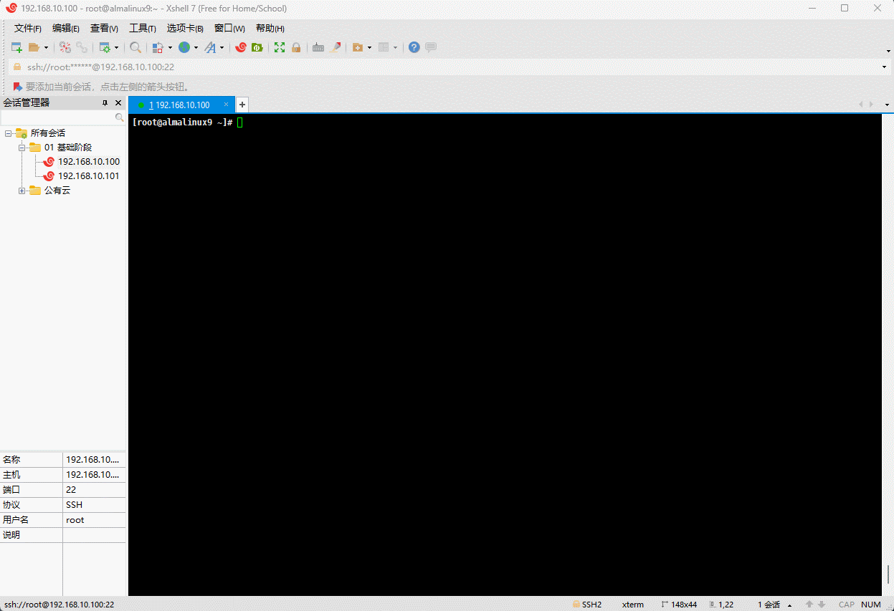

## 4.4 字符编辑

* 格式：

```shell
x # 删除光标处的字符
```

```shell
n + x # 删除光标所在处后的 n 个字符，n =1,2,3...
```

```shell
xp # 交换光标所在处的字符及其后面字符的位置
```

```shell
~ # 转换大小写
```

```shell
J # 删除当前行后的换行符
```


* 示例：删除光标处的字符

```shell
x
```


* 示例：删除光标所在处后的 5 个字符

```shell
5x
```


* 示例：交换光标所在处的字符及其后面字符的位置

```shell
xp
```

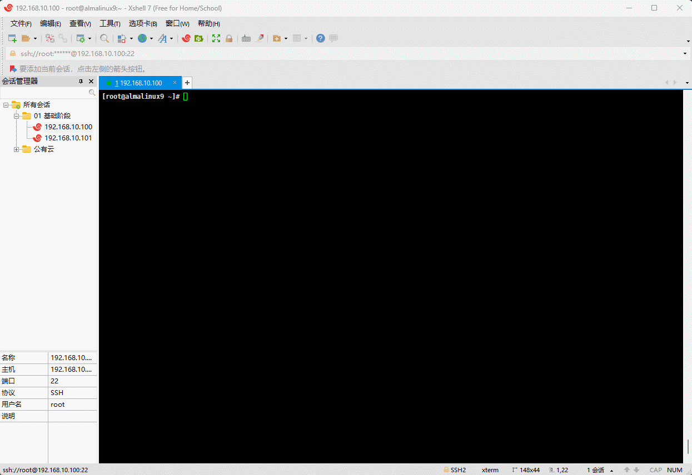


* 示例：转换大小写

```shell
~
```


* 示例：删除当前行后的换行符

```shell
J
```


## 4.5 行首行尾跳转

* 格式：

```shell
0 # 跳转到行首
```

```shell
^ # 跳转到行首的第一个非空白字符
```

```shell
$ # 跳转到行尾
```


* 示例：跳转到行首

```shell
0
```


* 示例：跳转到行首的第一个非空白字符

```shell
^
```

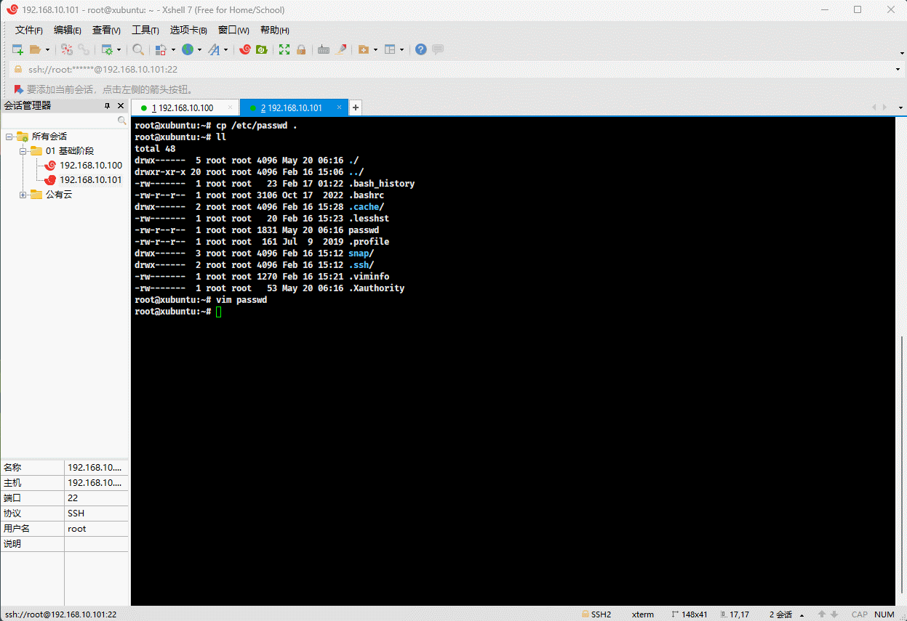


* 示例：跳转到行尾

```shell
$
```

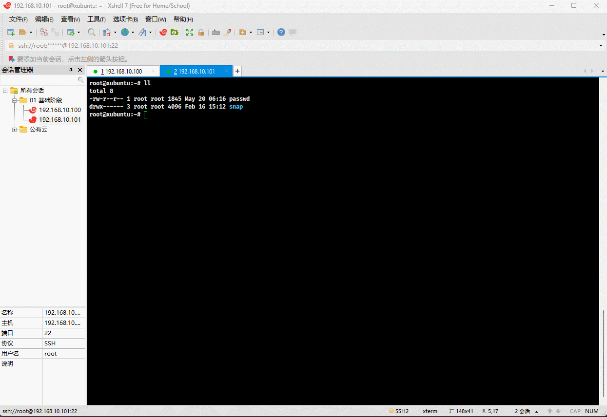

## 4.6 删除

* 格式：

```shell
d0 # 删除到行首
```

```shell
d^ # 删除到非空行首
```

```shell
d$ # 删除到行尾
```

```shell
dd # 删除光标所在行
```

```shell
n + dd # 多行删除
```

```shell
D # 从光标所在位置删除到行尾，即 d$
```


* 示例：删除到行首

```shell
d0
```


* 示例：删除到非空行首

```shell
d^
```


* 示例：删除到行尾

```shell
d$
```


* 示例：删除光标所在行

```shell
dd
```


* 示例：多行删除

```shell
5 + dd
```


* 示例：从光标所在位置删除到行尾

```shell
D
```


## 4.7 复制

* 格式：

```shell
y0 # 复制到行首
```

```shell
y^ # 复制到非空行首
```

```shell
y$ # 复制到行尾
```

```shell
yy # 复制光标所在行
```

```shell
n + yy # 复制多行
```


* 示例： 复制到行首

```shell
y0
```


* 示例：复制到非空行首

```shell
y^
```


* 示例：复制到行尾

```shell
y$
```


* 示例：复制光标所在行

```shell
yy
```

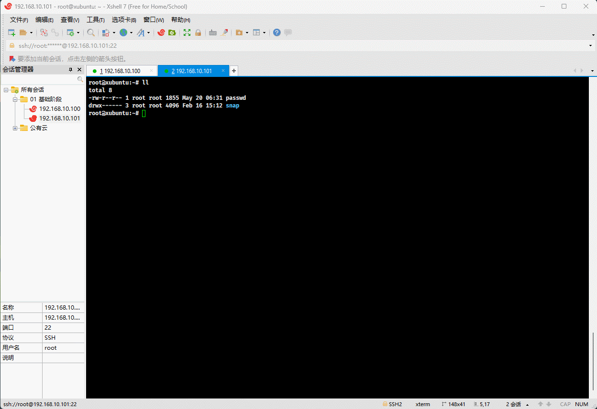


* 示例：复制多行

```shell
5 + yy
```


## 4.8 粘贴

* 格式：

```shell
# 缓冲区存的如果为整行，则粘贴当前光标所在行的下方；否则，则粘贴至当前光标所在处的后面
p 
```

```shell
# 缓冲区存的如果为整行，则粘贴当前光标所在行的上方；否则，则粘贴至当前光标所在处的前面
P 
```


* 示例：

```shell
p
```

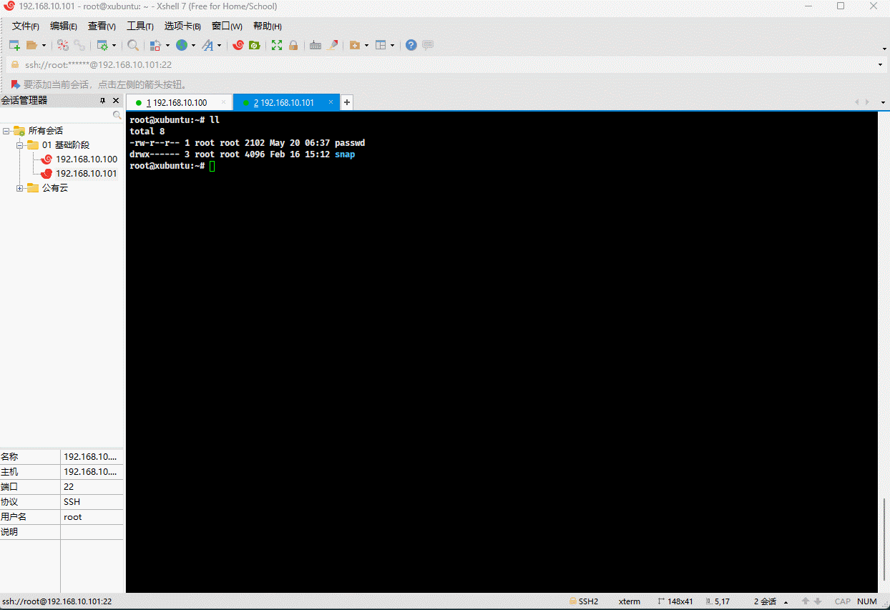


* 示例：

```shell
P
```


## 4.9 查找

* 格式：

```shell
/PATTERN # 从当前光标所在处向文件尾部查找，n 向下，N 向上
```

```shell
?PATTERN # 从当前光标所在处向文件首部查找，n 向上，N 向下
```


* 示例：从当前光标所在处向文件尾部查找

```shell
/root
```


* 示例：从当前光标所在处向文件首部查找

```shell
?root
```


## 4.10 撤销更改

* 格式：

```shell
u # 撤销最近的更改，相当于 win 中的 ctrl + z
```

```shell
n + u # 撤销之前多次更改
```

```shell
U # 撤消光标落在这行后所有此行的更改，可能会和 win 中的输入法切换冲突
```

```shell
ctrl + r # 重做最后的“撤消”更改，相当于 win 中的 ctrl + y
```


* 示例：撤销最近的更改

```shell
u
```


* 示例：撤销之前 5 次更改

```shell
5 + u
```


* 示例：重做最后的“撤消”更改

```shell
ctrl + r
```

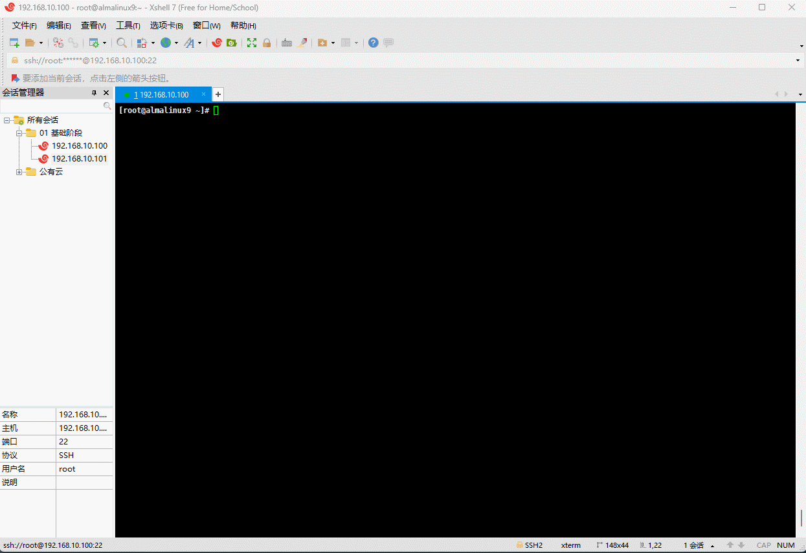

## 4.11 高级用法（一）

* 格式：

```shell
<start_position><command><end_position>
```

> [!NOTE]
>
> 常见的 command 是 y 复制，d 删除，gU 变大写、gu 变小写。


* 示例：

```shell
0y$ # 复制一行文本
```


## 4.12 高级用法（二）

* 格式：

```shell
di" # 光标在” “之间，则删除” “之间的内容
```

```shell
yi( # 光标在()之间，则复制()之间的内容
```

```shell
vi[ # 光标在[]之间，则选中[]之间的内容
```


* 示例：光标在`” “`之间，则删除`” “`之间的内容

```shell
di"
```


* 示例：光标在 `()` 之间，则复制 `()` 之间的内容

```shell
yi(
```


* 示例：光标在`[]`之间，则选中`[]`之间的内容

```shell
vi[
```


# 第五章：可视化模式

## 5.1 概述

* 在末行有`”-- VISUAL -- “`指示，表示在可视化模式。
* 如果在普通模式输入 `v` ，则进入可视化模式是`面向字符`，即 `-- VISUAL --`。
* 如果在普通模式输入 `V` ，则进入可视化模式是`面向整行`，即 `-- VISUAL LINE --`。
* 如果在普通模式输入 `ctrl+v` ，则进入可视化模式是`面向块`，即 `-- VISUAL BLOCK --`。

## 5.2 批量删除文件开头的 `#`

* 步骤：

```shell
① 定位到某列，通过 ctrl + v ，进入批量操作模式
```

```shell
② 选择要操作的区域(通过 ↑ 、↓ 、← 、→ 键)
```

```shell
③ 按 d ，进行删除
```


* 示例：


## 5.3 批量给文件开头添加 `#`

* 步骤：

```shell
① 定位到某列，通过 ctrl + v ，进入批量操作模式
```

```shell
② 选择要操作的区域(通过 ↑ 、↓ 、← 、→ 键)
```

```shell
③ 通过 shift + i （I），进入编辑模式
```

```shell
④ 写入内容
```

```shell
⑤ 按 esc 等待 ...
```


* 示例：


# 第六章：编辑二进制文件

## 6.1 概述

* vim 是可以编辑二进制文件的，本质上就是调用 xxd 等命令来编辑二进制文件，并且 vim 在底行模式可以能执行 Linux 的命令的。

## 6.2 查看 ASCII 码

* 命令：

```shell
man ascii
```


* 示例：

```shell
man ascii
```


## 6.3 实操

* 步骤：

```shell
① vim -b xxx.img # 以二进制的方式打开文件
```

```shell
② :%!xxd # 在底行模式中，利用 xxd 将其转为可读的十六进制
```

```shell
③ i # 切换到插入模式，编辑二进制文件
```

```shell
④ :%!xxd -r # 在底行模式中，利用 xxd 将其转换为二进制
```

```shell
⑤ :wq # 保存退出
```


* 准备工作：

```shell
dd if=/dev/zero of=./test.img bs=1 count=3 # 生成二进制文件
```


* 示例：

```shell
vim -b test.img
```

```shell
:%!xxd
```

```shell
i # 61 62 63
```

```shell
:%!xxd -r
```

```shell
:wq
```

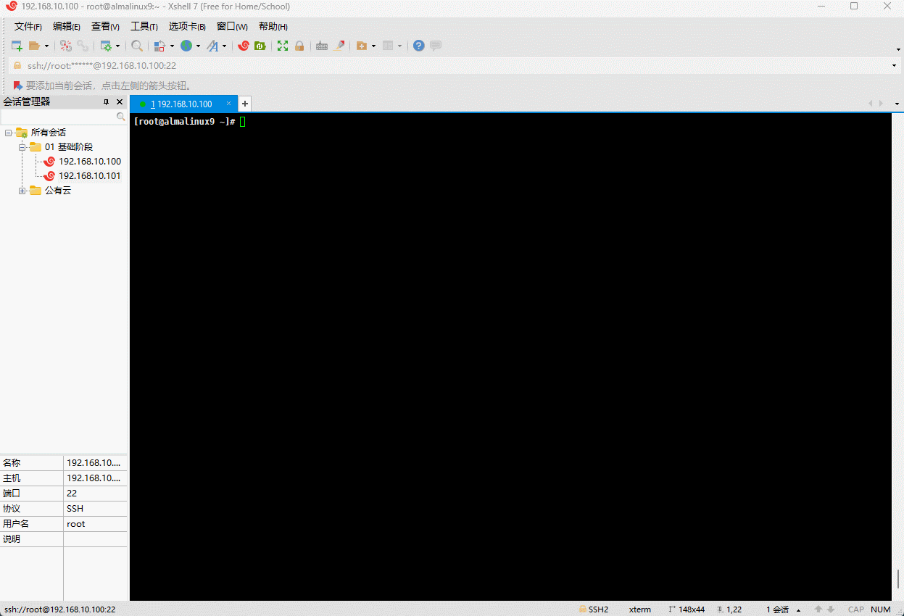
