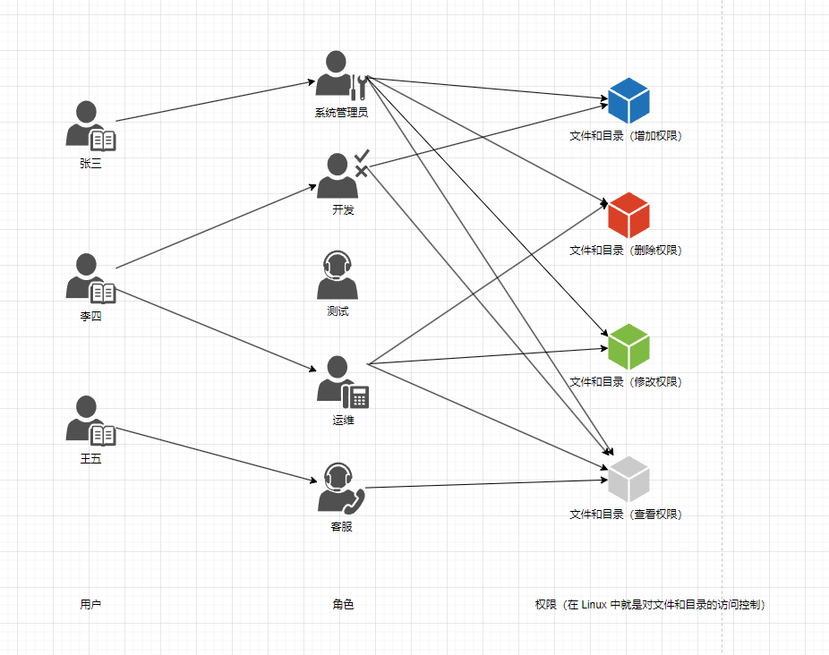
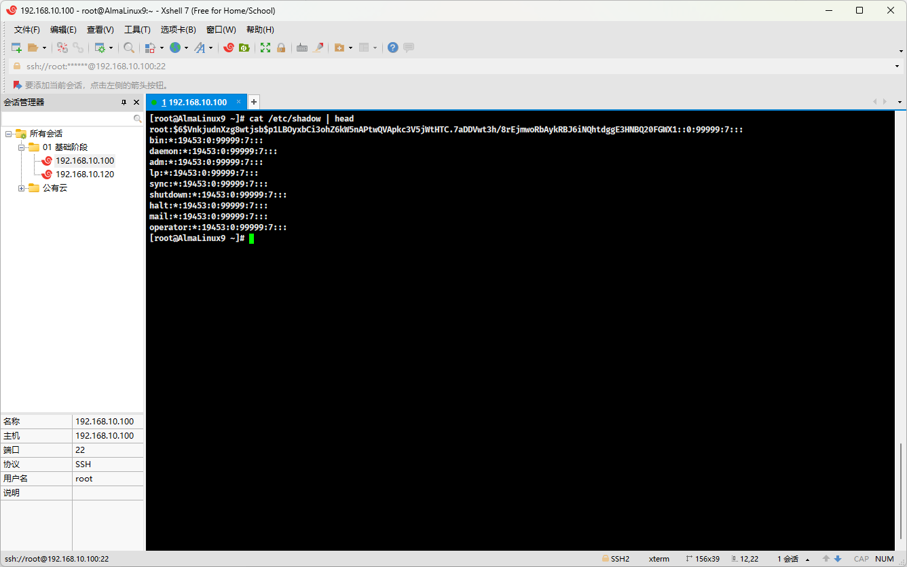
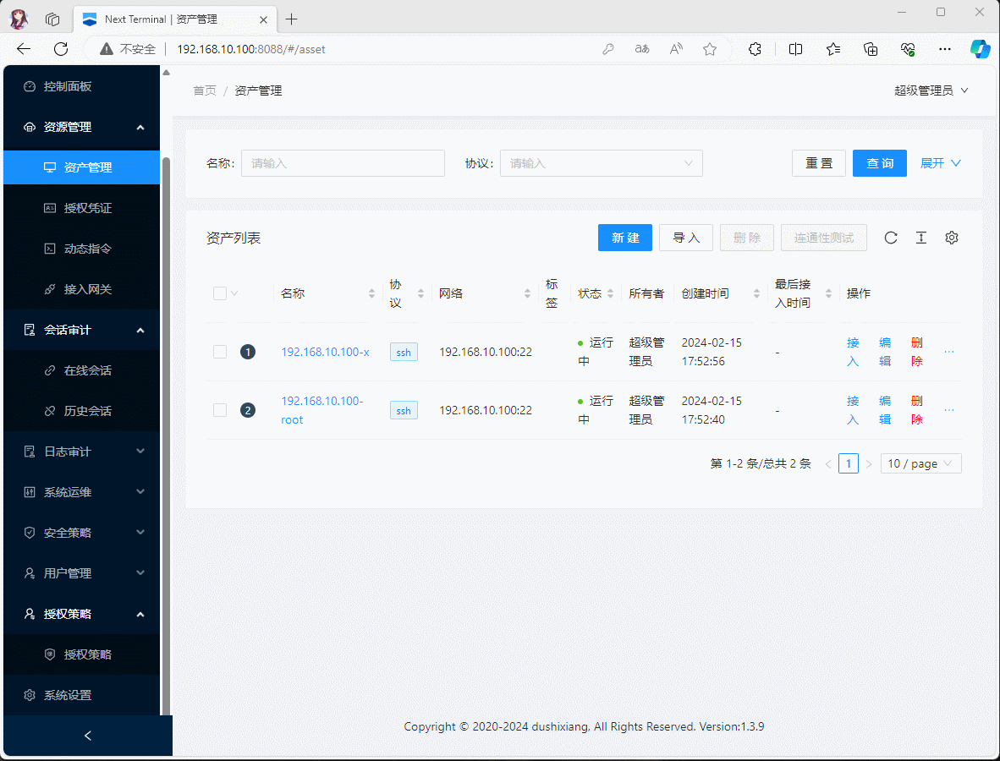

# 第一章：RBAC 模型

## 1.1 概述

* RBAC（Role-Based Access Control，基于角色的访问控制）是一种访问控制模型，它通过定义`角色`来`管理用户`对`系统资源`的`访问权限`。
* 在 RBAC 模型中，用户不是直接被授予权限的，而是被分配到一个或多个角色中，每个角色都包含了一组权限。
* 这样，`用户`可以通过`角色`来`间接`的`获取`对资源的`访问控制`（权限）。
* 这种模型的核心思想是将`权限管理`和`用户身份`分离，使得`权限分配`更加`灵活`和`易于管理`。

> [!NOTE]
>
> * ① RBAC 模型的应用场景非常广泛，包括但不限于：
>
>   * 企业资源规划（ERP）系统：在大型企业中，员工可能需要访问不同的业务模块，RBAC 可以确保他们只能访问其职责范围内的数据。
>   * 医疗信息系统：医生、护士、行政人员等不同角色需要访问不同级别的患者信息。
>   * 金融服务：银行和金融机构使用 RBAC 来控制员工对敏感金融数据的访问。
>   * ……
>   
> * ② Kubernetes（云原生的事实标准）也是基于 RBAC 模型开发的。

## 1.2 RBAC 

* 最简单的 RBAC 模型是 RBAC0，包含了`用户`、`角色`和`权限`之间的关系（多对多的关系），即：



> [!NOTE]
>
> * ① 用户、角色、权限都是`多对多`的关系，是最通用的权限管理模型，节省了很大的权限维护成本，对于 Linux 而言是足够的；所以，目前为止，Linux 的权限模型就是 RBAC0 模型。
> * ② 其实，在 RBAC 模型出现之前，还有 ACL 模型，即：用户和权限的多对多关系；但是随着用户数量的增长，这种模型的弊端就凸显出来了，每一个用户都需要去分配权限，非常的浪费管理员的时间和精力，并且用户和权限杂乱的对应关系会给后期带来巨大的维护成本。
> * ③ RBAC96 模型族确实是由 George Mason 大学的 Ravi Sandhu 教授在 1996 年提出的，这个模型族对基于角色的访问控制（RBAC）进行了系统的分类和扩展。RBAC96 模型族包括四个主要模型：RBAC0、RBAC1、RBAC2 和 RBAC3，它们各自代表了 RBAC 的不同层次和复杂度。

## 1.3 Linux 的安全模型（3A 认证）

* 在信息安全领域，3A 认证通常指的是`认证（Authentication）`、`授权（Authorization）`、和`审计（Accounting）`，这三个概念是确保系统安全的基础。在 Linux 系统中，这些功能通过各种机制和工具实现，确保了系统的安全性和可控性。

> [!NOTE]
>
> * **认证（Authentication）**：
>
>   * 认证是指`验证`用户或系统的`身份`。在 Linux 中，用户通常需要通过用户名和密码进行认证。此外，Linux 也支持更复杂的认证机制，如：公钥基础设施（PKI）、Kerberos 认证、以及双因素认证等。
>
>   - PAM（Pluggable Authentication Modules）框架允许管理员配置和整合不同的认证方法，使得系统可以灵活地支持多种认证技术。
>
> * **授权（Authorization）**：
>
>   - 授权过程决定了`已认证的用户可以访问哪些资源`，以及`他们可以进行哪些操作`。Linux 使用权限位（读、写、执行）、访问控制列表（ACLs）以及基于角色的访问控制（RBAC）等机制来管理授权。
>   - 更高级的安全模块，如：SELinux 和 AppArmor，提供了基于策略的授权控制。这些工具可以定义非常细粒度的策略，控制应用程序和用户对文件、进程和系统调用的访问。
>
> * **审计（Accounting）**：
>
>   - 审计是指`记录和分析用户的行为和系统事件`，是安全管理中的关键部分。Linux 提供了 Auditd 这样的工具，可以详细记录并审计系统发生的各种事件。
>   - 审计记录可以帮助系统管理员追踪用户活动，发现异常行为，进行问题诊断，以及满足合规性需求。

* 其对应的流程，如下所示：
  * ① **用户发起请求**：用户通过客户端发起登录请求，输入用户名和密码。
  * ② **认证服务器接收请求**：系统中的认证服务器接收到请求，并验证用户输入的用户名和密码。
  * ③ **验证身份**：认证服务器检查提供的凭据是否与数据库中的记录匹配。
  * ④ **生成令牌**：如果身份验证成功，认证服务器会生成一个安全令牌，并将其发回给用户。
  * ⑤ **访问资源**：用户使用接收到的令牌请求访问特定资源。
  * ⑥ **授权服务器验证令牌**：授权服务器接收到资源访问请求，并验证令牌的有效性。
  * ⑦ **授权访问**：如果令牌有效，授权服务器会根据用户的权限决定是否允许访问请求的资源。
  * ⑧ **记录审计日志**：无论访问是允许还是拒绝，系统都会在审计日志中记录事件，包括用户身份、请求的资源和时间等信息。
  * ⑨ **响应用户**：系统向用户返回访问资源的结果，无论是成功还是失败的消息。

> [!NOTE]
>
> 在 AlmaLinux 中的审计日志是 `/var/log/seucre`，不同版本 Linux 的审计日志可能不一样。 

* 总而言之，通过这三大核心功能，Linux 系统能够提供强大的安全保障，同时为系统管理员提供灵活的管理选项以适应不同的操作和安全需求。在设计和实施安全策略时，合理配置和使用这三大功能是非常关键的。


# 第二章：用户管理概述

## 2.1 概述

* 在各种操作系统中都有`用户`的概念，如：win 中的超级管理员（administrator）和普通用户；当然，Linux 中也有各种类型的用户。
* 很多时候，我们在进行系统管理的时候，会使用到 root 用户；但是，为了系统的安全，还是推荐使用普通用户。

> [!NOTE]
>
> * ① Linux 中有各种各样的用户，每个用户都有自己的作用，如：root 用户（最高权限的用户）、普通用户、虚拟用户（一些服务的创建、启动、停止，需要此类用户）。
> * ② Linux 是一个多用户、多任务的操作系统，这意味着它可以同时支持多个用户登录并执行任务。在 Linux 系统中，每个用户都有自己的用户账户，可以拥有不同的权限和资源访问级别。
> * ③ Linux 中系统管理员可以为不同的用户分配不同的权限，以确保系统的安全性和资源的有效管理。这种多用户环境使得 Linux 成为服务器和工作站的理想选择，因为它能够高效地处理并发任务和用户需求。

## 2.2 UID 和 GID

* 在生活中，如何精确标识一个人？答案是通过`身份证`，或者身份证上的号码（`身份证号`），即：


* 其实，对于中国来说，还有户籍制度，它是中国特有的一种户籍管理方式，记录了公民的个人信息，包括：姓名、性别、出生日期、民族、婚姻状况、家庭关系以及居住地址等，对应的载体就是`户口本`，而且`户口本`上也有唯一的`号码`的（`户号`），即：


* 对于 Linux 而言，Linux 通过 `UID` （User ID）来`标识`一个`用户`，通过 `GID`（Group ID）来标识一个`用户组`，即：

| 类别              | 说明           | 备注                           |
| ----------------- | -------------- | ------------------------------ |
| `UID` （User ID   | 用户的 ID 号   | 类似于身份证号码，即：身份证号 |
| `GID`（Group ID） | 用户组的 ID 号 | 类似于户口本上的号码，即：户号 |

* 通过如下的命令，查询当前登录用户的 UID 和 GID ，即：

```shell
id
```


## 2.3 用户分类

* 可以根据 `uid` 来对用户进行分类：

| 用户分类             | 分类方法（uid）                                              |
| -------------------- | ------------------------------------------------------------ |
| root                 | uid 是 0 。                                                  |
| 普通用户             | uid >= 1000，手动创建，无法对系统进行更改，只能对家目录进行操作。 |
| 虚拟用户（系统用户） | uid < 1000 ，用于服务、进程运行使用，如：mysqld 服务、sshd 服务。 |

> [!NOTE]
>
> * ① 在 Linux 中，对用户分类的方法`并不仅仅`通过 uid 这种分类方法，也可以通过其它`分类方法`来进行分类。
> * ② 用户的 id （特指普通用户），即 uid 在 [1000,60000] 之间，不要超过此范围，可以通过查看 `/etc/login.defs` 文件来了解。

## 2.4 用户相关的文件（⭐）

* Linux 中每创建一个用户，通常都会影响下面的文件：

| 用户相关文件       | 说明                                                 |
| ------------------ | ---------------------------------------------------- |
| `/etc/passwd`（⭐） | 存放用户信息。                                       |
| /etc/shadow        | 存放密码信息。                                       |
| /etc/group         | 存放用户组信息。                                     |
| /etc/gshaow        | 存放用户组密码信息；但是，通常不会给用户组设置密码。 |

> [!NOTE]
>
> * ① `/etc/passwd` 文件的名称来源于 Unix 和类 Unix 系统的早期历史，最初是存储用户信息和密码信息的；但是，随着时间的推移，为了限制对密码信息的访问，将密码信息移动到了 `/etc/shadow`文件，并且只能管理员（root）才能访问；当然，`/etc/passwd` 文件依然保留下来，只存储用户的基本信息，如：用户名、UID 等。
> * ② shadow 在英文中是`阴影`，`影子`的意思；在 Linux 中，用来表示只能由 root 才能访问。

* 查询 `/etc/passwd` 文件（⭐）：

```shell
cat /etc/passwd
```


* 详细解释 `/etc/passwd` 中每一列的含义（⭐）：


> [!NOTE]
>
> * ① 可以使用 `vipw`命令来修改 `/etc/passwd` 文件，以防止误操作；但是，通常不建议手动修改 `/etc/passwd` 文件。
> * ② 可以使用 `pwck` 命令来校验 `/etc/passwd` 文件格式是否正确。

* 查询 `/etc/shadow` 文件：

```shell
cat /etc/shadow
```


* 详细解释 `/etc/shadow` 中每一列的含义：


> [!NOTE]
>
> 对于密码的策略，如：最后一次密码修改时间、最小密码修改间隔，最长密码有效期等等，可以使用 `chage 用户名` 命令来修改，以防止误操作！！！

* 查询 `/etc/group` 文件：

```shell
cat /etc/group
```


* 详细解释 `/etc/group` 中每一列的含义：


> [!NOTE]
>
> * ① 可以使用 `vigr`命令来修改 `/etc/group` 文件，以防止误操作；但是，通常不建议手动修改 `/etc/group` 文件。
> * ② 可以使用 `grpck` 命令来校验 `/etc/group` 文件格式是否正确。

## 2.5 用户和组的关系

* RBAC 模型中的用户和角色之间的关系是多对多，在 Linux 中，角色和用户组的概念是等价的，即：用户和用户组之间的关系也是多对多的。

> [!NOTE]
>
> * 一个用户可以有多个用户组；但是，至少有 1 个用户组。
> * 一个用户组可以有多个用户；但是，可以有 0 个用户。
> * 用户的主要组（primary group，私有组），即一个用户必须属于且只有一个主组。创建用户的时候，默认会创建一个同名的用户组作为主组。
> * 用户的附加组（supplementary group，辅助组），即一个用户可以属于 0 或多个附加组。
> * 使用组的时候，可以对用户进行批量管理，如：对一个用户组授权，那么该组下的所有用户都将继承这个组的权限。


* 示例：

```shell
[root@AlmaLinux9 ~]# id root
# gid 表示主组，而 groups 表示组列表，包括：附加组
uid=0(root) gid=0(root) groups=0(root)   
```


* 示例：

```shell
[root@AlmaLinux9 ~]# id x
# gid 表示主组，而 groups 表示组列表，包括：附加组，wheel 就是附加组
uid=1000(x) gid=1000(x) groups=1000(x),10(wheel）
```

## 2.6 安全上下文

### 2.6.1 程序和进程的关系

* 程序 VS 进程：

| 类别     | 程序 (Program)                                               | 进程 (Process)                                       |
| -------- | ------------------------------------------------------------ | ---------------------------------------------------- |
| 定义     | 一组静态的指令和数据的集合，存储在存储设备（如硬盘）上，通常是`可执行的二进制文件`或`命令`。 | 程序的动态执行实例，由操作系统管理。                 |
| 存储     | 存储在磁盘或其他非易失性存储设备上。                         | 在内存中执行，并使用系统资源，如：CPU和内存。        |
| 实例     | 静态，不执行任何操作。                                       | 活跃的，执行指令和操作。                             |
| 资源使用 | 不使用系统资源，除非被加载成进程。                           | 使用 CPU 时间、内存、I/O 等资源。                    |
| 多重性   | 一个程序可以同时有多个执行实例。                             | 每个实例都是一个独立的进程，可能与其他进程并行执行。 |
| 生命周期 | 不变，除非被修改或删除。                                     | 开始、执行、等待（可选）、结束。                     |
| 管理     | 由用户或开发者管理。                                         | 由操作系统通过调度程序管理。                         |

* 程序和进程之间的关系：
  * 当程序被操作系统加载到内存中时，它变成一个进程。因此，进程可以被看作是程序的活跃版本。
  * 一个程序可以有多个同时运行的实例，每个实例对应一个进程，例如：我们可以多次打开同一个文本编辑器，每次打开都会创建一个新的进程，尽管它们都是同一个程序的实例。

> [!NOTE]
>
> * ① 不是所有的文件都是程序，只有哪些`可以执行`的`二进制文件`或`命令`才可以称为`程序`。
> * ② 程序和进程虽然紧密相关，但它们在操作系统中的角色和功能是有区别的。
> * ③  程序定义了要执行的操作，而进程是这些操作的实际执行。

### 2.6.2 安全上下文 Context

* 在 Linux 中，运行中的程序（进程）都是以进程发起者（用户）的身份运行，进程所能够访问的资源权限取决于进程的发起者的身份（和进程本身的程序文件无关），如：某个进程需要读写某个文件，需要看该进程的发起者有没有权限读取该文件。

> [!NOTE]
>
> * ① 一个程序可不可以执行，取决于进程的发起者，即：reboot 是可执行文件（命令），它的权限是 `lrwxrwxrwx. 1 root root 16 Sep 27  2023 /usr/sbin/reboot -> ../bin/systemctl` 只能由 root 执行，普通用户是没有权限执行该命令。
> * ② 一个进程可不可以访问某些资源，取决于进程的发起者（和进程本身的程序文件无关），即：cat 是可执行文件（命令），它的权限是 `-rwxr-xr-x. 1 root root 36320 Apr  7  2023 /usr/bin/cat` 即 root 是可读可写可执行，普通用户是可读可执行；但是，对于 `/etc/shadow` 文件来说，它的权限是 `---------- 1 root root 1470 Apr 11 13:16 /etc/shadow`，即普通用户没有任何权限，所以普通用户使用 cat 命令查询该文件会报错（root 之所以可以，因为它是超级管理员）。


* 示例：root 可以访问 /etc/shadow

```shell
cat /etc/shadow
```




* 示例：普通用户不可以访问 /etc/shadow

```shell
cat /etc/shadow # 报错，cat: /etc/shadow: Permission denied
```


# 第三章：用户管理命令（⭐）

## 3.1 概述

* 用户管理命令，无非就是对用户进行`增`、`删`、`改`、`查`操作。

## 3.2 增加

### 3.2.1 概述

* 命令：

```shell
useradd [-u][-s][-M][-g][-r] 用户名
```

> [!NOTE]
>
> * 功能：创建用户。
> * 选项：
>   *   `-u`，`--uid UID`：指定用户的 ID，即 UID 。
>   *   `-s`，`--shell SHEL`：指定命令解释器，默认是 `/bin/bash`。
>   *   `-M`，`--no-create-home`：不创建用户的家目录。
>   *   `-g`，`--gid GROUP`：指定用户组名称或用户组 ID。
>   *   `-r`，`--system`：创建系统用户，即 UID < 1000 。

> [!IMPORTANT]
>
> * ① 默认情况下，会创建`同名`的`家目录`和`用户组`。
> * ② 在实际工作中，像 `MySQL` 、`NGINX` 之类的软件，都是作为`服务`出现的，通常是使用这样的命令：`useradd  -s /sbin/nologin -M -r mysql` 来创建虚拟账户。


* 示例：创建普通用户

```shell
useradd x
```


* 示例：创建虚拟账户 mysql ，并指定 UID 为 1314

```shell
useradd -u 1314 -s /sbin/nologin -M mysql
```


### 3.2.2 useradd 命令的默认选项

* useradd 命令的默认选项（不加任何参数的默认行为）是通过 `/etc/default/useradd`定义的，即：

```shell
cat /etc/default/useradd
```


* 其内容如下：

```shell
# useradd defaults file
GROUP=100 # useradd 不指定组，且 /etc/login.defs 中的 USERGROUPS_ENAB yes 或 useradd -N 的时候，group 为 100
HOME=/home # 默认的用户家目录是 /home
INACTIVE=-1 # 对应 /etc/shadow 文件第 7 列，即用户密码过期后的账号锁定的宽限期，-1 表示不锁定
EXPIRE= # 对应 /etc/shadow 文件第 8 列，即用户账号的有效期
SHELL=/bin/bash # 默认的 SHELL
SKEL=/etc/skel # 用于生成新用户家目录的模板文件
CREATE_MAIL_SPOOL=yes # 默认创建收件箱
```

* 也可以通过如下的命令查看 useradd 命令的默认选项，即：

```shell
useradd -D
```


* 除了手动修改 `/etc/default/useradd` 文件来改变 useradd 命令的默认选项之外，还可以通过如下的命令来更改 useradd 命令的默认设置：

```shell
useradd -D -s SHELL # 更改默认的 SHELL
```


```shell
useradd -D -b BASH_DIR # 更改家目录
```


> [!NOTE]
>
> * ① 通常情况下，不需要修改 useradd 命令的默认选项。
> * ② 新建用户相关的文件，如下所示：
>   * `/etc/default/useradd`：`useradd`命令创建新用户时应用的默认设置。
>   * `/etc/skel/*` ：`/etc/skel/`目录包含了当使用`useradd`命令创建一个新用户并指定创建家目录时，应该复制到新用户家目录中的文件和目录，通常的配置文件有 `.bashrc`、`.bash_profile`、`bash_logout`等。
>   * `/etc/login.defs`：为用户登录相关的多种行为提供了系统级的配置，如：密码过期策略、密码复杂度和账户锁定策略等。

## 3.3 删除

* 命令：

```shell
userdel [-r] 用户名
```

> [!NOTE]
>
> * 功能：删除用户。
> * 选项：
>   * `-r`， `--remove`：删除用户和家目录。

> [!IMPORTANT]
>
> * ① 默认情况下，不会删除用户的家目录，除非添加 `-r` 选项。
> * ② 在实际工作中，`userdel` 命令很危险，建议在 `/etc/passwd` 文件对应的`用户前`添加 `#` 注释，以便达到删除用户的效果。


* 示例：删除用户

```shell
userdel x
```


* 示例：删除用户和家目录

```shell
userdel -r x
```


## 3.4 修改

### 3.4.1 修改用户信息

* 命令：

```shell
usermod [-u][-s][-g][-l] 用户名
```

> [!NOTE]
>
> * 功能：修改用户信息。
> * 对应英文：user modify 。
> * 选项：
>   *   `-u`，`--uid UID`：指定用户的 ID，即 UID 。
>   *   `-s`，`--shell SHEL`：指定命令解释器，默认是 `/bin/bash`。
>   *   `-g`，`--gid GROUP`：指定用户组名称或用户组 ID。
>   *   `-l`，`--login NEW_LOGIN`：修改用户名称，不会修改用户的家目录名称。


* 示例：修改 mysql 的 SHELL 解释器为 /bin/bash

```shell
usermod -s /bin/bash mysql
```


* 示例：修改用户名

```shell
usermod -l xudaxian x
```


### 3.4.2 修改密码

* 命令：

```shell
passwd [--stdin] [用户名]
```

> [!NOTE]
>
> * 功能：修改用户的密码。
> * 对应英文：password 。
> * 选项：
>   * `--stdin`：从标准流中读取信息，并修改密码（只有 root 用户才能进行此操作）。

> [!IMPORTANT]
>
> * ① 如果不写用户名，就是修改当前的用户名。
> * ② `--stdin` 可以实现批量修改密码，如：`echo '123456' | passwd  --stdin x`。


* 示例：修改当前用户的密码

```shell
passwd
```


* 示例：修改指定用户的密码

```shell
echo '123456' | passwd --stdin x
```


### 3.4.3 切换用户

* 命令：

```shell
su - [用户名]
```

> [!NOTE]
>
> * 对应的英文：switch user。
> * 选项：
>   * `-`， `-l`， `--login`：切换用户的同时，切换用户的配置和环境变量。

> [!IMPORTANT]
>
> * ① su 命令允许我们在不注销当前会话的情况下，以不同的用户身份之间，执行各种任务，同时保持系统的稳定和安全。
> * ② root 切换到普通用户，`无需`登录（输入密码）；普通用户切换到 root ，`需要`登录（输入密码）。


* 示例：

```shell
su - x
```


## 3.5 查询

### 3.5.1 查询用户的信息

* 命令：

```shell
id [用户名]
```

> [!NOTE]
>
> 功能：
>
> * 查询用户的 UID、GID 和用户组信息，进而可以用来检查用户是否存在。
> * 如果`用户名`没有指定，默认查询的是当前用户的信息。


* 示例：查询当前用户的信息

```shell
id
```


* 示例：查询指定用户的信息

```shell
id x
```


* 示例：检查指定用户是否存在

```shell
id x
```


### 3.5.2 查询用户当前的名字

* 命令：

```shell
whoami
```

> [!NOTE]
>
> 功能：查询用户当前的名字。


* 示例：

```shell
whoami
```


### 3.5.3 查询当前登录用户的详细信息

#### 3.5.3.1 概述

* 命令：

```shell
w [-f]
```

> [!NOTE]
>
> * 功能：查询当前登录用户的详细信息，包括：用户名称、终端类型、登录时间、空闲时间、CPU 使用情况以及用户正在执行的进程。
> * 选项：
>   * `-f`，`--from`：显示远程登录主机的 IP 地址。

> [!IMPORTANT]
>
> w 命令其实是 uptime（计算机正常运行时间，即在线时间） 和 who 命令的组合。

#### 3.5.3.2 案例

* 示例：

```shell
w -f
```


#### 3.5.3.3 详细解释

* 下面将给出对应的详细信息的解释，即：


### 3.5.4 显示用户最近的登录信息

* 命令：

```shell
last
```


* 示例：

```shell
last
```


### 3.5.5 显示用户最近一次的登录信息

* 命令：

```shell
lastlog
```


* 示例：

```shell
lastlog
```


## 3.6 用户组命令（了解）

### 3.6.1 创建用户组

* 命令：

```shell
groupadd 用户组
```


* 示例：

```shell
groupadd dev
```


### 3.6.2 创建用户的同时指定用户组

* 命令：

```shell
useradd -g 用户组 用户名
```

> [!CAUTION]
>
> 前提条件是用户组存在！！！


* 示例：

```shell
useradd -g dev x
```


### 3.6.3 删除用户组

* 命令：

```shell
groupdel 用户组
```

> [!NOTE]
>
> * ① 需要确保用户组中没有用户；否则，将会报错！！！
> * ② 可以通过 `getent group 用户组`命令查询用户组的详细信息，包括：用户组密码、GID 以及用户组成员列表。


* 示例：

```shell
groupdel dev
```


# 第四章：sudo 权限管理（⭐）

## 4.1 概述

* 在实际工作中，开发人员要查看系统日志，怎么办（root 权限太大，普通用户的权限又太小）？


* 此时，就可以使用 sudo 进行提权，对应的流行如下：


> [!IMPORTANT]
>
> 未来会搭建`日志平台（ELK、EFK 等）`，那么就不需要这么麻烦了。

## 4.2 sudo 授权和使用

* sudo 授权和使用步骤如下：
  * ① 使用 `visudo` 命令进行授权（其实，背后修改的是 `/etc/sudoers` 文件）。
  * ② 普通用户通过 `sudo cat xxx` 等进行日志文件的查看，并且可以通过 `sudo -l` 查看哪些命令需要使用 sudo 提权。

* 通过 which 查询这些命令对应的绝对路径，即：

```shell
which cat head tail less more grep
```


* root 用户使用 `visudo` 命令进行授权（授权给开发人员），即：

```shell
visudo
```

```
root    ALL=(ALL)       ALL # 100 行
x       ALL=(ALL)       /usr/bin/cat, /usr/bin/head, /usr/bin/tail, /usr/bin/less, /usr/bin/more, /usr/bin/grep
```

> [!NOTE]
>
> * `root` 表示用户名，具有 root 权限的用户。
> * `ALL=(ALL)` 中的 `ALL` 表示所有主机（即任何 IP 地址），而 `(ALL)` 表示所有用户组，即 root 用户所属的所有用户组。
> * `ALL`：表示所有命令，它允许 root 用户在任何主机上以任何用户组的身份执行任何命令。


* 普通用户（开发人员）通过 sudo 进行命令的提权，即：

```shell
# 第一次会有密码提示输入，原理是通过时间戳文件文件实现的，
# 可以通过 sudo -k 清除时间戳文件
sudo cat /var/log/secure
```


* 有的时候，我们不希望通过 root 账号来管理 Linux ，而希望通过一个账号来管理 Linux ，那么就通过 visudo 命令授权（授权给运维人员），并且不希望输入密码，即：

```shell
visudo
```

```
root    ALL=(ALL)       ALL # 100 行
x       ALL=(ALL)       /usr/bin/cat, /usr/bin/head, /usr/bin/tail, /usr/bin/less, /usr/bin/more, /usr/bin/grep
w       ALL=(ALL)       NOPASSWD: ALL # 授权给运维自己不需要密码运行各种命令
```


## 5.3 总结

* sodo 就是让普通用户可以拥有 root 的部分权限来操作 Linux。
* 流程就是：root 账号使用 `visudo` 进行授权，普通用户使用 `sudo xxx` 来进行提权。

>   [!IMPORTANT]
>
>   * ① 如果每个用户都需要这么配置，就会感觉非常麻烦，我们也可以使用`堡垒机`来进行解决这类问题。
>   * ② 一些开源的`堡垒机`可能没有对用户提权的功能；但是，云厂商提供的`堡垒机`是有对 SSH、Telnet 协议主机增加提权功能的，只不过需要购买而已！！！


# 第五章：堡垒机（⭐）

## 5.1 概述

* 之前，我们对于 Linux 的操作，都是通过 xshell 来`直接`进行远程连接的，即：


* 但是，这样是有安全隐患的，比如：直接将 `22` 端口暴露到外网上，可能会遭受攻击；所以，`跳板机`和`堡垒机`就应用而生了，即：


>   [!NOTE]
>
> * ① 之所以使用`堡垒机`或`跳板机`，是因为人是趋利避害的性格，可能为了掩饰自己的错误行为，在使用 xshell 远程连接到 Linux 服务器上的时候（操作记录存放在 Linux 服务器上），会将自己的操作记录删除；而通过堡垒机或跳板机远程连接 Linux 服务器（操作记录存放在堡垒机或跳板机上），是不能将自己的操作记录删除的。
> * ② 使用`跳板机`或`堡垒机`，在未来的场景中，只需要开放`跳板机`或`堡垒机`的端口就可以了，避免了直接暴露内部网络资源给外部网络带来的安全风险。
> * ③ 通常而言，`跳板机`侧重于提供`安全`的`远程访问`和`操作平台`，而`堡垒机`更侧重于`安全防护`和`审计`。

* 堡垒机的产品：

| 堡垒机的产品 | 说明                                                         |
| ------------ | ------------------------------------------------------------ |
| 开源软件     | Teleport 、JumpServer、CMDB、Next Terminal、Spug、CODO、OpsCloud |
| 物理硬件设备 | 需要自己购买。                                               |
| 云服务       | 需要自己购买，阿里云等云厂商都提供有对应的服务。             |

>   [!IMPORTANT]
>
>   本次将以 `Next Terminal` 作为演示！！！

## 5.2 关闭防火墙和 SELinux

### 5.2.1 关闭防火墙

* 查询防火墙是否运行：

```shell
systemctl status firewalld
```


* 关闭防火墙：

```shell
# 临时关闭
systemctl stop firewalld
```

```shell
# 重启生效
systemctl disable firewalld
```


* 查询防火墙是否运行：

```shell
systemctl status firewalld
```


### 5.2.2 关闭 SELinux

* 查看 SELinux 是否运行：

```shell
# 结果是 permissive 或 disabled 都表示关闭。
# 结果是 enforcing 表示开启
getenforce
```


* 关闭 SELinux：

```shell
# 临时关闭
setenforce 0 
```

```shell
# 永久关闭，重启生效
sed -i 's/SELINUX=enforcing/SELINUX=disabled/g' /etc/selinux/config  
```


* 查看 SELinux 是否运行：

```shell
# 结果是 permissive 或 disabled 都表示关闭。
# 结果是 enforcing 表示开启
getenforce
```


## 5.3 前置准备

### 5.3.1 安装 Apache Guacamole-Server

* 安装 guacd  ：

```shell
dnf install -y epel-release
```

```shell
dnf install -y libguac-client-kubernetes \
    libguac-client-rdp \
    libguac-client-ssh \
    libguac-client-telnet \
    libguac-client-vnc \
    guacd
```


* 配置 guacd 服务：

```shell
mkdir /etc/guacamole/
```

```shell
cat <<EOF >> /etc/guacamole/guacd.conf
[daemon]
pid_file = /var/run/guacd.pid
log_level = info

[server]
# 监听地址
bind_host = 127.0.0.1
bind_port = 4822
EOF
```


* 修改 `/usr/lib/systemd/system/guacd.service` 文件中的 User 和 Group 两行，以避免权限问题，即：

```shell
vim /usr/lib/systemd/system/guacd.service
```

```txt {11-12}
[Unit]
Description=Guacamole proxy daemon
Documentation=man:guacd(8)
After=network.target

[Service]
EnvironmentFile=-/etc/sysconfig/guacd
Environment=HOME=/var/lib/guacd
ExecStart=/usr/sbin/guacd -f $OPTS
Restart=on-failure
# User=guacd 注释
# Group=guacd 注释

[Install]
WantedBy=multi-user.target
```


* 启动 guard 服务：

```shell
# 重载服务
systemctl daemon-reload
```

```shell
# 开机自启以及立即启动
systemctl enable --now guacd
```

```shell
# 查看状态
systemctl status guacd
```


### 5.3.2 安装字体

* 安装字体管理软件：

```shell
dnf install -y fontconfig mkfontscale
```


* 下载字体文件并移动到 `/usr/share/fonts/` 目录下：

```shell
cd  /usr/share/fonts/
```

```shell
# 下载英文字体
wget https://gitee.com/dushixiang/next-terminal/raw/master/guacd/fonts/Menlo-Regular.ttf
```

```shell
# 下载中文字体
wget https://gitee.com/dushixiang/next-terminal/raw/master/guacd/fonts/SourceHanSansCN-Regular.otf
```


* 更新字体：

```shell
mkfontscale && mkfontdir && fc-cache
```


## 5.4 安装堡垒机 -- Next Terminal

* 下载软件安装包：

```shell
wget https://github.com/dushixiang/next-terminal/releases/download/v1.3.9/next-terminal.tar.gz
```


* 解压到指定目录：

```shell
tar -zxvf next-terminal.tar.gz -C /usr/local/
```


* 修改 `/usr/local/next-terminal/config.yaml` 文件：

```shell
vim /usr/local/next-terminal/config.yaml
```

```yaml
debug: false
db: sqlite # sqlite 或 mysql
# mysql:
  # hostname: localhost
  # port: 3306
  # username: next-terminal
  # password: next-terminal
  # database: next-terminal
sqlite:
  file: './data/sqlite/next-terminal.db'
server:
  addr: 0.0.0.0:8088
#  当设置下面两个参数时会自动开启https模式(前提是证书文件存在)
#  cert: /root/next-terminal/cert.pem
#  key: /root/next-terminal/key.pem
guacd:
  hostname: 127.0.0.1
  port: 4822
  # 此路径需要为绝对路径，并且 next-terminal 和 guacd 都能访问到
  recording: '/usr/local/next-terminal/data/recording'
  # 此路径需要为绝对路径，并且 next-terminal 和 guacd 都能访问到
  drive: '/usr/local/next-terminal/data/drive'

sshd:
  # 是否开启 sshd 服务
  enable: true
  # sshd 监听地址，未开启 sshd 服务时此配置不会使用
  addr: 0.0.0.0:2022
  # sshd 使用的私钥地址，未开启 sshd 服务时此配置不会使用
  key: ~/.ssh/id_rsa
```


* 启动：

```shell
cd /usr/local/next-terminal/
```

```shell
./next-terminal
```


* 创建 `next-terminal` 系统服务文件，以便通过 `systemctl` 命令来管理堡垒机：

```shell
cat > /etc/systemd/system/next-terminal.service <<EOF
[Unit]
Description=next-terminal service
After=network.target

[Service]
User=root
WorkingDirectory=/usr/local/next-terminal
ExecStart=/usr/local/next-terminal/next-terminal
Restart=on-failure
LimitNOFILE=1048576

[Install]
WantedBy=multi-user.target
EOF
```


* 启动 `next-terminal` 服务：

```shell
# 重载服务
systemctl daemon-reload
```

```shell
# 开机自启以及立即启动
systemctl enable --now next-terminal
```

```shell
# 查看状态
systemctl status next-terminal
```


## 5.5 访问和配置堡垒机

* 通过浏览器访问 `http://192.168.10.100:8088`，管理员的账号和密码是 `admin/admin` ，即：


* 在`资产管理 --> 资产管理`中配置远程 Linux 服务器的信息，如：


> [!NOTE]
>
> * ① 本次将`Next Terminal` 和远程 Linux 服务器配置在一台机器上；
> * ② 在实际工作中，`Next Terminal` 所在的服务器和远程 Linux 服务器是不同的服务器。

* 在 `资产管理 --> 资产管理` 中`操作`的`接入`中，就可以远程操作 Linux 了，即：



* 在`会话审计 --> 在线会话 或 历史会话` 中，可以通过`监控或回放`查看 Linux 的操作，即：


# 第六章：补充

## 6.1 getent 命令

### 6.1.1 概述

* 命令：

```shell
getent database [key]
```

> [!NOTE]
>
> * 功能：从`系统数据库`中根据`指定的 key`  查询出`想要的信息`。
> * 对应的英文：get entries from administrative database 。
> * database 可以是 ahosts、ahostsv4、ahostsv6、aliases、ethers、group、gshadow、hosts、initgroups、netgroup、networks、passwd、protocols、rpc、services、shadow。

> [!IMPORTANT]
>
> 应用场景：
>
> * 查询用户信息：通过 `getent passwd` 命令，可以查看系统中的用户账户信息。
> * 查询用户组信息：使用 `getent group` 可以查看用户组及其成员。
> * 查询主机信息：通过 `getent hosts` 可以查看主机名与 IP 地址的映射。
> * 查询服务信息：`getent services` 用于查看系统中的服务及其对应的端口号。
> * 查询网络协议：`getent protocols` 可以列出网络协议及其编号。

### 6.1.2 案例

* 需求：查看系统中的指定用户的信息。


* 示例：

```shell
cat /etc/passwd | grep xiaoming
```


* 示例：

```shell
getent passwd xiaoming
```


### 6.1.3 案例

* 需求：查看系统中的指定用户密码的信息。


* 示例：

```shell
cat /etc/shadow | grep xiaoming
```


* 示例：

```shell
getent shadow xiaoming
```


### 6.1.4 案例

* 需求：查看系统中的指定用户组的信息。


* 示例：

```shell
cat /etc/group | grep xiaoming
```


* 示例：

```shell
getent group xiaoming
```


### 6.1.5 案例

* 需求：查看系统中的指定用户组密码的信息。


* 示例：

```shell
cat /etc/gshadow | grep xiaoming
```


* 示例：

```shell
getent gshadow xiaoming
```


### 6.1.6 案例

* 需求：查询主机信息。


* 示例：

```shell
cat /etc/hosts
```


* 示例：

```shell
gentent hosts
```


### 6.1.7 案例

* 需求：查询服务信息（服务和端口）。


* 示例：

```shell
netstat -anp | grep ssh
```


* 示例：

```shell
getent services ssh
```


## 6.2 批量用户操作

### 6.2.1 批量创建或更新用户

* 命令：

```shell
newusers 文件
```

> [!NOTE]
>
> 适合于迁移多个用户到新的 Linux 操作系统中，如下所示：
>
> 


* 示例：导出指定用户信息到文件中

```shell
tail -n 3 /etc/passwd > abc.txt
```


* 示例：通过 `scp` 命令传递该文件到指定的操作系统

```shell
scp abc.txt root@192.168.10.120:~/
```


* 示例：批量创建或更新用户信息

```shell
newusers abc.txt
```


### 6.2.2 批量更新密码

* 命令：

```shell
echo '用户名:密码' | chpasswd
```

> [!NOTE]
>
> * ① chpasswd 和 passwd 类似，都是交互式命令。
> * ② 所以，chpasswd 通常配合管道使用。


* 示例：

```shell
echo 'x:123456' 'y:123456' 'z:123456' | chpasswd
```


