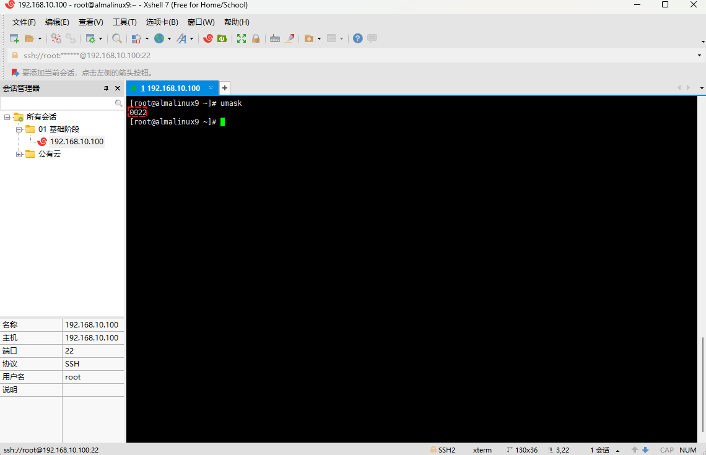

# 第一章：Linux 权限管理体系概述

## 1.1 回顾 RBAC 模型

* RBAC（Role-Based Access Control，基于角色的访问控制）是一种访问控制模型，它通过定义`角色`来`管理用户`对`系统资源`的`访问权限`。
* 在 RBAC 模型中，用户不是直接被授予权限的，而是被分配到一个或多个角色中，每个角色都包含了一组权限。
* 这样，`用户`可以通过`角色`来`间接`的`获取`对资源的`访问控制`（权限）。
* 这种模型的核心思想是将`权限管理`和`用户身份`分离，使得`权限分配`更加`灵活`和`易于管理`。


> [!NOTE]
>
> * ① 在 Linux 中，其权限模型就是 RBAC0 权限模型；只不过，在 Linux 中没有角色，而是用户组的概念，含义是一样的。
> * ② 在 Linux 中，默认情况下，创建用户会生成一个`同名`的`用户组`；当然，也可以通过`参数`使其`不生成`同名的用户组。
> * ③ 在 Linux 中，权限就是对`文件`和`目录`的访问控制，并且使用 `rwx`这三种描述符来表示权限。 
> * ④ Linux 使用 `rwx`权限描述符来控制整个 Linux 系统的安全，`用户`和`权限`共同组成 Linux 系统的安全防护体系。

## 1.2 所有者、所属组、其他人

* 在 RBAC 模型中，一个用户（所有者）可以分配多个角色（所属组），一个角色也可以被分配多个用户，`它们之间的关系是多对多的关系`；当然，角色和权限之间也是多对多的关系，即：


* 对于上图而言，我们可以知道，`李四`和`王五`都属于`开发`（用户组），其他的人是`不`属于`开发`（用户组），即其他人的角色。
* 如果，我们以`李四`为`主要视角（所有者）`，那么`王五`和`李四`就是`同一组（所属组）`，而`张三`、`赵六`、`田七`和`王八`就是`其它人`的角色，即：


* 在 Linux 中，权限通常分为三种类型（角色），即：
  * **所有者（user）**：文件或目录的所有者拥有的权限。
  * **所属组（group）**：与文件所有者相同用户组的其他用户拥有的权限。
  * **其他人（others）**：不属于文件所有者和用户组的其他所有用户拥有的权限。

* 在 Linux 中，权限通常由 `rwx` 来描述文件或目录的访问权限，即：

| 权限          | 含义     | 备注                                                         |
| ------------- | -------- | ------------------------------------------------------------ |
| `r` (read)    | 读取权限 | 如果一个用户或用户组有对文件的读取权限，他们可以查看文件的内容。 |
| `w` (write)   | 写入权限 | 拥有写入权限的用户或用户组可以修改文件的内容，包括：添加文件内容、删除文件内容、修改文件内容。 |
| `x` (execute) | 执行权限 | 对于文件，执行权限允许用户运行该文件作为程序，一般是命令或脚本。<br>对于目录，执行权限允许用户进入该目录（即访问目录下的文件和子目录）。 |

> [!NOTE]
>
> * ① 可以使用 `chown` 命令或 `chgrp` 命令来改变文件或目录的所有者以及所属组。
> * ② `chgrp` 命令可以修改文件或目录的所属组。
> * ③ `chown` 命令可以修改文件或目录的所有者和所属组；当然，也可以只修改文件或目录的所有者。
> * ④ Linux 的文件或目录的权限体系（rwx）是由`文件系统`提供支持的，并不是所有的文件系统都支持权限体系，如：Fat32 文件系统就不支持权限体系（rwx）。


# 第二章：权限计算和修改权限（⭐）

## 2.1 权限计算

### 2.1.1 概述

* 在 Linux 中，我们可以通过 `ll` 命令快速查看文件和目录的权限，即：

```shell
ll /usr/bin
```


* 截取部分信息，如下所示：


* 所有者（user）、所属组（group）和其他人（others）对应的信息，如下所示：


* 为了方便使用权限，于是给每个权限字母设置了一个对应的数字，通过数字来表示权限，即：

| 权限          | 含义                                                       | 权限对应的数字 |
| ------------- | ---------------------------------------------------------- | -------------- |
| `r` (read)    | 是否可读。                                                 | 4              |
| `w` (write)   | 是否可写。                                                 | 2              |
| `x` (execute) | 是否可执行，对于文件而言，通常是命令和脚本（命令的集合）。 | 1              |
| -             | 没有权限                                                   | 0              |

> [!NOTE]
>
> * ① 9 位权限信息其实是`八进制`，这样就可以 3 位权限信息作为一组，这能完美的表示 `r` 、`w`、 `x` 。
> * ② 如果`数字`表示的`权限信息`中有`奇数`，则证明一定会有`可执行权限（x）`。

* 其实，权限对应的数字是这么计算的，即：

```txt
假设一个文件的权限是 rwx rw- rw- ，那么只要有权限就是 1 ，没有权限（-）就是 0 ；
那么，转换为对应的数字就是 rwx rw- rw- = 111 110 110 
又因为 111 110 110 都是二进制的数字，转换为八进制就是 
u = 2^2 * 1 + 2^1 * 1 + 2^0 * 1 = 7
g = 2^2 * 1 + 2^1 * 1 + 2^0 * 0 = 6 
o = 2^2 * 1 + 2^1 * 1 + 2^0 * 0 = 6
```

* 其实，我们也可以通过 `stat` 命令，来查看权限对应的数字，即：

```shell
stat /usr/bin/which
```


* 计算如下：

```
-   rwx    r-x    r-x
   4+2+1   4+0+1  4+0+1 = 755
```

### 2.1.2 案例

* 示例：字母 → 数字

```
-  rwx   r-x   r-x
   4+2+1 4+0+1 4+0+1 = 755
```


* 示例：字母 → 数字

```
-  r--   r--   r--
   4+0+0 4+0+0 4+0+0 = 444
```


* 示例：字母 → 数字

```
-  r--   rw-   rw-
   4+0+0 4+2+0 4+2+0 = 466
```


* 示例：数字 → 字母

```
644 =  4+2+0 4+0+0 4+0+0 
     - rw-   r--   r--
```


* 示例：数字 → 字母

```
750 =  4+2+1 4+0+1 0+0+0 
     - rwx   r-x   ---
```


* 示例：数字 → 字母

```
700 =  4+2+1 0+0+0 0+0+0 
     - rwx   ---   ---
```


* 示例：数字 → 字母

```
600 =  4+2+0 0+0+0 0+0+0 
     - rw-   ---   ---
```

## 2.2 修改权限

### 2.2.1 概述

* 前文提到：`用户`和`权限`共同组成 Linux 系统的安全防护体系，那么就可以使用 chmod 命令来修改权限，使用 chown 来修改用户或用户组。

* 修改用户（用户组）的命令：

  ```shell
  chown [-R] [所有者][:所属组] 文件或目录 ...
  ```

> [!NOTE]
>
> * ① 选项：`-R`，`--recursive`：递归修改文件和目录，`慎用`！！
> * ② 如果只需要修改文件或目录的所有者，则可以使用 `chown [-R] 所有者 文件或目录 ...`命令。
> * ③ 如果需要同时修改文件或目录的所有者和所属组，则可以使用 `chown [-R] 所有者:所属组 文件或目录 ...` 命令。
> * ④ 如果只需要修改文件或目录的所属组，则可以使用 `chown [-R] :所属组 文件或目录 ...`命令。

* 修改用户组的命令（了解）：

```shell
chgrp [-R] 所属组 文件或目录 ...
```

> [!NOTE]
>
> 选项：`-R`，`--recursive`：递归修改文件和目录，`慎用`！！！

* 修改权限的命令：

```shell
chmod [-R] 模式[,模式]... 文件或目录 ...
```

> [!NOTE]
>
> * 选项：`-R`，`--recursive`：递归修改文件和目录，`慎用`！！！
> * 模式：`[ugoa]*([-+=]([rwxXst]*|[ugo]))+|[-+=][0-7]+`。

> [!IMPORTANT]
>
> * ① 用户的最终权限，是按照从左到右的顺序进行匹配的，即：所有者（u）、所属组（g）、其他人（o），一旦匹配成功就会立即生效，不会继续向右查看其它权限。
> * ② r 权限和 w 权限对 root 用户无效，因为 root 是 Linux 系统中的系统管理员，拥有最高权限，即：对于没有读写权限的文件，root 用户也可以进行读和写。
> * ③ 只要所有者（u）、所属组（g）、其他人（o）三者之一有 x 权限，root 用户就可以执行。

### 2.2.2 准备工作

* 批量创建文件：

```shell
touch /tmp/{01..10}.txt
```


* 创建用户：

```shell
useradd x
```


### 2.2.3 案例

* 示例：将 `/tmp/01.txt` 文件的权限设置为 `755`

```shell
# mode 为数字的形式
chmod 755 /tmp/01.txt
```


* 示例：将 `/tmp/01.txt` 文件的所有者和所属组设置为 `x`

```shell
chown x:x /tmp/01.txt
```


* 示例：将 `/tmp/02.txt` 文件的所有者的权限增加 `x`权限

```shell
# 以字符串的形式；其中，u 表示所有者，user；g 表示所属组，group；o 表示其它人，other；
# a = u + g + o
# + 表示在原来权限的基础上增加，- 表示在原来权限的基础上减少,
# = 表示用新的权限覆盖旧的权限
chmod u+x /tmp/02.txt
```


* 示例：给 `/etc/rc.d/rc.local` 文件增加 `x` 权限

```shell
chmod a+x /etc/rc.d/rc.local
```


# 第三章：文件和目录的权限

## 3.1 概述（⭐）

* 文件和目录的权限不同，如下所示：

| 权限          | 文件                                                         | 目录                                                        |
| ------------- | ------------------------------------------------------------ | ----------------------------------------------------------- |
| `r` (read)    | 是否可以查看文件内容。                                       | 是否可以查看目录内容，需要 `x` 权限配合。                   |
| `w` (write)   | 是否可以修改文件内容，包括：添加文件内容、删除文件内容、修改文件内容；一般需要 `r` 权限配合。 | 是否可以在目录中创建、删除、重命名文件，需要 `x` 权限配合。 |
| `x` (execute) | 是否允许用户执行该文件，通常是`命令`或`脚本`；一般需要 `r` 权限配合。 | 是否可以进去到该目录，是否可以访问目录下的文件属性。        |

> [!NOTE]
>
> * ① 通过 root 修改权限，其它普通用户来测试权限；因为 root 用户具有最高权限，可以无视权限规则。
> * ② 实际工作中，启动程序或脚本等，尽量使用普通用户！！！

## 3.2 测试文件权限

### 3.2.1 准备工作

* root 创建`文件`以及修改权限：

```shell
touch /tmp/demo.sh
```

```shell
echo 'hostname' > /tmp/demo.sh
```

```
chmod 777 /tmp/demo.sh
```

```shell
chown x:x /tmp/demo.sh
```


* root 用户测试读、写、执行权限：

```shell
# 读权限
cat /tmp/demo.sh
```

```shell
# 写权限
echo 'whoami' >> /tmp/demo.sh
```

```shell
# 执行权限，可以使用绝对路径或相对路径；
# 如果是相对路径，需要切换到对应的目录中，使用./demo.sh
/tmp/demo.sh 
```


* x 用户测试读、写、执行权限：

```shell
# 读权限
cat /tmp/demo.sh
```

```shell
# 写权限
echo 'w' >> /tmp/demo.sh
```

```shell
# 执行权限
/tmp/demo.sh 
```


### 3.2.2 测试文件的 r 权限

* `root` 用户修改`文件`的权限为 `r` 权限：

```shell
chmod u=r /tmp/demo.sh
```


* `x` 用户测试`文件`的 `r` 权限：

```shell
cat /tmp/demo.sh
```


* `x` 用户测试`文件`的 `w` 权限：

```shell
# 失败，因为只有 r 权限，没有 w 权限
echo 'ls -lah .' >> /tmp/demo.sh
```


* `x` 用户测试`文件`的 `x` 权限：

```shell
# 失败，因为只有 r 权限，没有 x 权限
./tmp/demo.sh
```


### 3.2.3 测试文件的 w 权限

* `root` 用户修改`文件`的权限为 `w` 权限：

```shell
chmod u=w /tmp/demo.sh
```


* `x` 用户测试`文件`的 `r` 权限：

```shell
# 失败，因为只有 w 权限，没有 r 权限
cat /tmp/demo.sh
```


* `x` 用户测试`文件`的 `w` 权限：

```shell
# 可以，如果通过 vi 是不行的，因为 vi 需要先读取文件；所以，通常 rw 配合使用
echo 'cd .' >> /tmp.demo.sh
```


* `x` 用户测试`文件`的 `x` 权限：

```shell
# 失败，因为只有 w 权限，没有 x 权限
./tmp/demo.sh
```


### 3.2.4 测试文件的 x 权限

* `root` 用户修改`文件`的权限为 `x` 权限：

```shell
chmod u=x /tmp/demo.sh
```


* `x` 用户测试`文件`的 `r` 权限：

```shell
# 失败，因为只有 x 权限，没有 r 权限
cat /tmp/demo.sh
```


* `x` 用户测试`文件`的 `w` 权限：

```shell
# 失败，因为只有 x 权限，没有 w 权限
echo 'cd .' >> /tmp.demo.sh
```


* `x` 用户测试`文件`的 `x` 权限：

```shell
# 失败，因为只有 w 权限，没有 r 权限; 
# SHELL 解释器在执行的时候，需要先读取文件，再执行；所以，通常需要配合 r 使用
./tmp/demo.sh
```


## 3.3 测试目录权限

### 3.3.1 准备工作

* root 创建`目录`以及修改权限：

```shell
mkdir -pv /tmp/demo
```

```shell
touch /tmp/demo/{01..10}.txt
```

```shell
chown -R x:x /tmp/demo
```


### 3.3.2 测试目录的 r 权限

* `root` 用户修改`目录`的权限为 `r` 权限：

```shell
chmod u=r /tmp/demo
```


* `x` 用户测试`目录`的 `r` 权限：

```shell
# 只能查看到文件名，看不到文件属性，需要配合 x 权限
ll /tmp/demo
```


> [!NOTE]
>
> * ① 目录和文件不同，目录用来对文件分类的，所以 r 权限可以查看目录中文件名称；对于文件的属性等，r 权限就无能为力了。
> * ② 目录的 x 权限表示能够`进入`目录，并且能够`查看`和`修改`目录下`文件`的`属性信息`。
> * ③ 通常，目录的 r 权限要配合 x 权限一起使用。

* `x` 用户测试`目录`的 `w` 权限：

```shell
# 失败，没有 x 权限
touch /tmp/demo/11.txt
```


* `x` 用户测试`目录`的 `x` 权限：

```shell
# 失败，没有 x 权限
cd /tmp/demo
```


### 3.3.3 测试目录的 w 权限

* `root` 用户修改`目录`的权限为 `w` 权限：

```shell
chmod u=w /tmp/demo
```


* `x` 用户测试`目录`的 `r` 权限：

```shell
# 失败，没有 r 和 x 权限
ll /tmp/demo
```


* `x` 用户测试`目录`的 `w` 权限：

```shell
# 失败，没有 x 权限；很好理解，连目录都不能进入，怎么向目录中创建文件？
touch /tmp/demo/11.txt
```


* `x` 用户测试`目录`的 `x` 权限：

```shell
# 失败，没有 x 权限
cd /tmp/demo
```


### 3.3.4 测试目录的 x 权限

* `root` 用户修改`目录`的权限为 `x` 权限：

```shell
chmod u=x /tmp/demo
```


* `x` 用户测试`目录`的 `r` 权限：

```shell
# 失败，没有 r 
ll /tmp/demo
```


* `x` 用户测试`目录`的 `w` 权限：

```shell
# 失败，没有 w 权限
touch /tmp/demo/11.txt
```


* `x` 用户测试`目录`的 `x` 权限：

```shell
cd /tmp/demo
```


## 3.4 总结（⭐）

* 文件和目录的权限不同，如下所示：

| 权限          | 文件                                                         | 目录                                                         |
| ------------- | ------------------------------------------------------------ | ------------------------------------------------------------ |
| `r` (read)    | 是否可以查看文件内容。                                       | 是否可以查看目录内容，需要 `x` 权限配合，即 `rx`。           |
| `w` (write)   | 是否可以修改文件内容，包括：添加文件内容、删除文件内容、修改文件内容；一般需要 `r` 权限配合，即 `rw`。 | 是否可以在目录中创建、删除、重命名文件，需要 `x` 权限配合，即 `rwx`。 |
| `x` (execute) | 是否允许用户执行该文件，通常是`命令`或`脚本`；一般需要 `r` 权限配合，即 `rx` 或 `rwx`。 | 是否可以进去到该目录，是否可以访问目录下的文件属性，即 `rx` 或 `rwx`。 |

> [!NOTE]
>
> * ① 在实际工作中，对于`脚本文件`的权限，一般会授予 `rx` 或 `rwx` 权限。
> * ② 在实际工作中，对于`目录`，我们通常会授予 `rx` 或 `rwx` 权限。


# 第四章：系统的默认权限和特殊权限

## 4.1 系统的默认权限

* 在 Linux 系统中，文件和目录是有权限的，即：

```shell
# 创建目录
mkdir demo
# 查看目录
ll 
# 查看目录的属性
stat demo
```


```shell
# 创建文件
touch demo.txt
# 查看文件
ll
# 查看文件的属性
stat demo.txt
```


> [!NOTE]
>
> 从上图中，我们可以得知，文件的默认权限是 644 ，而目录的默认权限是 755 ，怎么计算的？

* 在 Linux 中，文件和目录的默认权限是通过 umask 设置来决定了，即：

```shell
umask
```



> [!NOTE]
>
> 从上图中，我们可以得知，umask 是 `022` ，和文件的默认权限是 `644` ，而目录的默认权限是 `755` ，没有任何关系，到底怎么计算的？

* 其实，在 Linux 中，文件的最大权限是 `666` ，即 `-rw-rw-rw-`（默认创建的文件是没有执行权限的）；而目录最大的权限是 `777`，即 `drwxrwxrwx`。
* umask 的计算公式如下：

```shell
文件或目录的权限 = 文件 或 目录的最大权限 - umask 
```

* 那么，文件和目录的权限就是这么计算的：

```txt
  文件：    666
- umask：  022
----------------------------
结果：      644 
```

```txt
  目录：    777
- umask：  022
----------------------------
结果：      755
```

* 其实，真实的计算是这样的（将 umask `取反`，然后按 `与运算（&）` 计算）：

```txt
   文件：    666     --对应的二进制-->  110 110 110 --  对应的二进制        --> 110 110 110
&- umask:   022     --对应的二进制-->  000 010 010 --  将对应的二进制取反   --> 111 101 101
----------------------------------------------------------------------------------------
结果：       644     <--对应的八进制--  110 100 100 <-- 与（&）--------------- 110 100 100
```

```txt
   目录：    777     --对应的二进制-->  111 111 111 --  对应的二进制        --> 111 111 111
&- umask:   022     --对应的二进制-->  000 010 010 --  将对应的二进制取反   --> 111 101 101
----------------------------------------------------------------------------------------
结果：       755     <--对应的八进制--  111 101 101 <-- 与（&）--------------- 111 101 101
```

* 其实，umask 的最大作用就是从将`文件`的`默认权限`中`移除`某些权限位（`可执行权限`）：

```txt
如果上述的算法成立，即：文件或目录的默认权限 = 文件 或 目录的最大权限 - umask （八进制计算）
```

```txt
如果 umask = 123 ；那么，文件的默认权限的计算过程：
  文件：    666
- umask：  123
----------------------------
结果：      543 
543 显示是不对的，因为这就表明了 u 和 o 具有可执行权限，违反了 umask 的定义
```

```txt
如果换算为二进制，计算过程是这样的：
   文件：    666     --对应的二进制-->  110 110 110 --  对应的二进制        --> 110 110 110
&- umask:   123     --对应的二进制-->  001 010 011 --  将对应的二进制取反   --> 110 101 100
----------------------------------------------------------------------------------------
结果：       644     <--对应的八进制--  110 100 100 <-- 与（&）--------------- 110 100 100
```

* 其实，umask 也是有技巧的，仅仅针对文件而言：

```txt
如果 umask = 123 ；那么，文件的默认权限的计算过程：
  文件：    666
- umask：  123
----------------------------
结果：      543 
543 显示是不对的，因为这就表明了 u 和 o 具有可执行权限，违反了 umask 的定义
```

```txt
对于文件而言，结果是奇数位的 + 1 就可以了，即 5 4 3 + 1 0 1 = 6 4 4 
```

```
对于目录而言，不需要上述技巧，即：
  目录：    777
- umask：  123
----------------------------
结果：      654 
```

> [!NOTE]
>
> * ① 如果需要持久化保存 umask 值，可以使用 `echo 'umask xxx' >> /etc/bashrc` 命令写入到 `/etc/bashrc` 文件中，并通过 `source /etc/bashrc` 以便全局生效；也可以通过`echo 'umask xxx' >> ~/.bashrc`命令写入到 `~/.bashrc` 文件中，并通过`source ~/.bashrc`以便当前用户生效；但是，通常不建议修改！！！
> * ② 在实际工作的时候，推荐网站的权限配置是：`文件 644 root root`，`目录 755 root root` 。
> * ③ 网站在运行的时候，不推荐使用 `root` ，而是自己创建虚拟用户或软件自动帮助我们创建虚拟用户。

## 4.2 特殊权限

### 4.2.1 概述

* 之前，我们在使用 `ll` 查看权限时候：

```shell
ll /usr/bin
```

* 结果如下：

```shell
-rwxr-xr-x. 1 root root       28560  9月 28 01:32  which
-rwxr-xr-x. 1 root root       32696  2月 10  2022  whiptail
-rwxr-xr-x. 1 root root       52816  4月  7  2023  who
-rwxr-xr-x. 1 root root       32224  4月  7  2023  whoami
-rwxr-xr-x. 1 root root       32432 10月  1 19:43  wireplumber
-rwxr-xr-x. 1 root root         250 10月 15  2022  withsctp
-rwxr-xr-x. 1 root root       61288 10月  1 19:43  wpctl
-rwxr-xr-x. 1 root root       24264 10月  1 19:43  wpexec
-rwxr-sr-x. 1 root tty        23800  9月 27 10:50  write
```

* 会发现权限除了 `rwx`外，还有 `s` 等，这些其实就是特殊权限；并且当我们使用 `stat` 查看文件或目录的属性的时候：

```shell 
stat /usr/bin/which
```

* 结果如下：

```
  	 文件：/usr/bin/which
  	 大小：28560     	块：56         IO 块：4096   普通文件
设备：fd00h/64768d	Inode：17087621    硬链接：1
权限：(0755/-rwxr-xr-x)  Uid：(    0/    root)   Gid：(    0/    root)
环境：system_u:object_r:bin_t:s0
最近访问：2024-02-18 08:25:27.740628828 +0800
最近更改：2023-09-28 01:32:45.000000000 +0800
最近改动：2024-01-19 13:22:42.874728285 +0800
创建时间：2024-01-19 13:22:42.874728285 +0800
```

* 会发现权限是`四`位，即 `0755`，不是通常所见的三位；其实，`第一位`就是`特殊权限`。特殊权限有如下的三种：

| 特殊权限          | 解释                                                         | 备注            |
| ----------------- | ------------------------------------------------------------ | --------------- |
| set uid ，即 suid | 运行这个命令的时候，就相当于这个命令的`所有者`权限，用数字 `4` 表示。 | /usr/bin/passwd |
| set gid ，即 sgid | 运行这个命令的时候，就相当于这个命令的`所属组（用户组）`权限，用数字 `2` 表示。 | /usr/bin/locate |
| sticky，即 t      | 对于包含 `sticky` 权限的目录，每个用户都可以在目录下创建内容，但是每个用户只能管理自己的文件，用数字 `1` 表示。 | /tmp            |

* 查看特殊权限：

```shell
ll -d  /usr/bin/passwd /usr/bin/locate /tmp
```


> [!NOTE]
>
> * ① 特殊权限 `suid` 、`sgid` 和 `sticky` ，通常在 `rwx` 上的 `x` 位上，会影响到 `rwx` 权限的显示和行为。
> * ② 特殊权限 `suid` 和 `sgid` 通常作用于`可执行文件`（命令）；而特殊权限 `sticky` 通常作用于`目录`。

### 4.2.2 suid 权限

* 我们可以先看一下 `/etc/shadow` 的权限：

```shell
ll /etc/shadow
```


* 上图表明了`/etc/shadow`文件是没有任何权限的；但是，在 Linux 中，`root` 用户是可以通过 `vim` 编辑的，是因为 `root` 用户在 Linux 中是最高权限，即：

```shell
vim /etc/shadow
```


* 如果，我们创建一个`普通用户`：

```shell 
useradd x
```

```shell
echo '123456' | passwd --stdin x
```


* 并让`普通用户`，去通过 `vim` 编辑 `/etc/shadow` 文件，就会发现`权限不够`的现象：

```shell
su - x
```

```shell
vim /etc/shadow
```


* 但是，如果我们通过 `passwd` 命令去修改自己（`普通用户`）的密码，却是可以：

```shell
passwd
```


* 其实，我们也知道，`passwd` 命令背后修改的就是 `/etc/shadow` 文件；既然，`普通用户`通过 `vim` 对 `/etc/shadow` 是没有任何权限的，而`普通用户`通过 `passwd` 命令却可以修改 `/etc/shadow` 文件，是因为 `passwd` 命令具有特殊权限，即：

```shell
ll /usr/bin/passwd
```


* 这和我们通常见到的权限是不一样的，即：

```shell
ll /usr/bin/cat
```


* 我们可以将 `passwd`命令和 `cat` 命令的权限进行对比，如下所示：

```txt
-rwsr-xr-x. 1 root root 32656  4月 14  2022 /usr/bin/passwd
```

```txt
-rwxr-xr-x. 1 root root 36320  4月  7  2023 /usr/bin/cat
```

* 会发现，对于`所有者`而言，通常所见的权限 `rwx` 中的 `x` 却是 `s`，这就是特殊权限，表明运行该命令的时候以`所有者`的权限执行；那么，就可以推论：当我们执行 `passwd`  命令的时候，就会提权到 `root` 来修改 `/etc/shadow` 文件，`root` 在 `Linux` 中可是最高权限，当然可以修改 `/etc/shadow` 文件了，该类权限也称为 `suid`。

> [!NOTE]
>
> set uid ，即 suid  运行这个命令的时候，就相当于这个命令的`所有者`权限，用数字 `4` 表示。

### 4.2.3 sgid 权限

* 那么，对于 `guid` 的特殊权限，可以通过如下的命令查看：

```shell
ll -d  /usr/bin/locate
```


* 这和我们通常见到的权限是不一样的，即：

```shell
ll /usr/bin/cat
```


* 我们可以将 `locate`命令和 `cat` 命令的权限进行对比，如下所示：

```txt
-rwx--s--x. 1 root slocate 41048  2月 10  2022 /usr/bin/locate
```

```txt
-rwxr-xr-x. 1 root root 36320  4月  7  2023 /usr/bin/cat
```

* 会发现，对于`所属组`而言，通常所见的权限 `rwx` 中的 `x` 却是 `s`，这就是特殊权限，表明运行该命令的时候以`所属组（用户组）`的权限执行；那么，就可以推论：如果一个用户属于某个用户组，并且该用户组对某个命令具有 `sgid` 的权限，那么该用户也可以执行该命令。

> [!NOTE]
>
> set gid ，即 sgid ，运行这个命令的时候，就相当于这个命令的`所属组（用户组）`权限，用数字 `2` 表示。

### 4.2.4 sticky 权限

* 如果一个目录被设置为 `rwx` 权限（其他人），那么就可以在该目录中创建、删除、重命名文件，即：

```shell
mkdir /tmp/demo
```

```shell
chmod o=rwx /tmp/demo
```

```shell
touch /tmp/demo/{a..c}.txt
```

```shell
rm -f /tmp/demo/a.txt
```


* 这样，会导致即使文件是 root 用户的，也可以被其他用户（其他人）删除，即：

```shell
su - x
```

```shell
rm -f b.txt
```


* 这样，非常不安全，其他的用户（其他人）竟然可以删除我的文件；此时，我们就可以在目录上设置 `sticky` （粘滞位）权限，仅允许用户删除属于他们自己的权限，即：

```shell
chmod o+t /tmp/demo
```


* 那么，其他用户删除不属于自己的文件的时候，就会出现`不允许的操作`的错误，即：

```shell
su - x
```

```
rm -f /tmp/demo/c.txt
```


> [!NOTE]
>
> * ① Linux 系统的 `/tmp` 目录，默认就是 `sticky` （粘滞位）权限。
> * ② sticky，即 t，对于包含 sticky （粘滞位）权限的目录，每个用户都可以在目录下创建内容，但是每个用户只能管理自己的文件，用数字 `1` 表示。

### 4.2.5 如何设置？

* 我们会发现，特殊权限的位置是固定的，即：

```txt
-   --s      --s     ---
      suid     sgid
```

```
d  ---  ---  --t
			   sticky	
```

> [!NOTE]
>
> * ① `suid` 和 `sgid` 通常都是`设置`到`命令`（可执行的二进制文件）上的，`sgid` 也可以`设置`到`目录`上。
> * ② `sticky` 都是`设置`到`目录`上的。
> * ③ `suid` 和 `sgid` 以及 `sticky` 都是单独计算的；换言之，如果都有就是 `1 1 1` ，所以 `suid` 就是 `4` ，而 sgid 就是 `2` ，而 `sticky` 就是 `1` 。
> * ④ 如何使用 `chmod` 的数字写法，对于`特殊权限`必须使用`四个数字`表示，并且`第一位数字`表示的就是`特殊权限`。
> * ⑤ 我们通常所写的 `三位数字` 权限写法是一种简化写法，即在`没有`特殊权限的情况下，系统默认会将`四个数字`的`第一位数字`设置为 `0` 。

* 设置特殊权限的字符写法：

```shell
chmod u+s /bin/rm
chmod g+s /bin/rm
chmod o+t /tmp
```

* 设置特殊权限的数字写法：

```shell
chmod 4755 /bin/rm
chmod 1777 /tmp
```

> [!NOTE]
>
> 了解即可，实际工作的时候，几乎不需要手动设置。


# 第五章：特殊属性（⭐）

## 5.1 概述

* 某些时候，为了防止病毒修改某些文件或命令，我们可以使用 `chattr` 增强系统的安全性，防止未授权的修改或删除。
* 修改文件或命令的特殊属性：

```shell
chattr [+a|i] 文件或命令 ...
```

> [!NOTE]
>
> * 对应的英文：change attribute。
> * 选项：
>   * `+` 表示增加特殊属性，`-`表示删除特殊属性。
>   * `a` 是 append 的缩写，表示只能追加。
>   * `i` 是 immutable 的缩写，表示不朽的、无法被毁灭的，即不能被删除。

* 查看文件或命令的特殊属性：

```shell
lsattr 文件或命令
```

> [!IMPORTANT]
>
> 目前了解即可，后面再详细讲解！！！

## 5.2 案例

* 示例：

```shell
touch /tmp/log.txt
```

```shell
chattr +a /tmp/log.txt
```

```shell
lsattr /tmp/log.txt
```


* 示例：

```shell
touch /tmp/log.txt
```

```shell
chattr +i /tmp/log.txt
```

```shell
lsattr /tmp/log.txt
```


# 第六章：访问控制列表 ACL

## 6.1 概述

* 上文也提到了在 RBAC 出现之前的一种权限模型，即 ACL（访问控制列表）。


* 它们之间的优缺点对比，如下所示：

| 权限模型 | RBAC（基于角色的访问控制）                                   | ACL（访问控制列表）                                          |
| -------- | ------------------------------------------------------------ | ------------------------------------------------------------ |
| 优点     | ① **简化管理**：通过为角色而非单独用户分配权限，简化了权限管理过程。在用户角色发生变化时，只需修改其角色成员资格，无需重新配置权限。<br>② **可扩展性**：适合大型组织，可以有效地管理大量用户和复杂的权限需求。<br/>③ **一致性和复用性**：角色可以复用，不同用户可以共享相同的角色定义，提高权限配置的一致性。 | ① **细粒度控制**：ACL 可以对每个对象定义具体的用户访问权限，提供更详细的访问控制。<br/>② **灵活性**：可以针对单个文件或资源设置详尽的权限，满足特定的安全需求。<br/>③ **直接性**：直接列出哪些用户或组可以访问哪些资源，权限状态一目了然。 |
| 缺点     | ① **角色爆炸**：在复杂的环境中，为满足具体需求可能需要创建大量细化的角色，导致管理复杂。<br/>② **灵活性有限**：对于需要极其细粒度访问控制的场景，RBAC 可能不够灵活，因为它是基于角色而非个别资源的权限定义。 | ① **管理复杂性**：随着用户和资源数量的增加，维护 ACL 可能变得非常繁琐和复杂。<br/>② **缺乏抽象**：缺少角色这一层的抽象，每次用户职责变更可能都需要重新配置多个 ACL，增加了管理负担。<br/>③ **性能开销**：对于每个访问请求，系统可能需要检查多个 ACL 条目，这可能影响系统性能。 |

> [!NOTE]
>
> * ① RBAC 更适用于用户角色固定且组织结构明确的环境，如：企业内部系统，而 ACL 适用于需要详尽控制每个文件或资源访问的场景，如：操作系统的文件系统。
> * ② 主流的 Linux 系统的权限模型依然是 RBAC ，但是某些 Linux 系统的文件系统已经可以同时支持 RBAC  权限模型和 ACL 权限模型，如：RHEL 7+ 之后 的 ext4 文件系统和 xfs 文件系统。
> * ③ ACL 的生效顺序是：所有者、自定义用户、所属组、自定义组、其他人。
> * ④ ACL 可以在传统的 RBAC 模型（所有者、所属组、其他人）的基础上，对更多的用户设置权限，如：其他人中的 x 用户对文件或目录具有 rw 权限，其他人中的 w 用户对文件或目录具有 rx 权限。

## 6.2 ACL 相关命令

* 设置 ACL 权限：

```shell
setfacl [-m u:用户:rwx- g:用户组:rwx- o::rwx- ][-x u:用户 g:用户组 o:其它人][-b] 文件或目录 
```

> [!NOTE]
>
> 选项：
>
> * `-m u:用户:rwx- g:用户组:rwx- o::rwx-`：设置 acl 权限。
> * `-x u:用户 g:用户组 o`：删除 acl 权限。
> * `-b`：删除所有的 acl 权限。

* 查看 ACL 权限：

```shell
getfacl 文件或目录
```


* 示例：准备工作

```shell
cp /etc/hosts f1.txt
```


* 示例：设置 x 用户对文件没有权限

```shell
setfacl -m u:x:- f1.txt
```


* 示例：查看文件的 acl 权限

```shell
getfacl f1.txt
```


* 示例：清除文件的 acl 权限

```shell
setfacl -x u:x f1.txt
```


* 示例：清除所有的 acl 权限

```shell
setfacl -b f1.txt
```


## 6.3 备份和还原 ACL

* cp 命令和 mv 命令都支持 ACL，只是 cp 命令需要添加 `-p` 参数。但是，tar 等命令不会保留文件和目录的 ACL 信息。


* 示例：cp 命令和 mv 命令都支持 ACL，只是 cp 命令需要添加 `-p` 参数

```shell
cp -a f1.txt f1.txt.bak
```


* 示例：tar 等命令不会保留文件和目录的 ACL 信息

```shell
tar -zcvf abc.tar.gz f1.*
```


