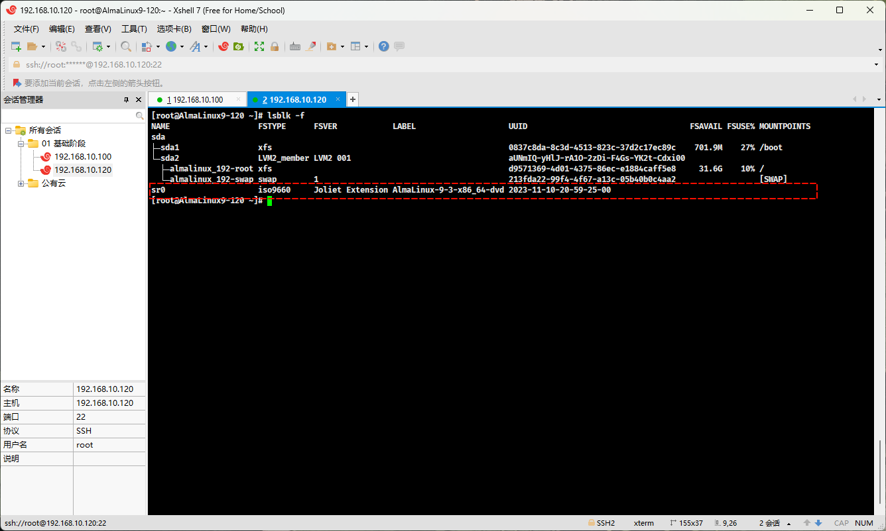
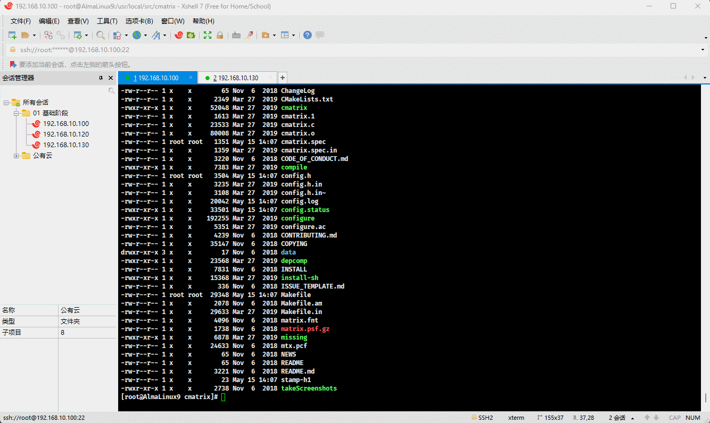
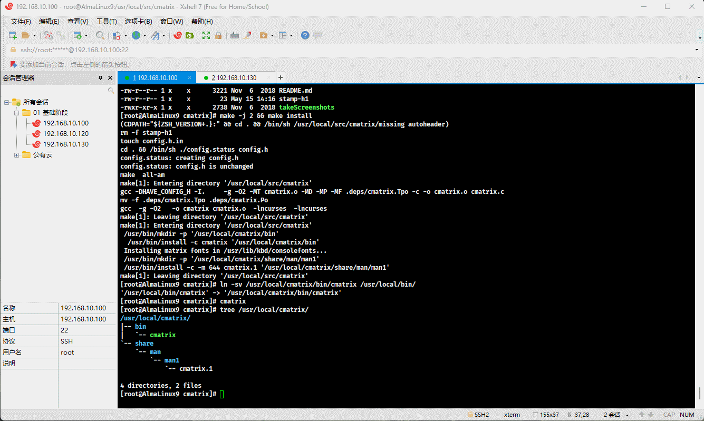
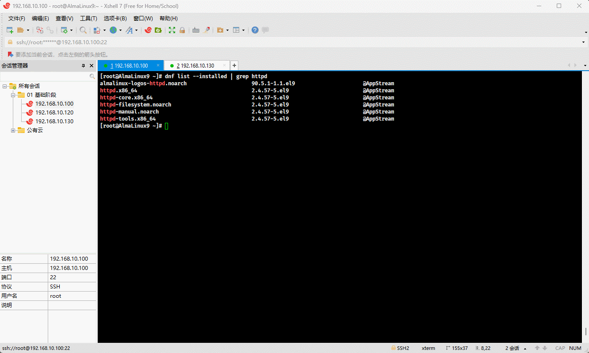
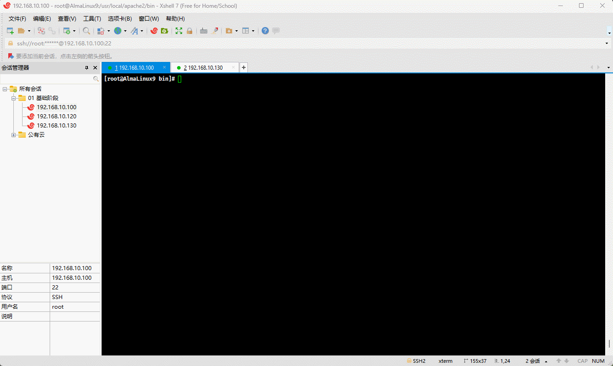
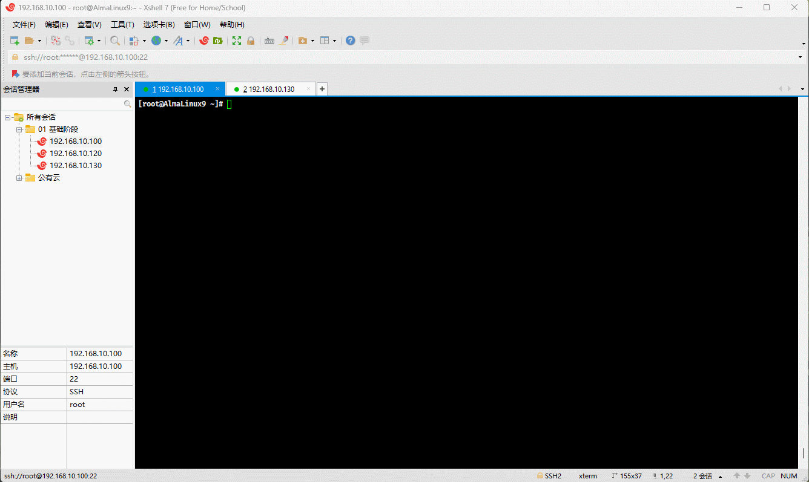

# 第一章：手动搭建 YUM 私有仓库

## 1.1 概述

* 我们借助 httpd 服务器软件来搭建 YUM 仓库，并作为其它服务器的 YUM 源，即：


> [!NOTE]
>
> * ① Linux 服务器（YUM 仓库）的地址是 `192.168.10.120` ，而 Linux 服务器（内网）的仓库是 `192.168.10.100` 。
> * ② 实际工作中，推荐使用 `nexus3` 来搭建 YUM 仓库。

* 所有的服务器（YUM 仓库和内网）均需关闭防火墙，以防止防火墙干扰实验：

```shell
systemctl disable --now firewalld
```


## 1.2 配置 Linux 服务器（YUM 仓库）

* 前提条件：Linux 服务器（YUM 仓库）需要挂载 CD-DVD （ISO 镜像文件），即：


> [!NOTE]
>
> 在实际工作中，无需挂载 CD-DVD ，因为 CD-DVD 已经属于淘汰的技术了，可以将 CD-DVD 中的数据复制到指定的目录中。

* 安装 httpd 服务器：

```shell
dnf -y install httpd
```


* 在 `/var/www/html` 目录下创建 `almalinux/9` 目录：

```shell
cd /var/www/html
```

```shell
mkdir -pv almalinux/9
```


* 查看块设备情况：

```shell
lsblk -f
```



* 将 CD-ROM 挂载到 `/var/www/html/almalinux/9` 中：

```shell
mount /dev/sr0 /var/www/html/almalinux/9
```


* 启动 httpd ：

```shell
systemctl enable --now httpd
```


* 通过浏览器测试访问：

```shell
http://192.168.10.120/almalinux/9
```


* 对于像 extras 这样的 YUM 仓库，在 CD-ROM 中是不存在，可以使用如下的命令，将互联网上的 YUM 仓库下载到本地：

```shell
dnf reposync --repoid=extras --download-metadata -p /var/www/html/almalinux
```

> [!NOTE]
>
> * ① 之所以这么配置，是因为 `/var/www/html/almalinux/9` 是挂载目录，而挂载目录是只读的，不可以创建和删除内容。
> * ② 上述配置的前提是，本机有 extras 仓库，并且该仓库是开启状态。


* 通过浏览器查看 extras 仓库：

```shell
http://192.168.10.120/almalinux/
```


## 1.3 配置 YUM 源

* 所有的内网服务器配置 YUM 源：

```shell
dnf config-manager --disable \* # 关闭所有的仓库
```

```shell
tee /etc/yum.repos.d/test.repo <<-'EOF'
[test-baseos]
name=AlmaLinux $releasever - test-BaseOS
baseurl=http://192.168.10.120/almalinux/9/BaseOS/
enabled=1
gpgcheck=1
countme=1
gpgkey=http://192.168.10.120/almalinux/9/RPM-GPG-KEY-AlmaLinux-9
metadata_expire=86400
enabled_metadata=1

[test-BaseOS]
name=AlmaLinux $releasever - test-AppStream
baseurl=http://192.168.10.120/almalinux/9/AppStream/
enabled=1
gpgcheck=1
countme=1
gpgkey=http://192.168.10.120/almalinux/9/RPM-GPG-KEY-AlmaLinux-9
metadata_expire=86400
enabled_metadata=1

[test-extras]
name=AlmaLinux $releasever - test-extras
baseurl=http://192.168.10.120/almalinux/extras/
enabled=1
gpgcheck=1
countme=1
gpgkey=http://192.168.10.120/almalinux/9/RPM-GPG-KEY-AlmaLinux-9
metadata_expire=86400
enabled_metadata=1
EOF
```


* 生成缓存：

```shell
dnf makecache
```


* 安装软件进行测试：

```shell
dnf -y install java-21*
```


# 第二章：编译（源码）安装

## 2.1 安装 cmatrix

* 下载源码：

```shell
wget https://github.com/abishekvashok/cmatrix/releases/download/v2.0/cmatrix-v2.0-Butterscotch.tar
```


* 安装依赖：

```shell
dnf -y install gcc make autoconf ncurses-devel
```


* 解压到指定目录：

```shell
tar -xvf cmatrix-v2.0-Butterscotch.tar -C /usr/local/src
```


* 配置：

```shell
cd /usr/local/src/cmatrix
```

```shell
./configure --prefix=/usr/local/cmatrix
```


* 查看 CPU 核数：

```shell
lscpu 
```



* 编译和安装：

```shell
make -j 2 && make install
```


* 使用软链接将 cmatrix 命令链接到 /usr/local/bin 目录下：

```shell
ln -sv /usr/local/cmatrix/bin/cmatrix /usr/local/bin
```


* 查看 cmatrix 的命令帮助路径：

```shell
tree /usr/local/cmatrix/
```


* 配置 cmatrix  命令帮助手册：

```shell
vim /etc/man_db.conf
```

```shell {4}
MANDATORY_MANPATH                       /usr/man
MANDATORY_MANPATH                       /usr/share/man
MANDATORY_MANPATH                       /usr/local/share/man
MANDATORY_MANPATH                       /usr/local/cmatrix/share/man  # 增加
```



* 测试 cmatrix  命令帮助手册是否配置成功：

```shell
man cmatrix  
```


## 2.2 安装 httpd

* 关闭防火墙和 SELinux：

```shell
# 查看 SELinux 是否开启
getenforce
# 查看 SELinux 是否开启
cat /etc/selinux/config
# 永久关闭 SELinux ，需要重启
sed -i 's/enforcing/disabled/' /etc/selinux/config
# 关闭当前会话的 SELinux ，重启之后无效
setenforce 0
# 查看 SELinux 是否开启
cat /etc/selinux/config
```

```shell
systemctl disable --now firewalld
```


* 查看系统是否安装有 httpd ：

```shell
dnf list --installed | grep httpd
```


* 卸载系统自带的 httpd ：

```shell
dnf -y remove httpd* 
```



* 查看是否卸载成功：

```shell
dnf list --installed | grep httpd
```


* 删除默认的系统用户（服务用户）：

```shell
useradd -r apache
```


* 下载源码：

```shell
wget -P /usr/local/src https://dlcdn.apache.org/httpd/httpd-2.4.59.tar.gz
```


* 安装依赖：

```shell
dnf -y install gcc make apr-devel \
	apr-util-devel pcre-devel openssl-devel redhat-rpm-config
```


* 解压：

```shell
cd /usr/local/src/
```

```shell
tar -xvf httpd-2.4.59.tar.gz
```


* 配置：

```shell
cd httpd-2.4.59
```

```shell
./configure --prefix=/usr/local/apache2 --enable-ssl
```


* 编译和安装：

```shell
make -j 2 && make install
```


* 创建指定的用户，并以该用户运行 httpd ：

```shell
useradd -r -s /sbin/nologin -u 48 -c Apache apache
```

```shell
vim /usr/local/apache2/conf/httpd.conf
```

```shell
User apache # 167 行
Group apache # 167 行
```


* 使用软链接将 httpd 命令链接到 /usr/local/bin 目录下：

```shell
ln -sv /usr/local/apache2/bin/httpd /usr/local/bin
```


* 配置 httpd 命令帮助手册：

```shell
vim /etc/man_db.conf
```

```shell {4}
MANDATORY_MANPATH                       /usr/man
MANDATORY_MANPATH                       /usr/share/man
MANDATORY_MANPATH                       /usr/local/share/man
MANDATORY_MANPATH                       /usr/local/apache2/man  # 增加
```



* 配置 systemd ：

```shell
tee /usr/lib/systemd/system/httpd.service <<'EOF'
[Unit]
Description=The Apache HTTP Server
Wants=httpd-init.service
After=network.target remote-fs.target nss-lookup.target httpd-init.service
Documentation=man:httpd.service(8)

[Service]
Type=simple
Environment=LANG=C

ExecStart=/usr/local/bin/httpd  -k start -DFOREGROUND
ExecReload=/usr/local/bin/httpd  -k graceful
ExecStop=/usr/local/bin/httpd  -k graceful-stop
# Send SIGWINCH for graceful stop
KillSignal=SIGWINCH
KillMode=mixed
PrivateTmp=true
OOMPolicy=continue

[Install]
WantedBy=multi-user.target
EOF
```


* 启动 httpd ：

```shell
systemctl daemon-reload
```

```shell
systemctl enable --now httpd
```



* 浏览器测试访问：

```shell
http://192.168.10.100:80
```


# 第三章：Ubuntu (24.04 LTS)软件包管理（⭐）

## 3.1 dkpg

### 3.1.1 概述

* dpgk (Debian Package) 是用于 Debian 及其衍生系统（如： Ubuntu）的软件包管理器。它是 Debian 软件包管理系统的核心部分，用于安装、删除和提供有关 `.deb` 软件包的信息。

### 3.1.2 dpkg 管理软件包

#### 3.1.2.1 概述

* dpkg 管理软件包，无非增（安装）删（卸载）改（升级）查（查询），即：

| 功能       | 命令                   | 选项含义                                                     | 类比 rpm                  |
| :--------- | :--------------------- | :----------------------------------------------------------- | ------------------------- |
| 增（安装） | `dpkg -i xxx.deb`      | `-i`， `--install`：安装软件包。                             | `rpm -ivh xxx.rpm`        |
| 删（卸载） | `dpkg -r xxx`          | `-e`，`--remove`：删除软件包，但是保留配置文件。             | `rpm -e xxx.rpm --nodeps` |
|            | `dpkg -P xxx`          | `-P`，`--purge`：删除软件包及其配置文件。                    | `rpm -e xxx.rpm --nodeps` |
| 改（升级） | `dpkg -i xxx.deb`      | `-i`， `--install`：安装或升级软件包。                       | `rpm -Uvh xxx.rpm`        |
| 查（查询） | `dpkg -l \| grep xxx`  | `-l`，`--list`：列出当前已安装的软件包。                     | `rpm -qa \|grep xxx`      |
|            | `dpkg -L xxx`          | `-l`，`--listfiles`：列出已安装软件包中所包含的文件。        | `rpm -ql xxx`             |
|            | `dpkg -S $(which xxx)` | `-S`，`--Search` ：根据文件或命令的绝对路径，查询对应的软件包。 | `rpm -qf $(which xxx)`    |
|            | `dpkg -s xxx`          | `-s`，`--status`：查询已安装软件包的详细信息。               | `rpm -qi xxx`             |
|            | `dpkg -c xxx.deb`      | `-c`，`--contents`：列出 deb 包的内容。                      | `rpm -qpl xxx.rpm`        |

#### 3.1.2.2 增（安装）

* 命令：

```shell
dpkg -i xxx.deb
```


* 示例：

```shell
wget https://mirrors.tuna.tsinghua.edu.cn/ubuntu/ubuntu/ubuntu/ubuntu/ubuntu/pool/universe/t/tree/tree_1.6.0-1_amd64.deb
```

```shell
dpkg -i tree_1.6.0-1_amd64.deb
```


#### 3.1.2.3 查（查询）

* 命令：

```shell
dpkg -l | grep xxx # 查询是否安装成功
```

```shell
dpkg -s xxx # 查询已安装软件包的详细信息
```

```shell
dpkg -L xxx # 查询已安装软件包中中所包含的文件
```

```shell
dpkg -S $(which xxx) # 根据指定的命令或文件的绝对路径查询对应的软件包
```

```shell
dpkg -c xxx.deb # 查询软件包中的所有内容
```


* 示例：查询是否安装成功

```shell
dpkg -l | grep tree
```


* 示例：查询已安装软件包的详细信息

```shell
dpkg -s tree
```


* 示例：查询已安装软件包中中所包含的文件

```shell
dpkg -L tree
```


* 示例：根据指定的命令或文件的绝对路径查询对应的软件包

```shell
dpkg -S $(which tree)
```


* 示例：查询软件包中的所有内容

```shell
dpkg -c tree_1.6.0-1_amd64.deb
```


#### 3.1.2.4 改（升级）

* 命令：

```shell
dpkg -i xxx.deb
```

> [!NOTE]
>
> 在实际工作的时候，升级需要经过严格的测试（找一台裸机模拟环境进行升级）。


* 示例：

```shell
wget https://mirrors.tuna.tsinghua.edu.cn/ubuntu/ubuntu/ubuntu/ubuntu/ubuntu/pool/universe/t/tree/tree_2.1.1-1_amd64.deb
```

```shell
dpkg -i tree_2.1.1-1_amd64.deb
```

#### 3.1.2.5 删（卸载）

* 命令：

```shell
dpkg -r xxx # 删除软件包，但是保留配置文件
```

```shell
dpkg -P xxx # 删除软件包以及配置文件
```


* 准备工作：

```shell
wget https://mirrors.tuna.tsinghua.edu.cn/ubuntu/ubuntu/ubuntu/ubuntu/ubuntu/pool/universe/z/zabbix/zabbix-agent2_6.0.13%2Bdfsg-1_amd64.deb
```

```shell
dpkg -i zabbix-agent2_6.0.13+dfsg-1_amd64.deb
```


* 示例：删除软件包，但是保留配置文件

```shell
dpkg -r zabbix-agent2
```


* 示例：删除软件包以及配置文件

```shell
dpkg -P zabbix-agent2
```


## 3.2 apt 

### 3.2.1 概述

* `apt` 是 Debian 和基于 Debian 的发行版（如： Ubuntu）中的高级包管理工具。它提供了一个更简单、更一致的界面来管理软件包，包括安装、更新、升级和删除软件包。`apt` 是 `apt-get` 和 `apt-cache` 工具的简化和改进版本，集成了它们的主要功能。

### 3.2.2 apt  管理软件包

#### 3.2.2.1 概述

* apt  管理软件包，无非增（安装）删（卸载）改（升级）查（查询），即：

| 功能       | 命令                                    | 备注                                                      |
| :--------- | :-------------------------------------- | :-------------------------------------------------------- |
| 增（安装） | `apt install xxx`                       |                                                           |
| 删（卸载） | `apt remove xxx`                        | 删除软件包，但是保留配置文件。                            |
|            | `apt purge xxx`                         | 删除软件包以及配置文件。                                  |
|            | `apt autoremove`                        | 自动删除不需要的软件包。                                  |
| 改（升级） | `apt update `                           | 更新存储库索引，类似于 `dnf clean all && dnf makecache`。 |
|            | `apt upgrade`                           | 更新所有可升级的软件包。                                  |
|            | `apt full-upgrade`                      | 在升级软件包的同时自动处理依赖关系。                      |
| 查（查询） | `apt search xxx`                        | 搜索软件包。                                              |
|            | `apt show xxx`                          | 显示软件包的详细信息。                                    |
|            | `apt list --installed \| --upgradable ` | 列出包含条件的包（已安装，可升级等）                      |
| 编辑镜像源 | `apt edit-sources`                      |                                                           |

* 查看仓库中的软件包的所有版本：

```shell
apt-cache madison nginx
```

* 安装指定版本的软件包：

```shell
apt install nginx=1.14.0-0ubuntu1.6 -y
```


#### 3.2.2.2 增（安装）

* 命令：

```shell
apt install xxx
```


* 示例：

```shell
apt install tree zip -y 
```


* 示例：

```shell
apt install ubuntu-desktop -y
```


#### 3.2.2.3 删（卸载）

* 命令：

```shell
apt remove xxx # 删除软件包，但是保留配置文件
```

```shell
apt purge xxx # 删除软件包以及配置文件
```


* 示例：

```shell
apt remove tree zip -y
```


* 示例：

```shell
apt purge tree zip -y
```


#### 3.2.2.4 改（升级）

* 命令：

```shell
apt update # 更新存储库索引
```

```shell
apt upgrade # 更新所有可升级的软件包，前提是需要更新存储库索引
```


* 示例：更新存储库索引

```shell
apt update -y
```


* 示例：

```shell
apt upgrade -y
```


#### 3.2.2.5 查（查询）

* 命令：

```shell
apt search xxx # 搜索软件包
```

```shell
apt show xxx # 显示软件包的详细信息
```

```shell
apt list # 列出包含条件的包（已安装，可升级等）
```

```shell
apt list --installed # 列出所有已安装的软件包
```

```shell
apt list --upgradable # 列出所有可升级的软件包
```


* 示例： 搜索软件包

```shell
apt search nginx
```


* 示例：显示软件包的详细信息

```shell
apt show apache2
```


* 示例：列出包含条件的包（已安装，可升级等）

```shell
apt list
```


* 示例：列出所有已安装的软件包

```shell
apt list --installed
```


* 示例：列出所有可升级的软件包

```shell
apt list --upgradable 
```


### 3.2.3 apt 锁定软件包版本

#### 3.2.3.1 概述

* 在生产环境中，我们有时会将软件包进行锁定，防止升级到更高的版本，避免出现一些问题。

> [!WARNING]
>
> 滴滴之前出现过生产事故，就是运维通过 `apt -y update && apt -y upgrade` 命令进行整个 Linux 系统的软件包升级，包括： Linux 内核，导致生产环境的 kubernetes 在升级过程中挂掉，进而导致滴滴打车服务的不可用，影响非常恶劣！！！

* apt 的子命令 apt-mark 就可以实现软件包锁定：

```shell
apt-mark hold xxx # 锁定软件包，防止它在系统升级时被升级
```

```shell
apt-mark unhold xxx # 解除锁定软件包，可以允许它在系统升级时被升级
```

```shell
apt-mark showhold # 显示当前系统中所有被锁定的软件包
```

#### 3.2.3.2 生产实践（锁定内核版本）

* 查询当前的内核版本：

```shell
uname -sr
```


* 查询已安装的内核包：

```shell
dpkg --list | grep linux-image  # 和下面的命令等同
```

```shell
apt list --installed | grep linux-image # 和上面的命令等同
```


* 锁定内核包：

```shell
apt-mark hold linux-image-6.8.0-31-generic
```

```shell
apt-mark hold linux-image-generic
```


#### 3.2.3.3 生产实践（锁定 Docker 版本）

* 卸载旧版本 Docker ：

```shell
for pkg in docker.io docker-doc docker-compose docker-compose-v2 podman-docker containerd runc; do sudo apt remove $pkg -y; done
```


* 安装 Docker 的 apt 仓库：

```shell
sudo apt update -y
sudo apt install ca-certificates curl -y
sudo install -m 0755 -d /etc/apt/keyrings
sudo curl -fsSL https://download.docker.com/linux/ubuntu/gpg -o /etc/apt/keyrings/docker.asc
sudo chmod a+r /etc/apt/keyrings/docker.asc
echo \
  "deb [arch=$(dpkg --print-architecture) signed-by=/etc/apt/keyrings/docker.asc] https://download.docker.com/linux/ubuntu \
  $(. /etc/os-release && echo "$VERSION_CODENAME") stable" | \
  sudo tee /etc/apt/sources.list.d/docker.list > /dev/null
sudo apt update -y
```


* 查看 Docker  的版本：

```shell
apt-cache madison docker-ce
```


* 安装指定版本的 Docker ：

```shell
sudo apt install docker-ce=5:26.0.0-1~ubuntu.24.04~noble \
		docker-ce-cli=5:26.0.0-1~ubuntu.24.04~noble \
		containerd.io docker-buildx-plugin docker-compose-plugin -y
```


* 查看安装的 Docker 版本：

```shell
apt list --installed | grep docker-ce
```

```shell
dpkg --list | grep docker-ce
```


* 锁定 Docker 版本：

```shell
apt-mark hold docker-ce
apt-mark hold docker-ce-cli
apt-mark hold docker-ce-rootless-extras
```


* 更新整个系统：

```shell
apt update -y && apt upgrade -y
```


* 查看安装的 Docker 版本：

```shell
apt list --installed | grep docker-ce
```

```shell
dpkg --list | grep docker-ce
```


