# 第一章：磁盘结构

## 1.1 准备工作

* 在之前，我们在[安装操作系统](https://aexiar.github.io/linux/notes/01_linux_basic/01_xdx/)的时候，对于磁盘是通过`自动安装分区`的方式；但是，本次将采用`自定义安装分区`的方式，其划分如下：

| 分区名称          | 推荐大小                            | 说明                                                         |
| ----------------- | ----------------------------------- | ------------------------------------------------------------ |
| 引导分区（/boot） | 500MB - 1GB。                       | 存放引导加载程序和内核。<br>通常建议单独分区以避免引导相关问题。 |
| 交换分区（swap）  | 等于或略大于物理内存（RAM）的大小。 | 通常推荐 1-2 倍于RAM。<br/>用于内存交换，帮助提高系统稳定性和性能，尤其是在内存不足的情况下。 |
| 根分区（/）       | 磁盘剩余的空间都划分给根分区。      | 这是最基本的分区，包含操作系统及其大多数的核心文件。         |

* 本人的配置，如下所示：

```shell
lsblk -o NAME,SIZE,FSTYPE,MOUNTPOINT
```

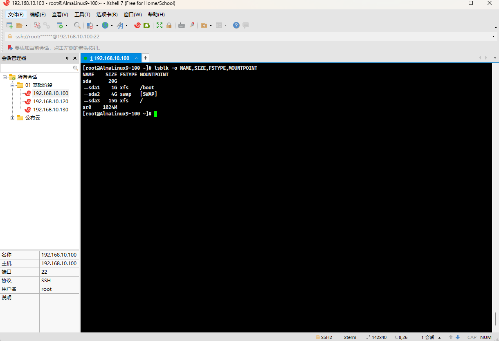

* 其对应的安装步骤如下（只给出不同的步骤，相同的步骤略）：


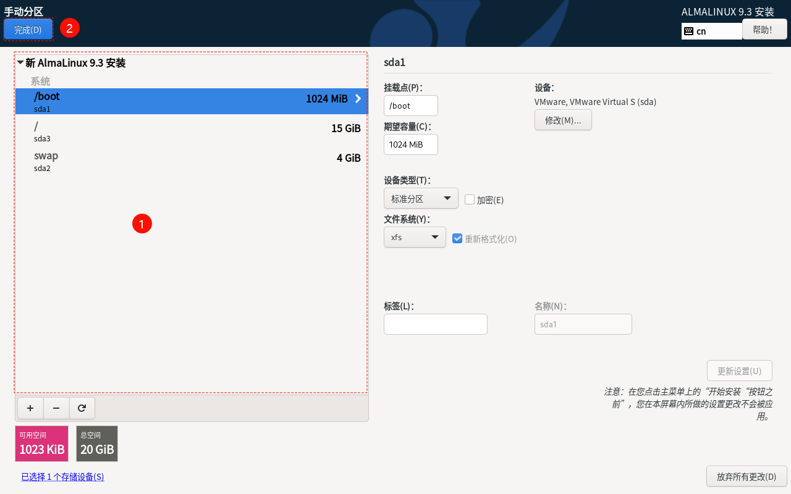

* 并且采用`最小安装`，即只安装基本功能：

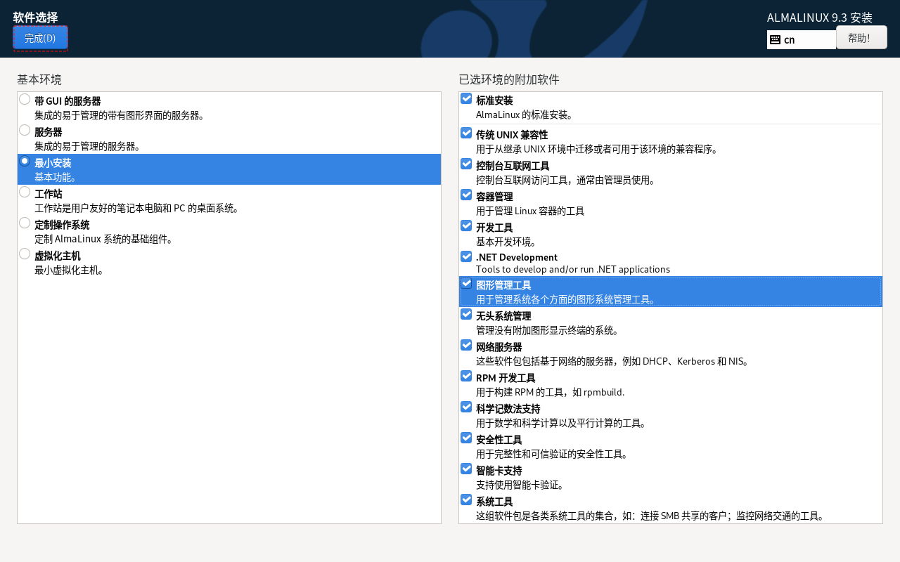

* 安装必要的软件包：

```shell
dnf config-manager --set-enabled crb
dnf -y install epel-release
```

```shell
dnf -y install gcc make autoconf gcc-c++ glibc glibc-devel pcre \
    pcre-devel openssl openssl-devel systemd-devel zlib-devel \
    tree vim tmux lsof tcpdump bc bzip2 nfs-utils man-pages \
    wget bash-completion \
    lrzsz net-tools sysstat iotop iftop htop zip unzip nc \
    nmap telnet bc psmisc httpd-tools bind-utils nethogs expect
```

```shell
dnf -y groupinstall "Development Tools"
```

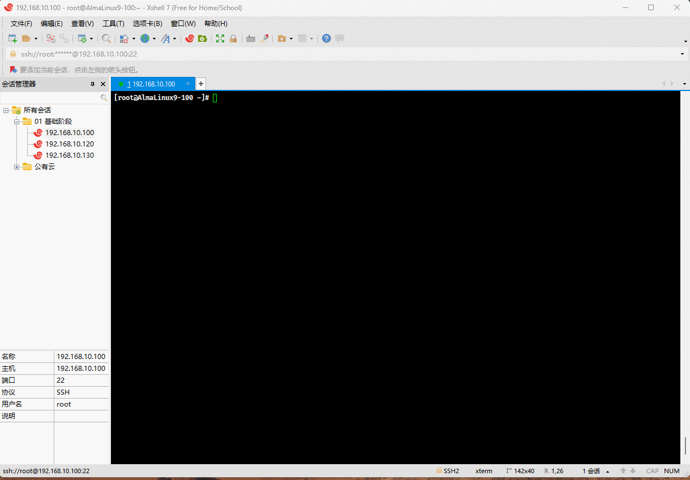

* 切换为英文环境：

```shell
localectl status # 查看当前的语言环境
```

```shell
dnf search locale en # 搜索英文语言包
```

```shell
dnf -y install glibc-langpack-en # 安装英文语言包
```

```shell
localectl set-locale LANG=en_US.UTF-8 # 切换 locale 为英文
```

```shell
source /etc/locale.conf # 手动加载配置文件，使其生效
```

```shell
localectl status # 查看当前的语言环境
```


## 1.2 设备文件

* Linux 中的哲学是：一切皆文件。对于普通文件而言，如果使用 C 语言来操作文件，通常会涉及到以下的四个函数：

```c
/**
 * 打开文件
 * 
 * @param pathname 文件路径
 * @param flags 打开文件的标志
 * @param mode 文件权限（当创建文件时）
 * @return 文件描述符，如果出错返回 -1
 */
int open(const char *pathname, int flags, mode_t mode);
```

```c
/**
 * 读取文件
 * 
 * @param fd 文件描述符
 * @param buf 存储读取数据的缓冲区
 * @param count 要读取的字节数
 * @return 实际读取的字节数，如果出错返回 -1
 */
ssize_t read(int fd, void *buf, size_t count);
```

```c
/**
 * 写入文件
 * 
 * @param fd 文件描述符
 * @param buf 要写入数据的缓冲区
 * @param count 要写入的字节数
 * @return 实际写入的字节数，如果出错返回 -1
 */
ssize_t write(int fd, const void *buf, size_t count);
```

```c
/**
 * 关闭文件
 * 
 * @param fd 文件描述符
 * @return 成功时返回 0，如果出错返回 -1
 */
int close(int fd);
```

* 在 Linux 中，设备文件（Device Files）也是一种文件，并且设备文件是指向系统硬件设备的特殊文件，它们通常位于 `/dev` 目录下。

> [!NOTE]
>
> 设备文件需要关联一个设备驱动程序，进而才能够和对应的硬件设备进行通信。

* 对于普通文件而言，我们知道：如果两个文件的 inode 相同（硬链接），就表明这两个文件是一样，即：

```shell
ll -i
```

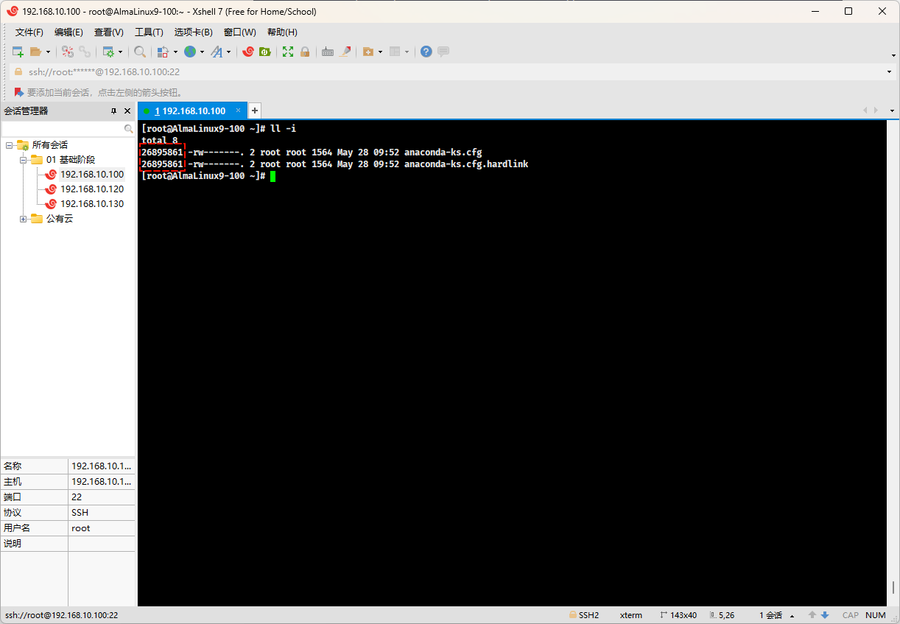

* 但是，对于设备文件，却不一样；设备文件有两个主要的属性，即：`主设备号（major number）`和`次设备号（minor number）`。
  * 主设备号（major number）：用于标识设备的类型，即设备驱动程序。
  * 次设备号（minor number）：用于标识同一类型中具体的设备实例。

* 可以通过如下的命令，来查看设备文件的相应信息：

```shell
ll -i /dev/sd*
```

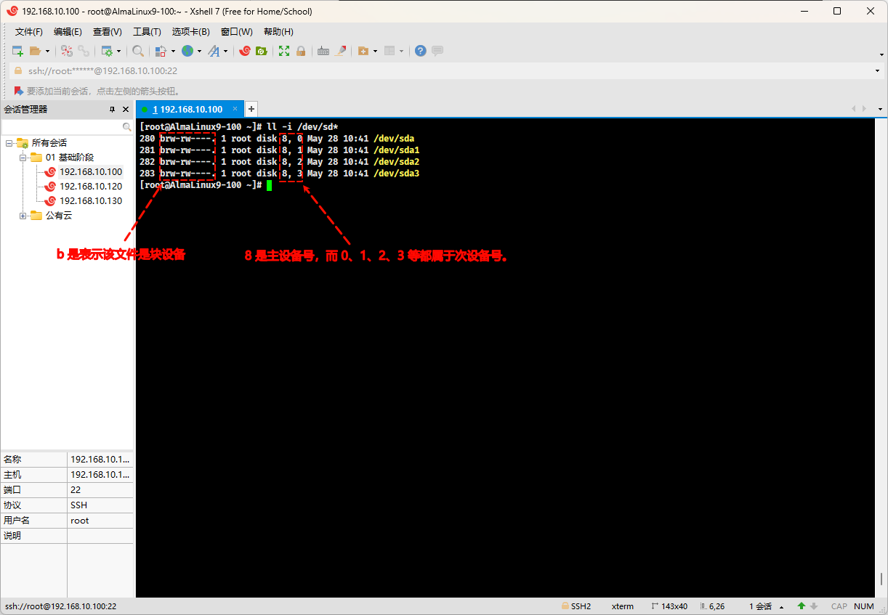

* Linux 中的设备类型，有如下两种：

| 设备类型         | 特点                                                         | 例子                                                         |
| ---------------- | ------------------------------------------------------------ | ------------------------------------------------------------ |
| 块设备（block）  | 块设备是按`块`访问的设备，如：硬盘和光驱。<br>它们有缓冲区，数据按块传输，可以随机访问。 | /dev/sda <br>/dev/sdb <br>/dev/sr0 <br/>/dev/loop0 <br/>/dev/nvme0n1 |
| 字符设备（char） | 字符设备是按`字符`流访问的设备，如：终端和串口。<br>它们没有缓冲区，数据按字节传输。 | /dev/null <br/>/dev/zero  <br/>/dev/random  <br/>/dev/console  <br/>/dev/pts |

* 并且，Linux 中的硬盘命名（针对于硬盘接口类型而言）的规则，如下所示：

| 设备类型           | 设备名称格式                  | 说明                                                         | 示例                     |
| ------------------ | ----------------------------- | ------------------------------------------------------------ | ------------------------ |
| 传统 IDE 硬盘      | `/dev/hd[a-d][1-16]`          | [a-d]：表示第几块硬盘。<br>[1-16]：表示第几块硬盘的第几个分区。 | `/dev/hda1`, `/dev/hdb3` |
| SCSI/SATA/USB 硬盘 | `/dev/sd[a-z][1-15]`          | [a-z]：表示第几块硬盘。<br/>[1-15]：表示第几块硬盘的第几个分区。 | `/dev/sda1`, `/dev/sdb2` |
| NVMe 固态硬盘      | `/dev/nvme[0-9]n[0-9]`        | [0-9]：表示第几个 NVMe 固态硬盘。<br/>[0-9]：表示第几个 NVMe 固态硬盘的第几个命名空间。 | `/dev/nvme0n1`           |
| NVMe 分区          | `/dev/nvme[0-9]n[0-9]p[1-15]` | [0-9]：表示第几个 NVMe 固态硬盘。<br/>[0-9]：表示第几个 NVMe 固态硬盘的第几个命名空间。<br/>[1-15]：表示第几个 NVMe 固态硬盘的第几个命名空间的第几个分区。 | `/dev/nvme0n1p1`         |

* 在 Linux 中，可以使用 mknod 命令来创建设备文件，其格式如下：

```shell
 mknod 设备文件名称 TYPE MAJOR MINOR
```

> [!NOTE]
>
> * TYPTE 选项：
>   * `b`：创建一个带有缓存区的块设备文件。
>   * `c`：创建一个不带缓冲区的字符设备文件。
> * [MAJOR MINOR]：主设备号和次设备号。


* 示例：查询 CD-ROM 的主设备号和次设备号

```shell
ll /dev/sr0
```

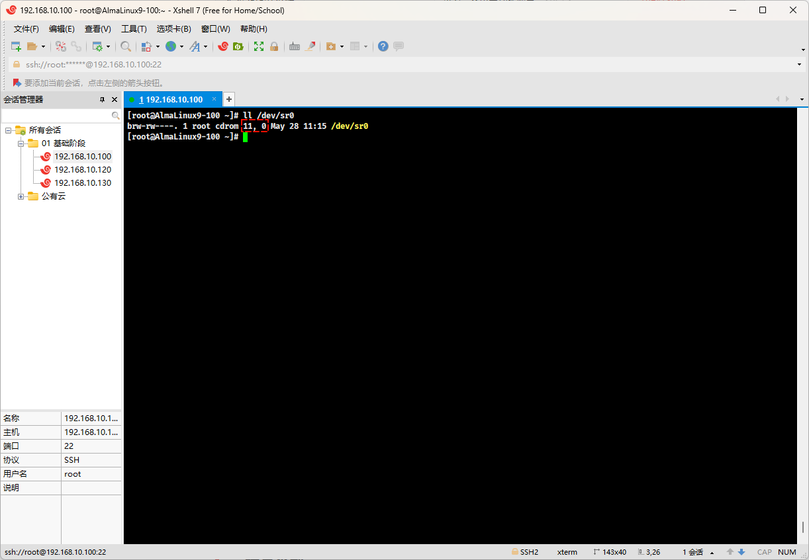


* 示例：创建块设备文件

```shell
mknod def-sr0 b 11 0
```

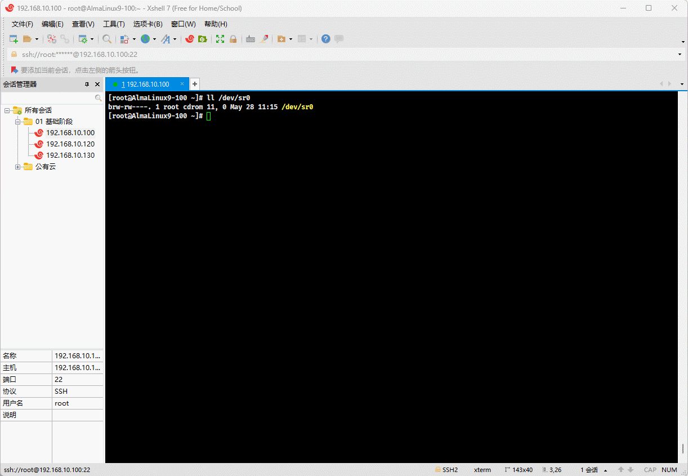


* 示例：将刚创建的设备文件挂载到 /mnt 下，查看 CD-ROM 中的内容

```shell
mnt def-sr0 /mnt
```

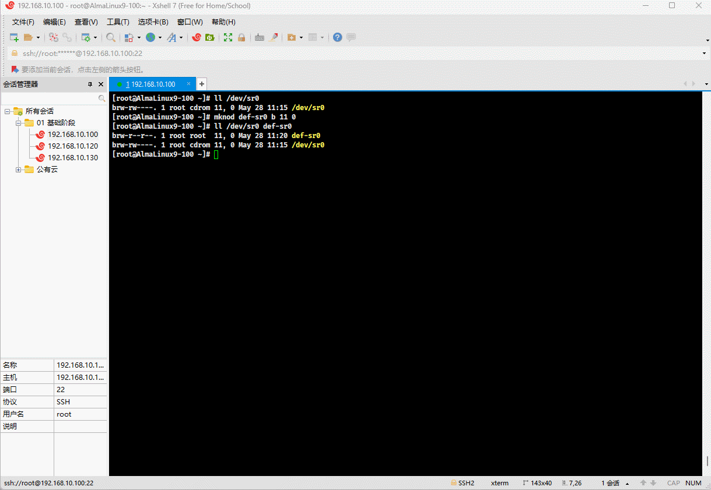

## 1.3 硬盘类型

* 硬盘类型（硬盘接口类型），如下所示：

| 接口类型 | 特点                                                         | 典型传输速度                                                 |
| -------- | ------------------------------------------------------------ | ------------------------------------------------------------ |
| IDE      | 又称为 PATA 接口，是一种老式硬盘接口类型，速度相对较慢，已逐渐被SATA 接口取代。 | 100-133 MB/s                                                 |
| SCSI     | 用于服务器和高性能工作站，支持多设备连接，具有高传输速度和可靠性，成本较高。 | 40-320 MB/s                                                  |
| SATA     | 传输速度快、连接稳定，常用于机械硬盘和固态硬盘。版本包括 SATA I（1.5Gbps）、SATA II（3.0Gbps）和SATA III（6.0Gbps）。 | 150 MB/s（SATA I），300 MB/s（SATA II），600 MB/s（SATA III） |
| SAS      | SCSI 接口的串行版本，具有更高的传输速度和更强的连接能力，主要用于企业级存储设备和服务器。 | 300-1200 MB/s                                                |
| USB      | 主要用于外接硬盘，通过 USB 接口（如：USB 2.0、USB 3.0、USB 3.1 等）连接到计算机，便于移动存储和数据传输。 | 60 MB/s（USB 2.0），625 MB/s（USB 3.0），1250 MB/s（USB 3.1） |
| M.2      | 为固态硬盘设计的小型接口，支持 NVMe 协议，具有极高的读写速度和低延迟，常用于高性能笔记本和台式机。 | 1000-3500 MB/s（依赖于 PCIe 通道数量）                       |

* 硬盘接口类型的作用：
  * ① 连接硬盘和主板：接口类型决定了硬盘如何物理连接到计算机的主板上。
  * ② 速度传输速率：接口类型会影响数据在硬盘和主板之间传输的最大速率。
  * ③ 兼容性：不同的接口类型对应不同的标准和协议，确保硬盘与主板及其他组件的兼容性。

> [!NOTE]
>
> 接口类型主要用于连接硬盘和主板，传输数据的效率和速度确实会受到接口类型的影响，但并不是唯一因素。影响硬盘速度的因素如下：
>
> * ① **硬盘技术**：
>   * 机械硬盘（HDD）：依赖旋转磁盘和读写头，速度较慢。
>   * 固态硬盘（SSD）：利用闪存技术，速度较快。
>   * NVMe SSD：使用 NVMe 协议和 PCIe 总线，速度更快。
> * ② **接口类型**：
>   * SATA：常见于 HDD 和 SATA SSD，最大传输速度为 600 MB/s。
>   * PCIe/NVMe：常见于高性能 SSD，传输速度可达 3500 MB/s 甚至更高。
> * ③ **主板和系统配置**：主板支持的接口类型和带宽限制也会影响硬盘的实际性能。

## 1.4 机械硬盘和固态硬盘

### 1.4.1 机械硬盘

* 定义：机械硬盘（HDD，Hard Disk Drive）是一种带有机械马达结构的存储装置，主要由：盘片，磁头，盘片转轴及控制电 机，磁头控制器，数据转换器，接口，缓存等几个部分组成。
* 内部构造：

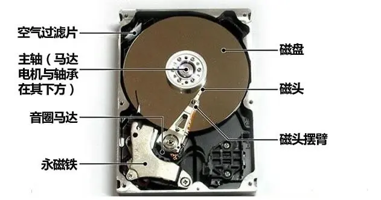

* 机械硬盘的[工作原理](https://www.youtube.com/watch?v=dGRJc9ruRnk)，如下所示：

| 关键组件         | 特点                                                         |
| ---------------- | ------------------------------------------------------------ |
| 盘片和旋转轴     | 机械硬盘内部包含多个盘片，这些盘片平行安装在一个旋转轴上。<br>盘片高速旋转，通常达到每分钟几千转（RPM）。 |
| 磁头和磁头控制器 | 每个盘片的存储面上都有一个磁头，负责读取和写入数据。<br/>磁头与盘片之间的距离非常小，比一根头发丝的直径还要小。<br/>所有的磁头连接到一个磁头控制器上，由控制器控制各个磁头的移动。 |

* 机械硬盘的数据读写过程：
  * 磁头可以沿着盘片的半径方向移动，结合盘片的高速旋转，磁头能够快速定位到盘片的指定位置进行数据读写。
  * 数据写入：磁头通过电磁流改变盘片上磁性材料的极性来记录数据。
  * 数据读取：磁头感应盘片上磁性材料的极性变化，将其转换为电信号读取数据。
* 其对应的动画，如下所示：

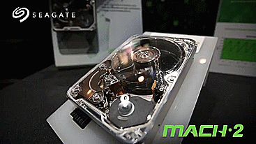


> [!NOTE]
>
> * ① 硬盘是精密设备，内部空气需要保持清洁。
>
> * ② 进入硬盘的空气必须经过过滤，以防止灰尘和杂质损害盘片和磁头。
> * ③ 机械硬盘读取数据的时间 = 寻道（寻找数据所在的磁道）+ 机械硬盘转速的时间 + 数据读写的时间。

### 1.4.2 固态硬盘

* 定义：固态硬盘（SSD，Solid State Drive）是一种不带有机械马达结构的存储装置，主要带有闪存、主控芯片、缓存。
* 内部构造：

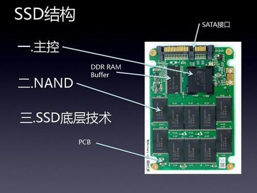

* 其工作原理，如下所示：

| 关键组件     | 特点                                                         |
| ------------ | ------------------------------------------------------------ |
| 闪存存储芯片 | SSD 主要依靠闪存芯片来存储数据。闪存是一种非易失性存储器，即使断电后数据也不会丢失。<br>常见的闪存类型包括 NAND 闪存和 NOR 闪存，SSD 通常使用 NAND 闪存。 |
| 存储单元     | 闪存芯片由多个存储单元组成，每个存储单元可以存储一个或多个比特的数据。<br/>根据存储单元的比特数，闪存分为 SLC（单层单元）、MLC（多层单元）、TLC（三层单元）和 QLC（四层单元）等类型。<br/>比特数越多，存储密度越高，但耐久性和速度相对较低。 |
| 控制器       | SSD 内部有一个控制器，负责管理数据的读写、垃圾回收（Garbage Collection）、错误校正（Error Correction）等操作。<br/>控制器还处理数据的均匀写入（Wear Leveling），以延长 SSD 的寿命。 |
| 缓存         | 许多 SSD 配备了缓存（如：DRAM缓存），用于加速数据的读写操作。<br/>缓存可以提高性能，特别是在处理小文件或频繁访问的数据时。 |

* 固态硬盘的数据读写过程：

  - 写入数据：控制器将数据以电信号的形式发送到闪存单元，通过改变存储单元的电荷状态来记录数据。

  - 读取数据：控制器通过检测存储单元的电荷状态来读取数据，并将其转换回电信号。

> [!NOTE]
>
> * ① **垃圾回收**：由于闪存的特性，写入新数据前需要先擦除旧数据。垃圾回收机制定期整理和清理存储单元，确保有足够的空闲空间用于新数据的写入。
>
> * ② **均匀写入**：控制器将数据写入分散到不同的存储单元，以防止某些单元过度磨损，延长 SSD 的使用寿命。

## 1.5 硬盘术语

### 1.5.1 CHS

* 机械硬盘的内部结构中，会出现如下的概念：
  * **磁头（head）**：磁盘驱动器中的磁头用于读取和写入磁盘上的数据。每个磁盘表面都有一个磁头。
  * **磁道（track）**：磁盘上同心圆形的路径，每个磁盘表面有多个磁道，用于存储数据。
  * **扇区（sector）**：每个磁道分成若干扇区，是磁盘上最小的数据存储单位。每个扇区通常大小为 512 字节。
  * **柱面(cylinder)**：柱面是垂直穿过磁盘所有盘片同一磁道的集合。换句话说，在不同盘片上但同一位置的磁道组成一个柱面。

* 其对应的逻辑图，如下所示：

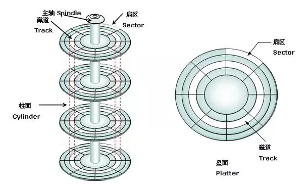

> [!NOTE]
>
> * ① 磁头的数量 = 盘面的数量。
> * ② 磁道的数量 = 柱面的数量。
> * ③ 1 柱面 = 扇区的大小（521 B）× 扇区的数量（磁道的数量） × 磁头的数量。
> * ④ 在 RHEL 5 之前的版本中，Linux 是以柱面的整数倍划分分区的（这种方式也称为 CHS（Cylinder Head Sector））；但是，在 RHEL 6 之后，Linux 都是以扇区来划分分区。


* 示例：查看扇区

```shell
fdisk -l
```

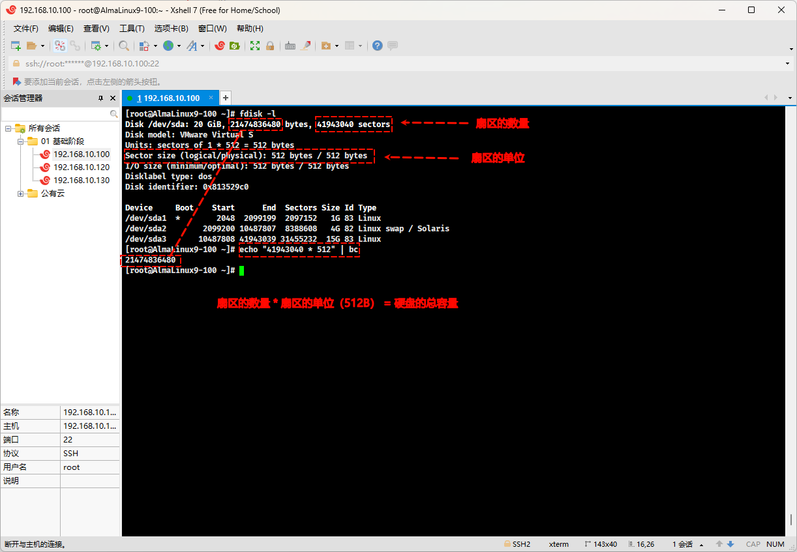

### 1.5.2 LBA（logical block addressing）

* 在之前的 CHS 中，机械硬盘是这样划分的：


* CHS 是采用 24 bit 寻址的；其中，前 10 bit 表示 cylinder，中间 8 bit 表示 head，后面 6 bit 表示 sector ，即最大寻址空间是：

```shell
echo "2 ^ 24 * 512 / 1024 / 1024 / 1024 " | bc # 8 GB
```


* 之所以，不再采用 CHS 的方式，就是因为它的最大寻址空间只支持 8GB ；现在的硬盘的容量，早就远远超过了 8GB。所以，现代的操作系统都是采用 LBA（logical block addressing）的方式，即：
  * LBA 是一个整数，通过转换成 CHS 格式完成磁盘具体寻址 。
  * ATA-1 规范中定义了 28 位寻址模式，以每扇区 512 位组来计算，ATA-1 所定义的 28 位 LBA 上限达到 128 GB。
  * 2002 年 ATA-6 规范采用 48 位 LBA，同样以每扇区 512 位组计算容量上限可达 128 PB。

* 其对应的机械硬盘，是这么划分的：


# 第二章：存储管理

## 2.1 概述

* 在 Linux 中，对于一个新的硬盘的使用步骤，如下所示：
  * ① 分区：分区是将硬盘划分为独立区域的过程，每个分区可以独立使用和管理。
  * ② 格式化：格式化是将文件系统写入分区的过程，以便操作系统能够读取和写入数据。
  * ③ 挂载：挂载是将格式化的分区连接到文件系统树的过程，以便用户能够访问分区上的数据。

> [!NOTE]
>
> * ① Windows 和 Linux 有所不同。
> * ② Windows 中不需要进行挂载，是由系统帮你自动挂载的。
> * ③ 但是，Linux 需要手动挂载！！！

## 2.2 分区的好处

* 在计算机系统中，对硬盘进行分区有很多原因，即：
  * ① 优化 I/O 性能。
  * ② 实现磁盘空间配额限制。
  * ③ 提高修复速度。
  * ④ 隔离系统和程序。
  * ⑤ 安装多个OS 。
  * ⑥ 采用不同文件系统。

* 如果不对硬盘进行分区，将无法直接写入文件系统，原因如下：
  * ① 分区表的作用：
    * 硬盘上的分区表是存储设备的 **“目录”**，记录了每个分区的起始位置、大小等信息。
    * 操作系统依赖分区表来识别和访问硬盘上的不同分区。
    * 没有分区表，操作系统无法正确识别和管理磁盘空间。
  * ②  文件系统依赖分区：
    * 文件系统必须创建在分区上。分区提供了文件系统的边界和管理机制。
    * 没有分区，文件系统无法找到其管理的起始和结束位置，无法在磁盘上正确组织和存储数据。
  * ③ 物理和逻辑管理：
    * 分区帮助将硬盘的物理空间组织成更小的逻辑单元。
    * 每个分区可以独立管理，这简化了数据管理，提高了效率和安全性。例如：可以为不同用途（操作系统、数据、备份等）创建不同的分区，便于管理和维护。
  * ④ 兼容性和标准化：
    * 大多数操作系统和硬件控制器，都期望硬盘按照标准分区方案进行组织。
    * 分区方案（如 MBR 或 GPT）是行业标准，确保不同系统和设备之间的兼容性；如果不使用分区，可能会导致兼容性问题，使硬盘无法在不同系统中正常使用。

## 2.3 分区的方式

### 2.3.1 概述

* 目前，主流的硬盘分区方式，有如下的两种：
  * MBR（Master Boot Record，主记录引导）。
  * GPT（GUID Partition Table，GUID 分区表）。

> [!NOTE]
>
> * ① 目前，Win11 和 MacOS 已经强制使用 GPT 分区格式。
> * ② Linux 目前还支持 MBR 分区格式；但是，GPT 分区格式是趋势。

### 2.3.2 MBR 分区

* MBR（Master Boot Record，主记录引导），诞生于 1982 年，使用 32 bit 来表示扇区数，所以分区最大不能超过 2 T，计算如下所示：

```shell
echo "2 ^ 32 * 512 / 1024 / 1024 / 1024 / 1024 " | bc # 2 TB
```

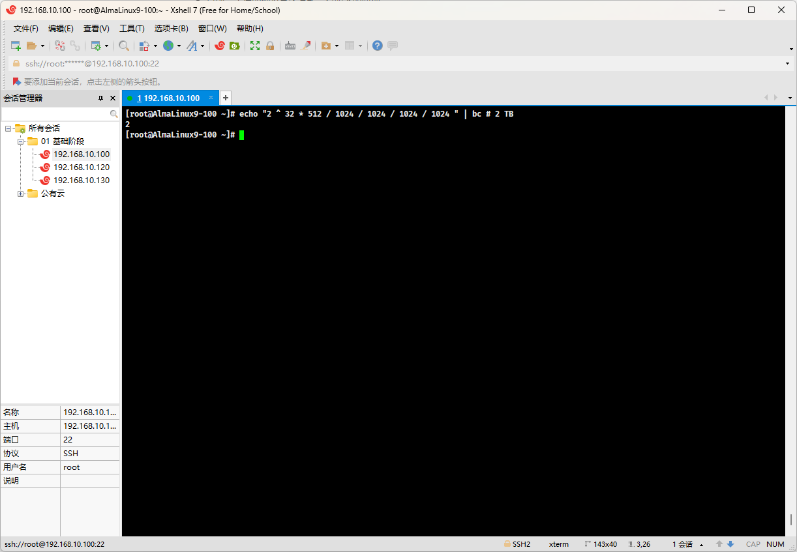

* MBR 通常位于硬盘的 0 磁道 0 扇区（512 bytes，即 512 B），其中：
  * 前 446 bytes 用于引导程序（boot loader），即包含启动计算机所需要的代码，通常用于引导操作系统。
  * 中间 64 bytes 就是分区表（partition table），每 16 bytes 标识一个分区。
  * 最后 2 bytes 是固定值 55AA，用于标识该扇区为有效的 MBR，BIOS 会检查此签名以验证 MBR 的有效性。

> [!NOTE]
>
> * ① 因为 MBR 的分区表的限制，所以 MBR 分区的硬盘最多有 4 个主分区，也可以有 3 个主分区 + 1 个扩展分区（N 个逻辑分区）。
> * ② MBR 分区中的主分区和扩展分区对应的编号是 1 -4 ，逻辑分区到 5 开始。

* MBR 硬盘分区结构图：

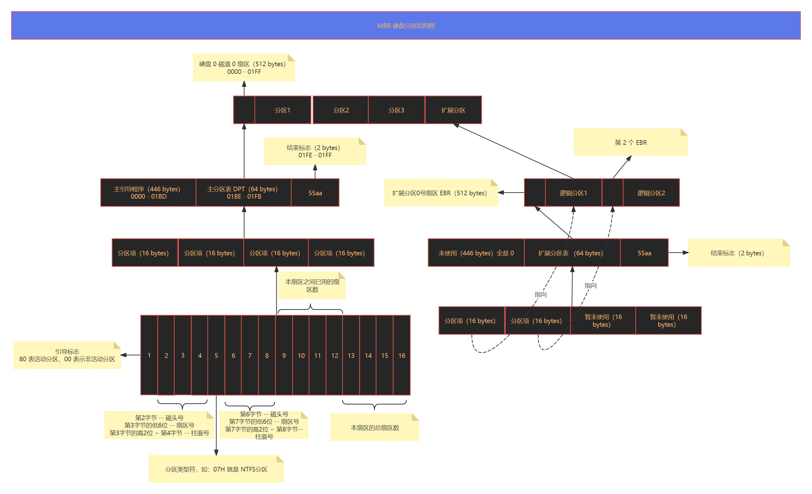

* 其中，MBR 由以下 4 个部分组成：

| 地址范围  | 功能描述                       | 备注                                           |
| --------- | ------------------------------ | ---------------------------------------------- |
| 0000-0088 | Master Boot Record，主引导程序 | 它负责从活动分区中装载，并运行系统引导程序。   |
| 0089-01BD | 出错信息数据区                 | 数据区，用于存储引导过程中可能发生的错误信息。 |
| 01BE-01CD | 分区项1（16字节）              | 分区表                                         |
| 01CE-01DD | 分区项2（16字节）              | 分区表                                         |
| 01DE-01ED | 分区项3（16字节）              | 分区表                                         |
| 01EE-01FD | 分区项4（16字节）              | 分区表                                         |
| 01FE-01FF | 55aa                           | 结束标志                                       |


* 示例：备份 MBR 分区表

```shell
dd if=/dev/sda of=/tmp/dpt.img bs=1 count=64 skip=446 # skip 表示复制 if 的时候跳过
```

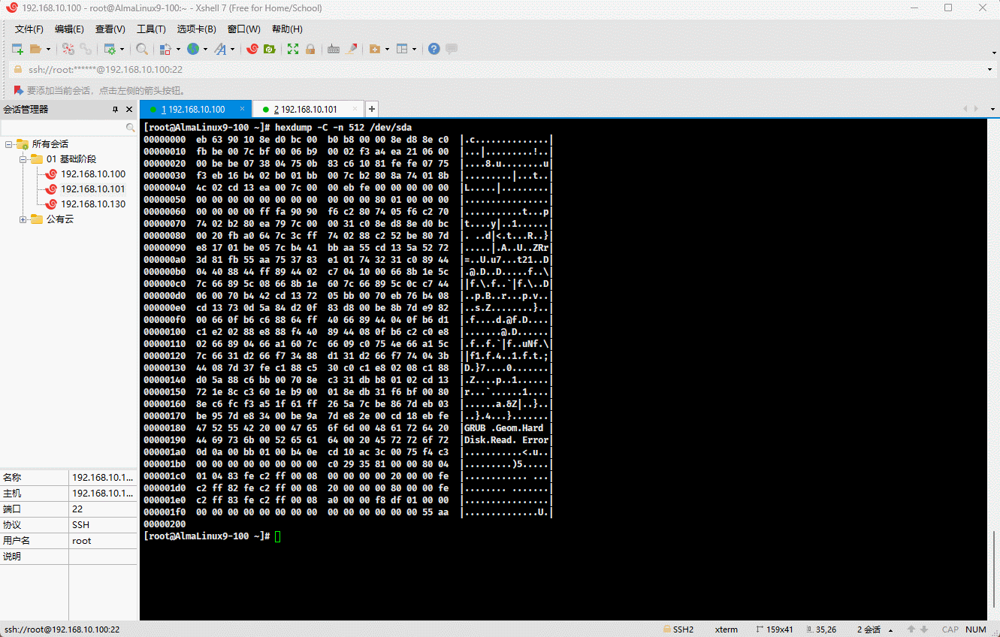


* 示例：远程发送到其它机器

```shell
scp /tmp/dpt.img root@192.168.10.101:/root
```

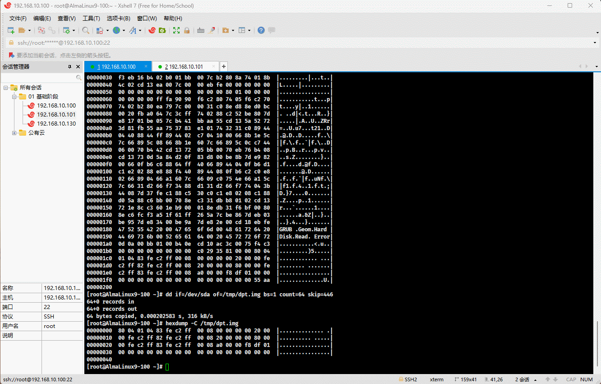


* 示例：破坏 MBR 分区表

```shell
dd if=/dev/zero of=/dev/sda bs=1 count=64 seek=446 # seek 表示复制 of 的时候跳过
```

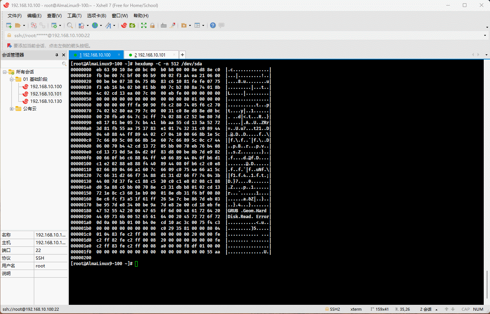


* 示例：关机，打开电源进入固件，以光盘启动，进入救援模式

```shell
shutdown -h now
```

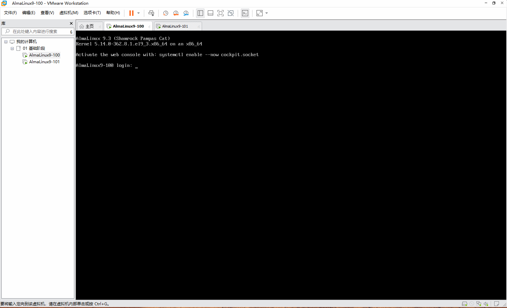


* 示例：配置网络

```shell
ip addr add 192.168.10.100/24 dev ens160 # 如果没有网络，就配置网络
```

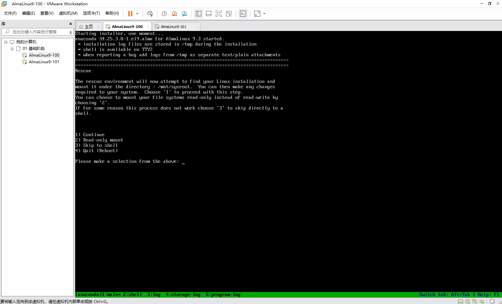


* 示例：查看 MBR 分区表

```shell
hexdump -C -n 512 /dev/sda
```

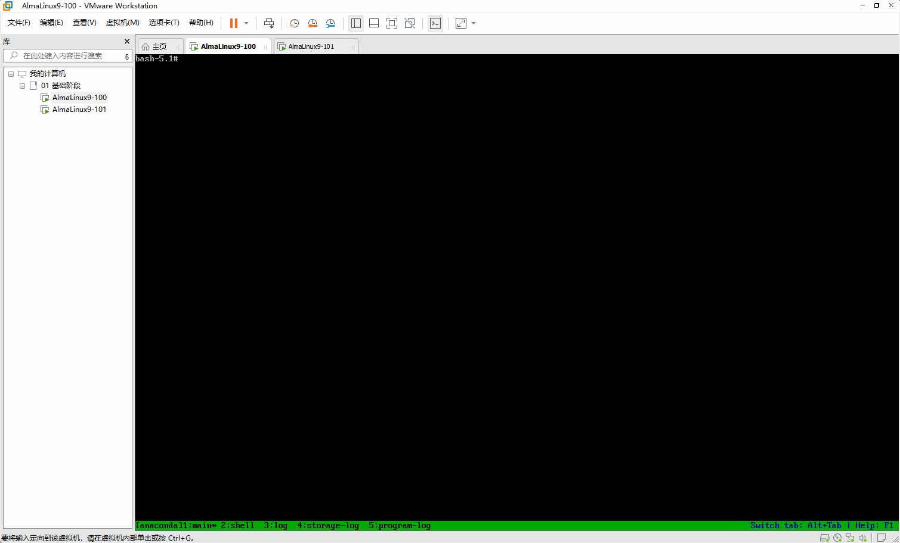


* 示例：从远程主机复制对应的文件

```shell
scp root@192.168.10.101:/root/dpt.img .
```

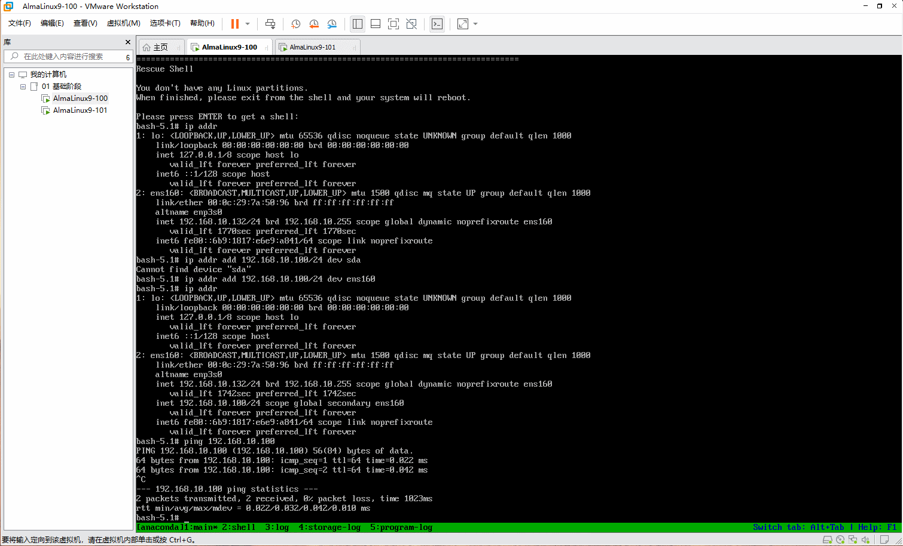


* 示例：恢复 MBR 分区表

```shell
dd if=dpt.img of=/dev/sda bs=1 seek=446
```


* 示例：再次查看 MBR 分区，看是否修复完毕

```shell
hexdump -C -n 512 /dev/sda
```


* 示例：退出光盘

```shell
exit
```

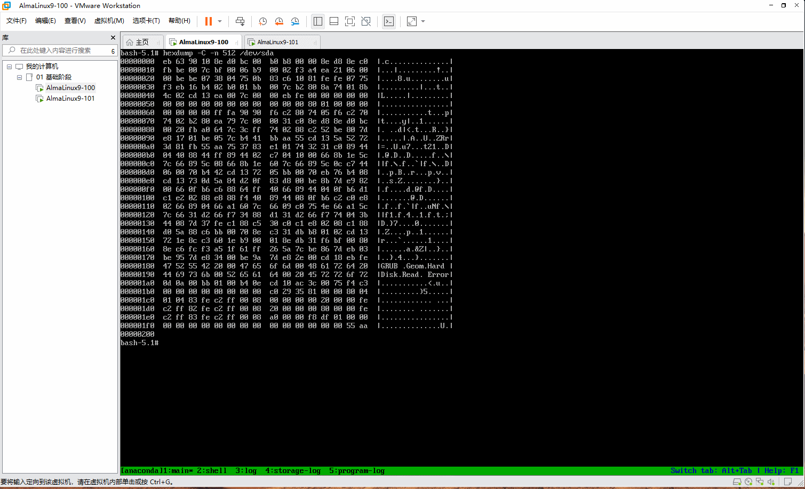


* 示例：关机，并重新设置硬盘为第一启动项

```shell
shutdown -n now
```

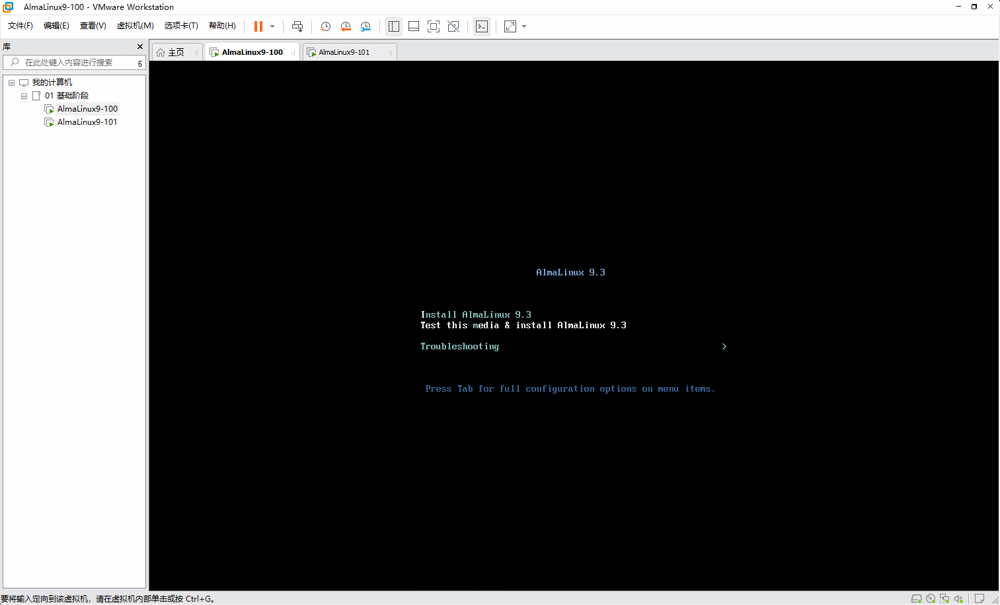

### 2.3.3 GPT 分区

* 在 MBR 硬盘中，分区信息直接存储于主引导记录（MBR）中（主引导记录中还存储着系统的引导程序）。但在 GPT 硬盘中，分区表的位置信息储存在 GPT 头中。但出于`兼容性`考虑，硬盘的第一个扇区仍然用作 MBR，之后才是 GPT 头。
* 跟现代的 MBR 一样，GPT 也使用`逻辑区块地址`（LBA）取代了早期的 `CHS` 寻址方式。传统 MB 信息存储于 LBA 0，GPT 头存储于 LBA 1，接下来才是分区表本身。
* GPT 使用 128 UUID 来表示磁盘和分区 ，GPT 分区表会自动备份在头和尾，并使用 CRC 进行校验。


* GPT 分区结构分为 4 个区域：
  * GPT 头 。
  * 分区表。 
  * GPT 分区。
  * 备份区域。

* 其中，分区表头的格式，如下所示：

| 起始字节 |  长度  |                             内容                             |
| :------: | :----: | :----------------------------------------------------------: |
|    0     | 8字节  |         签名（"EFI PART", 45 46 49 20 50 41 52 54）          |
|    8     | 4字节  |              修订（在1.0版中，值是00 00 01 00）              |
|    12    | 4字节  |  分区表头的大小（单位是字节，通常是92字节，即5C 00 00 00）   |
|    16    | 4字节  | 分区表头（第0－91字节）的[CRC32](https://zh.wikipedia.org/wiki/CRC32)校验，在计算时，把这个字段作为0处理，需要计算出分区序列的CRC32校验后再计算本字段 |
|    20    | 4字节  |                        保留，必须是0                         |
|    24    | 8字节  |                当前LBA（这个分区表头的位置）                 |
|    32    | 8字节  |               备份LBA（另一个分区表头的位置）                |
|    40    | 8字节  |      第一个可用于分区的LBA（主分区表的最后一个LBA + 1）      |
|    48    | 8字节  |     最后一个可用于分区的LBA（备份分区表的第一个LBA − 1）     |
|    56    | 16字节 | 硬盘GUID（在[类UNIX](https://zh.wikipedia.org/wiki/類UNIX)系统中也叫[UUID](https://zh.wikipedia.org/wiki/UUID)） |
|    72    | 8字节  |             分区表项的起始LBA（在主分区表中是2）             |
|    80    | 4字节  |                        分区表项的数量                        |
|    84    | 4字节  |               一个分区表项的大小（通常是128）                |
|    88    | 4字节  |                     分区序列的CRC32校验                      |
|    92    |   *    | 保留，剩余的字节必须是0（对于512字节LBA的硬盘即是420个字节） |

* 主分区表和备份分区表的头分别位于硬盘的第二个扇区（LBA 1）以及硬盘的最后一个扇区。备份分区表头中的信息是关于备份分区表的。

## 2.4 BIOS 和 UEFI

* BIOS（Basic Input/Output System）和 UEFI（Unified Extensible Firmware Interface）是计算机系统启动和硬件初始化过程中使用的两种固件接口。它们在功能和设计上有显著差异。
* BIOS 是传统的固件接口，从上世纪 80 年代起广泛使用。它主要负责在操作系统加载前对计算机硬件进行初始化和测试。

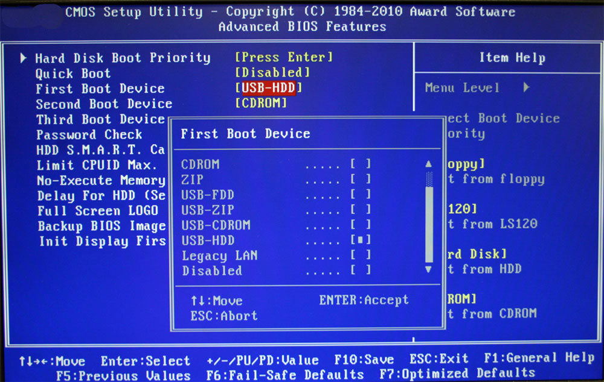

* BIOS 的主要特点包括：
  * ① **16 位模式**：BIOS 在启动过程中运行在 16 位实模式下，这限制了其能够直接访问的内存和硬件资源。
  * ② **启动过程**：BIOS 使用主引导记录（MBR）来存储分区信息和启动代码。MBR 存储在磁盘的第一个扇区，仅支持最多 4 个主分区，每个分区最大为 2 TB。
  * ③ **界面和设置**：BIOS 提供了一个简单的文本界面，用户可以通过此界面进行硬件配置和系统设置。
  * ④ **硬件支持**：BIOS 对现代硬件的支持有限，尤其是大容量硬盘和新型外围设备。

* UEFI 是现代计算机系统使用的固件接口，旨在取代传统的 BIOS，并提供更强大的功能和更灵活的配置选项。

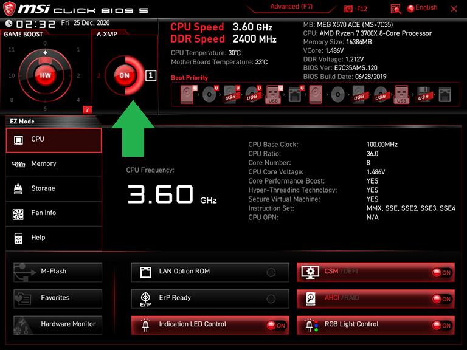

* UEFI 的主要特点包括：
  * ① **32 位和 64 位模式**：UEFI 可以在 32 位或 64 位模式下运行，支持更大的内存地址空间和更高效的硬件访问。
  * ② **启动过程**：UEFI 使用 GUID 分区表（GPT）来管理分区信息，支持的分区数量几乎没有限制，每个分区最大可达 18.8 百万 TB。
  * ③ **用户界面**：UEFI 提供了更现代的图形用户界面（GUI），使用户可以更直观地进行系统配置和管理。
  * ④ **安全启动**：UEFI 支持安全启动（Secure Boot），这是一种安全功能，可以防止未经授权的操作系统和恶意软件在启动过程中加载。
  * ⑤ **扩展性**：UEFI 设计为模块化和可扩展的，允许制造商和开发人员添加新功能和扩展现有功能。

* 传统的 BIOS 运行流程，即 MBR + BIOS ：

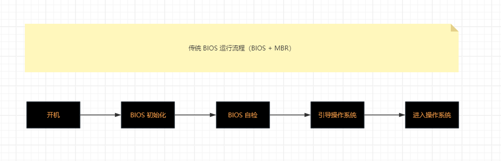

* 现代的 UEFI 运行流程，即 UEFI + GPT ：

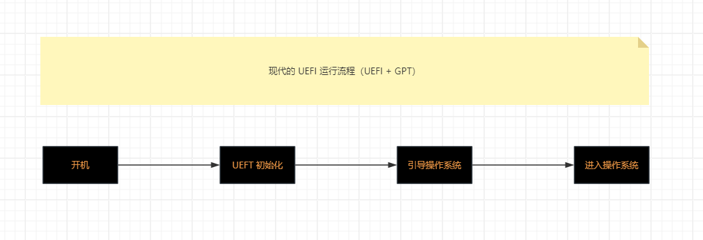

> [!NOTE]
>
> * ① BIOS 是一种传统的固件接口，已经服务于计算机系统几十年，但由于其局限性，逐渐被功能更强大、更灵活的 UEFI 所取代。
> * ② UEFI 提供了对现代硬件和大容量存储的更好支持，并且具有更高的安全性和用户友好性，是当前和未来计算机系统的主流选择，如：Win11 等强制你必须使用 UEFI 。

## 2.5 管理分区

### 2.5.1 概述（⭐）

* 显示块设备：

```shell
lsblk -f
```

* 创建分区：

```shell
fdisk # 管理 MBR 分区和 GPT 分区
```

```shell
gdisk # 管理 GPT 分区
```

```shell
parted # 高级分区操作，可以是交互或非交互方式
```

> [!NOTE]
>
> * ① `parted` 用来管理分区是实时操作，需要谨慎使用。
> * ② 在实际工作中，通常推荐使用 `fdisk` ，因为其是手动保存的，更为安全。
> * ③ 有的时候，当我们使用 `fdisk` 、`parted` 或 `gdisk` 修改分区表后，可能内核尚未更新这些更改，此时就可以使用 `partprobe` 命令来强制内核重新扫描并更新分区信息，避免重启 Linux 操作系统。

### 2.5.2 准备工作

* 准备 2 块硬盘，一块是 2 TB 的容量，一块是 4 TB 的容量，即（此处只给出创建 2 TB 容量硬盘的步骤）：

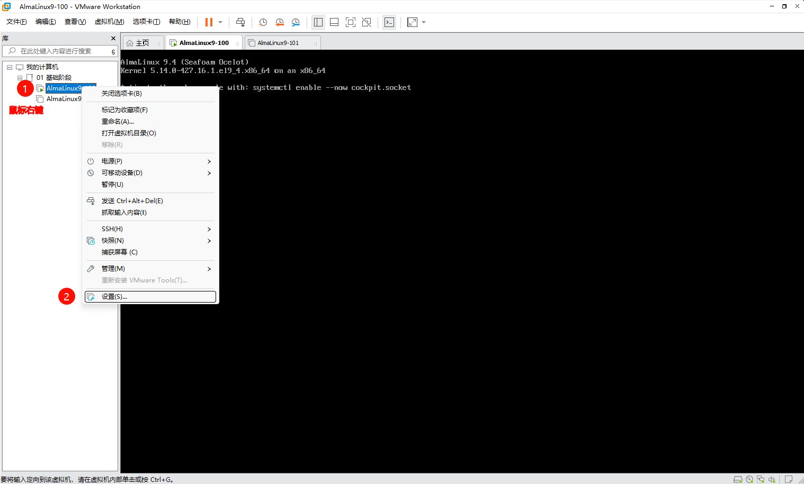

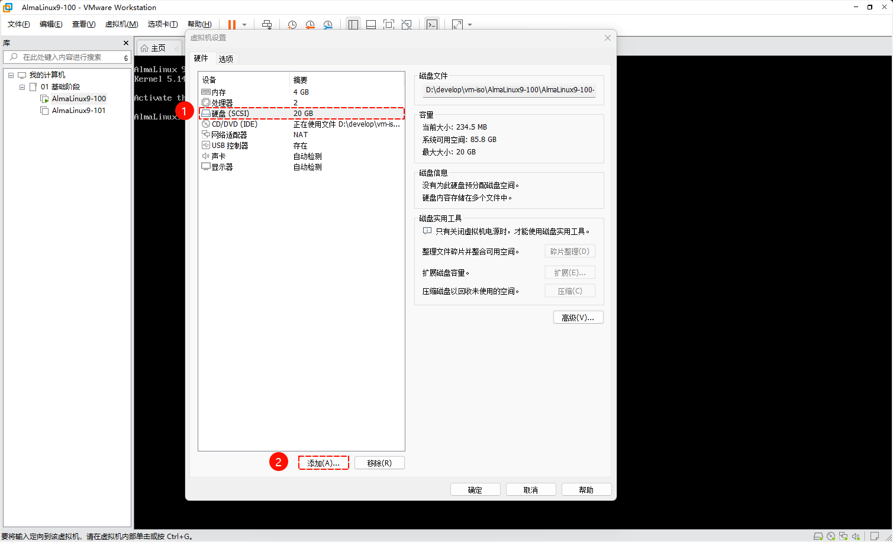

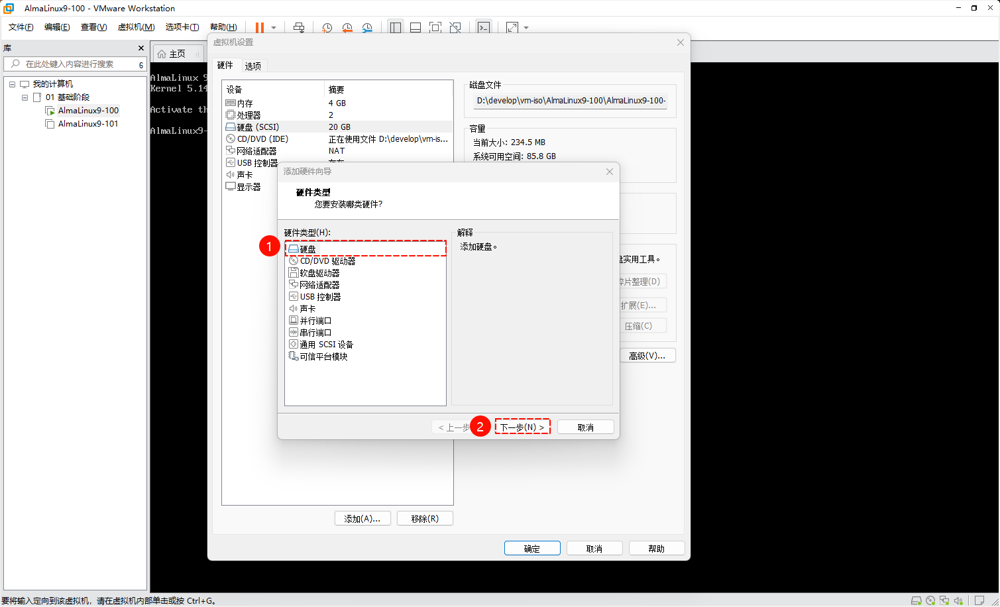

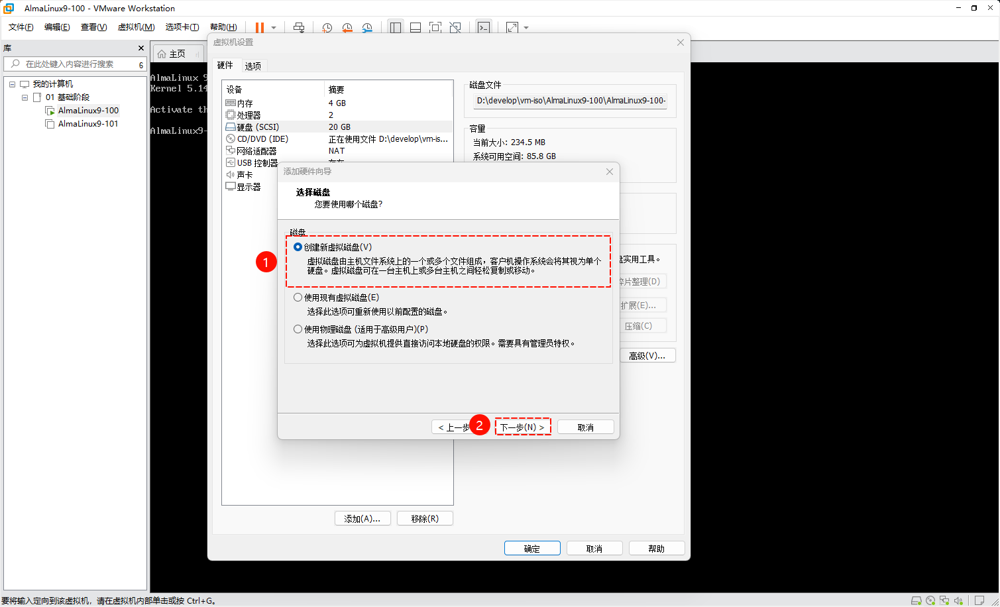

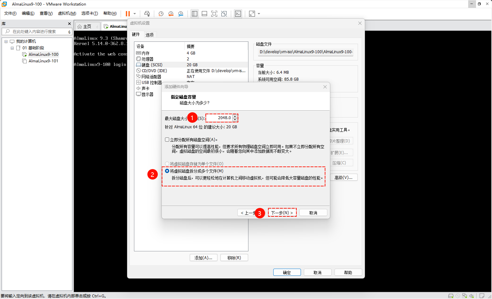

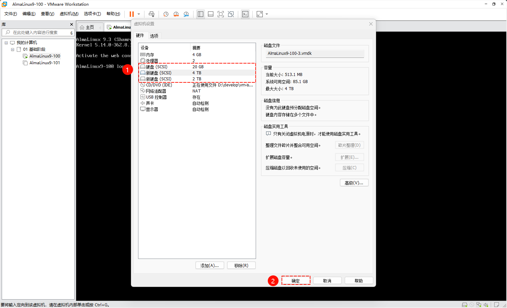

* 还需要重启下，让内核知道，我们添加了新硬盘，即：

```shell
reboot
```

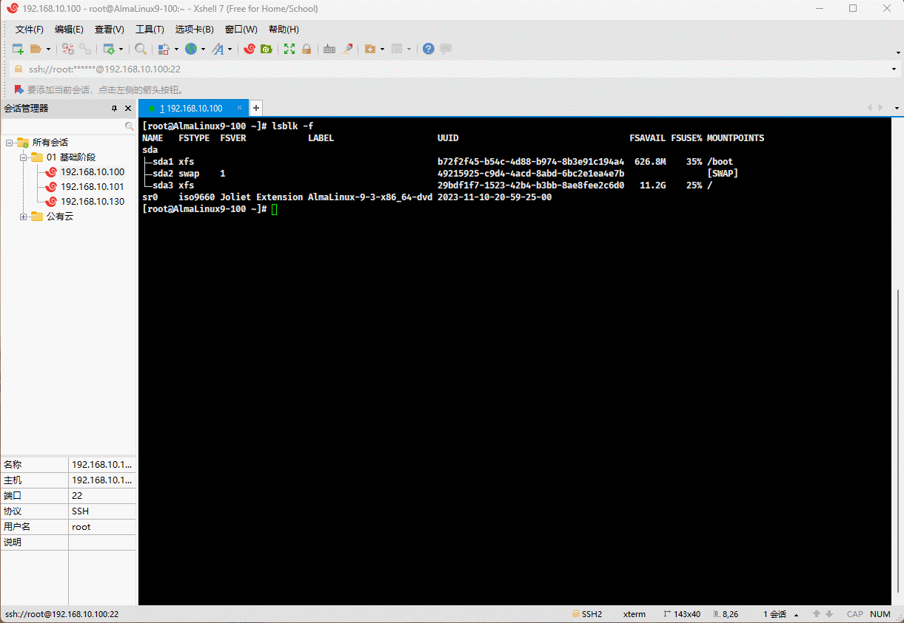

### 2.5.3 使用 parted 命令管理分区

* 格式：

```shell
parted [OPTION]... [DEVICE [COMMAND [PARAMETERS]...]...]
```

> [!NOTE]
>
> COMMAND：
>
> * mklabel LABEL-TYPE：创建分区格式，LABEL-TYPE 是 msdos 或 gpt 。
> * print：显示分区表。
> * mkpart PART-TYPE [FS-TYPE] START END：创建新分区，指定分区的开始位置和结束位置。
> * resizepart NUMBER END：调整分区的大小。
> * rm NUMBER：删除分区。

* 常用命令选项：

```shell
parted /dev/sdb mklabel gpt|msdos # 创建 gpt 分区格式或 mbr 分区格式
```

```shell
parted /dev/sdb print # 显示分区格式和分区表（分区项）
```

```shell
parted /dev/sdb mkpart primary 1 10GB （默认M）# MBR 分区格式，创建主分区
parted /dev/sdb mkpart extended 10GB 20GB （默认M）# MBR 分区格式，创建扩展分区
parted /dev/sdb mkpart logical  10GB 15GB （默认M）# MBR 分区格式，创建逻辑分区
```

```shell
parted /dev/sdb mkpart mypartition 1GB 10GB # GPT 分区格式，创建自定义名称的分区
```

```shell
parted /dev/sdb rm 1 # 删除第一个分区
```

```shell
parted -l # 显示所有硬盘分区信息
```

> [!NOTE]
>
> * ① parted 用来管理分区是实时操作，需要谨慎使用。
> * ② parted 可以是交互方式，也可以是非交互方式；通常而言，交互方式更为直观。


* 示例：显示所有块设备

```shell
lsblk -f
```

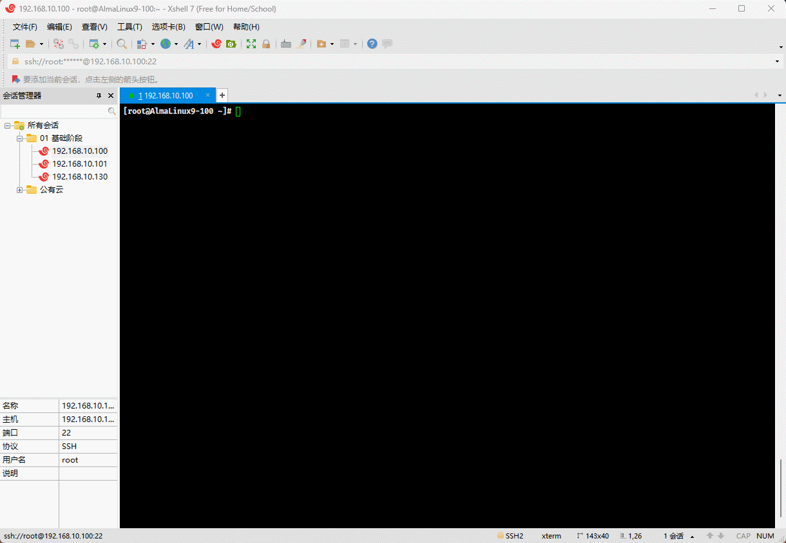


* 示例：显示所有硬盘分区信息

```shell
parted -l
```

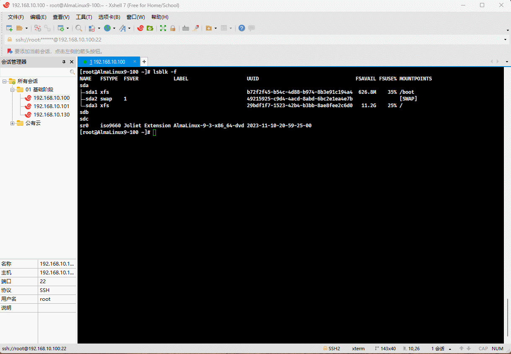


* 示例：使用交互模式，对 /dev/sdc 创建 MBR 分区表

```shell
parted /dev/sdc # 通过 help 查看帮助
```

```shell
mklabel msdos # 创建 MBR 分区格式
```

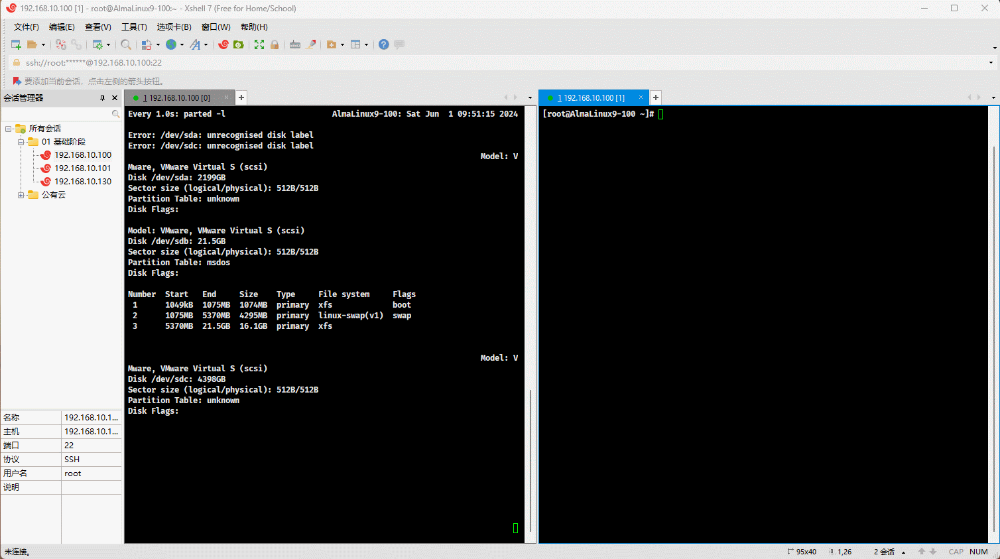


* 示例：使用交互模式，对 /dev/sdc（MBR 分区表），创建第一个主分区

```shell
mkpart # enter 就会提示，创建 primary（主分区） 还是 extend（扩展分区）
```

```shell
# 默认是 ext2 ，可以输入 ext4 和 xfs ，
# 在交互模式下提示输入文件系统类型，这个类型信息仅用于记录，并不会实际创建文件系统。
ext4
```

```shell
start  1G # 开始分区位置
```

```shell
end 10G # 结束分区位置
```

```shell
quit # 退出交互式模式
```

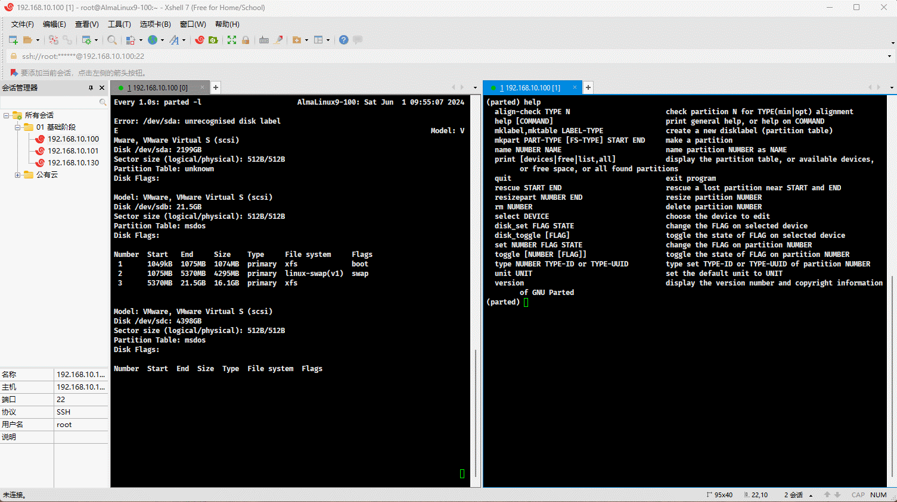

### 2.5.4 使用 fdisk 命令管理分区（⭐）

* 格式：

```shell
fdisk -l [DEVICE...] # /dev/sda /dev/sdb ，查看分区以及扇区情况
```

```shell
fdisk DEVICE # 管理 MBR 分区或 GPT 分区
```

* 子命令列表：

| 子命令                                      | 描述             |
| ------------------------------------------- | ---------------- |
| m                                           | 帮助             |
| p（print the partition table）              | 显示分区列表信息 |
| t（change a partition type）                | 更改分区类型     |
| g（create a new empty GPT partition table） | 创建 GPT 分区    |
| o（create a new empty DOS partition table） | 创建 MBR 分区    |
| n（add a new partition）                    | 创建新分区       |
| d（delete a partition）                     | 删除分区         |
| v（verify the partition table）             | 校验分区表       |
| u（change display/entry units）             | 转换单位         |
| w（write table to disk and exit）           | 保存并退出       |
| q （quit without saving changes）           | 不保存退出       |


* 示例：查看指定硬盘上的分区和扇区信息

```shell
fdisk -l /dev/sda /dev/sdb /dev/sdc
```

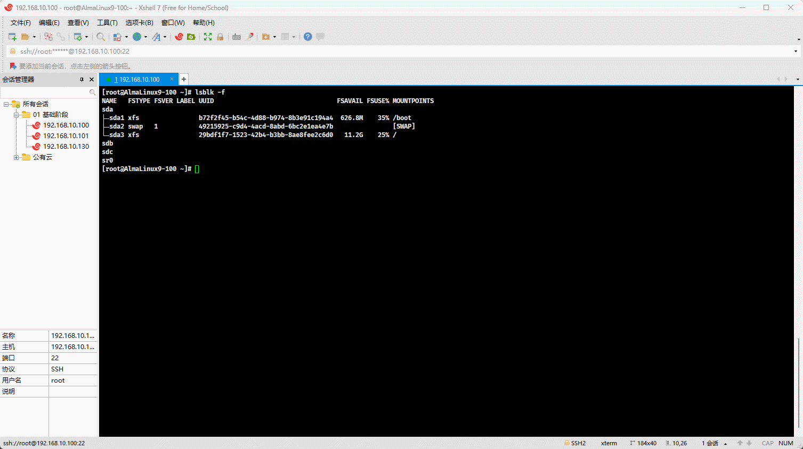


* 示例：使用 fdisk 创建 MBR 分区表

```shell
fdisk /dev/sdb # 进入交互模式，默认是 MBR 分区表
```

```shell
p # 显示分区列表信息
```


* 示例：使用 fdisk （MBR 分区表）创建分区

```shell
n
```

```shell
p # 主分区
e # 扩展分区
```

```shell
1 # 选择分区数字，即第一个分区
```

```shell
+20G # 划分 20G 的容量给 1 分区；如果没有单位 ，即 +20000 ，就是从 2048 扇区到 20000 扇区划分给 1 分区
```

```shell
w # 保存并退出
```

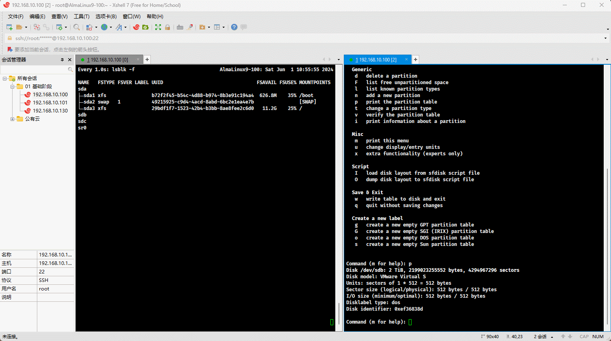


* 示例：使用 fdisk（MBR 分区表）修改分区类型

```shell
fdisk /dev/sdb
```

```shell
t
```

```shell
4 # 第四个分区
```

```shell
05 # extended 扩展分区，83 Linux 就是 primary 主分区
```

```shell
w
```

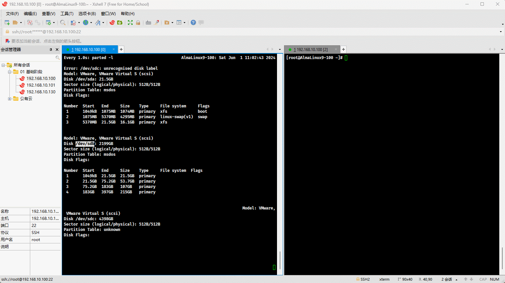


* 示例：使用 fdisk（MBR 分区表）删除分区

```shell
fdisk /dev/sdb
```

```shell
p
```

```shell
d # 删除分区
```

```shell
4 
```

```shell
w
```

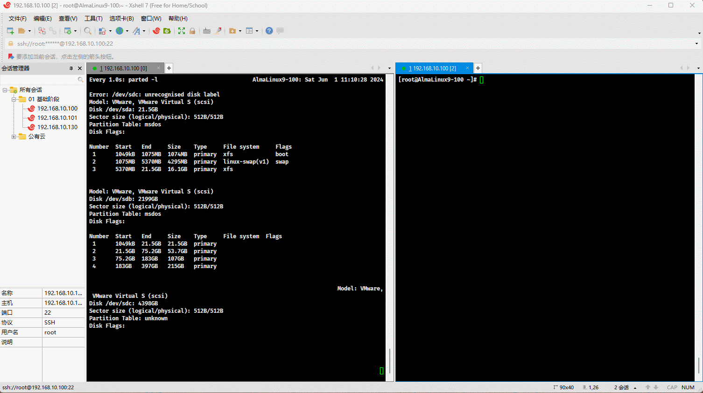


* 示例：使用 fdisk 创建 GPT 分区表，并进行分区

```shell
fdisk /dev/sdc
```

```shell
g # 默认是 MBR 分区格式，转换为 GPT 分区格式
```

```shell
1 # 第一个分区
```

```shell
+200G
```

```shell
w
```

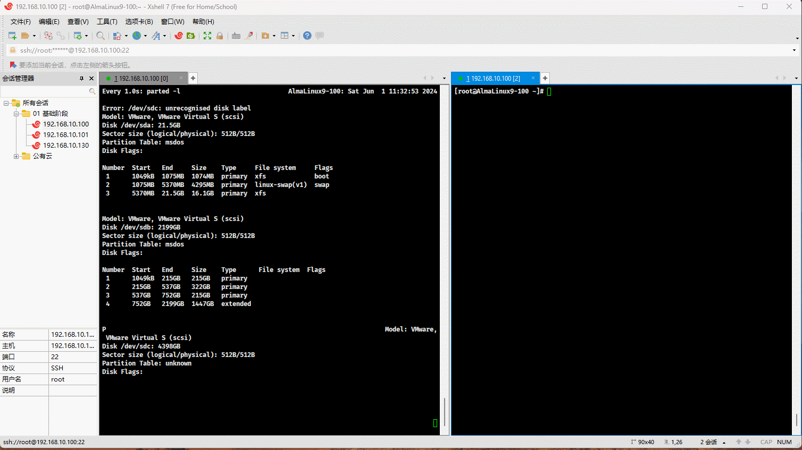

## 2.6 文件系统

### 2.6.1 概述

* 文件系统是操作系统中用于管理和组织存储设备（如：硬盘、固态硬盘、USB闪存等）上数据的一套方法和数据结构，即在存储设备上管理文件的方法。
* 如果没有文件系统，我们必须通过如下的命令，去读取磁盘中的二进制数据：

```shell
hexdump -C -n 512 /dev/sda
```

* 然后，通过对应的数据转换工具，去操作二进制数据，这既不直观，也不安全！！！
* 操作系统中`负责管理`和`存储文件信息`的`软件结构`称为文件管理系统，简称文件系统。从操作系统的角度上讲，文件系统是对文件存储设备的空间进行组织和分配，负责文件存储并对存入的文件进行保护和检索。具体地说，文件系统负责为用户建立文件，存入、读出、修改、转储文件，控制文件的 存取，安全控制，日志，压缩，加密等。

* 查看 Linux 支持的文件系统：

```shell
ll /lib/modules/`uname -r`/kernel/fs
```

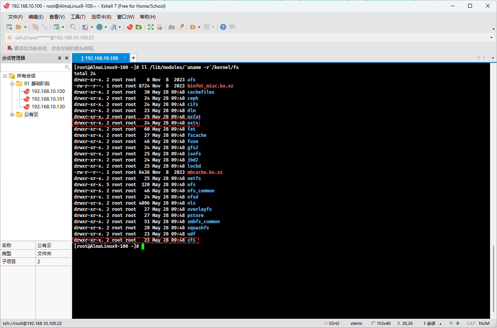

* 我们也可以通过如下的命令，查看文件系统的帮助手册：

```shell
man 5 fs
```

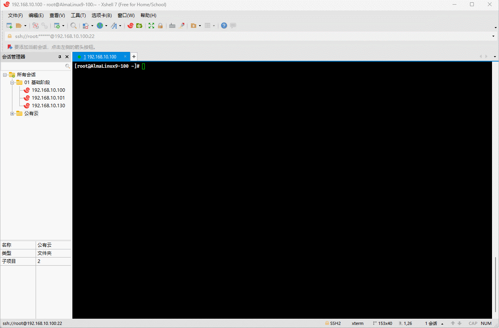

### 2.6.2 文件系统的主要作用和常见类型

* 文件系统的主要作用包括以下几个方面：
  * ① **文件存储和组织**：文件系统提供一种结构化的方式来存储文件和目录。它使用目录树结构，使得用户能够方便地对文件进行分类和组织。
  * ② **文件命名**：文件系统允许用户为文件和目录命名，并且通常支持不同类型的文件名格式和命名规则。
  * ③ **文件访问**：文件系统提供了读、写、修改和删除文件的功能。它管理文件的访问权限，确保文件安全和数据完整性。
  * ④ **存储管理**：文件系统负责管理存储设备上的空闲空间和已用空间，确保文件可以高效地存储和检索。它使用各种算法来分配和回收存储空间，以减少碎片化。
  * ⑤ **元数据管理**：文件系统存储和管理有关文件的信息（元数据），如文件大小、创建和修改时间、权限和所有者等。这些元数据有助于操作系统和用户对文件进行管理和控制。
  * ⑥ **数据恢复和容错**：某些文件系统具有内置的数据恢复和容错机制，可以在硬件故障或意外中断时保护数据，提供一定程度的容错能力和数据恢复功能。

* 常见的文件系统类型包括：
  * **FAT32** 和 **exFAT**：主要用于闪存设备和兼容性需求广泛的场合。
  * **NTFS**：Windows 操作系统的默认文件系统，支持高级功能如权限管理、压缩和加密。
  * **ext4**：Linux 系统常用的文件系统，支持日志记录和大文件。
  * **ZFS**：一种高性能、高可靠性的文件系统，支持快照和数据压缩。
  * ……

> [!WARNING]
>
> 从 `RHEL7` 之后，`RedHat` 就开始推荐使用 `ext4` 文件系统和 `xfs` 文件系统。

### 2.6.3 回顾虚拟系统

- Linux 中的文件系统繁多，为了简化开发，操作系统就提供了一个统一的接口，即在用户层和文件系统层引入了一个中间层 -- 虚拟文件系统，即：


> [!NOTE]
>
> * ① 这样带来的好处就是解耦，即操作系统定义了所有文件系统都支持的数据接口和标准接口，而文件系统的实现者去实现这些接口就可以了，屏蔽了底层细节。
> * ② 应用程序（如：ls、cat 等命令）只需要通过系统调用来调用虚拟文件系统的接口，就可以访问到磁盘上的文件；而不必关注每个文件系统的不同特性。

- 根据存储位置的不同，可以将文件系统分为三类：
  - 磁盘文件系统，直接把数据存储在磁盘中，如：ext2 、ext3、ext4、xfs 等都是这类文件系统。
  - 内存文件系统，这类文件系统的数据不是存储在硬盘的，而是占用内存空间，我们经常用到的 `/proc` 和 `/sys` 文件系统都属于这一类，读写这类文件，实际上是读写内核中相关的数据数据。
  - 网络文件系统，用来访问其他计算机数据的文件系统，如：NFS、CephFS 。

### 2.6.4 创建文件系统（格式化，⭐）

* 格式：

```shell
mkfs.FS_TYPE [-L 'LABEL'] [-b 1024|2048|4096] /dev/DEVICE
```

```shell
mkfs -t FS_TYPE [-L 'LABEL'] [-b 1024|2048|4096] /dev/DEVICE
```

* 常用选项：
  * `-t FS_TYPE`：设置文件类型，有 ext4、xfs、vfat 等，可以通过 `cat /proc/filesystems` 查看文件系统类型。
  * `-L 'LABEL'`：设置卷标，通常用来设置未来要挂载的目录。
  * `-b 1024|2048|4096`：设置 block 块的大小。

> [!NOTE]
>
> 在使用 `mkfs` 等命名创建文件系统的时候，会生成一个唯一的 UUID ，其作用如下：
>
> * ① **文件系统标识**：UUID 是一个唯一的标识符，它可以用来唯一地标识一个文件系统。这在多个文件系统并存的情况下尤其有用。通过 UUID，可以确保每个文件系统都有一个独特的标识，从而避免混淆。
> * ② **挂载点识别**：在 `/etc/fstab` 文件中，可以使用文件系统的 UUID 来指定挂载点。这比使用设备名称（如 `/dev/sda1`）更可靠，因为设备名称可能会因为硬件变化或重新排列而改变，而 UUID 始终不变。
> * ③ **设备稳定性**：在系统启动时或热插拔设备时，设备名称可能会发生变化，而 UUID 始终与文件系统绑定，确保系统能正确地识别和挂载文件系统。
> * ④ **文件系统管理**：在某些文件系统管理工具和操作中（如 `blkid`、`lsblk` 等），可以通过 UUID 来识别和操作文件系统。这有助于管理员在进行维护和管理时快速准确地定位文件系统。


* 示例：创建 ext4 文件系统

```shell
mkfs.ext4 /dev/sdb1
```

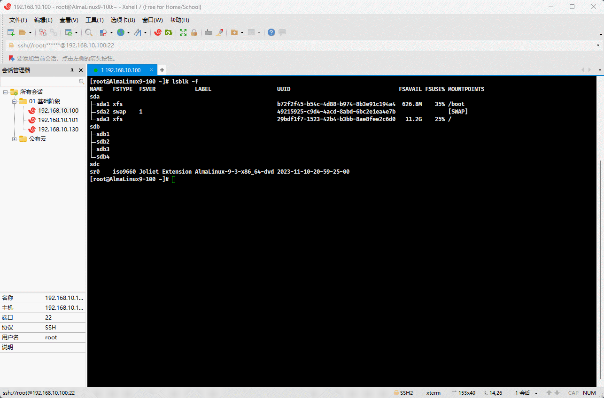


* 示例：创建 xfs 文件系统

```shell
mkfs.xfs /dev/sdb2
```


* 示例：创建 xfs 文件系统，并设置 label 信息

```shell
mkfs.xfs -L '/mnt/sdb3' /dev/sdb3
```


### 2.6.5 查看和管理分区信息

#### 2.6.5.1 查看块设备属性信息（⭐）

* 格式：

```shell
blkid [-U|--uuid <uuid>] [-L|--label <label>] [/dev/DEVICE]
```

* 对应的英文：block id，即用于显示或查看块设备（如：硬盘分区）的属性和 UUID。
* 常用的选项：
  * `-U|--uuid <uuid>`：根据指定的 UUID 来查找对应的设备。
  * `-L|--label <label>`：根据指定的 Label 来查找对应的设备。


* 示例：查看块设备的属性信息

```shell
blkid /dev/sdb1
```

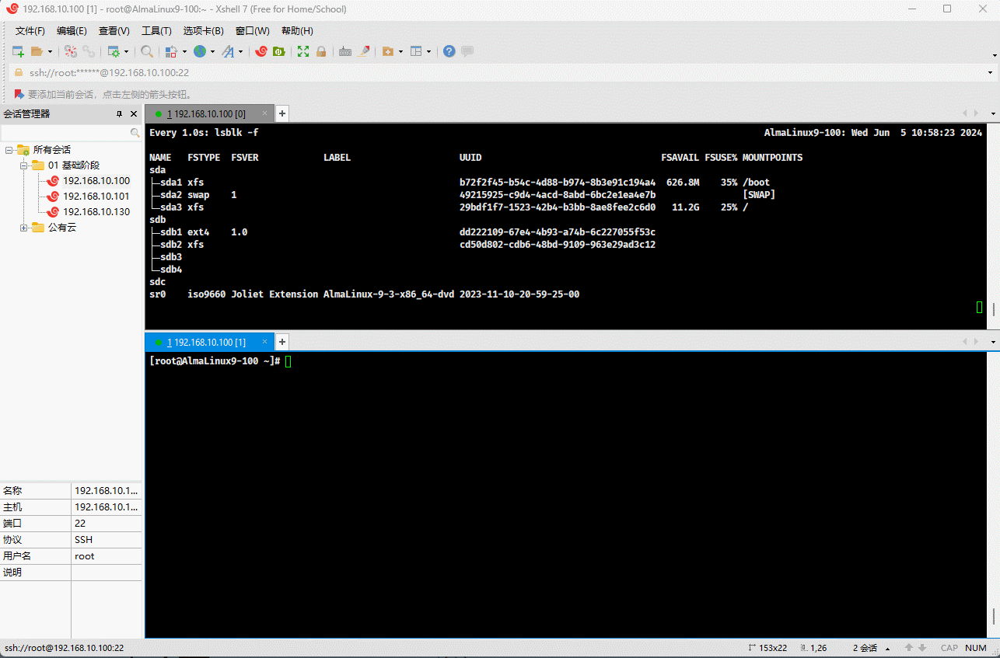


* 示例：根据指定的 UUID 来查找对应的设备

```shell
blkid -U cd50d802-cdb6-48bd-9109-963e29ad3c12
```

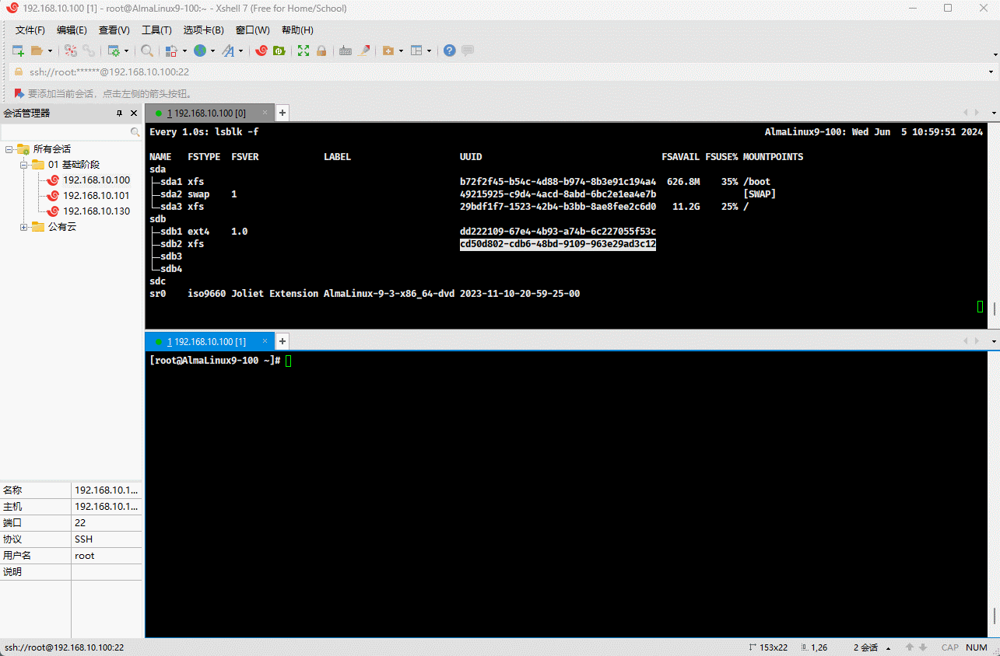


* 示例：根据指定的 LABEL 来查找对应的设备

```shell
blkid -L /mnt/sdb3
```


#### 2.6.5.2 管理 ext 文件系统的 LABEL

* 格式：

```shell
e2label /dev/DEVICE [label]
```

* 功能：改变 ext 文件系统的 LABEL 信息。

> [!NOTE]
>
> 如果没有传递 label 信息，默认就是显示指定设备的 ext 文件系统的 LABEL 信息。


* 示例：改变 ext 文件系统的 LABEL 信息

```shell
e2label /dev/sdb1 "/mnt/sdb1"
```

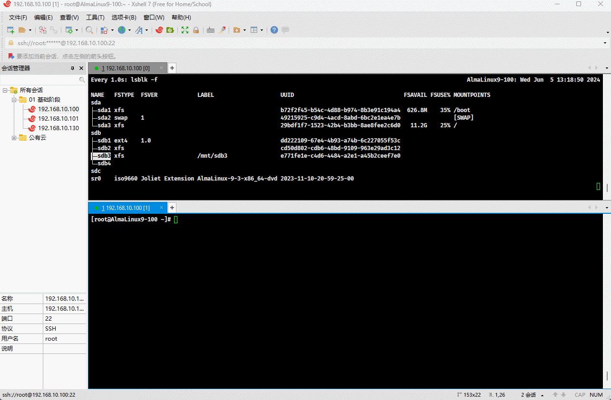


* 示例：查询 ext 文件系统的 LABEL 信息

```shell
e2label /dev/sdb1
```


#### 2.6.5.3 查找分区

* 格式：

```shell
findfs [LABEL=value] 
```

```shell
findfs [UUID=value]
```

* 功能：根据 LABEL 或 UUID 查询文件系统对应的设备路径，即分区。


* 示例：根据 LABEL 查询文件系统对应的设备路径，即分区

```shell
findfs LABEL="/mnt/sdb1"
```

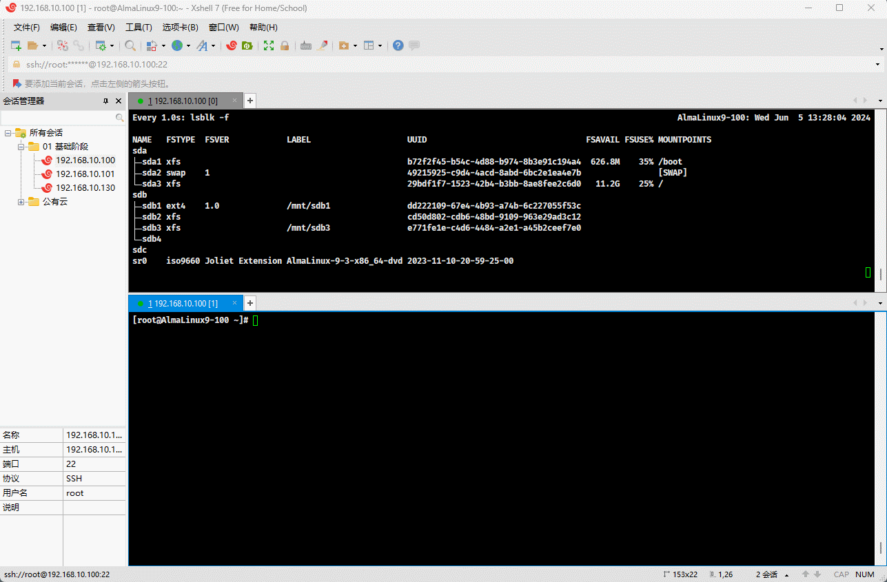


* 示例：根据 UUID 查询文件系统对应的设备路径，即分区

```shell
findfs UUID="e771fe1e-c4d6-4484-a2e1-a45b2ceef7e0"
```

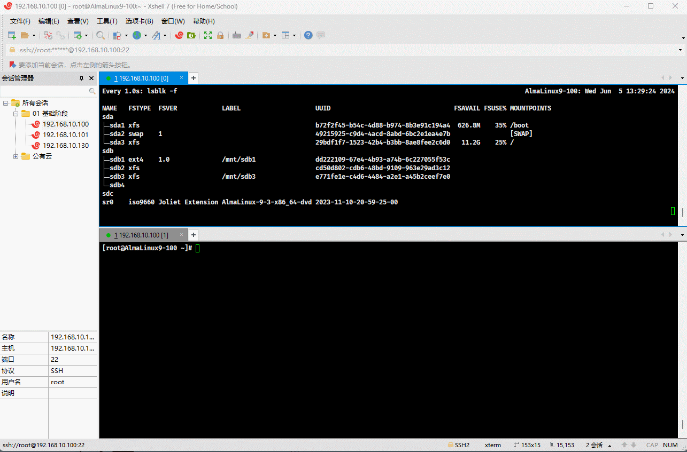

#### 2.6.5.4 ext4 文件系统的底层细节

* ext4 文件系统的底层，如下所示：

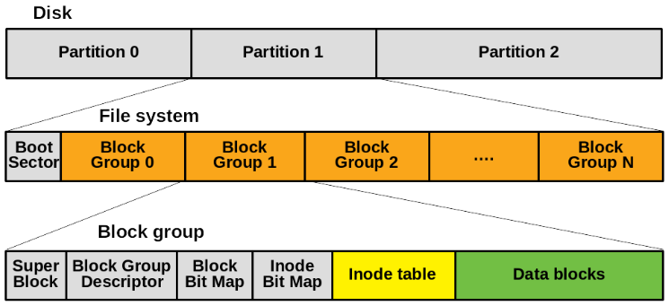

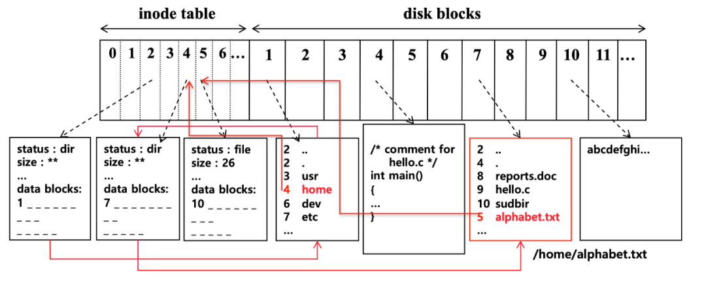

* ext4 文件系统的磁盘布局，由以下几个主要部分组成：
  * **引导扇区（Boot Sector）**：第一个扇区，包含启动加载程序（如果存在）。
  * **超级块（Superblock）**：超级块是每个文件系统的核心，它保存了文件系统的配置和状态信息，如：块大小、文件系统的总块数、已使用块数等。
  * **组描述符表（Block  Group Descriptor）**：包含了所有块组的描述符，每个描述符存储了块组的起始地址、块位图的地址、inode 位图的地址、inode 表的起始地址等。
  * **块组（Block Groups）**：文件系统被划分为多个块组，每个块组包含以下几个部分：
    - **块位图（Block Bitmap）**：这是一个位图，表示数据块的使用情况。每个位对应一个数据块，0 表示未使用，1 表示已使用。
    - **inode 位图（Inode Bitmap）**：类似于块位图，表示 inode 的使用情况。
    - **inode 表（Inode Table）**：inode 是文件系统中的核心数据结构，每个 inode 记录了一个文件或目录的元数据（如权限、所有者、大小、指向数据块的指针等）。
    - **数据块（Data Blocks）**：数据块是存储实际数据的地方，文件的数据和目录的内容都存储在这里。

* 数据读取的流程，如下所示：
  * ① 查找超级块 -> 获取组描述符表。
  * ② 从组描述符表找到对应的块组。
  * ③ 从 inode 位图中查找 inode 表的入口。
  * ④ 从 inode 表中读取文件的 inode 信息。
  * ⑤ 通过 inode 中的指针找到文件数据所在的数据块。
  * ⑥ 从数据块中读取文件数据。

#### 2.6.5.5 调整 ext 文件系统的可调参数

* 格式：

```shell
tune2fs [-l] [-L LABEL] /dev/DEVICE
```

* 常用选项：
  * -l：显示文件系统的超级块信息（超级块包含文件系统的元数据信息，如：文件系统大小、空闲块数、挂载次数等）。
  * -L LABEL：修改标签。


* 示例：查看 ext4 的超级块

```shell
tune2fs -l /dev/sdb1
```


* 示例：查看 ext4 文件系统的标签

```shell
tune2fs -L "/mnt/sdb1-m" /dev/sdb1
```


#### 2.6.5.6 查看 ext 文件系统的信息

* 格式：

```shell
dumpe2fs [-h] /dev/DEVICE
```

* 功能：显示超级块和磁盘块分组信息。

> [!NOTE]
>
> 如果加上 `-h` ，则只显示超级块信息。


* 示例：显示超级块和磁盘块分组信息

```shell
dumpe2fs /dev/sdb1
```


* 示例：只显示超级块信息

```shell
dumpe2fs -h /dev/sdb1
```


#### 2.6.5.7 查看 xfs 的信息

* 格式：

```shell
xfs_info /dev/DEVICE
```


* 示例：显示 xfs 文件系统的信息

```shell
xfs_info /dev/sdb2
```


### 2.6.6 文件系统的检测和修复

#### 2.6.6.1 概述

* 文件系统出现故障通常发生于死机或非正常关机之后，挂载的文件文件标记为 "no clean" 。

> [!WARNING]
>
> * ① 不要在挂载状态下，进行文件系统的修复，请先使用 `umount` 命令卸载文件系统！！！
> * ② 实际工作中，通常会使用 RAID 或 LVM 技术，来实现数据的备份和恢复，防止出现单块硬盘上的分区或文件系统损坏而造成数据丢失！！！

#### 2.6.6.2 文件系统检测和修复

* fsck 命令：

```shell
fsck.FS_TYPE [-p][-y][-f] /dev/DEVICE # FS_TYPE 需要和分区上的文件系统类型相同
```

```shell
fsck -t FS_TYPE [-p][-y][-f] /dev/DEVICE # FS_TYPE 需要和分区上的文件系统类型相同
```

> [!NOTE]
>
> 常用选项：
>
> * -p：自动进行安全的修复文件系统问题。
> * -y：自动应答为 yes。
> * -f：强制修复。

* e2fsck 命令（ext 系列文件专用的检测修复工具）：

```shell
e2fsck [-p][-y][-f][-n] /dev/DEVICE
```

> [!NOTE]
>
> 常用选项：
>
> * -n：只检查。
> * -p：自动进行安全的修复文件系统问题。
>
> * -y：自动应答为 yes。
>
> * -f：强制修复。

* xfs_repair 命令（xfs文件系统专用检测修复工具）：

```shell
xfs_repair [-d][-n][-f] /dev/DEVICE
```

> [!NOTE]
>
> 常用选项：
>
> * -f：修复文件而不是块设备。
>
> * -n：只检查。
>
> * -d：允许修复只读的挂载设备，在单用户下修复 `/` 时使用，然后立即 reboot 。


* 示例：将 ext4 文件系统挂载到某个目录，并复制文件到其中

```shell
mount /dev/sdb1 /mnt
```

```shell
cp /etc/fstab /mnt
```

```shell
ll /mnt
```


 

* 示例：破坏 ext4 文件系统，并查看文件是否损坏

```shell
dd if=/dev/zero of=/dev/sdb1 bs=1M count=1
```

```shell
ll /mnt
```


* 示例：查询 ext4 文件系统的超级块信息

```shell
tune2fs -l /dev/sdb1
```

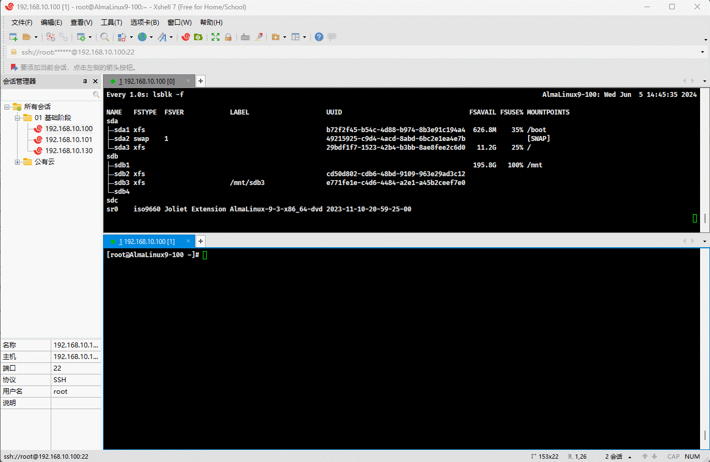


* 示例：卸载文件系统

```shell
umount /dev/sdb1
```


* 示例：检测文件系统

```shell
e2fsck -n /dev/sdb1
```


* 示例：修复文件系统

```shell
e2fsck -y /dev/sdb1
```


* 示例：查询 ext4 文件系统的超级块信息

```shell
tune2fs -l /dev/sdb1
```


* 示例：挂载，并查看文件是否恢复成功

```shell
mount /dev/sdb1 /mnt
```

```shell
ll /mnt
```


## 2.7 挂载（⭐）

### 2.7.1 概述

* 挂载：就是将额外的文件系统和根文件系统某个现存的目录建立关联关系，进而使得此目录可以作为其他文件访问的入口的行为。
* 卸载：解除这种关联关系的行文。

> [!NOTE]
>
> * ① 将设备（文件系统）关联到某个目录，该目录被称为挂载点（mount point），挂载点下原有文件在挂载完成后会被临时隐藏，因此，挂载点目录一般为空。
> * ② 进程正在使用中的设备无法被卸载。

### 2.7.2 挂载

* 格式：

```shell
mount [-rvwa] [-o options] device mountpoint
```

* 其中，device 指的是要挂载的设备，有如下的四种形式：

| 挂载设备的形式     | 样例                                      |
| ------------------ | ----------------------------------------- |
| 设备文件           | /dev/sdb1                                 |
| 卷标（-L 'LABEL'） | -L '/mnt/sdb1'                            |
| UUID（-U 'UUID'）  | -U 'e771fe1e-c4d6-4484-a2e1-a45b2ceef7e0' |
| 伪文件系统名称     | proc、sysfs、devtmpfs、tmpfs              |

* 其中，mountpoint 是挂载点，必须事前存在，建议使用空目录。
* 常用选项：

```shell
-r, --read-only # 只读挂载，类似于 -o ro
```

```shell
-w, --rw, --read-write # 读写挂载，默认
```

```shell
-a, --all # 将 /etc/fstab 文件中所列出的挂载信息加载进内存
```

```shell
-L 'LABEL' # 以卷标指定挂载设备
-U 'UUID' # 以 UUID 指定要挂载的设备
-B, --bind # 绑定目录到另一个目录上
```

```shell
-o options：# (挂载文件系统的选项)，多个选项使用逗号分隔
   async   # 异步模式,内存更改时,写入缓存区buffer,过一段时间再写到磁盘中，效率高，但不安全
   sync   # 同步模式,内存更改时，同时写磁盘，安全，但效率低下
   atime/noatime # 启用或关闭（目录和文件的访问时间）
   diratime/nodiratime # 启用或关闭（目录的访问时间）
   auto/noauto # 是否支持开机自动挂载，是否支持 -a 选项
   exec/noexec # 是否允许文件系统上执行二进制文件
   dev/nodev # 是否支持在此文件系统上使用设备文件
   suid/nosuid # 是否支持 suid 和 sgid 权限
   remount # 重新挂载
   ro/rw # 只读、读写
   user/nouser # 是否允许普通用户挂载此设备，/etc/fstab使用
   acl/noacl # 启用此文件系统上的 acl 功能
   loop # 使用 loop 设备
   _netdev # 当网络可用时才对网络资源进行挂载，如：NFS 文件系统
   defaults # 相当于 rw, suid, dev, exec, auto, nouser, async
```

> [!IMPORTANT]
>
> 挂载规则：
>
> * ① 一个挂载点同一时间只能挂载一个设备
> * ② 一个挂载点同一时间挂载了多个设备，只能看到最后一个设备的数据，其它设备上的数据将被隐藏。
> * ③ 一个设备可以同时挂载到多个挂载点。
> * ④ 通常挂载点一般是已存在空的目录。


* 示例：挂载（临时挂载，一旦重启，挂载关系将会失效，也称为手动挂载）

```shell
mkdir -pv /mnt/sdb1-m
```

```shell
mount /dev/sdb1 /mnt/sdb1-m
```

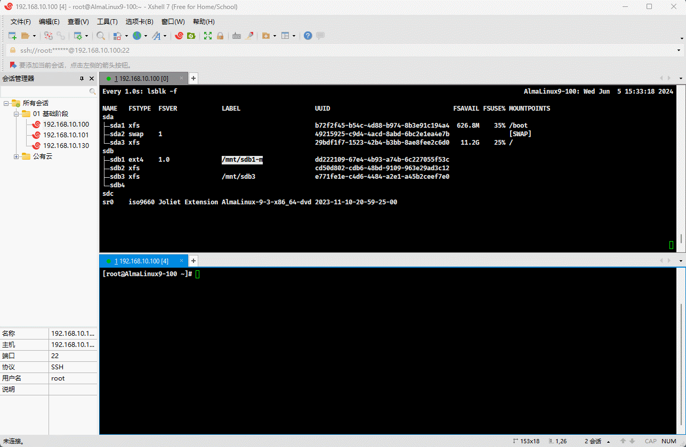

### 2.7.3 卸载

* 格式：

```shell
umount /dev/DEVICE|mountpoint
```


* 示例：使用设备名卸载

```shell
umount /dev/sdb1
```

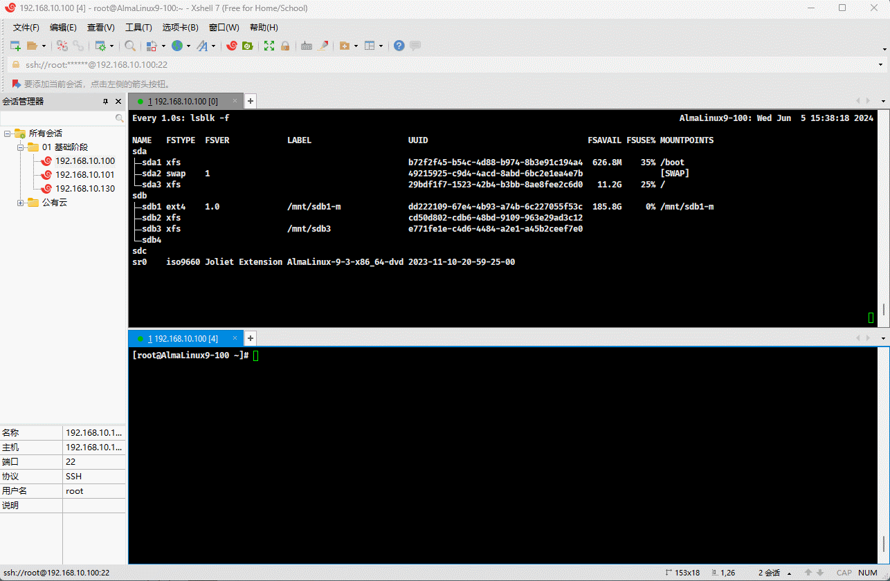


* 示例：使用挂载点卸载

```shell
umount /mnt/sdb1-m
```


### 2.7.4 查看挂载信息

* 格式：

```shell
mount # 通过查看 /etc/mtab 文件显示当前已挂载的所有设备
```

> [!NOTE]
>
> * ① `/etc/mtab` 是一个在 Linux 系统中用于记录当前挂载文件系统的文件。它包含了系统当前挂载的所有文件系统的信息，包括挂载点、文件系统类型和挂载选项。
> * ② `/etc/mtab` 通常由系统自动生成和更新，不需要手动编辑。系统会在每次挂载或卸载文件系统时更新该文件。

* 格式：

```shell
cat /proc/mounts  # 查看内核追踪到的已挂载的所有设备
```

> [!NOTE]
>
> * ① 现代 Linux 系统中，`/proc/mounts` 文件提供了与 `/etc/mtab` 类似的信息，并且总是最新的，因为它直接从内核获取数据。
> * ② 由于 `/etc/mtab` 可能会因为某些原因不准确，因此有时建议查看 `/proc/mounts` 以获取当前系统的挂载信息。


* 示例：查看挂载信息

```shell
mount
```

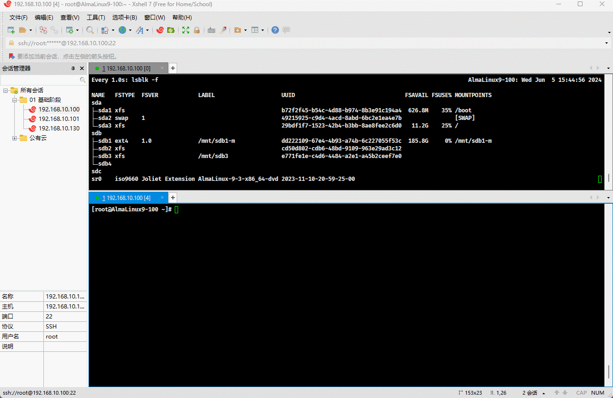


* 示例：查看挂载信息

```shell
cat /proc/mounts
```

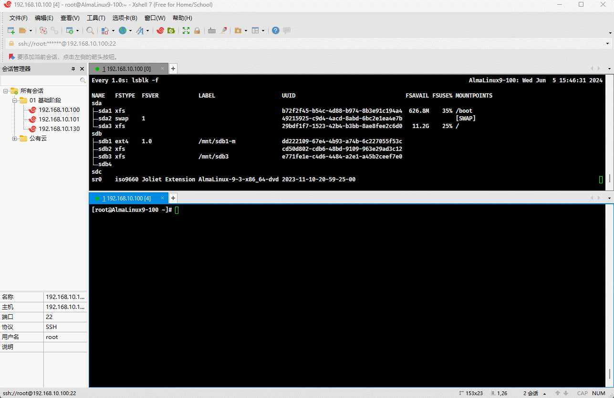

### 2.7.5 查看挂载点情况

* 格式：

```shell
findmnt /dev/DEVICE|mountpoint
```


* 示例：

```shell
findmnt /dev/sdb1
```

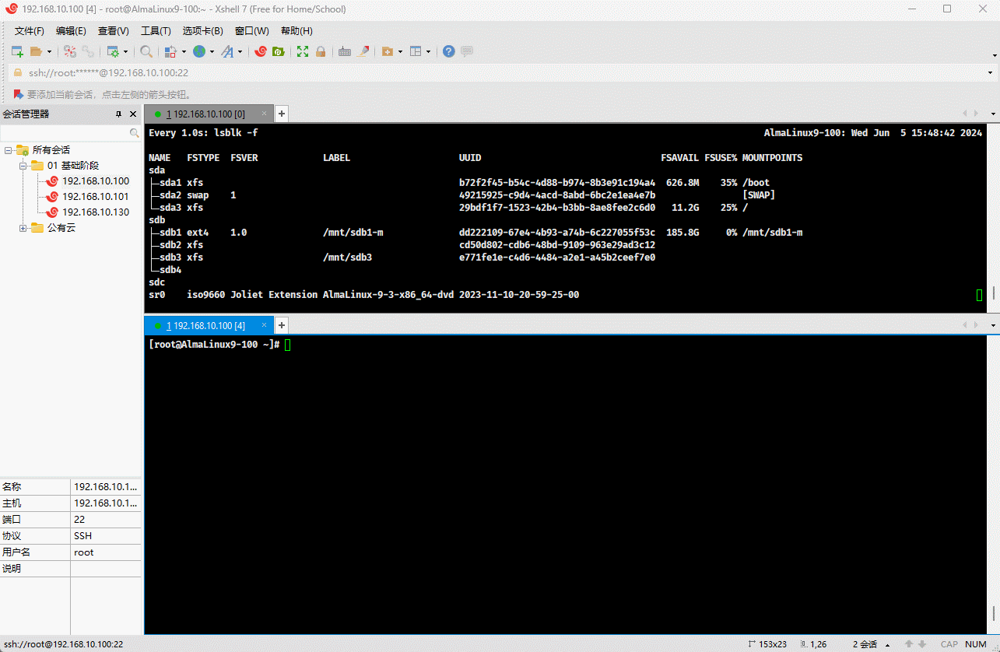

### 2.7.6 查看正在访问指定文件系统的进程并终止

* 查看正在访问指定文件系统的进程：

```shell
lsof mount_point|文件
```

```shell
fuser -v mount_point|文件
```

* 终止所有在正访问指定的文件系统的进程：

```shell
fuser -km mount_point # -k,--kill 杀死，-m,--mount 挂载
```

> [!WARNING]
>
> 卸载之前，必须保证没有任何进程访问该文件系统中的文件。


* 示例：使用另外一种用户进入挂载点，并访问文件系统中的数据

```shell
su - x
```

```shell
cd /mnt/sdb1-m/
```

```shell
tail -f /mnt/sdb1-m/fstab
```

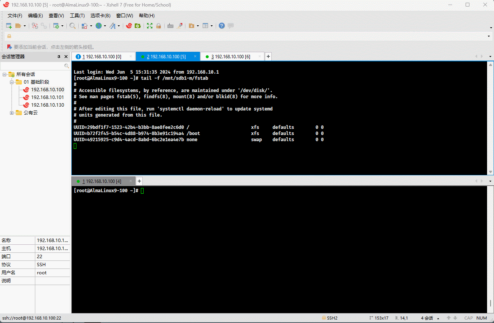


* 示例：查看正在访问指定文件系统的进程

```shell
fuser -v /mnt/sdb1
```

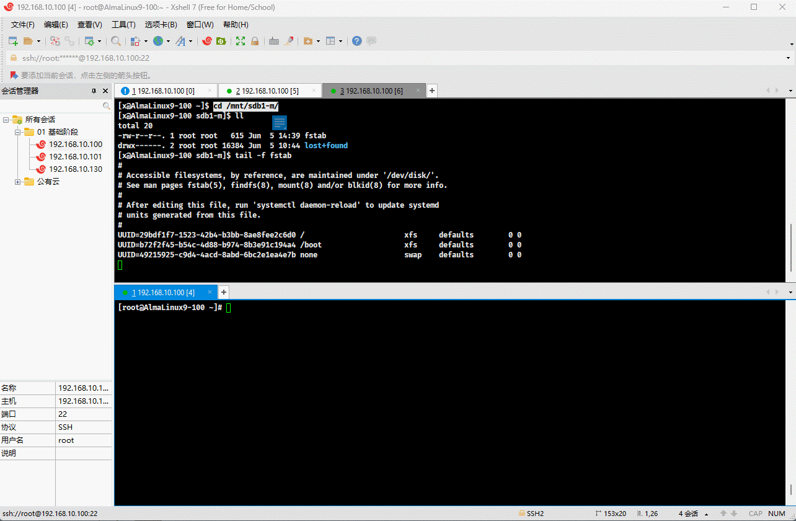


* 示例：终止所有在正访问指定的文件系统的进程

```shell
fuser -km /mnt/sdb1
```

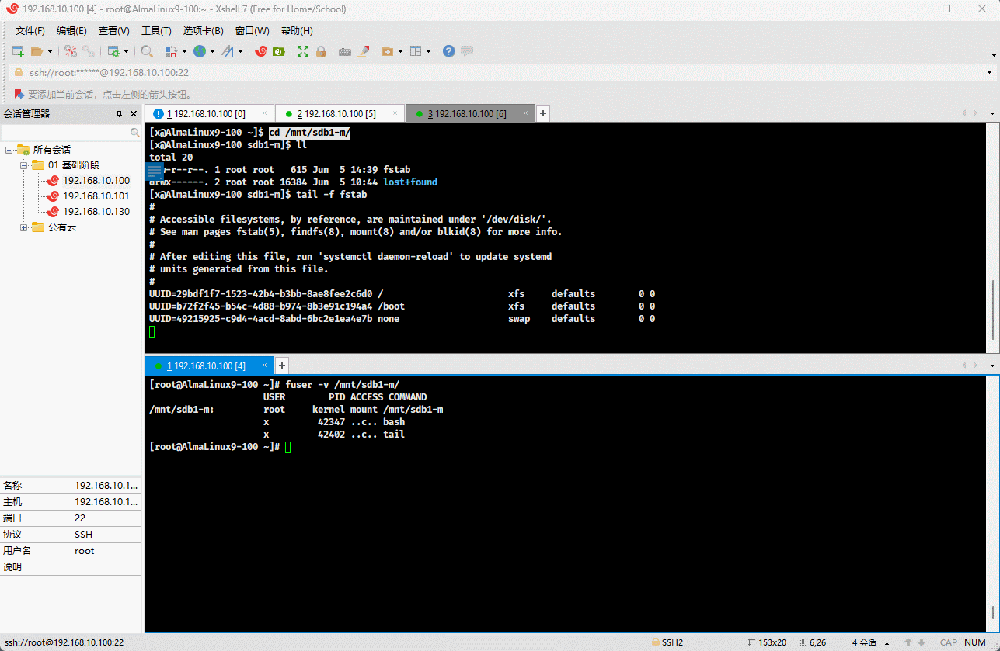

### 2.7.7 永久挂载

* 之前，通过 mount 都是手动挂载的方式，一旦系统重启，挂载关联关系将会失败；如果需要永久挂载，就需要将挂载关联关系保存到磁盘上的配置文件中，即 `/etc/fstab` 文件。

> [!NOTE]
>
> 可以通过 `man 5 fstab`  命令查看 fstab 配置文件的格式。


* 示例：永久挂载

```shell
vim /etc/fstab
```

```shell
:r!blkid /dev/sdb1 

UUID=dd222109-67e4-4b93-a74b-6c227055f53c /mnt                   ext4    defaults        0 0
```

```shell
systemctl daemon-reload
```

```shell
# 自动挂载所有支持自动挂载的设备(定义在了 /etc/fstab 文件中，且挂载选项中有 auto 功能)
mount -a 
```


### 2.7.8 挂载文件（将文件作为设备使用）

* mount 也支持将一个文件作为 loop 设备，挂载到指定的目录中，作为文件系统来使用。

> [!NOTE]
>
> 其步骤如下：
>
> * ① 创建一个空文件。
> * ② 在这个文件上创建文件系统。
> * ③ 创建挂载点，即空目录。
> * ④ 将文件系统镜像挂载到挂载点。


* 示例：创建一个空文件

```shell
dd if=/dev/zero of=$HOME/data.img bs=1M count=1024
```


* 示例：将文件作为一个设备文件，在上面创建文件系统

```shell
mkfs.ext4 $HOME/data.img
```

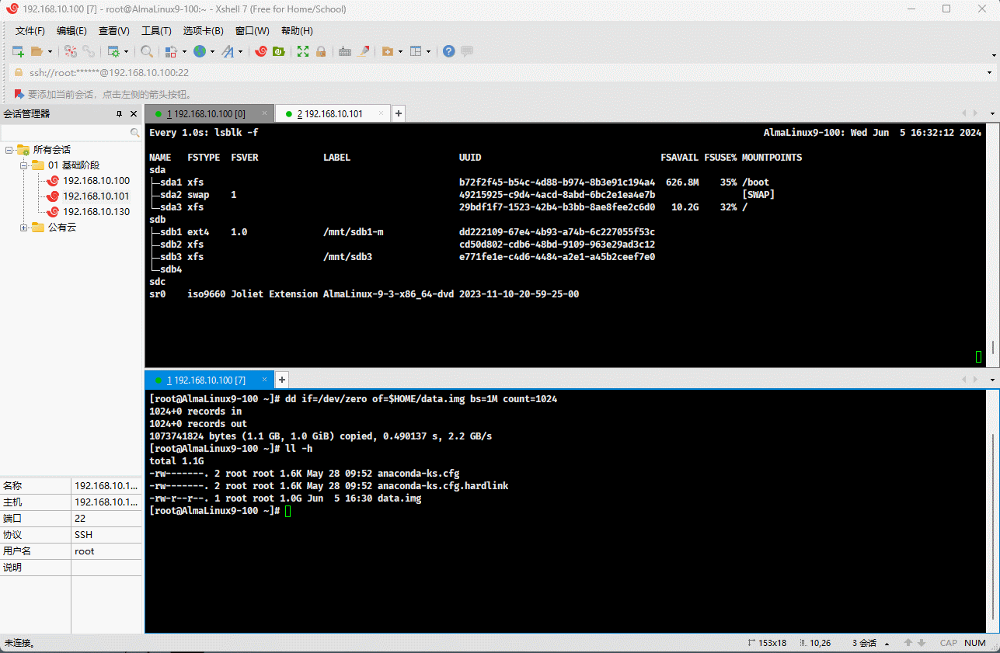


* 示例：创建挂载点，即空目录

```shell
mkdir -pv /mnt/iso
```

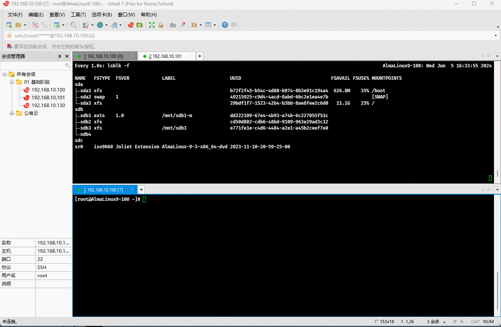


* 示例：将文件系统镜像挂载到挂载点，并复制文件进去

```shell
mount $HOME/data.img /mnt/iso # losetup -a 查询所有的回环设备
```

```shell
cp /etc/fstab /mnt/iso
```


* 示例：将该文件远程发送到其它系统中，并挂载到指定目录，再查看

```shell
scp $HOME/data.img root@192.168.10.101:/root
```

```shell
mount $HOME/data.img /mnt
```

```shell
ll /mnt
```


## 2.8 交换分区

### 2.8.1 概述

* 在 Linux 操作系统中，swap 分区（交换分区）是一种虚拟内存技术，用于扩展物理内存的容量。它通过在磁盘上分配一块空间来存储临时不常用的数据，当物理内存不足时，系统会将部分内存数据移至 swap 分区，以释放更多的物理内存用于当前进程。
* swap 分区的作用如下：
  * ① **扩展内存**：在物理内存（RAM）不足的情况下，swap 分区可以作为扩展的内存空间使用。
  * ② **内存管理**：当系统需要更多的内存而物理内存已经用完时，swap 分区可以防止系统崩溃或强制终止进程。
  * ③ **性能管理**：通过将不常用的内存数据移至 swap 分区，系统可以更有效地管理内存资源。
* 但是，配置过多 swap 空间会造成存储设备处于分配和闲置状态，造成浪费，过多 swap 空间还会掩盖内存泄露。

### 2.8.2 swap 分区建议

* swap 分区的大小通常建议根据系统的物理内存大小和用途来设置。传统建议是：
  - 对于 2GB 或更小的 RAM，swap 大小应为物理内存的两倍。
  - 对于 2GB 到 8GB 的 RAM，swap 大小应与物理内存相同。
  - 对于 8GB 以上的 RAM，swap 大小应为 4GB 到 8GB。

> [!NOTE]
>
> * ① 不过，具体的 swap 大小需要根据实际使用情况和需求来决定。
>
> * ② 通过正确配置和管理 swap 分区，Linux 系统可以更高效地利用内存资源，提升系统的稳定性和性能。
> * ③ 在将来使用容器化技术，如：Docker 等，会需要将 swap 分区关闭，是因为性能问题、内存限制和隔离、简化资源管理等原因。

### 2.8.3 创建交换分区

* 步骤：
  * ① 创建分区：使用 fdisk 、gdisk 或 parted 等工具创建一个新的分区，并需要将分区类型设置为 19 或 8200 （Linux 的 swap 分区）。
  * ② 格式化分区：使用 mkswap 工具格式化所创建的新的分区。
  * ③ 启用分区：使用 swapon 命令启动新的分区。
  * ④ 永久挂载：通过编辑 /etc/fstab 文件，在其中配置 swap ，以实现即使系统重启也会自动挂载 swap 分区。
  * ⑤ 查看分区是否创建成功：使用 `free -h` 或 `swapon --show` 命令验证。


* 示例：创建分区

```shell
fdisk /dev/sdb
```

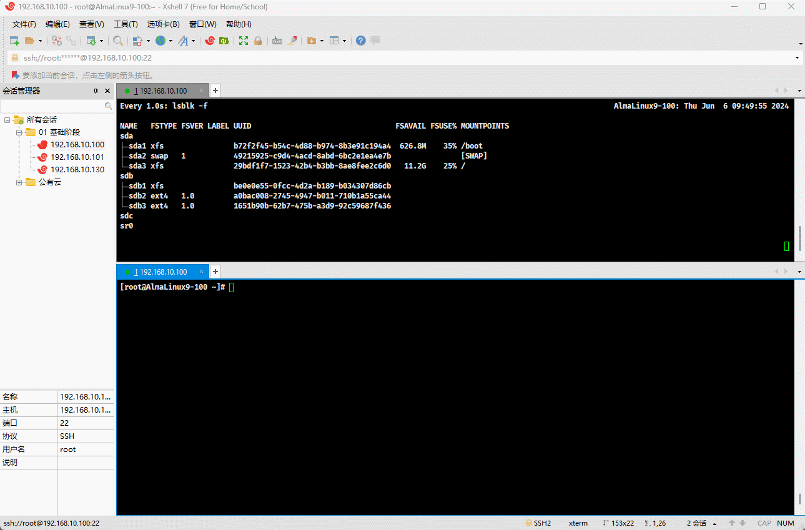


* 示例：格式化分区

```shell
mkswap /dev/sdb4 
```


* 示例：启用分区（手动启用，重启会失效）

```shell
swapon /dev/sdb4 
```

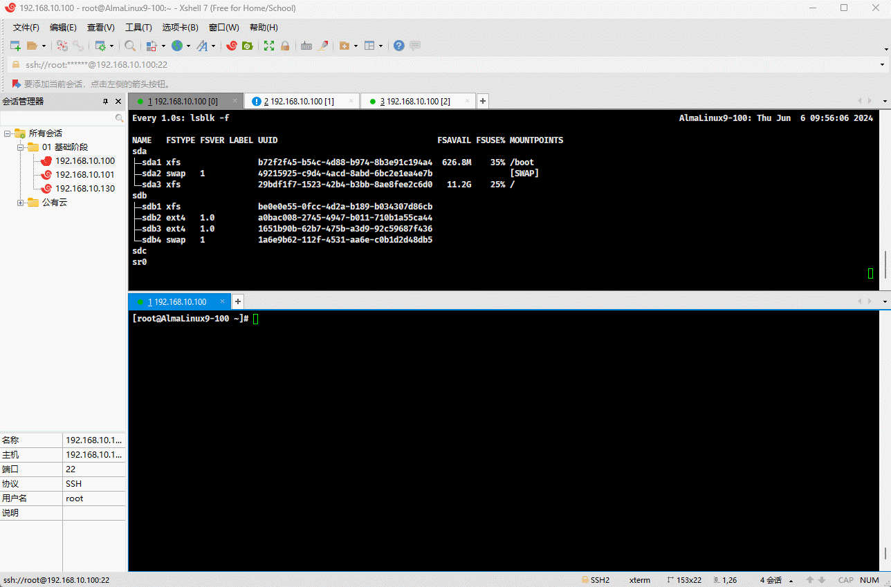


* 示例：查看是否启用成功

```shell
free -h
```

```shell
swapon --show
```

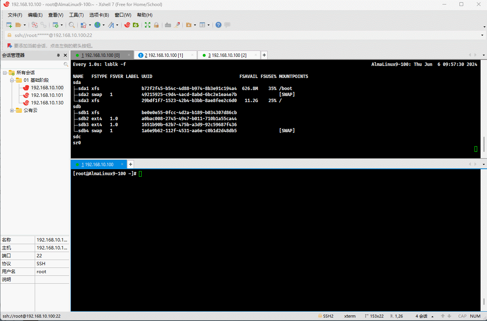


* 示例：永久挂载

```shell
vim /etc/fstab
```

```shell
:r!blkid /dev/sdb4

UUID=1a6e9b62-112f-4531-aa6e-c0b1d2d48db5 none  swap    defaults        0 0 # 增加
```

```shell
swapon -a
```

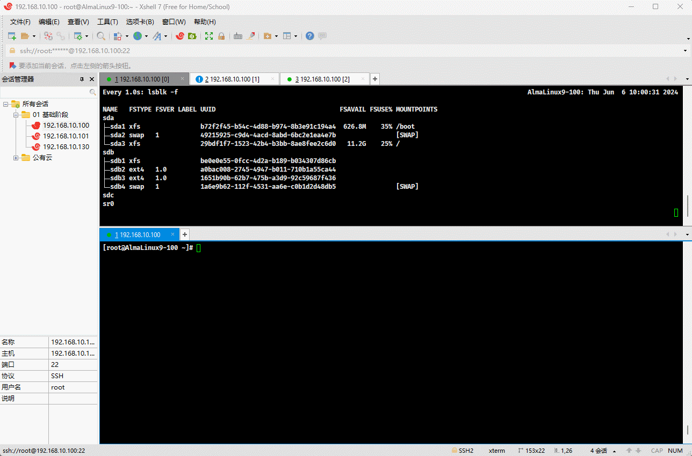

### 2.8.4 关闭 swap 分区（⭐）

* 手动关闭（临时关闭，重启无效）：

```shell
swapoff -a # 关闭当前会话的 swap ，重启之后无效
```

* 永久关闭：

```shell
sed -ri 's/.*swap.*/#&/' /etc/fstab # 需要重启
```


* 示例：关闭 swap 分区

```shell
swapoff -a 
```

```shell
sed -ri 's/.*swap.*/#&/' /etc/fstab
```

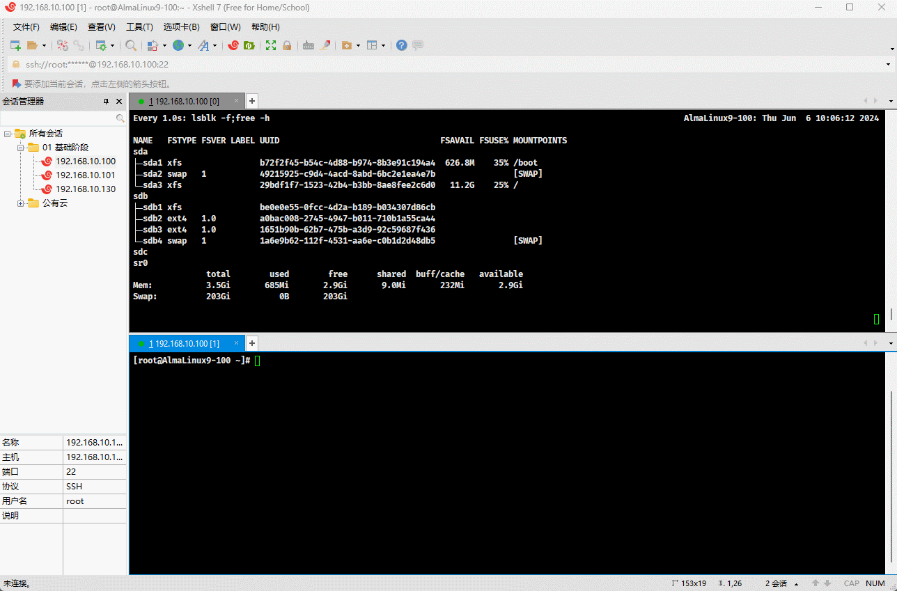

## 2.9 移动介质

### 2.9.1 概述

* 挂载意味着将外来的文件系统看起来如同主目录树的一部分，所有的移动介质同样也需要挂载，挂载点通常在 `/media` 或 `/mnt` 下。
* 在访问移动介质之前，需要将移动介质挂载到主目录树。
* 在摘除移动介质之前，需要将移动介质从主目录树上卸载。

### 2.9.2 光盘

* 在图形化界面，会自动挂载到 `/run/media` 目录下。
* 但是，如果是命令行界面，还需要手动挂载，即：

```shell
mount /dev/sr0 /mnt # /dev/cdrom 是 /dev/sr0 的软链接，某种意义上两者是等价的
```

* 创建 iso 文件：

```shell
cp /dev/sr0 ~/almaLinux9.iso  # 需要先挂载，再复制
```

```shell
mkisofs -r -o ~/etc.iso /etc # dnf -y install xorriso
```

### 2.9.3 USB

* 在图形化界面，会自动挂载到 `/run/media` 目录下。
* 但是，在命令行界面，还需要手动挂载，即：

```shell
mount /dev/sdX /mnt
```

* 可以通过查看系统日志，以确认 USB 设备是否识别：

```shell
dmesg | tail
```

* 查看 USB 设备，即：

```shell
lsusb # dnf -y install usbutils
```

## 2.10 磁盘常用工具（⭐）

### 2.10.1 df

* 格式：

```shell
df [-h][-i][-T]... [/dev/DEVICE]...
```

> [!NOTE]
>
> * 对应的英文：disk free。
> * 功能：查看文件系统（分区）的磁盘空间使用情况。
> * 常用选项：
>   * `-h`，`--human-readable`：以人类可读的方式显示，如：20 GB 等，默认是以 KB 为单位。
>   * `-i`, `--inodes`：显示 inode 的信息，而不显示 block，默认不显示。
>   * `-T`，`--print-type`：打印文件系统。


* 示例：

```shell
df -h
```

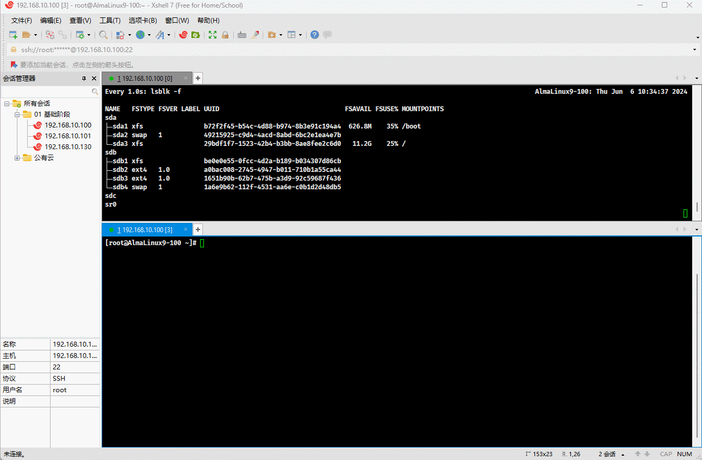


* 示例：

```shell
df -i
```

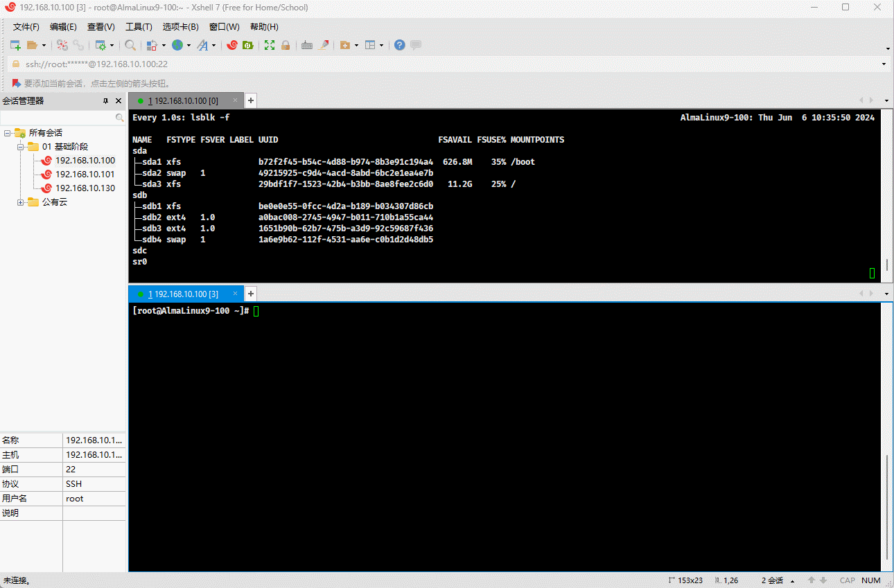


* 示例：

```shell
df -Th
```

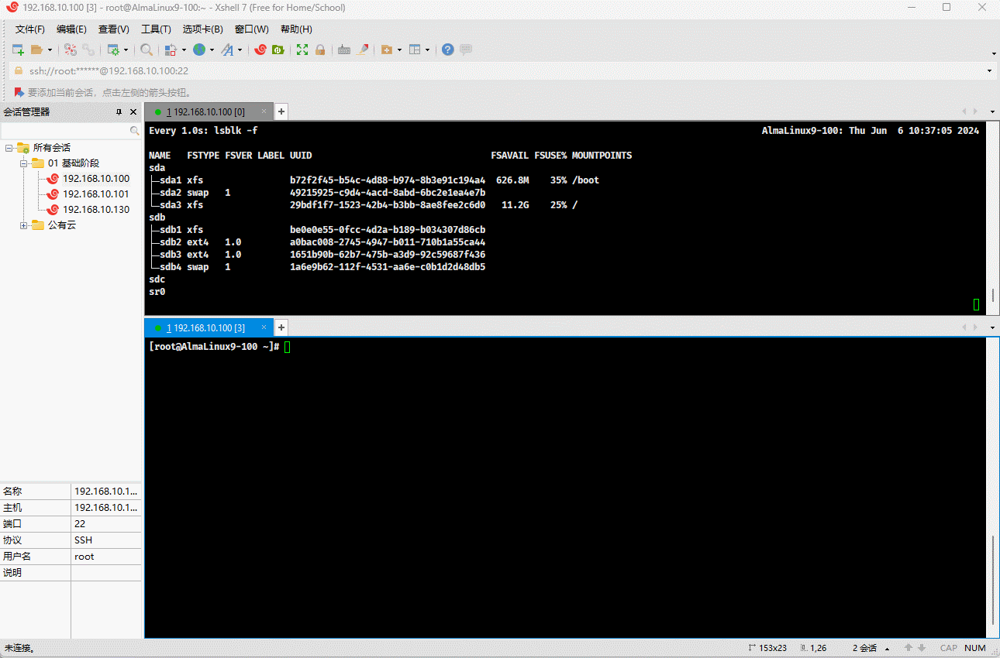

### 2.10.2 du

* 格式：

```shell
du [-h][-s][-a][-d]... [FILE|DIRECTORY]...
```

> [!NOTE]
>
> * 对应的英文：disk usage。
> * 功能：显示文件（集合）或目录在磁盘上的使用空间。
> * 常用选项：
>   * `-h`，`--human-readable`：以人类可读的方式显示，如：20 GB 等，默认是以 KB 为单位。
>   * `-s`，`--summarize`：显示总数。
>   * `-d`，`--max-depth=N`：指定最大目录层级。
>   * `-a`, `--all`：显示所有的文件，而不仅仅包括目录。


* 示例：

```shell
du -sh /etc
```


* 示例：查询指定目录中，文件体积最大的前 5 个

```shell
find /etc -type f -exec du -h {} + | sort -rn | head -n 5
```

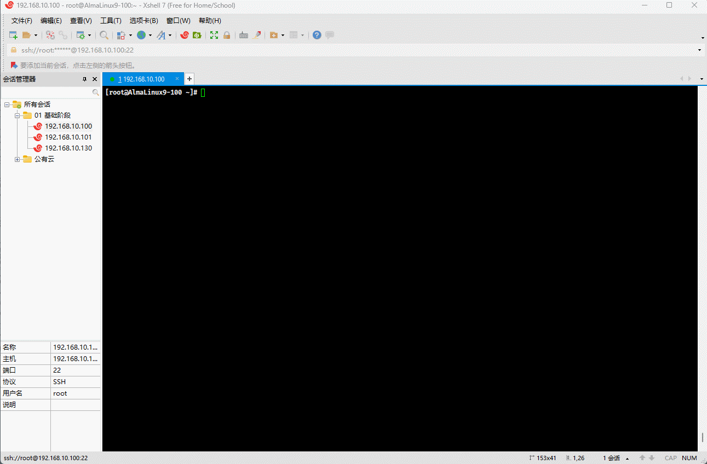

### 2.10.3 dd

#### 2.10.3.1 概述

* 格式：

```shell
dd if=/PATH/FROM/SRC of=/PATH/TO/DEST bs=# count=#
```

> [!NOTE]
>
> * 对应的英文：convert and copy a file。
> * 功能：转换和复制文件，常用于备份整个硬盘或创建磁盘映像。
> * 常用的选项：
>
> ```shell
> if=file # inputfile，从所命名文件读取而不是从标准输入
> ```
>
> ```shell
> of=file # outputfile，写到所命名的文件而不是到标准输出
> ```
>
> ```shell
> ibs=BYTES  # 一次性读入指定的块，默认是 512B 的块大小，可以使用 b、K、M、G 、T、P、E、Z、Y 等单位
> ```
>
> ```shell
> obs=BYTES # 一次性写入指定的块，默认是 512B 的块大小，可以使用 b、K、M、G 、T、P、E、Z、Y 等单位
> ```
>
> ```shell
> bs=BYTES # 一次性读入和写入指定的块，默认是 512B 的块大小，会覆盖 ibs 和 obs
> ```
>
> ```shell
> cbs=BYTES # 一次性转换指定的块，默认是 512B 的块大小，可以使用 b、K、M、G 、T、P、E、Z、Y 等单位
> ```
>
> ```shell
> skip=blocks   # 当读取文件的时候，从开头忽略 blocks 个 ibs 大小的块
> ```
>
> ```shell
> seek=blocks   # 当写入文件的时候，从开头忽略 blocks 个 obs 大小的块
> ```
>
> ```shell
> count=n  # 复制 n 个 bs
> ```
>
> ```shell
> conv=conversion[,conversion...] # 用指定的参数转换文件
> 	ascii # 转换 EBCDIC 为 ASCII
>     ebcdic # 转换 ASCII 为 EBCDIC
>     lcase # 把大写字符转换为小写字符
>     ucase # 把小写字符转换为大写字符
>     nocreat # 不创建输出文件
>     noerror # 出错时不停止
>     notrunc # 不截短输出文件
>     sync # 把每个输入块填充到ibs个字节，不足部分用空(NUL)字符补齐
>     fdatasync # 写完成前，物理写入输出文
> ```
>

#### 2.10.3.3 应用示例

* 示例：将本地的 `/dev/sda` 整盘备份到 `/dev/sdb` 中（危险，谨慎使用）

```shell
dd if=/dev/sda of=/dev/sdb bs=40M status=progress
```

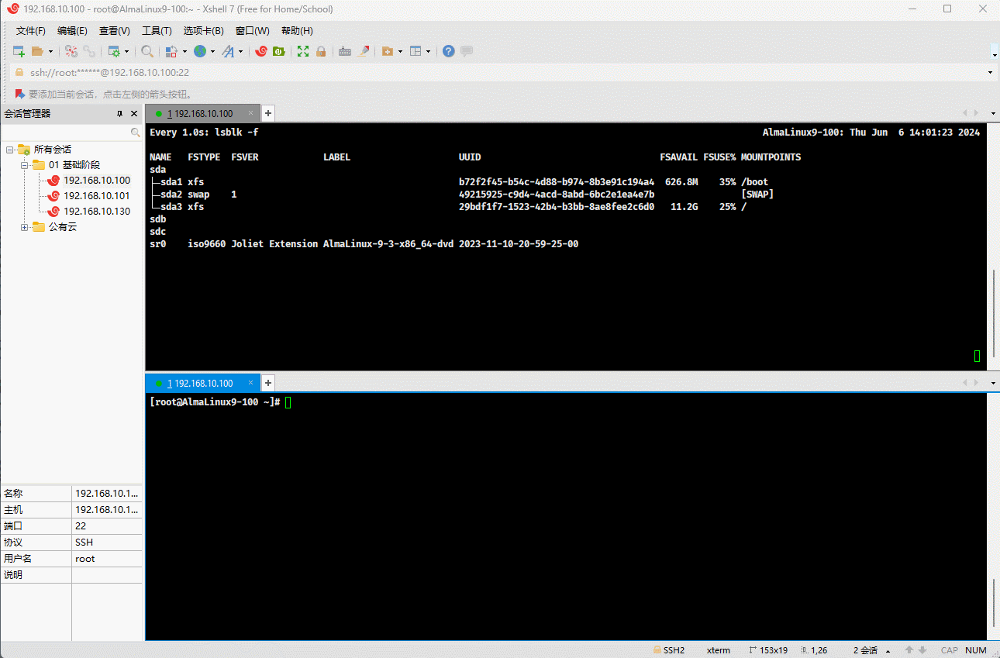


* 示例：将本地的 `/dev/sda` 整盘备份到 `/dev/sdb` 中（危险，谨慎使用，借助镜像文件）

```shell
dd if=/dev/sda of=/mnt/backup.img bs=40M status=progress
```

```shell
dd if=/mnt/backup.img of=/dev/sdb bs=40M status=progress
```

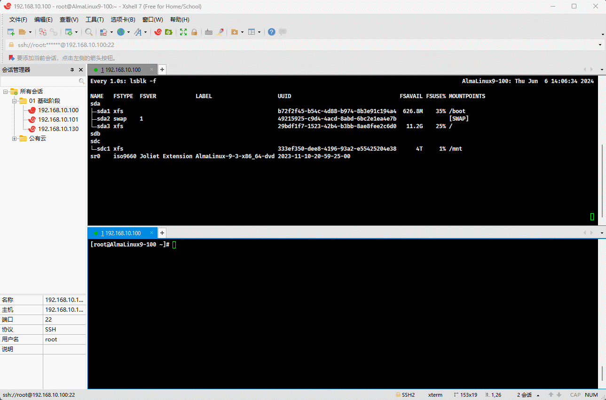

