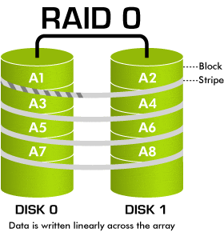
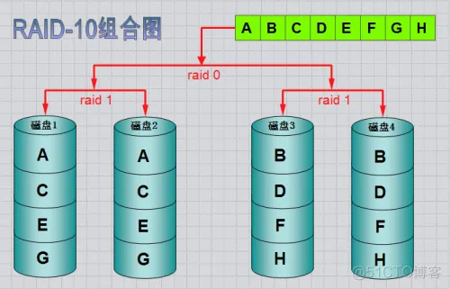
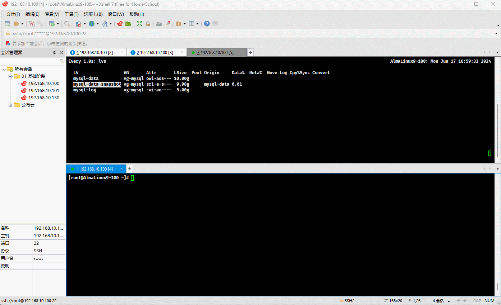

# 第一章：问题剖析

* 之前，我们都是通过`单块硬盘来创建分区`的，但是这种方式却有如下的问题：
  * ① **空间浪费和灵活性不足**：
    - 空间浪费：如果在分区时没有准确估计各分区的需求，可能会导致某些分区空间不足，而其他分区却有大量剩余空间未被利用，造成浪费。
    - 灵活性不足：分区一旦创建，要调整分区大小和重新分配空间会比较麻烦，特别是当硬盘上已有重要数据时，调整分区大小可能需要借助第三方软件，且操作不当可能会导致数据丢失。
  * ② **性能和管理复杂度**：
    - 性能问题：虽然分区本身不会显著影响硬盘的性能，但某些情况下，不同分区间的文件操作会增加磁盘寻道时间，影响整体性能。例如，在一个分区上进行大量读写操作时，可能会影响到其他分区的读写速度。
    - 管理复杂度：多个分区需要独立管理，包括挂载点的配置、备份策略的制定等。特别是在操作系统和应用程序对分区有特定需求的情况下，管理多个分区可能会增加系统管理员的工作量和复杂性。

> [!CAUTION]
>
> * ① 空间不够了，怎么扩展？
> * ② 分区必须是在一块硬盘上，而且是连续的空间中（不可以跨硬盘），如果分区损坏，则分区上的数据将会丢失，怎么办？


# 第二章：RAID

## 2.1 概述

* RAID（Redundant Array of Independent Disks，独立磁盘冗余阵列）是一种将多个硬盘组合成一个逻辑单元，以提高数据存储性能和可靠性的技术。
* RAID 功能实现：
  * 提高 IO 能力。
  * 磁盘并行读写 ，提高耐用性 ，磁盘冗余算法来实现。
* RAID 实现的方式：
  * 外接式磁盘阵列：通过扩展卡提供适配能力。 
  * 内接式 RAID：主板集成 RAID 控制器，安装 OS 前在 BIOS 里配置。
  * 软件 RAID：通过 OS 实现，比如：群晖的 NAS 。

> [!NOTE]
>
> * ① 其实，RAID 解决了 `分区必须是在一块硬盘上，而且是连续的空间中（不可以跨硬盘），如果分区损坏，则分区上的数据将会丢失`的问题。
> * ② 在实际工作中，服务器通常都自带了 RAID 卡，在安装操作系统之前，必须进行 RAID 。
> * ③ 在实际工作中，只需要了解各个 RAID 级别的含义即可。

## 2.2 主流的 RAID 级别

### 2.2.1 概述

* 主流的 RAID 级别分别是 RAID-0、RAID-1、RAID-5、RAID-6、RAID-10。

### 2.2.2 RAID-0（条带化，⭐）

* RAID-0 对应的动画，如下所示：



* RAID-0 对应的动画，如下所示：


* **特点**：将数据分散到多个磁盘上，数据读写速度加快，但没有冗余保护，即读写性能提升。
* **可用空间**：`N* min(S1,S2...)`，最少磁盘数为 2，2+。
* **优点**：高性能，适用于对速度要求高的应用。
* **缺点**：没有数据冗余，任何一个磁盘的故障都会导致数据丢失。
* **使用场景**：视频编辑、大型数据库、需要高吞吐量的环境。

### 2.2.3 RAID-1（镜像，⭐）

* RAID-1 对应的动画，如下所示：


* RAID-1 对应的动画，如下所示：


* **特点**：将相同的数据写入到两个或多个磁盘上。
* **可用空间**：`N/2 * min(S1,S2...)`，最少磁盘数为  2，2N。
* **优点**：提供数据冗余，任何一个磁盘故障不会导致数据丢失。
* **缺点**：存储利用率低，仅为总容量的一半。
* **使用场景**：需要高数据可靠性的应用，如：财务数据存储、重要文档存储。

### 2.2.3 RAID-3（位级条带化与单一奇偶校验）

* RAID-3 对应的动画，如下所示：


* **特点**：RAID 3 将数据在字节或位级别进行条带化，同时使用一个单独的磁盘来存储奇偶校验信息。
* **可用空间**：`（N-1）* min(S1,S2...)`，最少磁盘数为 3，N+2。
* **优点**：对于大文件的顺序读取和写入性能较好，因为所有磁盘同时参与数据传输。
* **缺点**：
  - 单个奇偶校验磁盘成为瓶颈，导致并发写入性能较差。
  - 由于数据条带化在位或字节级别，恢复数据时需要所有磁盘参与，重建速度较慢。
  - 复杂度较高，磁盘同步要求严格。
* **使用场景**：主要适用于连续数据流应用，如：视频编辑、图像处理和科学计算等需要顺序大文件读取的场景。

> [!NOTE]
>
> * ① 之所以，RAID 3 被淘汰，是因为在实际测试中，会发现写性能瓶颈会发生在最后一个数据校验磁盘上（损坏的几率很高）。
> * ② RAID 4 和 RAID3 原理差不多，只不多 RAID3 使用的是位或字节级别条带化，而 RAID4 采用的是块级别条带化。
> * ③ 类似于异或运算，只需要将两个数据已经异或运算，就可以得到第三个数据了；取任意两个数进行异或运算，总能得到第三个数，这就是其为什么能解决数据丢失的原理。
> * ④ 组成 RAID 的硬盘，最好容量是一样的，即：都是 2 TB ；如果其中有一个超过了（4TB），那么多余的容量（2 TB）将不会利用。

### 2.2.4 RAID-5（⭐）

* RAID-5 对应的动画，如下所示：


* **特点**：数据和奇偶校验信息分布在多个磁盘上，至少需要三个磁盘。
* **优点**：提供数据冗余和较好的存储利用率，读性能好。
* **缺点**：写性能较差，重建时间较长。
* **使用场景**：文件服务器、大部分企业应用、数据库。

### 2.2.5 RAID-10（⭐）

* RAID-10 对应的动画，如下所示：


* RAID-10 对应的图，如下所示：



* **特点**：结合 RAID 0 和 RAID 1（先），将数据先条带化再镜像，至少需要四个磁盘。
* **优点**：兼顾高性能和高冗余，读写性能优良。
* **缺点**：存储利用率较低，仅为总容量的一半。
* **使用场景**：需要高性能和高可靠性的环境，如：数据库、虚拟化环境。

## 2.3 软 RAID

### 2.3.1 概述

* 在 Linux 中，是使用 mdadm 命令来管理 RAID 的，其对应的英文是：manage MD devices aka Linux Software RAID（管理多设备【Multiple  Device】，特别是管理 Linux 软 RAID 的工具）。
* 格式：

```shell
 mdadm [mode] <raiddevice> [options] <component-devices>
```

* 常用选项说明：

```shell
mode:
  -A, --assemble：组装，将之前创建的阵列组件组装成一个活动的阵列。组件可以明确给出或搜索得到。mdadm 会检查这些组件是否形成了一个合法的阵列，并可以在需要时修改超级块信息以组装有问题的阵列。
  -B, --build：构建，构建没有每设备元数据（超级块）的阵列。mdadm 不能区分初始创建和随后的组装，也不能检查请求的组件是否合适。因此，Build 模式应仅在完全理解操作的情况下使用。
  -C, --create：创建，创建一个包含每设备元数据（超级块）的新阵列。适当的元数据会写入每个设备，然后阵列会被激活。一个“重新同步”过程会启动以确保阵列一致，但设备内容不会受到其他影响。创建后可以立即使用阵列，无需等待重新同步完成。
  -F, --follow, --monitor：监控，监控一个或多个 md 设备，并对状态变化采取行动。这仅对 RAID1、4、5、6、10 或多路径阵列有意义，因为只有这些有有趣的状态变化。RAID0 或 Linear 阵列不会有缺失、备用或故障驱动，因此无需监控。
  -G, --grow：增长，增长（或缩小）阵列，或以其他方式重新配置阵列。当前支持的增长选项包括改变组件设备的活动大小和更改 Linear 和 RAID 0、1、4、5、6 的活动设备数量、在 0、1、5 和 6 之间改变 RAID 级别、在 0 和 10 之间改变级别、更改 RAID 0、1、4、5、6、10 的块大小和布局，以及添加或删除写意图位图和更改阵列的一致性策略。
  -I, --incremental：增量组装，向合适的阵列添加单个设备。如果添加设备使阵列可运行，则阵列会启动。这为热插拔系统提供了方便的接口。每检测到一个设备时，mdadm 会将其包括在某个合适的阵列中。选择性地，当传递 --fail 标志时，我们会从任何活动阵列中移除设备而不是添加它。
  --auto-detect：自动检测，此模式不会对特定设备或阵列执行操作，而是请求 Linux 内核激活任何自动检测的阵列。
```

```shell
<raiddevice> : /dev/mdX，X 是 0、1、2、3 ...，类似于 /des/sda
```

```shell
-C：创建模式
  	 -n #: 使用#个块设备来创建此RAID
     -l #：指明要创建的RAID的级别
     -a {yes|no}：自动创建目标RAID设备的设备文件
     -c CHUNK_SIZE: 指明块大小,单位k
     -x #: 指明空闲盘的个数
```

```shell
-D: 显示 raid 的详细信息，如：mdadm -D /dev/md0
```

```shell
管理模式：
	-f：标记指定磁盘为损坏
	-a：添加磁盘
	-r：移除磁盘
```

```shell
观察 md 的状态： cat /proc/mdstat
```

### 2.3.2 应用示例

* 示例：查看当前系统中的硬盘

```shell
lsblk -f
```


* 示例：创建 RAID5 （至少 3 个硬盘）

```shell
mdadm -Cv /dev/md0 -a yes -l raid5 -n 3 -x 1 /dev/sd{b,c,d,e} -f
```

```shell
mdadm --create /dev/md0 --auto=yes --level=5 --raid-devices=3 --spare-devices=1 /dev/sd{b,c,d,e} --force
```


* 示例：查看 RAID 阵列信息

```shell
mdadm -D /dev/md0
```


* 示例：对 RAID 设备创建文件系统

```shell
mkfs.ext4 /dev/md0
```


* 示例：模拟磁盘故障

```shell
mdadm /dev/md0 -f /dev/sdb # 标记磁盘损坏
```


* 示例：移除故障设备

```shell
mdadm /dev/md0 -r /dev/sdb
```


* 示例：添加新的设备

```shell
mdadm –G /dev/md0 -a /dev/sde
```


* 示例：停止 RAID 

```shell
mdadm -S /dev/md0
```


* 示例：删除 RAID 信息

```shell
mdadm --zero-superblock /dev/sd{b,c,d,e}
```


# 第三章：逻辑卷管理（LVM）

## 3.1 概述

* 逻辑卷（Logic Volume，LV）是一种存储管理方法，通过逻辑卷管理器（Logical Volume Manager，LVM）来实现对存储设备的动态管理。
* 和传统的分区方式相比，逻辑卷提供了更高的灵活性和扩展性，解决了传统分区方法在容量管理、管理复杂性、扩展性和数据备份方面的诸多问题，适用于各种需要高效存储管理的应用场景。
* 逻辑卷解决的问题，如下所示：
  * ① 容量限制：传统分区在创建后很难调整（win 官方支持；但是，Linux 官方不支持），而逻辑卷可以根据需要实时在线动态调整大小。
  * ② 管理复杂性：逻辑卷将多个物理设备统一管理，简化了存储设备的管理。
  * ③ 扩展性：当需要增加存储容器的时候，可以直接将新的物理卷添加到现有的卷组中，而无需重新分区或格式化。
  * ④ 数据备份和恢复：通过快照功能，可以在不影响系统运行的情况下进行数据备份和恢复。

> [!IMPORTANT]
>
> * ① LVM 解决了 `空间不够了，怎么扩展？` 的问题。
> * ② LVM 早期来源于 IBM 的小型机（如：AIX 操作系统）；后来，这种技术被推广到了其他操作系统中，包括：Linux 。
> * ③ 从 RHEL7+ 之后，Redhat 就力推 LVM；如果我们在安装操作系统的时候，不是手动进行分区，那么默认就是使用 LVM 来进行磁盘的管理。

## 3.2 工作原理

* LVM 的工作原理图，如下所示：


* 其工作流程，如下所示：
  * ① LVM 将物理存储设备（如：机械硬盘、SSD）抽象为物理卷（Physical Volume，PV），可以简单理解将物理存储打了标记，以方便卷组来管理逻辑卷；需要注意的是，物理存储设备可以是分区也可以是整块硬盘。
  * ② 将多个物理卷（Physical Volume，PV）组合形成卷组（Volume Group，VG），并可以设置物理区域（Physical Extent，PE）的大小（类似于分区，分区通常的单位是 4096k；而物理区域的单位可以自己指定，默认是 4MB  或 8MB ）。
  * ③ 将卷组（Volume Group，VG）的基础上，创建一个或多个逻辑卷（Logical Volme，LV）。
* 在逻辑卷管理（LVM）中，物理区域（Physical Extent，PE）和逻辑区域（Logical Extent，LE）的关系，如下所示：


* 物理区域（Physical Extent，PE）和逻辑区域（Logical Extent，LE）的区别，如下所示：

| 类型 | 物理区域（Physical Extent，PE）                              | 逻辑区域（Logical Extent，LE）                               |
| ---- | ------------------------------------------------------------ | ------------------------------------------------------------ |
| 定义 | 物理区域（Physical Extent，PE）是物理卷（Physical Volume，PV）中的最小分配单位。<br>物理卷（Physical Volume，PV）被划分成多个大小相等的物理区域（Physical Extent，PE）。 | 逻辑区域（Logical Extent，LE）是逻辑卷中的最小分配单位。<br/>每个逻辑卷（Logical Volme，LV）被划分成若干个大小相等的逻辑区域（Logical Extent，LE）。 |
| 大小 | 在创建卷组（Volume Group，VG）时指定物理区域（Physical Extent，PE）的大小，所有加入该卷组的物理卷将使用相同大小的物理区域（Physical Extent，PE）。<br/>例如：物理区域（Physical Extent，PE）大小可以是 4MB、8MB 或其他适当的大小。 | 逻辑区域（Logical Extent，LE）的大小与物理区域（Physical Extent，PE）的大小相同。<br/>在创建卷组（Volume Group，VG）时指定物理区域（Physical Extent，PE）的大小后，逻辑区域（Logical Extent，LE）的大小自动与物理区域（Physical Extent，PE）大小相同。 |
| 作用 | 物理区域（Physical Extent，PE）是 LVM 在物理卷（Physical Volume，PV）上分配和管理存储空间的基础单位。<br/>逻辑卷（Logical Volme，LV）中的存储空间实际上是由多个物理区域（Physical Extent，PE）组合而成的。 | 逻辑区域（Logical Extent，LE）是 LVM 在逻辑卷上分配和管理存储空间的基础单位。<br/>逻辑卷中的数据是按逻辑区域（Logical Extent，LE）进行管理的。 |

> [!NOTE]
>
> * ① 创建完逻辑卷（Logical Volume，LV），在需要在上面创建文件系统，并挂载到 Linux 中的指定目录中，方可使用！！！
> * ② 逻辑卷（Logical Volume，LV）对应的设备名通常是 `/dev/dm-#`，如：/dev/dm-0 ，其对应的软链接是 `/dev/mapper/VG_NAME-LV_NAME` 。

## 3.3 LVM 实时在线扩容的原理

* LVM（逻辑卷管理）实时在线扩容是通过在不停止系统运行的情况下动态增加存储容量的一种技术，其背后就是借助了 PE ，即：


* 其实就是通过交换 PE（对应的就是 LE）来进行数据的转换，将原来 LV 内的 PE 转义到其他设备中以便降低 LV 的容量，或者将其他设备中的 PE 加入到 LV 中以便增加 LV 的容量。

## 3.4 安装对应的软件包

* LVM 来源于 lvm2 软件包，安装命令如下：

```shell
dnf -y install lvm2
```


* 查看软件包中对应的命令：

```shell
dnf repoquery --list lvm2 | grep /usr/sbin/
```


## 3.5 实战 LVM

### 3.5.1 物理卷（Physical Volume，PV）管理

* 显示物理卷（Physical Volume，PV）信息：

```shell
pvs # 简要信息，s 是 show 的意思
```

```shell
pvdisplay 
```

* 创建物理卷（Physical Volume，PV）：

```shell
# -v，--verbose 显示进度
# -f，--force 强制
pvcreate [-v][-f] /dev/DEVICE /dev/DEVICE ... # DEVICE 可以是设备名 sda，也可以是分区名 sdb1
```

* 删除物理卷（Physical Volume，PV）：

```shell
# -v，--verbose 显示进度
# -f，--force 强制
pvremove [-v][-f] /dev/DEVICE /dev/DEVICE ... # DEVICE 可以是设备名 sda，也可以是分区名 sdb1
```


* 示例：显示物理卷信息

```shell
pvs # 简要信息
```

```shell
pvdisplay
```


* 示例：创建物理卷

```shell
pvcreate -vf /dev/sdb /dev/sdc1
```


* 示例：删除物理卷

```shell
pvremove -vf /dev/sdb /dev/sdbc1
```


### 3.5.2 卷组（Volume Group，VG）管理

* 显示卷组（Volume Group，VG）信息：

```shell
vgs # 简要信息
```

```shell
vgdisplay
```

* 创建卷组（Volume Group，VG）：

```shell
# -v，--verbose 显示进度
# -f，--force 强制
# -s|--physicalextentsize Size[m|UNIT] 指定 PE 的大小，单位是 kKmMgGtTpPeE
vgcreate [-v][-f] [-s|--physicalextentsize Size[m|UNIT]] VolumeGroupName PV ... # 其中，VolumeGroupName 卷组名，PV 就是 /dev/DEVICE 
```

* 删除卷组（Volume Group，VG）：

```shell
vgremove [-v][-f] VolumeGroupName...  # VolumeGroupName 卷组名
```

> [!NOTE]
>
> * ① 如果卷组上有存在的逻辑卷（LV），系统会提示用户确认是否要删除这些逻辑卷；所以，在实际操作中，需要先卸载逻辑卷（如果已挂载），再删除逻辑卷和卷组，最后再删除卷组。
> * ② 如果某些卷组中的物理卷（PV）丢失了，可以使用 `vgreduce --removemissing` 来移除丢失的物理卷。
> * ③ 如果希望跳过确认提示并强制删除卷组中的所有逻辑卷，可以使用 `-ff` 选项，即：`vgremove [-v][-ff] VolumeGroupName...` 。

* 管理卷组（Volume Group，VG）：

```shell
vgextend VG PV ... # 向指定的卷组中增加物理卷
```

```shell
 vgreduce VG PV ... # 从指定的卷组中移除物理卷
```


* 示例：显示卷组信息

```shell
vgs # 简要信息
```

```shell
vgdisplay
```


* 示例：创建卷组

```shell
vgcreate -v -s 8M vg-mysql /dev/sdb /dev/sdc1
```


* 示例：删除卷组

```shell
vgremove -v vg-mysql
```


### 3.5.3 逻辑卷（Logical Volume，LV）管理

* 显示逻辑卷（Logical Volume，LV）信息：

```shell
lvs
```

```shell
lvdisplay
```

* 创建逻辑卷（Logical Volume，LV）：

```shell
# -v，--verbose 显示进度
# [-L|--size size[m|UNIT]] 指定大小，如：-L 50G
# -n LogicalVolumeName 指定逻辑卷的名称
# -l ，如：-L 60%VG（VG 的60%），-L 100%FREE（全部）
lvcreate [-v] [-L|--size size[m|UNIT]] -n LogicalVolumeName VolumeGroupName
```

* 删除逻辑卷（Logical Volume，LV）：

```shell
# 需要先卸载挂载的逻辑卷，然后才可以删除逻辑卷（也可以继续删除卷组，删除物理卷标识）
lvremove /dev/VG_NAME/LV_NAME
```

* 重设文件系统大小：

```shell
fsadm resize /dev/VG_NAME/LV_NAME +20G # 扩展文件系统和逻辑卷，只支持 ext 文件系统
fsadm resize /dev/VG_NAME/LV_NAM -10G #  缩小文件系统和逻辑卷，只支持 ext 文件系统
```

```shell
# resize2fs 用于调整文件系统的大小，但是不处理逻辑卷的大小，只支持 ext 文件系统
lvextend -L +20G /dev/VG_NAME/LV_NAME # 扩展文件系统（在扩展逻辑卷之后）,先调整逻辑卷的大小
resize2fs /dev/VG_NAME/LV_NAME # 扩展文件系统（在扩展逻辑卷之后）,再调整文件系统的大小

lvreduce -L -10G /dev/VG_NAME/LV_NAME # 缩小文件系统（在缩小逻辑卷之前）,先调整逻辑卷的大小
resize2fs /dev/VG_NAME/LV_NAME # 缩小文件系统（在缩小逻辑卷之前）,再调整文件系统的大小
```

```shell
# xfs_growfs 用于扩展 XFS 文件系统，但不支持缩小。需要先扩展逻辑卷，再扩展文件系统。
lvextend -L +20G /dev/VG_NAME/LV_NAME# 扩展文件系统（在扩展逻辑卷之后）,先调整逻辑卷的大小
xfs_growfs /dev/VG_NAME/LV_NAME # 扩展文件系统（在扩展逻辑卷之后）,再调整文件系统的大小
```

```shell
# lvresize 用于调整逻辑卷的大小，底层调用的就是 resize2fs 或 xfs_growfs，XFS 文件系统不支持缩小
# -l|--extents [+]Number[PERCENT] 扩展百分比，调整逻辑卷 
# -r|--resizefs 调整文件系统
# [-L|--size size[m|UNIT]] 指定大小，如：-L 50G
lvresize [-r|--resizefs] [-l|--extents] [-L +20G] /dev/VG_NAME/LV_NAME # 扩展文件系统
```


* 示例：显示逻辑卷信息

```shell
lvs
```

```shell
lvdiaplay
```


* 示例：创建 10G 的逻辑卷用于存储 mysql-data 数据，创建 5G 的逻辑卷用于存储 mysql-log 数据

```shell
lvcreate -v -L 10G -n mysql-data vg-mysql
```

```shell
lvcreate -v -L 5G -n mysql-log vg-mysql
```


* 示例：创建文件系统，并挂载

```shell
mkdir -pv /mnt/{mysql-data,mysql-log} # 创建挂载点
```

```shell
mkfs.ext4 /dev/vg-mysql/mysql-data # 创建文件系统
```

```shell
mkfs.ext4 /dev/vg-mysql/mysql-log # 创建文件系统
```

```shell
mount /dev/vg-mysql/mysql-data /mnt/mysql-data # 挂载
```

```shell
mount /dev/vg-mysql/mysql-log /mnt/mysql-log # 挂载
```


## 3.6 删除逻辑卷（危险）

### 3.6.1 概述

* 步骤：
  * ① **卸载逻辑卷**：确保所有挂载的逻辑卷都被卸载。
  * ② **删除逻辑卷**：使用`lvremove`命令删除逻辑卷。
  * ③ **删除卷组**：使用`vgremove`命令删除卷组（也可以跳过步骤②，加上 `-ff` 选项，强制删除卷组中的所有逻辑卷）。
  * ④ **删除物理卷**：使用`pvremove`命令将物理卷从LVM管理中移除。

> [!NOTE]
>
> 在删除逻辑卷和卷组之前，确保已经备份了所有重要数据。删除操作不可逆，数据将永久丢失。

### 3.6.2 应用示例

* 示例：卸载逻辑卷

```shell
umount /mnt/mysql-data
```

```shell
umount /mnt/mysql-log
```


* 示例：删除逻辑卷

```shell
lvremove /dev/vg-mysql/mysql-data
```

```shell
lvremove /dev/vg-mysql/mysql-log
```


* 示例：删除卷组

```shell
vgremove vg-mysql
```


* 示例：删除物理卷

```shell
pvremove /dev/sdb
```

```shell
pvremove /dev/sdc1 
```


### 3.6.3 应用示例

* 示例：卸载逻辑卷

```shell
umount /mnt/mysql-data
```

```shell
umount /mnt/mysql-log
```


* 示例：删除卷组的同时删除逻辑卷

```shell
vgremove -v -ff vg-mysql
```


* 示例：删除物理卷

```shell
pvremove /dev/sdb
```

```shell
pvremove /dev/sdc1 
```


## 3.7 在线扩展逻辑卷

### 3.7.1 概述

* 在线扩展逻辑卷的原理，在上文已经解释过了，本次只给出原理图：


* 扩展逻辑卷只要把握如下的两点就可以了：
  * ① 如果卷组中还有剩余空间，就将剩余的空间分配给逻辑卷，然后再重设文件系统大小。
  * ② 如果卷组本身也没有剩余空间，那么就需要扩容卷组，然后将多余的空间分配给逻辑卷，然后再重设文件系统大小。
* 查看文件系统对应的逻辑卷的大小：

```shell
lsblk -f
```


* 模拟硬盘数据将要写满了，现在需要在线扩容：

```shell
dd if=/dev/zero of=/mnt/mysql-data/out.img bs=1G count=8
```


### 3.7.2 应用示例（情况①）

* 示例：查看卷组是否还有剩余空间

```shell
vgdisplay
```


* 示例：扩容逻辑卷，并重设文件大小

```shell
#  -L|--size [+]Size[m|UNIT] 单位是：[mMgGtT 等
# -l|--extents [+]Number[PERCENT] 扩展百分比 
lvextend -l +100%FREE /dev/vg-mysql/mysql-data
```

```shell
resize2fs /dev/vg-mysql/mysql-data # ext4 文件系统
xfs_growfs /dev/vg-mysql/mysql-data # xfs 文件系统
```


* 示例：扩容逻辑卷，并重设文件大小（推荐）

```shell
# -r|--resizefs 重置文件系统
# -l|--extents [+]Number[PERCENT] 扩展百分比 
lvextend -l +100%FREE -r /dev/vg-mysql/mysql-data # lvextend 也可以在扩容逻辑卷的同时，重设文件系统大小
```


### 3.7.3 应用示例（情况②）

* 示例：查看卷组是否还有剩余空间

```shell
vgdisplay
```


* 示例：模拟硬盘数据将要写满了

```shell
dd if=/dev/zero of=/mnt/mysql-data/out.img bs=1G count=18
```


* 示例：扩容卷组

```shell
pvcreate -v /dev/sdd
```

```shell
vgextend -v vg-mysql /dev/sdd
```


* 示例：扩容逻辑卷

```shell
lvextend -v -l +100%FREE -r /dev/vg-mysql/mysql-data
```


## 3.8 缩减逻辑卷

### 3.8.1 概述

* 步骤：
  * ① **卸载文件系统**：如果逻辑卷已经挂载，先卸载它。
  * ② **检查文件系统**：运行文件系统检查命令，确保文件系统没有错误。
  * ③ **调整文件系统大小**：使用`resize2fs`命令将文件系统调整为指定大小；如果出现问题，可以调整到一个相对大的安全值，如：原先是 10G ，那么现在就可以调整为 15G 。
  * ④ **缩减逻辑卷大小**：使用`lvreduce`命令将逻辑卷大小缩减到指定大小。
  * ⑤ **重新挂载文件系统**：缩减完成后，重新挂载逻辑卷。

> [!CAUTION]
>
> * ① 在缩减之前，需要先备份数据，防止数据损坏！！！
> * ② xfs 文件系统不支持缩减，ext 系列的文件系统才支持缩减。
> * ③ lvm 技术不支持在线实时缩减逻辑卷，必须先卸载文件系统。

### 3.8.2 应用示例

* 示例：卸载文件系统（假设数据已经备份）

```shell
umount /mnt/mysql-data
```


* 示例：检查文件系统，确保文件系统没有损坏

```shell
fsck -f /dev/vg-mysql/mysql-data
```


* 示例：调整文件系统大小

```shell
resize2fs /dev/vg-mysql/mysql-data 10G
```


* 示例：缩减逻辑卷

```shell
lvreduce  -L 10G /dev/vg-mysql/mysql-data
```


* 示例：重新挂载文件系统

```shell
mount /dev/vg-mysql/mysql-data /mnt/mysql-data
```


## 3.9 逻辑卷的快照

### 3.9.1 概述

* 我们在使用 VMWare 虚拟化软件的时候，最主要的一个原因就是它提供了快照的功能，如果我们将 Linux 玩坏了，就可以直接回滚。


* 其实，LVM 逻辑卷也提供了快照功能，可以帮助我们完成如下的功能：
  * ① **数据保护和恢复**：快照可以在关键操作（如：软件升级、配置更改）前创建，提供回滚点。如果操作失败，可以快速恢复到快照时的状态。
  * ② **开发和测试环境**：在开发和测试过程中，快照可以用于快速创建一致的数据副本，帮助团队在相同的环境下进行测试，确保一致性。
  * ③ **备份管理**：快照可以作为备份策略的一部分，定期创建快照以确保数据安全。这种方法比传统备份更快速且资源占用更少。

### 3.9.2 工作原理

* 快照是一种特殊的逻辑卷，它是在生成快照时存在的逻辑卷的准确拷贝，对于需要备份或者复制的现有数据临时拷贝以及其它操作来说，快照是最合适的选择，快照只有在它们和原来的逻辑卷不同时才会消耗空间， 建立快照的卷大小小于等于原始逻辑卷。
* 快照的工作原理的图示，如下所示：


* 快照的工作原理，如下：
  * ① 在生成快照的时候，会分配给快照一定的空间（通常小于或等于原始逻辑卷）；当原先的逻辑卷或快照有所改变的时候，才会使用这些空间。
  * ② 当原先的逻辑卷有所改变的时候，会将旧的数据复制到快照中。
  * ③ 快照中只包含原来逻辑卷中更改的数据或者自生成快照后快照中更改的数据。

> [!NOTE]
>
> * ① 由于快照区和原先的逻辑卷公用了很多 LE（PE） 的区块，因此快照和被快照的逻辑卷必须在同一个卷组，系统恢复的时候的文件数量不能高于快照区的实际容量。
> * ② 公有云上也提供了快照技术，并且公有云的快照实现依赖于底层存储技术、云平台的管理功能和自动化工具。增量快照技术、数据一致性保证和跨区域复制是实现快照的关键技术点。通过这些技术，公有云平台可以为用户提供高效、可靠的数据保护和恢复服务。

### 3.9.3 实战

* 示例：查看卷组

```shell
vgdisplay
```


* 示例：创建快照挂载点

```shell
mkdir -pv /mnt/mysql-data-snapshot
```


* 示例：在原始逻辑卷中增加数据

```shell
cp -R /etc /mnt/mysql-data
```


* 示例：为原始逻辑卷创建快照

```shell
# -s|--snapshot 指定逻辑卷为快照
# -n|--name String 指定逻辑卷的名称
# -p|--permission rw|r 权限
lvcreate -l +100%FREE -s -n mysql-data-snapshot -p r /dev/vg-mysql/mysql-data
```


* 示例：挂载快照

```shell
mount /dev/vg-mysql/mysql-data-snapshot /mnt/mysql-data-snapshot
```




* 示例：查看快照中的数据是否存在

```shell
ll /mnt/mysql-data-snapshot
```


* 示例：删除原始逻辑卷中的数据

```shell
rm -rf /mnt/mysql-data/etc
```


* 示例：合并快照到原始逻辑卷（在创建快照之后的原始逻辑卷的数据会丢失，可以事先备份，并且快照也会被删除）

```shell
umount /mnt/mysql-data-snapshot
```

```shell
umount /mnt/mysql-data
```

```shell
lvconvert --mergesnapshot /dev/vg-mysql/mysql-data-snapshot
```


* 示例：挂载原始逻辑卷

```shell
mount /mnt/mysql-data /dev/vg-mysql/mysql-data
```


