# 第一章：Harbor 简介

## 1.1 概述

* Harbor 是一个用于容器镜像的开源注册中心项目，旨在通过提供容器镜像的管理和安全功能，帮助企业构建和运行云原生应用。

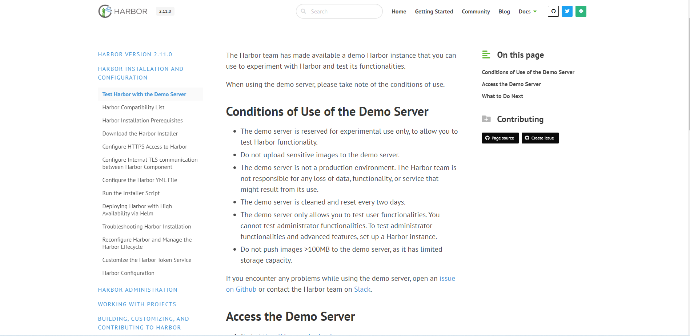

* Harbor 的[官方地址](https://goharbor.io/)。

> [!NOTE]
>
> * ① 默认情况下，Harbor 给出的安装方式是使用 docker compose，但是这种方案并没有提供 TLS，即 HTTPS，需要自行配置解决。
> * ② 如果要开启高可用，Harbor 推荐使用 Helm 来安装，即通过 Helm 将 Harbor 安装到 Kubernetes 中。
> * ③ 本次，为了快速使用，使用 docker compose 的方案（使用 Traefik 来解决 TLS 问题，Traefik 类似于 Nginx，也可以解决 LB 问题）。

## 1.2 Harbor 的主要功能

* **镜像管理**：提供镜像的存储、分发和管理功能，支持多种镜像格式。
* **安全扫描**：对存储的镜像进行漏洞扫描，确保镜像的安全性。
* **用户管理和权限控制**：支持细粒度的用户管理和访问控制，可以为不同的用户和团队设置不同的权限。
* **镜像签名**：通过 Notary 支持镜像签名，确保镜像的完整性和真实性。
* **审计日志**：记录所有操作日志，方便追踪和审计。
* **镜像复制**：支持跨数据中心的镜像复制，提升镜像的可用性和容灾能力。
* **多租户支持**：通过项目（Project）功能实现多租户隔离。


# 第二章：Harbor 安装

## 2.1 安装的先决条件

* 硬件：

| 资源 | 最低           | 推荐           |
| ---- | -------------- | -------------- |
| CPU  | 2C（2 核 CPU） | 4C（4 核 CPU） |
| 内存 | 4G（4GB 内存） | 8G（8GB 内存） |
| 磁盘 | 40 GB          | 160 GB         |

* 软件：

| 软件           | 版本                                            | 备注                                             |
| -------------- | ----------------------------------------------- | ------------------------------------------------ |
| Docker Engine  | 20.10.10-ce+                                    | [安装参考文档](https://docs.docker.com/manuals/) |
| Docker Compose | docker compose v2 版本（docker-compose-plugin） | [安装参考文档](https://docs.docker.com/manuals/) |
| OpenSSL        | 最新                                            | 用于生成 Harbor 的证书和密钥，非必须             |

* 网络端口（Harbor 要求在目标主机上打开以下端口）：

| 端口 | 协议  | 描述                                                         |
| ---- | ----- | ------------------------------------------------------------ |
| 443  | HTTPS | Harbor portal 和 core API 接受此端口上的 HTTPS 请求，我们也可以在配置文件中修改。 |
| 4443 | HTTPS | 连接到 Harbor 的 Docker 内容信任服务。您可以在配置文件中更改此端口。 |
| 80   | HTTP  | Harbor portal 和 core API 接受此端口上的 HTTPS 请求，我们也可以在配置文件中修改。 |

## 2.2 准备工作

* 准备工作：
  * ① 一台云服务器。
  * ② 一个域名。

> [!WARNING]
>
> * ① 在某些国家，域名可能需要备案；本人的域名已经托管到 cloudflare ，所以无需备案。
> * ② 需要将域名解析到对应的服务器上：略。
> * ③ 服务器的版本是 AlmaLinux9 。

* 网络架构：


## 2.3 安装 Docker 和 Docker Compose

### 2.3.1 准备工作

* 查看服务器版本：

```shell
cat /etc/os-release
```


* 关闭防火墙（可选，云服务器不需要）：

```shell
systemctl disable --now firewalld
```


* 替换默认源（可选）：

```shell
sed -e 's|^mirrorlist=|#mirrorlist=|g' \
      -e 's|^# baseurl=https://repo.almalinux.org|baseurl=https://mirrors.aliyun.com|g' \
      -i.bak \
      /etc/yum.repos.d/almalinux*.repo
```

```shell
dnf makecache  
```


* 安装 epel 源：

```shell
dnf -y install epel-release
```


* 查看当前系统内核版本：

```shell
uname -sr
```

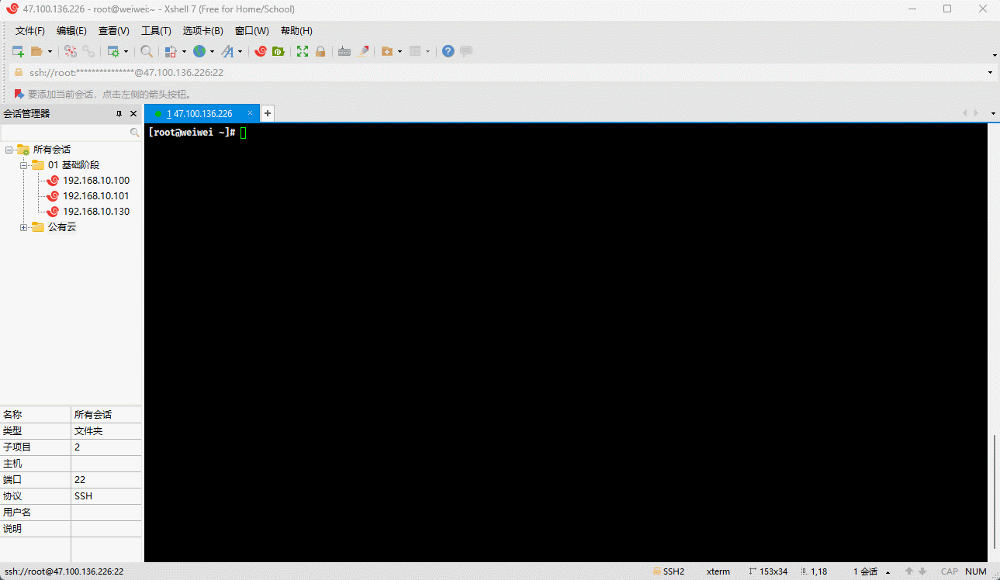

* 关闭 SELinux：

```shell
getenforce # 查看 SELinux 是否开启
cat /etc/selinux/config # 查看 SELinux 是否开启
sed -i 's/enforcing/disabled/' /etc/selinux/config # 永久关闭 SELinux ，需要重启
setenforce 0 # 关闭当前会话的 SELinux ，重启之后无效
cat /etc/selinux/config # 查看 SELinux 是否开启
```


* 关闭 swap 分区：

```shell
free -h # 查看 swap 分区是否存在
swapoff -a # 关闭当前会话的 swap ，重启之后无效
sed -ri 's/.*swap.*/#&/' /etc/fstab # 永久关闭 swap ，需要重启
free -h # 查看 swap 分区是否存在
```


### 2.3.2 安装

* 卸载旧版本：

```shell
dnf -y remove docker \
                  docker-client \
                  docker-client-latest \
                  docker-common \
                  docker-latest \
                  docker-latest-logrotate \
                  docker-logrotate \
                  docker-selinux \
                  docker-engine-selinux \
                  docker-engine
```


* 安装必备工具：

```shell
dnf -y install device-mapper-persistent-data lvm2
```


* 安装源：

```shell
dnf -y install dnf-plugins-core
```

```shell
dnf config-manager --add-repo \
	https://download.docker.com/linux/centos/docker-ce.repo # 国外
```

```shell
dnf config-manager \
	--add-repo \
	https://mirrors.aliyun.com/docker-ce/linux/centos/docker-ce.repo # 国内
```

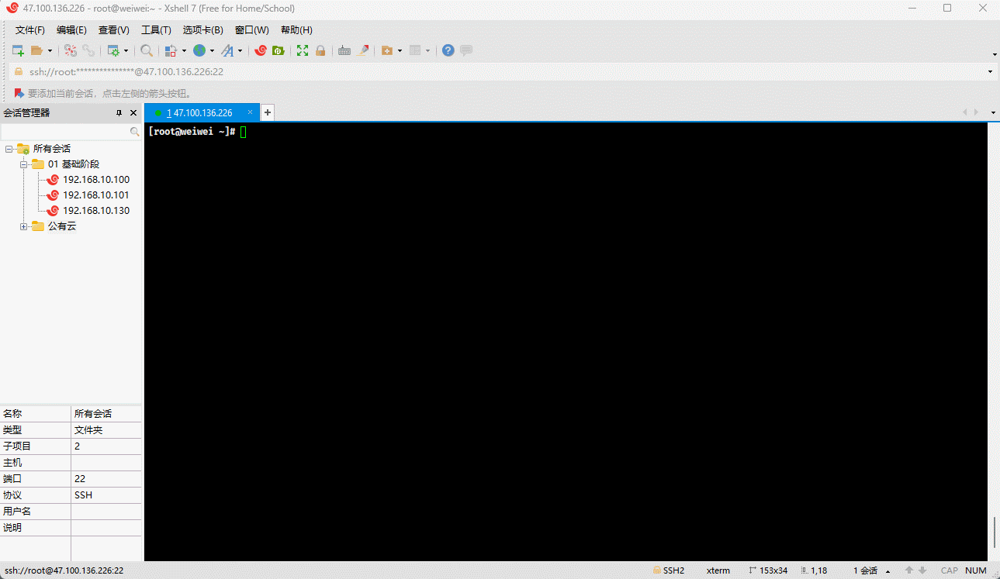

* 安装 Docker 和 Docker Compose （最新版）：

```shell
dnf -y install docker-ce \
	docker-ce-cli \
	containerd.io \
	docker-buildx-plugin \
	docker-compose-plugin
```

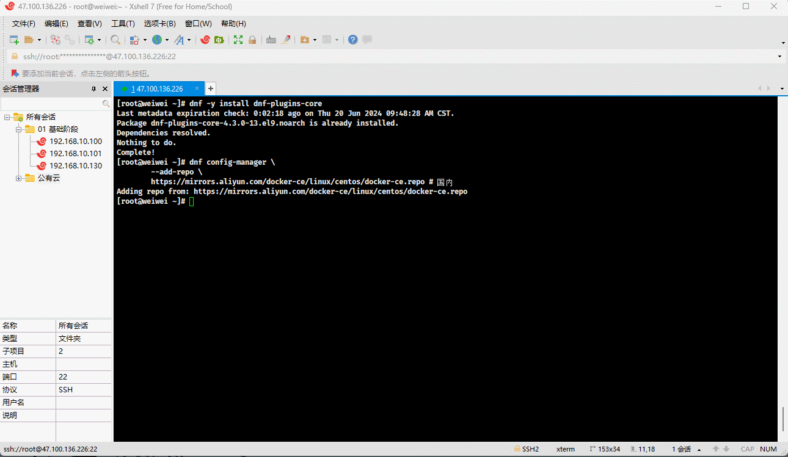

* 启动 Docker ：

```shell
systemctl enable --now docker # 启动 Docker 并设置开机自启
```


* 验证 Docker 是否安装成功：

```shell
docker version
```

```shell
systemctl status docker
```


* 设置必要参数：

```shell
mkdir -pv /etc/docker
```

```shell
tee /etc/docker/daemon.json <<-'EOF'
{
  "exec-opts": ["native.cgroupdriver=systemd"],	
  "registry-mirrors": [
    "https://du3ia00u.mirror.aliyuncs.com",
    "https://docker.lixd.xyz"
  ],
  "live-restore": true,
  "log-driver":"json-file",
  "log-opts": {"max-size":"500m", "max-file":"3"},
  "max-concurrent-downloads": 10,
  "max-concurrent-uploads": 5,
  "storage-driver": "overlay2"
}
EOF
```

```shell
systemctl daemon-reload \
	&& systemctl restart docker
```


* Docker 卸载（选做）：

```shell
systemctl disable --now docker docker.socket
```

```shell
dnf -y remove docker-ce \
	docker-ce-cli \
	containerd.io \
	docker-buildx-plugin \
	docker-compose-plugin \
	docker-ce-rootless-extras
```

```shell
rm -rf /var/lib/docker
rm -rf /var/lib/containerd
```


## 2.4 安装 Harbor

### 2.4.1 生成 docker-compose.yml 文件

* 下载源码：

```shell
mkdir -pv /usr/local/share/example
```

```shell
wget -P /usr/local/share/example https://github.com/goharbor/harbor/releases/download/v2.11.0/harbor-online-installer-v2.11.0.tgz 
```

> [!WARNING]
>
> * ① `harbor-online-installer-v2.11.0.tgz` 是在线版，即：不包含 Docker 镜像。
> * ② `harbor-offline-installer-v2.11.0.tgz`是离线版，即：包含 Docker 镜像（比在线版体积大）。

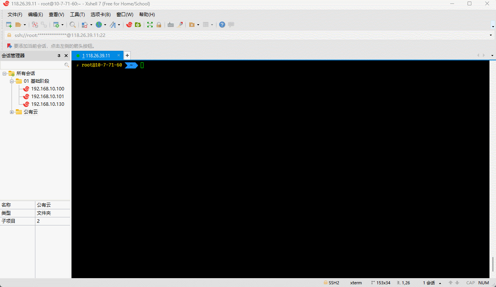

* 解压：

```shell
cd /usr/local/share/example
```

```shell
tar -xvf harbor-online-installer-v2.11.0.tgz 
```


* 编辑配置文件：

```shell
cd harbor
```

```shell
cp harbor.yml.tmpl harbor.yml
```

```shell
sed -i 's/^hostname: .*/hostname: harbor.aurorxa.com/' harbor.yml # 修改为指定域名，自己修改自己的域名
```

```shell
sed -i '/^https:/,/^$/ s/^\([^#]\)/#\1/' harbor.yml # 将 https 相关注释掉，由 Traefik 来设置
```

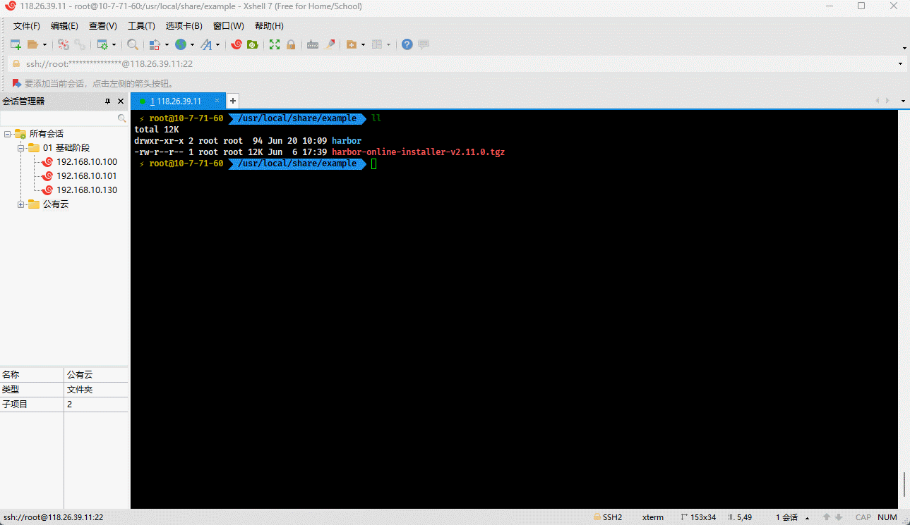

* 执行安装（其实就是下载镜像或将镜像文件导入到 Docker ，并生成 docker-compose.yml文件）：

```shell
bash install.sh # 如果上述的 harbor.yml 只要修改，就需要重新执行 bash install.sh
```


* 生成的 docker-compose.yml 文件的内容是：

```shell
cat docker-compose.yml
```

```yaml
version: '2.3' # 对于 docker compose v2 版本来说，该字段已经没有用了
services:
  log:
    image: goharbor/harbor-log:v2.11.0
    container_name: harbor-log
    restart: always
    cap_drop:
      - ALL
    cap_add:
      - CHOWN
      - DAC_OVERRIDE
      - SETGID
      - SETUID
    volumes:
      - /var/log/harbor/:/var/log/docker/:z
      - type: bind
        source: ./common/config/log/logrotate.conf
        target: /etc/logrotate.d/logrotate.conf
      - type: bind
        source: ./common/config/log/rsyslog_docker.conf
        target: /etc/rsyslog.d/rsyslog_docker.conf
    ports:
      - 127.0.0.1:1514:10514
    networks:
      - harbor
  registry:
    image: goharbor/registry-photon:v2.11.0
    container_name: registry
    restart: always
    cap_drop:
      - ALL
    cap_add:
      - CHOWN
      - SETGID
      - SETUID
    volumes:
      - /data/registry:/storage:z
      - ./common/config/registry/:/etc/registry/:z
      - type: bind
        source: /data/secret/registry/root.crt
        target: /etc/registry/root.crt
      - type: bind
        source: ./common/config/shared/trust-certificates
        target: /harbor_cust_cert
    networks:
      - harbor
    depends_on:
      - log
    logging:
      driver: "syslog"
      options:
        syslog-address: "tcp://localhost:1514"
        tag: "registry"
  registryctl:
    image: goharbor/harbor-registryctl:v2.11.0
    container_name: registryctl
    env_file:
      - ./common/config/registryctl/env
    restart: always
    cap_drop:
      - ALL
    cap_add:
      - CHOWN
      - SETGID
      - SETUID
    volumes:
      - /data/registry:/storage:z
      - ./common/config/registry/:/etc/registry/:z
      - type: bind
        source: ./common/config/registryctl/config.yml
        target: /etc/registryctl/config.yml
      - type: bind
        source: ./common/config/shared/trust-certificates
        target: /harbor_cust_cert
    networks:
      - harbor
    depends_on:
      - log
    logging:
      driver: "syslog"
      options:
        syslog-address: "tcp://localhost:1514"
        tag: "registryctl"
  postgresql:
    image: goharbor/harbor-db:v2.11.0
    container_name: harbor-db
    restart: always
    cap_drop:
      - ALL
    cap_add:
      - CHOWN
      - DAC_OVERRIDE
      - SETGID
      - SETUID
    volumes:
      - /data/database:/var/lib/postgresql/data:z
    networks:
      harbor:
    env_file:
      - ./common/config/db/env
    depends_on:
      - log
    logging:
      driver: "syslog"
      options:
        syslog-address: "tcp://localhost:1514"
        tag: "postgresql"
    shm_size: '1gb'
  core:
    image: goharbor/harbor-core:v2.11.0
    container_name: harbor-core
    env_file:
      - ./common/config/core/env
    restart: always
    cap_drop:
      - ALL
    cap_add:
      - SETGID
      - SETUID
    volumes:
      - /data/ca_download/:/etc/core/ca/:z
      - /data/:/data/:z
      - ./common/config/core/certificates/:/etc/core/certificates/:z
      - type: bind
        source: ./common/config/core/app.conf
        target: /etc/core/app.conf
      - type: bind
        source: /data/secret/core/private_key.pem
        target: /etc/core/private_key.pem
      - type: bind
        source: /data/secret/keys/secretkey
        target: /etc/core/key
      - type: bind
        source: ./common/config/shared/trust-certificates
        target: /harbor_cust_cert
    networks:
      harbor:
    depends_on:
      - log
      - registry
      - redis
      - postgresql
    logging:
      driver: "syslog"
      options:
        syslog-address: "tcp://localhost:1514"
        tag: "core"
  portal:
    image: goharbor/harbor-portal:v2.11.0
    container_name: harbor-portal
    restart: always
    cap_drop:
      - ALL
    cap_add:
      - CHOWN
      - SETGID
      - SETUID
      - NET_BIND_SERVICE
    volumes:
      - type: bind
        source: ./common/config/portal/nginx.conf
        target: /etc/nginx/nginx.conf
    networks:
      - harbor
    depends_on:
      - log
    logging:
      driver: "syslog"
      options:
        syslog-address: "tcp://localhost:1514"
        tag: "portal"

  jobservice:
    image: goharbor/harbor-jobservice:v2.11.0
    container_name: harbor-jobservice
    env_file:
      - ./common/config/jobservice/env
    restart: always
    cap_drop:
      - ALL
    cap_add:
      - CHOWN
      - SETGID
      - SETUID
    volumes:
      - /data/job_logs:/var/log/jobs:z
      - type: bind
        source: ./common/config/jobservice/config.yml
        target: /etc/jobservice/config.yml
      - type: bind
        source: ./common/config/shared/trust-certificates
        target: /harbor_cust_cert
    networks:
      - harbor
    depends_on:
      - core
    logging:
      driver: "syslog"
      options:
        syslog-address: "tcp://localhost:1514"
        tag: "jobservice"
  redis:
    image: goharbor/redis-photon:v2.11.0
    container_name: redis
    restart: always
    cap_drop:
      - ALL
    cap_add:
      - CHOWN
      - SETGID
      - SETUID
    volumes:
      - /data/redis:/var/lib/redis
    networks:
      harbor:
    depends_on:
      - log
    logging:
      driver: "syslog"
      options:
        syslog-address: "tcp://localhost:1514"
        tag: "redis"
  proxy:
    image: goharbor/nginx-photon:v2.11.0
    container_name: nginx
    restart: always
    cap_drop:
      - ALL
    cap_add:
      - CHOWN
      - SETGID
      - SETUID
      - NET_BIND_SERVICE
    volumes:
      - ./common/config/nginx:/etc/nginx:z
      - type: bind
        source: ./common/config/shared/trust-certificates
        target: /harbor_cust_cert
    networks:
      - harbor
    ports:
      - 80:8080
    depends_on:
      - registry
      - core
      - portal
      - log
    logging:
      driver: "syslog"
      options:
        syslog-address: "tcp://localhost:1514"
        tag: "proxy"
networks:
  harbor:
    external: false
```

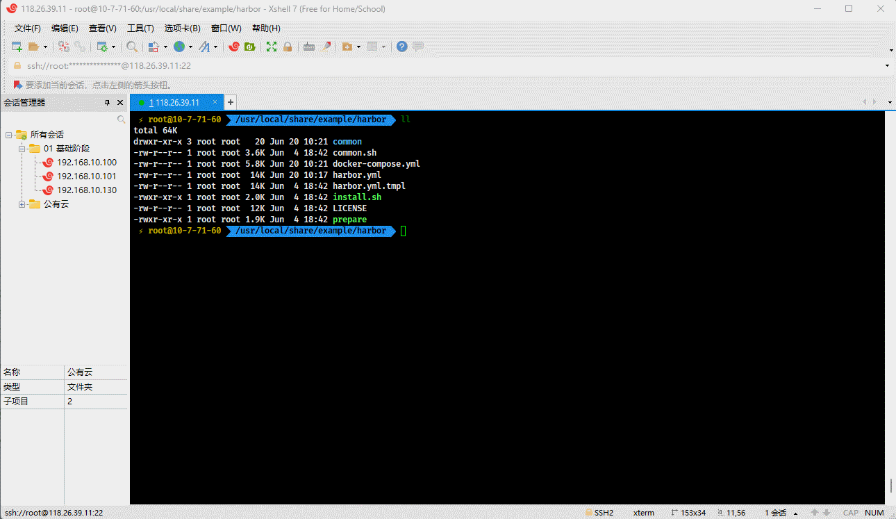

### 2.4.2 使用 Traefik 来代理 Harbor 的流量

* 停止 Harbor 服务：

```shell
docker compose down --volumes
```

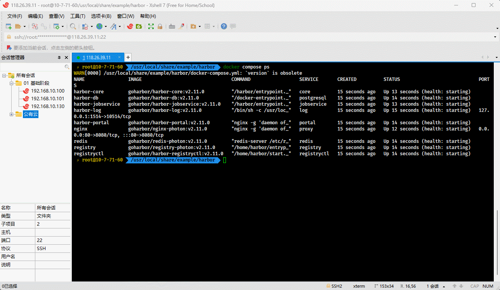

* 编辑 docker-compose.yml 文件：

```shell
vim docker-compose.yml
```

```yaml
version: '2.3'
services:
  traefik:
    image: traefik:v2.11
    command: # 设置 Traefik 作为反向代理，并且配置了 HTTP 到 HTTPS 的重定向和自动获取 TLS 证书。
      - "--log.level=DEBUG" # 设置日志级别为 DEBUG，便于调试。
      - "--api.insecure=true" # 启用不安全的 API，使得 Traefik 的仪表板可以通过 HTTP 访问。
      - "--providers.docker=true" # 启用 Docker 提供者，使 Traefik 能够从 Docker 中发现服务。
      - "--providers.docker.exposedbydefault=false" # 默认情况下不暴露 Docker 服务，只有明确标记的服务才会暴露。
      - "--entrypoints.websecure.transport.respondingTimeouts.readTimeout=180000" # 防止客户端超时
      - "--entrypoints.websecure.transport.respondingTimeouts.writeTimeout=180000" # 防止客户端超时
      - "--entrypoints.websecure.transport.respondingTimeouts.readTimeout=180000" # 防止客户端超时   
      - "--entrypoints.web.address=:80" # 配置 HTTP 入口点监听 80 端口。
      - "--entrypoints.websecure.address=:443" # 配置 HTTPS 入口点监听 443 端口。
      - "--entrypoints.web.http.redirections.entryPoint.to=websecure" # 将所有 HTTP 请求重定向到 HTTPS。
      - "--entrypoints.web.http.redirections.entryPoint.scheme=https" # 明确指定重定向到 HTTPS。
      - "--certificatesresolvers.myresolver.acme.tlschallenge=true" # 启用 ACME TLS 挑战，以自动获取 TLS 证书。
      - "--certificatesresolvers.myresolver.acme.email=1900919313@qq.com" # 指定 ACME 注册的电子邮件地址。
      - "--certificatesresolvers.myresolver.acme.storage=/letsencrypt/acme.json" # 指定存储 ACME 证书数据的位置。
    ports:
      - "80:80" # 将主机的 80 端口映射到容器的 80 端口，用于 HTTP。
      - "443:443" # 将主机的 443 端口映射到容器的 443 端口，用于 HTTPS。
    volumes:
      - "/var/run/docker.sock:/var/run/docker.sock" # 将 Docker 套接字挂载到容器中，使 Traefik 可以与 Docker 引擎通信。
      - "./letsencrypt:/letsencrypt" # 将本地的 letsencrypt 目录挂载到容器的 /letsencrypt，用于存储 ACME 证书数据。
    restart: always
    networks:
      - traefik # 加入 traefik 网络，使 Traefik 能够与其他服务进行通信。
      - harbor # 加入 harbor 网络，确保 Traefik 可以与 Harbor 服务通信。
  log:
    image: goharbor/harbor-log:v2.11.0
    container_name: harbor-log
    restart: always
    cap_drop:
      - ALL
    cap_add:
      - CHOWN
      - DAC_OVERRIDE
      - SETGID
      - SETUID
    volumes:
      - /var/log/harbor/:/var/log/docker/:z
      - type: bind
        source: ./common/config/log/logrotate.conf
        target: /etc/logrotate.d/logrotate.conf
      - type: bind
        source: ./common/config/log/rsyslog_docker.conf
        target: /etc/rsyslog.d/rsyslog_docker.conf
    ports:
      - 127.0.0.1:1514:10514
    networks:
      - harbor
  registry:
    image: goharbor/registry-photon:v2.11.0
    container_name: registry
    restart: always
    cap_drop:
      - ALL
    cap_add:
      - CHOWN
      - SETGID
      - SETUID
    volumes:
      - /data/registry:/storage:z
      - ./common/config/registry/:/etc/registry/:z
      - type: bind
        source: /data/secret/registry/root.crt
        target: /etc/registry/root.crt
      - type: bind
        source: ./common/config/shared/trust-certificates
        target: /harbor_cust_cert
    networks:
      - harbor
    depends_on:
      - log
    logging:
      driver: "syslog"
      options:
        syslog-address: "tcp://localhost:1514"
        tag: "registry"
  registryctl:
    image: goharbor/harbor-registryctl:v2.11.0
    container_name: registryctl
    env_file:
      - ./common/config/registryctl/env
    restart: always
    cap_drop:
      - ALL
    cap_add:
      - CHOWN
      - SETGID
      - SETUID
    volumes:
      - /data/registry:/storage:z
      - ./common/config/registry/:/etc/registry/:z
      - type: bind
        source: ./common/config/registryctl/config.yml
        target: /etc/registryctl/config.yml
      - type: bind
        source: ./common/config/shared/trust-certificates
        target: /harbor_cust_cert
    networks:
      - harbor
    depends_on:
      - log
    logging:
      driver: "syslog"
      options:
        syslog-address: "tcp://localhost:1514"
        tag: "registryctl"
  postgresql:
    image: goharbor/harbor-db:v2.11.0
    container_name: harbor-db
    restart: always
    cap_drop:
      - ALL
    cap_add:
      - CHOWN
      - DAC_OVERRIDE
      - SETGID
      - SETUID
    volumes:
      - /data/database:/var/lib/postgresql/data:z
    networks:
      harbor:
    env_file:
      - ./common/config/db/env
    depends_on:
      - log
    logging:
      driver: "syslog"
      options:
        syslog-address: "tcp://localhost:1514"
        tag: "postgresql"
    shm_size: '1gb'
  core:
    image: goharbor/harbor-core:v2.11.0
    container_name: harbor-core
    env_file:
      - ./common/config/core/env
    restart: always
    cap_drop:
      - ALL
    cap_add:
      - SETGID
      - SETUID
    volumes:
      - /data/ca_download/:/etc/core/ca/:z
      - /data/:/data/:z
      - ./common/config/core/certificates/:/etc/core/certificates/:z
      - type: bind
        source: ./common/config/core/app.conf
        target: /etc/core/app.conf
      - type: bind
        source: /data/secret/core/private_key.pem
        target: /etc/core/private_key.pem
      - type: bind
        source: /data/secret/keys/secretkey
        target: /etc/core/key
      - type: bind
        source: ./common/config/shared/trust-certificates
        target: /harbor_cust_cert
    networks:
      harbor:
    depends_on:
      - log
      - registry
      - redis
      - postgresql
    logging:
      driver: "syslog"
      options:
        syslog-address: "tcp://localhost:1514"
        tag: "core"
  portal:
    image: goharbor/harbor-portal:v2.11.0
    container_name: harbor-portal
    restart: always
    cap_drop:
      - ALL
    cap_add:
      - CHOWN
      - SETGID
      - SETUID
      - NET_BIND_SERVICE
    volumes:
      - type: bind
        source: ./common/config/portal/nginx.conf
        target: /etc/nginx/nginx.conf
    networks:
      - harbor
    depends_on:
      - log
    logging:
      driver: "syslog"
      options:
        syslog-address: "tcp://localhost:1514"
        tag: "portal"

  jobservice:
    image: goharbor/harbor-jobservice:v2.11.0
    container_name: harbor-jobservice
    env_file:
      - ./common/config/jobservice/env
    restart: always
    cap_drop:
      - ALL
    cap_add:
      - CHOWN
      - SETGID
      - SETUID
    volumes:
      - /data/job_logs:/var/log/jobs:z
      - type: bind
        source: ./common/config/jobservice/config.yml
        target: /etc/jobservice/config.yml
      - type: bind
        source: ./common/config/shared/trust-certificates
        target: /harbor_cust_cert
    networks:
      - harbor
    depends_on:
      - core
    logging:
      driver: "syslog"
      options:
        syslog-address: "tcp://localhost:1514"
        tag: "jobservice"
  redis:
    image: goharbor/redis-photon:v2.11.0
    container_name: redis
    restart: always
    cap_drop:
      - ALL
    cap_add:
      - CHOWN
      - SETGID
      - SETUID
    volumes:
      - /data/redis:/var/lib/redis
    networks:
      harbor:
    depends_on:
      - log
    logging:
      driver: "syslog"
      options:
        syslog-address: "tcp://localhost:1514"
        tag: "redis"
  proxy:
    image: goharbor/nginx-photon:v2.11.0
    container_name: nginx
    restart: always
    cap_drop:
      - ALL
    cap_add:
      - CHOWN
      - SETGID
      - SETUID
      - NET_BIND_SERVICE
    labels: # 将 http://harbor.aurorxa.com 的请求重定向到 https://harbor.aurorxa.com，通过 https://harbor.aurorxa.com 访问 Harbor 服务，该请求将被路由到目标容器的 8080 端口。
      - "traefik.enable=true" # 启用 traefik 代理服务
      - "traefik.http.routers.harbor.rule=Host(`harbor.aurorxa.com`)" # 定义了一个名为 harbor 的 HTTP 路由器，其规则是当请求的主机名为 harbor.aurorxa.com 时，匹配该路由器。
      - "traefik.http.routers.harbor.entrypoints=websecure" # 指定 harbor 路由器使用 websecure 入口点（即 HTTPS 入口点）。
      - "traefik.http.routers.harbor.tls.certresolver=myresolver" # 指定 harbor 路由器使用名为 myresolver 的证书解析器来获取 TLS 证书。
      - "traefik.http.services.harbor.loadbalancer.server.port=8080" # 定义了一个名为 harbor 的服务，其负载均衡器将流量转发到目标容器的 8080 端口。
      - "traefik.http.routers.http-catchall.rule=HostRegexp(`{host:.+}`)" # 定义了一个名为 http-catchall 的 HTTP 路由器，其规则是匹配所有主机名。这是一个通配符规则，匹配所有进入的 HTTP 请求。
      - "traefik.http.routers.http-catchall.entrypoints=web" # 指定 http-catchall 路由器使用 web 入口点（即 HTTP 入口点）。
      - "traefik.http.middlewares.redirect-to-https.redirectscheme.scheme=https" # 定义了一个名为 redirect-to-https 的中间件，将请求重定向到 HTTPS。
      - "traefik.http.routers.http-catchall.middlewares=redirect-to-https" # 将 redirect-to-https 中间件应用到 http-catchall 路由器上，使所有通过 http-catchall 路由器的 HTTP 请求都被重定向到 HTTPS。
    volumes:
      - ./common/config/nginx:/etc/nginx:z
      - type: bind
        source: ./common/config/shared/trust-certificates
        target: /harbor_cust_cert
    networks:
      - harbor
      - traefik  
    ports:
      - "8080:8080" # 确保代理服务在内部使用 8080 端口
    depends_on:
      - registry
      - core
      - portal
      - log
    logging:
      driver: "syslog"
      options:
        syslog-address: "tcp://localhost:1514"
        tag: "proxy"
networks:
  traefik:
    driver: bridge
    # external: true
  harbor:
    external: false
    driver: bridge

```

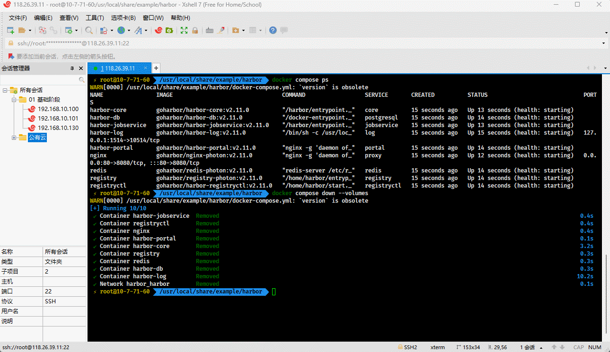

* 启动并查看日志（耐心等待...）：

```shell
docker compose down \
	&& docker system prune -af \
	&& docker compose up -d && \
	docker compose logs -f
```

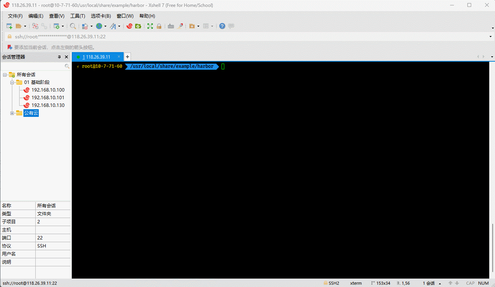

* 通过浏览器访问：

```shell
harbor.aurorxa.com 
```

> [!WARNING]
>
> * ① 上面配置的域名，每个人不一样；最好走隐私模式，防止缓存。
> * ② 默认的用户名是 `admin`，密码是 `Harbor12345`。

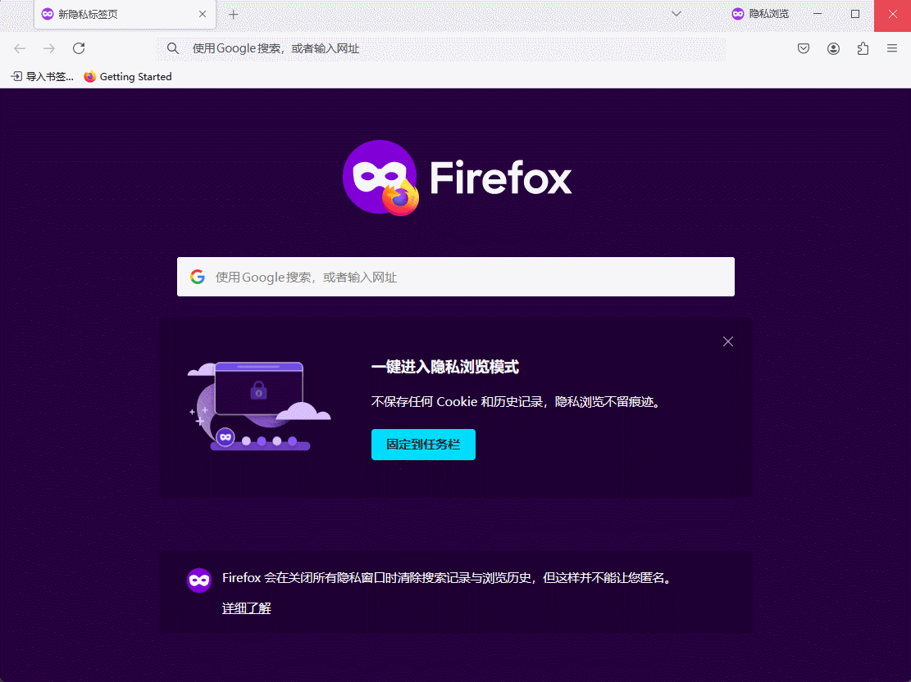

### 2.4.3 配置镜像代理

* 在`仓库管理`中，新建要代理的`目标仓库`：

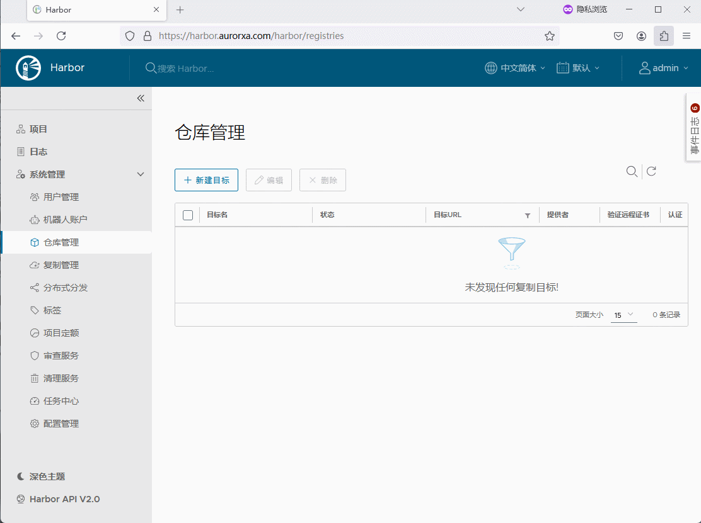

* 在`项目`中，新建一个用于代理的`项目`。

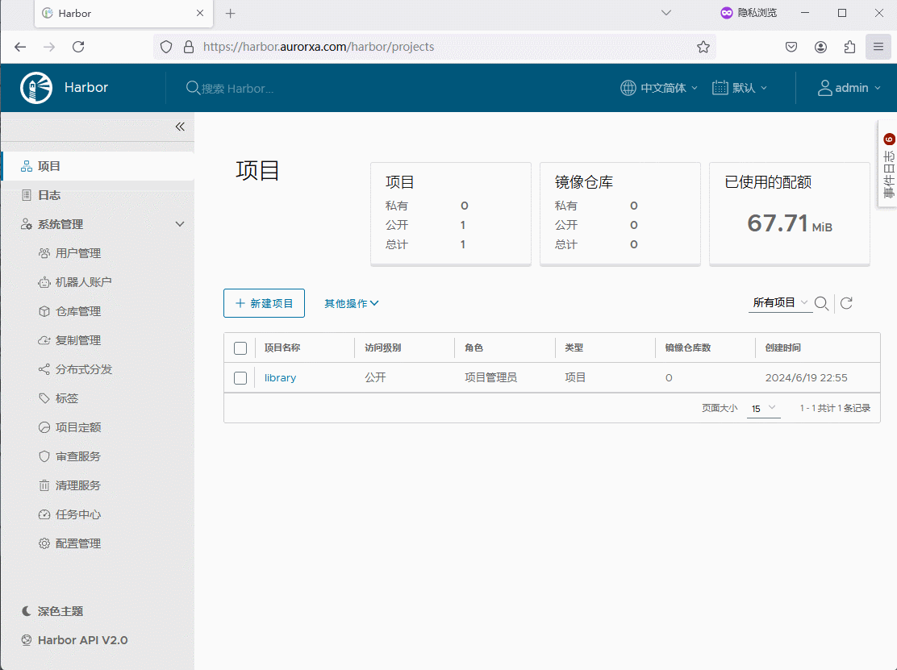

* 配置项目的策略（是否需要缓存 Docker 镜像等）：

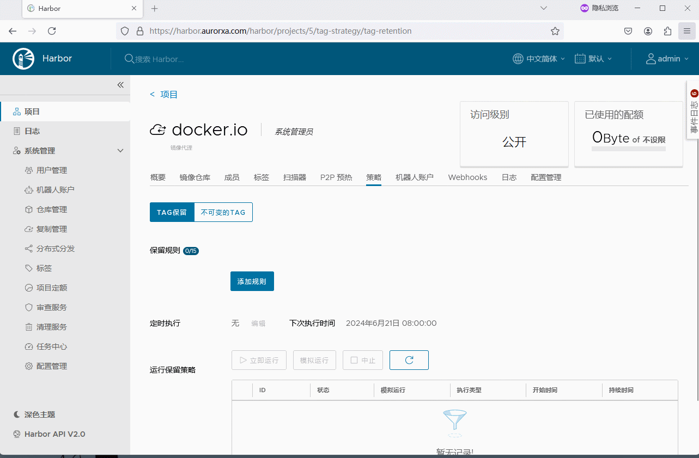

### 2.4.4 Docker 客户端登录，并拉取镜像

* Docker 客户端登录：

```shell
echo "Harbor12345" | docker login -u admin --password-stdin harbor.aurorxa.com
```

> [!NOTE]
>
> 因为设置的 `docker.io` 项目是公开，我们其实可以不登录的。

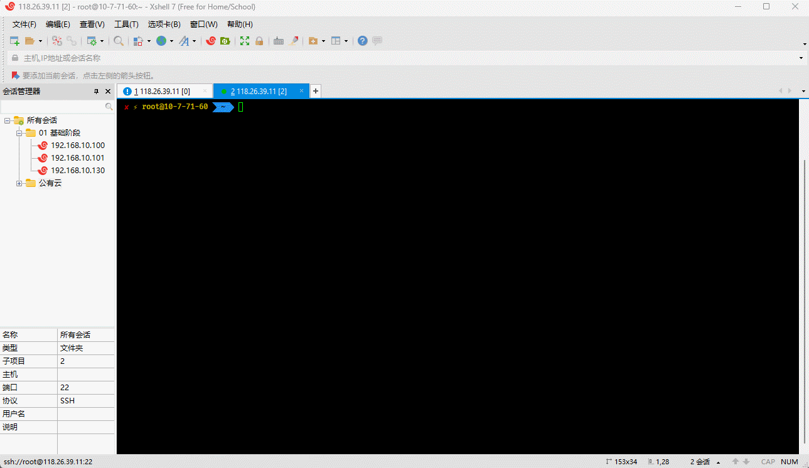

* 拉取镜像：

```shell
docker pull harbor.aurorxa.com/docker.io/alpine
```

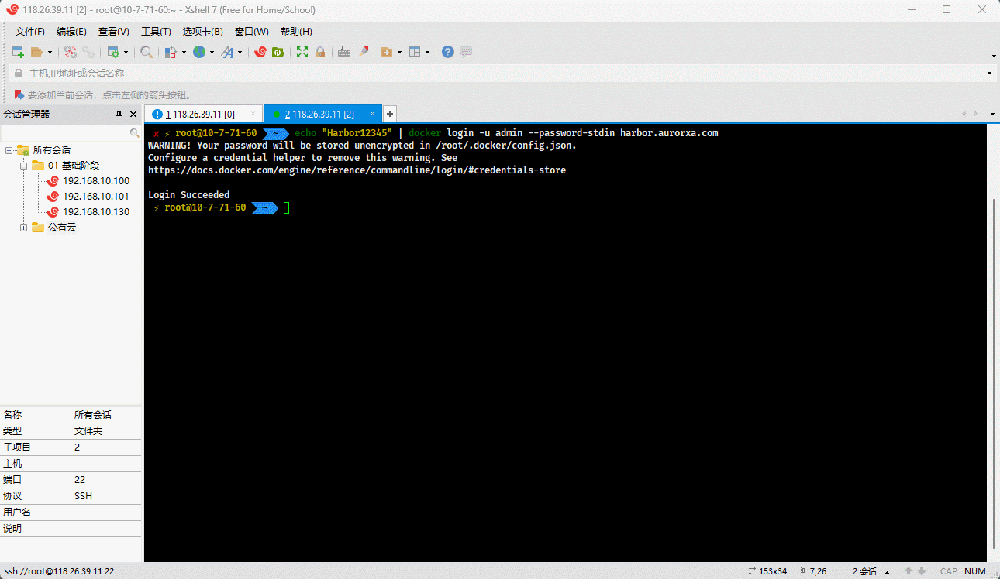

* 通过页面，查看是否缓存成功：

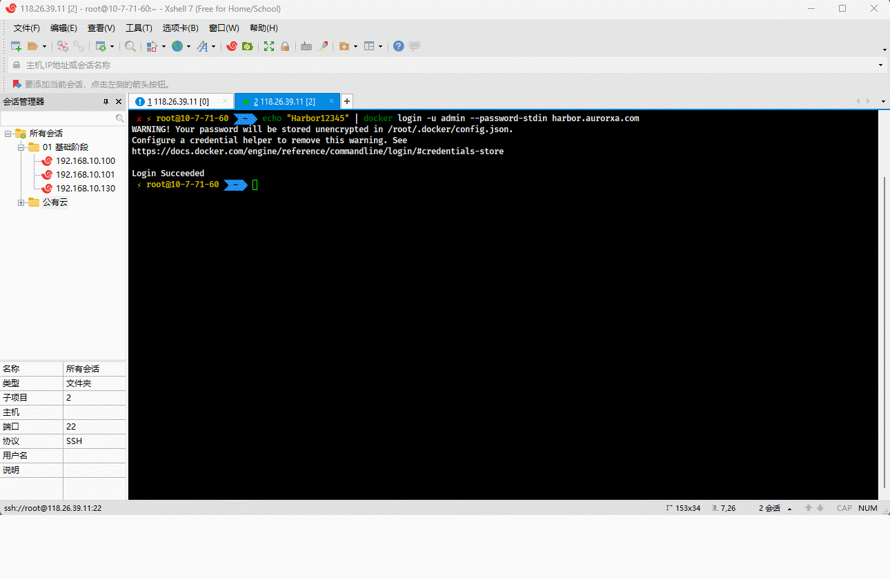